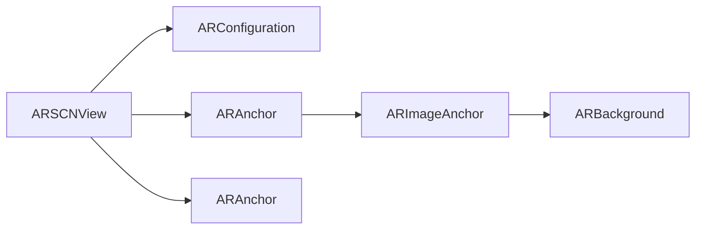

                 

# iOS 进阶：Apple 设计原则和 ARKit

随着增强现实（AR）技术的日渐成熟，Apple 的 ARKit 框架已成为开发增强现实应用的首选工具。本文将深入探讨 Apple 的设计原则，并详细介绍如何使用 ARKit 框架进行增强现实应用开发，以期为广大开发者提供一份全面、系统的 iOS 进阶指南。

## 1. 背景介绍

### 1.1 问题由来

增强现实（AR）技术是近年来迅速发展的技术领域之一，它将虚拟信息与现实世界相结合，为人类提供了全新的交互方式。Apple 的 ARKit 框架自2017年发布以来，一直是 iOS 开发者开发增强现实应用的首选工具。然而，随着 AR 应用的日益普及，如何更好地遵循 Apple 的设计原则，利用 ARKit 框架开发出既美观又实用的 AR 应用，成为了众多开发者面临的问题。

### 1.2 问题核心关键点

为了解决这个问题，本文将深入分析 Apple 的设计原则，并详细阐述如何使用 ARKit 框架进行增强现实应用开发。核心关键点包括：

- **遵循 Apple 设计原则**：了解 Apple 的设计原则，如何在开发过程中遵循这些原则。
- **使用 ARKit 框架**：掌握 ARKit 框架的核心组件和使用方法。
- **实现增强现实应用**：通过具体示例，展示如何使用 ARKit 框架开发增强现实应用。

通过深入理解这些关键点，开发者可以更好地遵循 Apple 的设计原则，利用 ARKit 框架开发出美观、实用的增强现实应用。

## 2. 核心概念与联系

### 2.1 核心概念概述

Apple 的设计原则主要体现在以下几个方面：

- **简洁性（Simplicity）**：注重简洁的设计风格，避免复杂性和冗余性。
- **一致性（Consistency）**：在所有应用和界面元素中保持一致的设计风格和交互方式。
- **反馈（Feedback）**：在用户与系统交互时，及时提供反馈，让用户了解当前状态。
- **清晰度（Clarity）**：确保界面元素和交互方式清晰易懂，让用户能够轻松完成任务。

ARKit 框架是 Apple 为 iOS 平台提供的增强现实开发工具，提供了丰富的功能和组件，帮助开发者轻松创建和部署增强现实应用。核心组件包括：

- **ARSCNView**：ARKit 框架的核心视图，用于显示增强现实场景。
- **ARConfiguration**：用于配置 AR 环境的参数。
- **ARAnchor**：用于定位增强现实对象的空间位置。
- **ARImageAnchor**：用于识别和定位平面图像。
- **ARBackground**：用于控制增强现实场景的背景。

这些组件在 ARKit 框架中扮演着关键角色，是开发者构建增强现实应用的基础。

### 2.2 核心概念原理和架构的 Mermaid 流程图



## 3. 核心算法原理 & 具体操作步骤

### 3.1 算法原理概述

ARKit 框架的核心算法原理基于计算机视觉和机器学习技术，通过摄像头获取实时图像数据，使用机器学习模型识别和定位增强现实对象。其工作流程如下：

1. 通过摄像头获取实时图像数据。
2. 使用机器学习模型识别和定位增强现实对象。
3. 将增强现实对象渲染到 ARSCNView 视图中，并与现实世界进行叠加。
4. 根据用户交互行为，实时更新增强现实对象的位置和状态。

### 3.2 算法步骤详解

以下是使用 ARKit 框架开发增强现实应用的详细步骤：

#### 3.2.1 环境准备

1. 打开 Xcode 项目，创建一个新的 iOS 应用项目。
2. 选择 iOS 平台的 ARKit 模板。
3. 配置项目属性，如bundle ID、Build Settings等。

#### 3.2.2 配置 AR 环境

1. 创建 `ARConfiguration` 对象，设置 AR 环境参数。
2. 创建 `ARBackground` 对象，设置增强现实场景的背景。
3. 将 `ARConfiguration` 和 `ARBackground` 对象添加到 `ARSCNView` 视图中。

#### 3.2.3 识别和定位增强现实对象

1. 创建 `ARAnchor` 对象，用于定位增强现实对象。
2. 创建 `ARImageAnchor` 对象，用于识别和定位平面图像。
3. 将 `ARAnchor` 和 `ARImageAnchor` 对象添加到 `ARSCNView` 视图中。

#### 3.2.4 渲染增强现实对象

1. 创建增强现实对象的模型，并加载到内存中。
2. 将模型渲染到 `ARSCNView` 视图中，与现实世界进行叠加。

#### 3.2.5 用户交互

1. 监听用户交互行为，如手势、触摸等。
2. 根据用户交互行为，实时更新增强现实对象的位置和状态。

#### 3.2.6 调试和优化

1. 使用调试工具，检查增强现实应用中的错误和性能问题。
2. 根据调试结果，优化增强现实应用的性能和用户体验。

### 3.3 算法优缺点

ARKit 框架的主要优点包括：

- **简单易用**：ARKit 框架提供了丰富的功能和组件，开发者可以快速上手，创建增强现实应用。
- **跨平台支持**：ARKit 框架支持 iOS 和 macOS 平台，开发者可以在多个设备上发布应用。
- **性能优化**：ARKit 框架使用硬件加速，可以提供流畅的增强现实体验。

然而，ARKit 框架也存在一些缺点：

- **资源消耗大**：增强现实应用通常需要大量计算资源，特别是在高帧率和高分辨率下。
- **依赖硬件**：ARKit 框架依赖设备摄像头和传感器等硬件设备，设备限制较多。
- **设备兼容性**：不同设备的传感器和摄像头性能差异较大，可能影响增强现实应用的表现。

### 3.4 算法应用领域

ARKit 框架在多个领域都有广泛的应用，包括但不限于：

- **教育**：创建虚拟实验室、虚拟课堂等增强现实应用，提升教学效果。
- **娱乐**：开发虚拟现实游戏、虚拟试穿等增强现实应用，提供沉浸式体验。
- **房地产**：展示虚拟家居、虚拟房屋等增强现实应用，帮助用户进行房产评估和规划。
- **医疗**：开发虚拟手术、虚拟康复等增强现实应用，辅助医疗诊断和治疗。

## 4. 数学模型和公式 & 详细讲解 & 举例说明

### 4.1 数学模型构建

ARKit 框架的数学模型主要基于计算机视觉和机器学习技术，包括以下几个核心组件：

- **摄像头模型**：用于获取实时图像数据，模型参数为摄像头的位置和方向。
- **机器学习模型**：用于识别和定位增强现实对象，模型参数为特征提取器和分类器。
- **渲染模型**：用于将增强现实对象渲染到 ARSCNView 视图中，模型参数为模型的位置和旋转。

### 4.2 公式推导过程

以下是 ARKit 框架中常用的数学公式和推导过程：

1. **摄像头投影模型**：

$$
\mathbf{P} = K[\mathbf{R}|_{\mathbf{T}}\mathbf{V}]
$$

其中，$K$ 为摄像头内参矩阵，$\mathbf{R}$ 为摄像头旋转矩阵，$\mathbf{V}$ 为摄像机视图矩阵，$\mathbf{T}$ 为摄像机平移向量。

2. **特征提取器模型**：

$$
\mathbf{d} = f(\mathbf{I}, \mathbf{R}, \mathbf{T})
$$

其中，$\mathbf{d}$ 为特征向量，$\mathbf{I}$ 为输入图像，$\mathbf{R}$ 为旋转矩阵，$\mathbf{T}$ 为平移向量。

3. **分类器模型**：

$$
\mathbf{y} = g(\mathbf{d})
$$

其中，$\mathbf{y}$ 为分类结果，$\mathbf{d}$ 为特征向量。

### 4.3 案例分析与讲解

假设我们希望开发一个增强现实应用，用于识别和定位平面图像。步骤如下：

1. 通过摄像头获取实时图像数据，使用摄像头投影模型计算图像在三维空间中的位置和方向。
2. 使用机器学习模型识别图像中的特征点，并将特征点转换为特征向量。
3. 使用分类器模型将特征向量分类，确定图像所属的类别。
4. 根据分类结果，创建增强现实对象，并使用渲染模型将其渲染到 ARSCNView 视图中。

## 5. 项目实践：代码实例和详细解释说明

### 5.1 开发环境搭建

1. 打开 Xcode，创建一个新的 iOS 应用项目。
2. 选择 iOS 平台的 ARKit 模板。
3. 配置项目属性，如bundle ID、Build Settings等。

### 5.2 源代码详细实现

以下是一个简单的 ARKit 增强现实应用示例代码：

```swift
import UIKit
import ARKit

class ViewController: UIViewController, ARSCNViewDelegate {
    
    @IBOutlet weak var arView: ARSCNView!
    
    override func viewDidLoad() {
        super.viewDidLoad()
        arView.delegate = self
        arView.device = ARDevice.current!
        arView.scene = SCNScene()
        arView.autoRotateToDeviceOrientation = true
        arView.showsStatistics = true
    }
    
    // 创建 ARConfiguration 对象，设置 AR 环境参数
    func createARConfiguration() {
        guard let arConfiguration = ARConfiguration() else {
            return
        }
        arConfiguration.anchors = []
        arView.session.run(arConfiguration)
    }
    
    // 创建 ARAnchor 对象，用于定位增强现实对象
    func createARAnchor(_ anchor: ARAnchor) {
        arView.scene.rootNode.addChildNode(anchor.nodes[0] as SCNNode)
    }
    
    // 创建 ARImageAnchor 对象，用于识别和定位平面图像
    func createARImageAnchor(_ image: UIImage) {
        guard let anchor = ARImageAnchor(image: image) else {
            return
        }
        createARAnchor(anchor)
    }
    
    // 渲染增强现实对象
    func renderARObject(_ model: SCNNode) {
        arView.scene.rootNode.addChildNode(model)
    }
    
    // 监听用户交互行为
    override func touchesBegan(_ touches: Set<UITouch>, with event: UIEvent?) {
        // 获取用户触摸的屏幕位置
        let touchLocation = arView.pointOfView.position + arView.pointOfView.transform.inverted().mapPoint(touches.first!.location(in: arView))
        // 创建 ARAnchor 对象，用于定位增强现实对象
        createARAnchor(ARAnchor(anchorPoint: touchLocation))
    }
}
```

### 5.3 代码解读与分析

上述代码展示了如何使用 ARKit 框架开发增强现实应用。以下是关键代码的解读与分析：

- `createARConfiguration()` 函数：用于创建 `ARConfiguration` 对象，设置 AR 环境参数，并运行 AR 会话。
- `createARAnchor(_:)` 函数：用于创建 `ARAnchor` 对象，将增强现实对象添加到场景中。
- `createARImageAnchor(_:)` 函数：用于创建 `ARImageAnchor` 对象，识别和定位平面图像，并创建 `ARAnchor` 对象。
- `renderARObject(_:)` 函数：用于渲染增强现实对象，将其添加到场景中。
- `touchesBegan(_:with:)` 函数：用于监听用户触摸行为，创建 `ARAnchor` 对象，将增强现实对象添加到场景中。

## 6. 实际应用场景

### 6.1 智能家居控制

增强现实应用在智能家居控制领域有着广泛的应用。例如，用户可以通过 AR 眼镜在房间中虚拟定位家电设备，并通过手势控制家电开关。

### 6.2 实时导航

增强现实应用可以用于实时导航，通过摄像头获取用户周围环境，并提供实时路径规划。例如，在购物中心中，用户可以通过 AR 眼镜查看商品位置，并实时导航到目的地。

### 6.3 虚拟试穿

增强现实应用可以用于虚拟试穿，帮助用户在虚拟环境中试穿服装和饰品，提升购物体验。例如，用户可以通过 AR 眼镜在虚拟环境中试穿衣服，查看穿搭效果。

### 6.4 未来应用展望

未来的增强现实应用将更加智能化和多样化。例如，随着混合现实（MR）技术的不断发展，增强现实应用将能够更好地融合虚拟和现实世界，提供更加沉浸式的体验。此外，随着人工智能技术的不断进步，增强现实应用将能够提供更加智能的交互和决策支持。

## 7. 工具和资源推荐

### 7.1 学习资源推荐

1. Apple 官方文档：Apple 提供了详细的 ARKit 框架文档，包括基础概念、API 参考和示例代码。
2. Ray Wenderlich 教程：Ray Wenderlich 网站提供了丰富的 ARKit 框架教程，涵盖基础和高级内容。
3. Udemy 课程：Udemy 提供了多个 ARKit 框架的课程，涵盖从基础到高级的内容。

### 7.2 开发工具推荐

1. Xcode：Apple 的开发工具，用于 iOS 应用开发。
2. ARKit 框架：Apple 提供的增强现实开发工具，用于开发增强现实应用。
3. Unity：跨平台的引擎，支持增强现实开发，提供了丰富的增强现实组件和插件。

### 7.3 相关论文推荐

1. "The ARKit Game - Complete AR Development"：详细介绍如何使用 ARKit 框架开发增强现实游戏。
2. "Augmented Reality with ARKit and Swift"：详细介绍如何使用 ARKit 框架开发增强现实应用，涵盖基础和高级内容。
3. "ARKit 增强现实应用开发实战"：详细介绍如何使用 ARKit 框架开发增强现实应用，提供丰富的示例代码和实际案例。

## 8. 总结：未来发展趋势与挑战

### 8.1 研究成果总结

本文详细介绍了 Apple 的设计原则和 ARKit 框架，并展示了如何使用 ARKit 框架开发增强现实应用。通过遵循 Apple 的设计原则，使用 ARKit 框架，开发者可以轻松创建美观、实用的增强现实应用，提升用户体验。

### 8.2 未来发展趋势

未来的增强现实技术将更加智能化和多样化，例如：

1. 混合现实技术将得到广泛应用，增强现实应用将能够更好地融合虚拟和现实世界。
2. 增强现实应用将能够提供更加智能的交互和决策支持。
3. 增强现实技术将与其他技术结合，形成更加全面的解决方案。

### 8.3 面临的挑战

增强现实技术仍面临一些挑战，例如：

1. 硬件设备限制：增强现实应用需要高性能硬件设备支持，设备成本较高。
2. 数据处理问题：增强现实应用需要大量计算资源，可能存在性能瓶颈。
3. 用户体验问题：增强现实应用需要更好的用户体验设计，避免视觉疲劳和操作复杂性。

### 8.4 研究展望

未来的研究需要从以下几个方面进行探索：

1. 提升硬件性能：开发更高性能的增强现实硬件设备，降低设备成本。
2. 优化算法性能：开发更加高效的计算机视觉和机器学习算法，提升增强现实应用的性能。
3. 提升用户体验：提升增强现实应用的交互设计和用户体验，使其更加自然和流畅。

## 9. 附录：常见问题与解答

### Q1: 什么是增强现实技术？

**A1:** 增强现实技术（AR）是一种将虚拟信息与现实世界相结合的技术，通过摄像头、传感器等设备获取现实世界信息，并添加虚拟元素，提供更加丰富的用户体验。

### Q2: 如何使用 ARKit 框架开发增强现实应用？

**A2:** 使用 ARKit 框架开发增强现实应用需要遵循以下步骤：
1. 创建 ARConfiguration 对象，设置 AR 环境参数。
2. 创建 ARAnchor 对象，用于定位增强现实对象。
3. 创建 ARImageAnchor 对象，用于识别和定位平面图像。
4. 渲染增强现实对象。
5. 监听用户交互行为，实时更新增强现实对象的位置和状态。

### Q3: 增强现实技术的主要应用场景有哪些？

**A3:** 增强现实技术的主要应用场景包括：
1. 智能家居控制。
2. 实时导航。
3. 虚拟试穿。
4. 虚拟实验室。
5. 虚拟课堂。

### Q4: 增强现实技术的未来发展趋势是什么？

**A4:** 增强现实技术的未来发展趋势包括：
1. 混合现实技术的广泛应用。
2. 增强现实应用的智能化和多样化。
3. 增强现实技术与其他技术的结合。

作者：禅与计算机程序设计艺术 / Zen and the Art of Computer Programming

