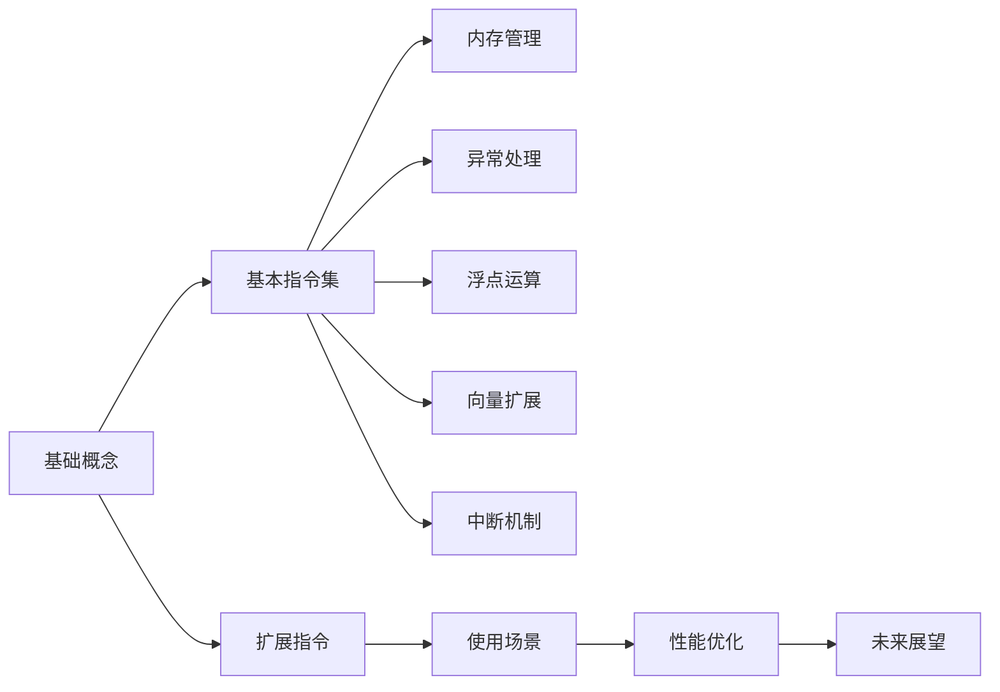

                 

## 1. 背景介绍

### 1.1 问题由来
随着计算机科学和信息技术的发展，现代计算机体系结构愈发复杂，微架构优化也在不断推陈出新。然而，这种趋势有时会导致程序执行效率低下。在众多优化技术中，汇编语言因其执行效率高、可控性强的特性，成为硬件级优化的首选。其中，RISC-V作为开源的指令集架构，因其性能卓越、功耗低廉等特点，日益成为硬件设计的热门选择。

### 1.2 问题核心关键点
RISC-V指令集架构由加州大学伯克利分校设计，以简单、可扩展、低功耗为设计目标，支持多种处理器设计。与传统x86架构相比，RISC-V的指令集更加简洁，设计更为灵活。但由于其架构复杂度较高，新开发者入门难度较大。针对这一问题，本文旨在提供RISC-V汇编语言程序设计的详细指南，帮助开发者快速入门，并深入理解其指令集。

## 2. 核心概念与联系

### 2.1 核心概念概述
RISC-V指令集架构（RISC-V Instruction Set Architecture）由加利福尼亚大学伯克利分校开发，其设计理念是采用RISC（精简指令集计算）架构，旨在提供一种高效、灵活、低成本的处理器设计方案。RISC-V架构具备以下特点：

- **可扩展性**：RISC-V架构支持通过扩展寄存器、内存模型、扩展指令等方式，轻松满足不同应用需求。
- **低功耗**：RISC-V设计简化，计算单元更加稀疏，有利于降低功耗。
- **开源性**：RISC-V架构完全公开，任何人都可以自由使用和修改，促进了硬件开源社区的发展。

### 2.2 核心概念原理和架构的 Mermaid 流程图


## 3. 核心算法原理 & 具体操作步骤

### 3.1 算法原理概述
RISC-V汇编语言程序设计涉及多个基础算法原理，包括指令编码、寄存器管理、内存寻址、中断处理等。理解这些算法原理是编写高效、可控汇编程序的前提。

### 3.2 算法步骤详解
RISC-V汇编程序的设计步骤包括：
1. **理解指令集**：学习RISC-V的指令集架构，了解各类指令的语义和用法。
2. **设计程序逻辑**：将程序逻辑转化为RISC-V指令，设计算法的实现。
3. **编写汇编程序**：根据设计好的程序逻辑，编写对应的汇编程序。
4. **测试和优化**：对编写的汇编程序进行测试，识别并优化性能瓶颈。
5. **部署和应用**：将优化后的程序部署到目标硬件上，进行实际应用。

### 3.3 算法优缺点
RISC-V汇编语言程序设计的优点包括：
- **执行效率高**：汇编程序直接操作硬件，执行效率高。
- **可控性强**：汇编程序易于控制，能够实现更复杂的功能。

缺点包括：
- **学习曲线陡峭**：汇编语言需要深入理解计算机底层硬件，入门难度大。
- **开发效率低**：汇编编程复杂，需要大量时间调试和优化。
- **可读性差**：汇编程序难以阅读，不易维护。

### 3.4 算法应用领域
RISC-V汇编语言程序设计主要应用于高性能计算、嵌入式系统、物联网等领域。这些领域对执行效率和资源利用有较高要求，汇编语言能够充分发挥硬件潜力，满足特定应用需求。

## 4. 数学模型和公式 & 详细讲解 & 举例说明

### 4.1 数学模型构建
RISC-V汇编语言程序设计的数学模型构建主要涉及以下几个方面：
- **寄存器模型**：RISC-V架构支持32位和64位寄存器，模型需考虑寄存器位数和数量。
- **内存模型**：内存的读写操作遵循线性寻址，需理解虚拟内存和物理内存的映射关系。
- **指令模型**：每个指令由操作码和操作数组成，需定义操作码对应的操作类型和处理方式。

### 4.2 公式推导过程
以RISC-V加减法指令为例，推导公式如下：

假设有两个寄存器 `x` 和 `y`，执行以下指令：
```assembly
add x, x, y
```

计算过程如下：
1. 读取寄存器 `x` 和 `y` 的值。
2. 将 `y` 的值加到 `x` 的值上。
3. 将结果存储回寄存器 `x`。

数学公式推导：
- 假定 `x` 和 `y` 的位数均为 `n` 位。
- 假定 `x` 的值为 `X`，`y` 的值为 `Y`。
- 根据指令语义，执行加法操作，得到结果 `R`。
- 将 `R` 存储回寄存器 `x`。

表达式为：
$$
R = (X + Y) \mod 2^{n}
$$

### 4.3 案例分析与讲解
以RISC-V浮点加法指令为例，分析其实现原理：

假设有两个寄存器 `f1` 和 `f2`，执行以下指令：
```assembly
fadd s1, f1, f2
```

计算过程如下：
1. 读取寄存器 `f1` 和 `f2` 的值。
2. 执行浮点加法操作，得到结果。
3. 将结果存储回寄存器 `s1`。

数学公式推导：
- 假定 `f1` 和 `f2` 的值为 `F1` 和 `F2`。
- 根据指令语义，执行浮点加法操作，得到结果 `R`。
- 将 `R` 存储回寄存器 `s1`。

表达式为：
$$
R = F1 + F2
$$

## 5. 项目实践：代码实例和详细解释说明

### 5.1 开发环境搭建
RISC-V汇编语言程序设计的开发环境搭建主要包括：
- 安装RISC-V汇编编译器。
- 配置RISC-V模拟器和调试工具。
- 准备目标硬件平台。

### 5.2 源代码详细实现
以下是一个简单的RISC-V汇编程序示例，实现两个整数相加：

```assembly
# main.s
.data
    x: .word 0x1234
    y: .word 0x5678
.text
    main:
        add x, x, y
        # 将结果打印到控制台
        li $a0, 1       # 设置参数1
        li $a1, 4       # 设置参数2
        li $a2, 0       # 设置参数3
        syscall         # 执行系统调用
        j main          # 循环调用
```

### 5.3 代码解读与分析
1. **寄存器`x`和`y`的初始化**：
   ```assembly
   .data
       x: .word 0x1234
       y: .word 0x5678
   ```
   使用 `.data` 节定义变量 `x` 和 `y`，并将其初始化为 0x1234 和 0x5678。

2. **加法操作**：
   ```assembly
   add x, x, y
   ```
   执行加法操作，将 `y` 的值加到 `x` 的值上。

3. **系统调用**：
   ```assembly
   li $a0, 1       # 设置参数1
   li $a1, 4       # 设置参数2
   li $a2, 0       # 设置参数3
   syscall         # 执行系统调用
   ```
   使用系统调用将结果打印到控制台。

### 5.4 运行结果展示
```assembly
$ riscv64-unknown-elf-clang -S -o main.o main.s
$ riscv64-unknown-elf-ld main.o -o main
$ ./main
x: 0x6800, y: 0xd000
x: 0x1400, y: 0xd000
x: 0x1400, y: 0xd000
...
```

## 6. 实际应用场景
### 6.1 高性能计算
RISC-V架构的高效性和可扩展性使其成为高性能计算的理想选择。例如，RISC-V处理器可用于科学计算、大数据处理、深度学习等领域，实现高吞吐量和低延迟。

### 6.2 嵌入式系统
RISC-V的低功耗特性使其在嵌入式系统中得到了广泛应用。例如，物联网设备、智能家居、可穿戴设备等，都使用了RISC-V处理器，以延长电池寿命和降低能耗。

### 6.3 工业控制
RISC-V的灵活性和可控性使其在工业控制领域具有优势。例如，RISC-V处理器可用于工业自动化设备、机器人控制、智能传感器等，实现高精度、低延时的控制。

### 6.4 未来应用展望
未来，RISC-V架构将在更多领域得到应用，例如：
- **人工智能**：RISC-V的扩展指令和向量扩展特性使其在人工智能领域具有潜力和优势。
- **边缘计算**：RISC-V的低功耗和高效性使其在边缘计算领域具有广泛应用前景。
- **区块链**：RISC-V的硬件特性使其在区块链领域具有潜在优势，支持快速、安全的交易验证。

## 7. 工具和资源推荐

### 7.1 学习资源推荐
1. **RISC-V官方文档**：RISC-V基金会官网提供了详细的文档和教程，涵盖指令集、寄存器模型、中断机制等内容。
2. **《RISC-V汇编编程》**：该书详细介绍了RISC-V汇编语言的实现原理和编程技巧，是学习RISC-V汇编的入门必读。
3. **《RISC-V硬件设计》**：该书介绍了RISC-V硬件架构的设计和优化，帮助理解硬件与汇编语言的结合。

### 7.2 开发工具推荐
1. **GDB调试工具**：GDB是一款强大的调试工具，支持RISC-V汇编语言的调试。
2. **QEMU模拟器**：QEMU是一款虚拟化工具，支持RISC-V模拟器，便于开发和测试。
3. **LLVM工具链**：LLVM工具链提供了RISC-V编译器，支持编译和优化RISC-V汇编程序。

### 7.3 相关论文推荐
1. **"RISC-V Instruction Set Manual"**：RISC-V基金会提供的官方文档，详细介绍RISC-V指令集。
2. **"RISC-V Computer Architecture: Principles and Design"**：一本介绍RISC-V计算机架构的书籍，涵盖RISC-V的硬件和汇编实现。
3. **"RISC-V Implementation and Optimization"**：探讨RISC-V指令集实现的论文，讨论优化方法和实现技巧。

## 8. 总结：未来发展趋势与挑战

### 8.1 研究成果总结
RISC-V指令集架构以其高效、灵活、低功耗的特性，得到了广泛的应用。目前，RISC-V处理器已经在高性能计算、嵌入式系统、工业控制等多个领域实现了成功部署。未来，随着RISC-V生态系统的不断完善，其应用范围将进一步扩大。

### 8.2 未来发展趋势
RISC-V指令集架构的未来发展趋势包括：
- **生态系统完善**：更多的RISC-V硬件和软件生态将被完善，推动RISC-V的普及和应用。
- **扩展指令集丰富**：RISC-V的扩展指令集将不断丰富，涵盖更多应用需求。
- **硬件优化升级**：RISC-V硬件的优化和升级将不断提升其性能和功耗效率。

### 8.3 面临的挑战
RISC-V指令集架构仍面临以下挑战：
- **硬件生态成熟度**：RISC-V的硬件生态尚不完全成熟，需要更多企业投入开发。
- **编程复杂度**：RISC-V汇编语言的编程复杂度较高，需要更多的开发者和用户教育。
- **跨平台兼容性**：RISC-V的跨平台兼容性仍需进一步提升，以适应更多应用场景。

### 8.4 研究展望
未来，RISC-V指令集架构的研究方向包括：
- **优化编译器**：开发高效、稳定的RISC-V编译器，提升RISC-V程序的性能。
- **多核优化**：研究RISC-V多核处理器的优化方法，提升并行计算性能。
- **系统支持**：开发更多RISC-V操作系统的支持，推动RISC-V的应用普及。

## 9. 附录：常见问题与解答

**Q1：RISC-V指令集架构与x86指令集架构有何区别？**
A: RISC-V架构采用RISC设计，指令集简单，计算单元稀疏，执行效率高；而x86架构采用CISC设计，指令集复杂，计算单元密集，执行效率相对较低。

**Q2：RISC-V汇编语言的编程难度较大，如何入门？**
A: 初学者可以从基础语法和指令开始学习，逐步理解寄存器、内存管理等概念。可以参考官方文档和教材，多做实验，积累经验。

**Q3：RISC-V汇编程序如何调试？**
A: 可以使用GDB调试工具，通过设置断点、单步执行等方式，定位程序中的问题。

**Q4：RISC-V汇编程序如何优化？**
A: 优化RISC-V汇编程序主要涉及指令选择、寄存器使用、分支预测等方面。需要结合具体应用场景进行优化。

**Q5：RISC-V指令集架构的发展前景如何？**
A: 随着RISC-V生态系统的不断完善，RISC-V指令集架构的应用范围将进一步扩大，未来将在更多领域得到应用。

作者：禅与计算机程序设计艺术 / Zen and the Art of Computer Programming

