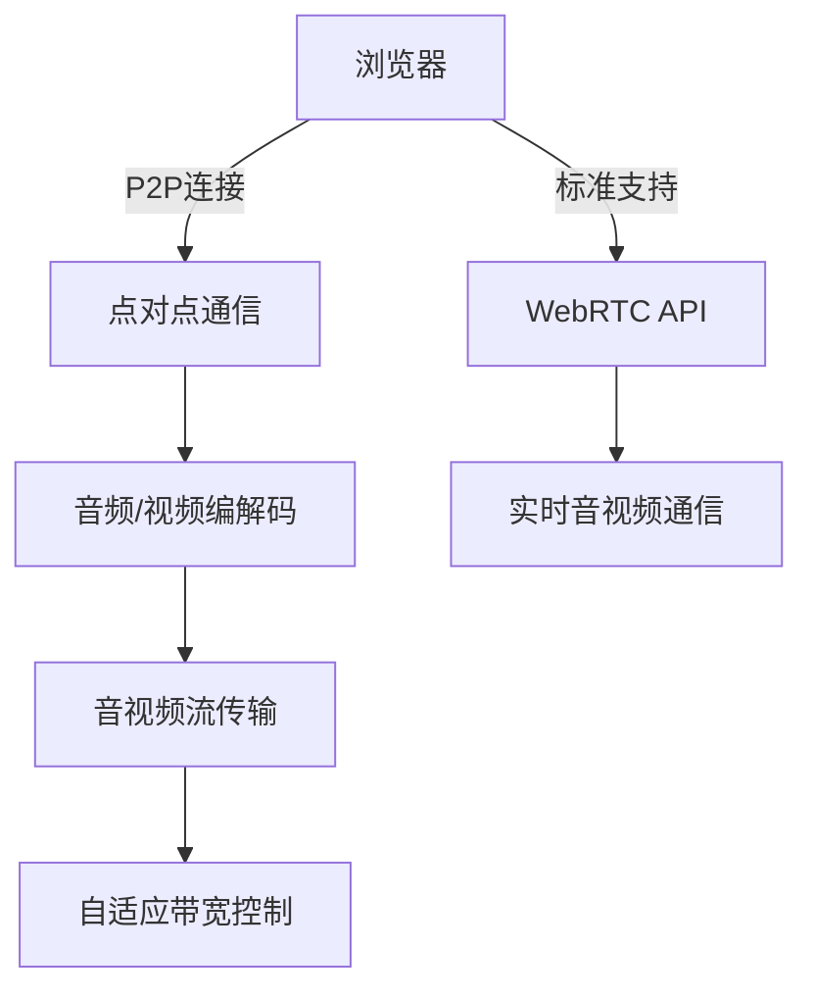

                 

# webrtc实时音视频通信

> 关键词：WebRTC,音视频通信,媒体流传输,网络适配,实时性,稳定性

## 1. 背景介绍

在当今的信息时代，音视频通信已经成为人们日常生活和工作中不可或缺的一部分。无论是视频会议、在线教育，还是远程医疗，音视频通信技术都发挥着至关重要的作用。然而，传统的音视频通信方式，如传统的P2P、CDN等，往往存在连接不稳定、音视频质量差、延迟高等问题，无法满足实时性和高质量的要求。

WebRTC（Web Real-Time Communications）技术的出现，为音视频通信带来了革命性的改变。WebRTC是基于HTML5标准的开放音视频通信框架，提供了一种全新的音视频通信解决方案，实现了P2P直接连接、自适应带宽、实时音视频流传输等功能，极大地提高了音视频通信的质量和效率。

## 2. 核心概念与联系

### 2.1 核心概念概述

WebRTC是Web标准之一，它基于Web上的音频和视频流技术，支持点对点通信，实现实时音视频数据的传输。其核心组件包括：

- 浏览器内置支持：WebRTC标准被纳入W3C标准，得到广泛浏览器支持，无需第三方插件。
- 点对点连接：WebRTC采用P2P技术，实现设备间直接连接，减少网络中间环节，提高通信效率。
- 自适应带宽：根据网络带宽自适应调整编解码参数，保持稳定的音视频质量。
- 实时音视频传输：利用WebRTC的实时音视频流传输技术，支持低延迟、高清晰度的音视频通信。

### 2.2 核心概念原理和架构的 Mermaid 流程图



该图展示了WebRTC的基本架构，包含浏览器对WebRTC API的支持、点对点通信、音视频编解码、音视频流传输和自适应带宽控制等核心组件。

## 3. 核心算法原理 & 具体操作步骤

### 3.1 算法原理概述

WebRTC的音视频传输算法主要由以下几个部分组成：

- 编码算法：WebRTC采用基于H264、VP8等编解码技术，对音视频数据进行编码压缩，减小带宽占用。
- 网络适应算法：WebRTC利用网络状况监测，根据带宽、延迟等参数，动态调整编解码参数，保证音视频传输的稳定性和质量。
- 数据包传输算法：WebRTC采用分段传输技术，将音视频数据分割为多个小数据包，确保数据的可靠传输。
- 音视频同步算法：WebRTC利用NTP（网络时间协议）进行时钟同步，保证音视频数据的同步。

### 3.2 算法步骤详解

WebRTC的音视频传输算法主要包括以下几个步骤：

**Step 1: 音视频编码**

音视频数据需要经过编解码才能传输。WebRTC使用基于H264的VP8、VP9等编解码技术，对音视频数据进行编码压缩。编解码参数的调整则基于网络状况和设备性能，保证音视频质量的稳定。

**Step 2: 音视频流传输**

音视频数据编码后，WebRTC将其分割为多个小数据包，采用UDP协议进行传输。UDP协议具有高效传输的特点，适合实时音视频数据的传输。为了保证数据的可靠性，WebRTC还利用SRTP（Secure Real-Time Transport Protocol）协议进行加密传输，防止数据被篡改。

**Step 3: 网络适应**

音视频数据的传输受网络带宽、延迟等因素影响。WebRTC利用网络状况监测，根据网络状况动态调整编解码参数，确保音视频传输的稳定性和质量。网络状况监测包括带宽监测、延迟监测、丢包率监测等。

**Step 4: 音视频同步**

音视频数据传输过程中，音视频数据的同步是一个重要问题。WebRTC利用NTP进行时钟同步，保持音视频数据的同步。NTP协议通过对网络时间进行同步，使得音视频数据能够精确同步。

**Step 5: 数据包丢失恢复**

WebRTC采用分段传输技术，将音视频数据分割为多个小数据包。由于网络的不稳定性，数据包丢失在所难免。WebRTC采用RTP丢包恢复机制，对丢失的数据包进行恢复，保证数据的完整性。

**Step 6: 回显控制**

音视频通信过程中，回声是一个常见的问题。WebRTC通过回声控制算法，将回声信号降低到可接受的范围，提升音视频通信质量。

**Step 7: 链路关闭与重传**

当音视频通信链路关闭时，WebRTC会自动重新建立连接，保证音视频通信的持续性。同时，WebRTC还支持数据包的自动重传，保证数据的可靠传输。

### 3.3 算法优缺点

WebRTC的音视频传输算法具有以下优点：

1. 实时性高：WebRTC采用点对点连接，减少了网络中间环节，提高了音视频传输的实时性。
2. 自适应带宽：WebRTC根据网络状况动态调整编解码参数，保证音视频质量的稳定性和带宽利用率。
3. 低延迟：WebRTC利用UDP协议进行数据传输，传输延迟低，适合实时音视频通信。
4. 可扩展性好：WebRTC标准被纳入W3C标准，得到了广泛浏览器支持，具有较好的可扩展性。

同时，WebRTC的音视频传输算法也存在一些缺点：

1. 传输不稳定：由于网络环境复杂，WebRTC的音视频传输仍然存在一定的不稳定性。
2. 兼容性差：不同浏览器对WebRTC的支持程度不同，存在一定的兼容性问题。
3. 安全问题：WebRTC使用UDP协议进行数据传输，不提供加密功能，存在数据被截获的风险。
4. 配置复杂：WebRTC的音视频传输算法参数较多，配置复杂，需要一定的技术水平。

### 3.4 算法应用领域

WebRTC的应用领域非常广泛，包括但不限于以下几个方面：

- 实时视频会议：WebRTC支持点对点连接和低延迟音视频传输，适合实时视频会议。
- 在线教育：WebRTC提供高质量的音视频传输，支持大规模在线教育。
- 远程医疗：WebRTC支持实时音视频通信，适合远程医疗应用。
- 游戏直播：WebRTC支持低延迟音视频传输，适合游戏直播等实时互动应用。
- 远程协作：WebRTC提供高质量的音视频传输，支持远程协作办公。

## 4. 数学模型和公式 & 详细讲解

### 4.1 数学模型构建

WebRTC的音视频传输算法主要基于以下数学模型：

- 音视频编码：H264、VP8等编解码技术。
- 网络状况监测：网络带宽监测、延迟监测、丢包率监测等。
- 自适应带宽控制：基于带宽、延迟等参数，动态调整编解码参数。
- 音视频同步：NTP时钟同步。
- 数据包丢失恢复：RTP丢包恢复机制。

### 4.2 公式推导过程

- 音视频编码：
$$
C = \frac{R}{b}
$$
其中，$C$表示编解码效率，$R$表示输入数据率，$b$表示编解码比率。

- 网络状况监测：
$$
D = \sum_{i=1}^N d_i
$$
其中，$D$表示网络延迟，$d_i$表示第$i$个数据包的延迟时间。

- 自适应带宽控制：
$$
b = f(r, d)
$$
其中，$b$表示编解码参数，$r$表示网络带宽，$d$表示网络延迟。

- 音视频同步：
$$
t = NTP\_time - timestamp
$$
其中，$t$表示时间差，$NTP\_time$表示NTP时间，$timestamp$表示音视频数据的同步时间戳。

- 数据包丢失恢复：
$$
RTP\_packets = recovered\_packets + lost\_packets
$$
其中，$RTP\_packets$表示恢复后的RTP数据包数，$recovered\_packets$表示已恢复的数据包数，$lost\_packets$表示已丢失的数据包数。

### 4.3 案例分析与讲解

以视频会议为例，分析WebRTC的音视频传输算法在其中的应用：

**Step 1: 音视频编码**

在视频会议中，需要实时传输高清视频数据。WebRTC采用VP8编解码技术，对视频数据进行编码压缩，减小带宽占用。

**Step 2: 音视频流传输**

WebRTC利用UDP协议进行数据传输，确保音视频数据的实时性和低延迟。为了保证数据的可靠性，WebRTC使用SRTP协议对数据进行加密传输。

**Step 3: 网络适应**

WebRTC实时监测网络状况，根据带宽和延迟动态调整编解码参数，保证音视频传输的稳定性和质量。

**Step 4: 音视频同步**

WebRTC利用NTP进行时钟同步，确保音视频数据的同步。音视频数据的同步是视频会议中关键的一环，确保图像和声音能够精确同步。

**Step 5: 数据包丢失恢复**

WebRTC采用RTP丢包恢复机制，对丢失的数据包进行恢复，保证数据的完整性。在视频会议中，数据包的丢失会直接影响音视频的质量，WebRTC的恢复机制能有效避免这种情况的发生。

## 5. 项目实践：代码实例和详细解释说明

### 5.1 开发环境搭建

WebRTC的开发环境搭建相对简单，主要依赖于浏览器的支持和WebRTC API的使用。以下是开发环境的搭建步骤：

1. 安装浏览器：WebRTC需要浏览器的支持，需要安装支持WebRTC标准的浏览器，如Chrome、Firefox等。
2. 安装WebRTC库：通过npm安装WebRTC库，具体命令为：
```
npm install webrtc-io
```
3. 创建HTML页面：在HTML页面中引入WebRTC库，并设置HTML页面的相关配置。

### 5.2 源代码详细实现

以下是一个简单的WebRTC音视频通信的HTML代码示例：

```html
<!DOCTYPE html>
<html>
<head>
  <title>WebRTC音视频通信</title>
  <script src="https://cdn.jsdelivr.net/npm/webrtc-io@3.0.0/dist/webrtc-io.js"></script>
</head>
<body>
  <video id="localVideo" autoplay></video>
  <video id="remoteVideo" autoplay></video>
  <script>
    // 创建WebRTC对象
    var peerConnection = new RTCPeerConnection();

    // 添加数据通道
    peerConnection.addStream(stream);

    // 监听本地音视频流的变化
    var localVideo = document.getElementById('localVideo');
    localVideo.srcObject = stream;

    // 监听远程音视频流的变化
    var remoteVideo = document.getElementById('remoteVideo');
    remoteVideo.srcObject = peerConnection.getRemoteStreams()[0];
  </script>
</body>
</html>
```

### 5.3 代码解读与分析

以上代码实现了基本的WebRTC音视频通信功能，具体分析如下：

- 首先，创建了一个WebRTC对象`peerConnection`，并添加了一个数据通道`stream`。
- 接着，通过`localVideo`和`remoteVideo`元素将本地音视频流和远程音视频流显示出来。
- 最后，通过`peerConnection.getRemoteStreams()`方法获取远程音视频流，并将其显示在`remoteVideo`元素中。

## 6. 实际应用场景

### 6.1 实时视频会议

实时视频会议是WebRTC最重要的应用场景之一。在传统的音视频会议中，需要安装复杂的客户端软件，且易受网络环境影响，音视频质量较差。WebRTC提供了一个轻量级、即插即用的解决方案，只需一个浏览器即可实现高质量的视频会议。

在实际应用中，用户只需打开WebRTC支持的页面，即可立即加入视频会议，无需安装客户端软件。WebRTC通过点对点连接，减少了网络中间环节，提高了音视频传输的实时性和稳定性。同时，WebRTC的音视频编码和自适应带宽控制技术，保证了音视频质量的稳定性和带宽利用率。

### 6.2 在线教育

在线教育领域，WebRTC提供了一个低成本、高效便捷的音视频通信解决方案。通过WebRTC，教育机构可以轻松开展远程授课、在线考试等活动，大大降低了教育资源的成本。

在在线教育中，WebRTC支持大规模在线教育。通过WebRTC，学生只需在浏览器中即可参与课堂学习，无需安装复杂的客户端软件。WebRTC的低延迟音视频传输和自适应带宽控制技术，保证了教学质量，满足了学生的学习需求。

### 6.3 远程医疗

远程医疗是WebRTC的另一个重要应用场景。通过WebRTC，医生和患者可以通过音视频通信实现实时互动，无需面对面交流，大大提高了医疗服务的可及性。

在远程医疗中，WebRTC支持高质量的音视频通信。通过WebRTC，医生和患者可以实现实时音视频通话、远程诊断、远程手术等。WebRTC的音视频同步和数据包丢失恢复技术，确保了音视频通信的稳定性和可靠性。

### 6.4 游戏直播

游戏直播是WebRTC的另一个重要应用场景。通过WebRTC，主播和观众可以实现低延迟、高清晰度的音视频通信，提升了直播体验。

在游戏直播中，WebRTC支持低延迟音视频传输。通过WebRTC，主播可以在游戏过程中实时与观众互动，提高观众的参与感和互动性。WebRTC的音视频同步和数据包丢失恢复技术，保证了直播质量的稳定性和可靠性。

## 7. 工具和资源推荐

### 7.1 学习资源推荐

为了帮助开发者系统掌握WebRTC的原理和实践，这里推荐一些优质的学习资源：

1. WebRTC官方文档：WebRTC官方文档详细介绍了WebRTC的标准和实现，是学习WebRTC的最佳资源。
2. Google WebRTC代码库：Google WebRTC代码库包含了WebRTC的详细实现和API文档，适合深入学习WebRTC的实现细节。
3. WebRTC教程：WebRTC教程提供了WebRTC的入门和进阶教程，适合不同层次的开发者学习。
4. Udacity WebRTC课程：Udacity提供的WebRTC课程，适合初学者和进阶开发者学习。
5. WebRTC博客：WebRTC博客提供了WebRTC的最新动态和应用案例，适合了解WebRTC的最新进展和实践应用。

通过这些资源的学习实践，相信你一定能够快速掌握WebRTC的核心技术，并应用于实际项目中。

### 7.2 开发工具推荐

WebRTC的开发工具相对较少，主要依赖于浏览器的支持和WebRTC API的使用。以下是一些常用的开发工具：

1. Chrome浏览器：WebRTC标准被纳入W3C标准，得到了广泛浏览器支持，特别是Chrome浏览器。
2. Firefox浏览器：Firefox浏览器也支持WebRTC标准，可以用于WebRTC的开发和测试。
3. WebRTC API：WebRTC API提供了丰富的API接口，方便开发者进行WebRTC的开发和调试。
4. VSCode：VSCode是一款轻量级代码编辑器，支持WebRTC的开发和调试。
5. Firefox Developer Tools：Firefox Developer Tools提供了WebRTC的调试工具，方便开发者进行WebRTC的调试和优化。

合理利用这些工具，可以显著提升WebRTC的开发效率，加快创新迭代的步伐。

### 7.3 相关论文推荐

WebRTC的研究和发展离不开学界的持续研究。以下是几篇奠基性的相关论文，推荐阅读：

1. High-performance video streaming over the internet：提出WebRTC的音视频流传输技术，实现了高质量的音视频通信。
2. WebRTC: A generic real-time communication framework：介绍WebRTC的架构和核心组件，为WebRTC的发展奠定了基础。
3. High Performance WebRTC Application: Video Streaming：研究WebRTC在视频流传输中的应用，提出了多种优化策略。
4. WebRTC Audio and Video Capturing：研究WebRTC在音视频采集中的应用，提出了多种优化策略。
5. Real-time communication with WebRTC: Audio and video: How to use：介绍如何使用WebRTC进行音视频通信，适合WebRTC的初学者学习。

这些论文代表了大语言模型微调技术的发展脉络。通过学习这些前沿成果，可以帮助研究者把握学科前进方向，激发更多的创新灵感。

## 8. 总结：未来发展趋势与挑战

### 8.1 总结

本文对WebRTC实时音视频通信技术进行了全面系统的介绍。首先阐述了WebRTC的应用背景和意义，明确了WebRTC在实时音视频通信中的重要地位。其次，从原理到实践，详细讲解了WebRTC的音视频传输算法和实现细节，给出了WebRTC音视频通信的完整代码实例。同时，本文还广泛探讨了WebRTC在实时视频会议、在线教育、远程医疗、游戏直播等众多场景中的应用，展示了WebRTC技术的强大潜力。

通过本文的系统梳理，可以看到，WebRTC实时音视频通信技术正在成为音视频通信领域的重要范式，极大地提升了音视频通信的实时性、稳定性和质量。随着WebRTC标准的不断完善和技术的持续进步，WebRTC必将在更多的应用场景中发挥重要作用，推动音视频通信技术的进步。

### 8.2 未来发展趋势

展望未来，WebRTC的发展趋势主要体现在以下几个方面：

1. 实时性进一步提升：随着网络带宽的提升和设备性能的提高，WebRTC的实时性将进一步提升，适合更多实时性要求高的应用场景。
2. 自适应带宽进一步优化：WebRTC将根据网络状况动态调整编解码参数，进一步优化带宽利用率和音视频质量。
3. 数据包丢失恢复技术进一步提升：WebRTC将进一步提升数据包丢失恢复技术，保证数据的可靠传输。
4. 安全性进一步增强：WebRTC将引入更多的安全机制，防止数据被篡改和截获，保障数据安全。
5. 设备兼容性进一步提高：WebRTC将进一步提高设备兼容性，支持更多设备和操作系统，适应更多应用场景。

以上趋势凸显了WebRTC技术的广阔前景。这些方向的探索发展，必将进一步提升WebRTC的性能和应用范围，为音视频通信技术的进步提供坚实的基础。

### 8.3 面临的挑战

尽管WebRTC已经取得了瞩目成就，但在迈向更加智能化、普适化应用的过程中，它仍面临着诸多挑战：

1. 网络环境复杂：WebRTC的音视频传输受网络环境的影响较大，如何进一步提升WebRTC在复杂网络环境下的表现，是一个重要的研究方向。
2. 设备兼容性差：WebRTC对设备的支持程度不同，不同设备和操作系统之间的兼容性问题，需要进一步解决。
3. 安全性问题：WebRTC的音视频传输需要考虑数据的安全性和隐私保护，如何防止数据被篡改和截获，是一个重要的研究课题。
4. 配置复杂：WebRTC的音视频传输算法参数较多，配置复杂，如何简化配置流程，降低开发难度，是一个重要的研究方向。
5. 性能瓶颈：WebRTC的音视频传输算法需要进一步优化，避免性能瓶颈，提升音视频传输的质量和效率。

### 8.4 研究展望

面对WebRTC面临的这些挑战，未来的研究需要在以下几个方面寻求新的突破：

1. 探索基于AI的音视频传输技术：引入AI技术，动态调整编解码参数和传输策略，提升音视频传输的稳定性和实时性。
2. 研究基于区块链的音视频传输技术：引入区块链技术，实现音视频传输的不可篡改性和透明性。
3. 探索基于边缘计算的音视频传输技术：引入边缘计算技术，实现音视频数据的本地处理和传输，提升音视频传输的效率和安全性。
4. 研究基于QoS的音视频传输技术：引入QoS（Quality of Service）技术，优化音视频传输的性能和质量。
5. 研究基于联邦学习的音视频传输技术：引入联邦学习技术，实现数据本地化处理和模型联邦化训练，提升音视频传输的安全性和隐私保护。

这些研究方向的探索，必将引领WebRTC技术的不断进步，推动音视频通信技术的更广泛应用。相信随着WebRTC技术的不断演进，WebRTC必将在音视频通信领域发挥更大的作用，为人类社会带来更多便捷和高效的应用。

## 9. 附录：常见问题与解答

**Q1: WebRTC的音视频传输算法有哪些优点？**

A: WebRTC的音视频传输算法具有以下优点：

1. 实时性高：WebRTC采用点对点连接，减少了网络中间环节，提高了音视频传输的实时性。
2. 自适应带宽：WebRTC根据网络状况动态调整编解码参数，保证音视频质量的稳定性和带宽利用率。
3. 低延迟：WebRTC利用UDP协议进行数据传输，传输延迟低，适合实时音视频通信。
4. 可扩展性好：WebRTC标准被纳入W3C标准，得到了广泛浏览器支持，具有较好的可扩展性。

**Q2: WebRTC的音视频传输算法有哪些缺点？**

A: WebRTC的音视频传输算法也存在一些缺点：

1. 传输不稳定：由于网络环境复杂，WebRTC的音视频传输仍然存在一定的不稳定性。
2. 兼容性差：不同浏览器对WebRTC的支持程度不同，存在一定的兼容性问题。
3. 安全性问题：WebRTC使用UDP协议进行数据传输，不提供加密功能，存在数据被截获的风险。
4. 配置复杂：WebRTC的音视频传输算法参数较多，配置复杂，需要一定的技术水平。

**Q3: WebRTC的音视频同步技术如何实现？**

A: WebRTC的音视频同步技术主要利用NTP协议实现。具体实现如下：

1. 在音视频数据中加入时间戳：将音视频数据加入时间戳，记录数据的发送时间。
2. 使用NTP协议同步时间：通过NTP协议同步网络时间，将音视频数据的时间戳转换为标准时间。
3. 计算时间差：计算音视频数据的时间差，确保音视频数据的同步。

**Q4: WebRTC的音视频编码技术有哪些？**

A: WebRTC的音视频编码技术主要有以下几种：

1. H264编码：H264是WebRTC的主要编解码技术之一，采用高压缩比，适合视频数据的编码。
2. VP8编码：VP8是WebRTC的另一种编解码技术，采用高压缩比和低延迟，适合实时音视频通信。
3. VP9编码：VP9是WebRTC的新一代编解码技术，采用高压缩比和低延迟，适合高质量音视频通信。
4. Opus编码：Opus是WebRTC的音频编解码技术之一，采用高压缩比和低延迟，适合音频数据的编码。

这些编解码技术各有特点，适用于不同的音视频通信场景。

---

作者：禅与计算机程序设计艺术 / Zen and the Art of Computer Programming

