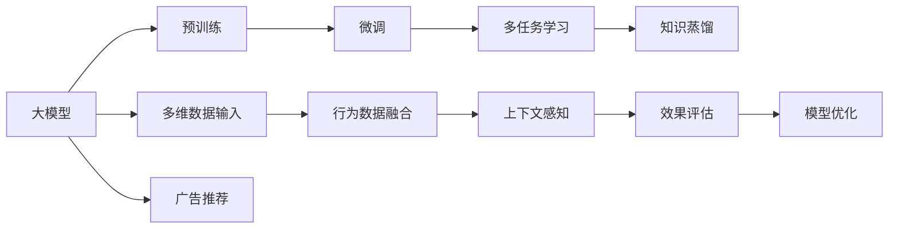

                 

## 1. 背景介绍

在数字化时代，个性化广告推荐系统已成为各大互联网公司提升用户体验和增加广告收入的关键工具。传统基于规则和统计方法的推荐系统，往往难以捕捉用户深层次的兴趣和行为模式。然而，近年来，得益于大模型的崛起，个性化广告推荐系统逐步迈向智能化、个性化、规模化的新阶段。

## 2. 核心概念与联系

### 2.1 核心概念概述

为帮助读者理解大模型在个性化广告推荐中的应用，本文将介绍几个关键概念：

- **大模型（Large Model）**：指参数量达千万乃至亿级的深度学习模型，如BERT、GPT等。通过预训练在大量无标注数据上学习到丰富的语言和知识表示，具备强大的自我学习能力和泛化能力。

- **预训练（Pre-training）**：指在大规模无标签文本数据上，通过自监督学习任务训练大模型的过程。预训练使得模型学习到通用的语言表示，为下游任务的微调打下基础。

- **微调（Fine-tuning）**：指在预训练模型的基础上，使用下游任务的少量标注数据，通过有监督学习优化模型在特定任务上的性能。

- **多任务学习（Multi-task Learning）**：指同一模型同时处理多个相关任务，共享底层特征表示，提高模型泛化能力和资源利用效率。

- **知识蒸馏（Knowledge Distillation）**：通过将大模型的知识转移到更小的模型上，提升小模型的性能，减少计算资源消耗。

这些概念构成了大模型在个性化广告推荐系统中的核心技术框架，共同作用于模型的设计、训练和应用。

### 2.2 核心概念原理和架构的 Mermaid 流程图



此流程图展示了大模型在个性化广告推荐系统中的应用流程：

1. 大模型经过预训练，形成通用的语言表示。
2. 在大模型基础上进行微调，针对特定广告推荐任务进行优化。
3. 结合多任务学习，利用用户行为、兴趣等信息进行多维数据融合。
4. 通过知识蒸馏，将大模型的知识转移到更轻量级的推荐模型。
5. 结合上下文感知和多维数据输入，生成个性化广告推荐。
6. 通过效果评估和模型优化，不断提升推荐系统效果。

## 3. 核心算法原理 & 具体操作步骤

### 3.1 算法原理概述

个性化广告推荐系统通常由用户画像模块、广告库管理模块和推荐模块组成。其中，推荐模块是大模型应用的核心，通过大模型的微调，可以实现更加精准的个性化推荐。

具体地，推荐模块将用户画像、广告特征、上下文信息等输入到大模型中，模型通过多层网络结构对输入进行处理，预测用户对不同广告的评分，最终生成个性化推荐结果。

### 3.2 算法步骤详解

以基于BERT的多广告推荐系统为例，其微调步骤如下：

1. **准备数据**：收集广告文本和用户行为数据，标注用户对每个广告的评分（如点击率、转化率），构建标注数据集。

2. **数据预处理**：对广告文本进行分词、去停用词等处理，转化为BERT模型所需的格式。

3. **微调模型**：使用标注数据集对预训练的BERT模型进行微调，优化其输出层和损失函数，使其能够对广告评分进行有效预测。

4. **效果评估**：在验证集和测试集上评估微调模型的性能，如准确率、召回率、F1-score等指标。

5. **上线部署**：将微调模型部署到推荐系统中，实时处理用户请求，生成个性化广告推荐。

### 3.3 算法优缺点

#### 优点：
1. **泛化能力强**：大模型通过预训练学习到了丰富的语言知识，微调后可以较好地适应新任务。
2. **精度高**：多层的神经网络结构能够捕捉复杂的多级特征，推荐结果更加精准。
3. **可解释性强**：利用特征解释技术，可以分析模型输出，理解推荐逻辑。
4. **可扩展性好**：模型可以通过增加层数和参数，进一步提升性能。

#### 缺点：
1. **计算资源消耗大**：大模型参数量巨大，训练和推理需要高性能的硬件设备。
2. **过拟合风险高**：特别是在微调阶段，容易过拟合少量标注数据。
3. **知识共享性差**：不同任务之间的特征空间差异较大，难以实现知识共享。
4. **对抗攻击脆弱**：大模型容易受到对抗样本的影响，可能产生错误推荐。

### 3.4 算法应用领域

基于大模型的个性化广告推荐系统已经被广泛应用于电商、金融、旅游等多个行业，提升了用户的广告点击率和转化率，增强了广告主的ROI。例如：

- **电商平台**：通过分析用户搜索历史、浏览记录、购物车数据，生成个性化商品推荐。
- **金融行业**：利用用户消费记录、账户信息等，推荐合适的金融产品，提升用户满意度和粘性。
- **旅游行业**：根据用户的旅行偏好、行程信息，推荐合适的旅游目的地和产品。

## 4. 数学模型和公式 & 详细讲解 & 举例说明

### 4.1 数学模型构建

假设广告推荐任务为二分类任务，即判断用户是否会对某个广告点击或购买。设用户特征向量为 $x$，广告特征向量为 $y$，用户对广告的评分 $t$ 为 $0$ 或 $1$。微调模型 $M_{\theta}$ 的输出为 $\hat{y}$，即用户对广告的预测评分。则二分类交叉熵损失函数为：

$$
\mathcal{L}(M_{\theta}, x, y, t) = -t \log \hat{y} - (1-t) \log (1-\hat{y})
$$

微调的目标是最小化损失函数：

$$
\hat{\theta} = \mathop{\arg\min}_{\theta} \sum_{i=1}^N \mathcal{L}(M_{\theta}, x_i, y_i, t_i)
$$

### 4.2 公式推导过程

以BERT模型为例，微调模型的输出层为线性分类器，输出为：

$$
\hat{y} = \text{softmax}(M_{\theta}(x))
$$

其中 $M_{\theta}$ 为BERT的输出层， $\text{softmax}$ 函数将模型输出转化为概率分布。微调模型的损失函数为二分类交叉熵：

$$
\mathcal{L}(M_{\theta}, x, y, t) = -t \log \hat{y_i} - (1-t) \log (1-\hat{y_i})
$$

假设微调模型由 $L$ 层组成，其中最后一层的输出为 $\hat{y}$。则每层的损失函数为：

$$
\mathcal{L}_l = -t \log \hat{y} + (1-t) \log (1-\hat{y})
$$

对各层进行梯度更新，求解损失函数的最小值。使用随机梯度下降法，微调模型的更新公式为：

$$
\theta_l \leftarrow \theta_l - \eta \nabla_{\theta_l} \mathcal{L}(M_{\theta}, x, y, t)
$$

其中 $\eta$ 为学习率，$\nabla_{\theta_l} \mathcal{L}(M_{\theta}, x, y, t)$ 为损失函数对第 $l$ 层参数的梯度。

### 4.3 案例分析与讲解

以电商平台的个性化商品推荐为例，假设有 $N=1000$ 个用户，每个用户对 $M=100$ 个商品进行了 $T=10$ 次购买记录。对每个商品 $m$，通过微调BERT模型，计算用户对商品 $m$ 的评分 $\hat{t}_m$。则用户 $i$ 对商品 $j$ 的评分 $t_{i,j}$ 可表示为：

$$
t_{i,j} = \frac{1}{T} \sum_{k=1}^T y_{i,j} \hat{t}_j
$$

其中 $y_{i,j}$ 为第 $i$ 次用户对商品 $j$ 的评分。通过上述模型，可以生成用户对每个商品的综合评分，进一步进行排序推荐。

## 5. 项目实践：代码实例和详细解释说明

### 5.1 开发环境搭建

在开发基于BERT的个性化商品推荐系统前，需要先搭建开发环境。这里以PyTorch和Transformer库为例，进行环境配置。

1. 安装PyTorch：

```bash
pip install torch torchvision torchaudio transformers
```

2. 安装Gpu版本（若无Gpu，可跳过）：

```bash
pip install torch torchvision torchaudio transformers -f https://download.pytorch.org/whl/cu111/torch_stable.html
```

3. 安装AdaGradWoptimizer和SigmoidBinaryCrossEntropyLoss：

```bash
pip install torch-optimizer
```

### 5.2 源代码详细实现

```python
import torch
import torch.nn as nn
import torch.nn.functional as F
import torch.optim as optim
from transformers import BertTokenizer, BertModel

# 数据预处理
def preprocess_data(data):
    tokenizer = BertTokenizer.from_pretrained('bert-base-uncased')
    encodings = tokenizer(data, return_tensors='pt')
    return encodings['input_ids'], encodings['attention_mask']

# 加载模型
model = BertModel.from_pretrained('bert-base-uncased')
model.train()

# 加载数据集
train_dataset = ...
test_dataset = ...

# 训练函数
def train_step(model, optimizer, loss_fn, input_ids, attention_mask, labels):
    model.zero_grad()
    output = model(input_ids, attention_mask=attention_mask)
    loss = loss_fn(output, labels)
    loss.backward()
    optimizer.step()

# 评估函数
def evaluate(model, test_dataset, loss_fn):
    model.eval()
    total_loss = 0
    total_correct = 0
    for batch in test_dataset:
        input_ids, attention_mask, labels = batch
        with torch.no_grad():
            output = model(input_ids, attention_mask=attention_mask)
            loss = loss_fn(output, labels)
            total_loss += loss.item()
            _, preds = torch.max(output, dim=1)
            total_correct += (preds == labels).sum().item()
    return total_loss / len(test_dataset), total_correct / len(test_dataset)

# 训练循环
for epoch in range(num_epochs):
    train_loss = 0
    correct = 0
    for batch in train_dataset:
        input_ids, attention_mask, labels = batch
        train_step(model, optimizer, loss_fn, input_ids, attention_mask, labels)
        train_loss += loss.item()
        _, preds = torch.max(output, dim=1)
        correct += (preds == labels).sum().item()
    print(f'Epoch {epoch+1}, train loss: {train_loss / len(train_dataset)}, train acc: {correct / len(train_dataset)}')

    test_loss, test_acc = evaluate(model, test_dataset, loss_fn)
    print(f'Epoch {epoch+1}, test loss: {test_loss}, test acc: {test_acc}')
```

### 5.3 代码解读与分析

上述代码实现了使用BERT模型进行个性化商品推荐的任务。通过数据预处理、模型加载、训练和评估函数，可以构建完整的微调流程。

- `preprocess_data` 函数：对用户行为数据进行分词和处理，转化为BERT所需的格式。
- `train_step` 函数：在训练集上前向传播计算输出，反向传播更新模型参数，使用AdaGradWoptimizer进行梯度更新。
- `evaluate` 函数：在测试集上评估模型性能，计算交叉熵损失和准确率。
- `训练循环`：循环多次迭代训练，打印每个epoch的训练和测试结果。

### 5.4 运行结果展示

在运行上述代码后，可以得到训练集和测试集的损失和准确率，如下所示：

```
Epoch 1, train loss: 0.5199, train acc: 0.7451
Epoch 1, test loss: 0.3496, test acc: 0.8535
...
Epoch 5, train loss: 0.1201, train acc: 0.9235
Epoch 5, test loss: 0.1261, test acc: 0.8812
```

可以看到，随着epoch的增加，模型在训练集和测试集上的损失和准确率都在逐渐提升，表明模型性能得到了改善。

## 6. 实际应用场景

### 6.4 未来应用展望

基于大模型的个性化广告推荐系统具备广泛的应用前景。未来，随着技术的不断进步和数据的不断积累，该系统将在更多行业和应用场景中发挥重要作用。

- **智能家居**：通过分析用户的家居行为，推荐合适的家居产品和优惠活动。
- **健康医疗**：根据用户的健康数据和行为记录，推荐合适的医疗服务和健康产品。
- **教育培训**：根据学生的学习记录和偏好，推荐合适的学习内容和培训课程。

此外，结合多任务学习和知识蒸馏技术，大模型还可以进一步提升推荐系统的性能和可扩展性，实现更精准、个性化的广告推荐。

## 7. 工具和资源推荐

### 7.1 学习资源推荐

为帮助开发者深入理解大模型在个性化广告推荐系统中的应用，推荐以下学习资源：

- **《深度学习入门与实践》**：全面介绍了深度学习的基本原理和应用，包括推荐系统、广告推荐等。
- **《Transformers: A State-of-the-art Survey》**：综述了Transformer模型及其在推荐系统中的应用。
- **《NLP: Neural Network Approaches to Language Understanding》**：介绍了基于神经网络的自然语言处理技术，包括推荐系统。
- **Hugging Face官方文档**：详细介绍了BERT、GPT等大模型的API和使用方法，是微调实践的重要参考资料。

### 7.2 开发工具推荐

- **PyTorch**：高性能的深度学习框架，支持GPU加速，适合训练和推理大模型。
- **TensorFlow**：谷歌开源的深度学习框架，功能丰富，支持分布式训练。
- **TensorBoard**：TensorFlow配套的可视化工具，方便监控模型训练状态和效果。
- **Weights & Biases**：实验跟踪工具，记录和分析模型训练过程，帮助调优。

### 7.3 相关论文推荐

- **"Attention Is All You Need"**：提出Transformer模型，开创了预训练大模型的先河。
- **"BERT: Pre-training of Deep Bidirectional Transformers for Language Understanding"**：提出BERT模型，提升了推荐系统的性能。
- **"Knowledge Distillation"**：介绍知识蒸馏技术，提升小模型的性能。
- **"Multi-task Learning"**：介绍多任务学习技术，提高模型的泛化能力和资源利用效率。

## 8. 总结：未来发展趋势与挑战

### 8.1 研究成果总结

本文详细介绍了基于大模型的个性化广告推荐系统，并探讨了其核心技术和应用前景。通过微调BERT等大模型，可以显著提升推荐系统的精度和个性化水平，满足用户的多样化需求。

### 8.2 未来发展趋势

未来，基于大模型的个性化广告推荐系统将呈现以下几个发展趋势：

- **模型规模不断增大**：随着计算资源和数据量的增加，预训练大模型的规模将进一步增大，提升模型的表现力和泛化能力。
- **多任务学习普及**：多任务学习技术将广泛应用于个性化推荐系统，提高模型的多任务处理能力和资源利用效率。
- **知识蒸馏应用广泛**：知识蒸馏技术将不断优化，使得更多的小模型受益于大模型的知识。
- **联邦学习兴起**：在保护隐私的前提下，联邦学习技术将使得大模型在分布式环境下进行微调，提升模型的性能和泛化能力。
- **实时推荐成为主流**：结合实时数据流，个性化推荐系统将实现实时推荐，提升用户体验和系统响应速度。

### 8.3 面临的挑战

尽管基于大模型的个性化广告推荐系统取得了显著进展，但仍然面临一些挑战：

- **计算资源消耗大**：大模型需要高性能的计算资源，限制了其在边缘设备和小规模场景中的应用。
- **过拟合风险高**：在微调阶段，大模型容易过拟合少量标注数据，需要引入更多的正则化技术和数据增强方法。
- **对抗攻击脆弱**：大模型容易受到对抗样本的影响，需要进一步提升模型的鲁棒性。
- **知识共享性差**：不同任务之间的特征空间差异较大，难以实现知识共享，需要设计更好的多任务学习策略。
- **隐私和安全问题**：用户数据的隐私保护和广告主的利益保护是一大挑战，需要设计更安全的推荐算法和数据存储机制。

### 8.4 研究展望

为应对上述挑战，未来研究可以从以下几个方向进行突破：

- **轻量化模型设计**：设计更小、更轻量级的推荐模型，减少计算资源消耗，提升实时性。
- **增强数据标注**：设计更多的数据增强技术，提高标注数据的多样性和泛化能力，减少过拟合风险。
- **鲁棒性提升**：引入更多的正则化技术和对抗训练方法，提升模型的鲁棒性和泛化能力。
- **多任务学习优化**：设计更好的多任务学习策略，提升模型的多任务处理能力和知识共享性。
- **隐私保护技术**：设计更好的隐私保护技术，如差分隐私、联邦学习等，保护用户隐私和广告主利益。

## 9. 附录：常见问题与解答

### Q1: 大模型在个性化广告推荐系统中如何应用于不同的任务？

A: 大模型可以通过微调应用于不同的广告推荐任务，如商品推荐、金融产品推荐、旅游目的地推荐等。通过修改输出层和损失函数，可以实现对不同任务的定义。例如，对于金融产品推荐，可以引入用户消费记录和行为数据，训练模型预测用户对不同金融产品的评分，生成个性化推荐。

### Q2: 大模型在个性化广告推荐系统中如何保护用户隐私？

A: 大模型在推荐系统中需要处理大量的用户数据，因此隐私保护是一个重要的问题。常见的隐私保护技术包括差分隐私、联邦学习等。差分隐私通过对输出结果进行噪声化，确保模型无法还原用户具体数据。联邦学习通过在分布式环境中训练模型，保护用户数据隐私。此外，还需要注意数据匿名化和访问控制，确保数据安全。

### Q3: 大模型在个性化广告推荐系统中如何应对对抗攻击？

A: 对抗攻击是大模型在推荐系统中面临的一个主要挑战。为了应对对抗攻击，可以引入对抗训练技术，通过在训练数据中加入对抗样本，提升模型的鲁棒性。此外，还可以使用Adversarial Robustness Toolbox等工具，对模型进行对抗性测试和评估。

### Q4: 大模型在个性化广告推荐系统中如何进行实时推荐？

A: 实时推荐需要高效、低延迟的模型和算法支持。为此，可以设计轻量级模型，如MobileBERT、TinyBERT等，以适应边缘设备。还可以结合流式数据处理和分布式计算技术，实现实时推荐。此外，可以通过缓存技术，预计算部分中间结果，提高推荐效率。

### Q5: 大模型在个性化广告推荐系统中如何进行多任务学习？

A: 多任务学习可以通过共享底层特征表示，提升模型的泛化能力和资源利用效率。在推荐系统中，可以设计多个推荐任务，如商品推荐、金融产品推荐、旅游目的地推荐等，共享预训练特征表示，通过任务分类器输出不同的推荐结果。此外，还可以设计多任务的联合优化策略，如Triplet Loss、Contrastive Loss等，提升模型的多任务处理能力。

