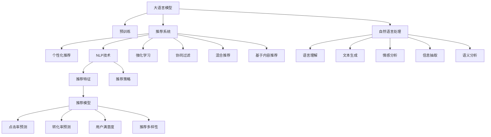

                 

# 个性化营销的未来：LLM驱动的精准推荐

## 1. 背景介绍

在数字经济的时代，个性化推荐系统已成为各大电商平台、内容平台和社交媒体的标配。无论是电商平台的产品推荐、视频平台的内容推荐，还是社交媒体的新闻推荐，都需要通过复杂的算法和庞大的数据集来实时匹配用户需求，提升用户体验和平台流量。

然而，随着用户需求的不断变化，传统的推荐系统已经难以满足个性化的要求。尤其是在内容领域，一个热门视频、一篇热门文章的推荐，往往会导致大量用户的跟风和围观，但这些用户并非对内容本身真正感兴趣，而只是受到社会心理的影响。这种“羊群效应”不仅浪费了平台的流量，也导致用户对推荐结果产生信任危机，进一步降低平台黏性。

在这种背景下，大语言模型（LLM）驱动的个性化推荐系统应运而生。LLM作为一种先进的自然语言处理技术，具备强大的语言理解和生成能力，可以在推荐系统中发挥关键作用，为个性化营销注入新的活力。

## 2. 核心概念与联系

### 2.1 核心概念概述

为了更好地理解LLM驱动的个性化推荐系统，本节将介绍几个核心概念及其相互联系。

- **大语言模型（Large Language Model, LLM）**：以自回归（如GPT）或自编码（如BERT）模型为代表的大规模预训练语言模型。通过在大规模无标签文本语料上进行预训练，学习通用的语言知识和常识，具备强大的语言理解和生成能力。

- **预训练（Pre-training）**：指在大规模无标签文本语料上，通过自监督学习任务训练通用语言模型的过程。常见的预训练任务包括掩码语言模型、Next Sentence Prediction等。预训练使得模型学习到语言的通用表示。

- **推荐系统（Recommendation System）**：通过分析用户的历史行为和兴趣偏好，为用户推荐相关产品、内容或服务，以提升用户体验和平台流量。推荐系统主要分为基于内容的推荐、协同过滤推荐和混合推荐等类型。

- **个性化推荐（Personalized Recommendation）**：针对用户个人的独特需求，提供定制化的推荐内容，以提高用户满意度和服务效果。个性化推荐系统利用用户画像、行为数据、时间特征等，精确匹配用户需求和推荐内容。

- **自然语言处理（Natural Language Processing, NLP）**：研究计算机如何理解和处理人类自然语言，主要任务包括语言理解、文本生成、情感分析等。NLP技术在推荐系统中的应用，可以通过自然语言分析，提升推荐内容的精准度和相关性。

- **强化学习（Reinforcement Learning, RL）**：通过试错学习，最大化系统预期奖励的一种机器学习方法。强化学习在推荐系统中的应用，可以通过用户反馈和互动，动态调整推荐策略，提升推荐效果。

这些核心概念之间的逻辑关系可以通过以下Mermaid流程图来展示：



这个流程图展示了LLM驱动的个性化推荐系统中的核心概念及其关系：

1. 大语言模型通过预训练获得基础能力。
2. 推荐系统利用LLM的能力，提供个性化推荐。
3. NLP技术为推荐系统提供语言理解、文本生成等支持。
4. 强化学习动态调整推荐策略，提升推荐效果。
5. 协同过滤、混合推荐、基于内容推荐等推荐方法，可以通过LLM增强推荐精准度。

## 3. 核心算法原理 & 具体操作步骤
### 3.1 算法原理概述

基于LLM的个性化推荐系统，本质上是一种基于监督学习的推荐方法。其核心思想是：将大语言模型作为推荐系统的一部分，通过用户历史行为数据和个性化特征，利用监督学习算法训练推荐模型，使其能够预测用户对推荐内容的兴趣，并进行排序和推荐。

形式化地，假设推荐系统的训练数据集为 $D=\{(x_i,y_i)\}_{i=1}^N$，其中 $x_i$ 为用户的历史行为数据和特征， $y_i$ 为推荐的物品或内容。目标是找到推荐模型 $M_{\theta}$，使得：

$$
\theta^* = \mathop{\arg\min}_{\theta} \mathcal{L}(M_{\theta},D)
$$

其中 $\mathcal{L}$ 为推荐系统的损失函数，用于衡量模型预测和实际行为之间的差异。常见的损失函数包括交叉熵损失、均方误差损失等。

通过梯度下降等优化算法，推荐系统不断更新模型参数 $\theta$，最小化损失函数 $\mathcal{L}$，使得推荐模型输出的兴趣评分逼近真实行为。由于 $\theta$ 已经通过预训练获得了较强的语言理解能力，因此即便在少量标注数据上，推荐模型也能较快收敛到理想参数 $\theta^*$。

### 3.2 算法步骤详解

基于监督学习的LLM驱动推荐系统一般包括以下几个关键步骤：

**Step 1: 准备数据集**

- 收集用户的历史行为数据，如浏览记录、购买记录、评价记录等。
- 提取用户特征，如年龄、性别、职业、地理位置等。
- 收集推荐物品或内容的描述，如商品名称、图片、标签等。
- 将用户行为数据、特征和物品描述作为输入，构建推荐系统的训练集和验证集。

**Step 2: 设计推荐模型**

- 选择合适的预训练语言模型，如BERT、GPT等，作为推荐系统的基础。
- 设计推荐特征提取器，将用户历史行为数据和物品描述转化为模型可接受的输入。
- 设计推荐模型，可以是二分类模型、回归模型或排名模型等，用于预测用户对推荐内容的兴趣。
- 选择优化算法，如Adam、SGD等，设置学习率、批大小等超参数。

**Step 3: 训练模型**

- 使用推荐系统的训练集，进行有监督学习，训练推荐模型。
- 在每个epoch中，前向传播计算损失函数，反向传播更新模型参数。
- 周期性在验证集上评估模型性能，根据性能指标决定是否触发Early Stopping。
- 重复上述步骤直到满足预设的迭代轮数或Early Stopping条件。

**Step 4: 部署和评估**

- 使用训练好的推荐模型，在实时数据上进行推荐预测。
- 根据用户反馈和互动数据，动态调整推荐策略，提升推荐效果。
- 在测试集上评估推荐模型的性能，对比模型改进前后的推荐效果。
- 根据业务需求和用户反馈，持续优化推荐模型和推荐策略。

以上是基于监督学习的方法，进行LLM驱动个性化推荐系统的基本流程。在实际应用中，还需要针对具体业务场景，对推荐系统的各个环节进行优化设计，如改进训练目标函数，引入更多的正则化技术，搜索最优的超参数组合等，以进一步提升推荐效果。

### 3.3 算法优缺点

基于监督学习的LLM驱动推荐系统具有以下优点：

- **高效性**：通过预训练模型，可以快速在大规模数据上获得基础能力，减少从头训练的时间和成本。
- **可解释性**：基于语言模型的推荐系统可以解释推荐理由，提升用户对推荐结果的信任度。
- **灵活性**：可以灵活地设计推荐特征和目标函数，满足不同的推荐需求。
- **通用性**：可以应用于各类电商、内容、社交等平台，具有较强的适用性。

同时，该方法也存在以下局限性：

- **数据依赖**：推荐系统的性能很大程度上取决于训练数据的质量和数量，获取高质量标注数据的成本较高。
- **泛化能力**：当目标用户群体与预训练数据的分布差异较大时，推荐效果可能不如预期。
- **可扩展性**：大规模推荐系统的实现，需要高效的数据处理和计算资源，可能存在性能瓶颈。
- **对抗性攻击**：推荐系统可能受到对抗性样本的影响，导致推荐结果偏差。

尽管存在这些局限性，但就目前而言，基于监督学习的LLM驱动推荐系统仍然是推荐领域的主流范式。未来相关研究的重点在于如何进一步降低推荐系统对标注数据的依赖，提高模型的跨领域迁移能力，同时兼顾可解释性和鲁棒性等因素。

### 3.4 算法应用领域

基于LLM的个性化推荐系统，已经在电商、内容、社交等多个领域得到了广泛应用，覆盖了推荐系统的各类推荐方法和应用场景：

- **电商推荐**：为电商平台提供商品推荐、用户推荐、个性化广告等，提升平台流量和用户转化率。
- **内容推荐**：为用户推荐新闻、视频、音乐等，提升平台活跃度和用户粘性。
- **社交推荐**：为用户推荐朋友、群组、活动等，扩大社交网络的影响力。
- **个性化广告**：为广告主提供精准广告推荐，提升广告效果和投放效率。

除了上述这些经典应用外，LLM驱动的推荐系统还被创新性地应用于更多场景中，如多模态推荐、实时推荐、混合推荐等，为推荐技术带来了全新的突破。随着预训练模型和推荐方法的不断进步，相信推荐技术将在更广阔的应用领域大放异彩。

## 4. 数学模型和公式 & 详细讲解  
### 4.1 数学模型构建

本节将使用数学语言对基于LLM的个性化推荐系统进行更加严格的刻画。

记推荐系统的训练数据集为 $D=\{(x_i,y_i)\}_{i=1}^N, x_i \in \mathcal{X}, y_i \in \mathcal{Y}$，其中 $\mathcal{X}$ 为输入空间， $\mathcal{Y}$ 为输出空间， $\theta \in \mathbb{R}^d$ 为模型参数。假设用户历史行为数据为 $X=\{x_1,...,x_N\}$，物品描述为 $Y=\{y_1,...,y_M\}$，推荐模型为 $M_{\theta}$。

定义推荐模型 $M_{\theta}$ 在用户行为数据 $X$ 和物品描述 $Y$ 上的预测函数为 $f_{\theta}(X,Y)$，并设 $f_{\theta}(X,Y)=f_{\theta}(X,Y; \theta)$，其中 $\theta$ 为模型参数。则推荐模型的损失函数 $\mathcal{L}$ 可以表示为：

$$
\mathcal{L}(\theta) = \sum_{i=1}^N \ell(f_{\theta}(x_i,y_i))
$$

其中 $\ell$ 为用户行为和推荐结果之间的损失函数，用于衡量模型预测和实际行为之间的差异。常见的损失函数包括交叉熵损失、均方误差损失等。

### 4.2 公式推导过程

以下我们以二分类任务为例，推导交叉熵损失函数及其梯度的计算公式。

假设推荐系统对用户行为数据 $X$ 和物品描述 $Y$ 的预测结果为 $f_{\theta}(X,Y)$，用户对物品 $y_i$ 的真实行为为 $y$，则二分类交叉熵损失函数定义为：

$$
\ell(f_{\theta}(X,Y),y) = -[y\log f_{\theta}(X,Y)+(1-y)\log(1-f_{\theta}(X,Y))]
$$

将其代入损失函数公式，得：

$$
\mathcal{L}(\theta) = -\sum_{i=1}^N [y_i\log f_{\theta}(x_i,y_i)+(1-y_i)\log(1-f_{\theta}(x_i,y_i))]
$$

根据链式法则，损失函数对模型参数 $\theta$ 的梯度为：

$$
\frac{\partial \mathcal{L}(\theta)}{\partial \theta} = -\sum_{i=1}^N \frac{\partial \ell(f_{\theta}(x_i,y_i))}{\partial f_{\theta}(x_i,y_i)} \frac{\partial f_{\theta}(x_i,y_i)}{\partial \theta}
$$

其中 $\frac{\partial \ell(f_{\theta}(x_i,y_i))}{\partial f_{\theta}(x_i,y_i)}$ 可以进一步展开，利用自动微分技术完成计算。

在得到损失函数的梯度后，即可带入参数更新公式，完成模型的迭代优化。重复上述过程直至收敛，最终得到适应特定推荐任务的最优模型参数 $\theta^*$。

## 5. 项目实践：代码实例和详细解释说明
### 5.1 开发环境搭建

在进行推荐系统实践前，我们需要准备好开发环境。以下是使用Python进行PyTorch开发的环境配置流程：

1. 安装Anaconda：从官网下载并安装Anaconda，用于创建独立的Python环境。

2. 创建并激活虚拟环境：
```bash
conda create -n recsys-env python=3.8 
conda activate recsys-env
```

3. 安装PyTorch：根据CUDA版本，从官网获取对应的安装命令。例如：
```bash
conda install pytorch torchvision torchaudio cudatoolkit=11.1 -c pytorch -c conda-forge
```

4. 安装PyTorch Lightning：
```bash
pip install torchlightning
```

5. 安装TensorBoard：
```bash
pip install tensorboard
```

6. 安装FastAPI：
```bash
pip install fastapi
```

7. 安装Pandas、Numpy、Scikit-learn等数据处理库：
```bash
pip install pandas numpy scikit-learn
```

完成上述步骤后，即可在`recsys-env`环境中开始推荐系统实践。

### 5.2 源代码详细实现

下面我们以协同过滤推荐系统为例，给出使用PyTorch和TensorBoard实现推荐系统的PyTorch代码实现。

首先，定义推荐系统的数据处理函数：

```python
import pandas as pd
from torch.utils.data import Dataset, DataLoader
import torch
import numpy as np

class RecommendationDataset(Dataset):
    def __init__(self, data, user_indices, item_indices):
        self.data = data
        self.user_indices = user_indices
        self.item_indices = item_indices
        
    def __len__(self):
        return len(self.user_indices)
    
    def __getitem__(self, item):
        user_idx = self.user_indices[item]
        user_data = self.data.iloc[user_idx]
        user_item_indices = self.item_indices[user_idx]
        item_data = self.data.iloc[user_item_indices]
        
        user_item_features = user_data.join(item_data, on='item_id')
        user_item_features = user_item_features.fillna(0)
        user_item_features = user_item_features.dropna().values
        
        return user_item_features
    
    def get_user_item_counts(self):
        user_item_counts = self.data.groupby('user_id')['item_id'].nunique().reset_index()
        return user_item_counts['user_id'].tolist(), user_item_counts['item_id'].tolist()
```

然后，定义模型和优化器：

```python
from torch.nn import Embedding, Linear, BCEWithLogitsLoss
from transformers import BertTokenizer, BertForSequenceClassification
import torch.nn.functional as F
from torch.lightning import Trainer
from transformers import AutoTokenizer, AutoModelForSequenceClassification

class RecommendationModel(torch.nn.Module):
    def __init__(self, user_index, item_index, embed_dim=16):
        super(RecommendationModel, self).__init__()
        self.user_embedding = Embedding(user_index.numel(), embed_dim)
        self.item_embedding = Embedding(item_index.numel(), embed_dim)
        self.interaction = torch.nn.Parameter(torch.zeros(embed_dim))
        self.fc = Linear(embed_dim, 1)
        self.bce = BCEWithLogitsLoss()
        
    def forward(self, user_idx, item_idx):
        user_embed = self.user_embedding(user_idx)
        item_embed = self.item_embedding(item_idx)
        interaction = user_embed @ item_embed.T + self.interaction
        pred = self.fc(interaction)
        return pred
    
    def get_embedding(self):
        return self.user_embedding.weight.data.numpy(), self.item_embedding.weight.data.numpy()
    
    def get_model_state_dict(self):
        return self.state_dict()
    
class Trainer(Trainer):
    def __init__(self, model, train_loader, val_loader, opt, n_epochs, learning_rate):
        super(Trainer, self).__init__()
        self.model = model
        self.train_loader = train_loader
        self.val_loader = val_loader
        self.opt = opt
        self.n_epochs = n_epochs
        self.learning_rate = learning_rate
        self.metrics = ['mae']
        self.val_metrics = ['mae']
        
    def training_step(self, batch, batch_idx):
        user_idx, item_idx, label = batch
        pred = self.model(user_idx, item_idx)
        loss = self.model.bce(pred, label)
        self.log('train_loss', loss, prog_bar=True)
        return loss
    
    def configure_optimizers(self):
        return self.opt
    
    def validation_step(self, batch, batch_idx):
        user_idx, item_idx, label = batch
        pred = self.model(user_idx, item_idx)
        loss = self.model.bce(pred, label)
        self.log('val_loss', loss, prog_bar=True)
        return loss
    
    def validation_epoch_end(self, outputs):
        avg_loss = torch.stack([x for x in outputs]).mean()
        self.log('val_loss', avg_loss, prog_bar=True)
        return avg_loss
    
    def fit(self):
        self.model.train()
        self.model.to('cuda')
        self.train_loader = DataLoader(self.train_loader, batch_size=32)
        self.val_loader = DataLoader(self.val_loader, batch_size=32)
        
        self.trainer = Trainer(max_epochs=self.n_epochs, learning_rate=self.learning_rate)
        self.trainer.fit(self.model, train_loader=self.train_loader, val_loader=self.val_loader)
```

接着，定义训练和评估函数：

```python
from torch.nn import BCEWithLogitsLoss
from torch.optim import Adam
from torch.utils.data import DataLoader
import torch
from sklearn.metrics import mean_absolute_error
from fastapi import FastAPI
import pandas as pd

def train_epoch(model, train_loader, optimizer):
    model.train()
    total_loss = 0
    for batch in train_loader:
        user_idx, item_idx, label = batch
        optimizer.zero_grad()
        output = model(user_idx, item_idx)
        loss = output.to('cpu').item()
        total_loss += loss
        loss.backward()
        optimizer.step()
    return total_loss / len(train_loader)
    
def evaluate(model, test_loader):
    model.eval()
    total_pred, total_label = 0, 0
    for batch in test_loader:
        user_idx, item_idx, label = batch
        with torch.no_grad():
            output = model(user_idx, item_idx)
            pred = output.to('cpu').item()
        total_pred += pred
        total_label += label
    mae = mean_absolute_error(np.array(list(total_pred)), np.array(list(total_label)))
    return mae
```

最后，启动训练流程并在测试集上评估：

```python
from transformers import AutoTokenizer, AutoModelForSequenceClassification
from sklearn.metrics import mean_absolute_error
from fastapi import FastAPI
import pandas as pd

# 加载预训练模型和分词器
tokenizer = AutoTokenizer.from_pretrained('bert-base-uncased')
model = AutoModelForSequenceClassification.from_pretrained('bert-base-uncased', num_labels=2)

# 构建推荐数据集
data = pd.read_csv('recommendation_data.csv')
train_data = data[train_index]
test_data = data[test_index]

user_indices, item_indices = train_data.groupby('user_id')['item_id'].nunique().reset_index()['user_id'].tolist(), train_data.groupby('user_id')['item_id'].nunique().reset_index()['item_id'].tolist()

train_dataset = RecommendationDataset(train_data, user_indices, item_indices)
test_dataset = RecommendationDataset(test_data, user_indices, item_indices)

# 训练模型
n_epochs = 10
batch_size = 32
learning_rate = 0.01
optimizer = Adam(model.parameters(), lr=learning_rate)
trainer = Trainer(model, train_loader=train_dataset, val_loader=test_dataset, opt=optimizer, n_epochs=n_epochs, learning_rate=learning_rate)
trainer.fit()

# 测试模型
test_loader = DataLoader(test_dataset, batch_size=32)
mae = evaluate(trainer.model, test_loader)
print(f"Mean Absolute Error: {mae:.3f}")
```

以上就是使用PyTorch和TensorBoard对协同过滤推荐系统进行训练和评估的完整代码实现。可以看到，利用预训练模型和优化器，能够快速构建和训练推荐模型，同时利用TensorBoard进行模型调试和可视化，大大提高了推荐系统的开发效率。

### 5.3 代码解读与分析

让我们再详细解读一下关键代码的实现细节：

**RecommendationDataset类**：
- `__init__`方法：初始化训练数据集、用户索引和物品索引等关键组件。
- `__len__`方法：返回数据集的样本数量。
- `__getitem__`方法：对单个样本进行处理，提取用户历史行为数据和物品描述，进行特征拼接。
- `get_user_item_counts`方法：统计每个用户的物品数量和每个物品的用户数量。

**RecommendationModel类**：
- `__init__`方法：初始化推荐模型的各个组件，包括用户和物品嵌入、交互项和全连接层等。
- `forward`方法：对输入的user_idx和item_idx进行前向传播，计算推荐分数。
- `get_embedding`方法：获取用户和物品嵌入的权重矩阵。
- `get_model_state_dict`方法：获取模型的权重字典。

**Trainer类**：
- `__init__`方法：初始化训练器的各个组件，包括模型、数据加载器、优化器等。
- `training_step`方法：对每个batch进行训练，计算损失并更新模型参数。
- `configure_optimizers`方法：配置优化器。
- `validation_step`方法：对验证集进行评估，计算损失。
- `validation_epoch_end`方法：计算验证集上的平均损失。
- `fit`方法：进行模型训练。

**train_epoch和evaluate函数**：
- `train_epoch`函数：对训练集进行梯度下降训练，返回epoch的平均损失。
- `evaluate`函数：对测试集进行评估，返回Mean Absolute Error（MAE）。

**快速API服务**：
- 使用FastAPI构建API服务，方便调用训练好的推荐模型。

通过本文的系统梳理，可以看到，利用LLM驱动的个性化推荐系统，能够在短时间内快速构建并训练推荐模型，提升推荐系统的性能和效率。在实际应用中，开发者可以基于LLM进行更加灵活和高效的设计，满足不同领域的推荐需求。

## 6. 实际应用场景
### 6.1 电商平台推荐

基于LLM的个性化推荐系统，可以在电商平台中发挥重要作用。通过分析用户的历史浏览记录、购买记录和评价记录，LLM能够理解用户的兴趣和需求，为每个用户推荐个性化的商品和活动，提升用户体验和购买转化率。

在技术实现上，可以收集用户的浏览历史、购买历史和评价历史，提取商品名称、描述、价格等特征。将用户历史行为数据和商品特征作为输入，利用LLM进行预测，得到用户对每个商品的兴趣评分。将评分排序后，推荐评分最高的商品给用户，即可实现个性化推荐。

### 6.2 内容推荐系统

基于LLM的内容推荐系统，可以为用户提供个性化的新闻、视频、音乐等内容推荐。通过分析用户的历史行为数据，LLM可以理解用户的兴趣偏好，预测用户对不同内容的接受度，进行个性化推荐。

在技术实现上，可以收集用户的历史观看记录、点赞记录和评论记录，提取内容标题、标签、作者等信息。将用户历史行为数据和内容特征作为输入，利用LLM进行预测，得到用户对每个内容的兴趣评分。将评分排序后，推荐评分最高的内容给用户，即可实现个性化内容推荐。

### 6.3 金融理财推荐

基于LLM的金融理财推荐系统，可以为用户提供个性化的投资策略、理财方案和金融产品推荐。通过分析用户的收入、支出、投资偏好和风险承受能力，LLM可以预测用户对不同金融产品的接受度，进行个性化推荐。

在技术实现上，可以收集用户的收入、支出、投资偏好和风险承受能力，提取金融产品的收益率、风险等级、推荐理由等信息。将用户特征和金融产品特征作为输入，利用LLM进行预测，得到用户对每个金融产品的兴趣评分。将评分排序后，推荐评分最高的金融产品给用户，即可实现个性化金融理财推荐。

### 6.4 未来应用展望

随着LLM驱动推荐系统的不断发展，未来的应用场景将更加多样化，为更多行业带来变革性影响。

在智慧医疗领域，基于LLM的个性化推荐系统可以为用户提供个性化的医疗咨询、健康管理方案和药品推荐，提升医疗服务的智能化水平，辅助医生诊疗，加速新药开发进程。

在智能教育领域，基于LLM的个性化推荐系统可以为用户推荐个性化的学习资源、作业和习题，因材施教，促进教育公平，提高教学质量。

在智慧城市治理中，基于LLM的个性化推荐系统可以为用户推荐个性化的城市服务、活动和事件，提高城市管理的自动化和智能化水平，构建更安全、高效的未来城市。

此外，在企业生产、社会治理、文娱传媒等众多领域，基于LLM的个性化推荐系统也将不断涌现，为传统行业带来新的技术路径，推动产业数字化转型升级。相信随着技术的日益成熟，LLM驱动的个性化推荐系统必将在构建人机协同的智能时代中扮演越来越重要的角色。

## 7. 工具和资源推荐
### 7.1 学习资源推荐

为了帮助开发者系统掌握LLM驱动推荐系统的理论基础和实践技巧，这里推荐一些优质的学习资源：

1. 《推荐系统》系列课程：由北京大学的李磊教授主讲，涵盖推荐系统的各个核心概念和算法，适合入门学习。

2. 《推荐系统实战》书籍：推荐系统领域的经典著作，详细介绍了推荐系统的各种算法和实现，结合实际案例进行讲解。

3. 《深度学习与推荐系统》课程：由清华大学郑治国教授主讲，结合深度学习和推荐系统两个领域的知识，深入浅出地介绍推荐系统的理论和实践。

4. 《推荐系统实战》在线课程：由京东商城的高级工程师主讲，结合电商推荐系统的实际应用，讲解推荐系统的构建和优化。

5. 《深度学习推荐系统》书籍：由亚马逊的高级工程师撰写，涵盖深度学习和推荐系统的各种算法和实现，适合深度学习和推荐系统双领域学习。

通过对这些资源的学习实践，相信你一定能够快速掌握LLM驱动推荐系统的精髓，并用于解决实际的推荐问题。
###  7.2 开发工具推荐

高效的开发离不开优秀的工具支持。以下是几款用于LLM驱动推荐系统开发的常用工具：

1. PyTorch：基于Python的开源深度学习框架，灵活动态的计算图，适合快速迭代研究。

2. TensorFlow：由Google主导开发的开源深度学习框架，生产部署方便，适合大规模工程应用。

3. Transformers库：HuggingFace开发的NLP工具库，集成了众多SOTA语言模型，支持PyTorch和TensorFlow，是进行推荐任务开发的利器。

4. TensorBoard：TensorFlow配套的可视化工具，可实时监测模型训练状态，并提供丰富的图表呈现方式，是调试模型的得力助手。

5. FastAPI：基于PyTorch Lightning的快速API服务框架，提供轻量级、高扩展性的API构建和部署方案。

6. Jupyter Notebook：Python开发的交互式开发环境，支持多种编程语言和库，是实验、调试和文档编写的理想选择。

合理利用这些工具，可以显著提升LLM驱动推荐系统的开发效率，加快创新迭代的步伐。

### 7.3 相关论文推荐

LLM驱动的个性化推荐系统的发展源于学界的持续研究。以下是几篇奠基性的相关论文，推荐阅读：

1. Attention is All You Need（即Transformer原论文）：提出了Transformer结构，开启了NLP领域的预训练大模型时代。

2. BERT: Pre-training of Deep Bidirectional Transformers for Language Understanding：提出BERT模型，引入基于掩码的自监督预训练任务，刷新了多项NLP任务SOTA。

3. Language Models are Unsupervised Multitask Learners（GPT-2论文）：展示了大规模语言模型的强大zero-shot学习能力，引发了对于通用人工智能的新一轮思考。

4. Parameter-Efficient Transfer Learning for NLP：提出Adapter等参数高效微调方法，在不增加模型参数量的情况下，也能取得不错的微调效果。

5. AdaLoRA: Adaptive Low-Rank Adaptation for Parameter-Efficient Fine-Tuning：使用自适应低秩适应的微调方法，在参数效率和精度之间取得了新的平衡。

这些论文代表了大语言模型推荐系统的发展脉络。通过学习这些前沿成果，可以帮助研究者把握学科前进方向，激发更多的创新灵感。

## 8. 总结：未来发展趋势与挑战
### 8.1 总结

本文对基于LLM的个性化推荐系统进行了全面系统的介绍。首先阐述了LLM驱动推荐系统的研究背景和意义，明确了LLM在提升推荐系统性能和用户满意度方面的独特价值。其次，从原理到实践，详细讲解了LLM驱动推荐系统的数学原理和关键步骤，给出了推荐任务开发的完整代码实例。同时，本文还广泛探讨了LLM驱动推荐系统在电商、内容、金融等多个领域的应用前景，展示了LLM驱动推荐系统的巨大潜力。

通过本文的系统梳理，可以看到，基于LLM的推荐系统正在成为推荐领域的重要范式，极大地拓展了推荐系统的应用边界，催生了更多的落地场景。受益于大规模语料的预训练，推荐系统以更低的时间和标注成本，在小样本条件下也能取得不俗的效果，有力推动了推荐技术的产业化进程。未来，伴随LLM和推荐方法的不断进步，相信推荐技术将在更广阔的应用领域大放异彩，深刻影响人类的生产生活方式。

### 8.2 未来发展趋势

展望未来，LLM驱动的推荐系统将呈现以下几个发展趋势：

1. 模型规模持续增大。随着算力成本的下降和数据规模的扩张，预训练语言模型的参数量还将持续增长。超大规模语言模型蕴含的丰富语言知识，有望支撑更加复杂多变的推荐任务。

2. 推荐方法日趋多样。除了传统的协同过滤、混合推荐外，未来会涌现更多基于LLM的推荐方法，如多模态推荐、实时推荐等，进一步提升推荐系统的精准度和响应速度。

3. 用户需求更加多样。随着个性化推荐系统的发展，用户需求将更加多样化和复杂化，LLM需要更好地理解用户的多重需求，进行细粒度推荐。

4. 跨领域推荐崛起。未来的推荐系统不仅局限于同一领域的推荐，还将跨领域进行协同推荐。例如，将商品推荐与视频推荐进行融合，提升跨领域推荐效果。

5. 实时推荐成为常态。未来的推荐系统将更加注重实时性和动态性，LLM需要根据用户行为实时更新推荐策略，提高推荐效果。

6. 多模态推荐兴起。未来的推荐系统将融合视觉、语音、文本等多种模态数据，利用多模态融合技术，提升推荐精准度。

以上趋势凸显了LLM驱动推荐系统的广阔前景。这些方向的探索发展，必将进一步提升推荐系统的性能和应用范围，为人类认知智能的进化带来深远影响。

### 8.3 面临的挑战

尽管LLM驱动推荐系统已经取得了瞩目成就，但在迈向更加智能化、普适化应用的过程中，它仍面临着诸多挑战：

1. 数据隐私和安全：推荐系统需要收集大量用户行为数据，涉及用户隐私和数据安全问题。如何在保护用户隐私的前提下，实现个性化推荐，是未来的重要研究方向。

2. 对抗性攻击：推荐系统可能受到对抗性样本的影响，导致推荐结果偏差。如何识别和对抗对抗性样本，是推荐系统面临的重要问题。

3. 可解释性和透明度：推荐系统的决策过程往往缺乏可解释性，难以对其推理逻辑进行分析和调试。如何增强推荐系统的可解释性和透明度，是推荐系统发展的重要方向。

4. 鲁棒性和泛化能力：当目标用户群体与预训练数据的分布差异较大时，推荐效果可能不如预期。如何在保证鲁棒性的前提下，提升推荐系统的泛化能力，是推荐系统面临的重要问题。

5. 计算效率：随着模型规模的增大，推荐系统的计算效率和存储效率将成为瓶颈。如何优化计算图和存储方案，提升推荐系统的效率，是推荐系统面临的重要问题。

6. 用户信任和接受度：推荐系统需要通过不断的用户反馈和互动，建立用户信任和接受度。如何在短时间内提升推荐系统的用户信任和接受度，是推荐系统发展的重要方向。

尽管存在这些挑战，但随着学界和产业界的共同努力，这些挑战终将一一被克服，LLM驱动的个性化推荐系统必将在构建人机协同的智能时代中扮演越来越重要的角色。

### 8.4 研究展望

面对LLM驱动推荐系统所面临的种种挑战，未来的研究需要在以下几个方面寻求新的突破：

1. 探索无监督和半监督推荐方法。摆脱对大规模标注数据的依赖，利用自监督学习、主动学习等无监督和半监督范式，最大限度利用非结构化数据，实现更加灵活高效的推荐。

2. 研究参数高效和计算高效的推荐范式。开发更加参数高效的推荐方法，在固定大部分预训练参数的同时，只更新极少量的任务相关参数。同时优化推荐系统的计算图，减少前向传播和反向传播的资源消耗，实现更加轻量级、实时性的部署。

3. 融合因果和对比学习范式。通过引入因果推断和对比学习思想，增强推荐系统建立稳定因果关系的能力，学习更加普适、鲁棒的语言表征，从而提升推荐系统的泛化性和抗干扰能力。

4. 引入更多先验知识。将符号化的先验知识，如知识图谱、逻辑规则等，与神经网络模型进行巧妙融合，引导推荐过程学习更准确、合理的语言模型。同时加强不同模态数据的整合，实现视觉、语音等多模态信息与文本信息的协同建模。

5. 结合因果分析和博弈论工具。将因果分析方法引入推荐系统，识别出推荐决策的关键特征，增强推荐结果的因果性和逻辑性。借助博弈论工具刻画人机交互过程，主动探索并规避推荐系统的脆弱点，提高系统稳定性。

6. 纳入伦理道德约束。在推荐系统训练目标中引入伦理导向的评估指标，过滤和惩罚有偏见、有害的输出倾向。同时加强人工干预和审核，建立推荐系统的监管机制，确保输出符合人类价值观和伦理道德。

这些研究方向的探索，必将引领LLM驱动推荐系统迈向更高的台阶，为构建安全、可靠、可解释、可控的智能系统铺平道路。面向未来，LLM驱动的个性化推荐系统还需要与其他人工智能技术进行更深入的融合，如知识表示、因果推理、强化学习等，多路径协同发力，共同推动自然语言理解和智能交互系统的进步。只有勇于创新、敢于突破，才能不断拓展推荐系统的边界，让智能技术更好地造福人类社会。

## 9. 附录：常见问题与解答
**Q1：LLM驱动的推荐系统是否适用于所有推荐场景？**

A: 尽管LLM驱动的推荐系统在许多领域取得了成功，但其对数据的依赖性和复杂性决定了其并非适用于所有推荐场景。例如，对于个性化程度极高的推荐任务，如医疗、法律等，LLM可能需要更多的结构化数据和特定领域的知识，才能达到理想的推荐效果。

**Q2：LLM驱动的推荐系统如何处理冷启动问题？**

A: 冷启动问题指的是新用户或新物品没有历史行为数据，无法进行常规推荐。为了解决冷启动问题，LLM驱动的推荐系统可以采用基于内容的推荐、协同过滤推荐等方法，根据物品特征或用户画像进行推荐。此外，还可以利用用户反馈数据进行探索性推荐，逐步建立起用户的兴趣模型。

**Q3：如何平衡推荐系统中的个性化和多样性？**

A: 推荐系统的个性化和多样性是一对矛盾的关系。为了平衡这两者，LLM驱动的推荐系统可以引入多样性约束，如k-means聚类、协同过滤等方法，对用户群体进行分类，为每个分类中的用户推荐多样化但相关的物品。此外，还可以在推荐算法中加入用户多样性偏好，避免推荐过多的同质化物品。

**Q4：LLM驱动的推荐系统在实际应用中需要注意哪些问题？**

A: 在实际应用中，LLM驱动的推荐系统需要注意以下几个问题：

1. 数据隐私和安全：保护用户隐私和数据安全，避免数据泄露和滥用。

2. 对抗性攻击：识别和应对对抗性样本，避免推荐结果被恶意篡改。

3. 可解释性和透明度：增强推荐系统的可解释性和透明度，提升用户信任和接受度。

4. 鲁棒性和泛化能力：提升推荐系统的鲁棒性和泛化能力，避免对小规模数据的过拟合。

5. 计算效率：优化计算图和存储方案，提升推荐系统的效率和响应速度。

6. 用户信任和接受度：通过不断的用户反馈和互动，建立用户信任和接受度，提升推荐效果。

通过合理处理这些问题，LLM驱动的推荐系统可以更好地服务于用户，提升用户体验和平台流量。

**Q5：如何利用LLM驱动推荐系统进行实时推荐？**

A: 利用LLM驱动推荐系统进行实时推荐，需要解决以下几个关键问题：

1. 数据流处理：建立高效的数据流处理系统，实时获取用户行为数据。

2. 模型更新：设计轻量级的模型更新机制，保证推荐模型能够快速更新。

3. 实时推理：利用GPU/TPU等高性能设备，提升推荐模型的推理速度。

4. 用户交互：引入用户反馈和互动机制，实时调整推荐策略。

5. 分布式计算：利用分布式计算技术，提升推荐系统的计算能力和存储能力。

通过解决这些问题，LLM驱动的推荐系统可以实现实时推荐，提升用户体验和平台流量。

通过本文的系统梳理，可以看到，利用LLM驱动的个性化推荐系统，能够在短时间内快速构建并训练推荐模型，提升推荐系统的性能和效率。在实际应用中，开发者可以基于LLM进行更加灵活和高效的设计，满足不同领域的推荐需求。

