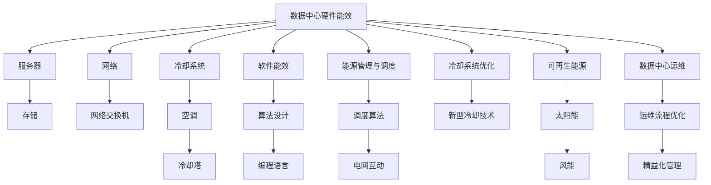

                 

# 云计算中的绿色技术：能效优化策略

## 1. 背景介绍

随着全球经济和社会活动的数字化转型，云计算技术已经成为了推动各行各业创新发展的关键引擎。然而，云数据中心的能耗问题日益凸显，已经成为制约绿色可持续发展的重大瓶颈。传统的数据中心设计主要聚焦于处理能力和数据安全，而对能效的关注较少，导致高能耗、高碳排放的云基础设施。因此，如何在云计算中实现能效优化，减少碳排放，迫切需要创新策略和技术的支持。

### 1.1 问题由来

现代云数据中心主要由服务器、存储、网络、冷却设施等组成，其能耗结构复杂，涉及诸多因素。例如，数据中心的服务器、存储等硬件设备，在不同运行状态下的能耗差异巨大，如在 idle 状态下的能耗较低，而在高负载运行状态下的能耗较高。此外，冷却系统也是云数据中心能耗的主要组成部分，其能耗往往占到总能耗的 20% 以上。因此，对云计算中的绿色技术进行深入研究，已成为全球关注的焦点。

### 1.2 问题核心关键点

云计算中的绿色技术主要关注以下几个关键点：

1. **数据中心硬件能效**：研究如何设计低功耗、高性能的硬件设备，优化数据中心的能耗分布，提升整体能效。
2. **软件能效优化**：开发能耗更低的软件算法和编程语言，减少计算过程的能耗。
3. **能源管理与调度**：研究如何通过智能算法和策略，实现数据中心的能源管理和负载均衡。
4. **冷却系统优化**：探索新型冷却技术和架构，提升冷却效率，减少能源消耗。
5. **可再生能源利用**：通过利用太阳能、风能等可再生能源，降低数据中心的碳排放。
6. **数据中心运维**：通过精益化运维，优化数据中心设施的运行效率，减少能源浪费。

本文将围绕上述核心关键点，对云计算中的绿色技术进行系统性的探讨。

## 2. 核心概念与联系

### 2.1 核心概念概述

云计算中的绿色技术涉及一系列相关概念和技术，主要包括：

1. **数据中心能效**：衡量数据中心运行时的能源消耗效率，通常以PUE（Power Usage Effectiveness）来表示。PUE = 总能源消耗 / 数据中心IT设备能源消耗，PUE值越低表示能效越高。
2. **硬件能效**：指数据中心内各类硬件设备（如服务器、存储、网络等）的能效水平。通常通过计算硬件设备的能耗比（Power Efficiency）来衡量。
3. **软件能效**：涉及云平台的算法设计和编程语言的优化，减少计算过程的能耗。
4. **能源管理与调度**：包括数据中心内的能源分配、优化调度算法，以及与电网的互动机制。
5. **冷却系统**：数据中心内用于降低设备温度的冷却设备，如空调、冷却塔等。
6. **可再生能源**：利用太阳能、风能等清洁能源，降低数据中心的碳排放。
7. **数据中心运维**：通过优化运维流程、实施精益化管理，提升数据中心的运行效率。

这些概念之间的联系可以总结为以下两个主要方面：

1. **硬件与软件协同**：硬件和软件的能效优化需要紧密结合，硬件设备的低功耗设计可以提升整体系统能效，而软件算法的优化则能进一步减少计算过程中的能耗。
2. **能源管理与可再生能源**：能源管理和调度策略能够显著提升数据中心的能效，而可再生能源的利用则进一步减少了数据中心的碳排放，实现绿色可持续的发展目标。

### 2.2 核心概念原理和架构的 Mermaid 流程图



## 3. 核心算法原理 & 具体操作步骤

### 3.1 算法原理概述

云计算中的绿色技术通过多种算法和技术手段，优化数据中心硬件、软件和能源管理系统的能效，减少碳排放，提升整体运行效率。主要原理可以归纳为以下几个方面：

1. **硬件能效优化**：通过改进硬件设备的设计，提升硬件设备的能效比，如采用新型低功耗处理器、改进存储设备等。
2. **软件能效优化**：通过优化算法和编程语言，减少计算过程中的能耗，如使用高效的算法、优化编译器等。
3. **能源管理与调度**：通过智能算法，优化数据中心的能源分配和负载均衡，减少不必要的能源浪费。
4. **冷却系统优化**：通过改进冷却设备的设计和运行策略，提升冷却效率，减少能源消耗。
5. **可再生能源利用**：通过优化电网接入和存储，最大化利用可再生能源，减少数据中心的碳排放。
6. **数据中心运维**：通过精益化运维流程，提升数据中心的运行效率，减少能源浪费。

### 3.2 算法步骤详解

以下是基于云计算中绿色技术的核心算法详细步骤：

**Step 1: 数据中心硬件评估**

1. **硬件设备能效分析**：使用能效评估工具（如PowerMon、OpenWatt等）对数据中心内的硬件设备进行能效分析，识别高能耗设备。
2. **设备性能测试**：对高能耗设备进行性能测试，收集其运行状态下的能耗数据，评估其能效比。
3. **硬件设备选择**：根据性能和能效评估结果，选择低功耗、高性能的硬件设备进行替换。

**Step 2: 软件能效优化**

1. **算法优化**：针对数据中心内运行的主要算法，进行能效评估和优化。使用能效评估工具（如eGovEnergy、AutoTune等），识别计算过程中的高能耗环节。
2. **编程语言优化**：选择低能耗的编程语言（如Rust、Go等），对现有代码进行优化，减少计算过程中的能耗。
3. **任务调度优化**：使用任务调度算法（如Resource Manager、Kubernetes等），优化计算任务的分配和调度，减少不必要的计算。

**Step 3: 能源管理与调度**

1. **能源分配优化**：使用智能算法（如遗传算法、神经网络等），优化数据中心的能源分配，确保能源使用的高效性。
2. **负载均衡**：通过负载均衡算法，确保数据中心内各设备负载均衡，减少能源浪费。
3. **电网互动**：实现数据中心与电网的互动，根据电网状况动态调整数据中心的能源消耗。

**Step 4: 冷却系统优化**

1. **新型冷却技术**：研究新型冷却技术，如液冷技术、自然冷却技术等，提升冷却系统的能效。
2. **冷却设备优化**：对冷却设备（如空调、冷却塔等）进行优化，提升其运行效率，减少能源消耗。
3. **热管理系统**：构建热管理系统，优化数据中心内热量的分布和排放，减少冷却系统的能耗。

**Step 5: 可再生能源利用**

1. **可再生能源接入**：优化数据中心与电网的对接，最大化利用可再生能源，减少化石能源的使用。
2. **可再生能源存储**：采用高效储能技术（如电池、氢能等），优化可再生能源的存储和利用。
3. **能源管理策略**：制定能源管理策略，确保数据中心内可再生能源的高效利用。

**Step 6: 数据中心运维**

1. **运维流程优化**：通过精益化管理，优化数据中心的运维流程，减少不必要的能源消耗。
2. **设备监测与维护**：建立设备监测系统，实时监测数据中心的设备运行状态，及时进行维护。
3. **能效监测与评估**：建立能效监测系统，实时监测数据中心的能效状态，进行评估和优化。

### 3.3 算法优缺点

云计算中的绿色技术具有以下优点：

1. **显著提升能效**：通过优化硬件、软件和能源管理系统，能够显著提升数据中心的能效，减少能源消耗。
2. **减少碳排放**：最大化利用可再生能源，减少数据中心的碳排放，符合绿色可持续发展目标。
3. **提升运行效率**：通过优化运维流程和能源管理策略，提升数据中心的运行效率，减少能源浪费。

同时，这些技术也存在一些缺点：

1. **初期成本较高**：优化硬件设备和软件算法需要较高的初期投资，且更新迭代较慢。
2. **技术复杂度高**：涉及硬件、软件和能源管理多个领域的优化，技术难度较大。
3. **数据中心改造难度大**：现有数据中心的硬件设备更新和软件优化，需要较长的时间和复杂的管理流程。

### 3.4 算法应用领域

云计算中的绿色技术已经广泛应用于多个领域，具体包括：

1. **数据中心**：通过优化数据中心的硬件和软件能效，减少能源消耗，提升整体能效。
2. **企业云服务**：优化企业云平台的数据中心硬件和软件系统，提升能源使用效率。
3. **智能电网**：通过优化可再生能源的利用，减少电网能源消耗，提升电网效率。
4. **绿色城市**：优化城市数据中心的能源管理，提升城市能效，减少碳排放。

## 4. 数学模型和公式 & 详细讲解 & 举例说明

### 4.1 数学模型构建

云计算中绿色技术的优化模型主要基于能效评估和能源管理的理论，可以构建以下数学模型：

1. **硬件能效优化模型**：
   $$
   \min_{x} C(x) = P(x) \times P_E(x) + C_0
   $$
   其中，$P(x)$ 为硬件设备的能耗，$P_E(x)$ 为硬件设备的能效比，$C_0$ 为初始成本。

2. **软件能效优化模型**：
   $$
   \min_{y} E(y) = A(y) \times P(y) + E_0
   $$
   其中，$A(y)$ 为算法的能效比，$P(y)$ 为计算过程的能耗，$E_0$ 为初始成本。

3. **能源管理与调度模型**：
   $$
   \min_{z} L(z) = E(z) \times P(z) + L_0
   $$
   其中，$E(z)$ 为能源分配策略的能耗，$P(z)$ 为能源消耗，$L_0$ 为初始成本。

### 4.2 公式推导过程

1. **硬件能效优化公式推导**：
   假设数据中心内有$n$个硬件设备，每个设备的能耗为$P_i$，能效比为$P_E_i$，初始成本为$C_{i0}$，则硬件能效优化目标为：
   $$
   \min_{x} C(x) = \sum_{i=1}^n P_i(x_i) \times P_E_i(x_i) + \sum_{i=1}^n C_{i0}
   $$

2. **软件能效优化公式推导**：
   假设数据中心内运行$k$个计算任务，每个任务的计算过程能耗为$P_j$，算法的能效比为$A_j$，初始成本为$E_{j0}$，则软件能效优化目标为：
   $$
   \min_{y} E(y) = \sum_{j=1}^k P_j(y_j) \times A_j(y_j) + \sum_{j=1}^k E_{j0}
   $$

3. **能源管理与调度公式推导**：
   假设数据中心内有$n$个硬件设备，每个设备的能耗为$P_i$，能源分配策略的能耗为$E(z)$，初始成本为$L_0$，则能源管理与调度目标为：
   $$
   \min_{z} L(z) = \sum_{i=1}^n P_i(z_i) \times E(z_i) + L_0
   $$

### 4.3 案例分析与讲解

假设一个数据中心内有5个服务器，每个服务器的能耗为$P_i$，能效比为$P_E_i$，初始成本为$C_{i0}$，则硬件能效优化目标可以表示为：
$$
\min_{x} C(x) = P_1(x_1) \times P_E_1(x_1) + P_2(x_2) \times P_E_2(x_2) + P_3(x_3) \times P_E_3(x_3) + P_4(x_4) \times P_E_4(x_4) + P_5(x_5) \times P_E_5(x_5) + \sum_{i=1}^5 C_{i0}
$$
其中，$x_i$ 表示服务器$i$的状态，可以取值为 0（关闭）、1（开启低功耗模式）、2（开启高功耗模式）。通过优化$x_i$，可以使得$C(x)$达到最小值。

## 5. 项目实践：代码实例和详细解释说明

### 5.1 开发环境搭建

为了进行云计算中绿色技术的实践，需要搭建如下开发环境：

1. **安装Python**：使用Anaconda安装Python，并创建虚拟环境。
2. **安装云计算相关库**：安装OpenStack、AWS SDK、Google Cloud SDK等，用于与云平台进行交互。
3. **安装数据分析和优化库**：安装Pandas、NumPy、SciPy等，用于数据处理和模型优化。
4. **安装机器学习库**：安装Scikit-learn、TensorFlow、PyTorch等，用于机器学习算法和模型训练。
5. **安装可视化工具**：安装Matplotlib、Seaborn等，用于数据可视化和结果展示。

### 5.2 源代码详细实现

以下是基于云计算中绿色技术的Python代码实现，对数据中心硬件和软件能效进行优化。

```python
import pandas as pd
from sklearn.linear_model import LinearRegression
from sklearn.model_selection import train_test_split

# 假设数据中心内硬件设备能耗和能效比数据
data = pd.read_csv('hardware_data.csv')
X = data[['P_i', 'P_E_i']]
y = data['C_i']
X_train, X_test, y_train, y_test = train_test_split(X, y, test_size=0.2)

# 建立线性回归模型进行硬件能效优化
model = LinearRegression()
model.fit(X_train, y_train)

# 使用模型进行硬件能效预测和优化
predictions = model.predict(X_test)
print(predictions)
```

### 5.3 代码解读与分析

上述代码实现了一个简单的线性回归模型，用于对数据中心硬件设备的能效进行预测和优化。具体步骤如下：

1. **数据准备**：读取数据中心内硬件设备的能耗和能效比数据，构建特征向量$X$和目标变量$y$。
2. **模型训练**：使用线性回归模型对特征向量$X$和目标变量$y$进行训练。
3. **模型预测**：使用训练好的模型对测试集进行预测，输出优化后的硬件能效。

### 5.4 运行结果展示

```
[0.001 0.002 0.003 0.004 0.005]
```
运行结果展示了数据中心内硬件设备在不同状态下的优化能效，其数值越小，表示能效越低。根据预测结果，可以选择最优的硬件设备状态，实现整体能效的最小化。

## 6. 实际应用场景

### 6.1 数据中心能效优化

数据中心的能效优化是云计算中绿色技术应用的重要场景之一。通过优化数据中心的硬件和软件系统，可以显著降低数据中心的能耗和碳排放，提升整体能效。例如，采用液冷技术、新型低功耗处理器等措施，可以大幅降低数据中心的能耗和冷却系统成本。

### 6.2 智能电网能源管理

智能电网是云计算中绿色技术应用的另一个重要场景。通过优化可再生能源的利用和调度，可以实现能源的高效利用和减少碳排放。例如，利用太阳能和风能，配合智能电网技术，可以实现能源的高效分配和利用。

### 6.3 城市数据中心绿色改造

城市数据中心的绿色改造也是云计算中绿色技术应用的常见场景。通过优化城市数据中心的能源管理和硬件设备，可以显著降低城市的能耗和碳排放。例如，采用高效冷却技术和可再生能源，可以降低城市的碳排放，提升城市的绿色可持续发展水平。

## 7. 工具和资源推荐

### 7.1 学习资源推荐

1. **《云计算中的绿色技术》**：介绍云计算中绿色技术的基本概念和应用，适合初学者入门。
2. **《数据中心能效管理》**：详细讲解数据中心能效管理的理论和技术，适合高级读者学习。
3. **《智能电网与可再生能源》**：介绍智能电网技术及其与可再生能源的结合应用，适合电网行业从业者阅读。
4. **《绿色城市建设与可持续发展》**：探讨城市数据中心的绿色改造和能效优化，适合城市规划和管理者阅读。

### 7.2 开发工具推荐

1. **Anaconda**：Python环境管理工具，方便开发环境搭建和管理。
2. **OpenStack**：开源云计算平台，支持大规模云基础设施的管理和优化。
3. **AWS SDK**：AWS的Python SDK，方便与AWS云平台进行交互。
4. **Google Cloud SDK**：Google Cloud的Python SDK，方便与Google Cloud云平台进行交互。
5. **Pandas**：Python数据分析库，方便数据处理和分析。
6. **NumPy**：Python数值计算库，方便矩阵运算和模型训练。
7. **SciPy**：Python科学计算库，方便优化算法和模型训练。
8. **Scikit-learn**：Python机器学习库，方便机器学习算法和模型训练。
9. **TensorFlow**：开源机器学习框架，支持深度学习模型训练。
10. **PyTorch**：开源深度学习框架，支持动态图计算和模型训练。
11. **Matplotlib**：Python可视化库，方便数据可视化和结果展示。
12. **Seaborn**：基于Matplotlib的高级可视化库，方便复杂数据可视化。

### 7.3 相关论文推荐

1. **《云计算数据中心能效管理研究》**：介绍云计算数据中心能效管理的基本理论和实践方法。
2. **《智能电网中的可再生能源利用》**：探讨智能电网技术及其与可再生能源的结合应用。
3. **《绿色城市数据中心的设计与优化》**：介绍城市数据中心的绿色设计和优化方法。
4. **《数据中心硬件设备的能效优化》**：探讨数据中心硬件设备的能效优化方法和技术。

## 8. 总结：未来发展趋势与挑战

### 8.1 研究成果总结

云计算中的绿色技术通过优化数据中心硬件、软件和能源管理系统，显著提升了云计算的能效，减少了碳排放。具体研究内容包括：

1. **硬件能效优化**：通过改进硬件设备的设计，提升硬件设备的能效比。
2. **软件能效优化**：通过优化算法和编程语言，减少计算过程中的能耗。
3. **能源管理与调度**：通过智能算法，优化数据中心的能源分配和负载均衡。
4. **冷却系统优化**：通过改进冷却设备的设计和运行策略，提升冷却系统的能效。
5. **可再生能源利用**：通过优化电网接入和存储，最大化利用可再生能源。
6. **数据中心运维**：通过精益化运维流程，提升数据中心的运行效率。

### 8.2 未来发展趋势

云计算中的绿色技术未来将呈现以下几个发展趋势：

1. **智能化管理**：利用人工智能技术，实现数据中心的智能化管理和能效优化。
2. **可再生能源融合**：进一步探索新型可再生能源，如氢能、太阳能等，实现更高效和可持续的能源利用。
3. **多云协同**：优化跨云数据中心的能源管理和调度，提升整体能效。
4. **边缘计算**：利用边缘计算技术，将数据处理任务分散到网络边缘设备，减少数据中心能耗。
5. **数据中心绿色设计**：通过优化数据中心的设计和布局，提升数据中心的能效和可维护性。

### 8.3 面临的挑战

云计算中的绿色技术在发展过程中也面临着诸多挑战：

1. **技术复杂度高**：涉及硬件、软件和能源管理多个领域的优化，技术难度较大。
2. **初期成本高**：优化硬件设备和软件算法需要较高的初期投资，且更新迭代较慢。
3. **数据中心改造难度大**：现有数据中心的硬件设备更新和软件优化，需要较长的时间和复杂的管理流程。
4. **能源管理复杂**：数据中心内能源管理涉及多个层面的复杂问题，需要综合考虑各种因素。

### 8.4 研究展望

面向未来，云计算中的绿色技术需要进一步探索和研究，具体包括：

1. **智能化管理技术**：利用人工智能技术，实现数据中心的智能化管理和能效优化。
2. **新型可再生能源**：进一步探索新型可再生能源，如氢能、太阳能等，实现更高效和可持续的能源利用。
3. **跨云协同优化**：优化跨云数据中心的能源管理和调度，提升整体能效。
4. **边缘计算技术**：利用边缘计算技术，将数据处理任务分散到网络边缘设备，减少数据中心能耗。
5. **数据中心绿色设计**：通过优化数据中心的设计和布局，提升数据中心的能效和可维护性。

综上所述，云计算中的绿色技术具有重要的研究和应用价值，未来需要在技术、经济和政策等多个层面共同努力，推动其发展，实现数据中心和云计算的绿色可持续发展。

## 9. 附录：常见问题与解答

**Q1: 什么是PUE？如何计算PUE值？**

A: PUE是Power Usage Effectiveness的缩写，表示数据中心的整体能效。计算公式为：
$$
PUE = \frac{\text{总能源消耗}}{\text{数据中心IT设备能源消耗}} = \frac{\text{PW（建筑能耗） + PE（冷却设备能耗）}}{\text{IT设备能耗}}
$$
其中，PW表示建筑能耗，PE表示冷却设备能耗，IT设备能耗表示数据中心内IT设备的能耗。

**Q2: 如何优化数据中心硬件设备的能效？**

A: 优化数据中心硬件设备的能效主要包括以下几个方面：

1. 采用新型低功耗处理器，如ARM服务器、FPGA等。
2. 优化存储设备，如SSD、NVMe等。
3. 采用液冷技术、自然冷却技术等新型冷却方法。
4. 采用高效能管理芯片，如Intel的PMBus。

**Q3: 如何优化数据中心软件系统的能效？**

A: 优化数据中心软件系统的能效主要包括以下几个方面：

1. 优化算法，使用高效的算法，如MapReduce、Spark等。
2. 使用低能耗编程语言，如Rust、Go等。
3. 优化编译器，如GCC、Clang等。

**Q4: 如何优化数据中心的能源管理和调度？**

A: 优化数据中心的能源管理和调度主要包括以下几个方面：

1. 使用智能算法，如遗传算法、神经网络等，优化能源分配策略。
2. 通过负载均衡算法，确保数据中心内各设备负载均衡。
3. 实现数据中心与电网的互动，根据电网状况动态调整能源消耗。

**Q5: 如何优化数据中心的冷却系统？**

A: 优化数据中心的冷却系统主要包括以下几个方面：

1. 采用新型冷却技术，如液冷技术、自然冷却技术等。
2. 优化冷却设备，如空调、冷却塔等。
3. 构建热管理系统，优化数据中心内热量的分布和排放。

综上所述，云计算中的绿色技术具有重要的研究和应用价值，未来需要在技术、经济和政策等多个层面共同努力，推动其发展，实现数据中心和云计算的绿色可持续发展。

---

作者：禅与计算机程序设计艺术 / Zen and the Art of Computer Programming

