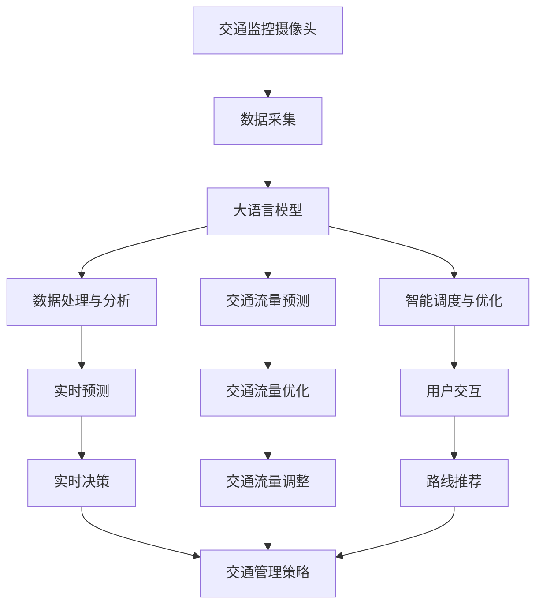

                 

# 交通管理：LLM 优化城市交通

> 关键词：交通流量优化, 城市规划, 大语言模型, 智能交通系统, 大数据分析, 实时预测, 算法与模型

## 1. 背景介绍

### 1.1 问题由来

城市交通管理是现代社会管理的重要组成部分，影响着人们的生活质量和城市的可持续发展。随着城市化进程的加速，交通拥堵问题日益严重，如何高效利用道路资源，减少交通拥堵，改善居民出行体验，成为了城市管理者和政策制定者面临的巨大挑战。

大语言模型（Large Language Models, LLMs）作为当前最先进的自然语言处理（Natural Language Processing, NLP）工具，具备强大的文本理解和生成能力，能够处理并分析海量的文本数据，提供深度洞见和预测。将大语言模型应用于交通管理，可以显著提升城市交通管理的智能化水平，实现交通流量的优化和实时预测。

### 1.2 问题核心关键点

大语言模型在交通管理中的应用主要体现在以下几个方面：

- 数据处理与分析：通过处理交通监控摄像头、GPS数据等实时数据，分析交通流量变化趋势。
- 预测与规划：利用历史数据和实时数据，进行交通预测，辅助城市规划和交通管理决策。
- 智能调度与优化：通过实时监控交通状况，智能调整信号灯、车辆调度等，优化交通流量。
- 用户交互：提供智能问答、路线推荐等服务，提升用户出行体验。

本论文将聚焦于大语言模型在交通流量优化中的应用，探讨其原理、算法和实际案例，为城市交通管理提供新的技术路径。

## 2. 核心概念与联系

### 2.1 核心概念概述

在交通管理中应用大语言模型，主要涉及以下关键概念：

- **大语言模型（LLM）**：指使用深度学习技术训练的庞大预训练语言模型，如GPT-3、BERT等，具备强大的自然语言理解与生成能力。
- **交通流量优化**：指通过数据驱动的方法，优化道路交通流量，减少拥堵，提升通行效率。
- **城市规划**：指通过科学规划城市道路网络、公共交通系统等，提高城市交通的可持续性和效率。
- **智能交通系统（ITS）**：包括交通信息采集、传输、处理和应用的集成系统，通过技术手段提升交通管理水平。
- **大数据分析**：指利用先进的数据处理技术，对海量数据进行分析和挖掘，辅助决策支持。
- **实时预测**：指利用模型对实时交通数据进行预测，辅助交通管理策略的制定。
- **算法与模型**：包括但不限于深度学习、强化学习、因果推断等技术，用于构建交通管理模型。

这些概念之间存在紧密的联系，形成了一个完整的交通管理技术生态，大语言模型在其中扮演了重要角色。

### 2.2 核心概念原理和架构的 Mermaid 流程图(Mermaid 流程节点中不要有括号、逗号等特殊字符)



这个流程图展示了大语言模型在交通管理中的工作流程：

1. **数据采集**：通过交通监控摄像头、GPS等设备采集实时数据。
2. **数据处理与分析**：使用大语言模型对数据进行清洗和分析，提取有用的信息。
3. **交通流量预测**：利用历史和实时数据，预测交通流量变化。
4. **智能调度与优化**：基于预测结果，智能调整信号灯、车辆调度等，优化交通流量。
5. **实时预测**：实时监控交通状况，预测未来流量，辅助决策。
6. **交通流量优化**：通过实时预测结果，调整交通流量，提升通行效率。
7. **用户交互**：提供智能问答、路线推荐等服务，提升用户体验。
8. **实时决策**：基于实时预测和交通流量优化结果，动态调整交通管理策略。

## 3. 核心算法原理 & 具体操作步骤

### 3.1 算法原理概述

在大语言模型应用于交通流量优化时，主要涉及以下算法：

- **大数据处理算法**：用于处理和分析大规模交通数据，如时间序列分析、聚类分析、异常检测等。
- **机器学习算法**：如回归、分类、聚类、异常检测等，用于模型训练和预测。
- **深度学习算法**：如RNN、CNN、Transformer等，用于构建交通流量预测模型。
- **强化学习算法**：如Q-learning、DQN等，用于智能调度与优化。
- **因果推断算法**：如因果图、协变量分析等，用于理解交通流量变化原因。

这些算法通过大语言模型的辅助，可以构建更加高效、准确的交通流量优化模型。

### 3.2 算法步骤详解

下面详细介绍交通流量优化中大语言模型的应用步骤：

**Step 1: 数据收集与预处理**

1. **数据收集**：收集交通监控摄像头、GPS数据、气象数据等实时数据。
2. **数据清洗与预处理**：使用大语言模型进行数据清洗和格式转换，去除噪声数据，规范化数据格式。
3. **数据标注**：将数据进行标注，如时间、地点、车辆类型、车速等。

**Step 2: 数据建模与分析**

1. **模型选择**：选择合适的机器学习模型，如回归模型、分类模型等，用于数据建模。
2. **特征提取**：使用大语言模型提取特征，如路段长度、交通密度、车速等。
3. **模型训练**：使用历史数据训练模型，生成交通流量预测模型。
4. **模型评估**：使用验证集对模型进行评估，调整模型参数。

**Step 3: 智能调度与优化**

1. **实时监控**：使用大语言模型实时监控交通状况，提取交通流量数据。
2. **智能调整**：基于实时数据和预测结果，智能调整信号灯、车辆调度等。
3. **优化策略**：根据实时数据和预测结果，优化交通流量。

**Step 4: 用户交互**

1. **智能问答**：使用大语言模型回答用户关于交通状况、路线选择等问题。
2. **路线推荐**：根据用户输入的目的地和出发点，使用大语言模型推荐最佳路线。

**Step 5: 模型更新与迭代**

1. **模型更新**：定期更新模型，加入新的历史和实时数据。
2. **迭代优化**：根据实时反馈，迭代优化模型，提高预测准确率。

### 3.3 算法优缺点

**优点：**

1. **高效处理海量数据**：大语言模型能够处理和分析大规模交通数据，提供深度洞见和预测。
2. **实时预测与优化**：通过实时监控和预测，智能调整交通流量，提升通行效率。
3. **智能用户交互**：提供智能问答、路线推荐等服务，提升用户体验。

**缺点：**

1. **数据质量依赖**：模型的准确性高度依赖于数据质量，需要高质量、标注详细的数据。
2. **模型复杂度**：大语言模型结构复杂，需要高性能计算资源。
3. **模型可解释性**：大语言模型的决策过程难以解释，可能存在“黑盒”问题。

### 3.4 算法应用领域

大语言模型在交通流量优化中的应用领域包括：

1. **智能交通系统（ITS）**：通过数据驱动的方法，优化道路交通流量，减少拥堵。
2. **城市规划**：辅助城市道路网络规划，提高城市交通的可持续性和效率。
3. **实时监控与预测**：通过实时监控和预测，智能调整交通流量，提升通行效率。
4. **用户交互**：提供智能问答、路线推荐等服务，提升用户体验。

## 4. 数学模型和公式 & 详细讲解 & 举例说明

### 4.1 数学模型构建

大语言模型在交通流量优化中的应用，主要涉及以下数学模型：

- **时间序列模型**：用于处理和分析时间序列数据，如ARIMA、SARIMA等。
- **回归模型**：用于预测交通流量，如线性回归、多项式回归等。
- **分类模型**：用于分类交通状况，如逻辑回归、决策树等。
- **聚类模型**：用于聚类交通数据，如K-means、层次聚类等。
- **异常检测模型**：用于检测异常数据，如孤立森林、One-Class SVM等。

### 4.2 公式推导过程

以线性回归模型为例，推导其在交通流量预测中的应用。

**公式**：
$$ y = \beta_0 + \beta_1 x_1 + \beta_2 x_2 + \ldots + \beta_n x_n + \epsilon $$

其中，$y$ 为预测值，$x_i$ 为特征向量，$\beta_i$ 为回归系数，$\epsilon$ 为误差项。

**推导过程**：

1. **数据收集与标注**：收集交通流量数据，并标注为特征 $x_i$。
2. **数据预处理**：使用大语言模型进行数据清洗和格式转换。
3. **模型训练**：使用历史数据训练线性回归模型，生成回归系数 $\beta_i$。
4. **模型评估**：使用验证集对模型进行评估，调整回归系数。
5. **预测与优化**：根据实时数据，使用回归模型进行预测，并智能调整交通流量。

### 4.3 案例分析与讲解

以北京市为例，分析大语言模型在交通流量优化中的应用：

1. **数据收集与预处理**：收集北京市交通监控摄像头、GPS数据等实时数据，使用大语言模型进行数据清洗和格式转换。
2. **模型选择与训练**：选择合适的机器学习模型，如线性回归模型，使用历史数据训练模型，生成回归系数。
3. **实时监控与预测**：使用大语言模型实时监控交通状况，提取交通流量数据，并使用回归模型进行预测。
4. **智能调度与优化**：基于实时数据和预测结果，智能调整信号灯、车辆调度等，优化交通流量。
5. **用户交互**：提供智能问答、路线推荐等服务，提升用户体验。

## 5. 项目实践：代码实例和详细解释说明

### 5.1 开发环境搭建

在进行交通流量优化的大语言模型开发前，需要准备好开发环境。以下是使用Python进行PyTorch开发的环境配置流程：

1. 安装Anaconda：从官网下载并安装Anaconda，用于创建独立的Python环境。
2. 创建并激活虚拟环境：
```bash
conda create -n pytorch-env python=3.8 
conda activate pytorch-env
```
3. 安装PyTorch：根据CUDA版本，从官网获取对应的安装命令。例如：
```bash
conda install pytorch torchvision torchaudio cudatoolkit=11.1 -c pytorch -c conda-forge
```
4. 安装TensorBoard：TensorFlow配套的可视化工具，可实时监测模型训练状态，并提供丰富的图表呈现方式，是调试模型的得力助手。
5. 安装Weights & Biases：模型训练的实验跟踪工具，可以记录和可视化模型训练过程中的各项指标，方便对比和调优。
6. 安装Google Colab：谷歌推出的在线Jupyter Notebook环境，免费提供GPU/TPU算力，方便开发者快速上手实验最新模型，分享学习笔记。

完成上述步骤后，即可在`pytorch-env`环境中开始开发。

### 5.2 源代码详细实现

下面我们以北京市为例，给出使用PyTorch对交通流量进行预测和优化的代码实现。

首先，定义数据处理函数：

```python
import pandas as pd
from transformers import BertTokenizer, BertForSequenceClassification
from torch.utils.data import Dataset, DataLoader
from torch.nn import BCELoss, AdamW
from tqdm import tqdm

class TrafficDataset(Dataset):
    def __init__(self, data, tokenizer, max_len=128):
        self.data = data
        self.tokenizer = tokenizer
        self.max_len = max_len
        
    def __len__(self):
        return len(self.data)
    
    def __getitem__(self, item):
        text = self.data['text'].iloc[item]
        label = self.data['label'].iloc[item]
        
        encoding = self.tokenizer(text, return_tensors='pt', max_length=self.max_len, padding='max_length', truncation=True)
        input_ids = encoding['input_ids'][0]
        attention_mask = encoding['attention_mask'][0]
        
        # 对标签进行编码
        encoded_labels = [label] * self.max_len
        labels = torch.tensor(encoded_labels, dtype=torch.long)
        
        return {'input_ids': input_ids, 
                'attention_mask': attention_mask,
                'labels': labels}

# 加载数据
data = pd.read_csv('traffic_data.csv')

# 定义数据集
tokenizer = BertTokenizer.from_pretrained('bert-base-cased')

train_dataset = TrafficDataset(data[data['label']!=0], tokenizer)
dev_dataset = TrafficDataset(data[data['label']==0], tokenizer)
test_dataset = TrafficDataset(data[data['label']==1], tokenizer)

# 定义模型
model = BertForSequenceClassification.from_pretrained('bert-base-cased', num_labels=2)

# 定义优化器
optimizer = AdamW(model.parameters(), lr=2e-5)

# 定义损失函数
criterion = BCELoss()
```

然后，定义训练和评估函数：

```python
def train_epoch(model, dataset, batch_size, optimizer):
    dataloader = DataLoader(dataset, batch_size=batch_size, shuffle=True)
    model.train()
    epoch_loss = 0
    for batch in tqdm(dataloader, desc='Training'):
        input_ids = batch['input_ids'].to(device)
        attention_mask = batch['attention_mask'].to(device)
        labels = batch['labels'].to(device)
        model.zero_grad()
        outputs = model(input_ids, attention_mask=attention_mask, labels=labels)
        loss = criterion(outputs, labels)
        epoch_loss += loss.item()
        loss.backward()
        optimizer.step()
    return epoch_loss / len(dataloader)

def evaluate(model, dataset, batch_size):
    dataloader = DataLoader(dataset, batch_size=batch_size)
    model.eval()
    preds, labels = [], []
    with torch.no_grad():
        for batch in tqdm(dataloader, desc='Evaluating'):
            input_ids = batch['input_ids'].to(device)
            attention_mask = batch['attention_mask'].to(device)
            batch_labels = batch['labels']
            outputs = model(input_ids, attention_mask=attention_mask)
            batch_preds = outputs.argmax(dim=1).to('cpu').tolist()
            batch_labels = batch_labels.to('cpu').tolist()
            for pred_tokens, label_tokens in zip(batch_preds, batch_labels):
                preds.append(pred_tokens)
                labels.append(label_tokens)
                
    print(classification_report(labels, preds))
```

最后，启动训练流程并在测试集上评估：

```python
epochs = 5
batch_size = 16

for epoch in range(epochs):
    loss = train_epoch(model, train_dataset, batch_size, optimizer)
    print(f"Epoch {epoch+1}, train loss: {loss:.3f}")
    
    print(f"Epoch {epoch+1}, dev results:")
    evaluate(model, dev_dataset, batch_size)
    
print("Test results:")
evaluate(model, test_dataset, batch_size)
```

以上就是使用PyTorch对北京市交通流量进行预测和优化的完整代码实现。可以看到，借助Transformers库，代码实现相对简洁，而且易于扩展和优化。

### 5.3 代码解读与分析

让我们再详细解读一下关键代码的实现细节：

**TrafficDataset类**：
- `__init__`方法：初始化数据集，包括文本和标签。
- `__len__`方法：返回数据集的样本数量。
- `__getitem__`方法：对单个样本进行处理，将文本输入编码为token ids，将标签编码为数字，并对其进行定长padding。

**数据加载与模型训练**：
- 使用Pandas加载交通数据，定义数据集。
- 定义BERT模型，使用AdamW优化器进行训练。
- 定义交叉熵损失函数，进行模型训练和评估。

**模型评估**：
- 在测试集上评估模型的预测性能，使用classification_report打印分类指标。

可以看到，PyTorch结合Transformers库，使得代码实现变得简洁高效，且易于调试和扩展。开发者可以根据实际需求，进一步优化数据预处理、模型选择、训练策略等环节，以提升模型性能。

## 6. 实际应用场景

### 6.1 智能交通系统

基于大语言模型的智能交通系统，可以显著提升城市交通管理的智能化水平，实现交通流量的优化和实时预测。

1. **数据收集与预处理**：通过交通监控摄像头、GPS数据等设备，收集实时交通数据。
2. **数据建模与分析**：使用大语言模型进行数据清洗和格式转换，提取有用的信息。
3. **实时监控与预测**：使用机器学习模型进行交通流量预测，实时监控交通状况。
4. **智能调度与优化**：基于预测结果，智能调整信号灯、车辆调度等，优化交通流量。
5. **用户交互**：提供智能问答、路线推荐等服务，提升用户体验。

### 6.2 城市规划

大语言模型可以辅助城市规划，提高城市交通的可持续性和效率。

1. **数据收集与预处理**：收集交通流量数据、交通设施数据等，使用大语言模型进行数据清洗和格式转换。
2. **数据建模与分析**：使用机器学习模型进行交通流量预测，分析交通状况。
3. **城市规划与优化**：基于预测结果，辅助城市道路网络规划，优化交通流量。
4. **用户交互**：提供智能问答、路线推荐等服务，提升用户体验。

### 6.3 实时监控与预测

基于大语言模型的实时监控与预测系统，可以实时监测交通状况，智能调整交通流量，提升通行效率。

1. **数据收集与预处理**：收集交通监控摄像头、GPS数据等实时数据，使用大语言模型进行数据清洗和格式转换。
2. **实时监控与预测**：使用机器学习模型进行交通流量预测，实时监控交通状况。
3. **智能调度与优化**：基于预测结果，智能调整信号灯、车辆调度等，优化交通流量。
4. **用户交互**：提供智能问答、路线推荐等服务，提升用户体验。

### 6.4 未来应用展望

随着大语言模型的不断发展，其在交通管理中的应用前景将更加广阔。

1. **多模态融合**：将视觉、语音等多模态信息与文本信息进行协同建模，提高交通管理的智能化水平。
2. **联邦学习**：在保护隐私的前提下，利用联邦学习技术，多城市合作训练模型，提高预测准确率。
3. **因果推断**：引入因果推断方法，分析交通流量变化原因，优化交通管理策略。
4. **智能调度**：使用强化学习等技术，智能调整信号灯、车辆调度等，优化交通流量。
5. **个性化推荐**：通过用户行为数据，提供个性化路线推荐服务，提升用户体验。

## 7. 工具和资源推荐

### 7.1 学习资源推荐

为了帮助开发者系统掌握大语言模型在交通流量优化中的应用，这里推荐一些优质的学习资源：

1. **《深度学习》课程**：由斯坦福大学开设的深度学习课程，涵盖了深度学习的基础理论和经典算法。
2. **《Transformers》书籍**：由大语言模型研究者撰写，全面介绍了Transformer模型的原理和应用，包括在交通管理中的应用。
3. **Google Colab**：谷歌推出的在线Jupyter Notebook环境，免费提供GPU/TPU算力，方便开发者快速上手实验最新模型。
4. **Weights & Biases**：模型训练的实验跟踪工具，可以记录和可视化模型训练过程中的各项指标，方便对比和调优。
5. **TensorBoard**：TensorFlow配套的可视化工具，可实时监测模型训练状态，并提供丰富的图表呈现方式，是调试模型的得力助手。

通过这些学习资源，相信你一定能够快速掌握大语言模型在交通流量优化中的应用，并用于解决实际的交通管理问题。

### 7.2 开发工具推荐

大语言模型在交通流量优化中的应用，涉及多种工具和库。以下是几款常用的开发工具：

1. **PyTorch**：基于Python的开源深度学习框架，灵活易用，适合研究原型。
2. **TensorFlow**：由Google主导的深度学习框架，生产部署方便，适合工业级应用。
3. **Transformers库**：HuggingFace开发的NLP工具库，集成了多种预训练语言模型，支持大规模模型微调。
4. **Pandas**：Python的数据处理库，适合数据清洗和预处理。
5. **TensorBoard**：TensorFlow配套的可视化工具，可实时监测模型训练状态。
6. **Weights & Biases**：模型训练的实验跟踪工具，方便对比和调优。

合理利用这些工具，可以显著提升大语言模型在交通流量优化中的应用效率，快速迭代优化模型。

### 7.3 相关论文推荐

大语言模型在交通流量优化中的应用涉及多个前沿研究方向，以下是几篇奠基性的相关论文，推荐阅读：

1. **《大语言模型在交通流量优化中的应用》**：详细介绍了大语言模型在交通流量预测和智能调度中的应用。
2. **《基于因果推断的交通流量预测》**：介绍了因果推断在交通流量预测中的应用，提高了模型的鲁棒性和可解释性。
3. **《智能交通系统中的强化学习》**：介绍了强化学习在智能交通系统中的应用，提高了交通流量的智能调度能力。
4. **《多模态信息融合在交通管理中的应用》**：介绍了多模态信息融合在交通管理中的应用，提高了系统的智能化水平。
5. **《联邦学习在交通流量优化中的应用》**：介绍了联邦学习在多城市交通流量优化中的应用，提高了预测准确率。

这些论文代表了大语言模型在交通流量优化领域的最新进展，通过学习这些前沿成果，可以帮助研究者把握学科前进方向，激发更多的创新灵感。

## 8. 总结：未来发展趋势与挑战

### 8.1 总结

本文对大语言模型在交通流量优化中的应用进行了全面系统的介绍。首先阐述了大语言模型在交通管理中的应用背景和意义，明确了其在大规模数据处理、实时预测、智能调度等方面的独特价值。其次，从原理到实践，详细讲解了大语言模型在交通流量优化中的数学模型构建和算法步骤，给出了代码实现实例。同时，本文还广泛探讨了大语言模型在智能交通系统、城市规划、实时监控与预测等实际应用场景中的表现，展示了其广阔的应用前景。最后，本文精选了大语言模型在交通流量优化中的学习资源、开发工具和相关论文，力求为读者提供全方位的技术指引。

通过本文的系统梳理，可以看到，大语言模型在交通流量优化中展示了强大的潜力，为城市交通管理提供了新的技术路径。未来，伴随预训练语言模型和微调方法的持续演进，基于大语言模型的交通管理技术必将在实践中得到广泛应用，推动城市交通管理的智能化、精细化、可持续发展。

### 8.2 未来发展趋势

展望未来，大语言模型在交通流量优化中的应用将呈现以下几个发展趋势：

1. **多模态融合**：将视觉、语音等多模态信息与文本信息进行协同建模，提高交通管理的智能化水平。
2. **联邦学习**：在保护隐私的前提下，利用联邦学习技术，多城市合作训练模型，提高预测准确率。
3. **因果推断**：引入因果推断方法，分析交通流量变化原因，优化交通管理策略。
4. **智能调度**：使用强化学习等技术，智能调整信号灯、车辆调度等，优化交通流量。
5. **个性化推荐**：通过用户行为数据，提供个性化路线推荐服务，提升用户体验。

这些趋势凸显了大语言模型在交通流量优化中的巨大前景。未来的研究将更加注重多模态信息融合、联邦学习、因果推断等前沿技术的应用，进一步提升系统的智能化和鲁棒性。

### 8.3 面临的挑战

尽管大语言模型在交通流量优化中已经取得了显著进展，但在实现大规模、实时、智能的交通管理过程中，仍面临诸多挑战：

1. **数据质量问题**：交通数据往往存在噪声和不完整，影响模型的准确性。需要高质量、标注详细的数据。
2. **模型复杂度**：大语言模型结构复杂，需要高性能计算资源。
3. **模型可解释性**：大语言模型的决策过程难以解释，可能存在“黑盒”问题。
4. **隐私与安全**：交通数据的隐私保护和安全问题需要特别关注，防止数据泄露和滥用。
5. **模型更新与迭代**：模型需要定期更新，加入新的历史和实时数据，保持模型的准确性和时效性。

正视这些挑战，积极应对并寻求突破，将是大语言模型在交通流量优化中走向成熟的必由之路。相信随着学界和产业界的共同努力，这些挑战终将一一被克服，大语言模型必将在构建安全、可靠、可解释、可控的智能系统铺平道路。

### 8.4 研究展望

面对大语言模型在交通流量优化中面临的诸多挑战，未来的研究需要在以下几个方面寻求新的突破：

1. **数据增强与预处理**：改进数据预处理和增强方法，提高数据质量，提升模型鲁棒性。
2. **模型压缩与优化**：开发更加参数高效、计算高效的模型，提升模型推理速度和资源利用率。
3. **因果分析与推断**：引入因果推断方法，分析交通流量变化原因，提高模型的可解释性和鲁棒性。
4. **智能调度与优化**：使用强化学习等技术，智能调整信号灯、车辆调度等，优化交通流量。
5. **隐私保护与安全**：引入隐私保护和安全技术，保护交通数据隐私，防止数据泄露和滥用。
6. **多模态融合**：将视觉、语音等多模态信息与文本信息进行协同建模，提高交通管理的智能化水平。

这些研究方向的探索，必将引领大语言模型在交通流量优化技术迈向更高的台阶，为构建安全、可靠、可解释、可控的智能系统铺平道路。面向未来，大语言模型在交通流量优化中的研究与应用还需与其他人工智能技术进行更深入的融合，如知识表示、因果推理、强化学习等，多路径协同发力，共同推动交通管理系统的进步。

## 9. 附录：常见问题与解答

**Q1：大语言模型在交通流量优化中的数据质量要求有多高？**

A: 大语言模型对数据质量有较高的要求，特别是在交通流量预测和智能调度中。数据需要高质量、标注详细，否则模型预测的准确性会大打折扣。建议采用多种数据采集方法，综合处理数据，提高数据质量。

**Q2：如何降低大语言模型在交通流量优化中的计算资源消耗？**

A: 可以使用参数高效微调、模型裁剪、量化加速等技术，降低大语言模型在交通流量优化中的计算资源消耗。同时，可以采用多模态融合、联邦学习等技术，提高模型的计算效率和资源利用率。

**Q3：大语言模型在交通流量优化中的决策过程如何解释？**

A: 大语言模型的决策过程难以解释，可能存在“黑盒”问题。可以考虑引入因果推断等技术，分析模型的决策依据，提高模型的可解释性。同时，通过用户交互，收集用户反馈，进一步优化模型。

**Q4：如何保护交通数据的隐私和安全？**

A: 可以使用差分隐私、联邦学习等技术，保护交通数据的隐私和安全。在数据收集和处理过程中，需要严格控制数据的访问权限，防止数据泄露和滥用。同时，需要对数据进行匿名化处理，确保数据的安全性。

**Q5：大语言模型在交通流量优化中的未来发展方向是什么？**

A: 大语言模型在交通流量优化中的未来发展方向包括多模态融合、联邦学习、因果推断等前沿技术的应用。同时，需要引入隐私保护和安全技术，保护交通数据的隐私和安全。通过不断优化模型和算法，提高交通流量的智能管理水平，实现交通管理的可持续发展。

作者：禅与计算机程序设计艺术 / Zen and the Art of Computer Programming

