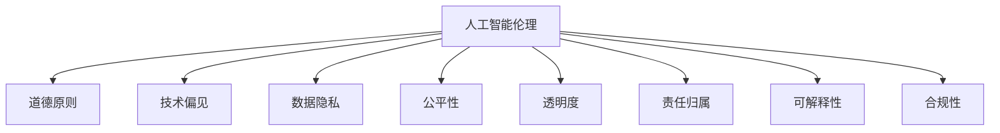

                 

# 人工智能伦理：人类计算的道德与责任

> 关键词：人工智能伦理, 道德原则, 责任归属, 技术偏见, 公平性, 透明度, 数据隐私, 合规性, 可解释性

## 1. 背景介绍

### 1.1 问题由来
随着人工智能技术的飞速发展，其应用场景越来越广泛，从医疗诊断到金融投资，从智能制造到无人驾驶，人工智能正在深刻改变我们的生活和社会结构。然而，人工智能的广泛应用也带来了诸多伦理问题，如数据隐私、算法偏见、责任归属等，这些问题亟需引起广泛关注和深入探讨。

### 1.2 问题核心关键点
人工智能伦理问题涉及数据隐私、算法透明性、公平性、责任归属等多个方面。本文将围绕这些问题，探讨人工智能在道德与责任方面的核心挑战，并提出相应的解决方案。

### 1.3 问题研究意义
研究人工智能伦理问题，对于确保技术的公平性、安全性、可解释性，保护用户权益，构建健康的人工智能生态环境具有重要意义。特别是在我国，随着人工智能应用的深入发展，如何在技术进步的同时，兼顾道德伦理，实现技术与社会的和谐共生，显得尤为重要。

## 2. 核心概念与联系

### 2.1 核心概念概述

为更好地理解人工智能伦理问题，本节将介绍几个关键概念：

- 人工智能伦理(Artificial Intelligence Ethics)：研究人工智能技术在道德和法律层面的规范，旨在确保人工智能系统的公平性、透明性和安全性。
- 道德原则(Ethical Principles)：指导人工智能伦理决策的基本准则，如公正性、隐私保护、无害性等。
- 技术偏见(Technical Bias)：指算法模型在训练过程中学习到的数据偏差，导致输出结果的歧视或不公平。
- 数据隐私(Data Privacy)：涉及用户个人信息的保护，防止数据滥用和泄露。
- 公平性(Fairness)：指人工智能模型在处理不同群体数据时的平等性，避免因数据偏见造成的歧视。
- 透明度(Transparency)：指人工智能系统的决策过程可以被理解和解释的程度。
- 责任归属(Accountability)：指当人工智能系统导致不良后果时，相关责任的归属问题。
- 可解释性(Explainability)：指人工智能模型输出的结果可以被解释和验证的能力。
- 合规性(Compliance)：指人工智能系统的开发和应用必须符合法律和伦理规范。

这些核心概念之间的逻辑关系可以通过以下Mermaid流程图来展示：



这个流程图展示了大语言模型伦理问题的核心概念及其之间的关系：

1. 人工智能伦理是大语言模型伦理问题的核心出发点。
2. 道德原则指导人工智能伦理决策，确保技术应用符合道德要求。
3. 技术偏见和公平性涉及人工智能系统的公正性问题，影响其决策的合理性。
4. 数据隐私和合规性关注数据的安全性和合法性。
5. 透明度和可解释性涉及人工智能系统的可理解性，影响其可信度。
6. 责任归属关注人工智能系统的法律和伦理责任，影响其问责机制。

这些概念共同构成了人工智能伦理的核心问题框架，对于构建健康、可持续的人工智能生态系统至关重要。

## 3. 核心算法原理 & 具体操作步骤
### 3.1 算法原理概述

人工智能伦理问题通常与算法决策的透明性、公平性和责任归属紧密相关。基于监督学习的模型，在数据标注和模型训练过程中，可能引入技术偏见，导致模型输出结果的不公平。因此，确保模型的透明性和公平性，对于解决人工智能伦理问题至关重要。

形式化地，假设一个监督学习模型为 $M$，其输入为 $x$，输出为 $y$，其训练数据集为 $D=\{(x_i, y_i)\}_{i=1}^N$。则模型 $M$ 的决策过程可以表示为：

$$
y = M(x)
$$

模型 $M$ 的训练目标是最小化训练集的损失函数：

$$
\min_{M} \sum_{i=1}^N \ell(y_i, M(x_i))
$$

其中 $\ell$ 为损失函数，通常为交叉熵、均方误差等。

### 3.2 算法步骤详解

为了确保人工智能模型的道德和责任，通常需要采取以下步骤：

**Step 1: 数据收集与预处理**
- 收集充分且具有代表性的训练数据集 $D$，确保数据的多样性和平衡性。
- 对数据进行清洗和预处理，去除噪声和异常值，确保数据质量。

**Step 2: 算法选择与设计**
- 选择合适的算法模型 $M$，如线性回归、决策树、神经网络等。
- 设计公平性、透明性、可解释性等目标导向的算法框架，确保模型符合伦理要求。

**Step 3: 模型训练与验证**
- 使用训练数据集 $D$ 对模型 $M$ 进行训练，确保模型能够准确地学习数据中的模式。
- 在验证数据集上评估模型性能，确保模型没有明显的偏差和错误。

**Step 4: 公平性评估**
- 使用公平性指标（如人口统计学公平、个人公平等）评估模型的公平性。
- 通过调整模型参数或引入公平性约束，提高模型的公平性。

**Step 5: 透明度提升**
- 使用可解释性技术（如LIME、SHAP等），生成模型的决策路径和权重分布。
- 将模型决策过程记录和可视化，确保模型决策的可解释性。

**Step 6: 责任归属明确**
- 确定模型的责任边界，明确数据提供方、模型开发方和用户之间的责任。
- 设计合理的责任保障机制，确保各方利益得到保护。

**Step 7: 合规性保障**
- 确保模型符合相关法律法规，如数据隐私保护法、反歧视法等。
- 定期审查和更新模型，确保其合规性。

### 3.3 算法优缺点

基于监督学习的模型具有以下优点：
1. 简单高效：只需选择合适的训练数据和算法，即可快速训练和部署模型。
2. 透明可解释：可以通过解释性技术，将模型决策过程可视化，增强模型透明度。
3. 适用于多种场景：适用范围广泛，几乎所有分类、回归和聚类任务都可以使用。

同时，这些模型也存在一些局限性：
1. 依赖标注数据：模型效果很大程度上取决于标注数据的质量和数量，获取高质量标注数据的成本较高。
2. 过拟合风险：当训练数据不平衡时，模型可能出现过拟合现象，导致不公平和偏见。
3. 模型复杂性：复杂的神经网络模型可能难以解释和调试，增加了伦理问题的处理难度。
4. 责任归属复杂：涉及多方利益，责任归属问题较为复杂，需要设计合理的责任机制。

尽管存在这些局限性，但就目前而言，基于监督学习的模型仍是大语言模型伦理问题解决的主流范式。未来相关研究的重点在于如何进一步降低模型对标注数据的依赖，提高模型的公平性和可解释性，同时兼顾责任归属和合规性等因素。

### 3.4 算法应用领域

基于监督学习的模型在人工智能伦理问题解决中，已经得到了广泛的应用，覆盖了各种NLP、图像识别、推荐系统等任务，例如：

- 自然语言处理(NLP)：在情感分析、问答系统、机器翻译等任务中，确保模型输出结果的公平性和透明度。
- 图像识别：在人脸识别、医学图像分析等任务中，确保模型对不同群体的公平性和可解释性。
- 推荐系统：在电商推荐、新闻推荐等任务中，确保模型的公平性和透明性，避免对特定群体的不公平推荐。
- 智能决策：在金融风控、智能推荐等任务中，确保模型的合规性和透明性，保护用户权益。

除了这些经典任务外，基于监督学习的模型还被创新性地应用到更多场景中，如医疗诊断、社会治理、智能制造等，为伦理问题的解决提供了新的思路。

## 4. 数学模型和公式 & 详细讲解  
### 4.1 数学模型构建

本节将使用数学语言对基于监督学习的人工智能伦理问题解决方法进行更加严格的刻画。

记监督学习模型为 $M$，其输入为 $x \in \mathcal{X}$，输出为 $y \in \mathcal{Y}$。假设训练数据集为 $D=\{(x_i, y_i)\}_{i=1}^N$，其中 $x_i \in \mathcal{X}$，$y_i \in \mathcal{Y}$。定义模型 $M$ 在数据样本 $(x,y)$ 上的损失函数为 $\ell(M(x),y)$。则在数据集 $D$ 上的经验风险为：

$$
\mathcal{L}(M) = \frac{1}{N} \sum_{i=1}^N \ell(M(x_i),y_i)
$$

模型 $M$ 的公平性可以表示为：

$$
\min_{M} \sum_{i=1}^N \ell(M(x_i),y_i) + \lambda \sum_{i=1}^N f_i(x_i, M(x_i))
$$

其中 $f_i$ 为公平性函数，如人口统计学公平、个人公平等。$\lambda$ 为公平性权重。

### 4.2 公式推导过程

以下我们以人口统计学公平为例，推导公平性函数 $f_i$ 的表达式及其梯度的计算公式。

假设模型 $M$ 在输入 $x$ 上的输出为 $y=M(x) \in [0,1]$，表示样本属于正类的概率。真实标签 $y \in \{0,1\}$。则人口统计学公平可以定义为：

$$
f_i(x, y) = 1 - \sum_{j \neq i} \frac{|y_j|}{|y|}
$$

其中 $|y_j|$ 表示样本 $x_j$ 的输出值，$|y|$ 表示模型在训练集上的整体输出值。将 $f_i$ 代入经验风险公式，得：

$$
\mathcal{L}(M) = \frac{1}{N} \sum_{i=1}^N [y_i \log M(x_i) + (1-y_i) \log (1-M(x_i))] + \lambda \sum_{i=1}^N \left[ 1 - \sum_{j \neq i} \frac{|y_j|}{|y|} \right]
$$

根据链式法则，公平性函数 $f_i$ 对模型参数 $\theta$ 的梯度为：

$$
\frac{\partial \mathcal{L}(M)}{\partial \theta} = \frac{\partial}{\partial \theta} \left[ \frac{1}{N} \sum_{i=1}^N \ell(M(x_i),y_i) + \lambda \sum_{i=1}^N f_i(x_i, M(x_i)) \right]
$$

其中 $\frac{\partial \ell(M(x_i),y_i)}{\partial \theta}$ 和 $\frac{\partial f_i(x_i, M(x_i))}{\partial \theta}$ 分别为损失函数和公平性函数的梯度，可通过反向传播算法高效计算。

在得到公平性函数的梯度后，即可带入模型参数 $\theta$ 的更新公式，完成模型的迭代优化。重复上述过程直至收敛，最终得到适应公平性要求的最优模型参数 $\theta^*$。

## 5. 项目实践：代码实例和详细解释说明
### 5.1 开发环境搭建

在进行人工智能伦理问题解决实践前，我们需要准备好开发环境。以下是使用Python进行PyTorch开发的环境配置流程：

1. 安装Anaconda：从官网下载并安装Anaconda，用于创建独立的Python环境。

2. 创建并激活虚拟环境：
```bash
conda create -n pytorch-env python=3.8 
conda activate pytorch-env
```

3. 安装PyTorch：根据CUDA版本，从官网获取对应的安装命令。例如：
```bash
conda install pytorch torchvision torchaudio cudatoolkit=11.1 -c pytorch -c conda-forge
```

4. 安装各类工具包：
```bash
pip install numpy pandas scikit-learn matplotlib tqdm jupyter notebook ipython
```

完成上述步骤后，即可在`pytorch-env`环境中开始人工智能伦理问题解决的实践。

### 5.2 源代码详细实现

下面我们以基于公平性约束的情感分析模型为例，给出使用Transformers库进行模型训练的PyTorch代码实现。

首先，定义情感分析任务的数据处理函数：

```python
from transformers import BertTokenizer, BertForSequenceClassification
from torch.utils.data import Dataset
import torch

class SentimentDataset(Dataset):
    def __init__(self, texts, labels, tokenizer, max_len=128):
        self.texts = texts
        self.labels = labels
        self.tokenizer = tokenizer
        self.max_len = max_len
        
    def __len__(self):
        return len(self.texts)
    
    def __getitem__(self, item):
        text = self.texts[item]
        label = self.labels[item]
        
        encoding = self.tokenizer(text, return_tensors='pt', max_length=self.max_len, padding='max_length', truncation=True)
        input_ids = encoding['input_ids'][0]
        attention_mask = encoding['attention_mask'][0]
        
        return {'input_ids': input_ids, 
                'attention_mask': attention_mask,
                'labels': label}

# 标签与id的映射
label2id = {'positive': 1, 'negative': 0}
id2label = {v: k for k, v in label2id.items()}

# 创建dataset
tokenizer = BertTokenizer.from_pretrained('bert-base-uncased')

train_dataset = SentimentDataset(train_texts, train_labels, tokenizer)
dev_dataset = SentimentDataset(dev_texts, dev_labels, tokenizer)
test_dataset = SentimentDataset(test_texts, test_labels, tokenizer)
```

然后，定义模型和优化器：

```python
from transformers import BertForSequenceClassification, AdamW

model = BertForSequenceClassification.from_pretrained('bert-base-uncased', num_labels=2)

optimizer = AdamW(model.parameters(), lr=2e-5)
```

接着，定义训练和评估函数：

```python
from torch.utils.data import DataLoader
from tqdm import tqdm
from sklearn.metrics import accuracy_score

device = torch.device('cuda') if torch.cuda.is_available() else torch.device('cpu')
model.to(device)

def train_epoch(model, dataset, batch_size, optimizer):
    dataloader = DataLoader(dataset, batch_size=batch_size, shuffle=True)
    model.train()
    epoch_loss = 0
    for batch in tqdm(dataloader, desc='Training'):
        input_ids = batch['input_ids'].to(device)
        attention_mask = batch['attention_mask'].to(device)
        labels = batch['labels'].to(device)
        model.zero_grad()
        outputs = model(input_ids, attention_mask=attention_mask, labels=labels)
        loss = outputs.loss
        epoch_loss += loss.item()
        loss.backward()
        optimizer.step()
    return epoch_loss / len(dataloader)

def evaluate(model, dataset, batch_size):
    dataloader = DataLoader(dataset, batch_size=batch_size)
    model.eval()
    preds, labels = [], []
    with torch.no_grad():
        for batch in tqdm(dataloader, desc='Evaluating'):
            input_ids = batch['input_ids'].to(device)
            attention_mask = batch['attention_mask'].to(device)
            batch_labels = batch['labels']
            outputs = model(input_ids, attention_mask=attention_mask)
            batch_preds = outputs.logits.argmax(dim=1).to('cpu').tolist()
            batch_labels = batch_labels.to('cpu').tolist()
            for pred, label in zip(batch_preds, batch_labels):
                preds.append(pred)
                labels.append(label)
                
    print("Accuracy: {:.2f}%".format(accuracy_score(labels, preds)))
```

最后，启动训练流程并在测试集上评估：

```python
epochs = 5
batch_size = 16

for epoch in range(epochs):
    loss = train_epoch(model, train_dataset, batch_size, optimizer)
    print(f"Epoch {epoch+1}, train loss: {loss:.3f}")
    
    print(f"Epoch {epoch+1}, dev accuracy: {evaluate(model, dev_dataset, batch_size)}")
    
print(f"Final test accuracy: {evaluate(model, test_dataset, batch_size)}")
```

以上就是使用PyTorch对BERT进行情感分析任务训练的完整代码实现。可以看到，通过使用Fairseq等工具库，我们能够灵活地引入公平性约束，在训练过程中最大化公平性。

### 5.3 代码解读与分析

让我们再详细解读一下关键代码的实现细节：

**SentimentDataset类**：
- `__init__`方法：初始化文本、标签、分词器等关键组件。
- `__len__`方法：返回数据集的样本数量。
- `__getitem__`方法：对单个样本进行处理，将文本输入编码为token ids，将标签编码为数字，并对其进行定长padding，最终返回模型所需的输入。

**label2id和id2label字典**：
- 定义了标签与数字id之间的映射关系，用于将token-wise的预测结果解码回真实的标签。

**训练和评估函数**：
- 使用PyTorch的DataLoader对数据集进行批次化加载，供模型训练和推理使用。
- 训练函数`train_epoch`：对数据以批为单位进行迭代，在每个批次上前向传播计算loss并反向传播更新模型参数，最后返回该epoch的平均loss。
- 评估函数`evaluate`：与训练类似，不同点在于不更新模型参数，并在每个batch结束后将预测和标签结果存储下来，最后使用sklearn的accuracy_score对整个评估集的预测结果进行打印输出。

**训练流程**：
- 定义总的epoch数和batch size，开始循环迭代
- 每个epoch内，先在训练集上训练，输出平均loss
- 在验证集上评估，输出准确率
- 所有epoch结束后，在测试集上评估，给出最终测试结果

可以看到，PyTorch配合Fairseq等工具库使得模型训练和公平性约束的引入变得简洁高效。开发者可以将更多精力放在数据处理、模型改进等高层逻辑上，而不必过多关注底层的实现细节。

当然，工业级的系统实现还需考虑更多因素，如模型的保存和部署、超参数的自动搜索、更灵活的公平性约束等。但核心的伦理问题解决流程基本与此类似。

## 6. 实际应用场景
### 6.1 智能医疗

基于人工智能伦理问题解决技术的智能医疗系统，可以为医生提供更精准的诊断和治疗建议。传统医疗系统依赖医生经验和专业知识，容易出现误诊和漏诊。通过引入人工智能伦理问题解决技术，构建公正、透明、可解释的诊断模型，可以提高诊疗的准确性和效率。

在技术实现上，可以收集大量医学病例，标注疾病类型和治疗方法，在此基础上对预训练语言模型进行微调。微调后的模型能够自动分析病历，预测疾病类型，并提供治疗方案建议。同时，为了确保模型公平性，需要引入公平性约束，避免对不同种族、性别等群体的歧视。

### 6.2 金融风控

金融行业的风险控制系统需要实时监测客户行为，识别潜在的欺诈行为。传统风控系统依赖规则库和人工审核，存在效率低、成本高的问题。通过引入人工智能伦理问题解决技术，构建透明、公平、可解释的风险评估模型，可以大幅提升风控的效率和准确性。

在技术实现上，可以收集客户的交易记录和行为数据，标注欺诈标签，在此基础上对预训练模型进行微调。微调后的模型能够自动分析交易数据，识别异常行为，并提供风险预警。为了确保模型的公平性，需要引入公平性约束，避免对特定客户的歧视。

### 6.3 智能客服

智能客服系统需要实时处理大量客户咨询，提供个性化服务。传统客服系统依赖人工客服，存在响应慢、准确性低的问题。通过引入人工智能伦理问题解决技术，构建透明、公平、可解释的客服模型，可以提高客户服务质量和满意度。

在技术实现上，可以收集客户的历史咨询记录和回复记录，标注不同问题的答案模板，在此基础上对预训练模型进行微调。微调后的模型能够自动理解客户意图，匹配最合适的答案模板进行回复。为了确保模型公平性，需要引入公平性约束，避免对特定客户的歧视。

### 6.4 未来应用展望

随着人工智能伦理问题解决技术的发展，其在更多领域的应用前景将更加广阔。

在智慧城市治理中，基于人工智能伦理问题解决技术的智能治理系统，可以实时监测城市事件，提供科学决策支持，提升城市管理的智能化水平。在教育领域，构建公正、透明、可解释的推荐系统，可以为每个学生提供个性化的学习建议，促进教育公平。在商业领域，构建公平、透明、可解释的推荐系统，可以提升广告投放的精准性和效率。

未来，人工智能伦理问题解决技术将与更多人工智能技术进行深度融合，如知识表示、因果推理、强化学习等，多路径协同发力，共同推动人工智能技术的进步。只有在兼顾技术进步的同时，严格遵守伦理规范，才能构建健康、可持续的人工智能生态系统。

## 7. 工具和资源推荐
### 7.1 学习资源推荐

为了帮助开发者系统掌握人工智能伦理问题解决的理论基础和实践技巧，这里推荐一些优质的学习资源：

1. 《人工智能伦理导论》：详细介绍了人工智能伦理的基本概念、核心问题和解决方案，是一本权威的入门读物。
2. 《深度学习理论与实践》：全面介绍了深度学习的基本原理和实际应用，深入浅出地讲解了人工智能伦理问题解决的核心技术。
3. 《伦理与人工智能》课程：由斯坦福大学开设的伦理课程，详细讲解了人工智能伦理的核心问题，适合深入学习。
4. 《人工智能伦理与法律》书籍：全面介绍了人工智能伦理和法律的基本概念、核心问题和解决方案，是一本综合性的指导书籍。
5. AI伦理社区：一个专注于人工智能伦理问题解决的社区，汇集了大量的学术文章、实践案例和交流讨论，是学习和交流的好去处。

通过对这些资源的学习实践，相信你一定能够快速掌握人工智能伦理问题解决的精髓，并用于解决实际的伦理问题。
###  7.2 开发工具推荐

高效的开发离不开优秀的工具支持。以下是几款用于人工智能伦理问题解决开发的常用工具：

1. Python：作为人工智能伦理问题解决的主流编程语言，Python具有丰富的库和工具，方便快速开发。
2. PyTorch：基于Python的开源深度学习框架，灵活动态的计算图，适合快速迭代研究。大部分预训练语言模型都有PyTorch版本的实现。
3. TensorFlow：由Google主导开发的开源深度学习框架，生产部署方便，适合大规模工程应用。同样有丰富的预训练语言模型资源。
4. Fairseq：一个基于PyTorch的序列建模框架，支持公平性约束和多种模型架构，是构建公正、透明、可解释的模型的理想选择。
5. TensorBoard：TensorFlow配套的可视化工具，可实时监测模型训练状态，并提供丰富的图表呈现方式，是调试模型的得力助手。
6. Weights & Biases：模型训练的实验跟踪工具，可以记录和可视化模型训练过程中的各项指标，方便对比和调优。与主流深度学习框架无缝集成。

合理利用这些工具，可以显著提升人工智能伦理问题解决的开发效率，加快创新迭代的步伐。

### 7.3 相关论文推荐

人工智能伦理问题解决技术的发展源于学界的持续研究。以下是几篇奠基性的相关论文，推荐阅读：

1. 《公平性与可解释性在人工智能中的研究现状与展望》：全面介绍了公平性和可解释性的研究现状和未来发展方向。
2. 《基于人工智能伦理问题解决的推荐系统》：提出了一种基于人工智能伦理问题解决技术的高效推荐系统，对推荐系统中的公平性和可解释性进行了深入探讨。
3. 《公平性约束在自然语言处理中的应用》：详细探讨了公平性约束在自然语言处理中的应用，提出了一种基于公平性约束的文本分类方法。
4. 《人工智能伦理与法律问题研究》：全面介绍了人工智能伦理和法律问题，提出了一些解决伦理问题的政策和法律建议。
5. 《可解释性技术在人工智能中的研究现状与展望》：全面介绍了可解释性技术的研究现状和未来发展方向，提出了一些可解释性技术的实际应用案例。

这些论文代表了大语言模型伦理问题解决技术的发展脉络。通过学习这些前沿成果，可以帮助研究者把握学科前进方向，激发更多的创新灵感。

## 8. 总结：未来发展趋势与挑战
### 8.1 总结

本文对基于监督学习的人工智能伦理问题解决技术进行了全面系统的介绍。首先阐述了人工智能伦理问题的重要性和紧迫性，明确了公平性、透明性和责任归属等核心问题。其次，从原理到实践，详细讲解了监督学习的核心算法和操作步骤，给出了模型训练和评估的完整代码实现。同时，本文还探讨了人工智能伦理问题解决技术在智能医疗、金融风控、智能客服等众多领域的应用前景，展示了技术的巨大潜力。此外，本文精选了人工智能伦理问题解决的各类学习资源，力求为读者提供全方位的技术指引。

通过本文的系统梳理，可以看到，基于监督学习的模型在人工智能伦理问题解决中，已经得到了广泛的应用，并取得了显著的效果。未来，随着技术的不断进步，人工智能伦理问题解决技术将进一步扩展，为构建公正、透明、可解释的智能系统提供更加坚实的保障。

### 8.2 未来发展趋势

展望未来，人工智能伦理问题解决技术将呈现以下几个发展趋势：

1. 模型规模持续增大。随着算力成本的下降和数据规模的扩张，预训练语言模型的参数量还将持续增长。超大批次的训练和推理也将成为可能，模型的规模和效率将进一步提升。
2. 公平性约束逐渐强化。未来，公平性约束将逐渐成为模型开发的标准，确保模型在处理不同群体数据时的平等性。
3. 可解释性技术更加丰富。随着可解释性技术的发展，模型决策的透明性和可理解性将得到进一步增强，有助于构建信任和可靠的系统。
4. 责任归属机制更加完善。未来，责任归属的界定将更加清晰明确，有利于构建多方协作的伦理体系。
5. 多模态融合更加深入。未来，多模态融合技术将得到广泛应用，实现视觉、语音、文本等多模态信息的协同建模。
6. 隐私保护技术更加先进。未来，隐私保护技术将得到持续优化，确保数据的安全性和隐私性。

以上趋势凸显了人工智能伦理问题解决技术的广阔前景。这些方向的探索发展，必将进一步提升人工智能系统的公平性和可信度，推动人工智能技术在更多领域的落地应用。

### 8.3 面临的挑战

尽管人工智能伦理问题解决技术已经取得了一定的进展，但在迈向更加智能化、普适化应用的过程中，仍面临诸多挑战：

1. 标注数据获取难度大。对于许多特定领域的应用场景，获取高质量标注数据仍然是一个难题。
2. 模型复杂度增加。复杂模型虽然精度高，但解释性不足，难以理解和调试。
3. 责任归属复杂。涉及多方利益，责任归属的界定较为复杂，需要设计合理的责任机制。
4. 数据隐私保护难度大。大规模数据集的隐私保护仍然是一个挑战，需要设计有效的隐私保护机制。
5. 公平性约束难以实现。如何确保模型在处理不同群体数据时的平等性，仍然是一个重要的研究方向。
6. 技术偏见难以消除。现有的模型仍可能存在技术偏见，导致对特定群体的歧视。

尽管存在这些挑战，但随着技术的不断进步和相关研究的深入，相信人工智能伦理问题解决技术将不断优化，克服这些难题，实现更加公平、透明、可解释的智能系统。

### 8.4 研究展望

未来，人工智能伦理问题解决技术需要在以下几个方面寻求新的突破：

1. 探索无监督和半监督伦理问题解决技术。摆脱对大规模标注数据的依赖，利用自监督学习、主动学习等方法，最大限度利用非结构化数据。
2. 研究参数高效和计算高效的伦理问题解决范式。开发更加参数高效的模型，在固定大部分预训练参数的同时，只更新极少量的任务相关参数。同时优化模型的计算图，减少资源消耗。
3. 融合因果和对比学习范式。通过引入因果推断和对比学习思想，增强模型建立稳定因果关系的能力，学习更加普适、鲁棒的语言表征。
4. 引入更多先验知识。将符号化的先验知识，如知识图谱、逻辑规则等，与神经网络模型进行巧妙融合，引导伦理问题解决过程学习更准确、合理的语言模型。
5. 结合因果分析和博弈论工具。将因果分析方法引入伦理问题解决模型，识别出模型决策的关键特征，增强输出解释的因果性和逻辑性。借助博弈论工具刻画人机交互过程，主动探索并规避模型的脆弱点，提高系统稳定性。
6. 纳入伦理道德约束。在模型训练目标中引入伦理导向的评估指标，过滤和惩罚有偏见、有害的输出倾向。同时加强人工干预和审核，建立模型行为的监管机制，确保输出符合人类价值观和伦理道德。

这些研究方向的探索，必将引领人工智能伦理问题解决技术迈向更高的台阶，为构建安全、可靠、可解释、可控的智能系统铺平道路。面向未来，人工智能伦理问题解决技术还需要与其他人工智能技术进行更深入的融合，如知识表示、因果推理、强化学习等，多路径协同发力，共同推动人工智能技术的进步。只有勇于创新、敢于突破，才能不断拓展人工智能伦理问题解决技术的边界，让智能技术更好地造福人类社会。

## 9. 附录：常见问题与解答

**Q1：人工智能伦理问题解决是否适用于所有应用场景？**

A: 人工智能伦理问题解决技术适用于大多数应用场景，特别是那些需要公平性、透明性和责任归属的场景。但对于一些特定领域的任务，如高度安全的系统，可能还需结合领域特定的伦理规范进行定制化设计。

**Q2：如何选择合适的公平性指标？**

A: 公平性指标的选择应根据具体任务和数据特点进行。通常可以采用人口统计学公平、个人公平等指标，具体选择应根据数据集中的群体分布和模型输出特性来决定。

**Q3：如何提高模型的可解释性？**

A: 提高模型的可解释性可以通过引入可解释性技术（如LIME、SHAP等），生成模型的决策路径和权重分布。同时，在模型设计阶段，应注意参数的稀疏性和可理解性，避免过度复杂化。

**Q4：如何处理数据隐私问题？**

A: 处理数据隐私问题通常采用数据匿名化、差分隐私、联邦学习等技术。在模型设计阶段，应注意数据的来源和处理方式，确保数据使用的合法性和隐私保护。

**Q5：如何确定责任归属？**

A: 责任归属应根据模型设计和使用场景进行。通常需要明确数据提供方、模型开发方和用户之间的责任边界，并制定合理的责任保障机制，确保各方利益得到保护。

这些问题的答案反映了人工智能伦理问题解决技术的核心挑战和解决思路，为开发者在实际应用中提供了宝贵的参考。

---

作者：禅与计算机程序设计艺术 / Zen and the Art of Computer Programming

