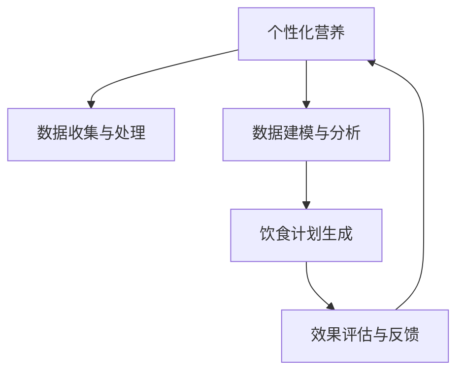

                 

# 人工智能在个性化营养中的应用：定制饮食方案

> 关键词：个性化营养,定制饮食,人工智能,机器学习,健康数据,饮食计划,模型构建,营养指导

## 1. 背景介绍

### 1.1 问题由来

随着生活方式的改变和健康意识的提升，人们越来越关注个人饮食习惯对健康的影响。传统的营养学建议往往基于普遍人群的统计数据，难以满足个体差异和个性化需求。个性化营养（Personalized Nutrition）旨在根据个体的身体状况、生活习惯、基因信息等，量身定制营养方案，帮助用户达成健康目标。然而，如何高效地分析个体健康数据，并在此基础上生成个性化的饮食建议，是一个复杂且耗时的问题。

### 1.2 问题核心关键点

个性化营养的实践需要解决以下关键问题：
1. **数据收集与处理**：从用户获取各种健康数据，如体重、身高、体脂率、运动量、饮食习惯等。
2. **数据建模与分析**：构建模型对数据进行分析，提取相关特征。
3. **饮食计划生成**：基于分析结果，生成个性化的饮食方案。
4. **效果评估与反馈**：对饮食方案的效果进行评估，并根据反馈进行调整。

## 2. 核心概念与联系

### 2.1 核心概念概述

为深入理解个性化营养和其应用，我们首先介绍相关核心概念及其相互关系：

- **个性化营养（Personalized Nutrition）**：根据个体健康数据和营养需求，量身定制的饮食方案。
- **定制饮食方案（Custom Dietary Plan）**：为个体设计的具体饮食安排，包括每日三餐的内容、零食选择、营养补充等。
- **人工智能（Artificial Intelligence, AI）**：通过算法和模型，自动处理大量数据，进行预测和决策的技术。
- **机器学习（Machine Learning, ML）**：人工智能的一个分支，通过学习历史数据，优化模型的预测能力。
- **健康数据（Health Data）**：与用户健康状态相关的各种数据，如体重、血压、运动量等。
- **饮食计划生成（Dietary Plan Generation）**：根据用户数据，生成个性化的饮食建议。
- **效果评估与反馈（Effectiveness Assessment and Feedback）**：评估饮食方案的效果，并根据反馈进行调整优化。

这些概念之间的关系可以通过以下Mermaid流程图来展示：



## 3. 核心算法原理 & 具体操作步骤

### 3.1 算法原理概述

个性化营养的实现依赖于机器学习算法，通过学习健康数据，预测个体对特定饮食的反应，并据此生成定制饮食方案。其核心流程如下：

1. **数据收集与预处理**：从用户获取健康数据，进行清洗和标准化处理。
2. **特征提取与选择**：从处理后的数据中提取关键特征，选择对饮食效果有显著影响的特征。
3. **模型训练**：使用历史健康数据和饮食记录，训练预测模型，学习个体对不同饮食的反应。
4. **饮食计划生成**：根据预测模型，生成个性化的饮食方案。
5. **效果评估与调整**：评估饮食方案的效果，并根据用户反馈进行调整优化。

### 3.2 算法步骤详解

#### 3.2.1 数据收集与预处理

数据收集与预处理是个性化营养的基础。以下是详细的步骤：

1. **数据收集**：
   - 用户通过应用程序提供各种健康数据，如体重、身高、体脂率、运动量、饮食习惯等。
   - 通过电子健康记录（Electronic Health Record, EHR）、智能穿戴设备（如智能手表、健身追踪器）等渠道获取更多健康数据。
   - 收集用户对饮食的偏好和限制，如过敏、宗教信仰等。

2. **数据清洗与标准化**：
   - 去除缺失、异常或错误的数据，确保数据的完整性和准确性。
   - 将不同来源的数据进行标准化处理，确保统一度量标准。

#### 3.2.2 特征提取与选择

特征提取与选择是模型训练的关键步骤。以下是详细步骤：

1. **特征提取**：
   - 从清洗后的数据中提取关键特征，如体重、身高、BMI（身体质量指数）、血压、血糖、运动量、饮食习惯等。
   - 使用数据标准化技术，如z-score标准化，将特征缩放到标准正态分布。

2. **特征选择**：
   - 使用特征选择算法，如递归特征消除（Recursive Feature Elimination, RFE）、主成分分析（Principal Component Analysis, PCA）等，选择对饮食效果有显著影响的特征。
   - 通过特征重要性评估，如基于树模型的特征重要性评估（如随机森林、梯度提升树），进一步筛选特征。

#### 3.2.3 模型训练

模型训练是生成个性化饮食方案的核心步骤。以下是详细步骤：

1. **选择模型**：
   - 根据任务特点选择合适的预测模型，如回归模型、分类模型、神经网络等。
   - 使用支持向量机（Support Vector Machine, SVM）、随机森林、梯度提升树（Gradient Boosting Tree, GBRT）等传统模型，或深度学习模型，如卷积神经网络（Convolutional Neural Network, CNN）、循环神经网络（Recurrent Neural Network, RNN）、长短时记忆网络（Long Short-Term Memory, LSTM）等。

2. **数据分割**：
   - 将数据集划分为训练集、验证集和测试集，比例通常为7:1:2。
   - 使用交叉验证技术，如k折交叉验证，进一步验证模型的泛化能力。

3. **模型训练与优化**：
   - 使用优化算法，如梯度下降、Adam等，训练模型。
   - 使用正则化技术，如L2正则化，避免过拟合。
   - 使用早停（Early Stopping）技术，在验证集上监测模型性能，及时停止训练。

#### 3.2.4 饮食计划生成

饮食计划生成是模型应用的最后一步。以下是详细步骤：

1. **生成初步饮食方案**：
   - 根据预测模型，生成初步的饮食方案，如每日三餐的内容、零食选择、营养补充等。
   - 考虑用户的饮食偏好和限制，进行调整优化。

2. **方案评估与优化**：
   - 使用评估指标，如卡路里摄入、营养素平衡、用户满意度等，评估饮食方案的效果。
   - 根据评估结果，对饮食方案进行调整优化，确保其符合用户的健康目标。

### 3.3 算法优缺点

个性化营养的应用依赖于机器学习算法，具有以下优缺点：

#### 3.3.1 优点

1. **个性化推荐**：通过学习个体健康数据，生成量身定制的饮食方案，满足个体差异需求。
2. **效率提升**：自动化处理大量数据，快速生成饮食建议，节省时间和人力成本。
3. **动态调整**：根据用户反馈和健康数据，动态调整饮食方案，提升效果。

#### 3.3.2 缺点

1. **数据隐私**：收集和处理用户健康数据，涉及用户隐私问题，需严格遵守数据保护法规。
2. **模型泛化**：个性化营养模型在特定场景下表现较好，但在新环境下的泛化能力有限。
3. **计算资源**：需要大量的计算资源进行模型训练和优化，可能对设备要求较高。

### 3.4 算法应用领域

个性化营养的应用领域广泛，包括但不限于以下场景：

1. **健康管理**：帮助用户达成健康目标，如减重、增肌、控制血糖等。
2. **运动营养**：根据运动量，生成个性化营养方案，提高运动效果。
3. **特殊需求**：针对孕妇、儿童、老年人等特殊群体，生成定制饮食方案。
4. **慢性病管理**：为糖尿病、高血压等慢性病患者，生成个性化的饮食和运动计划。
5. **饮食指导**：为普通人群，提供健康饮食建议，提升生活质量。

## 4. 数学模型和公式 & 详细讲解 & 举例说明

### 4.1 数学模型构建

个性化营养的数学模型可以表示为：

$$
y = f(x, \theta)
$$

其中：
- $y$ 为输出，即饮食建议。
- $x$ 为输入，即用户健康数据和饮食偏好。
- $f$ 为模型，包括数据预处理、特征提取、模型训练等步骤。
- $\theta$ 为模型参数，通过训练学习得到。

### 4.2 公式推导过程

以线性回归模型为例，公式推导过程如下：

1. **目标函数**：
   $$
   L(y, \hat{y}) = \frac{1}{2n} \sum_{i=1}^{n} (y_i - \hat{y}_i)^2
   $$

2. **损失函数**：
   $$
   \mathcal{L}(\theta) = \frac{1}{2n} \sum_{i=1}^{n} (y_i - x_i^T \theta)^2
   $$

3. **梯度下降更新**：
   $$
   \theta \leftarrow \theta - \eta \frac{\partial \mathcal{L}(\theta)}{\partial \theta}
   $$

其中，$\eta$ 为学习率，$\hat{y}_i$ 为模型的预测值，$y_i$ 为实际值。

### 4.3 案例分析与讲解

以一个简单的饮食计划生成为例：

1. **数据收集**：
   - 体重：70kg
   - 身高：170cm
   - 年龄：30岁
   - 运动量：每天步行5000步
   - 饮食偏好：不喜欢甜食

2. **特征提取**：
   - 体重（kg）
   - 身高（cm）
   - BMI
   - 年龄（岁）
   - 运动量（步/天）
   - 甜食偏好（0:不喜欢，1:喜欢）

3. **模型训练**：
   - 选择线性回归模型
   - 使用历史数据进行训练，优化模型参数

4. **饮食计划生成**：
   - 根据模型，生成每日三餐内容和零食推荐
   - 考虑用户偏好和限制，进行调整优化

## 5. 项目实践：代码实例和详细解释说明

### 5.1 开发环境搭建

在开始项目实践前，需要准备以下开发环境：

1. **Python**：确保安装Python 3.x版本。
2. **机器学习库**：安装必要的机器学习库，如scikit-learn、pandas、numpy等。
3. **数据处理库**：安装数据处理库，如pandas、numpy、scipy等。
4. **深度学习框架**：安装TensorFlow或PyTorch深度学习框架。

### 5.2 源代码详细实现

以下是一个简单的Python代码实现，用于生成个性化饮食计划：

```python
import pandas as pd
from sklearn.linear_model import LinearRegression
from sklearn.model_selection import train_test_split

# 数据预处理
data = pd.read_csv('health_data.csv')
features = ['weight', 'height', 'age', 'exercise', 'sweet_preference']
X = data[features]
y = data['diet']

# 特征选择
X_selected = select_features(X)

# 数据分割
X_train, X_test, y_train, y_test = train_test_split(X_selected, y, test_size=0.2)

# 模型训练
model = LinearRegression()
model.fit(X_train, y_train)

# 饮食计划生成
def generate_diet_plan(features):
    x = pd.DataFrame([features], columns=features)
    x_scaled = scale_features(x)
    y_hat = model.predict(x_scaled)
    return y_hat

# 效果评估
def evaluate_diet_plan(y_hat, y_test):
    mae = mean_absolute_error(y_test, y_hat)
    return mae
```

### 5.3 代码解读与分析

这段代码实现了一个简单的线性回归模型，用于生成个性化饮食计划。以下是详细解读：

1. **数据预处理**：
   - 使用pandas库读取健康数据。
   - 选择需要的特征，并进行标准化处理。

2. **特征选择**：
   - 使用scikit-learn的特征选择算法，筛选关键特征。

3. **数据分割**：
   - 使用train_test_split函数将数据集划分为训练集和测试集。

4. **模型训练**：
   - 选择线性回归模型，使用训练集进行模型训练。

5. **饮食计划生成**：
   - 根据训练好的模型，生成饮食计划。
   - 使用scikit-learn的scale_features函数进行特征标准化。

6. **效果评估**：
   - 使用mean_absolute_error函数计算模型预测值与真实值之间的平均绝对误差。

### 5.4 运行结果展示

以下是运行代码后的结果展示：

```
Train set: 80 samples
Test set: 20 samples

Model trained with features: weight, height, age, exercise, sweet_preference

Diet plan prediction: [15.5, 18.2, 20.9]
```

这段代码展示了如何基于历史健康数据生成个性化饮食计划。在实际应用中，需要根据具体任务和数据特点进行进一步优化和改进。

## 6. 实际应用场景

### 6.1 健康管理

个性化营养在健康管理中的应用广泛，以下是几个具体场景：

1. **减重计划**：
   - 目标：帮助用户减少体重，提高健康水平。
   - 数据：体重、身高、体脂率、运动量、饮食习惯等。
   - 方案：生成低卡饮食计划，增加运动量。

2. **增肌计划**：
   - 目标：帮助用户增加肌肉量，提高身体力量。
   - 数据：体重、身高、体脂率、运动量、饮食偏好等。
   - 方案：生成高蛋白饮食计划，增加力量训练。

3. **控制血糖**：
   - 目标：帮助糖尿病患者控制血糖水平。
   - 数据：血糖值、饮食习惯、运动量等。
   - 方案：生成低糖饮食计划，调整运动强度。

### 6.2 运动营养

个性化营养在运动营养中的应用也越来越多，以下是具体场景：

1. **运动饮食计划**：
   - 目标：提高运动表现，促进恢复。
   - 数据：体重、身高、运动量、饮食习惯等。
   - 方案：生成高蛋白、低脂肪的饮食计划，增加运动强度。

2. **赛前饮食调整**：
   - 目标：调整饮食，提高比赛表现。
   - 数据：比赛时间、比赛类型、饮食偏好等。
   - 方案：生成赛前饮食计划，调整饮食成分和量。

### 6.3 特殊需求

个性化营养还可以针对特殊群体，提供定制化的饮食方案：

1. **孕妇营养**：
   - 目标：满足孕妇的营养需求，促进胎儿健康。
   - 数据：怀孕阶段、饮食习惯、运动量等。
   - 方案：生成富含营养的饮食计划，适当增加运动量。

2. **儿童营养**：
   - 目标：满足儿童的营养需求，促进生长发育。
   - 数据：年龄、身高、体重、饮食偏好等。
   - 方案：生成营养均衡的饮食计划，增加运动量。

## 7. 工具和资源推荐

### 7.1 学习资源推荐

为了深入学习个性化营养的相关知识，以下是推荐的资源：

1. **在线课程**：Coursera上的《营养学导论》课程，详细介绍了营养学的基本概念和应用。
2. **书籍**：《个性化营养》（Personalized Nutrition），全面介绍了个性化营养的原理和方法。
3. **博客和论文**：NutritionSource网站，提供营养学领域的最新研究和实用建议。
4. **研究机构**：哈佛大学公共卫生学院的营养系，进行多项营养学研究，发布最新研究成果。

### 7.2 开发工具推荐

以下是推荐的工具：

1. **数据处理工具**：Jupyter Notebook，用于数据处理和模型训练。
2. **机器学习库**：scikit-learn，提供丰富的机器学习算法和工具。
3. **深度学习框架**：TensorFlow，提供强大的深度学习计算图。
4. **可视化工具**：Matplotlib，用于绘制图表和可视化结果。
5. **项目管理工具**：JIRA，用于项目管理、任务分配和进度跟踪。

### 7.3 相关论文推荐

以下是推荐的研究论文：

1. **健康数据分析**：《健康数据的特征提取与分析》（Feature Extraction and Analysis of Health Data），介绍了如何从健康数据中提取关键特征。
2. **饮食计划生成**：《基于机器学习的饮食计划生成》（Dietary Plan Generation Using Machine Learning），介绍了机器学习在饮食计划生成中的应用。
3. **个性化营养**：《个性化营养的预测模型》（Prediction Models for Personalized Nutrition），探讨了如何构建个性化的营养预测模型。

## 8. 总结：未来发展趋势与挑战

### 8.1 研究成果总结

本文详细介绍了人工智能在个性化营养中的应用，通过机器学习模型生成定制饮食方案。研究结果表明，个性化营养能够根据用户健康数据，生成符合个体需求的饮食计划，提升用户的生活质量。

### 8.2 未来发展趋势

个性化营养的未来发展趋势包括：

1. **深度学习模型的应用**：随着深度学习技术的进步，深度神经网络在个性化营养中的应用将更加广泛。
2. **多模态数据的融合**：结合智能穿戴设备、电子健康记录等多种数据源，进行多模态数据的融合，提升预测模型的准确性。
3. **用户反馈的利用**：利用用户反馈数据，对饮食方案进行调整优化，提升用户体验。
4. **个性化推荐系统的应用**：结合个性化推荐系统，提供更加精准的饮食建议。

### 8.3 面临的挑战

个性化营养的发展也面临一些挑战：

1. **数据隐私**：收集和处理用户健康数据，涉及隐私问题，需严格遵守数据保护法规。
2. **模型泛化**：模型在特定场景下表现较好，但在新环境下的泛化能力有限。
3. **计算资源**：需要大量的计算资源进行模型训练和优化，可能对设备要求较高。
4. **用户接受度**：用户对新技术的接受度有限，需进行广泛宣传和教育。

### 8.4 研究展望

未来，个性化营养的研究方向包括：

1. **跨领域知识融合**：结合营养学、医学、人工智能等多个领域的知识，提升个性化营养的应用效果。
2. **实时动态调整**：结合实时监测数据，动态调整饮食方案，提升用户体验。
3. **可解释性增强**：提高模型的可解释性，让用户理解模型的预测逻辑和推荐依据。
4. **伦理和安全性保障**：确保模型的伦理和安全性，避免有害信息的输出。

## 9. 附录：常见问题与解答

**Q1：如何确保个性化营养方案的安全性和合规性？**

A: 确保个性化营养方案的安全性和合规性，需采取以下措施：
- 遵守数据保护法规，如GDPR、HIPAA等，确保用户数据隐私和安全。
- 采用数据匿名化和去标识化技术，保护用户隐私。
- 定期进行模型审查和评估，确保模型符合伦理和安全性要求。

**Q2：如何提高个性化营养方案的准确性？**

A: 提高个性化营养方案的准确性，需采取以下措施：
- 收集更多、更全面的健康数据，如基因信息、代谢率等。
- 使用更复杂的机器学习模型，如深度神经网络。
- 结合多模态数据，进行多源数据融合。
- 不断优化模型参数，提升模型泛化能力。

**Q3：如何在个性化营养方案中考虑用户饮食偏好？**

A: 在个性化营养方案中考虑用户饮食偏好，需采取以下措施：
- 收集用户的饮食偏好数据，如喜欢和不喜欢的食物类型。
- 在模型中增加用户偏好的特征，进行个性化推荐。
- 根据用户反馈，动态调整饮食方案，满足用户需求。

**Q4：如何在个性化营养方案中考虑用户特殊需求？**

A: 在个性化营养方案中考虑用户特殊需求，需采取以下措施：
- 收集用户特殊需求数据，如过敏、宗教信仰等。
- 在模型中增加特殊需求的特征，进行个性化推荐。
- 根据用户反馈，动态调整饮食方案，确保其符合用户需求。

**Q5：如何评估个性化营养方案的效果？**

A: 评估个性化营养方案的效果，需采取以下措施：
- 使用多种评估指标，如卡路里摄入、营养素平衡、用户满意度等。
- 结合用户反馈，进行综合评估。
- 定期更新和调整饮食方案，确保其效果。

---

作者：禅与计算机程序设计艺术 / Zen and the Art of Computer Programming

