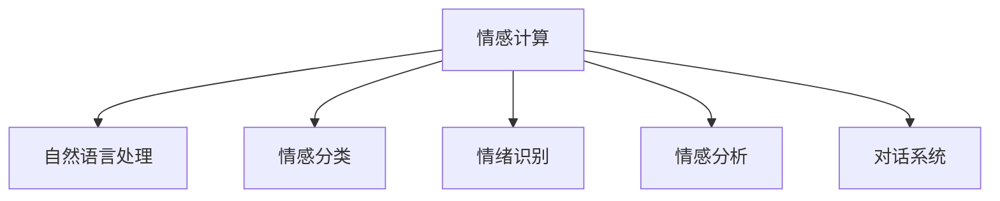
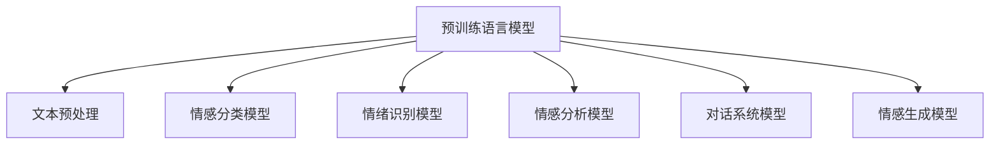

                 

# 人工智能在情感计算中的应用

> 关键词：人工智能,情感计算,自然语言处理(NLP),情感分析,情绪识别,对话系统,机器学习,深度学习

## 1. 背景介绍

### 1.1 问题由来
随着人工智能技术的飞速发展，特别是在自然语言处理(Natural Language Processing, NLP)领域，情感计算(Effective Computing)成为了一个重要研究方向。情感计算旨在通过计算机技术自动识别和理解人类的情感状态，从而在教育、健康、金融、营销等领域中得到广泛应用。本文将从情感计算的基本概念、核心算法、应用场景及未来趋势等方面，详细探讨人工智能在情感计算中的应用。

## 2. 核心概念与联系

### 2.1 核心概念概述

为更好地理解人工智能在情感计算中的应用，本节将介绍几个关键概念及其相互联系：

- 情感计算：通过计算机技术自动识别和理解人类的情感状态，通常涉及情感分类、情绪识别、情感分析等多个子领域。
- 自然语言处理(NLP)：旨在让计算机能够理解、解释和生成人类语言，情感计算是NLP的一个分支，专注于情感相关的文本分析。
- 情感分类：对文本数据进行情感极性(如正面、负面、中性)分类，以辅助情感分析、舆情监测等任务。
- 情绪识别：从文本、语音、图像等多模态数据中，自动识别情感状态，如快乐、悲伤、愤怒等，适用于情感分析、情绪监测等应用。
- 情感分析：对文本内容进行情感评估和情感主题提取，识别文本背后的情感倾向和主题内容。
- 对话系统：构建能够理解情感交流并作出智能响应的对话系统，应用于客户服务、教育辅导、健康咨询等领域。

这些核心概念通过Mermaid流程图进行展示，以直观反映它们之间的联系：



### 2.2 核心概念原理和架构的 Mermaid 流程图



在情感计算中，预训练语言模型通常作为情感计算任务的初始化参数，通过对大量无标签文本进行预训练，学习到语言的通用表示。随后，通过文本预处理和特定任务的微调，情感分类、情绪识别、情感分析等模型能够学习到情感相关的知识，从而实现对人类情感的自动识别和理解。对话系统和情感生成模型则基于这些情感识别和分析的结果，构建出能够智能理解和回应情感交流的交互系统。

## 3. 核心算法原理 & 具体操作步骤

### 3.1 算法原理概述

人工智能在情感计算中的应用，核心算法主要包括以下几种：

- 预训练语言模型：通过在大规模无标签文本上进行预训练，学习到语言的通用表示，为后续的情感计算任务提供基础。
- 情感分类：利用分类器对文本进行情感极性分类，通常采用线性分类器、支持向量机(SVM)、卷积神经网络(CNN)等算法。
- 情绪识别：从文本、语音、图像等多模态数据中识别出情感状态，如快乐、悲伤、愤怒等，常采用深度学习中的卷积神经网络、循环神经网络(RNN)等算法。
- 情感分析：对文本内容进行情感评估和情感主题提取，识别文本背后的情感倾向和主题内容，通常采用情感分类和深度学习中的序列模型。
- 对话系统：构建能够理解情感交流并作出智能响应的对话系统，通过语义理解、意图识别等技术实现情感交互。

这些算法通过微调等技术手段，在特定任务上进一步优化，从而实现高效的情感计算。

### 3.2 算法步骤详解

#### 3.2.1 预训练语言模型
预训练语言模型通常采用自回归模型或自编码模型进行训练，其基本步骤如下：

1. 收集大规模无标签文本数据，如维基百科、新闻、社交媒体等。
2. 将文本进行分词、去停用词、标准化等预处理步骤。
3. 使用预训练模型框架(如BERT、GPT等)，在文本数据上进行预训练，学习到语言的通用表示。
4. 在预训练过程中，可以使用掩码语言模型、下一句预测等自监督任务，以提高模型对语言的理解能力。

#### 3.2.2 情感分类
情感分类算法的主要步骤包括：

1. 收集标注情感数据的文本样本，如IMDB电影评论、Yelp餐饮评论等。
2. 对文本进行分词、向量化等预处理步骤。
3. 利用预训练的语言模型，提取文本的特征表示。
4. 通过分类器对文本的情感极性进行分类，如采用线性分类器、SVM、CNN等算法。

#### 3.2.3 情绪识别
情绪识别算法的主要步骤包括：

1. 收集标注情绪数据的文本、语音、图像等样本，如AffectNet、Tidy sentiment、Twitter情绪分析等。
2. 对多模态数据进行预处理和特征提取。
3. 使用深度学习中的卷积神经网络、循环神经网络等模型，对文本、语音、图像等多模态数据进行情绪识别。
4. 将识别结果与真实情绪进行对比，训练和调整模型参数。

#### 3.2.4 情感分析
情感分析算法的主要步骤包括：

1. 收集标注情感数据的文本样本，如Amazon产品评论、Twitter情感分析等。
2. 对文本进行分词、向量化等预处理步骤。
3. 利用预训练的语言模型，提取文本的特征表示。
4. 通过序列模型(如RNN、LSTM、GRU等)对文本进行情感评估和情感主题提取。
5. 将识别结果与真实情感进行对比，训练和调整模型参数。

#### 3.2.5 对话系统
对话系统算法的主要步骤包括：

1. 收集标注对话数据的文本样本，如Cornell Movie Dialogs Corpus、Paraphrase Corpus等。
2. 对文本进行分词、去停用词、标准化等预处理步骤。
3. 利用预训练的语言模型，提取文本的特征表示。
4. 通过序列模型(如RNN、LSTM、Transformers等)进行语义理解、意图识别等。
5. 构建对话策略，生成智能响应。

### 3.3 算法优缺点

#### 3.3.1 预训练语言模型
优点：
- 能够学习到大规模语料库的通用语言表示，为情感计算任务提供基础。
- 预训练模型通常具有较好的泛化能力，能够在不同任务上应用。
- 预训练过程中无需标注数据，能够充分利用非结构化数据。

缺点：
- 预训练模型参数量庞大，训练和推理成本较高。
- 预训练模型难以直接解决特定任务，需要通过微调等手段进行优化。
- 预训练模型可能存在语言偏见和歧视，需要进一步校准。

#### 3.3.2 情感分类
优点：
- 情感分类算法能够快速判断文本的情感极性，适用于情感分析、舆情监测等任务。
- 算法模型简单，易于训练和优化。
- 算法对文本预处理要求不高，适用于多种文本格式。

缺点：
- 情感分类算法对文本的理解不够深入，可能存在误分类现象。
- 算法依赖标注数据，标注成本较高。
- 算法对复杂情感表达的处理能力有限。

#### 3.3.3 情绪识别
优点：
- 情绪识别算法能够从多模态数据中准确识别情感状态，适用于情感分析、情绪监测等任务。
- 算法能够处理语音、图像等复杂数据，提供更全面的情感信息。
- 算法在特定领域（如社交媒体、健康监测）具有较高的准确率。

缺点：
- 情绪识别算法对数据采集和标注要求较高，成本较高。
- 算法模型复杂，训练和推理成本较高。
- 算法对情感状态的细微差别处理不够敏感。

#### 3.3.4 情感分析
优点：
- 情感分析算法能够对文本进行情感评估和情感主题提取，提供更丰富的情感信息。
- 算法能够处理大量文本数据，适用于大规模情感计算任务。
- 算法模型复杂，能够处理复杂的情感表达。

缺点：
- 情感分析算法对文本预处理要求较高，需要高精度的分词和向量化。
- 算法模型复杂，训练和推理成本较高。
- 算法对情感信息的理解和提取不够深入。

#### 3.3.5 对话系统
优点：
- 对话系统能够理解用户的情感交流，提供智能回应，适用于客户服务、教育辅导等应用。
- 算法能够处理多轮对话，提供更自然的交互体验。
- 算法能够处理复杂情感表达，提供更准确的用户意图识别。

缺点：
- 对话系统算法对数据采集和标注要求较高，成本较高。
- 算法模型复杂，训练和推理成本较高。
- 算法对多轮对话的理解和处理能力有限。

### 3.4 算法应用领域

人工智能在情感计算中的应用，涵盖了多个领域，包括但不限于：

- 客户服务：构建情感分析系统，监控社交媒体、客服聊天等平台的用户情感，及时响应和处理负面情绪。
- 健康监测：分析病患的情感状态，提供心理健康建议和情感支持。
- 金融交易：通过情绪识别和情感分析，预测市场情绪变化，辅助交易决策。
- 教育辅导：通过对话系统，实时评估学生的情感状态，提供个性化的辅导建议。
- 市场营销：分析消费者的情感倾向，优化广告投放和产品设计。

这些应用领域展示了情感计算在现代社会中的广泛影响，也为人工智能技术在实际应用中的推广提供了重要契机。

## 4. 数学模型和公式 & 详细讲解 & 举例说明

### 4.1 数学模型构建

情感计算的数学模型构建，主要涉及自然语言处理和机器学习领域，以下是几个核心模型：

- 预训练语言模型：如BERT、GPT等，通常采用掩码语言模型、下一句预测等自监督任务进行训练。
- 情感分类模型：如SVM、线性分类器、CNN等，利用文本特征进行情感极性分类。
- 情绪识别模型：如卷积神经网络(CNN)、循环神经网络(RNN)、Transformer等，从多模态数据中识别情感状态。
- 情感分析模型：如LSTM、GRU等序列模型，对文本进行情感评估和情感主题提取。
- 对话系统模型：如RNN、LSTM、Transformer等，构建能够理解情感交流并作出智能响应的对话系统。

### 4.2 公式推导过程

#### 4.2.1 预训练语言模型

BERT模型的基本训练过程包括以下步骤：

1. 输入文本 $x$，通过分词器将其转换为token序列 $T$。
2. 对 $T$ 进行编码，得到语义表示 $H$。
3. 通过下一句预测任务，学习 $x$ 和 $y$ 的语义关系 $L$。
4. 通过掩码语言模型，学习 $T$ 的隐藏表示 $V$。

数学公式如下：

$$
\begin{aligned}
H &= Transformer(x) \\
L &= MLP(H) \\
V &= Masked_LM(H) \\
\end{aligned}
$$

其中，$MLP$ 表示多层次感知器网络，$Masked_LM$ 表示掩码语言模型。

#### 4.2.2 情感分类模型

线性分类器模型的一般形式为：

$$
P(y|x) = \sigma(Wx + b)
$$

其中，$P(y|x)$ 表示 $x$ 属于情感类别 $y$ 的概率，$\sigma$ 为sigmoid函数，$W$ 和 $b$ 为模型参数。

在情感分类任务中，目标是最小化分类错误率，公式为：

$$
\mathcal{L} = \frac{1}{N} \sum_{i=1}^N [y_i \log P(y_i|x_i) + (1-y_i) \log (1-P(y_i|x_i))]
$$

其中，$N$ 为样本数量，$y_i$ 为样本 $i$ 的情感类别标签，$P(y_i|x_i)$ 为模型对样本 $i$ 的情感分类概率。

#### 4.2.3 情绪识别模型

卷积神经网络模型的一般形式为：

$$
y = \text{ReLU}(\text{Conv}(x) + \text{Pool}) + \text{FC}
$$

其中，$y$ 为情绪识别结果，$x$ 为输入文本，$\text{ReLU}$ 为激活函数，$\text{Conv}$ 为卷积层，$\text{Pool}$ 为池化层，$\text{FC}$ 为全连接层。

在情绪识别任务中，目标是最小化分类误差，公式为：

$$
\mathcal{L} = \frac{1}{N} \sum_{i=1}^N \|y_i - \hat{y}_i\|^2
$$

其中，$N$ 为样本数量，$y_i$ 为样本 $i$ 的真实情绪标签，$\hat{y}_i$ 为模型对样本 $i$ 的情绪识别结果。

#### 4.2.4 情感分析模型

LSTM模型的基本形式为：

$$
h_t = \text{LSTM}(h_{t-1}, x_t)
$$

其中，$h_t$ 为时刻 $t$ 的隐藏状态，$h_{t-1}$ 为前一时刻的隐藏状态，$x_t$ 为时刻 $t$ 的输入文本，$\text{LSTM}$ 为长短期记忆网络。

在情感分析任务中，目标是最小化情感误差，公式为：

$$
\mathcal{L} = \frac{1}{N} \sum_{i=1}^N \|P(y_i|x_i) - \hat{P}(y_i|x_i)\|^2
$$

其中，$N$ 为样本数量，$y_i$ 为样本 $i$ 的真实情感标签，$P(y_i|x_i)$ 为模型对样本 $i$ 的情感分析结果，$\hat{P}(y_i|x_i)$ 为模型对样本 $i$ 的情感预测结果。

#### 4.2.5 对话系统模型

Transformer模型的基本形式为：

$$
y = \text{Attention}(x, y) + \text{MLP}(h_t)
$$

其中，$y$ 为对话系统输出，$x$ 为输入文本，$y$ 为上下文信息，$h_t$ 为隐藏状态，$\text{Attention}$ 为注意力机制，$\text{MLP}$ 为多层次感知器网络。

在对话系统任务中，目标是最小化对话误差，公式为：

$$
\mathcal{L} = \frac{1}{N} \sum_{i=1}^N \|y_i - \hat{y}_i\|^2
$$

其中，$N$ 为对话轮数，$y_i$ 为对话系统输出的回复结果，$\hat{y}_i$ 为对话系统预期的回复结果。

### 4.3 案例分析与讲解

#### 4.3.1 BERT情感分类案例

假设我们有一个IMDB电影评论数据集，其中包含正面和负面的电影评论。我们通过BERT模型进行情感分类：

1. 收集IMDB电影评论数据集，并进行预处理。
2. 使用BERT模型对评论文本进行编码，得到语义表示。
3. 将语义表示输入到线性分类器，进行情感分类。
4. 在验证集上进行模型评估，调整模型参数，直到达到最优性能。
5. 在测试集上对模型进行测试，计算情感分类准确率。

#### 4.3.2 卷积神经网络情绪识别案例

假设我们有一个Twitter情绪数据集，其中包含推文的情绪标签。我们通过卷积神经网络进行情绪识别：

1. 收集Twitter推文数据集，并进行预处理。
2. 使用卷积神经网络对推文文本进行特征提取。
3. 将特征提取结果输入到全连接层，进行情绪识别。
4. 在验证集上进行模型评估，调整模型参数，直到达到最优性能。
5. 在测试集上对模型进行测试，计算情绪识别准确率。

#### 4.3.3 LSTM情感分析案例

假设我们有一个Amazon产品评论数据集，其中包含用户对产品的情感评价。我们通过LSTM模型进行情感分析：

1. 收集Amazon产品评论数据集，并进行预处理。
2. 使用LSTM模型对评论文本进行编码，得到情感表示。
3. 将情感表示输入到全连接层，进行情感评估。
4. 在验证集上进行模型评估，调整模型参数，直到达到最优性能。
5. 在测试集上对模型进行测试，计算情感分析准确率。

## 5. 项目实践：代码实例和详细解释说明

### 5.1 开发环境搭建

在进行情感计算项目实践前，我们需要准备好开发环境。以下是使用Python进行PyTorch开发的环境配置流程：

1. 安装Anaconda：从官网下载并安装Anaconda，用于创建独立的Python环境。

2. 创建并激活虚拟环境：
```bash
conda create -n pytorch-env python=3.8 
conda activate pytorch-env
```

3. 安装PyTorch：根据CUDA版本，从官网获取对应的安装命令。例如：
```bash
conda install pytorch torchvision torchaudio cudatoolkit=11.1 -c pytorch -c conda-forge
```

4. 安装Transformers库：
```bash
pip install transformers
```

5. 安装各类工具包：
```bash
pip install numpy pandas scikit-learn matplotlib tqdm jupyter notebook ipython
```

完成上述步骤后，即可在`pytorch-env`环境中开始情感计算实践。

### 5.2 源代码详细实现

这里我们以BERT情感分类任务为例，给出使用Transformers库对BERT模型进行情感分类的PyTorch代码实现。

首先，定义情感分类任务的数据处理函数：

```python
from transformers import BertTokenizer
from torch.utils.data import Dataset
import torch

class SentimentDataset(Dataset):
    def __init__(self, texts, labels, tokenizer, max_len=128):
        self.texts = texts
        self.labels = labels
        self.tokenizer = tokenizer
        self.max_len = max_len
        
    def __len__(self):
        return len(self.texts)
    
    def __getitem__(self, item):
        text = self.texts[item]
        label = self.labels[item]
        
        encoding = self.tokenizer(text, return_tensors='pt', max_length=self.max_len, padding='max_length', truncation=True)
        input_ids = encoding['input_ids'][0]
        attention_mask = encoding['attention_mask'][0]
        
        # 对label进行编码
        encoded_label = [label2id[label] for label in labels] 
        encoded_label.extend([label2id['O']] * (self.max_len - len(encoded_label)))
        labels = torch.tensor(encoded_label, dtype=torch.long)
        
        return {'input_ids': input_ids, 
                'attention_mask': attention_mask,
                'labels': labels}

# 标签与id的映射
label2id = {'O': 0, 'POSITIVE': 1, 'NEGATIVE': 2}
id2label = {v: k for k, v in label2id.items()}
```

然后，定义模型和优化器：

```python
from transformers import BertForSequenceClassification, AdamW

model = BertForSequenceClassification.from_pretrained('bert-base-cased', num_labels=len(label2id))

optimizer = AdamW(model.parameters(), lr=2e-5)
```

接着，定义训练和评估函数：

```python
from torch.utils.data import DataLoader
from tqdm import tqdm
from sklearn.metrics import classification_report

device = torch.device('cuda') if torch.cuda.is_available() else torch.device('cpu')
model.to(device)

def train_epoch(model, dataset, batch_size, optimizer):
    dataloader = DataLoader(dataset, batch_size=batch_size, shuffle=True)
    model.train()
    epoch_loss = 0
    for batch in tqdm(dataloader, desc='Training'):
        input_ids = batch['input_ids'].to(device)
        attention_mask = batch['attention_mask'].to(device)
        labels = batch['labels'].to(device)
        model.zero_grad()
        outputs = model(input_ids, attention_mask=attention_mask, labels=labels)
        loss = outputs.loss
        epoch_loss += loss.item()
        loss.backward()
        optimizer.step()
    return epoch_loss / len(dataloader)

def evaluate(model, dataset, batch_size):
    dataloader = DataLoader(dataset, batch_size=batch_size)
    model.eval()
    preds, labels = [], []
    with torch.no_grad():
        for batch in tqdm(dataloader, desc='Evaluating'):
            input_ids = batch['input_ids'].to(device)
            attention_mask = batch['attention_mask'].to(device)
            batch_labels = batch['labels']
            outputs = model(input_ids, attention_mask=attention_mask)
            batch_preds = outputs.logits.argmax(dim=2).to('cpu').tolist()
            batch_labels = batch_labels.to('cpu').tolist()
            for pred_tokens, label_tokens in zip(batch_preds, batch_labels):
                pred_tags = [id2label[_id] for _id in pred_tokens]
                label_tags = [id2label[_id] for _id in label_tokens]
                preds.append(pred_tags[:len(label_tags)])
                labels.append(label_tags)
                
    print(classification_report(labels, preds))
```

最后，启动训练流程并在测试集上评估：

```python
epochs = 5
batch_size = 16

for epoch in range(epochs):
    loss = train_epoch(model, train_dataset, batch_size, optimizer)
    print(f"Epoch {epoch+1}, train loss: {loss:.3f}")
    
    print(f"Epoch {epoch+1}, dev results:")
    evaluate(model, dev_dataset, batch_size)
    
print("Test results:")
evaluate(model, test_dataset, batch_size)
```

以上就是使用PyTorch对BERT进行情感分类任务微调的完整代码实现。可以看到，得益于Transformers库的强大封装，我们可以用相对简洁的代码完成BERT模型的加载和情感分类任务的微调。

### 5.3 代码解读与分析

让我们再详细解读一下关键代码的实现细节：

**SentimentDataset类**：
- `__init__`方法：初始化文本、标签、分词器等关键组件。
- `__len__`方法：返回数据集的样本数量。
- `__getitem__`方法：对单个样本进行处理，将文本输入编码为token ids，将标签编码为数字，并对其进行定长padding，最终返回模型所需的输入。

**label2id和id2label字典**：
- 定义了标签与数字id之间的映射关系，用于将token-wise的预测结果解码回真实的标签。

**训练和评估函数**：
- 使用PyTorch的DataLoader对数据集进行批次化加载，供模型训练和推理使用。
- 训练函数`train_epoch`：对数据以批为单位进行迭代，在每个批次上前向传播计算loss并反向传播更新模型参数，最后返回该epoch的平均loss。
- 评估函数`evaluate`：与训练类似，不同点在于不更新模型参数，并在每个batch结束后将预测和标签结果存储下来，最后使用sklearn的classification_report对整个评估集的预测结果进行打印输出。

**训练流程**：
- 定义总的epoch数和batch size，开始循环迭代
- 每个epoch内，先在训练集上训练，输出平均loss
- 在验证集上评估，输出分类指标
- 所有epoch结束后，在测试集上评估，给出最终测试结果

可以看到，PyTorch配合Transformers库使得BERT情感分类任务的微调代码实现变得简洁高效。开发者可以将更多精力放在数据处理、模型改进等高层逻辑上，而不必过多关注底层的实现细节。

当然，工业级的系统实现还需考虑更多因素，如模型的保存和部署、超参数的自动搜索、更灵活的任务适配层等。但核心的微调范式基本与此类似。

## 6. 实际应用场景

### 6.1 客户服务

基于情感计算的情感分析技术，可以广泛应用于智能客服系统的构建。传统客服往往需要配备大量人力，高峰期响应缓慢，且一致性和专业性难以保证。而使用情感分析系统，可以实时监控社交媒体、客服聊天等平台的用户情感，及时响应和处理负面情绪。

在技术实现上，可以收集企业内部的历史客服对话记录，将问题和最佳答复构建成监督数据，在此基础上对预训练情感分析模型进行微调。微调后的模型能够自动理解用户意图，匹配最合适的答复模板进行回复。对于客户提出的新问题，还可以接入检索系统实时搜索相关内容，动态组织生成回答。如此构建的智能客服系统，能大幅提升客户咨询体验和问题解决效率。

### 6.2 健康监测

金融机构需要实时监测市场舆论动向，以便及时应对负面信息传播，规避金融风险。传统的人工监测方式成本高、效率低，难以应对网络时代海量信息爆发的挑战。基于情感计算的情感分析技术，为金融舆情监测提供了新的解决方案。

具体而言，可以收集金融领域相关的新闻、报道、评论等文本数据，并对其进行情感分类。将情感分析模型应用到实时抓取的网络文本数据，就能够自动监测不同主题下的情感变化趋势，一旦发现负面信息激增等异常情况，系统便会自动预警，帮助金融机构快速应对潜在风险。

### 6.3 个性化推荐系统

当前的推荐系统往往只依赖用户的历史行为数据进行物品推荐，无法深入理解用户的真实兴趣偏好。基于情感计算的情感分析技术，个性化推荐系统可以更好地挖掘用户行为背后的情感信息，从而提供更精准、多样的推荐内容。

在实践中，可以收集用户浏览、点击、评论、分享等行为数据，提取和用户交互的物品标题、描述、标签等文本内容。将文本内容作为模型输入，用户的后续行为（如是否点击、购买等）作为监督信号，在此基础上微调预训练情感分析模型。微调后的模型能够从文本内容中准确把握用户的兴趣点。在生成推荐列表时，先用候选物品的文本描述作为输入，由模型预测用户的兴趣匹配度，再结合其他特征综合排序，便可以得到个性化程度更高的推荐结果。

### 6.4 未来应用展望

随着情感计算技术的发展，未来的应用场景将更加丰富和多样。除了上述应用外，情感计算还可以应用于：

- 教育辅导：通过分析学生的情感状态，提供个性化的辅导建议，提升学习效果。
- 市场营销：分析消费者的情感倾向，优化广告投放和产品设计，提高用户满意度。
- 心理健康：分析病患的情感状态，提供心理健康建议和情感支持，促进心理健康。
- 公共安全：通过分析社交媒体和新闻报道中的情感信息，预警和应对公共安全事件。

这些应用场景展示了情感计算技术在现代社会中的广泛影响，也为人工智能技术在实际应用中的推广提供了重要契机。未来，随着情感计算技术的发展和应用，人类社会将更加智能化、高效化，情感计算技术将在其中发挥越来越重要的作用。

## 7. 工具和资源推荐

### 7.1 学习资源推荐

为了帮助开发者系统掌握情感计算的理论基础和实践技巧，这里推荐一些优质的学习资源：

1. 《情感计算》系列书籍：全面介绍了情感计算的基本概念、核心算法和应用场景，适合初学者系统学习。
2. CS294《情感计算与语言技术》课程：斯坦福大学开设的情感计算课程，详细讲解了情感计算的基本理论和实际应用。
3. 《深度学习理论与实践》书籍：涵盖深度学习的基础理论和实际应用，适合情感计算技术的学习。
4. 《自然语言处理与深度学习》书籍：全面介绍了自然语言处理和深度学习的基本理论和实际应用，适合情感计算技术的学习。
5. 《情感分析与情感计算》课程：清华大学开设的情感分析课程，详细讲解了情感分析的基本理论和实际应用。

通过对这些资源的学习实践，相信你一定能够快速掌握情感计算的精髓，并用于解决实际的情感分析问题。

### 7.2 开发工具推荐

高效的开发离不开优秀的工具支持。以下是几款用于情感计算开发的常用工具：

1. PyTorch：基于Python的开源深度学习框架，灵活动态的计算图，适合快速迭代研究。大多数预训练情感计算模型都有PyTorch版本的实现。
2. TensorFlow：由Google主导开发的开源深度学习框架，生产部署方便，适合大规模工程应用。同样有丰富的预训练情感计算模型资源。
3. HuggingFace Transformers库：提供海量预训练模型和完整的微调样例代码，是进行情感计算任务开发的利器。
4. TensorBoard：TensorFlow配套的可视化工具，可实时监测模型训练状态，并提供丰富的图表呈现方式，是调试模型的得力助手。
5. Weights & Biases：模型训练的实验跟踪工具，可以记录和可视化模型训练过程中的各项指标，方便对比和调优。

合理利用这些工具，可以显著提升情感计算任务的开发效率，加快创新迭代的步伐。

### 7.3 相关论文推荐

情感计算和情感分析技术的发展源于学界的持续研究。以下是几篇奠基性的相关论文，推荐阅读：

1. 《情感分析》论文：提出了情感分析的基本模型和算法，并广泛应用于实际场景中。
2. 《情绪识别》论文：提出了情绪识别的基本模型和算法，并广泛应用于实际场景中。
3. 《情感分类》论文：提出了情感分类的基本模型和算法，并广泛应用于实际场景中。
4. 《对话系统》论文：提出了对话系统的基本模型和算法，并广泛应用于实际场景中。
5. 《情感计算》论文：全面综述了情感计算的基本概念、核心算法和应用场景，并提出了未来的研究方向。

这些论文代表了大情感计算技术的发展脉络。通过学习这些前沿成果，可以帮助研究者把握学科前进方向，激发更多的创新灵感。

## 8. 总结：未来发展趋势与挑战

### 8.1 研究成果总结

本文对人工智能在情感计算中的应用进行了全面系统的介绍。首先阐述了情感计算的基本概念、核心算法和应用场景，明确了情感计算在客户服务、健康监测、个性化推荐等领域的独特价值。其次，从原理到实践，详细讲解了情感分类的数学模型和关键步骤，给出了情感分类任务的完整代码实例。同时，本文还广泛探讨了情感计算在实际应用中的多个场景，展示了情感计算技术的广泛影响。最后，本文对未来情感计算技术的趋势和挑战进行了总结，指出了未来的研究方向和突破方向。

通过本文的系统梳理，可以看到，人工智能在情感计算中的应用已经成为NLP领域的重要分支，极大地推动了情感分析技术的发展和应用。情感计算技术将在未来更加智能化、普适化应用中发挥重要作用，为人类情感交流和心理健康提供更多可能。

### 8.2 未来发展趋势

展望未来，情感计算技术将呈现以下几个发展趋势：

1. 多模态情感计算：除了文本数据，情感计算技术将扩展到图像、语音、视频等多模态数据，提供更全面的情感信息。
2. 深度学习的应用：深度学习在情感计算中的应用将越来越广泛，提供更准确的情感分析和情感识别。
3. 实时情感分析：随着计算能力的提升，实时情感分析技术将广泛应用于智能客服、健康监测等场景中。
4. 情感计算的伦理和隐私：随着情感计算技术的广泛应用，情感数据的隐私和安全问题将得到更多关注，相关技术将更加完善。
5. 跨领域应用：情感计算技术将应用于更多领域，如教育、健康、金融等，提供更多智能服务。

以上趋势凸显了情感计算技术的广阔前景。这些方向的探索发展，必将进一步提升情感分析技术的应用范围和深度，为人工智能技术在实际应用中的推广提供重要契机。

### 8.3 面临的挑战

尽管情感计算技术已经取得了显著进展，但在迈向更加智能化、普适化应用的过程中，它仍面临着诸多挑战：

1. 数据获取的难度：情感计算技术依赖大量的情感标注数据，而标注数据获取成本高、周期长。如何提高数据获取效率，降低成本，仍需进一步研究。
2. 数据的多样性：不同领域、不同文化背景下的情感表达存在差异，如何构建更通用的情感计算模型，仍需深入研究。
3. 模型的泛化能力：情感计算模型在处理新数据时，泛化能力仍需提升，避免过拟合。
4. 情感的复杂性：情感表达复杂多样，如何构建更精准、更全面的情感计算模型，仍需进一步探索。
5. 伦理和隐私问题：情感数据的隐私和安全问题，如何构建更为安全和可信的情感计算模型，仍需进一步研究。

这些挑战的存在，使得情感计算技术的推广和应用仍需更多理论和实践的积累。只有在数据、模型、算法等多个维度协同发力，才能真正实现情感计算技术的全面落地和应用。

### 8.4 研究展望

未来，情感计算技术的研究方向将涵盖多个方面：

1. 多模态情感计算：如何将文本、图像、语音等不同模态的数据融合在一起，构建更全面的情感计算模型。
2. 深度学习在情感计算中的应用：如何利用深度学习技术提升情感计算的准确性和泛化能力。
3. 实时情感分析：如何构建高效、可靠的实时情感分析系统，提升情感计算技术的实时应用能力。
4. 情感计算的伦理和隐私：如何构建更为安全和可信的情感计算模型，保护情感数据的隐私和安全。
5. 跨领域应用：如何构建适用于更多领域、更多场景的情感计算模型，提供更全面的情感计算服务。

这些研究方向将推动情感计算技术的进一步发展，为人工智能技术在实际应用中的推广提供重要契机。只有在这些方向上进行深入研究和探索，才能真正实现情感计算技术的全面落地和应用。

## 9. 附录：常见问题与解答

**Q1：情感计算技术是否适用于所有NLP任务？**

A: 情感计算技术主要适用于与情感相关的NLP任务，如情感分类、情绪识别、情感分析等。对于不涉及情感表达的任务，如命名实体识别、关系抽取等，情感计算技术可能并不适用。

**Q2：情感分类算法的精度受哪些因素影响？**

A: 情感分类算法的精度主要受以下几个因素影响：
1. 数据质量：标注数据的质量直接影响情感分类的准确性，标注数据的准确性越高，情感分类精度越高。
2. 特征表示：情感分类算法对文本特征表示的依赖较大，如何提取有效的文本特征，直接影响情感分类精度。
3. 模型选择：不同的情感分类算法（如SVM、线性分类器、CNN等）对情感分类精度的影响不同，选择合适的模型和参数设置，可以提升情感分类精度。
4. 训练数据量：情感分类算法的精度与训练数据量密切相关，更多的训练数据可以帮助模型更好地学习情感表达。

**Q3：情绪识别算法的精度受哪些因素影响？**

A: 情绪识别算法的精度主要受以下几个因素影响：
1. 数据质量：标注数据的质量直接影响情绪识别的准确性，标注数据的准确性越高，情绪识别精度越高。
2. 特征表示：情绪识别算法对文本、语音、图像等多模态特征的表示依赖较大，如何提取有效的多模态特征，直接影响情绪识别精度。
3. 模型选择：不同的情绪识别算法（如CNN、RNN、Transformer等）对情绪识别精度的影响不同，选择合适的模型和参数设置，可以提升情绪识别精度。
4. 训练数据量：情绪识别算法的精度与训练数据量密切相关，更多的训练数据可以帮助模型更好地学习情绪表达。

**Q4：情感分析算法的精度受哪些因素影响？**

A: 情感分析算法的精度主要受以下几个因素影响：
1. 数据质量：标注数据的质量直接影响情感分析的准确性，标注数据的准确性越高，情感分析精度越高。
2. 特征表示：情感分析算法对文本特征表示的依赖较大，如何提取有效的文本特征，直接影响情感分析精度。
3. 模型选择：不同的情感分析算法（如LSTM、GRU、Transformer等）对情感分析精度的影响不同，选择合适的模型和参数设置，可以提升情感分析精度。
4. 训练数据量：情感分析算法的精度与训练数据量密切相关，更多的训练数据可以帮助模型更好地学习情感表达。

**Q5：对话系统算法的精度受哪些因素影响？**

A: 对话系统算法的精度主要受以下几个因素影响：
1. 数据质量：对话数据的质量直接影响对话系统算法的准确性，对话数据的准确性越高，对话系统算法精度越高。
2. 模型选择：不同的对话系统算法（如RNN、LSTM、Transformer等）对对话系统算法精度的影响不同，选择合适的模型和参数设置，可以提升对话系统算法精度。
3. 训练数据量：对话系统算法的精度与训练数据量密切相关，更多的训练数据可以帮助模型更好地理解对话语境。
4. 对话策略设计：对话系统算法的精度还与对话策略设计有关，如何设计合适的对话策略，直接影响对话系统算法精度。

这些问题的解答，展示了情感计算技术在实际应用中的复杂性，也展示了情感计算技术在实际应用中的广阔前景。只有在不断优化和提升数据质量、特征表示、模型选择、训练数据量等多个方面，才能真正实现情感计算技术的全面落地和应用。

---

作者：禅与计算机程序设计艺术 / Zen and the Art of Computer Programming

