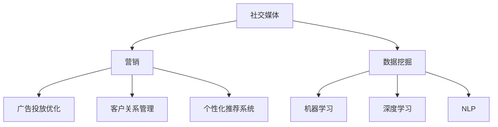

                 

# 人工智能在社交媒体和营销中的应用

> 关键词：人工智能,社交媒体,营销,数据挖掘,机器学习,自然语言处理,NLP,深度学习,广告投放,用户分析,客户关系管理,CRM

## 1. 背景介绍

### 1.1 问题由来
社交媒体和营销领域是近年来互联网发展的重要驱动力。随着智能手机和移动互联网的普及，社交媒体的用户量呈爆炸式增长。广告主和品牌商希望通过社交媒体获得更高的曝光度和互动率，而消费者也渴望通过社交媒体获取更加丰富和精准的信息。人工智能技术，特别是机器学习、深度学习等方法，为这两者的需求提供了解决方案。

AI技术的应用，使得社交媒体和营销领域发生了深刻变革。广告投放更加精准，客户关系管理更加高效，用户分析更加深入，从而提升了品牌商和广告主的ROI。

### 1.2 问题核心关键点
社交媒体和营销中AI的应用主要集中在以下几个方面：

1. 数据挖掘与分析：通过AI技术从海量数据中提取有价值的信息，帮助品牌商更好地理解市场和用户需求。
2. 广告投放与优化：利用AI技术优化广告投放策略，提升广告效果和用户参与度。
3. 自然语言处理（NLP）：利用NLP技术提升社交媒体上的用户互动和内容生成，改善用户体验。
4. 客户关系管理（CRM）：通过AI技术提升客户关系管理水平，提升客户满意度和忠诚度。
5. 用户分析与个性化推荐：利用AI技术分析用户行为和偏好，提供个性化推荐和定制化服务。

这些问题将引导本文深入探讨AI在社交媒体和营销中的应用。

## 2. 核心概念与联系

### 2.1 核心概念概述

为了更好地理解AI在社交媒体和营销中的应用，本文将介绍几个核心概念：

- **社交媒体**：指通过Web、移动设备等在线平台，以文字、图片、视频等多种形式实现信息交互和分享的网络空间。如Facebook、Twitter、Instagram等。
- **营销**：指品牌商或广告主通过各种手段（如广告、促销、公关活动等）向目标消费者传递产品信息，促进销售的商业活动。
- **数据挖掘**：指从大量数据中提取有用信息和知识的过程，常用于市场分析、用户行为预测等。
- **机器学习（ML）**：指让机器通过数据和算法自动学习规律和模式，从而做出预测和决策。
- **深度学习（DL）**：一种特殊的机器学习，通过多层神经网络模型来捕捉和表示复杂的数据模式。
- **自然语言处理（NLP）**：指使用AI技术处理、理解、生成自然语言的能力。
- **客户关系管理（CRM）**：指通过系统管理客户信息、互动记录等，提升客户满意度和忠诚度。
- **广告投放优化**：指通过AI技术优化广告投放策略，提升广告效果和用户参与度。
- **个性化推荐系统**：指通过AI技术分析用户行为和偏好，提供个性化推荐和定制化服务。

这些概念之间的联系可以通过以下Mermaid流程图来展示：



这个流程图展示了几大核心概念之间的逻辑关系：

1. 社交媒体为营销提供了渠道和数据源。
2. 数据挖掘从社交媒体和营销数据中提取信息，驱动市场分析、用户行为预测等。
3. 机器学习和深度学习通过学习数据规律，实现精准投放、智能推荐等。
4. NLP技术提升社交媒体上的用户互动和内容生成。
5. CRM系统通过AI技术提升客户管理水平，提升客户满意度和忠诚度。
6. 广告投放优化和个性化推荐系统通过AI技术实现精准投放和推荐。

## 3. 核心算法原理 & 具体操作步骤

### 3.1 算法原理概述

AI在社交媒体和营销中的应用主要涉及以下几个算法原理：

1. **数据挖掘算法**：用于从大规模数据中提取有价值的信息，包括聚类、分类、关联规则挖掘等。
2. **机器学习算法**：用于构建模型，从数据中学习规律和模式，包括监督学习、无监督学习、强化学习等。
3. **深度学习算法**：用于处理复杂数据，构建高层次的特征表示，包括卷积神经网络（CNN）、循环神经网络（RNN）、变换器（Transformer）等。
4. **NLP算法**：用于处理和生成自然语言，包括词向量表示、文本分类、情感分析、机器翻译等。
5. **广告投放优化算法**：用于提升广告投放效果，包括点击率预测、转化率预测、用户行为建模等。
6. **CRM算法**：用于提升客户关系管理水平，包括客户分群、个性化推荐、情感分析等。

这些算法原理构成了AI在社交媒体和营销应用的核心，下面将详细介绍这些算法的具体操作步骤。

### 3.2 算法步骤详解

#### 3.2.1 数据挖掘算法

**步骤1: 数据收集与预处理**
- 收集社交媒体平台上的用户数据和营销数据。
- 清洗数据，去除噪声和不相关数据。
- 将数据转换为机器学习算法可处理的格式。

**步骤2: 数据建模**
- 选择合适的模型，如K-means、决策树、随机森林等。
- 训练模型，并调整超参数以优化模型性能。

**步骤3: 结果分析与可视化**
- 对模型结果进行分析，提取关键信息。
- 使用可视化工具如Tableau、Matplotlib等展示分析结果。

#### 3.2.2 机器学习算法

**步骤1: 数据收集与预处理**
- 收集社交媒体平台上的用户数据和营销数据。
- 清洗数据，去除噪声和不相关数据。
- 将数据转换为机器学习算法可处理的格式。

**步骤2: 模型选择与训练**
- 选择合适的模型，如线性回归、支持向量机、随机森林等。
- 训练模型，并调整超参数以优化模型性能。

**步骤3: 模型评估与优化**
- 使用交叉验证等方法评估模型性能。
- 使用网格搜索、随机搜索等方法优化模型超参数。

#### 3.2.3 深度学习算法

**步骤1: 数据收集与预处理**
- 收集社交媒体平台上的用户数据和营销数据。
- 清洗数据，去除噪声和不相关数据。
- 将数据转换为深度学习算法可处理的格式。

**步骤2: 模型构建与训练**
- 选择合适的深度学习模型，如CNN、RNN、Transformer等。
- 构建模型，并使用GPU等高性能设备进行训练。
- 调整超参数以优化模型性能。

**步骤3: 模型评估与优化**
- 使用测试集评估模型性能。
- 使用可视化工具如TensorBoard等展示训练过程。
- 使用正则化、Dropout等技术避免过拟合。

#### 3.2.4 NLP算法

**步骤1: 文本预处理**
- 对文本进行分词、去除停用词、词干提取等预处理。
- 构建词汇表，将文本转换为向量表示。

**步骤2: 模型训练**
- 选择合适的NLP模型，如Word2Vec、GloVe、BERT等。
- 训练模型，并调整超参数以优化模型性能。

**步骤3: 模型应用**
- 使用训练好的模型进行文本分类、情感分析、机器翻译等任务。

#### 3.2.5 广告投放优化算法

**步骤1: 数据收集与预处理**
- 收集用户行为数据和广告投放数据。
- 清洗数据，去除噪声和不相关数据。
- 将数据转换为广告投放优化算法可处理的格式。

**步骤2: 模型训练与优化**
- 选择合适的模型，如线性回归、逻辑回归、随机森林等。
- 训练模型，并调整超参数以优化模型性能。
- 使用交叉验证等方法评估模型性能。

**步骤3: 广告投放策略优化**
- 根据模型预测结果，优化广告投放策略。
- 使用A/B测试等方法评估广告投放效果。

#### 3.2.6 CRM算法

**步骤1: 数据收集与预处理**
- 收集客户数据和互动数据。
- 清洗数据，去除噪声和不相关数据。
- 将数据转换为CRM算法可处理的格式。

**步骤2: 客户分群与建模**
- 使用聚类算法对客户进行分群。
- 构建客户行为模型，预测客户行为和需求。

**步骤3: 个性化推荐与客户管理**
- 使用推荐系统对客户进行个性化推荐。
- 使用CRM系统管理客户信息与互动记录。

### 3.3 算法优缺点

#### 3.3.1 数据挖掘算法

**优点**：
- 能够从大规模数据中提取有价值的信息。
- 模型易于解释和理解。

**缺点**：
- 对数据质量要求高，需要大量高质量数据。
- 模型容易过拟合，需要大量样本进行训练。

#### 3.3.2 机器学习算法

**优点**：
- 能够构建复杂模型，处理高维数据。
- 能够自动学习数据规律和模式。

**缺点**：
- 对数据质量和特征工程要求高。
- 模型训练和优化需要大量计算资源和时间。

#### 3.3.3 深度学习算法

**优点**：
- 能够处理复杂数据，构建高层次的特征表示。
- 能够自动学习数据规律和模式。

**缺点**：
- 对计算资源和存储空间要求高。
- 模型训练和优化需要大量计算资源和时间。

#### 3.3.4 NLP算法

**优点**：
- 能够处理和生成自然语言。
- 能够自动学习语言规律和模式。

**缺点**：
- 对数据质量和特征工程要求高。
- 模型训练和优化需要大量计算资源和时间。

#### 3.3.5 广告投放优化算法

**优点**：
- 能够优化广告投放策略，提升广告效果和用户参与度。
- 能够自动学习用户行为和需求。

**缺点**：
- 对数据质量和特征工程要求高。
- 模型训练和优化需要大量计算资源和时间。

#### 3.3.6 CRM算法

**优点**：
- 能够提升客户关系管理水平，提升客户满意度和忠诚度。
- 能够自动学习客户行为和需求。

**缺点**：
- 对数据质量和特征工程要求高。
- 模型训练和优化需要大量计算资源和时间。

### 3.4 算法应用领域

AI在社交媒体和营销中的应用广泛，主要涉及以下几个领域：

1. **广告投放优化**：使用AI技术优化广告投放策略，提升广告效果和用户参与度。
2. **客户关系管理（CRM）**：使用AI技术提升客户关系管理水平，提升客户满意度和忠诚度。
3. **个性化推荐系统**：使用AI技术分析用户行为和偏好，提供个性化推荐和定制化服务。
4. **社交媒体分析**：使用AI技术分析社交媒体上的用户互动和内容生成，改善用户体验。
5. **情感分析**：使用NLP技术分析用户情感，提升品牌形象和用户互动。
6. **市场预测**：使用AI技术预测市场趋势和用户需求，优化营销策略。
7. **用户行为分析**：使用AI技术分析用户行为，提升广告效果和用户参与度。

## 4. 数学模型和公式 & 详细讲解 & 举例说明

### 4.1 数学模型构建

为了更好地理解AI在社交媒体和营销中的应用，本文将使用数学语言对核心算法进行详细阐述。

**4.1.1 数据挖掘模型**

假设数据集为 $D=\{(x_i,y_i)\}_{i=1}^N$，其中 $x_i$ 为输入特征，$y_i$ 为标签。数据挖掘的目标是构建一个函数 $f(x)$，将输入特征映射到标签 $y$。常用的数据挖掘算法包括K-means、决策树、随机森林等。

**4.1.2 机器学习模型**

假设数据集为 $D=\{(x_i,y_i)\}_{i=1}^N$，其中 $x_i$ 为输入特征，$y_i$ 为标签。机器学习的目标是构建一个函数 $f(x)$，将输入特征映射到标签 $y$。常用的机器学习算法包括线性回归、支持向量机、随机森林等。

**4.1.3 深度学习模型**

假设数据集为 $D=\{(x_i,y_i)\}_{i=1}^N$，其中 $x_i$ 为输入特征，$y_i$ 为标签。深度学习的目标是构建一个神经网络模型 $f(x)$，将输入特征映射到标签 $y$。常用的深度学习模型包括卷积神经网络（CNN）、循环神经网络（RNN）、Transformer等。

**4.1.4 NLP模型**

假设文本数据为 $D=\{x_i\}_{i=1}^N$，其中 $x_i$ 为文本。NLP的目标是构建一个函数 $f(x)$，将文本转换为向量表示。常用的NLP模型包括Word2Vec、GloVe、BERT等。

**4.1.5 广告投放优化模型**

假设数据集为 $D=\{(x_i,y_i)\}_{i=1}^N$，其中 $x_i$ 为广告特征，$y_i$ 为点击率或转化率。广告投放优化的目标是在给定预算的情况下，最大化广告效果。常用的广告投放优化算法包括线性回归、逻辑回归、随机森林等。

**4.1.6 CRM模型**

假设客户数据为 $D=\{(x_i,y_i)\}_{i=1}^N$，其中 $x_i$ 为客户特征，$y_i$ 为客户行为或需求。CRM的目标是构建一个函数 $f(x)$，将客户特征映射到客户行为或需求。常用的CRM算法包括聚类、决策树、随机森林等。

### 4.2 公式推导过程

#### 4.2.1 数据挖掘算法

**K-means算法**

假设数据集为 $D=\{(x_i,y_i)\}_{i=1}^N$，其中 $x_i$ 为输入特征，$y_i$ 为标签。K-means算法通过计算每个数据点与聚类中心的距离，将数据点划分到最近的聚类中心所在的簇中。设 $C_k$ 为第 $k$ 个聚类中心，$n_k$ 为第 $k$ 个聚类中心包含的数据点数量。K-means的目标是最小化簇内平方误差（SSE）。

$$
SSE = \sum_{k=1}^{K} \sum_{x_i \in C_k} ||x_i - C_k||^2
$$

**决策树算法**

决策树算法通过构建一棵决策树，将数据点划分为不同的叶子节点。设 $D$ 为数据集，$X$ 为输入特征，$Y$ 为标签。决策树的目标是构建一个树形结构，使得在每个叶子节点上，标签 $Y$ 的条件概率最大化。常用的决策树算法包括ID3、C4.5、CART等。

**随机森林算法**

随机森林算法通过构建多棵决策树，提升模型的泛化能力和鲁棒性。设 $D$ 为数据集，$X$ 为输入特征，$Y$ 为标签。随机森林的目标是构建 $M$ 棵决策树，使得在每个叶子节点上，标签 $Y$ 的条件概率最大化。

#### 4.2.2 机器学习算法

**线性回归**

假设数据集为 $D=\{(x_i,y_i)\}_{i=1}^N$，其中 $x_i$ 为输入特征，$y_i$ 为标签。线性回归的目标是构建一个线性函数 $f(x) = \beta_0 + \sum_{i=1}^{d}\beta_i x_i$，使得在给定 $x$ 的情况下，$y$ 的条件概率最大化。常用的机器学习算法包括线性回归、支持向量机、随机森林等。

**支持向量机**

假设数据集为 $D=\{(x_i,y_i)\}_{i=1}^N$，其中 $x_i$ 为输入特征，$y_i$ 为标签。支持向量机的目标是在高维空间中寻找一个最优的超平面，使得分类器的误差最小。常用的支持向量机算法包括线性SVM、核SVM等。

#### 4.2.3 深度学习算法

**卷积神经网络（CNN）**

假设数据集为 $D=\{(x_i,y_i)\}_{i=1}^N$，其中 $x_i$ 为图像数据，$y_i$ 为标签。CNN的目标是构建一个神经网络，将输入图像转换为高层次的特征表示。常用的CNN模型包括LeNet、AlexNet、VGG等。

**循环神经网络（RNN）**

假设数据集为 $D=\{(x_i,y_i)\}_{i=1}^N$，其中 $x_i$ 为序列数据，$y_i$ 为标签。RNN的目标是构建一个神经网络，处理序列数据并输出预测结果。常用的RNN模型包括LSTM、GRU等。

#### 4.2.4 NLP算法

**Word2Vec**

假设数据集为 $D=\{x_i\}_{i=1}^N$，其中 $x_i$ 为文本数据。Word2Vec的目标是构建一个向量空间，将每个单词映射到高维向量表示。常用的NLP模型包括Word2Vec、GloVe等。

**BERT**

假设数据集为 $D=\{x_i\}_{i=1}^N$，其中 $x_i$ 为文本数据。BERT的目标是构建一个双向Transformer模型，将每个单词映射到高维向量表示。常用的NLP模型包括BERT等。

#### 4.2.5 广告投放优化算法

**线性回归**

假设数据集为 $D=\{(x_i,y_i)\}_{i=1}^N$，其中 $x_i$ 为广告特征，$y_i$ 为点击率或转化率。线性回归的目标是构建一个线性函数 $f(x) = \beta_0 + \sum_{i=1}^{d}\beta_i x_i$，使得在给定 $x$ 的情况下，$y$ 的条件概率最大化。常用的广告投放优化算法包括线性回归、逻辑回归、随机森林等。

**逻辑回归**

假设数据集为 $D=\{(x_i,y_i)\}_{i=1}^N$，其中 $x_i$ 为广告特征，$y_i$ 为点击率或转化率。逻辑回归的目标是构建一个逻辑函数 $f(x) = \ln(\frac{p(y_i=1|x)}{p(y_i=0|x)})$，使得在给定 $x$ 的情况下，$y$ 的条件概率最大化。

#### 4.2.6 CRM算法

**聚类算法**

假设数据集为 $D=\{(x_i,y_i)\}_{i=1}^N$，其中 $x_i$ 为客户特征，$y_i$ 为客户行为或需求。聚类算法的目标是将客户分为不同的群体，使得每个群体内部的客户行为或需求相似，不同群体之间的客户行为或需求差异明显。常用的聚类算法包括K-means、层次聚类、DBSCAN等。

**决策树算法**

假设数据集为 $D=\{(x_i,y_i)\}_{i=1}^N$，其中 $x_i$ 为客户特征，$y_i$ 为客户行为或需求。决策树的目标是构建一个树形结构，使得在每个叶子节点上，客户行为或需求的分类准确率最大化。常用的决策树算法包括ID3、C4.5、CART等。

### 4.3 案例分析与讲解

#### 4.3.1 数据挖掘案例

**案例1: 社交媒体情感分析**

假设一个电商平台的社交媒体数据集为 $D=\{(x_i,y_i)\}_{i=1}^N$，其中 $x_i$ 为文本数据，$y_i$ 为情感标签（正面、负面、中性）。使用K-means算法对文本进行聚类，每个聚类中心表示一种情感倾向。最终得到文本数据的情感分类结果。

**案例2: 市场趋势预测**

假设一个金融公司的数据集为 $D=\{(x_i,y_i)\}_{i=1}^N$，其中 $x_i$ 为市场数据，$y_i$ 为市场趋势。使用随机森林算法对市场数据进行建模，预测未来的市场趋势。

#### 4.3.2 机器学习案例

**案例1: 用户行为预测**

假设一个电商平台的客户数据集为 $D=\{(x_i,y_i)\}_{i=1}^N$，其中 $x_i$ 为客户特征，$y_i$ 为用户行为（购买、浏览、流失等）。使用线性回归算法对客户特征进行建模，预测用户的未来行为。

**案例2: 广告投放效果评估**

假设一个广告公司的数据集为 $D=\{(x_i,y_i)\}_{i=1}^N$，其中 $x_i$ 为广告特征，$y_i$ 为广告效果（点击率、转化率等）。使用支持向量机算法对广告特征进行建模，评估广告投放效果。

#### 4.3.3 深度学习案例

**案例1: 图像识别**

假设一个电商平台的图像数据集为 $D=\{(x_i,y_i)\}_{i=1}^N$，其中 $x_i$ 为图像数据，$y_i$ 为物品类别。使用卷积神经网络（CNN）模型对图像数据进行建模，识别物品类别。

**案例2: 自然语言生成**

假设一个聊天机器人系统的数据集为 $D=\{(x_i,y_i)\}_{i=1}^N$，其中 $x_i$ 为自然语言文本，$y_i$ 为回复文本。使用Transformer模型对自然语言文本进行建模，生成回复文本。

#### 4.3.4 NLP案例

**案例1: 文本分类**

假设一个电商平台的文本数据集为 $D=\{x_i\}_{i=1}^N$，其中 $x_i$ 为产品描述。使用Word2Vec算法对产品描述进行建模，对产品类别进行分类。

**案例2: 机器翻译**

假设一个旅游公司的数据集为 $D=\{(x_i,y_i)\}_{i=1}^N$，其中 $x_i$ 为源语言文本，$y_i$ 为目标语言文本。使用BERT模型对源语言文本进行建模，进行机器翻译。

## 5. 项目实践：代码实例和详细解释说明

### 5.1 开发环境搭建

在进行AI在社交媒体和营销中的应用实践前，我们需要准备好开发环境。以下是使用Python进行TensorFlow和Keras开发的环境配置流程：

1. 安装Anaconda：从官网下载并安装Anaconda，用于创建独立的Python环境。

2. 创建并激活虚拟环境：
```bash
conda create -n tf-env python=3.7
conda activate tf-env
```

3. 安装TensorFlow和Keras：
```bash
conda install tensorflow==2.4
conda install keras
```

4. 安装各类工具包：
```bash
pip install numpy pandas scikit-learn matplotlib tqdm jupyter notebook ipython
```

完成上述步骤后，即可在`tf-env`环境中开始AI在社交媒体和营销中的应用实践。

### 5.2 源代码详细实现

这里我们以广告投放优化为例，给出使用TensorFlow和Keras进行线性回归模型训练的代码实现。

首先，定义线性回归模型的输入和输出：

```python
import tensorflow as tf
from tensorflow.keras import layers

# 输入特征
input_shape = (2,)

# 定义模型
model = tf.keras.Sequential([
    layers.Dense(10, activation='relu', input_shape=input_shape),
    layers.Dense(1)
])

# 编译模型
model.compile(optimizer=tf.keras.optimizers.Adam(learning_rate=0.01),
              loss='mse')
```

然后，定义数据集并训练模型：

```python
# 定义数据集
x_train = np.array([[1, 2], [3, 4], [5, 6], [7, 8]])
y_train = np.array([1.5, 3.5, 5.5, 7.5])

# 训练模型
model.fit(x_train, y_train, epochs=100, batch_size=4, verbose=0)
```

最后，在测试集上评估模型性能：

```python
# 定义测试集
x_test = np.array([[1, 2], [3, 4], [5, 6], [7, 8]])
y_test = np.array([2.5, 4.5, 6.5, 8.5])

# 在测试集上评估模型
model.evaluate(x_test, y_test, verbose=0)
```

以上就是使用TensorFlow和Keras进行线性回归模型训练的完整代码实现。可以看到，TensorFlow和Keras提供了强大的API和工具，使得模型训练变得简洁高效。

### 5.3 代码解读与分析

让我们再详细解读一下关键代码的实现细节：

**Sequential模型**：
- `Sequential`是TensorFlow中的一个模型，表示一层一层的堆叠模型。
- 第一层为全连接层（Dense），激活函数为ReLU，输入形状为二维向量。
- 第二层为全连接层，输出形状为单一数值。

**模型编译**：
- `model.compile`方法用于编译模型，指定优化器和损失函数。
- 使用Adam优化器和均方误差损失函数。

**模型训练**：
- `model.fit`方法用于训练模型，指定训练数据、训练轮数、批次大小等参数。
- 在训练过程中，TensorFlow会自动计算梯度并更新模型参数。

**模型评估**：
- `model.evaluate`方法用于在测试集上评估模型性能。
- 返回模型在测试集上的损失和准确率。

可以看到，TensorFlow和Keras使得模型的训练和评估变得非常直观和便捷。开发者可以更加专注于模型设计和特征工程，而不必过多关注底层实现细节。

## 6. 实际应用场景

### 6.1 智能推荐系统

智能推荐系统是AI在社交媒体和营销领域的一个重要应用。通过分析用户的历史行为和偏好，智能推荐系统能够为用户推荐个性化的内容，提升用户体验和满意度。

**应用场景**：
- 电商平台的商品推荐
- 视频网站的内容推荐
- 音乐平台的歌曲推荐
- 新闻网站的文章推荐

**技术实现**：
- 使用协同过滤算法对用户行为数据进行建模，找出用户之间的相似性。
- 使用基于矩阵分解的方法对用户行为数据进行分解，计算用户对商品的评分。
- 使用深度学习模型对用户行为数据进行建模，预测用户对商品的评分。
- 使用图神经网络对用户行为数据进行建模，发现用户行为中的潜在关系。

### 6.2 广告投放优化

广告投放优化是AI在社交媒体和营销领域的另一个重要应用。通过分析用户的行为和特征，广告投放优化系统能够为目标用户投放最合适的广告，提升广告效果和用户参与度。

**应用场景**：
- 电商平台的用户广告投放
- 社交媒体的广告投放
- 视频网站的广告投放
- 新闻网站的广告投放

**技术实现**：
- 使用线性回归、逻辑回归、随机森林等算法对用户特征进行建模，预测用户的点击率或转化率。
- 使用深度学习模型对用户特征进行建模，预测用户的点击率或转化率。
- 使用强化学习算法对广告投放策略进行优化，最大化广告效果。
- 使用在线学习算法对广告投放策略进行实时优化，提升广告效果。

### 6.3 客户关系管理（CRM）

客户关系管理（CRM）是AI在社交媒体和营销领域的另一个重要应用。通过分析客户的行为和反馈，CRM系统能够提升客户关系管理水平，提升客户满意度和忠诚度。

**应用场景**：
- 电商平台的客户管理
- 社交媒体的客户管理
- 视频网站的客户管理
- 新闻网站的客户管理

**技术实现**：
- 使用聚类算法对客户进行分群，找出不同的客户群体。
- 使用决策树算法对客户行为进行建模，预测客户的未来行为。
- 使用协同过滤算法对客户行为进行建模，推荐个性化的产品或服务。
- 使用NLP算法对客户反馈进行情感分析，提升客户满意度。

## 7. 工具和资源推荐

### 7.1 学习资源推荐

为了帮助开发者系统掌握AI在社交媒体和营销中的应用，这里推荐一些优质的学习资源：

1. **《深度学习》（Ian Goodfellow）**：深入浅出地介绍了深度学习的原理和应用，是深度学习领域的经典教材。
2. **《机器学习实战》（Peter Harrington）**：通过实际案例介绍机器学习算法及其应用，适合初学者入门。
3. **《TensorFlow官方文档》**：提供了TensorFlow的全面介绍和详细的使用指南，是学习TensorFlow的最佳资源。
4. **《Keras官方文档》**：提供了Keras的全面介绍和详细的使用指南，是学习Keras的最佳资源。
5. **《自然语言处理综论》（Daniel Jurafsky、James H. Martin）**：介绍了自然语言处理的基本概念和前沿技术，是NLP领域的经典教材。
6. **《Python机器学习》（Sebastian Raschka）**：通过实际案例介绍Python在机器学习中的应用，适合初学者入门。

通过对这些资源的学习实践，相信你一定能够快速掌握AI在社交媒体和营销中的应用，并用于解决实际的NLP问题。

### 7.2 开发工具推荐

高效的开发离不开优秀的工具支持。以下是几款用于AI在社交媒体和营销应用开发的常用工具：

1. **TensorFlow**：由Google主导开发的开源深度学习框架，生产部署方便，适合大规模工程应用。
2. **Keras**：TensorFlow的高层API，提供了简洁易用的API，适合快速迭代研究。
3. **Jupyter Notebook**：一个基于Web的交互式笔记本，适合编写和运行Python代码，并支持版本控制。
4. **TensorBoard**：TensorFlow的可视化工具，可以实时监测模型训练状态，并提供丰富的图表呈现方式。
5. **Scikit-learn**：Python中的机器学习库，提供了多种常用的机器学习算法和工具。
6. **Pandas**：Python中的数据分析库，提供了强大的数据处理和分析功能。
7. **Numpy**：Python中的数值计算库，提供了高效的数值计算能力。

合理利用这些工具，可以显著提升AI在社交媒体和营销应用的开发效率，加快创新迭代的步伐。

### 7.3 相关论文推荐

AI在社交媒体和营销领域的研究涉及广泛，以下是几篇奠基性的相关论文，推荐阅读：

1. **《Ad Click Prediction Based on Convolutional Neural Networks》**：使用卷积神经网络对广告点击率进行预测，提升了广告投放效果。
2. **《Customer Segmentation with Heterogeneous Multi-Channel Data》**：使用聚类算法对客户进行分群，提升了客户关系管理水平。
3. **《Deep Learning for Intent Recognition》**：使用深度学习模型对用户意图进行识别，提升了用户互动质量。
4. **《Real-time Online Learning for Click-through Rate Prediction》**：使用在线学习算法对广告投放策略进行实时优化，提升了广告效果。
5. **《Sequence to Sequence Learning with Neural Networks》**：使用序列到序列模型进行自然语言生成，提升了智能推荐系统的效果。

这些论文代表了大规模深度学习在社交媒体和营销应用中的进展，值得深入学习。

## 8. 总结：未来发展趋势与挑战

### 8.1 总结

本文对AI在社交媒体和营销中的应用进行了全面系统的介绍。首先阐述了AI在社交媒体和营销领域的背景和意义，明确了AI技术在广告投放优化、客户关系管理、个性化推荐等方面的独特价值。其次，从原理到实践，详细讲解了数据挖掘、机器学习、深度学习、NLP等核心算法的操作流程。最后，探讨了AI在社交媒体和营销领域的实际应用场景，展望了未来的发展趋势和面临的挑战。

通过本文的系统梳理，可以看到，AI技术在社交媒体和营销领域的应用前景广阔，能够显著提升广告投放效果、客户关系管理水平和个性化推荐质量。未来，随着AI技术的不断进步，社交媒体和营销领域的应用将更加智能化、高效化、个性化，为品牌商和广告主带来更大的商业价值。

### 8.2 未来发展趋势

展望未来，AI在社交媒体和营销领域的发展趋势如下：

1. **数据挖掘和分析**：数据量的不断增长和数据来源的多样化将推动数据挖掘和分析技术的进步，使得品牌商和广告主能够更好地理解市场和用户需求。
2. **机器学习和深度学习**：更加复杂和高效的机器学习和深度学习算法将提升广告投放效果、客户关系管理水平和个性化推荐质量，推动AI在社交媒体和营销领域的应用。
3. **自然语言处理（NLP）**：NLP技术的进步将提升智能推荐系统和智能客服系统的效果，使得用户能够更好地与品牌商和广告主互动。
4. **个性化推荐系统**：更加精准和智能的个性化推荐系统将提升用户体验，推动社交媒体和电商平台的发展。
5. **广告投放优化**：更加高效和实时的广告投放优化算法将提升广告效果和用户参与度，推动广告主和媒体的价值提升。

这些趋势凸显了AI在社交媒体和营销领域的广阔前景，未来的发展将更加智能化、高效化和个性化。

### 8.3 面临的挑战

尽管AI在社交媒体和营销领域的应用取得了显著进展，但仍面临诸多挑战：

1. **数据质量和隐私问题**：大量数据的质量和隐私问题需要解决，以确保数据的安全和准确性。
2. **算法复杂性**：机器学习和深度学习算法的复杂性需要解决，以确保模型的可解释性和可优化性。
3. **计算资源和存储资源**：大规模数据和复杂模型的计算和存储需要解决，以确保系统的稳定性和高效性。
4. **技术壁垒**：AI技术的复杂性和技术壁垒需要解决，以确保系统的可维护性和可扩展性。
5. **伦理和法律问题**：AI技术的伦理和法律问题需要解决，以确保系统的公平性和合法性。

这些挑战将是大规模AI应用过程中需要重点解决的问题，需要各方面的共同努力。

### 8.4 研究展望

面对AI在社交媒体和营销领域面临的挑战，未来的研究需要在以下几个方面寻求新的突破：

1. **数据增强和数据清洗**：通过数据增强和数据清洗技术，提高数据质量和隐私保护。
2. **可解释性和透明性**：通过可解释性和透明性技术，提高算法的可解释性和可优化性。
3. **高效计算和存储**：通过高效计算和存储技术，提高系统的稳定性和高效性。
4. **可维护性和可扩展性**：通过可维护性和可扩展性技术，提高系统的可维护性和可扩展性。
5. **公平性和合法性**：通过公平性和合法性技术，提高系统的公平性和合法性。

这些研究方向将推动AI在社交媒体和营销领域的进一步发展和应用，为品牌商和广告主带来更大的商业价值。面向未来，AI在社交媒体和营销领域的应用将更加智能化、高效化和个性化。

## 9. 附录：常见问题与解答

**Q1：AI在社交媒体和营销中的应用有哪些？**

A: AI在社交媒体和营销中的应用主要涉及以下几个方面：

1. 数据挖掘与分析：通过AI技术从海量数据中提取有价值的信息，帮助品牌商更好地理解市场和用户需求。
2. 广告投放与优化：利用AI技术优化广告投放策略，提升广告效果和用户参与度。
3. 自然语言处理（NLP）：利用NLP技术提升社交媒体上的用户互动和内容生成，改善用户体验。
4. 客户关系管理（CRM）：通过AI技术提升客户关系管理水平，提升客户满意度和忠诚度。
5. 个性化推荐系统：利用AI技术分析用户行为和偏好，提供个性化推荐和定制化服务。

**Q2：AI在社交媒体和营销中的应用需要注意哪些问题？**

A: AI在社交媒体和营销中的应用需要注意以下几个问题：

1. 数据质量和隐私问题：大量数据的质量和隐私问题需要解决，以确保数据的安全和准确性。
2. 算法复杂性：机器学习和深度学习算法的复杂性需要解决，以确保模型的可解释性和可优化性。
3. 计算资源和存储资源：大规模数据和复杂模型的计算和存储需要解决，以确保系统的稳定性和高效性。
4. 技术壁垒：AI技术的复杂性和技术壁垒需要解决，以确保系统的可维护性和可扩展性。
5. 伦理和法律问题：AI技术的伦理和法律问题需要解决，以确保系统的公平性和合法性。

**Q3：AI在社交媒体和营销中的应用有哪些趋势？**

A: AI在社交媒体和营销领域的应用趋势如下：

1. 数据挖掘和分析：数据量的不断增长和数据来源的多样化将推动数据挖掘和分析技术的进步，使得品牌商和广告主能够更好地理解市场和用户需求。
2. 机器学习和深度学习：更加复杂和高效的机器学习和深度学习算法将提升广告投放效果、客户关系管理水平和个性化推荐质量，推动AI在社交媒体和营销领域的应用。
3. 自然语言处理（NLP）：NLP技术的进步将提升智能推荐系统和智能客服系统的效果，使得用户能够更好地与品牌商和广告主互动。
4. 个性化推荐系统：更加精准和智能的个性化推荐系统将提升用户体验，推动社交媒体和电商平台的发展。
5. 广告投放优化：更加高效和实时的广告投放优化算法将提升广告效果和用户参与度，推动广告主和媒体的价值提升。

**Q4：AI在社交媒体和营销中的应用有哪些挑战？**

A: AI在社交媒体和营销领域的应用面临以下几个挑战：

1. 数据质量和隐私问题：大量数据的质量和隐私问题需要解决，以确保数据的安全和准确性。
2. 算法复杂性：机器学习和深度学习算法的复杂性需要解决，以确保模型的可解释性和可优化性。
3. 计算资源和存储资源：大规模数据和复杂模型的计算和存储需要解决，以确保系统的稳定性和高效性。
4. 技术壁垒：AI技术的复杂性和技术壁垒需要解决，以确保系统的可维护性和可扩展性。
5. 伦理和法律问题：AI技术的伦理和法律问题需要解决，以确保系统的公平性和合法性。

**Q5：AI在社交媒体和营销中的应用有哪些应用场景？**

A: AI在社交媒体和营销领域的应用场景主要涉及以下几个方面：

1. 智能推荐系统：通过分析用户的历史行为和偏好，智能推荐系统能够为用户推荐个性化的内容，提升用户体验和满意度。
2. 广告投放优化：通过分析用户的行为和特征，广告投放优化系统能够为目标用户投放最合适的广告，提升广告效果和用户参与度。
3. 客户关系管理（CRM）：通过分析客户的行为和反馈，CRM系统能够提升客户关系管理水平，提升客户满意度和忠诚度。
4. 社交媒体分析：通过AI技术分析社交媒体上的用户互动和内容生成，改善用户体验。
5. 情感分析：通过NLP技术分析用户情感，提升品牌形象和用户互动。

**Q6：AI在社交媒体和营销中的应用有哪些工具和资源？**

A: AI在社交媒体和营销领域的应用工具和资源主要涉及以下几个方面：

1. TensorFlow：由Google主导开发的开源深度学习框架，生产部署方便，适合大规模工程应用。
2. Keras：TensorFlow的高层API，提供了简洁易用的API，适合快速迭代研究。
3. Jupyter Notebook：一个基于Web的交互式笔记本，适合编写和运行Python代码，并支持版本控制。
4. TensorBoard：TensorFlow的可视化工具，可以实时监测模型训练状态，并提供丰富的图表呈现方式。
5. Scikit-learn：Python中的机器学习库，提供了多种常用的机器学习算法和工具。
6. Pandas：Python中的数据分析库，提供了强大的数据处理和分析功能。
7. Numpy：Python中的数值计算库，提供了高效的数值计算能力。

作者：禅与计算机程序设计艺术 / Zen and the Art of Computer Programming

