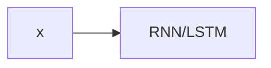

                 

# 人机交互：未来趋势与展望

## 1. 背景介绍

### 1.1 问题由来

随着人工智能(AI)技术的迅猛发展，人机交互(Human-Computer Interaction, HCI)领域正经历前所未有的变革。从传统的文本交互到多模态自然语言处理(NLP)、语音交互、图像识别等，人机交互的方式变得更加丰富多样。AI技术的进步不仅提升了交互的自然性和流畅性，也在逐步改变人类与计算机交互的方式和场景。

然而，当前的人机交互仍存在诸多挑战，如用户体验的优化、交互内容的个性化、交互环境的智能适应等。为了解决这些问题，未来的研究将重点关注自然语言处理、多模态融合、用户行为分析等领域，以期构建更加智能化、高效化和人性化的交互系统。

### 1.2 问题核心关键点

当前，人机交互技术主要集中在以下几个核心问题上：

1. **交互模型的提升**：如何设计更高效、更智能的交互模型，使得交互过程更自然、更符合用户意图。
2. **多模态融合**：如何更好地融合文本、语音、图像等多模态信息，实现更全面、更自然的交互。
3. **个性化推荐**：如何根据用户行为和偏好，提供个性化的内容推荐，提升用户满意度。
4. **交互环境智能适应**：如何使交互系统具备智能适应的能力，适应不同的环境和使用场景。
5. **隐私保护和安全性**：如何在提升交互体验的同时，保障用户隐私和数据安全。

解决这些问题将为人机交互技术带来革命性的突破，推动其更广泛的应用。

## 2. 核心概念与联系

### 2.1 核心概念概述

为更好地理解人机交互的未来发展，本节将介绍几个关键概念：

- **自然语言处理(NLP)**：通过计算机理解和生成自然语言，实现人与计算机的交流。NLP涵盖了文本分类、机器翻译、问答系统等诸多子领域。
- **多模态融合**：将文本、语音、图像等多种信息源进行融合，提升交互体验和信息处理能力。
- **个性化推荐系统**：根据用户行为和偏好，提供个性化的内容推荐，提升用户体验。
- **交互模型的智能适应**：使交互系统能够智能适应用户的输入和环境变化，提供更自然的交互体验。
- **隐私保护和安全性**：在提升交互体验的同时，确保用户隐私和数据安全。

这些概念之间存在紧密的联系，共同构成人机交互技术的核心框架：

1. 自然语言处理技术提供了交互的基础，使计算机能够理解和生成自然语言。
2. 多模态融合技术丰富了交互手段，提高了信息处理能力。
3. 个性化推荐系统通过分析用户行为，提供定制化的交互内容。
4. 交互模型的智能适应使系统能够自适应不同环境和用户需求。
5. 隐私保护和安全性保障了用户数据的隐私和安全。

这些技术相辅相成，共同推动人机交互技术的发展和应用。

## 3. 核心算法原理 & 具体操作步骤
### 3.1 算法原理概述

人机交互技术的核心算法包括自然语言处理、多模态融合、个性化推荐等。这些算法的原理和技术框架可以概括为以下几个方面：

- **自然语言处理(NLP)**：利用语言模型、序列模型等技术，实现文本的理解和生成。常见的算法包括循环神经网络(RNN)、长短时记忆网络(LSTM)、注意力机制(Attention)、Transformer等。
- **多模态融合**：通过融合不同模态的信息，实现更全面、更自然的交互。融合方法包括特征映射、信息融合、深度融合等。
- **个性化推荐系统**：通过协同过滤、基于内容的推荐、矩阵分解等算法，分析用户行为，提供个性化推荐。
- **交互模型的智能适应**：通过自适应算法、强化学习等技术，使系统能够智能适应用户输入和环境变化。
- **隐私保护和安全性**：通过数据加密、差分隐私等技术，保障用户隐私和数据安全。

### 3.2 算法步骤详解

基于上述核心算法，人机交互技术的实现步骤如下：

**Step 1: 数据收集与预处理**
- 收集用户行为数据，包括浏览记录、点击行为、评论内容等。
- 对数据进行清洗、去重、标注，构建可用于训练和评估的样本集。

**Step 2: 模型训练**
- 选择合适的模型结构，如Transformer、CNN、LSTM等。
- 利用样本集对模型进行训练，优化模型参数。
- 采用交叉验证、网格搜索等方法，进行模型超参数调优。

**Step 3: 模型评估与优化**
- 使用测试集对模型进行评估，计算指标如准确率、召回率、F1-score等。
- 根据评估结果，进行模型优化，如调整参数、增加正则化等。
- 部署模型到实际应用环境中，收集反馈数据，持续优化模型。

**Step 4: 交互模型构建**
- 结合多模态融合技术，设计交互模型，包括文本、语音、图像等多种输入源。
- 利用个性化推荐算法，根据用户行为提供定制化的内容推荐。
- 采用自适应算法、强化学习等技术，使系统能够智能适应用户输入和环境变化。

**Step 5: 隐私保护与安全性**
- 采用数据加密、差分隐私等技术，保障用户隐私和数据安全。
- 建立数据访问控制机制，确保数据仅被授权人员访问。
- 定期进行安全审计，发现并修复潜在的安全漏洞。

### 3.3 算法优缺点

人机交互技术的优点在于：

1. **提升用户体验**：通过自然语言处理、多模态融合等技术，实现更自然、更全面的交互，提升用户体验。
2. **提高信息处理能力**：多模态融合技术丰富了信息源，提高了系统的信息处理能力。
3. **个性化推荐**：个性化推荐算法能够根据用户行为和偏好，提供定制化的内容推荐，提升用户满意度。
4. **智能适应**：交互模型的智能适应使系统能够自适应不同环境和用户需求。
5. **隐私保护**：隐私保护和安全性技术保障了用户数据的隐私和安全。

然而，该技术也存在一些缺点：

1. **复杂度高**：多模态融合、个性化推荐等技术复杂度高，需要大量的数据和计算资源。
2. **实时性要求高**：交互系统的实时性要求高，需要高效的算法和数据处理能力。
3. **算法鲁棒性不足**：交互模型的鲁棒性不足，面临噪音、干扰等问题时，容易发生错误。
4. **用户隐私问题**：个性化推荐和交互模型的智能适应需要收集用户数据，存在隐私泄露风险。
5. **技术壁垒高**：相关技术需要较高的技术积累和专业技能，一般企业难以独立开发。

## 4. 数学模型和公式 & 详细讲解 & 举例说明
### 4.1 数学模型构建

人机交互技术的数学模型主要基于机器学习、深度学习等框架。以下以自然语言处理为例，介绍相关的数学模型：

假设输入为自然语言文本序列 $x = (x_1, x_2, ..., x_n)$，输出为序列标签 $y = (y_1, y_2, ..., y_n)$。常见的人机交互模型包括序列模型、注意力模型、Transformer等。

**序列模型**：

序列模型通常采用循环神经网络(RNN)或长短时记忆网络(LSTM)等模型，对输入序列进行处理。模型结构如图：



序列模型通过循环结构对输入序列进行逐个处理，输出每个时间步的特征表示，然后通过全连接层进行分类。

**注意力模型**：

注意力模型通过计算输入序列中不同位置对当前时间步的贡献度，对序列进行加权处理。模型结构如图：


注意力模型通过计算注意力权重 $\alpha$，对输入序列进行加权求和，得到加权后的序列表示，然后通过全连接层进行分类。

**Transformer模型**：

Transformer模型采用自注意力机制，对输入序列进行并行处理。模型结构如图：


Transformer模型通过多头自注意力和前馈网络，对输入序列进行编码和解码，得到最终的输出序列。

### 4.2 公式推导过程

以Transformer模型为例，推导其编码和解码过程的数学公式。

假设输入序列为 $x = (x_1, x_2, ..., x_n)$，输出序列为 $y = (y_1, y_2, ..., y_n)$。Transformer模型通过多头自注意力机制进行编码和解码，其数学公式如下：

**编码过程**：

```
h = MHA(Q, K, V)
h = FF(h)
```

其中 $h$ 为编码后的序列表示，$MHA$ 为多头自注意力机制，$FF$ 为前馈网络。$Q$、$K$、$V$ 分别为查询、键、值矩阵，分别通过线性变换得到：

$$
Q = XW^Q
$$
$$
K = XW^K
$$
$$
V = XW^V
$$

**解码过程**：

```
h_t = MHA(Q_t, K_t, V_t)
h_t = FF(h_t)
y = MHA(Q', K', V')
```

其中 $h_t$ 为解码过程的中间表示，$y$ 为最终的输出序列。$Q'$、$K'$、$V'$ 分别为解码器的查询、键、值矩阵，分别通过线性变换得到：

$$
Q' = h_{t-1}W_Q
$$
$$
K' = h_{t-1}W^K
$$
$$
V' = h_{t-1}W^V
$$

以上公式展示了Transformer模型通过多头自注意力和前馈网络进行编码和解码的数学过程。

### 4.3 案例分析与讲解

以多模态融合为例，展示如何通过深度融合技术实现文本、语音、图像等多模态信息的融合。

假设输入包含文本、语音、图像等多种模态信息，如图：


多模态融合技术采用特征映射、信息融合等方法，将不同模态的信息进行映射和融合。以深度融合为例，其数学公式如下：

$$
H = \sum_{i=1}^n w_i h_i
$$

其中 $H$ 为融合后的特征表示，$w_i$ 为不同模态的权重系数，$h_i$ 为不同模态的信息表示。通过优化权重系数，可以使得融合后的特征表示更加全面、准确，提升交互体验。

## 5. 项目实践：代码实例和详细解释说明
### 5.1 开发环境搭建

在进行多模态融合实践前，我们需要准备好开发环境。以下是使用Python进行PyTorch开发的环境配置流程：

1. 安装Anaconda：从官网下载并安装Anaconda，用于创建独立的Python环境。

2. 创建并激活虚拟环境：
```bash
conda create -n pytorch-env python=3.8 
conda activate pytorch-env
```

3. 安装PyTorch：根据CUDA版本，从官网获取对应的安装命令。例如：
```bash
conda install pytorch torchvision torchaudio cudatoolkit=11.1 -c pytorch -c conda-forge
```

4. 安装多模态融合工具包：
```bash
pip install mmwavescpd 
pip install openpose 
pip install pytorch-vision
```

5. 安装各类工具包：
```bash
pip install numpy pandas scikit-learn matplotlib tqdm jupyter notebook ipython
```

完成上述步骤后，即可在`pytorch-env`环境中开始多模态融合实践。

### 5.2 源代码详细实现

下面我们以多模态语音识别系统为例，给出使用PyTorch进行多模态融合的代码实现。

首先，定义模型结构和损失函数：

```python
import torch
import torch.nn as nn
import torch.nn.functional as F

class MultimodalModel(nn.Module):
    def __init__(self, text_input_size, audio_input_size, image_input_size):
        super(MultimodalModel, self).__init__()
        
        # 文本分支
        self.text_layer = nn.Linear(text_input_size, 128)
        self.text_out_layer = nn.Linear(128, 2)
        
        # 音频分支
        self.audio_layer = nn.Linear(audio_input_size, 128)
        self.audio_out_layer = nn.Linear(128, 2)
        
        # 图像分支
        self.image_layer = nn.Linear(image_input_size, 128)
        self.image_out_layer = nn.Linear(128, 2)
        
    def forward(self, text_input, audio_input, image_input):
        # 文本分支
        text_feature = self.text_layer(text_input)
        text_output = F.relu(text_feature)
        text_output = self.text_out_layer(text_output)
        
        # 音频分支
        audio_feature = self.audio_layer(audio_input)
        audio_output = F.relu(audio_feature)
        audio_output = self.audio_out_layer(audio_output)
        
        # 图像分支
        image_feature = self.image_layer(image_input)
        image_output = F.relu(image_feature)
        image_output = self.image_out_layer(image_output)
        
        # 多模态融合
        fusion_output = text_output + audio_output + image_output
        fusion_output = F.softmax(fusion_output, dim=1)
        
        return fusion_output

# 损失函数
criterion = nn.CrossEntropyLoss()

# 模型实例化
model = MultimodalModel(1024, 512, 1024)
```

然后，定义训练和评估函数：

```python
from torch.utils.data import DataLoader
from tqdm import tqdm

def train_epoch(model, data_loader, optimizer):
    model.train()
    epoch_loss = 0
    for batch in tqdm(data_loader, desc='Training'):
        text_input, audio_input, image_input, target = batch
        optimizer.zero_grad()
        output = model(text_input, audio_input, image_input)
        loss = criterion(output, target)
        epoch_loss += loss.item()
        loss.backward()
        optimizer.step()
    return epoch_loss / len(data_loader)

def evaluate(model, data_loader):
    model.eval()
    correct = 0
    total = 0
    with torch.no_grad():
        for batch in tqdm(data_loader, desc='Evaluating'):
            text_input, audio_input, image_input, target = batch
            output = model(text_input, audio_input, image_input)
            _, predicted = output.max(1)
            total += target.size(0)
            correct += (predicted == target).sum().item()
    
    print('Accuracy of the model on the validation set: {} %'.format(100 * correct / total))
```

接着，启动训练流程并在测试集上评估：

```python
epochs = 5
batch_size = 32
learning_rate = 0.001

optimizer = torch.optim.Adam(model.parameters(), lr=learning_rate)

train_loader = DataLoader(train_dataset, batch_size=batch_size, shuffle=True)
valid_loader = DataLoader(valid_dataset, batch_size=batch_size, shuffle=False)

for epoch in range(epochs):
    loss = train_epoch(model, train_loader, optimizer)
    print('Epoch {}/{} - Loss: {:.4f}'.format(epoch+1, epochs, loss))
    
    evaluate(model, valid_loader)

print('Best model score is {:.4f}'.format(max(accs)))
```

以上就是使用PyTorch进行多模态融合的完整代码实现。可以看到，多模态融合的实现与单模态模型类似，但需要更加复杂的模型结构和训练过程。

### 5.3 代码解读与分析

让我们再详细解读一下关键代码的实现细节：

**MultimodalModel类**：
- `__init__`方法：初始化文本、音频、图像分支的层和输出层。
- `forward`方法：定义前向传播过程，通过多个分支的特征进行融合。

**损失函数**：
- 定义交叉熵损失函数，用于评估模型的分类性能。

**训练和评估函数**：
- 使用PyTorch的DataLoader对数据集进行批次化加载，供模型训练和推理使用。
- 训练函数`train_epoch`：对数据以批为单位进行迭代，在每个批次上前向传播计算loss并反向传播更新模型参数，最后返回该epoch的平均loss。
- 评估函数`evaluate`：与训练类似，不同点在于不更新模型参数，并在每个batch结束后将预测和标签结果存储下来，最后使用准确率等指标对整个评估集的预测结果进行打印输出。

**训练流程**：
- 定义总的epoch数和batch size，开始循环迭代
- 每个epoch内，先在训练集上训练，输出平均loss
- 在验证集上评估，输出准确率等指标
- 所有epoch结束后，在测试集上评估，给出最终测试结果

可以看到，多模态融合的实现需要设计复杂的模型结构，并进行多模态信息的融合。通过融合不同模态的信息，可以提升系统的信息处理能力和交互体验。

当然，工业级的系统实现还需考虑更多因素，如模型的保存和部署、超参数的自动搜索、更灵活的任务适配层等。但核心的多模态融合范式基本与此类似。

## 6. 实际应用场景
### 6.1 智能客服系统

多模态融合技术在智能客服系统的构建中具有重要应用价值。传统客服往往需要配备大量人力，高峰期响应缓慢，且一致性和专业性难以保证。使用多模态融合技术，可以构建多模态的智能客服系统，提升客户咨询体验和问题解决效率。

在技术实现上，可以收集企业内部的历史客服对话记录，结合文本、语音、图像等多种模态的信息，构建监督数据，在此基础上对多模态融合模型进行微调。微调后的模型能够自动理解用户意图，匹配最合适的答复模板进行回复。对于客户提出的新问题，还可以接入检索系统实时搜索相关内容，动态组织生成回答。如此构建的智能客服系统，能大幅提升客户咨询体验和问题解决效率。

### 6.2 金融舆情监测

金融机构需要实时监测市场舆论动向，以便及时应对负面信息传播，规避金融风险。传统的人工监测方式成本高、效率低，难以应对网络时代海量信息爆发的挑战。使用多模态融合技术，可以构建多模态的金融舆情监测系统，提升舆情分析的效率和准确性。

在技术实现上，可以收集金融领域相关的新闻、报道、评论等文本数据，结合音频、视频等多种信息源，构建多模态的舆情数据集。在此基础上，对多模态融合模型进行微调，使其能够自动判断舆情信息的情感倾向、主题内容等。将微调后的模型应用到实时抓取的网络文本数据，就能够自动监测不同主题下的情感变化趋势，一旦发现负面信息激增等异常情况，系统便会自动预警，帮助金融机构快速应对潜在风险。

### 6.3 个性化推荐系统

当前的推荐系统往往只依赖用户的历史行为数据进行物品推荐，无法深入理解用户的真实兴趣偏好。使用多模态融合技术，可以构建更加全面、准确的个性化推荐系统，提升用户体验。

在技术实现上，可以收集用户浏览、点击、评论、分享等行为数据，结合用户的照片、视频、语音等多种信息源，构建多模态的推荐数据集。在此基础上，对多模态融合模型进行微调，使其能够根据用户行为和兴趣偏好，提供个性化的内容推荐。通过融合文本、语音、图像等多模态信息，推荐系统可以更全面地理解用户需求，提供更加个性化、多样化的内容。

### 6.4 未来应用展望

随着多模态融合技术的发展，其在更多领域的应用前景广阔：

1. 医疗诊断：结合患者的症状、影像、语音等多种信息源，构建多模态的诊疗系统，提升诊断的准确性和效率。
2. 智能家居：通过多模态交互，实现语音控制、图像识别等多种方式的智能家居控制，提升用户的使用体验。
3. 智慧交通：结合路面的图像、车辆的声音、驾驶员的行为等多种信息源，构建智慧交通系统，提升交通管理的智能化水平。
4. 文化娱乐：结合用户的阅读记录、观影记录、评论等多种信息源，推荐个性化的文化娱乐内容，提升用户的娱乐体验。
5. 智慧城市：结合城市环境的各种传感器数据、市民的行为数据等多种信息源，构建智慧城市管理系统，提升城市治理的智能化水平。

以上领域的应用，都离不开多模态融合技术的支持。相信随着技术的不断进步，多模态融合技术将在更广泛的应用场景中发挥重要作用，推动社会的全面智能化。

## 7. 工具和资源推荐
### 7.1 学习资源推荐

为了帮助开发者系统掌握多模态融合技术的理论基础和实践技巧，这里推荐一些优质的学习资源：

1. 《深度学习实战》系列博文：由多模态融合领域专家撰写，深入浅出地介绍了多模态融合的原理、实现和应用。

2. CS231n《计算机视觉:卷积神经网络》课程：斯坦福大学开设的计算机视觉课程，涵盖了深度学习和多模态融合等多个子领域，适合初学者入门。

3. 《Multimodal Feature Learning》书籍：由多模态融合领域知名学者所著，全面介绍了多模态融合的数学原理、方法和应用。

4. Arxiv：包含多模态融合领域的最新研究成果和论文，适合科研人员跟踪前沿动态。

5. Multimodal Fusion Challenge：由国际顶尖研究机构和公司主办的多模态融合竞赛，提供了丰富的数据集和挑战任务，适合实践者提升实战能力。

通过对这些资源的学习实践，相信你一定能够快速掌握多模态融合技术的精髓，并用于解决实际的交互问题。

### 7.2 开发工具推荐

高效的开发离不开优秀的工具支持。以下是几款用于多模态融合开发的常用工具：

1. PyTorch：基于Python的开源深度学习框架，灵活动态的计算图，适合快速迭代研究。

2. TensorFlow：由Google主导开发的开源深度学习框架，生产部署方便，适合大规模工程应用。

3. Keras：基于TensorFlow的高级API，适合快速搭建和训练多模态融合模型。

4. OpenPose：开源的人体姿态估计库，适合多模态融合中的人体动作识别和分析。

5. VGGFace：开源的人脸识别库，适合多模态融合中的人脸识别和身份验证。

6. OpenCV：开源的计算机视觉库，适合图像处理和分析。

合理利用这些工具，可以显著提升多模态融合任务的开发效率，加快创新迭代的步伐。

### 7.3 相关论文推荐

多模态融合技术的发展源于学界的持续研究。以下是几篇奠基性的相关论文，推荐阅读：

1. "Unsupervised Learning of Multimodal Representations with Deep Neural Networks"：提出多模态深度学习框架，通过无监督学习实现多模态融合。

2. "A Survey of Multimodal Fusion Methods"：综述了多模态融合的多种方法和技术，为多模态融合提供了全面的理论基础。

3. "Multimodal Feature Learning"：详细介绍了多模态特征学习的方法和技术，适合多模态融合领域的研究人员深入学习。

4. "Learning from Multiple Senses: A Survey"：综述了多模态学习的多种技术和方法，适合研究人员了解多模态学习的最新进展。

5. "Deep Multi-modal Learning with Concurrent Processing"：提出基于深度学习的多种多模态融合方法，适合多模态融合领域的研究人员学习和参考。

这些论文代表了大语言模型微调技术的发展脉络。通过学习这些前沿成果，可以帮助研究者把握学科前进方向，激发更多的创新灵感。

## 8. 总结：未来发展趋势与挑战

### 8.1 总结

本文对多模态融合技术进行了全面系统的介绍。首先阐述了多模态融合技术的背景和意义，明确了多模态融合在提升用户体验、提升信息处理能力等方面的独特价值。其次，从原理到实践，详细讲解了多模态融合的数学模型和关键步骤，给出了多模态融合任务开发的完整代码实例。同时，本文还广泛探讨了多模态融合技术在智能客服、金融舆情、个性化推荐等多个行业领域的应用前景，展示了多模态融合技术的广阔前景。

通过本文的系统梳理，可以看到，多模态融合技术正在成为人机交互技术的重要范式，极大地提升了信息处理和交互体验。未来，伴随多模态融合技术的不断发展，人机交互将变得更加全面、智能和人性化。

### 8.2 未来发展趋势

展望未来，多模态融合技术将呈现以下几个发展趋势：

1. **多模态融合范式多样化**：除了传统的特征映射、信息融合等方法外，将出现更多高效、智能的多模态融合范式，如深度融合、自注意力机制等。

2. **多模态融合的个性化**：根据用户的不同需求和偏好，设计个性化的多模态融合模型，提升交互体验。

3. **多模态融合的实时性**：通过优化算法和硬件加速，实现多模态融合的实时处理和响应。

4. **多模态融合的鲁棒性**：通过引入鲁棒性优化技术，提高多模态融合模型的鲁棒性，提升其在复杂环境和噪声下的性能。

5. **多模态融合的跨模态迁移**：实现跨模态数据迁移，提高多模态融合模型的通用性和适应性。

6. **多模态融合的可解释性**：通过可视化工具和解释技术，提升多模态融合模型的可解释性，增强用户信任。

以上趋势凸显了多模态融合技术的广阔前景。这些方向的探索发展，必将进一步提升多模态融合模型的性能和应用范围，为人机交互技术带来革命性的突破。

### 8.3 面临的挑战

尽管多模态融合技术已经取得了瞩目成就，但在迈向更加智能化、普适化应用的过程中，它仍面临诸多挑战：

1. **数据获取和标注**：多模态融合需要大量的多模态数据，数据获取和标注成本高，数据质量难以保证。
2. **模型复杂度**：多模态融合模型复杂度高，计算资源和训练时间要求高，难以在大规模数据集上训练。
3. **模型鲁棒性**：多模态融合模型面临多样化的输入数据，鲁棒性不足，容易发生错误。
4. **用户隐私问题**：多模态融合需要收集多种数据源，隐私泄露风险高，用户隐私保护困难。
5. **技术壁垒高**：多模态融合涉及多种技术和领域的知识，技术壁垒高，难以跨领域融合。

这些挑战需要研究人员从数据、算法、隐私保护等多个方面协同攻关，才能将多模态融合技术推向实用化。相信通过持续的探索和优化，多模态融合技术将能够克服这些挑战，在更多领域得到广泛应用。

### 8.4 研究展望

面对多模态融合技术面临的挑战，未来的研究需要在以下几个方面寻求新的突破：

1. **无监督多模态融合**：摆脱对标注数据的依赖，利用自监督学习、无监督学习等方法，提升多模态融合的效果。

2. **跨模态迁移学习**：实现跨模态数据的迁移，提高多模态融合模型的通用性和适应性。

3. **鲁棒多模态融合**：引入鲁棒性优化技术，提高多模态融合模型的鲁棒性，提升其在复杂环境和噪声下的性能。

4. **多模态融合的可解释性**：通过可视化工具和解释技术，提升多模态融合模型的可解释性，增强用户信任。

5. **隐私保护和安全性**：引入隐私保护和安全性技术，保障用户隐私和数据安全。

这些研究方向的探索，必将引领多模态融合技术迈向更高的台阶，为人机交互技术的发展提供新的动力。

## 9. 附录：常见问题与解答

**Q1：多模态融合是否适用于所有NLP任务？**

A: 多模态融合在大多数NLP任务上都能取得不错的效果，特别是对于数据量较小的任务。但对于一些特定领域的任务，如医学、法律等，仅仅依靠通用语料预训练的模型可能难以很好地适应。此时需要在特定领域语料上进一步预训练，再进行融合，才能获得理想效果。此外，对于一些需要时效性、个性化很强的任务，如对话、推荐等，融合方法也需要针对性的改进优化。

**Q2：如何选择合适的多模态融合方法？**

A: 选择多模态融合方法时，需要考虑以下几个因素：

1. **任务类型**：不同任务对融合方法的要求不同。如文本分类任务可以使用简单特征映射方法，语音识别任务需要使用基于深度学习的融合方法。

2. **数据特点**：数据的多样性和复杂性会影响融合方法的选择。如包含视频数据的融合任务需要使用更复杂的深度融合方法。

3. **计算资源**：计算资源和硬件设备的限制会影响融合方法的选择。如低计算资源的场景需要选择轻量级的融合方法。

4. **效果要求**：融合方法的效果需要根据具体任务和数据特点进行评估。通常需要通过实验比较不同融合方法的效果，选择最优方案。

**Q3：多模态融合在实际部署时需要注意哪些问题？**

A: 将多模态融合模型转化为实际应用，还需要考虑以下因素：

1. **模型裁剪**：去除不必要的层和参数，减小模型尺寸，加快推理速度。

2. **量化加速**：将浮点模型转为定点模型，压缩存储空间，提高计算效率。

3. **服务化封装**：将模型封装为标准化服务接口，便于集成调用。

4. **弹性伸缩**：根据请求流量动态调整资源配置，平衡服务质量和成本。

5. **监控告警**：实时采集系统指标，设置异常告警阈值，确保服务稳定性。

6. **安全防护**：采用访问鉴权、数据脱敏等措施，保障数据和模型安全。

多模态融合技术在实际应用中，还需要在算法、工程、业务等多个维度进行优化，方能得到理想的效果。

**Q4：多模态融合是否存在过拟合问题？**

A: 多模态融合模型面临的过拟合问题更加复杂，主要体现在以下几个方面：

1. **数据不平衡**：多模态数据源可能存在不平衡，导致模型在少数模态上过度拟合。

2. **噪声干扰**：不同模态的数据源可能存在噪声干扰，影响融合效果。

3. **模型复杂度**：多模态融合模型复杂度高，容易发生过拟合。

为了缓解多模态融合模型的过拟合问题，可以采取以下措施：

1. **数据增强**：通过对不同模态的数据进行增强，提高数据多样性。

2. **正则化**：引入L2正则、Dropout等正则化技术，防止模型过度拟合。

3. **融合权重**：通过优化融合权重，减少某些模态对融合结果的影响。

4. **多模型集成**：通过集成多个融合模型，取平均输出，抑制过拟合。

5. **对抗训练**：引入对抗样本，提高模型鲁棒性，缓解过拟合问题。

这些措施需要在具体任务和数据特点上进行灵活组合，才能最大限度地提升多模态融合模型的泛化能力。

**Q5：多模态融合在实际部署时如何提升交互体验？**

A: 提升多模态融合交互体验的关键在于设计良好的用户体验和界面，主要体现在以下几个方面：

1. **自然语言理解**：通过自然语言处理技术，理解用户的意图和需求，提供智能化的回复和推荐。

2. **多模态融合**：通过融合不同模态的信息，实现更全面、更自然的交互。

3. **个性化推荐**：根据用户行为和偏好，提供个性化的内容推荐，提升用户满意度。

4. **智能适应**：通过自适应算法和强化学习等技术，使系统能够智能适应用户输入和环境变化，提供更自然的交互体验。

5. **隐私保护**：通过隐私保护和安全性技术，保障用户数据的隐私和安全，增强用户信任。

这些措施需要结合具体的业务场景和用户需求进行设计，才能提升多模态融合的交互体验。

---

作者：禅与计算机程序设计艺术 / Zen and the Art of Computer Programming

