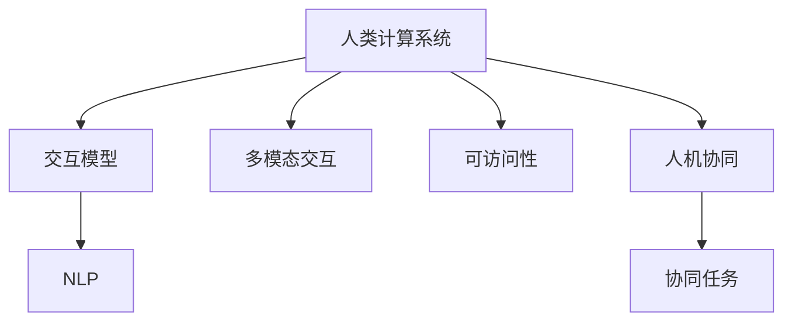

                 

# 人机交互：设计有效的人类计算系统

## 1. 背景介绍

### 1.1 问题由来
随着计算机技术的飞速发展，人机交互（Human-Computer Interaction, HCI）已经从早期的图形界面（GUI）、鼠标键盘等硬件交互方式，发展到更为复杂、智能的交互方式，如语音识别、手势控制、虚拟现实等。这些交互方式极大地提升了用户的操作体验，但也带来了新的挑战和问题。

在过去的几十年里，人机交互经历了从命令行界面到图形界面的变革，带来了视觉和触觉的直观交互方式。然而，随着移动互联网的普及和人工智能的崛起，对于人机交互的智能化和自然化提出了更高的要求。如何让计算机更好地理解和响应用户的指令，成为了当前HCI研究的热点问题。

### 1.2 问题核心关键点
当前人机交互面临的核心问题主要包括：

- **自然化交互**：如何让计算机更好地理解和响应用户的自然语言、手势等自然交互方式。
- **多模态融合**：如何将视觉、听觉、触觉等多模态信息整合，提升用户的操作体验。
- **个性化定制**：如何根据用户习惯、偏好等个性化因素定制交互界面和操作逻辑。
- **鲁棒性**：如何设计鲁棒的交互系统，避免因噪音、用户疲劳等原因导致系统出错。
- **可访问性**：如何设计可访问性强的交互系统，使得残障用户也能方便地使用。
- **安全性**：如何确保用户数据的安全，避免因交互过程中的信息泄露。

解决这些问题需要设计者具备深入的技术知识、用户心理学的理解，以及跨学科的综合能力。

### 1.3 问题研究意义
研究有效的人类计算系统，对于提升人机交互体验，推动人工智能技术在各个领域的应用，具有重要意义：

- **提升用户体验**：通过自然化、智能化的交互方式，让用户更加便捷、高效地使用计算机。
- **推动技术应用**：促进人工智能技术在医疗、教育、金融等行业的应用，提升行业效率。
- **促进跨学科发展**：人机交互涉及心理学、计算机科学、设计学等多个学科，其研究能够促进学科间的交流和合作。
- **社会效益**：设计出可访问性强的交互系统，能够帮助残障用户更好地融入社会，提升社会包容性。

## 2. 核心概念与联系

### 2.1 核心概念概述

为了更好地理解人机交互的原理和设计，本节将介绍几个核心概念：

- **人类计算系统（Human-Computer Systems）**：指由人类和计算机共同完成计算任务的交互系统。
- **交互模型（Interaction Models）**：描述用户如何与计算机进行交互，以及计算机如何响应用户交互的模型。
- **多模态交互（Multimodal Interaction）**：指同时使用视觉、听觉、触觉等多种交互方式的系统，如语音识别、手势控制等。
- **自然语言处理（Natural Language Processing, NLP）**：涉及计算机理解和生成人类语言的技术，是实现自然化交互的重要手段。
- **可访问性（Accessibility）**：指交互系统能够满足残障用户使用需求的特性，包括视觉、听觉、运动等多方面的考虑。
- **人机协同（Human-Computer Collaboration）**：指计算机和人类在任务执行过程中相互协作、互相支持的关系。

这些核心概念之间的逻辑关系可以通过以下Mermaid流程图来展示：



这个流程图展示了一幅交互系统的全貌：

1. **人类计算系统**：用户和计算机共同构成的计算系统。
2. **交互模型**：系统内部用于描述用户和计算机交互的逻辑模型。
3. **多模态交互**：系统支持的多种交互方式。
4. **自然语言处理**：实现自然化交互的核心技术之一。
5. **可访问性**：确保残障用户也能方便使用系统的特性。
6. **人机协同**：计算机和人类在任务执行中的协作关系。

这些概念共同构成了人机交互系统的框架，为人机交互的设计和实现提供了基础。

## 3. 核心算法原理 & 具体操作步骤

### 3.1 算法原理概述

人机交互的设计涉及多个层面的算法和策略，包括但不限于：

- **自然语言理解**：通过NLP技术，让计算机能够理解和生成自然语言，实现与用户的自然交互。
- **语音识别与合成**：利用语音识别技术将用户的语音转换为文本，或利用语音合成技术生成自然语音输出。
- **手势控制与体感交互**：通过摄像头、传感器等设备，捕捉用户的手势动作，进行相应的交互操作。
- **多模态融合**：将视觉、听觉、触觉等不同模态的信息融合，提升系统的理解和响应能力。
- **个性化交互**：根据用户的行为、偏好等个性化因素，定制化的交互界面和逻辑。

这些算法和策略的实现，需要综合考虑用户体验、技术实现和系统设计等多个方面。

### 3.2 算法步骤详解

人机交互系统的设计通常包括以下几个关键步骤：

**Step 1: 需求分析与设计**
- 收集用户需求和行为数据，分析用户的需求和使用场景。
- 设计符合用户需求的人机交互界面和操作逻辑。
- 选择合适的技术和工具，制定详细的设计方案。

**Step 2: 技术实现**
- 根据设计方案，选择合适的技术栈和开发工具，实现交互界面和功能。
- 利用NLP、语音识别等技术，实现自然化交互功能。
- 实现多模态信息融合，提升系统的理解和响应能力。

**Step 3: 系统测试与优化**
- 对系统进行全面的测试，确保各模块的功能和性能。
- 收集用户反馈，进行系统的优化和改进。
- 设计用户界面，提高系统的可用性和用户体验。

**Step 4: 上线部署与维护**
- 将系统部署到生产环境，进行持续的监控和维护。
- 收集用户使用数据，进行系统的迭代和优化。
- 根据用户反馈和市场需求，进行功能的扩展和改进。

### 3.3 算法优缺点

人机交互系统的设计具有以下优点：

- **用户体验提升**：通过自然化、智能化的交互方式，提升用户的操作便捷性和效率。
- **技术应用广泛**：适用于医疗、教育、金融等多个领域，推动行业的发展和创新。
- **跨学科协作**：需要心理学、设计学等多学科的协作，促进学科间的交流和合作。
- **社会效益显著**：通过可访问性强的交互系统，帮助残障用户更好地融入社会，提升社会包容性。

同时，这些系统也存在以下局限性：

- **技术难度高**：涉及多学科的知识和技术，设计和实现难度较大。
- **资源需求大**：需要高性能的硬件设备和技术支持，开发和维护成本较高。
- **用户体验差异**：不同用户群体的需求和习惯差异较大，设计和实现需要充分考虑多样性。

尽管如此，人机交互技术仍在不断进步，推动着人工智能技术在各个领域的应用和发展。

### 3.4 算法应用领域

人机交互技术已经广泛应用于多个领域，例如：

- **医疗健康**：利用语音识别和自然语言处理技术，实现电子病历、医生助手等功能，提升医疗服务的效率和质量。
- **教育培训**：通过智能答疑系统、虚拟实验室等交互方式，提升教学效果和学生的学习体验。
- **金融服务**：利用自然语言处理和语音识别技术，实现智能客服、语音指令操作等功能，提升客户体验。
- **智能家居**：通过语音控制、手势识别等交互方式，实现家电的智能控制和家居管理。
- **虚拟现实**：利用多模态交互技术，实现虚拟现实环境的沉浸式体验。
- **增强现实**：通过手势控制、体感交互等技术，实现与虚拟世界的互动和交互。

这些领域的应用展示了人机交互技术的广泛前景和重要价值。

## 4. 数学模型和公式 & 详细讲解 & 举例说明

### 4.1 数学模型构建

在本节中，我们将使用数学语言对一些核心算法进行更加严格的刻画。

假设有一个交互系统，用户通过输入自然语言进行交互，系统根据语言指令执行相应的操作。假设系统的输入为自然语言 $x$，输出为系统执行的操作 $y$，则系统的交互模型可以表示为：

$$ y = f(x) $$

其中 $f$ 为系统的交互函数，将输入 $x$ 映射到输出 $y$。

假设 $x$ 和 $y$ 都是离散的状态，可以使用计数变量和状态转移图来描述系统的行为。例如，用户输入 "搜索" 时，系统执行 "启动搜索" 操作，可以表示为：

```plaintext
  搜索
  ↓
启动搜索
```

在实际系统中，用户输入的 $x$ 通常是非离散的，需要将其转换为离散的形式，才能使用上述模型。例如，用户输入 "我想搜索张三的个人信息"，可以转换为状态 "搜索 张三 个人信息"，表示用户想要执行 "搜索" 操作，且搜索目标是 "张三"，查询内容为 "个人信息"。

### 4.2 公式推导过程

在本节中，我们将推导一些基本的数学公式，用于描述和计算人机交互系统中的关键参数。

**用户输入和系统输出的概率分布**：
假设用户输入 $x$ 和系统输出 $y$ 的概率分布分别为 $P(x)$ 和 $P(y|x)$，则系统的整体概率分布 $P(y)$ 可以表示为：

$$ P(y) = \sum_{x} P(x)P(y|x) $$

**系统的信息熵**：
系统的信息熵 $H(y)$ 表示系统的输出 $y$ 的不确定性，可以用于衡量系统的复杂度。信息熵的定义为：

$$ H(y) = -\sum_{y} P(y)\log P(y) $$

**系统的条件熵**：
系统的条件熵 $H(y|x)$ 表示在已知输入 $x$ 的情况下，系统输出 $y$ 的不确定性。条件熵的定义为：

$$ H(y|x) = -\sum_{y} P(y|x)\log P(y|x) $$

**系统的互信息**：
系统的互信息 $I(x;y)$ 表示输入 $x$ 和输出 $y$ 之间的相关性，可以用于衡量系统的预测能力。互信息定义为：

$$ I(x;y) = H(y) - H(y|x) $$

这些公式为我们提供了描述和计算人机交互系统行为的基础数学工具。

### 4.3 案例分析与讲解

下面我们以智能客服系统为例，展示如何应用上述数学模型和公式。

假设智能客服系统支持以下操作：
- 搜索：输入 "搜索 x"，执行 "启动搜索 x" 操作。
- 查询：输入 "查询 x"，执行 "启动查询 x" 操作。
- 帮助：输入 "帮助 x"，执行 "提供帮助 x" 操作。

假设用户的输入和系统操作都是离散的状态，且概率分布已知。例如，用户输入 "搜索 张三 个人信息" 的概率为 $P(\text{搜索 张三 个人信息}) = 0.2$，执行 "启动搜索 张三 个人信息" 操作的概率为 $P(\text{启动搜索 张三 个人信息}| \text{搜索 张三 个人信息}) = 0.9$。

根据上述模型，我们可以计算系统的整体概率分布 $P(y)$、系统的信息熵 $H(y)$、系统的条件熵 $H(y|x)$、系统的互信息 $I(x;y)$ 等参数，用于衡量系统的性能和复杂度。

通过这些分析，我们可以发现系统在某些操作上的不确定性较高，可能需要进一步优化和改进。

## 5. 项目实践：代码实例和详细解释说明

### 5.1 开发环境搭建

在进行人机交互系统的开发前，我们需要准备好开发环境。以下是使用Python进行PyTorch开发的环境配置流程：

1. 安装Anaconda：从官网下载并安装Anaconda，用于创建独立的Python环境。

2. 创建并激活虚拟环境：
```bash
conda create -n pytorch-env python=3.8 
conda activate pytorch-env
```

3. 安装PyTorch：根据CUDA版本，从官网获取对应的安装命令。例如：
```bash
conda install pytorch torchvision torchaudio cudatoolkit=11.1 -c pytorch -c conda-forge
```

4. 安装TensorFlow：
```bash
conda install tensorflow
```

5. 安装各类工具包：
```bash
pip install numpy pandas scikit-learn matplotlib tqdm jupyter notebook ipython
```

完成上述步骤后，即可在`pytorch-env`环境中开始人机交互系统的开发。

### 5.2 源代码详细实现

下面我们以智能客服系统为例，给出使用PyTorch进行智能客服系统开发的PyTorch代码实现。

首先，定义智能客服系统的数据处理函数：

```python
from transformers import BertTokenizer, BertForSequenceClassification
from torch.utils.data import Dataset
import torch

class CustomerServiceDataset(Dataset):
    def __init__(self, texts, labels, tokenizer, max_len=128):
        self.texts = texts
        self.labels = labels
        self.tokenizer = tokenizer
        self.max_len = max_len
        
    def __len__(self):
        return len(self.texts)
    
    def __getitem__(self, item):
        text = self.texts[item]
        label = self.labels[item]
        
        encoding = self.tokenizer(text, return_tensors='pt', max_length=self.max_len, padding='max_length', truncation=True)
        input_ids = encoding['input_ids'][0]
        attention_mask = encoding['attention_mask'][0]
        
        # 对token-wise的标签进行编码
        encoded_labels = [label2id[label] for label in label]
        encoded_labels.extend([label2id['O']] * (self.max_len - len(encoded_labels)))
        labels = torch.tensor(encoded_labels, dtype=torch.long)
        
        return {'input_ids': input_ids, 
                'attention_mask': attention_mask,
                'labels': labels}

# 标签与id的映射
label2id = {'O': 0, 'Search': 1, 'Query': 2, 'Help': 3}
id2label = {v: k for k, v in label2id.items()}

# 创建dataset
tokenizer = BertTokenizer.from_pretrained('bert-base-cased')

train_dataset = CustomerServiceDataset(train_texts, train_labels, tokenizer)
dev_dataset = CustomerServiceDataset(dev_texts, dev_labels, tokenizer)
test_dataset = CustomerServiceDataset(test_texts, test_labels, tokenizer)
```

然后，定义模型和优化器：

```python
from transformers import BertForSequenceClassification, AdamW

model = BertForSequenceClassification.from_pretrained('bert-base-cased', num_labels=len(label2id))

optimizer = AdamW(model.parameters(), lr=2e-5)
```

接着，定义训练和评估函数：

```python
from torch.utils.data import DataLoader
from tqdm import tqdm
from sklearn.metrics import classification_report

device = torch.device('cuda') if torch.cuda.is_available() else torch.device('cpu')
model.to(device)

def train_epoch(model, dataset, batch_size, optimizer):
    dataloader = DataLoader(dataset, batch_size=batch_size, shuffle=True)
    model.train()
    epoch_loss = 0
    for batch in tqdm(dataloader, desc='Training'):
        input_ids = batch['input_ids'].to(device)
        attention_mask = batch['attention_mask'].to(device)
        labels = batch['labels'].to(device)
        model.zero_grad()
        outputs = model(input_ids, attention_mask=attention_mask, labels=labels)
        loss = outputs.loss
        epoch_loss += loss.item()
        loss.backward()
        optimizer.step()
    return epoch_loss / len(dataloader)

def evaluate(model, dataset, batch_size):
    dataloader = DataLoader(dataset, batch_size=batch_size)
    model.eval()
    preds, labels = [], []
    with torch.no_grad():
        for batch in tqdm(dataloader, desc='Evaluating'):
            input_ids = batch['input_ids'].to(device)
            attention_mask = batch['attention_mask'].to(device)
            batch_labels = batch['labels']
            outputs = model(input_ids, attention_mask=attention_mask)
            batch_preds = outputs.logits.argmax(dim=2).to('cpu').tolist()
            batch_labels = batch_labels.to('cpu').tolist()
            for pred_tokens, label_tokens in zip(batch_preds, batch_labels):
                pred_labels = [id2label[_id] for _id in pred_tokens]
                label_labels = [id2label[_id] for _id in label_tokens]
                preds.append(pred_labels[:len(label_labels)])
                labels.append(label_labels)
                
    print(classification_report(labels, preds))
```

最后，启动训练流程并在测试集上评估：

```python
epochs = 5
batch_size = 16

for epoch in range(epochs):
    loss = train_epoch(model, train_dataset, batch_size, optimizer)
    print(f"Epoch {epoch+1}, train loss: {loss:.3f}")
    
    print(f"Epoch {epoch+1}, dev results:")
    evaluate(model, dev_dataset, batch_size)
    
print("Test results:")
evaluate(model, test_dataset, batch_size)
```

以上就是使用PyTorch对智能客服系统进行开发的完整代码实现。可以看到，得益于Transformers库的强大封装，我们可以用相对简洁的代码完成BERT模型的加载和微调。

### 5.3 代码解读与分析

让我们再详细解读一下关键代码的实现细节：

**CustomerServiceDataset类**：
- `__init__`方法：初始化文本、标签、分词器等关键组件。
- `__len__`方法：返回数据集的样本数量。
- `__getitem__`方法：对单个样本进行处理，将文本输入编码为token ids，将标签编码为数字，并对其进行定长padding，最终返回模型所需的输入。

**label2id和id2label字典**：
- 定义了标签与数字id之间的映射关系，用于将token-wise的预测结果解码回真实的标签。

**训练和评估函数**：
- 使用PyTorch的DataLoader对数据集进行批次化加载，供模型训练和推理使用。
- 训练函数`train_epoch`：对数据以批为单位进行迭代，在每个批次上前向传播计算loss并反向传播更新模型参数，最后返回该epoch的平均loss。
- 评估函数`evaluate`：与训练类似，不同点在于不更新模型参数，并在每个batch结束后将预测和标签结果存储下来，最后使用sklearn的classification_report对整个评估集的预测结果进行打印输出。

**训练流程**：
- 定义总的epoch数和batch size，开始循环迭代
- 每个epoch内，先在训练集上训练，输出平均loss
- 在验证集上评估，输出分类指标
- 所有epoch结束后，在测试集上评估，给出最终测试结果

可以看到，PyTorch配合Transformers库使得智能客服系统的开发变得简洁高效。开发者可以将更多精力放在数据处理、模型改进等高层逻辑上，而不必过多关注底层的实现细节。

当然，工业级的系统实现还需考虑更多因素，如模型的保存和部署、超参数的自动搜索、更灵活的任务适配层等。但核心的交互范式基本与此类似。

## 6. 实际应用场景
### 6.1 智能客服系统

基于人机交互技术的智能客服系统，可以广泛应用于各类企业服务中，如银行、电商、保险等。传统客服往往需要配备大量人力，高峰期响应缓慢，且一致性和专业性难以保证。而使用基于自然语言处理和深度学习技术的智能客服系统，可以7x24小时不间断服务，快速响应客户咨询，用自然流畅的语言解答各类常见问题。

在技术实现上，可以收集企业内部的历史客服对话记录，将问题和最佳答复构建成监督数据，在此基础上对预训练语言模型进行微调。微调后的对话模型能够自动理解用户意图，匹配最合适的答案模板进行回复。对于客户提出的新问题，还可以接入检索系统实时搜索相关内容，动态组织生成回答。如此构建的智能客服系统，能大幅提升客户咨询体验和问题解决效率。

### 6.2 金融舆情监测

金融机构需要实时监测市场舆论动向，以便及时应对负面信息传播，规避金融风险。传统的人工监测方式成本高、效率低，难以应对网络时代海量信息爆发的挑战。基于人机交互技术的多模态舆情监测系统，能够实时抓取网络文本数据，自动判断文本属于何种主题，情感倾向是正面、中性还是负面。将监测结果实时推送给决策层，及时发现并应对潜在风险。

在技术实现上，可以构建一个多模态的舆情监测系统，集成了自然语言处理、情感分析、语音识别等多项技术，实现对网络文本数据的实时抓取和分析。系统能够自动识别舆情热点，进行情绪分类，生成舆情报告，帮助金融机构快速做出决策。

### 6.3 个性化推荐系统

当前的推荐系统往往只依赖用户的历史行为数据进行物品推荐，无法深入理解用户的真实兴趣偏好。基于人机交互技术的个性化推荐系统，可以更好地挖掘用户行为背后的语义信息，从而提供更精准、多样的推荐内容。

在技术实现上，可以收集用户浏览、点击、评论、分享等行为数据，提取和用户交互的物品标题、描述、标签等文本内容。将文本内容作为模型输入，用户的后续行为（如是否点击、购买等）作为监督信号，在此基础上微调预训练语言模型。微调后的模型能够从文本内容中准确把握用户的兴趣点。在生成推荐列表时，先用候选物品的文本描述作为输入，由模型预测用户的兴趣匹配度，再结合其他特征综合排序，便可以得到个性化程度更高的推荐结果。

### 6.4 未来应用展望

随着人机交互技术的不断发展，未来的人机交互系统将在多个领域得到应用，为传统行业带来变革性影响。

在智慧医疗领域，基于人机交互技术的多模态健康管理系统，可以实时监控用户的健康数据，通过语音助手和智能设备，实现健康管理和远程医疗。通过自然语言处理技术，系统能够理解用户的描述和指令，提供个性化的健康建议和医疗指导。

在智能教育领域，人机交互技术可以应用于虚拟实验室、智能答疑系统、个性化学习方案等方面，因材施教，促进教育公平，提高教学质量。通过多模态交互，学生可以更方便地进行实验操作、提问和反馈，提升学习效果。

在智慧城市治理中，人机交互技术可以应用于城市事件监测、舆情分析、应急指挥等环节，提高城市管理的自动化和智能化水平，构建更安全、高效的未来城市。通过智能对话系统，居民可以方便地获取信息、参与决策，提升公共服务的质量。

此外，在企业生产、社会治理、文娱传媒等众多领域，基于人机交互技术的智能系统也将不断涌现，为经济社会发展注入新的动力。相信随着技术的日益成熟，人机交互技术将成为人工智能落地应用的重要范式，推动人工智能技术向更广阔的领域加速渗透。

## 7. 工具和资源推荐
### 7.1 学习资源推荐

为了帮助开发者系统掌握人机交互的理论基础和实践技巧，这里推荐一些优质的学习资源：

1. 《Interaction Design Foundation》系列课程：介绍了人机交互的基本原理和设计方法，涵盖用户研究、交互设计等多个方面。

2. 《Interaction Design in Practice》书籍：提供了人机交互设计流程和方法的详细案例，是实践中的重要参考资料。

3. 《Human-Computer Interaction: A Concise Introduction》书籍：全面介绍了人机交互的历史、理论和方法，适合初学者入门。

4. 《Interaction Design: Beyond Human-Computer Interaction》书籍：探讨了人机交互设计在多个领域的应用，包括医疗、教育、游戏等。

5. 《The Design of Everyday Things》书籍：经典的人机交互设计书籍，介绍了设计的原则和心理学原理。

通过这些资源的学习实践，相信你一定能够快速掌握人机交互的精髓，并用于解决实际的系统设计问题。

### 7.2 开发工具推荐

高效的开发离不开优秀的工具支持。以下是几款用于人机交互系统开发的常用工具：

1. Adobe XD：广泛用于用户界面和交互设计的原型设计工具，支持快速创建和共享交互原型。

2. Sketch：商业级的原型设计工具，提供了丰富的设计元素和交互动画效果。

3. Figma：基于Web的原型设计工具，支持多人协作设计，适合团队合作。

4. InVision：用于创建交互式原型和用户测试的平台，支持预览和反馈。

5. Axure RP：功能强大的原型设计工具，支持复杂的交互设计和数据绑定。

6. Microsoft Power BI：用于数据可视化和交互式报告的工具，支持自然语言查询和多模态输入。

合理利用这些工具，可以显著提升人机交互系统的设计效率，加快创新迭代的步伐。

### 7.3 相关论文推荐

人机交互技术的发展源于学界的持续研究。以下是几篇奠基性的相关论文，推荐阅读：

1. A First Course in Human-Computer Interaction：经典教材，介绍了人机交互的基本原理和设计方法。

2. Designing for Interaction: Creating Interactive Artifacts for Users：探讨了交互设计的方法和案例，适合设计初学者。

3. Interaction Design Foundation: A History of Interaction Design：介绍了人机交互设计的发展历程，适合历史爱好者。

4. Human-Computer Interaction: Basic Interaction Principles and Concepts：全面介绍了人机交互的基本原理和设计方法，适合初学者。

5. The Design of Everyday Things：经典的人机交互设计书籍，介绍了设计的原则和心理学原理。

这些论文代表了大语言模型微调技术的发展脉络。通过学习这些前沿成果，可以帮助研究者把握学科前进方向，激发更多的创新灵感。

## 8. 总结：未来发展趋势与挑战

### 8.1 总结

本文对人机交互系统进行了全面系统的介绍。首先阐述了人机交互系统的研究背景和意义，明确了人机交互在提升用户体验、推动技术应用等方面的重要价值。其次，从原理到实践，详细讲解了人机交互系统的设计方法、技术实现和优化策略，给出了人机交互系统开发的完整代码实例。同时，本文还广泛探讨了人机交互系统在智能客服、金融舆情、个性化推荐等多个领域的应用前景，展示了人机交互技术的广阔前景和重要价值。

通过本文的系统梳理，可以看到，人机交互技术已经在多个领域得到了广泛应用，并正在不断拓展其应用边界。未来，随着技术的不断进步，人机交互系统将继续在各行各业中发挥重要作用，推动人工智能技术的发展和创新。

### 8.2 未来发展趋势

展望未来，人机交互技术将呈现以下几个发展趋势：

1. **多模态交互融合**：未来的人机交互系统将更加注重多模态信息的融合，通过视觉、听觉、触觉等多种方式提升用户体验。
2. **自然语言处理改进**：自然语言处理技术将继续进步，提升系统的理解和生成能力，实现更加自然化的交互方式。
3. **个性化定制增强**：未来的人机交互系统将更加注重个性化定制，根据用户的习惯和偏好提供定制化的服务和体验。
4. **实时交互提升**：实时交互技术将得到进一步发展，提升系统的响应速度和用户体验。
5. **安全性增强**：未来的交互系统将更加注重用户数据的安全性，防止信息泄露和滥用。
6. **跨平台兼容性**：未来的人机交互系统将具备更好的跨平台兼容性，支持多种设备和操作系统。

这些趋势凸显了人机交互技术的广阔前景，将进一步推动人工智能技术在各个领域的应用和发展。

### 8.3 面临的挑战

尽管人机交互技术已经取得了长足的进步，但在迈向更加智能化、普适化应用的过程中，它仍面临着诸多挑战：

1. **技术难度高**：人机交互技术涉及多学科的知识和技术，设计和实现难度较大。
2. **资源需求大**：需要高性能的硬件设备和技术支持，开发和维护成本较高。
3. **用户体验差异**：不同用户群体的需求和习惯差异较大，设计和实现需要充分考虑多样性。
4. **安全性问题**：人机交互系统需要确保用户数据的安全，防止信息泄露和滥用。
5. **跨平台兼容性**：未来的人机交互系统需要具备更好的跨平台兼容性，支持多种设备和操作系统。

尽管如此，人机交互技术仍在不断进步，推动着人工智能技术在各个领域的应用和发展。

### 8.4 研究展望

未来，人机交互技术需要在以下几个方面寻求新的突破：

1. **无障碍设计**：设计更加友好、易于使用的交互系统，支持残障用户使用。
2. **交互自然化**：提升自然语言处理技术，实现更加自然、流畅的交互方式。
3. **多模态融合**：研究多模态信息融合技术，提升系统的综合感知能力。
4. **个性化定制**：基于用户行为和偏好，提供更加个性化的服务和体验。
5. **实时交互**：提升实时交互技术的响应速度和稳定性，提升用户体验。
6. **跨平台兼容性**：研究跨平台交互技术，支持多种设备和操作系统。

这些研究方向将为人机交互技术的发展带来新的突破，进一步推动人工智能技术在各个领域的应用和发展。

## 9. 附录：常见问题与解答

**Q1：人机交互系统是否适用于所有应用场景？**

A: 人机交互系统适用于多种应用场景，如智能客服、金融舆情、个性化推荐等。但并非所有应用场景都适合采用人机交互技术。对于某些特定任务，如高度专业化的医疗诊断、复杂的数据分析等，可能更加适合人工处理。

**Q2：人机交互系统的设计需要考虑哪些因素？**

A: 人机交互系统的设计需要考虑多个因素，如用户需求、技术实现、用户体验等。具体来说，需要考虑：
1. 用户需求和行为数据：了解用户的使用习惯和需求，设计符合用户期望的系统。
2. 技术实现：选择合适的技术和工具，实现系统的功能。
3. 用户体验：提升系统的易用性和直观性，提供良好的用户体验。
4. 安全性：确保用户数据的安全，防止信息泄露和滥用。

**Q3：人机交互系统面临哪些技术挑战？**

A: 人机交互系统面临的技术挑战包括：
1. 技术难度高：涉及多学科的知识和技术，设计和实现难度较大。
2. 资源需求大：需要高性能的硬件设备和技术支持，开发和维护成本较高。
3. 用户体验差异：不同用户群体的需求和习惯差异较大，设计和实现需要充分考虑多样性。
4. 安全性问题：人机交互系统需要确保用户数据的安全，防止信息泄露和滥用。
5. 跨平台兼容性：未来的人机交互系统需要具备更好的跨平台兼容性，支持多种设备和操作系统。

**Q4：如何设计人机交互系统？**

A: 设计人机交互系统需要经过以下步骤：
1. 收集用户需求和行为数据，分析用户的需求和使用场景。
2. 设计符合用户需求的人机交互界面和操作逻辑。
3. 选择合适的技术和工具，实现交互界面和功能。
4. 进行系统测试和优化，确保各模块的功能和性能。
5. 收集用户反馈，进行系统的迭代和优化。

**Q5：人机交互技术如何应用于金融舆情监测？**

A: 在金融舆情监测中，可以使用自然语言处理技术对网络文本数据进行实时抓取和分析，自动判断文本属于何种主题，情感倾向是正面、中性还是负面。将监测结果实时推送给决策层，及时发现并应对潜在风险。

**Q6：人机交互技术如何应用于个性化推荐系统？**

A: 在个性化推荐系统中，可以收集用户浏览、点击、评论、分享等行为数据，提取和用户交互的物品标题、描述、标签等文本内容。将文本内容作为模型输入，用户的后续行为（如是否点击、购买等）作为监督信号，在此基础上微调预训练语言模型。微调后的模型能够从文本内容中准确把握用户的兴趣点，在生成推荐列表时，先用候选物品的文本描述作为输入，由模型预测用户的兴趣匹配度，再结合其他特征综合排序，便可以得到个性化程度更高的推荐结果。

---

作者：禅与计算机程序设计艺术 / Zen and the Art of Computer Programming

