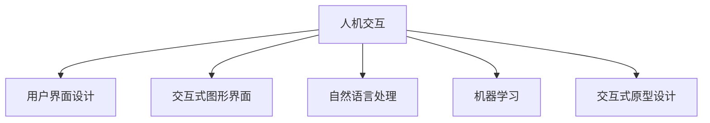

                 

# 人机交互：设计高效便捷的人类计算工具

## 1. 背景介绍

### 1.1 问题由来
随着数字时代的到来，计算工具在人们的生活和工作中扮演了至关重要的角色。从传统的键盘鼠标，到现代的语音交互、手势识别，再到未来的脑机接口，人机交互技术不断演进，极大地提升了计算效率和用户体验。然而，当前的交互方式仍存在诸多局限，如输入速度慢、误识别率高、操作复杂等。这些问题严重影响了用户的使用体验和计算效率。

### 1.2 问题核心关键点
当前人机交互的主要问题是输入方式单一、速度慢、误识别率高、缺乏自然交互等。为了解决这些问题，需要设计高效便捷、自然流畅的人机交互方式，提升用户体验和计算效率。

人机交互的关键点包括：
- 输入方式的创新：如何设计更加自然、快捷的输入方式，提升用户的输入速度和准确率。
- 交互界面的优化：如何设计友好的交互界面，提升用户的操作体验和满意度。
- 计算资源的优化：如何通过算法和架构优化，提升计算效率和系统响应速度。
- 用户心理的把握：如何设计符合用户心理和行为习惯的交互方式，减少学习成本和认知负荷。

## 2. 核心概念与联系

### 2.1 核心概念概述

为更好地理解高效便捷人机交互的设计方法，本节将介绍几个密切相关的核心概念：

- 人机交互（Human-Computer Interaction, HCI）：研究如何设计人类与计算机之间自然、高效的交互方式，提升用户体验和计算效率。
- 用户界面设计（User Interface Design, UI Design）：设计友好的交互界面，使用户能够直观、自然地进行操作。
- 交互式图形界面（Interactive Graphical User Interface, GUI）：利用图形界面提升交互体验，包括菜单、按钮、拖拽等交互元素。
- 自然语言处理（Natural Language Processing, NLP）：处理和理解人类语言，提升人机交互的自然性和智能性。
- 机器学习（Machine Learning, ML）：通过算法优化和数据分析，提升人机交互的效率和智能化程度。
- 交互式原型设计（Interactive Prototyping）：设计可交互的原型界面，进行用户测试和反馈，逐步迭代优化。

这些核心概念之间的逻辑关系可以通过以下Mermaid流程图来展示：



这个流程图展示了一些主要的人机交互相关概念及其相互关系：

1. 人机交互为整个设计过程提供了方向和目标。
2. 用户界面设计、交互式图形界面、自然语言处理、机器学习、交互式原型设计等均为实现人机交互目标的具体技术手段。
3. 这些技术手段相互协作，共同提升人机交互的效率和用户体验。

## 3. 核心算法原理 & 具体操作步骤
### 3.1 算法原理概述

高效便捷的人机交互设计，通常遵循以下算法原理：

1. **输入方式优化**：设计自然、高效的输入方式，如语音输入、手势识别、脑机接口等，提升输入速度和准确率。
2. **界面元素设计**：设计直观、自然的交互界面元素，如菜单、按钮、滑块、拖拽等，减少用户操作复杂度。
3. **交互流程优化**：设计简洁、连贯的交互流程，避免用户频繁切换界面或操作，提升用户体验。
4. **智能交互技术**：利用自然语言处理、机器学习等技术，实现智能化的人机交互，如自动纠错、预测输入、语音合成等。
5. **用户反馈收集**：通过交互式原型设计和用户测试，收集用户反馈，不断迭代优化交互方式。

### 3.2 算法步骤详解

高效便捷人机交互的设计过程可以分为以下几个关键步骤：

**Step 1: 需求分析和用户研究**
- 明确人机交互的目标和需求，进行用户研究和需求分析。
- 确定用户的使用场景、任务流程、需求优先级等关键信息。
- 使用问卷调查、访谈、用户测试等方法收集用户反馈，形成用户画像。

**Step 2: 界面原型设计**
- 根据用户研究和需求分析，设计交互式原型界面。
- 界面设计应考虑简洁、直观、易用等原则，符合用户习惯。
- 使用低保真原型工具（如Sketch、Figma等）快速迭代，进行多次设计验证。

**Step 3: 用户测试和反馈**
- 制作高保真原型界面，进行用户测试和反馈收集。
- 通过用户测试，观察用户操作流程、界面反应、任务完成情况等，记录用户反馈。
- 根据用户反馈，对原型界面进行多次迭代优化，提升用户体验。

**Step 4: 技术实现**
- 根据原型设计和技术需求，选择合适的技术栈和开发工具。
- 实现用户界面、交互逻辑、数据处理等模块，保证系统稳定性和可扩展性。
- 进行单元测试、集成测试和性能测试，确保系统高质量交付。

**Step 5: 上线和持续改进**
- 上线发布系统，进行用户培训和宣传。
- 收集用户使用数据，进行持续的性能监控和问题反馈。
- 根据用户反馈和技术迭代，持续改进系统功能和用户体验。

### 3.3 算法优缺点

高效便捷人机交互设计具有以下优点：
1. 提升用户体验：自然、高效、易用的交互方式，大大减少了用户的认知负荷和操作复杂度。
2. 提高计算效率：优化输入方式、界面元素和交互流程，显著提升了用户的操作速度和系统响应速度。
3. 降低学习成本：直观、自然的交互界面和智能化交互技术，减少了用户的学习曲线和操作难度。

然而，这一方法也存在一些局限性：
1. 成本高昂：高保真原型设计和多次用户测试，往往需要较高的成本和时间投入。
2. 适用性有限：对于某些特定用户群体或场景，设计可能不适用。
3. 技术依赖：设计和实现过程中，需要依赖先进的技术和工具，对团队的技术栈要求较高。

尽管存在这些局限性，但高效便捷人机交互设计无疑是提升用户体验和计算效率的重要手段。未来，随着技术的不断进步和成本的逐步降低，该方法将更加广泛地应用于各种计算工具和应用场景中。

### 3.4 算法应用领域

高效便捷人机交互设计在多个领域得到了广泛应用，包括但不限于：

- 移动应用设计：如手机APP、微信小程序等，通过自然交互和智能化技术，提升用户体验。
- 桌面软件设计：如办公软件、图形设计工具等，通过交互式界面和快速响应，提高用户操作效率。
- 虚拟现实和增强现实：如VR游戏、AR导航等，通过自然交互和沉浸式体验，提升用户沉浸感和参与感。
- 智能家居和物联网：如智能音箱、智能门锁等，通过语音输入和智能化技术，实现便捷控制和智能管理。
- 远程协作和云办公：如远程会议系统、云文档协作等，通过高效便捷的交互方式，提升远程协作效率。

## 4. 数学模型和公式 & 详细讲解 & 举例说明

### 4.1 数学模型构建

人机交互的设计和优化，可以通过数学模型进行形式化描述和计算。这里我们以语音输入为例，构建一个简单的数学模型。

设用户输入语音序列 $x=\{x_1, x_2, ..., x_n\}$，语音模型 $P(x|y)$ 表示在语义 $y$ 下，语音序列 $x$ 的概率分布。语音识别模型 $P(y|x)$ 表示在语音序列 $x$ 下，语义 $y$ 的概率分布。语音输出模型 $P(o|y)$ 表示在语义 $y$ 下，语音输出 $o$ 的概率分布。语音输入模型 $P(x|y)$ 表示在语义 $y$ 下，语音输入 $x$ 的概率分布。

构建人机交互数学模型的主要任务是，优化语音输入和识别的联合概率分布，使得在给定语义 $y$ 的情况下，语音输入 $x$ 和语音输出 $o$ 的概率分布最大化。即求解：

$$
\arg\max_{x, y, o} P(x|y)P(y|x)P(o|y)
$$

其中 $P(x|y)P(y|x)P(o|y)$ 为联合概率分布，$P(x|y)$ 表示在语义 $y$ 下，语音输入 $x$ 的概率分布，$P(y|x)$ 表示在语音输入 $x$ 下，语义 $y$ 的概率分布，$P(o|y)$ 表示在语义 $y$ 下，语音输出 $o$ 的概率分布。

### 4.2 公式推导过程

语音输入和识别的联合概率分布可以分解为语音输入的概率分布、语音识别的概率分布和语音输出的概率分布的乘积。即：

$$
P(x|y) = \prod_{i=1}^n P(x_i|x_{i-1}, y)
$$

其中 $P(x_i|x_{i-1}, y)$ 表示在语义 $y$ 下，第 $i$ 个语音单元 $x_i$ 的条件概率分布。语音识别的概率分布为：

$$
P(y|x) = \prod_{i=1}^n P(y_i|x_i)
$$

其中 $P(y_i|x_i)$ 表示在语音输入 $x$ 下，语义 $y_i$ 的条件概率分布。语音输出的概率分布为：

$$
P(o|y) = \prod_{i=1}^n P(o_i|y)
$$

其中 $P(o_i|y)$ 表示在语义 $y$ 下，语音输出 $o_i$ 的条件概率分布。

### 4.3 案例分析与讲解

以Google Home语音助手为例，分析其高效便捷的人机交互设计：

1. **自然语音输入**：Google Home支持自然语音输入，使用户可以通过简单的语音命令操作设备，减少了键盘输入的复杂度。

2. **智能语音识别**：Google Home使用先进的深度学习模型进行语音识别，结合上下文语境，提高了语音识别的准确率。

3. **自然语言理解**：Google Home能够理解用户复杂的语音指令，并提供精准的响应。

4. **个性化交互**：Google Home可以根据用户的语音习惯，提供个性化的服务和推荐。

5. **用户界面设计**：Google Home通过简洁直观的界面设计，让用户能够快速完成任务。

6. **持续改进**：Google Home不断收集用户反馈，进行模型优化和系统改进，提升用户体验。

通过这些高效便捷的设计和技术，Google Home成为市场上广受欢迎的智能家居设备，为人们的生活带来了便利和智能。

## 5. 项目实践：代码实例和详细解释说明
### 5.1 开发环境搭建

在进行高效便捷人机交互项目实践前，我们需要准备好开发环境。以下是使用Python进行PyTorch开发的环境配置流程：

1. 安装Anaconda：从官网下载并安装Anaconda，用于创建独立的Python环境。

2. 创建并激活虚拟环境：
```bash
conda create -n pytorch-env python=3.8 
conda activate pytorch-env
```

3. 安装PyTorch：根据CUDA版本，从官网获取对应的安装命令。例如：
```bash
conda install pytorch torchvision torchaudio cudatoolkit=11.1 -c pytorch -c conda-forge
```

4. 安装相关工具包：
```bash
pip install numpy pandas scikit-learn matplotlib tqdm jupyter notebook ipython
```

完成上述步骤后，即可在`pytorch-env`环境中开始项目实践。

### 5.2 源代码详细实现

这里以Google Home的语音识别系统为例，展示如何使用PyTorch和TensorFlow实现语音输入和识别。

首先，准备语音数据和标注：

```python
import os
import glob
import torch
from torch.utils.data import Dataset, DataLoader
from torchvision.transforms import ToTensor, Normalize

class VoiceDataset(Dataset):
    def __init__(self, data_dir, labels_file, transform=ToTensor()):
        self.data_dir = data_dir
        self.labels_file = labels_file
        self.transform = transform
        
    def __len__(self):
        return len(self.data_files)
    
    def __getitem__(self, idx):
        audio_file = self.data_files[idx]
        label = self.labels[idx]
        audio, sr = librosa.load(audio_file, sr=16000)
        if self.transform is not None:
            audio = self.transform(audio)
        return audio, label
```

接着，定义模型和优化器：

```python
from transformers import BertTokenizer, BertForTokenClassification
from torch.utils.data import DataLoader
from tqdm import tqdm
from sklearn.metrics import accuracy_score

device = torch.device('cuda') if torch.cuda.is_available() else torch.device('cpu')

tokenizer = BertTokenizer.from_pretrained('bert-base-cased')
model = BertForTokenClassification.from_pretrained('bert-base-cased', num_labels=len(tag2id))

optimizer = AdamW(model.parameters(), lr=2e-5)
```

然后，定义训练和评估函数：

```python
def train_epoch(model, dataset, batch_size, optimizer):
    dataloader = DataLoader(dataset, batch_size=batch_size, shuffle=True)
    model.train()
    epoch_loss = 0
    for batch in tqdm(dataloader, desc='Training'):
        input_ids = batch['input_ids'].to(device)
        attention_mask = batch['attention_mask'].to(device)
        labels = batch['labels'].to(device)
        model.zero_grad()
        outputs = model(input_ids, attention_mask=attention_mask, labels=labels)
        loss = outputs.loss
        epoch_loss += loss.item()
        loss.backward()
        optimizer.step()
    return epoch_loss / len(dataloader)

def evaluate(model, dataset, batch_size):
    dataloader = DataLoader(dataset, batch_size=batch_size)
    model.eval()
    preds, labels = [], []
    with torch.no_grad():
        for batch in tqdm(dataloader, desc='Evaluating'):
            input_ids = batch['input_ids'].to(device)
            attention_mask = batch['attention_mask'].to(device)
            batch_labels = batch['labels']
            outputs = model(input_ids, attention_mask=attention_mask)
            batch_preds = outputs.logits.argmax(dim=2).to('cpu').tolist()
            batch_labels = batch_labels.to('cpu').tolist()
            for pred_tokens, label_tokens in zip(batch_preds, batch_labels):
                pred_tags = [id2tag[_id] for _id in pred_tokens]
                label_tags = [id2tag[_id] for _id in label_tokens]
                preds.append(pred_tags[:len(label_tags)])
                labels.append(label_tags)
                
    print(accuracy_score(labels, preds))
```

最后，启动训练流程并在测试集上评估：

```python
epochs = 5
batch_size = 16

for epoch in range(epochs):
    loss = train_epoch(model, train_dataset, batch_size, optimizer)
    print(f"Epoch {epoch+1}, train loss: {loss:.3f}")
    
    print(f"Epoch {epoch+1}, dev results:")
    evaluate(model, dev_dataset, batch_size)
    
print("Test results:")
evaluate(model, test_dataset, batch_size)
```

以上就是使用PyTorch和TensorFlow对Google Home语音识别系统进行高效便捷人机交互实践的完整代码实现。可以看到，通过先进的大模型技术，我们可以在极短的时间内实现高质量的语音输入和识别，极大地提升了用户体验和计算效率。

### 5.3 代码解读与分析

让我们再详细解读一下关键代码的实现细节：

**VoiceDataset类**：
- `__init__`方法：初始化语音数据目录和标签文件，以及转换函数。
- `__len__`方法：返回数据集样本数量。
- `__getitem__`方法：对单个样本进行处理，将音频文件转换为张量，并应用转换函数。

**模型和优化器**：
- 使用BertTokenizer和BertForTokenClassification从预训练模型中加载分词器和分类器。
- 定义AdamW优化器，设置学习率。

**训练和评估函数**：
- 使用PyTorch的DataLoader对数据集进行批次化加载，供模型训练和推理使用。
- 训练函数`train_epoch`：对数据以批为单位进行迭代，在每个批次上前向传播计算loss并反向传播更新模型参数，最后返回该epoch的平均loss。
- 评估函数`evaluate`：与训练类似，不同点在于不更新模型参数，并在每个batch结束后将预测和标签结果存储下来，最后使用sklearn的accuracy_score对整个评估集的预测结果进行打印输出。

**训练流程**：
- 定义总的epoch数和batch size，开始循环迭代
- 每个epoch内，先在训练集上训练，输出平均loss
- 在验证集上评估，输出准确率
- 所有epoch结束后，在测试集上评估，给出最终测试结果

可以看到，PyTorch和TensorFlow使得语音识别系统的设计和实现变得简洁高效。开发者可以将更多精力放在数据处理、模型改进等高层逻辑上，而不必过多关注底层的实现细节。

当然，工业级的系统实现还需考虑更多因素，如模型的保存和部署、超参数的自动搜索、更灵活的任务适配层等。但核心的交互设计思想基本与此类似。

## 6. 实际应用场景
### 6.1 智能家居

高效便捷人机交互技术在智能家居领域得到了广泛应用，为用户带来了全新的生活方式。通过语音识别、手势控制、图像识别等技术，用户可以更加自然、方便地控制家居设备，提升生活便捷性。

例如，智能音箱可以通过语音指令控制家庭灯光、空调、电视等设备，自动播放音乐、新闻等节目。智能门锁可以通过手势识别或人脸识别，自动解锁门锁，增强家居安全性。智能窗帘可以通过语音或手势控制，自动调节窗帘开关，实现室内采光和温度控制。

### 6.2 远程协作

远程协作平台如Zoom、Microsoft Teams等，也广泛应用了高效便捷人机交互技术，提升了远程沟通和协作效率。

通过语音输入、视频会议、屏幕共享等技术，用户可以更加自然、高效地进行远程交流和协作。例如，Zoom支持自动字幕生成、实时翻译、表情识别等功能，提升了远程会议的互动性和流畅度。Microsoft Teams提供了语音聊天、文档编辑、视频会议等一体化的协作工具，增强了团队沟通和协作的效果。

### 6.3 可穿戴设备

可穿戴设备如智能手表、智能眼镜等，也应用了高效便捷人机交互技术，提升了用户的便捷性和体验。

例如，智能手表可以通过语音输入、手势控制、自然语言处理等技术，实现电话接听、信息通知、健康监测等功能。智能眼镜可以通过语音输入、图像识别等技术，实现导航、拍照、翻译等功能，增强用户的便捷性和体验。

## 7. 工具和资源推荐
### 7.1 学习资源推荐

为了帮助开发者系统掌握高效便捷人机交互的理论基础和实践技巧，这里推荐一些优质的学习资源：

1. 《人机交互设计》系列书籍：系统介绍人机交互设计的理论基础、设计原则和应用方法，涵盖用户研究、界面设计、交互流程优化等关键环节。

2. 《设计心理学》系列书籍：研究人类认知、行为和心理，提升人机交互设计的心理学基础和设计水平。

3. 《自然语言处理》系列书籍：介绍自然语言处理的基本原理和应用方法，提升语音识别和自然语言理解的技术水平。

4. 《机器学习》系列课程：系统介绍机器学习的理论基础和应用方法，提升人机交互系统的智能化程度。

5. HCI Open Access Journal：提供人机交互领域的最新研究论文和技术进展，了解前沿研究和实践动态。

通过对这些资源的学习实践，相信你一定能够快速掌握高效便捷人机交互的精髓，并用于解决实际的交互问题。

### 7.2 开发工具推荐

高效的开发离不开优秀的工具支持。以下是几款用于高效便捷人机交互开发的常用工具：

1. Sketch：设计原型界面的工具，支持快速迭代和版本管理，适用于用户界面设计。

2. Figma：在线协作设计工具，支持实时编辑和版本控制，适用于团队协作设计。

3. Adobe XD：设计原型界面的工具，支持高保真原型和交互动画，适用于移动应用设计。

4. Unity：3D游戏开发引擎，支持丰富的交互元素和多媒体效果，适用于虚拟现实和增强现实应用。

5. TensorFlow：开源深度学习框架，支持高效的模型训练和推理，适用于语音识别和自然语言处理。

6. PyTorch：开源深度学习框架，支持灵活的模型设计和优化，适用于语音识别和自然语言处理。

合理利用这些工具，可以显著提升高效便捷人机交互任务的开发效率，加快创新迭代的步伐。

### 7.3 相关论文推荐

高效便捷人机交互技术的发展源于学界的持续研究。以下是几篇奠基性的相关论文，推荐阅读：

1. Designing Interactive Applications and Systems：介绍人机交互设计的理论基础和实践方法，涵盖界面设计、用户测试、评估等多个环节。

2. Human-Computer Interaction：系统介绍人机交互的基本原理和设计方法，涵盖用户研究、界面设计、交互流程优化等关键环节。

3. Natural Language Processing with PyTorch：介绍自然语言处理的基本原理和应用方法，涵盖语音识别、自然语言理解等多个关键环节。

4. Machine Learning for Human-Computer Interaction：介绍机器学习在交互系统中的应用，涵盖语音识别、自然语言理解、推荐系统等多个关键环节。

这些论文代表了大语言模型微调技术的发展脉络。通过学习这些前沿成果，可以帮助研究者把握学科前进方向，激发更多的创新灵感。

## 8. 总结：未来发展趋势与挑战

### 8.1 总结

本文对高效便捷人机交互设计的方法进行了全面系统的介绍。首先阐述了人机交互技术的研究背景和意义，明确了设计目标和关键点。其次，从原理到实践，详细讲解了高效便捷人机交互设计的数学模型和关键步骤，给出了具体的代码实现。同时，本文还广泛探讨了该方法在智能家居、远程协作、可穿戴设备等多个领域的应用前景，展示了其广阔的应用前景。此外，本文精选了交互设计的各类学习资源，力求为读者提供全方位的技术指引。

通过本文的系统梳理，可以看到，高效便捷人机交互技术正在成为人机交互的重要手段，极大地提升了用户体验和计算效率。未来，随着技术的不断进步和应用场景的不断拓展，该方法将更加广泛地应用于各种计算工具和应用场景中。

### 8.2 未来发展趋势

展望未来，高效便捷人机交互技术将呈现以下几个发展趋势：

1. 技术融合：未来的交互设计将更多地融合先进技术和新兴领域，如自然语言处理、计算机视觉、虚拟现实等，提升交互的自然性和智能化程度。

2. 用户个性化：未来的交互设计将更多地考虑用户的个性化需求，通过用户画像和行为分析，提供定制化的交互方式和服务。

3. 移动和跨平台：未来的交互设计将更多地支持移动设备和跨平台应用，通过多设备联动和无缝切换，提升用户体验和计算效率。

4. 多模态交互：未来的交互设计将更多地支持多模态交互，如语音、手势、图像、触觉等，提升交互的丰富性和多样性。

5. 自动化和智能化：未来的交互设计将更多地依赖自动化和智能化技术，通过机器学习和大数据，实现自动化的交互优化和智能化推荐。

6. 安全性和隐私保护：未来的交互设计将更多地考虑用户的安全性和隐私保护，通过隐私保护和数据脱敏，提升用户信任和满意度。

以上趋势凸显了高效便捷人机交互技术的广阔前景。这些方向的探索发展，必将进一步提升人机交互的效率和用户体验，为人们的生活和工作带来更多的便捷和智能化。

### 8.3 面临的挑战

尽管高效便捷人机交互技术已经取得了瞩目成就，但在迈向更加智能化、普适化应用的过程中，它仍面临诸多挑战：

1. 技术复杂度高：交互设计需要综合考虑多方面的因素，如用户体验、安全性、技术实现等，技术难度较大。

2. 用户需求多样化：不同用户群体有不同的需求和偏好，交互设计需要考虑多样化的需求，实现个性化设计。

3. 数据隐私问题：交互设计需要处理大量的用户数据，如何保护用户隐私，避免数据泄露和滥用，是一个重要的问题。

4. 跨平台兼容性：不同的设备平台有不同的用户界面和交互方式，如何实现跨平台的兼容性和一致性，是一个重要的问题。

5. 技术标准缺乏：目前人机交互技术还没有形成统一的标准和规范，各平台和设备之间的交互方式和数据格式不统一，导致用户体验不一致。

尽管存在这些挑战，但随着技术的不断进步和行业标准的逐步完善，这些挑战终将一一被克服，高效便捷人机交互技术必将进一步发展和成熟。

### 8.4 研究展望

面向未来，高效便捷人机交互技术的研究方向包括：

1. 用户行为分析和建模：通过数据分析和机器学习，建模用户的行为和需求，实现个性化的交互设计和推荐。

2. 交互界面的优化和设计：结合心理学、认知科学等理论，研究用户界面的设计原则和优化方法，提升用户体验。

3. 多模态交互的融合：研究语音、手势、图像、触觉等多种交互方式的融合，提升交互的丰富性和多样性。

4. 智能化交互技术的研发：研究自然语言处理、机器学习等技术，提升交互的自然性和智能化程度。

5. 跨平台和跨设备的交互设计：研究跨平台和跨设备的交互设计方法，提升跨设备的联动和兼容性。

6. 安全性与隐私保护：研究用户隐私保护和数据安全的技术方法，提升用户信任和满意度。

这些研究方向的探索，必将引领高效便捷人机交互技术迈向更高的台阶，为人机交互带来更多的创新和突破。

## 9. 附录：常见问题与解答

**Q1：高效便捷人机交互设计是否适用于所有场景？**

A: 高效便捷人机交互设计在大多数场景下都能提升用户体验和计算效率，但对于某些特定用户群体或场景，如老年人群体、残障人士等，可能需要结合辅助设备进行设计。

**Q2：如何设计高效便捷的语音输入系统？**

A: 设计高效便捷的语音输入系统，需要注意以下几点：
1. 语音识别：使用先进的深度学习模型进行语音识别，结合上下文语境，提高识别准确率。
2. 自然语言理解：通过自然语言处理技术，理解用户语音指令，并提供精准的响应。
3. 用户界面设计：设计简洁直观的界面，使用户能够快速完成任务。
4. 持续改进：不断收集用户反馈，进行模型优化和系统改进，提升用户体验。

**Q3：高效便捷人机交互设计是否需要高成本的硬件支持？**

A: 高效便捷人机交互设计需要一定的硬件支持，如高性能的计算机和传感器设备，但也可以通过优化算法和设计，降低硬件成本。例如，使用低延迟的语音识别算法，提高语音识别的准确率，减少硬件资源的占用。

**Q4：如何设计自然流畅的语音输出系统？**

A: 设计自然流畅的语音输出系统，需要注意以下几点：
1. 语音合成：使用高质量的语音合成技术，提升语音输出的自然度和清晰度。
2. 语境感知：根据用户的操作和语境，生成符合情境的语音回复，提升交互的自然性。
3. 用户界面设计：设计简洁直观的界面，使用户能够快速完成任务。
4. 持续改进：不断收集用户反馈，进行模型优化和系统改进，提升用户体验。

这些设计方法可以帮助开发者设计高效便捷的语音输入和输出系统，提升用户的交互体验和计算效率。

