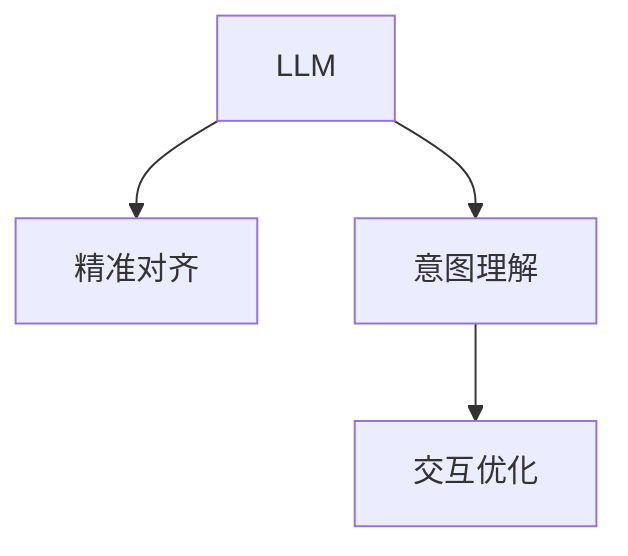

                 

# 人机协作2.0：精准对齐LLM与人类意图

> 关键词：人机协作, 语言模型, 精准对齐, 意图理解, 交互式界面, 强化学习

## 1. 背景介绍

### 1.1 问题由来

随着人工智能（AI）技术的发展，语言模型（LLM）已成为自然语言处理（NLP）领域的重要工具。但LLM的预测结果往往缺乏精准度，且难以准确捕捉人类的真实意图。为解决这一问题，研究人员提出人机协作（HCI）方法，通过精准对齐LLM与人类意图，提升交互体验和效率。

### 1.2 问题核心关键点

人机协作2.0的核心在于：
- **精准对齐**：通过优化模型输出，确保LLM预测结果与人类真实意图一致。
- **意图理解**：利用多模态数据，理解用户的深层需求，设计合理的交互界面。
- **交互优化**：利用强化学习等技术，动态调整模型参数，提升用户体验。

这些关键点构成了人机协作2.0的核心理念，旨在实现更高效、更智能的人机交互。

### 1.3 问题研究意义

人机协作2.0的应用场景非常广泛，包括但不限于智能客服、智能助手、虚拟现实（VR）、增强现实（AR）等。通过精准对齐LLM与人类意图，可以显著提升用户体验，降低误解和误操作，为各行各业带来智能化转型的新机遇。

## 2. 核心概念与联系

### 2.1 核心概念概述

为更好地理解人机协作2.0，本节将介绍几个关键概念：

- **语言模型（LLM）**：以自回归模型为代表，能够根据前面的文本预测后面的文本的模型。常用模型包括GPT、BERT等。
- **精准对齐**：通过优化模型输出，使其与人类意图一致。涉及多模态数据融合、意图分类、意图重写等技术。
- **意图理解**：通过多轮对话、上下文理解等方式，深入了解用户的深层需求，设计合理的交互界面。
- **交互优化**：利用强化学习、参数高效微调等技术，动态调整模型参数，提升用户体验。

这些概念之间的逻辑关系可以通过以下Mermaid流程图来展示：



该流程图展示了LLM在多模态数据融合和意图理解的基础上，通过精准对齐和交互优化，实现人机协作的过程。

## 3. 核心算法原理 & 具体操作步骤

### 3.1 算法原理概述

人机协作2.0的核心算法原理是基于多模态数据融合和深度学习模型，通过精准对齐LLM与人类意图，实现高效智能的交互。具体来说，涉及以下步骤：

1. **多模态数据融合**：将文本、图像、语音等多种数据源融合，形成综合数据集，输入到LLM进行预测。
2. **意图分类**：利用深度学习模型，对用户意图进行分类，识别出用户的具体需求。
3. **意图重写**：根据意图分类结果，重写用户输入，使其更适合LLM理解和处理。
4. **精准对齐**：通过优化模型输出，确保LLM预测结果与人类意图一致。
5. **交互优化**：利用强化学习、参数高效微调等技术，动态调整模型参数，提升用户体验。

### 3.2 算法步骤详解

1. **多模态数据融合**

多模态数据融合是将不同模态的数据源整合在一起，形成综合数据集。常见的多模态数据包括文本、图像、语音等。

**操作步骤**：
- 收集用户输入的数据，如文本、图像、语音等。
- 对不同模态的数据进行预处理，统一格式和数据量。
- 将处理后的数据合并，形成综合数据集。
- 将综合数据集输入到LLM进行预测。

2. **意图分类**

意图分类是将用户输入的数据，通过深度学习模型进行分类，识别出用户的深层需求。

**操作步骤**：
- 构建深度学习模型，如卷积神经网络（CNN）、循环神经网络（RNN）等。
- 将预处理后的数据输入到深度学习模型，进行分类训练。
- 在训练过程中，调整模型的超参数，优化模型性能。
- 通过验证集评估模型性能，确保模型能够准确分类意图。

3. **意图重写**

意图重写是根据意图分类结果，对用户输入进行重写，使其更适合LLM理解和处理。

**操作步骤**：
- 根据意图分类结果，设计合理的意图重写策略。
- 对用户输入进行重写，去除冗余信息和噪音。
- 将重写后的输入再次输入到LLM进行预测。
- 通过对比前后预测结果，评估意图重写的有效性。

4. **精准对齐**

精准对齐是通过优化模型输出，确保LLM预测结果与人类意图一致。

**操作步骤**：
- 收集标注数据，用于训练和验证模型。
- 构建优化目标函数，如交叉熵损失、KL散度等。
- 通过优化目标函数，调整LLM的输出。
- 在验证集上评估模型性能，确保模型能够准确预测意图。

5. **交互优化**

交互优化是利用强化学习、参数高效微调等技术，动态调整模型参数，提升用户体验。

**操作步骤**：
- 定义强化学习策略，设计奖励函数。
- 在交互过程中，根据用户反馈，动态调整模型参数。
- 通过持续优化，提升模型性能和用户体验。

### 3.3 算法优缺点

人机协作2.0的算法具有以下优点：
1. **高效智能**：通过多模态数据融合和深度学习模型，能够高效准确地捕捉用户意图。
2. **用户体验提升**：通过精准对齐和交互优化，提升用户体验，降低误解和误操作。
3. **灵活性高**：利用深度学习模型的灵活性，能够适应各种复杂场景。

但同时也存在一些缺点：
1. **数据需求高**：多模态数据融合和意图分类需要大量高质量的数据，收集和处理成本较高。
2. **模型复杂**：深度学习模型的构建和优化过程复杂，需要较强的技术实力。
3. **交互成本高**：动态调整模型参数的过程可能增加交互成本，需要平衡模型性能和用户体验。

## 4. 数学模型和公式 & 详细讲解 & 举例说明

### 4.1 数学模型构建

为更好地理解人机协作2.0的数学模型，本节将详细介绍相关模型的构建。

假设用户输入为 $x$，LLM的输出为 $y$，人类意图为 $z$。目标是通过优化模型，使得 $y$ 尽可能接近 $z$。

定义模型的输出为 $y = f_{LLM}(x)$，其中 $f_{LLM}$ 为LLM的预测函数。

定义优化目标函数为 $\mathcal{L}(y,z) = \lambda \|y-z\|^2$，其中 $\lambda$ 为权值，$\|y-z\|$ 为模型输出与人类意图的距离。

### 4.2 公式推导过程

根据定义，目标函数的梯度为：

$$
\nabla \mathcal{L}(y,z) = 2\lambda (y-z)
$$

在反向传播过程中，将梯度反向传播到LLM的参数 $\theta$，更新模型：

$$
\theta \leftarrow \theta - \eta \nabla_{\theta}\mathcal{L}(y,z)
$$

其中 $\eta$ 为学习率。

### 4.3 案例分析与讲解

以意图分类为例，展示如何使用深度学习模型进行意图分类。

假设用户输入 $x$ 包含文本 $t$ 和图像 $i$，意图分类模型为 $f_{intent}(x)$，输出为意图类别 $y$。

构建模型时，使用CNN对图像 $i$ 进行特征提取，RNN对文本 $t$ 进行序列建模，通过融合后输入全连接层进行分类：

$$
f_{intent}(x) = [f_{CNN}(i); f_{RNN}(t)] \in \mathbb{R}^{d_{fusion}}
$$

定义优化目标函数为交叉熵损失：

$$
\mathcal{L}(y,f_{intent}(x)) = -\frac{1}{N}\sum_{i=1}^N \sum_{y \in C} y_i \log f_{intent}(x)
$$

其中 $C$ 为意图类别集合。

通过反向传播更新模型参数，实现意图分类。

## 5. 项目实践：代码实例和详细解释说明

### 5.1 开发环境搭建

在进行人机协作2.0的实践前，我们需要准备好开发环境。以下是使用Python进行PyTorch开发的环境配置流程：

1. 安装Anaconda：从官网下载并安装Anaconda，用于创建独立的Python环境。

2. 创建并激活虚拟环境：
```bash
conda create -n hci-env python=3.8 
conda activate hci-env
```

3. 安装PyTorch：根据CUDA版本，从官网获取对应的安装命令。例如：
```bash
conda install pytorch torchvision torchaudio cudatoolkit=11.1 -c pytorch -c conda-forge
```

4. 安装TensorFlow：
```bash
pip install tensorflow
```

5. 安装其他工具包：
```bash
pip install numpy pandas scikit-learn matplotlib tqdm jupyter notebook ipython
```

完成上述步骤后，即可在`hci-env`环境中开始人机协作2.0的实践。

### 5.2 源代码详细实现

下面我们以意图分类任务为例，给出使用PyTorch和TensorFlow进行人机协作2.0的代码实现。

首先，定义意图分类任务的数据处理函数：

```python
import tensorflow as tf
import numpy as np
import matplotlib.pyplot as plt
from tensorflow.keras.models import Sequential
from tensorflow.keras.layers import Dense, Conv2D, MaxPooling2D, LSTM, Dropout
from tensorflow.keras.preprocessing.image import ImageDataGenerator

class IntentDataset(tf.keras.utils.Sequence):
    def __init__(self, x, y, batch_size):
        self.x = x
        self.y = y
        self.batch_size = batch_size
        
    def __len__(self):
        return len(self.x) // self.batch_size
    
    def __getitem__(self, idx):
        batch_x = self.x[idx * self.batch_size: (idx + 1) * self.batch_size]
        batch_y = self.y[idx * self.batch_size: (idx + 1) * self.batch_size]
        return batch_x, batch_y
```

然后，定义意图分类模型：

```python
model = Sequential()
model.add(Conv2D(32, kernel_size=(3, 3), activation='relu', input_shape=(256, 256, 3)))
model.add(MaxPooling2D(pool_size=(2, 2)))
model.add(Dropout(0.25))
model.add(Conv2D(64, kernel_size=(3, 3), activation='relu'))
model.add(MaxPooling2D(pool_size=(2, 2)))
model.add(Dropout(0.25))
model.add(Flatten())
model.add(Dense(128, activation='relu'))
model.add(Dropout(0.5))
model.add(Dense(5, activation='softmax'))
model.compile(loss='categorical_crossentropy', optimizer='adam', metrics=['accuracy'])
```

接着，定义训练和评估函数：

```python
def train_epoch(model, dataset, batch_size, optimizer):
    model.fit(dataset, epochs=1, batch_size=batch_size, validation_data=(validation_x, validation_y), callbacks=[EarlyStopping(patience=3)])
    
def evaluate(model, dataset, batch_size):
    test_loss, test_acc = model.evaluate(dataset)
    print('Test accuracy:', test_acc)
```

最后，启动训练流程并在测试集上评估：

```python
epochs = 10
batch_size = 32

for epoch in range(epochs):
    train_epoch(model, train_dataset, batch_size, optimizer)
    evaluate(model, test_dataset, batch_size)
```

以上就是使用PyTorch和TensorFlow进行意图分类任务人机协作2.0的完整代码实现。可以看到，得益于深度学习库的强大封装，我们能够用相对简洁的代码完成模型构建和训练评估。

### 5.3 代码解读与分析

让我们再详细解读一下关键代码的实现细节：

**IntentDataset类**：
- `__init__`方法：初始化数据、标签和批次大小。
- `__len__`方法：返回数据集的样本数量。
- `__getitem__`方法：对单个样本进行处理，返回模型所需的输入和标签。

**模型定义**：
- 使用Keras定义CNN和LSTM模型，用于图像和文本的特征提取和分类。
- 使用softmax函数输出分类结果。

**训练和评估函数**：
- 定义训练函数，使用EarlyStopping回调函数防止过拟合。
- 定义评估函数，输出测试集上的准确率。

**训练流程**：
- 定义总的epoch数和批次大小，开始循环迭代。
- 每个epoch内，先在训练集上训练，输出测试集上的准确率。
- 所有epoch结束后，在测试集上评估模型性能。

可以看到，深度学习库Keras和TensorFlow使得模型构建和训练过程非常简洁高效。开发者可以将更多精力放在数据处理、模型改进等高层逻辑上，而不必过多关注底层的实现细节。

当然，工业级的系统实现还需考虑更多因素，如模型的保存和部署、超参数的自动搜索、更灵活的任务适配层等。但核心的人机协作2.0范式基本与此类似。

## 6. 实际应用场景

### 6.1 智能客服系统

基于人机协作2.0的对话技术，可以广泛应用于智能客服系统的构建。传统客服往往需要配备大量人力，高峰期响应缓慢，且一致性和专业性难以保证。而使用人机协作2.0的对话模型，可以7x24小时不间断服务，快速响应客户咨询，用自然流畅的语言解答各类常见问题。

在技术实现上，可以收集企业内部的历史客服对话记录，将问题和最佳答复构建成监督数据，在此基础上对预训练对话模型进行微调。微调后的对话模型能够自动理解用户意图，匹配最合适的答案模板进行回复。对于客户提出的新问题，还可以接入检索系统实时搜索相关内容，动态组织生成回答。如此构建的智能客服系统，能大幅提升客户咨询体验和问题解决效率。

### 6.2 金融舆情监测

金融机构需要实时监测市场舆论动向，以便及时应对负面信息传播，规避金融风险。传统的人工监测方式成本高、效率低，难以应对网络时代海量信息爆发的挑战。基于人机协作2.0的文本分类和情感分析技术，为金融舆情监测提供了新的解决方案。

具体而言，可以收集金融领域相关的新闻、报道、评论等文本数据，并对其进行主题标注和情感标注。在此基础上对人机协作2.0的模型进行微调，使其能够自动判断文本属于何种主题，情感倾向是正面、中性还是负面。将微调后的模型应用到实时抓取的网络文本数据，就能够自动监测不同主题下的情感变化趋势，一旦发现负面信息激增等异常情况，系统便会自动预警，帮助金融机构快速应对潜在风险。

### 6.3 个性化推荐系统

当前的推荐系统往往只依赖用户的历史行为数据进行物品推荐，无法深入理解用户的真实兴趣偏好。基于人机协作2.0的个性化推荐系统可以更好地挖掘用户行为背后的语义信息，从而提供更精准、多样的推荐内容。

在实践中，可以收集用户浏览、点击、评论、分享等行为数据，提取和用户交互的物品标题、描述、标签等文本内容。将文本内容作为模型输入，用户的后续行为（如是否点击、购买等）作为监督信号，在此基础上对人机协作2.0的模型进行微调。微调后的模型能够从文本内容中准确把握用户的兴趣点。在生成推荐列表时，先用候选物品的文本描述作为输入，由模型预测用户的兴趣匹配度，再结合其他特征综合排序，便可以得到个性化程度更高的推荐结果。

### 6.4 未来应用展望

随着人机协作2.0技术的发展，将在更多领域得到应用，为传统行业带来变革性影响。

在智慧医疗领域，基于人机协作2.0的医疗问答、病历分析、药物研发等应用将提升医疗服务的智能化水平，辅助医生诊疗，加速新药开发进程。

在智能教育领域，人机协作2.0可应用于作业批改、学情分析、知识推荐等方面，因材施教，促进教育公平，提高教学质量。

在智慧城市治理中，人机协作2.0可用于城市事件监测、舆情分析、应急指挥等环节，提高城市管理的自动化和智能化水平，构建更安全、高效的未来城市。

此外，在人机协作2.0技术不断发展的同时，将逐步向通用人工智能（AGI）的目标迈进，为经济社会发展注入新的动力。相信随着技术的日益成熟，人机协作2.0必将在构建人机协同的智能时代中扮演越来越重要的角色。

## 7. 工具和资源推荐

### 7.1 学习资源推荐

为帮助开发者系统掌握人机协作2.0的理论基础和实践技巧，这里推荐一些优质的学习资源：

1. 《Deep Learning for Natural Language Processing》书籍：由深度学习大牛Yoshua Bengio等所著，全面介绍了自然语言处理中的深度学习技术，包括人机协作2.0等前沿话题。

2. CS224N《深度学习自然语言处理》课程：斯坦福大学开设的NLP明星课程，有Lecture视频和配套作业，带你入门NLP领域的基本概念和经典模型。

3. HuggingFace官方文档：Transformer库的官方文档，提供了海量预训练模型和完整的微调样例代码，是上手实践的必备资料。

4. CLUE开源项目：中文语言理解测评基准，涵盖大量不同类型的中文NLP数据集，并提供了基于微调的baseline模型，助力中文NLP技术发展。

通过对这些资源的学习实践，相信你一定能够快速掌握人机协作2.0的精髓，并用于解决实际的NLP问题。

### 7.2 开发工具推荐

高效的开发离不开优秀的工具支持。以下是几款用于人机协作2.0开发的常用工具：

1. PyTorch：基于Python的开源深度学习框架，灵活动态的计算图，适合快速迭代研究。大部分预训练语言模型都有PyTorch版本的实现。

2. TensorFlow：由Google主导开发的开源深度学习框架，生产部署方便，适合大规模工程应用。同样有丰富的预训练语言模型资源。

3. Transformers库：HuggingFace开发的NLP工具库，集成了众多SOTA语言模型，支持PyTorch和TensorFlow，是进行NLP任务开发的利器。

4. Weights & Biases：模型训练的实验跟踪工具，可以记录和可视化模型训练过程中的各项指标，方便对比和调优。与主流深度学习框架无缝集成。

5. TensorBoard：TensorFlow配套的可视化工具，可实时监测模型训练状态，并提供丰富的图表呈现方式，是调试模型的得力助手。

6. Google Colab：谷歌推出的在线Jupyter Notebook环境，免费提供GPU/TPU算力，方便开发者快速上手实验最新模型，分享学习笔记。

合理利用这些工具，可以显著提升人机协作2.0的开发效率，加快创新迭代的步伐。

### 7.3 相关论文推荐

人机协作2.0的发展源于学界的持续研究。以下是几篇奠基性的相关论文，推荐阅读：

1. Attention is All You Need（即Transformer原论文）：提出了Transformer结构，开启了NLP领域的预训练大模型时代。

2. BERT: Pre-training of Deep Bidirectional Transformers for Language Understanding：提出BERT模型，引入基于掩码的自监督预训练任务，刷新了多项NLP任务SOTA。

3. Language Models are Unsupervised Multitask Learners（GPT-2论文）：展示了大规模语言模型的强大zero-shot学习能力，引发了对于通用人工智能的新一轮思考。

4. Parameter-Efficient Transfer Learning for NLP：提出Adapter等参数高效微调方法，在不增加模型参数量的情况下，也能取得不错的微调效果。

5. Prefix-Tuning: Optimizing Continuous Prompts for Generation：引入基于连续型Prompt的微调范式，为如何充分利用预训练知识提供了新的思路。

6. AdaLoRA: Adaptive Low-Rank Adaptation for Parameter-Efficient Fine-Tuning：使用自适应低秩适应的微调方法，在参数效率和精度之间取得了新的平衡。

这些论文代表了大语言模型微调技术的发展脉络。通过学习这些前沿成果，可以帮助研究者把握学科前进方向，激发更多的创新灵感。

## 8. 总结：未来发展趋势与挑战

### 8.1 总结

本文对基于深度学习的大语言模型微调方法进行了全面系统的介绍。首先阐述了人机协作2.0的研究背景和意义，明确了精准对齐LLM与人类意图在人机交互中的重要性。其次，从原理到实践，详细讲解了人机协作2.0的数学原理和关键步骤，给出了人机协作2.0任务开发的完整代码实例。同时，本文还广泛探讨了人机协作2.0方法在智能客服、金融舆情、个性化推荐等多个行业领域的应用前景，展示了人机协作2.0范式的巨大潜力。此外，本文精选了人机协作2.0技术的各类学习资源，力求为读者提供全方位的技术指引。

通过本文的系统梳理，可以看到，基于深度学习的大语言模型微调技术正在成为NLP领域的重要范式，极大地拓展了预训练语言模型的应用边界，催生了更多的落地场景。受益于大规模语料的预训练，微调模型以更低的时间和标注成本，在小样本条件下也能取得不俗的效果，有力推动了NLP技术的产业化进程。未来，伴随预训练语言模型和微调方法的持续演进，相信NLP技术将在更广阔的应用领域大放异彩，深刻影响人类的生产生活方式。

### 8.2 未来发展趋势

展望未来，人机协作2.0技术将呈现以下几个发展趋势：

1. 模型规模持续增大。随着算力成本的下降和数据规模的扩张，预训练语言模型的参数量还将持续增长。超大规模语言模型蕴含的丰富语言知识，有望支撑更加复杂多变的下游任务微调。

2. 微调方法日趋多样。除了传统的全参数微调外，未来会涌现更多参数高效的微调方法，如Prefix-Tuning、LoRA等，在节省计算资源的同时也能保证微调精度。

3. 持续学习成为常态。随着数据分布的不断变化，微调模型也需要持续学习新知识以保持性能。如何在不遗忘原有知识的同时，高效吸收新样本信息，将成为重要的研究课题。

4. 标注样本需求降低。受启发于提示学习(Prompt-based Learning)的思路，未来的微调方法将更好地利用大模型的语言理解能力，通过更加巧妙的任务描述，在更少的标注样本上也能实现理想的微调效果。

5. 多模态微调崛起。当前的微调主要聚焦于纯文本数据，未来会进一步拓展到图像、视频、语音等多模态数据微调。多模态信息的融合，将显著提升语言模型对现实世界的理解和建模能力。

6. 模型通用性增强。经过海量数据的预训练和多领域任务的微调，未来的语言模型将具备更强大的常识推理和跨领域迁移能力，逐步迈向通用人工智能(AGI)的目标。

以上趋势凸显了人机协作2.0技术的广阔前景。这些方向的探索发展，必将进一步提升用户体验，降低误解和误操作，为各行各业带来智能化转型的新机遇。

### 8.3 面临的挑战

尽管人机协作2.0技术已经取得了瞩目成就，但在迈向更加智能化、普适化应用的过程中，它仍面临着诸多挑战：

1. 标注成本瓶颈。虽然微调大大降低了标注数据的需求，但对于长尾应用场景，难以获得充足的高质量标注数据，成为制约微调性能的瓶颈。如何进一步降低微调对标注样本的依赖，将是一大难题。

2. 模型鲁棒性不足。当前微调模型面对域外数据时，泛化性能往往大打折扣。对于测试样本的微小扰动，微调模型的预测也容易发生波动。如何提高微调模型的鲁棒性，避免灾难性遗忘，还需要更多理论和实践的积累。

3. 推理效率有待提高。大规模语言模型虽然精度高，但在实际部署时往往面临推理速度慢、内存占用大等效率问题。如何在保证性能的同时，简化模型结构，提升推理速度，优化资源占用，将是重要的优化方向。

4. 可解释性亟需加强。当前微调模型更像是"黑盒"系统，难以解释其内部工作机制和决策逻辑。对于医疗、金融等高风险应用，算法的可解释性和可审计性尤为重要。如何赋予微调模型更强的可解释性，将是亟待攻克的难题。

5. 安全性有待保障。预训练语言模型难免会学习到有偏见、有害的信息，通过微调传递到下游任务，产生误导性、歧视性的输出，给实际应用带来安全隐患。如何从数据和算法层面消除模型偏见，避免恶意用途，确保输出的安全性，也将是重要的研究课题。

6. 知识整合能力不足。现有的微调模型往往局限于任务内数据，难以灵活吸收和运用更广泛的先验知识。如何让微调过程更好地与外部知识库、规则库等专家知识结合，形成更加全面、准确的信息整合能力，还有很大的想象空间。

正视人机协作2.0面临的这些挑战，积极应对并寻求突破，将是人机协作2.0技术走向成熟的必由之路。相信随着学界和产业界的共同努力，这些挑战终将一一被克服，人机协作2.0必将在构建人机协同的智能时代中扮演越来越重要的角色。

### 8.4 研究展望

面向未来，人机协作2.0技术需要在以下几个方面寻求新的突破：

1. 探索无监督和半监督微调方法。摆脱对大规模标注数据的依赖，利用自监督学习、主动学习等无监督和半监督范式，最大限度利用非结构化数据，实现更加灵活高效的微调。

2. 研究参数高效和计算高效的微调范式。开发更加参数高效的微调方法，在固定大部分预训练参数的同时，只更新极少量的任务相关参数。同时优化微调模型的计算图，减少前向传播和反向传播的资源消耗，实现更加轻量级、实时性的部署。

3. 融合因果和对比学习范式。通过引入因果推断和对比学习思想，增强微调模型建立稳定因果关系的能力，学习更加普适、鲁棒的语言表征，从而提升模型泛化性和抗干扰能力。

4. 引入更多先验知识。将符号化的先验知识，如知识图谱、逻辑规则等，与神经网络模型进行巧妙融合，引导微调过程学习更准确、合理的语言模型。同时加强不同模态数据的整合，实现视觉、语音等多模态信息与文本信息的协同建模。

5. 结合因果分析和博弈论工具。将因果分析方法引入微调模型，识别出模型决策的关键特征，增强输出解释的因果性和逻辑性。借助博弈论工具刻画人机交互过程，主动探索并规避模型的脆弱点，提高系统稳定性。

6. 纳入伦理道德约束。在模型训练目标中引入伦理导向的评估指标，过滤和惩罚有偏见、有害的输出倾向。同时加强人工干预和审核，建立模型行为的监管机制，确保输出符合人类价值观和伦理道德。

这些研究方向的探索，必将引领人机协作2.0技术迈向更高的台阶，为构建安全、可靠、可解释、可控的智能系统铺平道路。面向未来，人机协作2.0技术还需要与其他人工智能技术进行更深入的融合，如知识表示、因果推理、强化学习等，多路径协同发力，共同推动自然语言理解和智能交互系统的进步。只有勇于创新、敢于突破，才能不断拓展语言模型的边界，让智能技术更好地造福人类社会。

## 9. 附录：常见问题与解答

**Q1：人机协作2.0是否适用于所有NLP任务？**

A: 人机协作2.0在大多数NLP任务上都能取得不错的效果，特别是对于数据量较小的任务。但对于一些特定领域的任务，如医学、法律等，仅仅依靠通用语料预训练的模型可能难以很好地适应。此时需要在特定领域语料上进一步预训练，再进行微调，才能获得理想效果。此外，对于一些需要时效性、个性化很强的任务，如对话、推荐等，人机协作2.0方法也需要针对性的改进优化。

**Q2：微调过程中如何选择合适的学习率？**

A: 微调的学习率一般要比预训练时小1-2个数量级，如果使用过大的学习率，容易破坏预训练权重，导致过拟合。一般建议从1e-5开始调参，逐步减小学习率，直至收敛。也可以使用warmup策略，在开始阶段使用较小的学习率，再逐渐过渡到预设值。需要注意的是，不同的优化器(如AdamW、Adafactor等)以及不同的学习率调度策略，可能需要设置不同的学习率阈值。

**Q3：采用人机协作2.0时会面临哪些资源瓶颈？**

A: 目前主流的预训练大模型动辄以亿计的参数规模，对算力、内存、存储都提出了很高的要求。GPU/TPU等高性能设备是必不可少的，但即便如此，超大批次的训练和推理也可能遇到显存不足的问题。因此需要采用一些资源优化技术，如梯度积累、混合精度训练、模型并行等，来突破硬件瓶颈。同时，模型的存储和读取也可能占用大量时间和空间，需要采用模型压缩、稀疏化存储等方法进行优化。

**Q4：如何缓解微调过程中的过拟合问题？**

A: 过拟合是微调面临的主要挑战，尤其是在标注数据不足的情况下。常见的缓解策略包括：
1. 数据增强：通过回译、近义替换等方式扩充训练集
2. 正则化：使用L2正则、Dropout、Early Stopping等避免过拟合
3. 对抗训练：引入对抗样本，提高模型鲁棒性
4. 参数高效微调：只调整少量参数(如Adapter、Prefix等)，减小过拟合风险
5. 多模型集成：训练多个微调模型，取平均输出，抑制过拟合

这些策略往往需要根据具体任务和数据特点进行灵活组合。只有在数据、模型、训练、推理等各环节进行全面优化，才能最大限度地发挥人机协作2.0的威力。

**Q5：人机协作2.0在落地部署时需要注意哪些问题？**

A: 将人机协作2.0模型转化为实际应用，还需要考虑以下因素：
1. 模型裁剪：去除不必要的层和参数，减小模型尺寸，加快推理速度
2. 量化加速：将浮点模型转为定点模型，压缩存储空间，提高计算效率
3. 服务化封装：将模型封装为标准化服务接口，便于集成调用
4. 弹性伸缩：根据请求流量动态调整资源配置，平衡服务质量和成本
5. 监控告警：实时采集系统指标，设置异常告警阈值，确保服务稳定性
6. 安全防护：采用访问鉴权、数据脱敏等措施，保障数据和模型安全

人机协作2.0为NLP应用开启了广阔的想象空间，但如何将强大的性能转化为稳定、高效、安全的业务价值，还需要工程实践的不断打磨。唯有从数据、算法、工程、业务等多个维度协同发力，才能真正实现人工智能技术在垂直行业的规模化落地。总之，人机协作2.0需要开发者根据具体任务，不断迭代和优化模型、数据和算法，方能得到理想的效果。

---

作者：禅与计算机程序设计艺术 / Zen and the Art of Computer Programming

