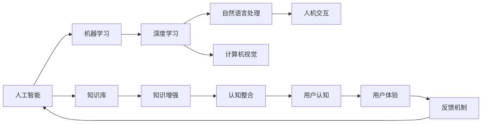

                 

# 人机协作：增强人类认知能力

> 关键词：人机协作, 认知增强, 人工智能, 算法优化, 模型训练, 用户体验

## 1. 背景介绍

在信息化高速发展的今天，人类认知能力的提升，已经无法单纯依靠传统的知识获取和积累方式。信息爆炸时代，如何高效、准确地处理海量数据，将信息转化为知识，成为了当前面临的重大挑战。人工智能（AI）技术作为当今时代的重要工具，通过对大数据的挖掘和分析，帮助人类更好地理解和运用信息，在各个领域展现出了巨大的潜力。

### 1.1 问题由来

近年来，人工智能技术取得了飞速发展，尤其在深度学习领域，通过大规模数据训练的神经网络模型，已经成为解决复杂问题的重要工具。然而，传统的机器学习方式，往往以自动化、符号化的视角处理信息，难以在复杂语义处理和推理上取得突破。

人机协作作为一种新型的认知增强方式，通过结合人工智能的强大计算能力和人类的认知理解，将AI技术与人类智慧相结合，进一步提升人类认知能力，特别是在语言理解、知识整合和创造性思维等方面。本文章将深入探讨人机协作原理与实践，以及其在不同应用场景中的应用，探索未来发展趋势与挑战。

### 1.2 问题核心关键点

人机协作的核心在于：如何构建高效、互动的AI系统，与人类用户建立紧密联系，从而实现数据的处理、知识的整合与创造性的生成。具体来说，包括以下几个关键点：

- 人机界面设计：通过优化用户界面，增强用户与AI系统的交互体验。
- 数据驱动的决策：利用机器学习算法，对大数据进行分析和决策，为人类提供精准信息。
- 知识共享与协同：通过AI模型学习人类知识，同时将AI算法生成的知识反哺人类，实现人机知识的双向互动。
- 可解释性与透明度：提升AI模型的可解释性，使人类用户能够理解和信任AI的决策过程。
- 安全性与伦理性：确保AI系统的安全性与伦理性，避免有害信息的传播与滥用。

这些核心点共同构成了人机协作的基石，为人类认知能力的提升提供了新的视角和工具。

## 2. 核心概念与联系

### 2.1 核心概念概述

为更好地理解人机协作的原理，我们首先介绍几个关键概念及其联系：

- 人工智能（Artificial Intelligence, AI）：通过计算机模拟人类智能，实现对复杂问题的自动化处理。
- 机器学习（Machine Learning, ML）：利用算法和统计模型，通过数据学习，实现对未知数据的预测和分类。
- 深度学习（Deep Learning, DL）：一类基于神经网络的机器学习方法，具有强大的非线性拟合能力。
- 自然语言处理（Natural Language Processing, NLP）：通过计算机技术，使计算机具备理解和处理人类语言的能力。
- 计算机视觉（Computer Vision, CV）：使计算机能够理解和处理图像信息，实现图像识别、分割等功能。
- 人机交互（Human-Computer Interaction, HCI）：研究如何增强用户与计算机的交互体验，使机器能够更好地理解人类需求。

这些概念之间存在紧密联系，通过数据驱动和算法优化，AI技术可以有效地处理、整合、应用各种形式的信息，为人类认知能力的提升提供有力支撑。

### 2.2 核心概念原理和架构的 Mermaid 流程图



这个流程图展示了人工智能与各种概念之间的联系，强调了数据、算法、模型和人类认知的相互作用与协同。

## 3. 核心算法原理 & 具体操作步骤

### 3.1 算法原理概述

人机协作的算法原理，基于深度学习、自然语言处理等技术，通过构建复杂模型，实现对人类认知的理解与增强。其核心在于：

- 利用大规模语料进行预训练，使模型具备强大的语言理解和生成能力。
- 通过监督学习或强化学习等手段，对模型进行微调，使其在特定任务上达到最佳效果。
- 引入正则化、对抗训练等技术，提高模型的泛化能力和鲁棒性。
- 采用知识图谱、逻辑规则等手段，增强模型的知识整合与推理能力。
- 设计互动界面，提升用户与AI系统的交互体验，增强系统的人性化。

### 3.2 算法步骤详解

基于上述原理，人机协作的算法步骤通常包括以下几个方面：

**Step 1: 数据准备与预处理**

- 收集大量人类认知相关的数据，包括文本、图像、音频等。
- 进行数据清洗、归一化、特征提取等预处理操作。
- 构建数据集，分为训练集、验证集和测试集，确保数据分布的代表性。

**Step 2: 模型选择与构建**

- 选择合适的深度学习模型，如Transformer、RNN等。
- 设计任务适配层，根据具体应用场景，选择相应的输出层和损失函数。
- 使用预训练的模型或数据进行迁移学习，减少模型训练的时间和数据量。

**Step 3: 模型训练与优化**

- 利用梯度下降等优化算法，对模型进行训练。
- 在训练过程中，定期在验证集上评估模型性能，调整超参数。
- 采用正则化、Dropout、Early Stopping等技术，防止过拟合。
- 引入对抗训练、数据增强等技术，提高模型鲁棒性。

**Step 4: 模型评估与部署**

- 在测试集上评估模型性能，对比训练前后的提升情况。
- 将优化后的模型部署到实际应用环境中，进行实时推理和用户交互。
- 定期收集用户反馈，对模型进行迭代优化。

### 3.3 算法优缺点

人机协作的算法有以下优点：

- 高效处理复杂数据：通过深度学习模型，可以高效处理海量数据，提取特征和规律。
- 知识整合与推理：结合知识图谱和逻辑规则，实现知识的整合与推理，提升认知能力。
- 提升用户体验：设计互动界面，增强用户体验，使AI系统更加人性化。

然而，该算法也存在以下缺点：

- 数据依赖性强：需要大量高质量的数据进行训练，数据获取成本高。
- 算法复杂度高：深度学习模型复杂，训练时间长，资源需求大。
- 可解释性差：AI系统的决策过程黑箱化，难以解释。
- 安全性风险：模型可能学习到有害信息，导致伦理风险。

### 3.4 算法应用领域

人机协作的算法已在多个领域得到广泛应用：

- 医疗诊断：结合医学知识图谱，帮助医生进行精准诊断。
- 教育辅助：通过自然语言处理和知识整合，为学生提供个性化教育资源。
- 智能客服：利用语言模型和情感分析，提供自然流畅的对话服务。
- 金融分析：结合大数据分析，提供精准的金融预测和风险控制。
- 新闻推荐：通过用户行为数据，提供个性化新闻推荐服务。
- 智能安防：通过图像和视频分析，提升安防系统的智能识别能力。

这些应用场景展示了人机协作在提升人类认知能力方面的巨大潜力。

## 4. 数学模型和公式 & 详细讲解 & 举例说明

### 4.1 数学模型构建

在人机协作的算法中，数学模型构建是非常重要的环节。常用的数学模型包括：

- 神经网络：用于特征提取和模式识别。
- 卷积神经网络（CNN）：用于图像处理和分类。
- 循环神经网络（RNN）：用于序列数据处理和语言生成。
- 注意力机制：用于提高模型对关键信息的关注度。
- 强化学习：用于优化决策过程。

### 4.2 公式推导过程

以下以卷积神经网络（CNN）为例，介绍其基本公式和推导过程：

卷积神经网络由多个卷积层和池化层组成。假设输入数据的维度为 $I$，卷积核的维数为 $K$，卷积层的输出维度为 $O$，步长为 $S$，填充方式为 $P$。则卷积层的公式推导如下：

$$
H_{ij}=\sum_{k=0}^{K-1}\sum_{m=0}^{M-1}\sum_{n=0}^{N-1} W_{kmn}I_{ijs+m+n\cdot S-k+P}
$$

其中 $W$ 为卷积核，$I$ 为输入数据，$H$ 为卷积层的输出数据。

### 4.3 案例分析与讲解

以智能客服系统为例，分析其背后的数学模型和推导过程。

假设输入为客户的文本描述，输出为目标回答。系统构建一个简单的循环神经网络模型，将输入文本映射到向量表示，并通过多层循环神经网络进行语义理解和生成回答。模型的输入为 $x$，输出为 $y$。

- 首先，将输入文本 $x$ 转换为向量表示 $z$。
- 通过多层循环神经网络，将向量 $z$ 映射到目标向量 $y$。
- 最后，通过Softmax函数将目标向量 $y$ 映射到概率分布，选择最大概率的词汇作为回答。

## 5. 项目实践：代码实例和详细解释说明

### 5.1 开发环境搭建

要实现人机协作的算法，首先需要搭建一个适合开发的开发环境。以下是一个Python开发环境的配置流程：

1. 安装Anaconda：从官网下载并安装Anaconda，用于创建独立的Python环境。
2. 创建并激活虚拟环境：
```bash
conda create -n my_env python=3.8 
conda activate my_env
```
3. 安装所需的库：
```bash
conda install torch torchvision torchaudio 
pip install transformers 
pip install pytorch-lightning
```

### 5.2 源代码详细实现

以下是一个基于Transformer模型的人机协作代码实现，用于智能客服系统：

```python
from transformers import BertTokenizer, BertForTokenClassification
from pytorch_lightning import LightningModule, Trainer
import torch

class CustomerServiceModule(LightningModule):
    def __init__(self, num_labels):
        super(CustomerServiceModule, self).__init__()
        self.tokenizer = BertTokenizer.from_pretrained('bert-base-cased')
        self.model = BertForTokenClassification.from_pretrained('bert-base-cased', num_labels=num_labels)
        self.total_loss = 0
    
    def forward(self, input_ids, attention_mask, labels):
        output = self.model(input_ids, attention_mask=attention_mask, labels=labels)
        loss = output.loss
        self.total_loss += loss.item()
        return output
    
    def training_step(self, batch, batch_idx):
        input_ids, attention_mask, labels = batch['input_ids'], batch['attention_mask'], batch['labels']
        output = self(input_ids, attention_mask, labels)
        loss = output.loss
        return loss
    
    def configure_optimizers(self):
        return torch.optim.Adam(self.parameters(), lr=2e-5)

    def train_dataloader(self):
        train_dataset = ...
        return DataLoader(train_dataset, batch_size=16)

    def validation_dataloader(self):
        dev_dataset = ...
        return DataLoader(dev_dataset, batch_size=16)

    def test_dataloader(self):
        test_dataset = ...
        return DataLoader(test_dataset, batch_size=16)
```

### 5.3 代码解读与分析

**CustomerServiceModule类**：
- `__init__`方法：初始化分词器和预训练模型。
- `forward`方法：定义模型的前向传播过程。
- `training_step`方法：定义训练步的计算逻辑。
- `configure_optimizers`方法：定义优化器及其参数。
- `train_dataloader`方法：定义训练集的加载器。
- `validation_dataloader`方法：定义验证集的加载器。
- `test_dataloader`方法：定义测试集的加载器。

**训练过程**：
- 利用PyTorch Lightning进行模型训练。
- 将训练集、验证集、测试集加载器传入模型。
- 定义优化器及其学习率。
- 定义训练轮数、批大小等训练参数。
- 在训练过程中，不断更新模型参数。
- 在验证集上评估模型性能。
- 在测试集上评估最终模型效果。

## 6. 实际应用场景

### 6.1 医疗诊断

在医疗领域，AI技术可以结合医学知识图谱，帮助医生进行精准诊断。通过输入患者症状和医学历史数据，AI系统能够推荐可能病因，并辅助医生进行进一步诊断和治疗方案选择。

### 6.2 教育辅助

AI技术可以通过自然语言处理和知识整合，为学生提供个性化教育资源。例如，智能辅导系统能够根据学生的学习情况，提供针对性的学习建议和课程推荐，提升学习效果。

### 6.3 智能客服

智能客服系统通过自然语言处理和对话生成技术，提供自然流畅的对话服务。系统能够理解用户意图，并提供相应的回答，提升用户体验。

### 6.4 金融分析

AI技术结合大数据分析，提供精准的金融预测和风险控制。例如，金融推荐系统能够根据用户行为数据，提供个性化的投资建议和理财方案。

### 6.5 新闻推荐

通过用户行为数据，AI系统能够提供个性化的新闻推荐服务。例如，智能新闻系统能够根据用户兴趣，推荐相关新闻，提升用户阅读体验。

### 6.6 智能安防

AI技术通过图像和视频分析，提升安防系统的智能识别能力。例如，智能监控系统能够自动识别异常行为，及时预警，提升安全防范能力。

## 7. 工具和资源推荐

### 7.1 学习资源推荐

为了帮助开发者系统掌握人机协作的算法与实践，这里推荐一些优质的学习资源：

1. 《深度学习》书籍：由Ian Goodfellow等著，系统介绍了深度学习的基本原理和应用场景。
2. 《自然语言处理综论》书籍：由Daniel Jurafsky和James H. Martin等著，全面介绍了自然语言处理的理论和方法。
3. 《人工智能：现代方法》书籍：由Russell和Norvig著，系统介绍了人工智能的各个分支和应用。
4. 斯坦福大学CS224N课程：斯坦福大学开设的NLP明星课程，涵盖自然语言处理的各个方面。
5. DeepLearning.ai：由Andrew Ng创立的在线学习平台，提供深度学习相关的课程和实践项目。
6. Kaggle平台：数据科学竞赛平台，提供大量数据集和算法竞赛，锻炼实践能力。

通过这些资源的学习实践，相信你一定能够快速掌握人机协作的算法与实践，并用于解决实际的NLP问题。

### 7.2 开发工具推荐

高效的开发离不开优秀的工具支持。以下是几款用于人机协作开发的常用工具：

1. PyTorch：基于Python的开源深度学习框架，灵活动态的计算图，适合快速迭代研究。
2. TensorFlow：由Google主导开发的开源深度学习框架，生产部署方便，适合大规模工程应用。
3. HuggingFace Transformers库：用于NLP任务开发的库，集成了多种预训练模型，支持丰富的自然语言处理任务。
4. PyTorch Lightning：基于PyTorch的深度学习框架，提供高效的模型训练和管理。
5. TensorBoard：TensorFlow配套的可视化工具，实时监测模型训练状态，提供丰富的图表呈现方式。
6. Weights & Biases：模型训练的实验跟踪工具，记录和可视化模型训练过程中的各项指标。

合理利用这些工具，可以显著提升人机协作任务的开发效率，加快创新迭代的步伐。

### 7.3 相关论文推荐

人机协作的研究源于学界的持续研究。以下是几篇奠基性的相关论文，推荐阅读：

1. AlphaGo论文：DeepMind开发的AlphaGo系统，结合深度学习和强化学习，在围棋比赛中取得了突破。
2. Attention is All You Need论文：谷歌开发的Transformer模型，基于自注意力机制，实现了高质量的自然语言处理。
3. GPT-2论文：OpenAI开发的GPT-2模型，通过大规模数据训练，实现了强大的自然语言生成能力。
4. BERT论文：Google开发的BERT模型，结合掩码自监督预训练和微调，刷新了多项NLP任务SOTA。
5. ELMo论文：Stanford大学开发的ELMo模型，通过双向上下文表示学习，提升了语言模型的能力。
6. Attention is All You Need for Speech论文：谷歌开发的Attention模型，结合语音处理和自然语言处理，实现了高质量的语音识别和生成。

这些论文代表了大规模人机协作技术的发展脉络，推动了AI技术在各个领域的应用。

## 8. 总结：未来发展趋势与挑战

### 8.1 总结

本文对基于深度学习的人机协作算法进行了全面系统的介绍。首先阐述了人机协作的研究背景和意义，明确了AI技术在提升人类认知能力方面的独特价值。其次，从原理到实践，详细讲解了人机协作的数学模型和操作步骤，给出了具体的代码实现。同时，本文还广泛探讨了人机协作在医疗、教育、金融、新闻、安防等领域的实际应用，展示了其在提升人类认知能力方面的巨大潜力。此外，本文精选了人机协作技术的各类学习资源，力求为读者提供全方位的技术指引。

通过本文的系统梳理，可以看到，人机协作技术正在成为提升人类认知能力的重要工具。这些技术的应用，不仅能够大幅提升人类认知的效率和准确性，还能够为教育、医疗、金融等高风险领域提供精准的服务和决策支持。未来，伴随AI技术的持续进步，人机协作必将在更多领域得到应用，为人类社会的发展带来新的突破。

### 8.2 未来发展趋势

展望未来，人机协作技术将呈现以下几个发展趋势：

1. 多模态协同：将视觉、语音、文本等多种模态数据进行融合，实现更全面、更高效的信息处理。
2. 认知增强：结合符号化知识和机器学习，增强认知推理能力，实现更复杂的决策和判断。
3. 人机协同：通过交互界面设计，提升人机互动体验，使AI系统更加人性化。
4. 跨领域应用：将人机协作技术应用到更多领域，如交通、物流、环境等，提升各行业的智能化水平。
5. 跨学科融合：结合心理学、社会学、伦理学等多学科知识，提升人机协作系统的伦理性和可解释性。

这些趋势凸显了人机协作技术的广阔前景，为人类认知能力的提升提供了新的视角和工具。

### 8.3 面临的挑战

尽管人机协作技术已经取得了瞩目成就，但在迈向更加智能化、普适化应用的过程中，仍面临诸多挑战：

1. 数据获取与标注：高质量数据获取和标注成本高，难以满足大规模训练需求。
2. 模型复杂度：深度学习模型复杂，训练时间长，资源需求大。
3. 模型可解释性：AI系统的决策过程黑箱化，难以解释。
4. 安全性风险：模型可能学习到有害信息，导致伦理风险。
5. 技术壁垒：需要跨学科知识，技术门槛高，难以普及应用。

这些挑战需要学界和产业界共同努力，积极应对并寻求突破，才能让人机协作技术更好地服务于人类社会。

### 8.4 研究展望

面对人机协作技术所面临的挑战，未来的研究需要在以下几个方面寻求新的突破：

1. 数据增强与自监督学习：利用自监督学习技术，减少对标注数据的依赖。
2. 模型压缩与优化：开发高效、轻量级的模型结构，提高推理效率。
3. 知识图谱与逻辑规则：结合知识图谱和逻辑规则，增强模型推理能力。
4. 交互界面设计：设计更加自然、直观的交互界面，提升用户体验。
5. 伦理与安全性：研究如何提升模型的伦理性和安全性，保障应用场景的可靠性。

这些研究方向的探索，必将引领人机协作技术迈向更高的台阶，为构建安全、可靠、可解释、可控的智能系统铺平道路。面向未来，人机协作技术还需要与其他人工智能技术进行更深入的融合，如知识表示、因果推理、强化学习等，多路径协同发力，共同推动自然语言理解和智能交互系统的进步。只有勇于创新、敢于突破，才能不断拓展人机协作的边界，让人工智能更好地造福人类社会。

## 9. 附录：常见问题与解答

**Q1：人机协作中的深度学习模型是如何构建的？**

A: 深度学习模型通常由多个层组成，包括卷积层、池化层、全连接层等。在构建模型时，需要选择合适的层数、每层的神经元个数、激活函数等超参数。以卷积神经网络为例，模型由多个卷积层、池化层和全连接层组成。

**Q2：如何提升深度学习模型的泛化能力？**

A: 提升深度学习模型的泛化能力，通常需要以下几种策略：
1. 数据增强：通过对训练数据进行旋转、裁剪、缩放等变换，扩充数据集。
2. 正则化：通过L2正则化、Dropout等方法，防止过拟合。
3. 对抗训练：通过对抗样本训练，提高模型的鲁棒性。
4. 批标准化：通过对数据进行标准化，加速模型的收敛。
5. 迁移学习：利用预训练模型进行微调，提升泛化能力。

**Q3：人机协作中的自然语言处理技术有哪些？**

A: 人机协作中的自然语言处理技术包括：
1. 文本分类：将文本分类为不同的类别。
2. 文本生成：生成自然流畅的文本。
3. 命名实体识别：识别文本中的人名、地名等实体。
4. 机器翻译：将一种语言的文本翻译成另一种语言。
5. 情感分析：分析文本的情感倾向。
6. 问答系统：根据用户问题，提供相应的回答。

**Q4：人机协作中的数据预处理包括哪些步骤？**

A: 数据预处理通常包括以下几个步骤：
1. 数据清洗：去除噪声、处理缺失值。
2. 数据归一化：将数据转化为标准格式。
3. 特征提取：将文本、图像等数据转化为数值特征。
4. 数据增强：通过旋转、裁剪等方法，扩充数据集。
5. 数据划分：将数据集划分为训练集、验证集和测试集。

**Q5：人机协作中的交互界面设计需要注意哪些问题？**

A: 交互界面设计需要注意以下几个问题：
1. 用户友好：界面应简洁、直观，用户易于理解和使用。
2. 响应速度：系统应快速响应用户操作，保证用户体验。
3. 可访问性：界面应无障碍，适合各类用户使用。
4. 可定制性：用户应能自定义界面布局和功能。

---

作者：禅与计算机程序设计艺术 / Zen and the Art of Computer Programming

