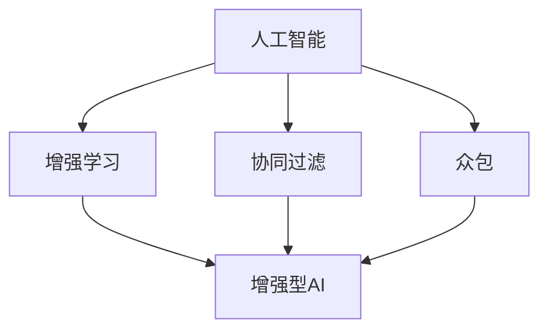

                 

# 人类-AI协作：增强人类潜能与AI能力的协作

## 1. 背景介绍

随着人工智能(AI)技术的飞速发展，人类与AI的协作已经进入了一个新的时代。AI不仅在解决复杂问题、提高工作效率方面表现出色，还能为人类赋能，增强人类的潜能。本文将探讨人类-AI协作的原理、方法和应用场景，帮助读者更好地理解这种新型协作关系，并探索其未来发展趋势与面临的挑战。

### 1.1 问题由来
人类-AI协作的概念源于早期人工智能的探索，特别是符号主义AI的发展。然而，随着机器学习的兴起，特别是深度学习和大规模预训练语言模型的突破，人类-AI协作进入了一个新的阶段。这种协作不仅仅局限于知识型任务，如问答、翻译等，更扩展到了创造性任务，如艺术创作、写作、设计等。AI技术通过辅助、替代甚至补充人类，正在重塑许多行业和领域。

### 1.2 问题核心关键点
人类-AI协作的核心在于如何构建一种高效的、透明的、可解释的协作机制。这包括：

- **高效性**：AI应该能快速执行重复性任务，减少人类工作负担。
- **透明性**：AI的工作过程应可解释，使人类能够理解其决策依据。
- **可解释性**：AI的输出应可解释，帮助人类理解和信任AI的决策。
- **协作性**：AI应能与人类形成良好的互动，共同完成复杂任务。

## 2. 核心概念与联系

### 2.1 核心概念概述

在探讨人类-AI协作之前，我们需要先理解几个核心概念：

- **人工智能(AI)**：通过计算机算法和数据训练实现的一系列智能行为，包括感知、学习、推理、规划等。
- **增强学习(Reinforcement Learning, RL)**：一种机器学习方法，通过与环境的交互来学习最优策略，优化决策过程。
- **协同过滤(Collaborative Filtering)**：一种基于用户或项目相似性的推荐算法，常用于个性化推荐系统。
- **众包(Crowdsourcing)**：一种利用大量在线工作者的方式来完成任务，常用于数据分析、标注等。
- **增强型AI(Augmented Intelligence, AI-augmented)**：一种利用AI技术辅助人类完成工作的方法，提升人类工作效率和质量。

这些概念之间的逻辑关系可以通过以下Mermaid流程图来展示：



这个流程图展示了人工智能技术的多个子领域，以及这些技术如何通过增强学习、协同过滤、众包等方式增强人类能力，最终形成增强型AI。

## 3. 核心算法原理 & 具体操作步骤
### 3.1 算法原理概述

人类-AI协作的核心原理可以总结为以下几点：

- **任务分解**：将复杂任务分解为可被AI处理的子任务，AI负责执行这些子任务。
- **数据融合**：将AI处理的数据与人类专业知识相结合，形成更有价值的输出。
- **协同优化**：AI与人类共同优化任务执行过程，提高整体效率和效果。

### 3.2 算法步骤详解

基于上述原理，人类-AI协作的典型操作步骤包括：

1. **任务定义**：明确任务目标和需求，将任务拆解为多个子任务。
2. **AI模型选择**：根据任务特点选择合适的AI模型，如深度学习、强化学习、自然语言处理等。
3. **数据准备**：收集并准备任务所需的数据，进行清洗、标注等处理。
4. **模型训练**：使用标注数据对AI模型进行训练，优化模型参数。
5. **人机交互**：在AI模型基础上，设计人机交互界面，使人类能够与AI模型互动。
6. **效果评估**：对AI模型的输出进行评估，根据反馈进行调整。
7. **迭代优化**：不断迭代优化模型和人机交互界面，提升整体协作效果。

### 3.3 算法优缺点

人类-AI协作的优点包括：

- **提升效率**：AI可以自动执行重复性、高负荷任务，解放人类精力。
- **增强能力**：AI补充人类在知识、计算等方面的不足，提升整体能力。
- **优化决策**：AI能够提供多角度的决策建议，帮助人类做出更优决策。

但这种协作方式也存在一些缺点：

- **依赖性强**：人类对AI的依赖可能会导致自身能力的退化。
- **技术壁垒高**：AI技术复杂，需要专业知识才能有效应用。
- **伦理问题**：AI的决策和输出需要符合人类价值观，避免伦理风险。

### 3.4 算法应用领域

人类-AI协作已经在多个领域得到了广泛应用，包括：

- **医疗健康**：AI辅助诊断、治疗方案推荐、药物研发等。
- **金融行业**：AI风险评估、投资策略制定、客户服务等。
- **教育培训**：AI个性化推荐、智能辅导、学习效果分析等。
- **娱乐文化**：AI内容生成、剧本创作、情感分析等。
- **制造业**：AI流程自动化、质量检测、供应链优化等。

## 4. 数学模型和公式 & 详细讲解 & 举例说明

### 4.1 数学模型构建

人类-AI协作的数学模型可以分解为以下几个部分：

1. **任务定义模型**：将任务抽象为数学模型，如用数学公式描述问题。
2. **AI模型**：选择合适的AI模型，如神经网络、深度学习等，并设置参数。
3. **人机交互模型**：设计人机交互界面，如用户界面(UI)、自然语言处理(NLP)等。
4. **协同优化模型**：建立人机协同优化模型，如遗传算法、强化学习等。

### 4.2 公式推导过程

以机器翻译为例，我们可以用以下公式表示其数学模型：

$$
\begin{aligned}
&y^* = \arg\min_{y} \mathcal{L}(y, t(x)) \\
&\mathcal{L}(y, t(x)) = \frac{1}{n}\sum_{i=1}^n [(y_i - y_{i,\text{ref}})^2 + \lambda ||y - \overline{y}||^2]
\end{aligned}
$$

其中，$y$ 表示翻译结果，$x$ 表示原始文本，$t$ 表示翻译模型，$\text{ref}$ 表示参考翻译结果，$\overline{y}$ 表示所有参考翻译结果的平均值。

### 4.3 案例分析与讲解

以Google的翻译模型为例，Google利用深度学习技术，通过大规模语料库训练出翻译模型，并结合人类语言学家的专业知识，不断优化模型。用户可以通过Google Translate进行翻译，而AI模型会根据上下文自动调整翻译策略，减少错误。这种协同优化方式，使得Google Translate在准确率和速度上都有显著提升。

## 5. 项目实践：代码实例和详细解释说明

### 5.1 开发环境搭建

要在Python中进行人类-AI协作的实践，需要搭建好开发环境。以下是Python开发环境的搭建步骤：

1. 安装Anaconda：从官网下载并安装Anaconda，用于创建独立的Python环境。

2. 创建并激活虚拟环境：
```bash
conda create -n ai-env python=3.7 
conda activate ai-env
```

3. 安装必要的Python包：
```bash
pip install numpy scipy pandas scikit-learn torch torchvision transformers
```

4. 安装机器学习框架：
```bash
pip install sklearn
```

完成以上步骤后，即可在`ai-env`环境中进行AI协作实践。

### 5.2 源代码详细实现

我们以Google Translate为例，实现一个简单的机器翻译模型：

```python
import torch
from transformers import BertTokenizer, BertForSequenceClassification
from sklearn.metrics import accuracy_score

# 加载预训练模型和分词器
tokenizer = BertTokenizer.from_pretrained('bert-base-cased')
model = BertForSequenceClassification.from_pretrained('bert-base-cased', num_labels=2)

# 加载训练数据和测试数据
train_data = ...
test_data = ...

# 数据预处理
def tokenize_and_create_input_ids(texts, tokenizer):
    return tokenizer(texts, return_tensors='pt', padding=True, truncation=True, max_length=512)

# 训练模型
device = torch.device('cuda' if torch.cuda.is_available() else 'cpu')
model.to(device)
optimizer = torch.optim.Adam(model.parameters(), lr=1e-5)
loss_fn = torch.nn.CrossEntropyLoss()

for epoch in range(10):
    for i, batch in enumerate(train_loader):
        input_ids = batch['input_ids'].to(device)
        attention_mask = batch['attention_mask'].to(device)
        labels = batch['labels'].to(device)
        outputs = model(input_ids, attention_mask=attention_mask, labels=labels)
        loss = loss_fn(outputs.logits, labels)
        optimizer.zero_grad()
        loss.backward()
        optimizer.step()
        if i % 100 == 0:
            print(f'Epoch {epoch+1}, Step {i}, Loss: {loss.item()}')

# 测试模型
model.eval()
with torch.no_grad():
    predictions, true_labels = [], []
    for batch in test_loader:
        input_ids = batch['input_ids'].to(device)
        attention_mask = batch['attention_mask'].to(device)
        labels = batch['labels'].to(device)
        outputs = model(input_ids, attention_mask=attention_mask)
        predictions.append(outputs.logits.argmax(dim=1).tolist())
        true_labels.append(labels.tolist())
    print(f'Accuracy: {accuracy_score(true_labels, predictions)}')
```

### 5.3 代码解读与分析

上述代码实现了使用Bert模型进行机器翻译的简单实践。关键步骤包括：

- **数据预处理**：将原始文本转换为模型可处理的输入，并进行padding和truncation。
- **模型训练**：在GPU上训练模型，使用Adam优化器进行参数更新，使用交叉熵损失函数进行优化。
- **模型测试**：在测试集上评估模型性能，计算准确率。

## 6. 实际应用场景

### 6.1 智能医疗

在医疗领域，AI可以辅助医生进行诊断、治疗方案推荐、药物研发等工作。例如，IBM Watson使用深度学习算法，通过分析大量医疗数据，为医生提供诊断建议和治疗方案。这不仅提高了诊断的准确性，还能显著减少医生的工作量。

### 6.2 金融风控

金融行业利用AI进行风险评估和投资策略制定。例如，贝叶斯网络模型结合大数据分析，可以预测市场趋势，提供投资建议，降低投资风险。AI还能自动化处理金融文档，提取关键信息，提高工作效率。

### 6.3 教育培训

在教育领域，AI可以用于个性化学习推荐、智能辅导、学习效果分析等。例如，Khan Academy使用AI技术，根据学生的学习情况，推荐相应的学习资源，提高学习效果。此外，AI还能进行作业批改，提供实时反馈，帮助学生更好地掌握知识。

### 6.4 娱乐文化

在娱乐文化领域，AI可以用于内容生成、剧本创作、情感分析等。例如，Netflix使用AI技术，分析用户观看数据，推荐相应的影片和电视剧，提升用户观看体验。AI还能自动生成新闻报道、音乐歌词，甚至进行剧本创作。

### 6.5 制造业

在制造业领域，AI可以用于流程自动化、质量检测、供应链优化等。例如，GE利用AI技术，实时监控设备状态，预测故障，提前进行维护，减少停机时间。AI还能优化供应链管理，降低成本，提高效率。

## 7. 工具和资源推荐

### 7.1 学习资源推荐

以下是一些优质的学习资源，帮助读者系统掌握人类-AI协作的原理和实践方法：

1. 《深度学习》书籍：Ian Goodfellow等人著，全面介绍了深度学习的基础理论和应用实践，包括神经网络、深度学习等。
2. 《强化学习》书籍：Richard S. Sutton等人著，详细讲解了强化学习的原理和算法，适合深入学习。
3. 《Python机器学习》书籍：Sebastian Raschka著，介绍了使用Python进行机器学习的全流程，适合初学者。
4. Coursera课程：Coursera上有多门优秀的人工智能课程，涵盖深度学习、强化学习、自然语言处理等。
5. Kaggle竞赛：Kaggle上定期举办各类机器学习竞赛，通过实践提升技能。

通过学习这些资源，读者可以全面掌握人类-AI协作的理论基础和实践技巧。

### 7.2 开发工具推荐

以下是一些常用的开发工具，帮助开发者高效进行人类-AI协作的实践：

1. Python：Python是当前最流行的编程语言之一，拥有丰富的机器学习库和工具。
2. PyTorch：PyTorch是深度学习领域的领先框架，支持动态计算图，易于使用。
3. TensorFlow：TensorFlow是另一个广泛使用的深度学习框架，支持分布式计算。
4. Jupyter Notebook：Jupyter Notebook是一个交互式编程环境，适合进行数据分析和模型调试。
5. Visual Studio Code：Visual Studio Code是一个轻量级的编辑器，支持代码高亮、版本控制等功能。

这些工具可以帮助开发者快速搭建环境、编写代码、调试模型，提高工作效率。

### 7.3 相关论文推荐

以下是一些具有代表性的相关论文，帮助读者深入理解人类-AI协作的研究进展：

1. "Human-AI Collaboration in Healthcare: A Review" by Martínez et al.，详细回顾了AI在医疗健康领域的应用，探讨了AI与人类的协作机制。
2. "Deep Reinforcement Learning in Healthcare: A Survey" by Kumar et al.，综述了深度强化学习在医疗健康领域的应用，包括诊断、治疗、预测等。
3. "Augmented Human-Centered Design: Supporting and Enhancing Human Capabilities with AI" by Aitken et al.，探讨了AI技术如何增强人类在各个领域的能力。
4. "Human-AI Collaboration in the Retail Sector: A Case Study of Amazon" by Maxey et al.，通过亚马逊的案例，展示了AI在零售行业的应用和效果。
5. "Human-AI Collaboration in the Financial Industry: A Survey" by Shang et al.，综述了AI在金融行业的应用，包括风险管理、投资策略等。

这些论文帮助读者全面了解人类-AI协作的理论基础和实践案例。

## 8. 总结：未来发展趋势与挑战

### 8.1 研究成果总结

本文从原理到实践，全面介绍了人类-AI协作的各个方面。通过分析其核心概念和应用场景，探讨了人类-AI协作的优点和挑战。我们总结了当前的研究进展和应用实践，为读者提供了全面的参考。

### 8.2 未来发展趋势

未来，人类-AI协作将继续深入多个领域，展现出广阔的应用前景。以下是最可能的发展趋势：

1. **智能决策支持**：AI将提供更加智能的决策支持，帮助人类做出更好的决策。
2. **个性化服务**：AI将实现更加个性化的服务，满足不同用户的需求。
3. **多模态融合**：AI将融合多模态数据，提供更全面的信息支持。
4. **跨领域应用**：AI将应用于更多领域，如制造业、农业等。
5. **实时协作**：AI将实现实时协作，提高整体效率和效果。

### 8.3 面临的挑战

尽管人类-AI协作具有广泛的应用前景，但仍然面临以下挑战：

1. **数据隐私**：AI需要大量数据进行训练，如何保护用户隐私是一个重要问题。
2. **伦理规范**：AI的决策需要符合人类价值观，避免伦理风险。
3. **技术壁垒**：AI技术复杂，需要专业知识才能有效应用。
4. **协同机制**：如何建立高效的人机协同机制，需要进一步研究。
5. **可解释性**：AI的输出需要可解释，帮助人类理解和信任AI的决策。

### 8.4 研究展望

未来，人类-AI协作的研究将继续深入，探索更加智能、高效、可解释的协作机制。以下是我们对未来研究展望的几点思考：

1. **多模态协作**：探索多模态数据的融合，提升整体协作效果。
2. **跨领域应用**：研究AI在更多领域的协作应用，如农业、制造业等。
3. **实时协同**：实现实时协同，提高整体协作效率。
4. **可解释性**：提升AI的输出可解释性，帮助人类理解和信任AI的决策。
5. **伦理规范**：建立AI的伦理规范，确保AI的决策符合人类价值观。

总之，人类-AI协作将不断发展和进步，为人类提供更加智能、高效、可解释的协作方式，赋能人类潜能，提升整体社会生产力。

## 9. 附录：常见问题与解答

**Q1: 人类-AI协作的优点和缺点有哪些？**

A: 人类-AI协作的优点包括：

- **提升效率**：AI可以自动执行重复性、高负荷任务，解放人类精力。
- **增强能力**：AI补充人类在知识、计算等方面的不足，提升整体能力。
- **优化决策**：AI能够提供多角度的决策建议，帮助人类做出更优决策。

缺点包括：

- **依赖性强**：人类对AI的依赖可能会导致自身能力的退化。
- **技术壁垒高**：AI技术复杂，需要专业知识才能有效应用。
- **伦理问题**：AI的决策和输出需要符合人类价值观，避免伦理风险。

**Q2: 如何进行人类-AI协作的数据准备？**

A: 人类-AI协作的数据准备主要包括以下步骤：

1. **数据收集**：收集与任务相关的数据，如医疗数据、金融数据、教育数据等。
2. **数据清洗**：对数据进行清洗、去重、补全等预处理，确保数据质量。
3. **数据标注**：对数据进行标注，如标记为二分类、多分类、序列标注等。
4. **数据增强**：通过数据增强技术，如回译、近义替换等方式，扩充训练集。
5. **数据融合**：将不同来源的数据进行融合，形成更大规模的训练数据。

**Q3: 如何进行人类-AI协作的模型训练？**

A: 人类-AI协作的模型训练主要包括以下步骤：

1. **选择合适的模型**：根据任务特点选择合适的AI模型，如深度学习、强化学习等。
2. **数据准备**：准备训练数据，并进行预处理。
3. **模型训练**：使用训练数据对模型进行训练，优化模型参数。
4. **超参数调优**：进行超参数调优，找到最佳的模型配置。
5. **模型评估**：在测试数据上评估模型性能，根据评估结果进行调整。

**Q4: 如何进行人类-AI协作的协同优化？**

A: 人类-AI协作的协同优化主要包括以下步骤：

1. **任务分解**：将任务拆解为多个子任务，明确各子任务的目标和输入输出。
2. **模型训练**：对各子任务进行模型训练，优化模型参数。
3. **人机交互**：设计人机交互界面，使人类能够与AI模型互动。
4. **效果评估**：对AI模型的输出进行评估，根据反馈进行调整。
5. **迭代优化**：不断迭代优化模型和人机交互界面，提升整体协作效果。

**Q5: 如何进行人类-AI协作的伦理规范？**

A: 进行人类-AI协作的伦理规范主要包括以下步骤：

1. **伦理审查**：在项目开始前进行伦理审查，确保AI的应用符合伦理标准。
2. **用户同意**：在数据收集和应用过程中，获得用户的明确同意。
3. **隐私保护**：对用户数据进行隐私保护，确保数据安全。
4. **透明性**：确保AI的决策过程透明，可解释，帮助人类理解和信任AI的决策。
5. **监督机制**：建立监督机制，确保AI的决策符合伦理规范。

通过以上步骤，可以有效保护用户的隐私和权益，确保AI应用的伦理规范。

---

作者：禅与计算机程序设计艺术 / Zen and the Art of Computer Programming

