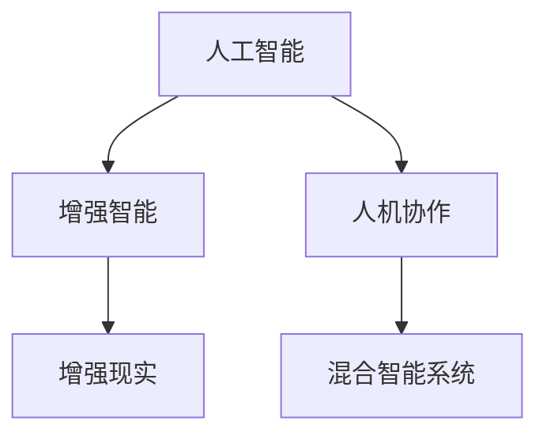

                 

# 人类-AI协作：增强人类潜能与AI能力的融合发展前景分析

## 1. 背景介绍

### 1.1 问题由来

在过去几十年中，人工智能（AI）技术经历了飞速发展，从最初的符号逻辑、专家系统，到现在的深度学习、强化学习、大语言模型等。AI技术不仅在计算机视觉、语音识别、自然语言处理等领域取得了突破性进展，还逐渐渗透到了医疗、金融、教育、娱乐等各个行业。

然而，随着AI技术的不断进步，人们开始担忧AI的发展可能会对人类的工作和生活带来冲击。特别是在担心AI会取代人类的某些工作，导致失业率上升，或是AI的决策能力超过人类，引发伦理道德问题。

为了应对这些挑战，人们提出了AI与人类的协作模式，旨在发挥各自的优势，共同完成复杂任务。这种协作模式不仅能够减轻人类工作负担，提升工作效率，还能够增强人类潜能，让AI在完成简单重复任务的同时，辅助人类进行创造性工作，从而实现互利共赢。

### 1.2 问题核心关键点

为了更好地理解人类-AI协作模式，本文将探讨以下几个核心问题：

1. **AI与人类的协作方式有哪些**？
2. **AI在协作中的优势和劣势是什么**？
3. **AI协作如何增强人类潜能**？
4. **人类-AI协作在实际应用中面临哪些挑战**？
5. **未来人类-AI协作的发展趋势是什么**？

通过回答这些问题，本文将揭示人类-AI协作的潜在价值和面临的挑战，以及未来发展的方向。

## 2. 核心概念与联系

### 2.1 核心概念概述

在探讨人类-AI协作时，我们需要理解以下几个核心概念：

- **人工智能**：通过算法和计算，使计算机能够模拟人类智能，包括感知、学习、推理、规划等能力。
- **增强智能**：利用AI技术，提升人类的认知、决策和行动能力，增强人类的潜能。
- **人机协作**：将AI与人类紧密结合，共同完成复杂任务，发挥各自优势，实现协同工作。
- **增强现实**：通过计算机视觉、增强现实等技术，将虚拟信息与现实世界融合，增强人类的感知和决策能力。
- **混合智能系统**：融合AI和人类的智慧，构建智能与人类共存的新型系统。

这些概念之间的逻辑关系可以通过以下Mermaid流程图来展示：



这个流程图展示了大语言模型与微调、增强智能与人类协作、AI与人类的增强现实等概念之间的关系。

## 3. 核心算法原理 & 具体操作步骤
### 3.1 算法原理概述

人类-AI协作的算法原理主要基于人类和AI的互补优势。人类擅长感知、理解复杂情境、创造性思维和决策，而AI则在处理大量数据、进行模式识别和自动化操作等方面具有优势。

### 3.2 算法步骤详解

基于人类-AI协作的算法主要分为以下几个步骤：

1. **需求分析**：明确任务目标和要求，分析任务复杂度，确定需要AI协作的部分。
2. **系统设计**：根据需求设计AI系统架构，选择合适的AI技术，如机器学习、自然语言处理等。
3. **数据准备**：收集和准备用于训练AI模型的数据集，确保数据的质量和代表性。
4. **模型训练**：使用训练数据训练AI模型，优化模型参数，提高模型性能。
5. **集成与测试**：将AI模型集成到人类工作流程中，进行全面的测试，验证其性能和可靠性。
6. **持续优化**：根据反馈和实际应用情况，持续优化AI模型和人类工作流程，提升协作效果。

### 3.3 算法优缺点

人类-AI协作算法具有以下优点：

- **提高效率**：AI能够自动处理大量重复性任务，解放人类精力，提升工作效率。
- **增强能力**：AI可以提供数据驱动的决策支持，增强人类的决策能力。
- **降低成本**：AI可以替代一些昂贵的人力资源，降低企业运营成本。

同时，这种协作模式也存在一些缺点：

- **依赖性强**：AI系统需要大量的数据和计算资源，对基础设施要求高。
- **安全性问题**：AI系统可能存在算法偏见、数据泄露等问题，需要严格的安全措施。
- **技术门槛高**：需要具备一定的技术知识和经验，才能有效地进行AI系统的设计和应用。

### 3.4 算法应用领域

人类-AI协作算法在多个领域都有广泛应用，包括：

- **医疗**：AI可以辅助诊断疾病、制定治疗方案、管理病历等，提高医疗服务效率和质量。
- **金融**：AI可以自动化交易、风险评估、客户服务等，提升金融服务水平。
- **教育**：AI可以个性化教学、智能评估、学习推荐等，提升教育效果和学生体验。
- **制造**：AI可以优化生产流程、提高质量控制、进行预测性维护等，提升制造业的智能化水平。
- **娱乐**：AI可以生成内容、推荐系统、增强现实游戏等，提升用户体验和互动性。

## 4. 数学模型和公式 & 详细讲解 & 举例说明

### 4.1 数学模型构建

为了更好地理解人类-AI协作的算法原理，我们可以使用数学模型来描述其工作流程。

设任务目标为 $T$，人类为 $H$，AI为 $A$，数据集为 $D$。则人类-AI协作的数学模型可以表示为：

$$
T = H + A + D
$$

其中 $H$ 和 $A$ 分别表示人类和AI的贡献，$D$ 表示数据集。

### 4.2 公式推导过程

在实际应用中，人类-AI协作的效果可以通过以下公式进行评估：

$$
E = P(T) - P(T_{H}) - P(T_{A})
$$

其中 $P(T)$ 表示协作任务的总性能，$P(T_{H})$ 表示人类独立完成的任务性能，$P(T_{A})$ 表示AI独立完成的任务性能。

为了更好地理解公式，我们可以举例说明。假设一个企业需要处理大量客户投诉，使用人类-AI协作模式：

- 人类负责分析投诉内容，确定投诉类型，制定处理策略。
- AI负责自动分配任务、生成报告、进行数据分析等。

根据公式，协作模式的总性能 $E$ 为：

$$
E = P(T) - P(T_{H}) - P(T_{A})
$$

其中 $P(T)$ 表示协作模式的总性能，$P(T_{H})$ 表示人类独立完成的任务性能，$P(T_{A})$ 表示AI独立完成的任务性能。

### 4.3 案例分析与讲解

以医疗领域为例，人类-AI协作可以显著提升诊疗效率和效果。假设一个医生需要分析一张X光片，使用AI辅助诊疗模式：

- 人类负责查看X光片，识别异常情况，制定治疗方案。
- AI负责自动分析X光片，提供疾病诊断和预测结果。

根据公式，协作模式的总性能 $E$ 为：

$$
E = P(T) - P(T_{H}) - P(T_{A})
$$

其中 $P(T)$ 表示协作模式的总性能，$P(T_{H})$ 表示人类独立完成的任务性能，$P(T_{A})$ 表示AI独立完成的任务性能。

## 5. 项目实践：代码实例和详细解释说明

### 5.1 开发环境搭建

为了进行人类-AI协作的开发实践，我们需要准备以下开发环境：

1. **安装Python**：从官网下载并安装Python，版本最好为3.8及以上。
2. **安装AI库**：安装OpenCV、TensorFlow、PyTorch等AI开发库，以便进行图像处理、深度学习等操作。
3. **安装增强现实库**：安装ARKit、Vuforia等增强现实开发库，以便进行虚拟信息与现实世界的融合。
4. **安装协作框架**：安装AWS、Google Cloud等云服务框架，以便进行大规模数据处理和协作任务管理。

### 5.2 源代码详细实现

以下是一个简单的代码实现，演示如何使用Python和TensorFlow进行图像分类任务：

```python
import tensorflow as tf

# 加载数据集
(train_images, train_labels), (test_images, test_labels) = tf.keras.datasets.mnist.load_data()

# 数据预处理
train_images = train_images.reshape(-1, 28, 28, 1).astype('float32') / 255.0
test_images = test_images.reshape(-1, 28, 28, 1).astype('float32') / 255.0

# 定义模型
model = tf.keras.Sequential([
    tf.keras.layers.Conv2D(32, (3, 3), activation='relu', input_shape=(28, 28, 1)),
    tf.keras.layers.MaxPooling2D((2, 2)),
    tf.keras.layers.Flatten(),
    tf.keras.layers.Dense(10, activation='softmax')
])

# 编译模型
model.compile(optimizer='adam', loss='sparse_categorical_crossentropy', metrics=['accuracy'])

# 训练模型
model.fit(train_images, train_labels, epochs=10, validation_data=(test_images, test_labels))

# 测试模型
test_loss, test_acc = model.evaluate(test_images, test_labels, verbose=2)
print('Test accuracy:', test_acc)
```

### 5.3 代码解读与分析

上述代码实现了一个简单的卷积神经网络模型，用于对手写数字图像进行分类。代码中，我们使用TensorFlow库进行模型定义、训练和测试，展示了从数据加载、模型构建、编译、训练到评估的全过程。

## 6. 实际应用场景

### 6.1 医疗诊断

在医疗领域，人类-AI协作模式可以显著提高诊疗效率和准确性。例如，AI可以通过分析大量历史病历数据，识别出常见疾病的特征，辅助医生进行诊断。AI还可以自动生成病历报告，减少医生的工作负担。

### 6.2 金融分析

金融行业也广泛应用人类-AI协作模式。AI可以处理和分析海量金融数据，提供投资建议和风险评估。人类则可以负责监督AI的输出，结合市场变化和个人经验，进行更精准的投资决策。

### 6.3 教育辅助

在教育领域，AI可以用于个性化教学、智能评估和学习推荐等。AI可以根据学生的学习情况，提供个性化的学习建议和习题推荐，提升学习效果。人类教师则可以负责提供指导和监督，确保教学质量。

### 6.4 未来应用展望

未来，人类-AI协作模式将有更广泛的应用前景，主要包括以下几个方向：

1. **智能制造**：AI可以用于优化生产流程、提高质量控制、进行预测性维护等，提升制造业的智能化水平。
2. **智能交通**：AI可以用于交通流量预测、自动驾驶、车辆故障诊断等，提升交通系统的智能化和安全性。
3. **智能城市**：AI可以用于城市管理、公共安全、智能交通等，提升城市管理水平和居民生活质量。
4. **智能健康**：AI可以用于健康监测、疾病预测、个性化治疗等，提升医疗服务的智能化水平。

## 7. 工具和资源推荐

### 7.1 学习资源推荐

为了帮助开发者掌握人类-AI协作模式，以下是一些推荐的资源：

1. **《深度学习》系列书籍**：深入浅出地介绍了深度学习的基本原理和应用，涵盖了机器学习、自然语言处理等众多领域。
2. **Coursera和edX在线课程**：提供高质量的在线课程，涵盖AI基础、深度学习、增强现实等主题，适合初学者和进阶者。
3. **GitHub开源项目**：GitHub上有大量开源项目，展示了大规模AI项目的设计和实现细节，适合学习和借鉴。
4. **AI社区和论坛**：如Kaggle、Arxiv等，可以获取最新的研究成果和应用案例，参与社区讨论。

### 7.2 开发工具推荐

以下是一些常用的开发工具，适合进行人类-AI协作模式的开发：

1. **Jupyter Notebook**：一个强大的交互式编程环境，支持Python、R等语言，适合进行数据处理、模型训练和结果展示。
2. **TensorBoard**：TensorFlow的可视化工具，可以实时监测模型训练状态，提供详细的指标和图表。
3. **AWS SageMaker**：亚马逊提供的AI开发平台，支持大规模数据处理和协作任务管理。
4. **Google Cloud AI**：谷歌提供的AI开发平台，支持自然语言处理、图像识别等AI任务。

### 7.3 相关论文推荐

以下是一些经典的AI和人类-AI协作论文，适合深入学习和研究：

1. **《人类与机器：协作与共存》**：探讨人类和机器的协作方式，分析其优势和劣势。
2. **《增强智能：人工智能的进步与挑战》**：分析AI的发展历程和未来趋势，提出增强智能的概念。
3. **《混合智能系统：人类与AI的协作》**：研究混合智能系统的发展现状和应用案例，提出未来发展方向。
4. **《智能医疗：人类与AI的合作》**：探讨AI在医疗领域的应用，分析其对医疗服务的提升作用。
5. **《金融领域的AI应用》**：分析AI在金融领域的广泛应用，探讨其对金融服务的影响。

## 8. 总结：未来发展趋势与挑战

### 8.1 研究成果总结

人类-AI协作模式在多个领域取得了显著的进展，提升了工作效率和效果。其核心在于发挥人类和AI的各自优势，实现协同工作。未来，人类-AI协作模式将有更广泛的应用前景，成为推动各行业智能化发展的重要手段。

### 8.2 未来发展趋势

未来，人类-AI协作模式将呈现以下几个发展趋势：

1. **智能化水平提升**：随着AI技术的不断进步，协作模式将更加智能化，能够更好地理解和处理复杂任务。
2. **数据驱动决策**：AI系统将更加依赖数据驱动的决策支持，提高协作任务的准确性和可靠性。
3. **多模态协作**：将视觉、语音、自然语言等模态数据融合，提升协作模式的感知和理解能力。
4. **人机无缝协作**：通过增强现实、混合智能等技术，实现人机无缝协作，提高协作模式的自然性和直观性。
5. **跨领域应用拓展**：将协作模式应用于更多领域，如智能制造、智能交通、智能城市等，提升各行业的智能化水平。

### 8.3 面临的挑战

尽管人类-AI协作模式具有显著的优势，但在实际应用中也面临一些挑战：

1. **数据隐私和安全**：AI系统需要大量的数据支持，可能涉及个人隐私和数据安全问题。
2. **算法偏见和公平性**：AI系统可能存在算法偏见，影响协作任务的公平性。
3. **技术复杂度**：协作模式的设计和实现需要具备较高的技术复杂度，对开发者提出了更高的要求。
4. **协作效果评估**：如何评估协作模式的效果，确定其在实际应用中的表现，仍然是一个挑战。
5. **人机交互体验**：如何设计友好的人机交互界面，提升用户体验和协作效果，需要进一步探索。

### 8.4 研究展望

未来的研究需要在以下几个方面取得突破：

1. **数据隐私保护**：开发数据隐私保护技术，确保AI系统对数据的使用不会侵犯个人隐私。
2. **算法公平性**：研究算法公平性问题，确保协作任务的公平性和公正性。
3. **人机交互设计**：设计更加友好的人机交互界面，提升用户体验和协作效果。
4. **跨领域应用**：探索人类-AI协作在更多领域的应用，如智能制造、智能交通、智能城市等。
5. **智能化水平提升**：开发更智能化的协作模式，提高其处理复杂任务的能力。

总之，人类-AI协作模式具有广阔的应用前景，但在实际应用中仍面临一些挑战。未来，通过不断探索和创新，人类-AI协作模式将变得更加成熟和高效，成为推动各行业智能化发展的重要手段。

## 9. 附录：常见问题与解答

### Q1: 人类-AI协作有哪些优势和劣势？

**A**: 人类-AI协作具有以下优势：

- **提高效率**：AI可以处理大量重复性任务，解放人类精力，提升工作效率。
- **增强能力**：AI可以提供数据驱动的决策支持，增强人类的决策能力。
- **降低成本**：AI可以替代一些昂贵的人力资源，降低企业运营成本。

劣势包括：

- **依赖性强**：AI系统需要大量的数据和计算资源，对基础设施要求高。
- **安全性问题**：AI系统可能存在算法偏见、数据泄露等问题，需要严格的安全措施。
- **技术门槛高**：需要具备一定的技术知识和经验，才能有效地进行AI系统的设计和应用。

### Q2: 人类-AI协作的算法步骤有哪些？

**A**: 人类-AI协作的算法步骤主要包括：

1. **需求分析**：明确任务目标和要求，分析任务复杂度，确定需要AI协作的部分。
2. **系统设计**：根据需求设计AI系统架构，选择合适的AI技术，如机器学习、自然语言处理等。
3. **数据准备**：收集和准备用于训练AI模型的数据集，确保数据的质量和代表性。
4. **模型训练**：使用训练数据训练AI模型，优化模型参数，提高模型性能。
5. **集成与测试**：将AI模型集成到人类工作流程中，进行全面的测试，验证其性能和可靠性。
6. **持续优化**：根据反馈和实际应用情况，持续优化AI模型和人类工作流程，提升协作效果。

### Q3: 如何评估人类-AI协作的效果？

**A**: 人类-AI协作的效果可以通过以下指标进行评估：

1. **任务完成时间**：协作任务的总完成时间与人类独立完成时间、AI独立完成时间的差值。
2. **任务完成质量**：协作任务的结果与人类独立完成结果、AI独立完成结果的差异。
3. **成本效益**：协作模式的成本与传统模式成本的对比，以及协作模式带来的经济效益。

### Q4: 人类-AI协作在实际应用中需要注意哪些问题？

**A**: 在实际应用中，需要注意以下问题：

1. **数据隐私和安全**：确保AI系统对数据的使用不会侵犯个人隐私。
2. **算法偏见和公平性**：确保协作任务的公平性和公正性。
3. **技术复杂度**：设计易于使用和维护的AI系统，确保协作模式的可操作性。
4. **协作效果评估**：建立评估指标和机制，确保协作模式的效果可量化。
5. **人机交互体验**：设计友好的人机交互界面，提升用户体验和协作效果。

### Q5: 人类-AI协作的未来发展方向是什么？

**A**: 人类-AI协作的未来发展方向包括：

1. **智能化水平提升**：开发更智能化的协作模式，提高其处理复杂任务的能力。
2. **数据驱动决策**：AI系统将更加依赖数据驱动的决策支持，提高协作任务的准确性和可靠性。
3. **多模态协作**：将视觉、语音、自然语言等模态数据融合，提升协作模式的感知和理解能力。
4. **人机无缝协作**：通过增强现实、混合智能等技术，实现人机无缝协作，提高协作模式的自然性和直观性。
5. **跨领域应用拓展**：将协作模式应用于更多领域，如智能制造、智能交通、智能城市等，提升各行业的智能化水平。

---

作者：禅与计算机程序设计艺术 / Zen and the Art of Computer Programming

