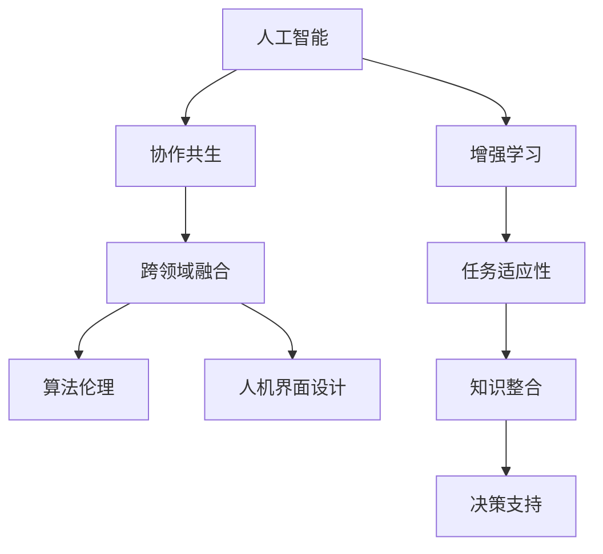

                 

# 人类-AI协作：增强人类潜能与AI能力的融合发展趋势与挑战

> 关键词：人工智能,人类增强,协作共生,跨领域融合,算法伦理,人机界面设计

## 1. 背景介绍

### 1.1 问题由来
当前，人工智能(AI)正在飞速发展，其应用范围涵盖医疗、教育、金融、制造等多个领域。AI技术通过深度学习、自然语言处理、计算机视觉等方法，已经展现出强大的解决复杂问题的能力。然而，尽管AI在技术上取得了重大突破，人类在创造力、情感理解和社交互动等方面仍然占据优势。因此，将AI与人类的长处相结合，实现“人类-AI协作”，成为了提升工作效率和创新能力的有效途径。

### 1.2 问题核心关键点
人类-AI协作的核心在于如何有效利用AI的优势，同时充分发挥人类的特长，实现二者之间的互补与协同。主要包括以下几个关键点：

- **任务适应性**：AI可以处理结构化和非结构化数据，而人类则擅长处理复杂情境和多样化信息。
- **知识整合**：AI可以快速学习新知识，但人类的经验与直觉更为可靠。
- **决策支持**：AI可以提供客观、高效的数据分析与决策支持，人类则具有创造性思维与综合判断。
- **人机交互设计**：设计易于理解、易于使用的界面，使得AI与人类高效协作。
- **伦理与隐私**：确保AI在协作过程中的伦理与隐私保护，避免数据滥用。

### 1.3 问题研究意义
研究人类-AI协作，对于推动AI技术在各领域的应用，提升人类的创造力和决策水平，具有重要意义：

1. **效率提升**：通过人机协作，可以大幅提高问题解决的效率，缩短开发和创新周期。
2. **创新激发**：AI能够处理海量数据，提供新颖的见解和解决方案，促进创新思维的产生。
3. **质量保障**：结合人类的直觉和AI的数据分析能力，能够提高决策的质量和准确性。
4. **用户体验优化**：通过人机协作，可以提升用户体验，使AI技术更加融入人们的生活和工作。
5. **社会进步**：AI与人类的协作，有助于推动社会各领域的进步，解决复杂社会问题。

## 2. 核心概念与联系

### 2.1 核心概念概述

为更好地理解人类-AI协作的原理，本节将介绍几个关键概念：

- **人工智能(AI)**：通过算法和数据驱动，实现信息处理、决策支持等智能行为的机器。
- **增强学习**：AI通过与环境交互，不断学习和优化策略，提升性能。
- **协作共生**：AI与人类相互支持、相互促进，实现双方共同成长。
- **跨领域融合**：AI技术与各领域的深度结合，实现技术创新和应用突破。
- **算法伦理**：确保AI在开发和使用过程中遵循伦理原则，保护用户权益。
- **人机界面设计**：设计直观、易用的交互界面，促进人机协作。

这些核心概念之间存在紧密的联系，共同构成了人类-AI协作的理论基础。

### 2.2 核心概念原理和架构的 Mermaid 流程图



这个流程图展示了人类-AI协作的主要环节：

1. AI通过增强学习获取任务适应性，提升性能。
2. AI与人类协作共生，实现双方优势互补。
3. AI跨领域融合，推动技术创新和应用突破。
4. AI遵守算法伦理，保护用户隐私和权益。
5. AI与人类通过人机界面设计进行高效交互。

## 3. 核心算法原理 & 具体操作步骤

### 3.1 算法原理概述

人类-AI协作的算法原理主要包括增强学习、协同优化和跨领域融合三个方面：

1. **增强学习**：通过不断试错和优化，AI逐渐学习到完成任务的最佳策略。
2. **协同优化**：人类与AI在任务中相互配合，共同调整和优化解决方案。
3. **跨领域融合**：将AI技术与不同领域相结合，形成新的应用场景。

### 3.2 算法步骤详解

人类-AI协作的算法步骤主要包括：

**Step 1: 环境设计**
- 构建模拟环境或真实任务场景，确保AI能够在该环境中进行训练和测试。

**Step 2: 策略定义**
- 定义AI和人类合作的策略，包括任务分工、信息共享等。

**Step 3: 数据收集与预处理**
- 收集相关的数据集，并进行预处理，确保数据质量。

**Step 4: 模型训练与优化**
- 使用增强学习算法，对AI模型进行训练和优化，使其能够适应任务。

**Step 5: 协同测试与评估**
- 在实际任务中测试AI和人类合作的性能，评估协作效果。

**Step 6: 反馈与改进**
- 根据测试结果，对AI和人类协作策略进行调整和优化。

### 3.3 算法优缺点

人类-AI协作算法的主要优点包括：

- **效率提升**：AI可以处理大量数据，提高问题解决效率。
- **创新激发**：结合人类的直觉和AI的数据分析能力，激发创新思维。
- **质量保障**：通过人机协作，提高决策质量和准确性。

但该算法也存在一些缺点：

- **技术复杂性**：设计高效协作系统需要较高的技术水平。
- **数据依赖**：增强学习依赖大量高质量的数据，数据收集和处理成本较高。
- **伦理问题**：AI与人协作涉及数据隐私和伦理问题，需慎重处理。
- **人机信任**：AI与人类协作需要建立信任关系，初期可能面临困难。

### 3.4 算法应用领域

人类-AI协作算法在多个领域得到广泛应用，包括但不限于：

- **医疗诊断**：结合AI的图像识别能力和医生的临床经验，提高诊断准确性。
- **教育培训**：AI辅助教学，提供个性化学习方案，提高教学效果。
- **金融投资**：AI分析市场数据，提供投资建议，人类进行最终决策。
- **制造业生产**：AI优化生产流程，人类负责监控和决策。
- **智能家居**：AI处理日常任务，人类享受便捷生活。

## 4. 数学模型和公式 & 详细讲解 & 举例说明

### 4.1 数学模型构建

人类-AI协作的数学模型通常涉及多个领域的数学公式，包括强化学习、机器学习和优化理论等。

### 4.2 公式推导过程

以强化学习为例，假设有智能体(Agent)和环境(Environment)，智能体的策略为π，状态为s，奖励为r，则Q值函数的推导如下：

$$
Q_{\pi}(s,a) = \mathbb{E}_{\pi}[r_t + \gamma \max_{a'} Q_{\pi}(s',a') | s,a]
$$

其中，t表示时间步，γ为折扣因子，s'为下一个状态。

### 4.3 案例分析与讲解

以医疗诊断为例，AI和医生的协作可以通过以下步骤进行：

1. AI对患者的影像数据进行分析，识别出异常区域。
2. 医生根据AI的分析结果，结合自身经验进行诊断。
3. 医生和AI共同讨论诊断结果，进行综合决策。

## 5. 项目实践：代码实例和详细解释说明

### 5.1 开发环境搭建

在进行人类-AI协作实践前，需要准备好开发环境：

1. 安装Python和相关依赖，如TensorFlow、PyTorch等深度学习框架。
2. 搭建模拟环境，如模拟器、真实任务场景等。
3. 准备数据集，并进行预处理。

### 5.2 源代码详细实现

以医疗诊断为例，给出使用TensorFlow对AI模型进行训练和优化的代码实现：

```python
import tensorflow as tf
from tensorflow.keras.layers import Dense, Flatten, Conv2D, MaxPooling2D
from tensorflow.keras.models import Sequential

# 定义模型
model = Sequential()
model.add(Conv2D(32, (3, 3), activation='relu', input_shape=(32, 32, 3)))
model.add(MaxPooling2D((2, 2)))
model.add(Conv2D(64, (3, 3), activation='relu'))
model.add(MaxPooling2D((2, 2)))
model.add(Conv2D(128, (3, 3), activation='relu'))
model.add(MaxPooling2D((2, 2)))
model.add(Flatten())
model.add(Dense(64, activation='relu'))
model.add(Dense(10, activation='softmax'))

# 编译模型
model.compile(optimizer='adam', loss='categorical_crossentropy', metrics=['accuracy'])

# 训练模型
model.fit(x_train, y_train, epochs=10, validation_data=(x_val, y_val))
```

### 5.3 代码解读与分析

在上述代码中，我们使用了卷积神经网络(CNN)对医疗影像数据进行分析。通过逐步添加卷积层、池化层和全连接层，模型能够从影像中提取特征并进行分类。

- **卷积层**：使用不同大小的卷积核，对输入图像进行特征提取。
- **池化层**：对特征图进行降采样，减少模型参数量，提高计算效率。
- **全连接层**：将提取的特征进行分类，输出诊断结果。

## 6. 实际应用场景

### 6.1 医疗诊断

AI与医生的协作在医疗诊断中得到了广泛应用。AI可以快速分析大量的影像数据，识别出异常区域，而医生则根据AI的分析结果，结合自身经验进行综合诊断。这种协作方式可以提高诊断的准确性和效率。

### 6.2 教育培训

在教育领域，AI可以辅助教师进行个性化教学，提供个性化的学习方案，帮助学生更好地掌握知识。同时，AI可以辅助教师进行评估和反馈，提高教学质量。

### 6.3 金融投资

在金融领域，AI可以分析大量的市场数据，提供投资建议，而人类则负责最终决策。这种协作方式可以提高投资决策的效率和准确性。

### 6.4 未来应用展望

未来，人类-AI协作将在更多领域得到应用，为各行业带来变革性影响。

- **智慧城市**：AI与城市管理部门协作，实现智能交通、智能能源等应用，提升城市管理效率。
- **智能制造**：AI与生产线工人协作，实现智能化生产，提高生产效率和产品质量。
- **智能家居**：AI与智能设备协作，实现智能控制，提升居家生活体验。

## 7. 工具和资源推荐

### 7.1 学习资源推荐

- **《人工智能基础》**：清华大学出版社，李航教授著作，系统介绍了人工智能的基本概念和技术。
- **《机器学习》**：周志华教授著作，系统介绍了机器学习的基本理论和算法。
- **《深度学习》**：Ian Goodfellow、Yoshua Bengio和Aaron Courville合著，系统介绍了深度学习的基本理论和实践。
- **Coursera《人工智能导论》课程**：由斯坦福大学提供，涵盖了人工智能的基本概念和前沿技术。
- **Kaggle竞赛**：Kaggle提供了众多数据科学和机器学习竞赛，可以锻炼实战能力。

### 7.2 开发工具推荐

- **TensorFlow**：Google开发的深度学习框架，功能强大，社区活跃。
- **PyTorch**：Facebook开发的深度学习框架，灵活易用。
- **Simulink**：MATLAB提供的模拟和仿真工具，适合开发模拟器和虚拟场景。
- **Webex**：协作工具，支持多人协同开发和测试。
- **GitHub**：代码托管平台，支持版本控制和协作开发。

### 7.3 相关论文推荐

- **《深度学习》**：Ian Goodfellow、Yoshua Bengio和Aaron Courville合著，系统介绍了深度学习的基本理论和实践。
- **《强化学习：一种机器学习》**：Richard S. Sutton和Andrew G. Barto合著，系统介绍了强化学习的基本理论和算法。
- **《协同进化优化》**：Dong Che等著作，系统介绍了协同进化优化的基本理论和应用。

## 8. 总结：未来发展趋势与挑战

### 8.1 研究成果总结

人类-AI协作技术在近年来取得了显著进展，已经在医疗、教育、金融等领域得到广泛应用。其主要成果包括：

- **效率提升**：AI可以快速处理大量数据，提高问题解决的效率。
- **创新激发**：结合人类的直觉和AI的数据分析能力，激发创新思维。
- **质量保障**：通过人机协作，提高决策质量和准确性。

### 8.2 未来发展趋势

未来，人类-AI协作将呈现以下几个发展趋势：

- **技术进步**：随着AI技术的不断进步，人类-AI协作将变得更加高效和智能。
- **跨领域融合**：AI技术与各领域的深度结合，将带来更多的创新应用。
- **伦理规范**：随着AI的广泛应用，需建立完善的伦理规范，保护用户隐私和权益。
- **人机协同**：AI与人类的协作将更加紧密，实现更高效的任务完成。

### 8.3 面临的挑战

人类-AI协作技术在发展过程中也面临一些挑战：

- **数据质量**：增强学习依赖高质量的数据，数据收集和处理成本较高。
- **伦理问题**：AI与人协作涉及数据隐私和伦理问题，需慎重处理。
- **技术复杂性**：设计高效协作系统需要较高的技术水平。
- **人机信任**：AI与人类协作需要建立信任关系，初期可能面临困难。

### 8.4 研究展望

未来，人类-AI协作技术需要在以下几个方面进行深入研究：

- **数据增强**：通过数据增强技术，提升数据质量和多样性。
- **伦理研究**：建立完善的伦理规范，保护用户隐私和权益。
- **人机协同**：研究高效人机协同机制，提升协作效率和效果。
- **跨领域应用**：将AI技术与各领域深度结合，推动技术创新和应用突破。

## 9. 附录：常见问题与解答

**Q1：人类-AI协作是否适用于所有领域？**

A: 人类-AI协作在大多数领域都能取得良好的效果，但在需要高度创造力和直觉的领域（如艺术创作、情感分析等），人类仍然占据优势。

**Q2：如何设计高效的人机界面？**

A: 设计高效的人机界面需要考虑以下几个方面：
- **直观性**：界面应直观易用，便于操作。
- **易理解性**：界面应简洁明了，易于理解。
- **互动性**：界面应支持良好的交互，便于人机协作。

**Q3：人类-AI协作面临哪些伦理问题？**

A: 人类-AI协作面临的主要伦理问题包括：
- **数据隐私**：需保护用户数据隐私，防止数据滥用。
- **算法公平**：需确保算法公正，避免歧视和偏见。
- **用户控制**：需赋予用户对AI决策的知情权和控制权。

**Q4：如何提高人机协作的效率？**

A: 提高人机协作效率的方法包括：
- **数据增强**：通过数据增强技术，提升数据质量和多样性。
- **协同优化**：通过协同优化算法，提高人机协作效果。
- **智能反馈**：通过智能反馈机制，提升人机协作的互动性和效率。

---

作者：禅与计算机程序设计艺术 / Zen and the Art of Computer Programming

