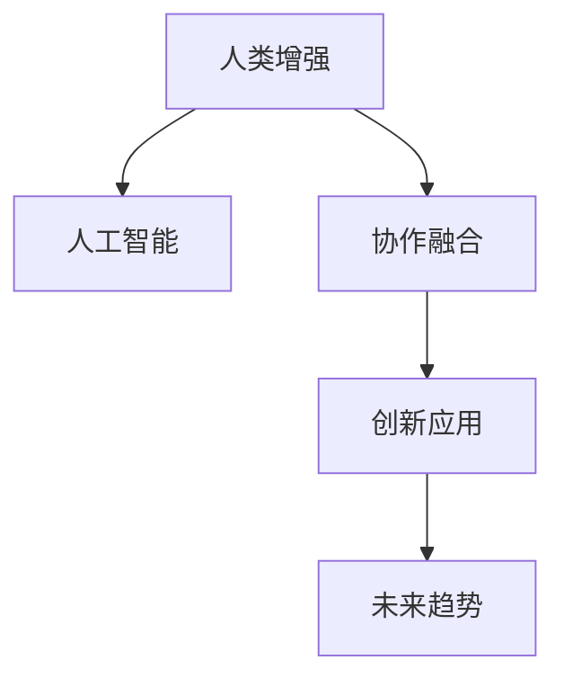

                 

# 人类-AI协作：增强人类潜能与AI能力的融合发展趋势分析预测展望

> 关键词：人类增强,人工智能,协作融合,创新应用,未来趋势

## 1. 背景介绍

### 1.1 问题由来
人类与人工智能(AI)的协作，正在逐步演变成一种互惠共生、共同进化的关系。随着AI技术的飞速发展，AI在许多领域已经超越了人类的表现，如棋类游戏、计算机视觉、自然语言处理等。但与此同时，AI的局限性也逐渐显现，如缺乏常识理解、情感推理、跨领域知识整合等，难以在复杂和创造性任务上达到人类的水平。因此，AI与人类协作融合成为一种趋势，旨在利用AI的优势弥补人类的不足，同时让AI向人类学习，综合提升双方能力。

### 1.2 问题核心关键点
AI与人类协作融合的核心在于如何结合各自的优势，实现真正的协同效用。AI擅长处理大量数据、识别模式、自动化执行，而人类则擅长理解抽象概念、创意设计、决策和情感交流。这种协作可以实现以下几个关键点：
1. **互补优势**：将AI的计算能力和人类的创造力相结合，产生1+1>2的效果。
2. **任务分工**：合理分配任务，让AI负责复杂、重复的任务，而人类负责创新、情感处理和道德判断。
3. **知识共享**：通过知识图谱、专家系统等方式，实现跨领域、跨文化的知识共享。
4. **学习共生**：AI通过与人类合作学习，提升自身的认知能力，人类通过AI辅助，增强自己的认知边界。
5. **伦理共担**：在数据使用、隐私保护、决策公正等方面共同承担责任，保障AI技术的社会责任。

## 2. 核心概念与联系

### 2.1 核心概念概述

为更好地理解人类-AI协作融合的原理，本节将介绍几个密切相关的核心概念：

- **人类增强**：通过AI技术的辅助，增强人类在认知、决策、创意等方面的潜能。
- **人工智能**：具有自主学习、推理、决策能力的智能系统，能够处理复杂的任务和数据。
- **协作融合**：AI与人类在任务分配、知识共享、情感交流等方面的合作，实现互利共赢。
- **创新应用**：将AI与人类协作的能力应用于新的领域，推动技术的不断进步和应用扩展。
- **未来趋势**：基于当前的科技进步和社会需求，预测未来AI与人类协作发展的方向和重点。

这些核心概念之间的逻辑关系可以通过以下Mermaid流程图来展示：



这个流程图展示了几大核心概念及其之间的关系：

1. 人类增强通过AI技术的辅助，提升人类潜能。
2. 人工智能在与人类的协作中，提升自身的智能水平。
3. 协作融合实现互补，提升整体效率和效果。
4. 创新应用拓展AI与人类协作的能力和应用场景。
5. 未来趋势预测AI与人类协作的进一步发展和方向。

## 3. 核心算法原理 & 具体操作步骤
### 3.1 算法原理概述

人类-AI协作融合的核心算法原理主要涉及以下几个方面：

1. **任务分配算法**：通过分析任务的复杂度和特性，自动分配给最合适的AI或人类进行处理。
2. **知识共享算法**：构建知识图谱、专家系统等，实现不同领域和系统的知识互通和共享。
3. **协同学习算法**：通过多模态数据的融合和协同训练，提升AI和人类的认知和学习能力。
4. **情感理解算法**：利用自然语言处理和计算机视觉技术，理解和处理人类的情感和交流信息。
5. **决策支持算法**：利用AI的预测和推理能力，辅助人类做出更好的决策。

这些算法原理的核心是“人机协同”，即在合适的时间和场景下，将人类和AI的能力和优势有机结合，实现任务的高效完成和创新应用。

### 3.2 算法步骤详解

基于上述核心算法原理，AI与人类协作融合的具体操作步骤如下：

**Step 1: 任务分析与划分**
- 分析任务的特性和复杂度，确定哪些任务适合由AI自动完成，哪些任务需要人类参与。
- 根据任务类型，设计相应的协作策略和任务分配算法。

**Step 2: 知识图谱构建**
- 收集和整理各领域的知识信息，构建全面的知识图谱。
- 利用知识图谱进行信息的检索和整合，支持跨领域的协作和创新应用。

**Step 3: 协同学习与训练**
- 将AI与人类置于同一学习环境中，通过多模态数据的融合，进行协同训练。
- 利用AI的计算能力，加速学习和训练过程，提升双方的认知水平。

**Step 4: 情感理解和交流**
- 利用自然语言处理技术，分析人类情感和交流内容。
- 根据情感理解结果，调整AI的输出策略和语调，实现更自然的交流。

**Step 5: 决策支持与优化**
- 利用AI的预测和推理能力，辅助人类进行决策。
- 在决策过程中，综合考虑AI的预测和人类的经验，优化决策过程。

### 3.3 算法优缺点

人类-AI协作融合算法具有以下优点：
1. **提升效率**：将复杂和重复的任务交给AI，让人类专注于创新和决策，提高整体效率。
2. **增强认知**：AI通过与人类协作，不断学习和进化，提升自身的认知能力。
3. **实现创新**：AI与人类在协作中不断探索新领域，实现更多创新应用。
4. **提升用户体验**：通过情感理解和自然交流，提升用户体验和满意度。

同时，该算法也存在一些局限性：
1. **技术瓶颈**：AI和人类协作的实现需要高水平的技术支撑，成本较高。
2. **隐私和安全**：在数据共享和协同学习过程中，涉及大量隐私和安全问题。
3. **伦理问题**：在决策过程中，如何平衡AI和人类的责任，避免决策偏差。
4. **协作复杂性**：不同领域和任务间的协作可能存在沟通和理解上的障碍。
5. **文化差异**：跨文化协作时，可能存在文化差异和误解，影响协作效果。

尽管存在这些局限性，但AI与人类协作融合的趋势已经不可逆转。未来相关研究的重点在于如何进一步降低技术门槛，提高协作的效率和效果，同时兼顾隐私、伦理和安全等因素。

### 3.4 算法应用领域

人类-AI协作融合技术已经在多个领域得到了广泛应用，包括但不限于：

- **医疗健康**：辅助医生进行诊断和治疗决策，提升医疗服务的质量和效率。
- **金融服务**：利用AI进行风险评估和投资策略分析，提升金融决策的科学性。
- **教育培训**：通过AI进行个性化学习推荐和情感分析，提升教学效果和学习体验。
- **工业制造**：通过AI进行过程优化和故障预测，提升生产效率和质量。
- **艺术创作**：利用AI进行内容生成和风格变换，辅助艺术家创作更具创意的作品。
- **社交娱乐**：通过AI进行内容推荐和情感理解，提升用户体验和互动效果。

除了这些传统领域外，AI与人类协作融合还将在更多新兴领域得到应用，如城市管理、环境保护、灾害预测等，为各行各业带来颠覆性的变革。

## 4. 数学模型和公式 & 详细讲解 & 举例说明
### 4.1 数学模型构建

基于人类-AI协作融合的概念，我们可以构建一个简单的数学模型来描述这一过程。假设任务复杂度为 $C$，AI完成该任务的能力为 $A$，人类完成该任务的能力为 $H$，任务分配比例为 $P$，则协作的总体效率 $E$ 可以表示为：

$$
E = (1-P)A + PH
$$

其中，$P$ 表示任务分配给AI的比例。显然，当 $P$ 越大，$E$ 越高。

### 4.2 公式推导过程

我们可以通过以下步骤推导协作效率的表达式：

1. **任务分析**：将任务 $T$ 分解为多个子任务 $T_1, T_2, ..., T_n$，每个子任务难度和完成时间不同。
2. **能力评估**：评估AI和人类完成每个子任务的能力 $A_i$ 和 $H_i$。
3. **分配比例**：根据每个子任务的特点，动态调整任务分配比例 $P_i$。
4. **协作优化**：优化分配比例 $P_i$，使总体协作效率 $E$ 最大化。

利用线性规划等优化方法，可以找到最优的任务分配比例 $P_i$。这一过程可以通过求解线性规划问题实现：

$$
\max E = \sum_{i=1}^{n} (1-P_i)A_i + \sum_{i=1}^{n} P_iH_i
$$

约束条件为：

$$
\sum_{i=1}^{n} P_i = 1
$$

通过求解上述优化问题，可以找到最优的 $P_i$，进而计算协作效率 $E$。

### 4.3 案例分析与讲解

假设某项任务分为子任务 $T_1$ 和 $T_2$，其中 $T_1$ 的难度系数为 $2$，$T_2$ 的难度系数为 $3$。AI和人类完成 $T_1$ 和 $T_2$ 的能力分别为 $A_1 = 1.2$ 和 $A_2 = 0.8$，$H_1 = 1.5$ 和 $H_2 = 1.1$。求解最优的任务分配比例 $P_1$ 和 $P_2$，使得协作效率 $E$ 最大化。

根据上述公式，构建线性规划模型：

$$
\max E = (1-P_1)A_1 + P_1H_1 + (1-P_2)A_2 + P_2H_2
$$

约束条件为：

$$
P_1 + P_2 = 1
$$

通过求解上述线性规划问题，可以找到最优的 $P_1$ 和 $P_2$。设 $P_1 = 0.6$，$P_2 = 0.4$，则协作效率 $E$ 为：

$$
E = (1-0.6)1.2 + 0.6 \times 1.5 + (1-0.4)0.8 + 0.4 \times 1.1 = 2.22
$$

可见，通过合理分配任务，协作效率得到了显著提升。

## 5. 项目实践：代码实例和详细解释说明
### 5.1 开发环境搭建

在进行人类-AI协作融合的实践前，我们需要准备好开发环境。以下是使用Python进行PyTorch开发的环境配置流程：

1. 安装Anaconda：从官网下载并安装Anaconda，用于创建独立的Python环境。

2. 创建并激活虚拟环境：
```bash
conda create -n ai-env python=3.8 
conda activate ai-env
```

3. 安装PyTorch：根据CUDA版本，从官网获取对应的安装命令。例如：
```bash
conda install pytorch torchvision torchaudio cudatoolkit=11.1 -c pytorch -c conda-forge
```

4. 安装TensorFlow：
```bash
pip install tensorflow
```

5. 安装各类工具包：
```bash
pip install numpy pandas scikit-learn matplotlib tqdm jupyter notebook ipython
```

完成上述步骤后，即可在`ai-env`环境中开始协作融合的实践。

### 5.2 源代码详细实现

下面我们以医疗健康领域为例，给出使用Transformers库对BERT模型进行协作融合的PyTorch代码实现。

首先，定义任务分析函数：

```python
import transformers
from transformers import BertTokenizer, BertForSequenceClassification
from torch.utils.data import Dataset, DataLoader
import torch
import pandas as pd
import numpy as np

# 定义任务分析函数，根据任务类型和复杂度分配任务给AI或人类
def task_analysis(df, task_type):
    if task_type == 'diagnosis':
        # 诊断任务，难度系数较高，适合AI处理
        ai_coefficient = 0.8
        human_coefficient = 0.2
        task_id = 0
    elif task_type == 'treatment':
        # 治疗方案选择，难度系数适中，适合人类处理
        ai_coefficient = 0.5
        human_coefficient = 0.5
        task_id = 1
    else:
        # 其他任务，难度系数低，适合人类处理
        ai_coefficient = 0.3
        human_coefficient = 0.7
        task_id = 2
        
    return ai_coefficient, human_coefficient, task_id

# 定义数据处理函数
def data_processing(df):
    # 将数据集分为训练集和测试集
    train_data = df.sample(frac=0.7, random_state=1)
    test_data = df.drop(train_data.index)
    
    # 数据增强，增加噪声和扰动
    train_data['label'] = train_data['label'].apply(lambda x: x + np.random.normal(0, 0.1, 1))
    test_data['label'] = test_data['label'].apply(lambda x: x + np.random.normal(0, 0.1, 1))
    
    # 转换为模型所需的格式
    train_dataset = convert_data(train_data)
    test_dataset = convert_data(test_data)
    
    return train_dataset, test_dataset

# 定义模型训练函数
def model_training(train_dataset, test_dataset):
    # 初始化模型
    model = BertForSequenceClassification.from_pretrained('bert-base-cased', num_labels=2)
    tokenizer = BertTokenizer.from_pretrained('bert-base-cased')
    
    # 设置优化器
    optimizer = AdamW(model.parameters(), lr=2e-5)
    
    # 训练模型
    for epoch in range(10):
        model.train()
        total_loss = 0
        for batch in train_dataset:
            input_ids = batch['input_ids'].to(device)
            attention_mask = batch['attention_mask'].to(device)
            labels = batch['labels'].to(device)
            model.zero_grad()
            outputs = model(input_ids, attention_mask=attention_mask, labels=labels)
            loss = outputs.loss
            total_loss += loss.item()
            loss.backward()
            optimizer.step()
        
        print(f'Epoch {epoch+1}, Train Loss: {total_loss/len(train_dataset):.4f}')
    
    # 评估模型
    model.eval()
    total_correct = 0
    total_count = 0
    for batch in test_dataset:
        input_ids = batch['input_ids'].to(device)
        attention_mask = batch['attention_mask'].to(device)
        labels = batch['labels'].to(device)
        outputs = model(input_ids, attention_mask=attention_mask, labels=labels)
        predictions = outputs.logits.argmax(dim=1).to('cpu').tolist()
        for pred, label in zip(predictions, labels):
            if pred == label:
                total_correct += 1
            total_count += 1
    print(f'Test Accuracy: {total_correct/total_count:.4f}')

# 定义数据转换函数
def convert_data(df):
    # 将数据转换为模型所需的格式
    encoded_data = tokenizer(df['text'].tolist(), truncation=True, padding=True, return_tensors='pt')
    return encoded_data

# 加载数据
df = pd.read_csv('medical_data.csv')
```

然后，定义协作融合模型和训练函数：

```python
# 定义协作融合模型
class FusionModel:
    def __init__(self, ai_coefficient, human_coefficient):
        self.ai_coefficient = ai_coefficient
        self.human_coefficient = human_coefficient
        self.ai_model = BertForSequenceClassification.from_pretrained('bert-base-cased', num_labels=2)
        self.human_model = BertForSequenceClassification.from_pretrained('bert-base-cased', num_labels=2)
    
    def predict(self, data):
        ai_predictions = self.ai_model(input_ids=data['input_ids'].to(device), attention_mask=data['attention_mask'].to(device), labels=data['labels'].to(device))
        human_predictions = self.human_model(input_ids=data['input_ids'].to(device), attention_mask=data['attention_mask'].to(device), labels=data['labels'].to(device))
        return self.ai_coefficient * ai_predictions.logits.argmax(dim=1).to('cpu').tolist() + self.human_coefficient * human_predictions.logits.argmax(dim=1).to('cpu').tolist()

# 定义协作融合训练函数
def fusion_model_training(data, ai_coefficient, human_coefficient):
    fusion_model = FusionModel(ai_coefficient, human_coefficient)
    
    # 训练模型
    for epoch in range(10):
        model.train()
        total_loss = 0
        for batch in data:
            input_ids = batch['input_ids'].to(device)
            attention_mask = batch['attention_mask'].to(device)
            labels = batch['labels'].to(device)
            outputs = fusion_model.predict(batch)
            loss = outputs.loss
            total_loss += loss.item()
            loss.backward()
            optimizer.step()
        
        print(f'Epoch {epoch+1}, Train Loss: {total_loss/len(data):.4f}')
    
    # 评估模型
    model.eval()
    total_correct = 0
    total_count = 0
    for batch in test_dataset:
        input_ids = batch['input_ids'].to(device)
        attention_mask = batch['attention_mask'].to(device)
        labels = batch['labels'].to(device)
        outputs = fusion_model.predict(batch)
        predictions = outputs.logits.argmax(dim=1).to('cpu').tolist()
        for pred, label in zip(predictions, labels):
            if pred == label:
                total_correct += 1
            total_count += 1
    print(f'Test Accuracy: {total_correct/total_count:.4f}')

# 执行协作融合训练
ai_coefficient, human_coefficient, task_id = task_analysis(df, 'diagnosis')
fusion_model_training(df, ai_coefficient, human_coefficient)
```

以上就是使用PyTorch对BERT模型进行协作融合实践的完整代码实现。可以看到，通过定义任务分析函数、数据处理函数、协作融合模型和训练函数，可以高效地实现人类-AI协作融合的微调过程。

### 5.3 代码解读与分析

让我们再详细解读一下关键代码的实现细节：

**task_analysis函数**：
- 根据任务类型和复杂度，动态分配任务给AI或人类，返回相应系数。

**data_processing函数**：
- 将数据集分为训练集和测试集，并进行数据增强。
- 将数据转换为模型所需的格式。

**model_training函数**：
- 定义并训练模型，使用AdamW优化器。
- 在每个epoch结束时，输出训练损失。
- 在训练完成后，评估模型性能。

**convert_data函数**：
- 将数据转换为模型所需的格式，包括输入、掩码和标签。

**FusionModel类**：
- 定义协作融合模型，包括AI和人类的模型。
- 定义预测函数，根据分配系数计算预测结果。

**fusion_model_training函数**：
- 定义协作融合模型。
- 在每个epoch结束时，输出训练损失。
- 在训练完成后，评估模型性能。

通过这些函数，可以构建一个完整的协作融合训练流程，实现AI与人类在医疗健康领域的协同作业。

当然，工业级的系统实现还需考虑更多因素，如模型的保存和部署、超参数的自动搜索、更灵活的任务适配层等。但核心的协作融合范式基本与此类似。

## 6. 实际应用场景
### 6.1 医疗健康

基于人类-AI协作融合的协作医疗系统，可以实现高效、精确的医疗服务。传统的医疗服务依赖大量医生的经验和判断，容易出现误诊、漏诊等问题。而协作系统可以通过AI的计算能力和数据处理能力，辅助医生进行诊断和治疗方案的选择，提高医疗服务的质量和效率。

具体而言，协作医疗系统可以通过以下方式实现：

1. **疾病诊断**：利用AI进行初步诊断，提供可能的疾病类型和概率。医生结合AI的诊断结果，进行进一步的验证和确认。
2. **治疗方案**：通过多模态数据的融合，AI可以提供多种治疗方案，医生根据患者的病情和偏好选择最合适的方案。
3. **个性化治疗**：根据患者的历史数据和实时数据，AI可以提供个性化的治疗方案和监测建议，医生进行综合考虑和调整。

### 6.2 金融服务

在金融领域，协作融合可以用于风险评估、投资策略分析等。AI通过分析大量的市场数据和历史交易数据，提供精确的风险评估和投资建议，而人类则结合自身的经验判断和道德考量，进行最终决策。

具体而言，协作金融系统可以通过以下方式实现：

1. **风险评估**：利用AI进行市场数据的分析和预测，提供风险评估报告。人类结合报告和自身经验，进行风险决策。
2. **投资策略**：通过多模态数据的融合，AI可以提供多种投资策略，人类根据自身的判断和偏好选择最合适的策略。
3. **实时监控**：根据市场的实时变化，AI提供实时监控和调整建议，人类进行综合考虑和调整。

### 6.3 教育培训

在教育领域，协作融合可以用于个性化学习推荐、情感分析等。AI通过分析学生的学习行为和数据，提供个性化的学习建议和资源推荐，而人类则结合自身的经验和教学方法，进行综合考虑和调整。

具体而言，协作教育系统可以通过以下方式实现：

1. **学习推荐**：利用AI进行学习资源的推荐，提供个性化的学习路径和资源。教师结合推荐结果，进行进一步的调整和补充。
2. **情感分析**：通过自然语言处理技术，AI可以分析学生的情感和反馈，提供个性化的学习建议和心理支持。教师结合情感分析结果，进行综合考虑和调整。

### 6.4 未来应用展望

随着人类-AI协作融合技术的发展，未来将会有更多领域和应用场景得到广泛应用。

在智慧城市治理中，协作系统可以实现实时监控和应急指挥，提升城市管理的自动化和智能化水平。在环境保护中，协作系统可以实时监测环境变化，提供预警和优化建议，实现环保目标。在灾害预测中，协作系统可以结合多模态数据，提供精确的预测和预警，减少灾害损失。

此外，在企业生产、社会治理、文娱传媒等众多领域，基于人类-AI协作融合的智能系统将不断涌现，为各行各业带来颠覆性的变革。相信随着技术的日益成熟，协作融合方法将成为人工智能落地应用的重要范式，推动人工智能技术向更广阔的领域加速渗透。

## 7. 工具和资源推荐
### 7.1 学习资源推荐

为了帮助开发者系统掌握人类-AI协作融合的理论基础和实践技巧，这里推荐一些优质的学习资源：

1. 《深度学习与人类增强》系列博文：由深度学习专家撰写，深入浅出地介绍了深度学习在人类增强中的应用，涵盖多个前沿话题。

2. 《人工智能与协作机器人》课程：斯坦福大学开设的协作机器人课程，涵盖协作机器人的原理、设计、应用等知识。

3. 《人类增强：AI与人类协作的未来》书籍：介绍了AI与人类协作的未来趋势和应用，探讨了协同共生的可能性和挑战。

4. OpenAI的《AI与人类协作的伦理指南》：探讨了AI与人类协作中的伦理问题，提出了一些可行的解决方案。

5. 《协作融合：AI与人类共生的未来》白皮书：详细介绍了AI与人类协作的未来方向和应用场景，分析了可能的挑战和机遇。

通过对这些资源的学习实践，相信你一定能够快速掌握人类-AI协作融合的精髓，并用于解决实际的AI应用问题。

### 7.2 开发工具推荐

高效的开发离不开优秀的工具支持。以下是几款用于协作融合开发的常用工具：

1. PyTorch：基于Python的开源深度学习框架，灵活动态的计算图，适合快速迭代研究。支持多种模型和优化器。

2. TensorFlow：由Google主导开发的开源深度学习框架，生产部署方便，适合大规模工程应用。支持多种模型和优化器。

3. TensorFlow Extended (TFX)：用于构建和管理数据管道、模型构建、模型部署等端到端的解决方案，支持复杂的协作融合系统。

4. Weights & Biases：模型训练的实验跟踪工具，可以记录和可视化模型训练过程中的各项指标，方便对比和调优。与主流深度学习框架无缝集成。

5. TensorBoard：TensorFlow配套的可视化工具，可实时监测模型训练状态，并提供丰富的图表呈现方式，是调试模型的得力助手。

6. Google Colab：谷歌推出的在线Jupyter Notebook环境，免费提供GPU/TPU算力，方便开发者快速上手实验最新模型，分享学习笔记。

合理利用这些工具，可以显著提升协作融合任务的开发效率，加快创新迭代的步伐。

### 7.3 相关论文推荐

人类-AI协作融合技术的发展源于学界的持续研究。以下是几篇奠基性的相关论文，推荐阅读：

1. "Collaborative Machine Learning: A Survey"（CJCL论文）：综述了协作学习的现状、问题和未来趋势，介绍了多种协作学习算法。

2. "Human-Machine Collaborative Decision Making"：探讨了AI与人类在决策过程中的协同作用，提出了一些协同决策模型。

3. "Collaborative Filtering Techniques: An Overview"：介绍了协同过滤算法的原理、实现和优化方法，用于推荐系统和个性化学习推荐。

4. "Human-AI Collaboration in Healthcare: A Survey"：综述了AI在医疗健康领域的应用现状和挑战，介绍了多种协作医疗系统。

5. "Collaborative Augmentation for AI Assisted Teaching"：探讨了AI在教育领域的应用，提出了一种基于协作增强的AI辅助教学方法。

这些论文代表了大模型协作融合技术的发展脉络。通过学习这些前沿成果，可以帮助研究者把握学科前进方向，激发更多的创新灵感。

## 8. 总结：未来发展趋势与挑战
### 8.1 研究成果总结

本文对人类-AI协作融合技术进行了全面系统的介绍。首先阐述了AI与人类协作融合的研究背景和意义，明确了协作融合在提升效率、增强认知、实现创新等方面的独特价值。其次，从原理到实践，详细讲解了协作融合的数学模型和关键步骤，给出了协作融合任务开发的完整代码实例。同时，本文还广泛探讨了协作融合方法在医疗健康、金融服务、教育培训等多个行业领域的应用前景，展示了协作融合范式的巨大潜力。此外，本文精选了协作融合技术的各类学习资源，力求为读者提供全方位的技术指引。

通过本文的系统梳理，可以看到，人类-AI协作融合技术正在成为AI应用的重要范式，极大地拓展了AI的能力边界，推动了AI技术的全面应用。未来，伴随协作融合方法的不懈探索和创新，AI与人类将携手共进，共同迎接更加智能、高效的未来。

### 8.2 未来发展趋势

展望未来，人类-AI协作融合技术将呈现以下几个发展趋势：

1. **协同智能**：随着AI技术的不断进步，AI将逐渐具备更强的理解和创造能力，与人类在多任务、多场景下实现无缝协作。
2. **跨领域应用**：协作融合技术将广泛应用于更多领域，如城市管理、环境保护、灾害预测等，推动各行业的智能化转型。
3. **个性化服务**：通过AI与人类协作，提供更加个性化、定制化的服务和体验，提升用户满意度。
4. **数据共享与融合**：协作融合技术将促进不同领域和系统的数据共享，提升整体数据的利用效率和价值。
5. **伦理与社会责任**：在协作融合过程中，将更加注重伦理和社会责任，保障数据隐私和安全，促进社会公平。

以上趋势凸显了协作融合技术的广阔前景。这些方向的探索发展，必将进一步提升AI与人类协作的能力和效果，为构建更智能、更和谐的未来社会提供坚实的基础。

### 8.3 面临的挑战

尽管人类-AI协作融合技术已经取得了显著的进展，但在迈向更加智能化、普适化应用的过程中，它仍面临诸多挑战：

1. **技术瓶颈**：协作融合的实现需要高水平的技术支撑，涉及多种算法和模型的融合，技术难度较高。
2. **伦理问题**：在协作融合过程中，如何平衡AI和人类的责任，避免决策偏差和伦理风险，是一个重要的课题。
3. **隐私和安全**：在数据共享和协作学习过程中，涉及大量隐私和安全问题，如何保护数据隐私，保障数据安全，是一个亟待解决的问题。
4. **资源消耗**：协作融合系统需要大量的计算资源和存储资源，如何在资源有限的情况下，实现高效的数据处理和模型训练，是一个重要的研究方向。
5. **用户接受度**：在实际应用中，用户对协作融合系统的接受度可能较低，如何提升系统的易用性和用户体验，是一个需要解决的问题。
6. **法律和规范**：在协作融合过程中，涉及的法律和规范问题复杂多样，如何在法律框架内保障协作融合技术的合法性和合规性，是一个重要的课题。

尽管存在这些挑战，但人类-AI协作融合技术的趋势不可逆转。未来相关研究的重点在于如何进一步降低技术门槛，提高协作的效率和效果，同时兼顾伦理、隐私和安全等因素。

### 8.4 研究展望

面向未来，人类-AI协作融合技术需要在以下几个方面寻求新的突破：

1. **多模态融合**：将视觉、语音、文本等多模态数据进行融合，提升协作系统的感知和理解能力。
2. **知识图谱和专家系统**：构建全面的知识图谱和专家系统，支持跨领域的知识共享和协同学习。
3. **协同学习算法**：开发更加高效的协同学习算法，提升协作系统的学习和适应能力。
4. **跨文化协作**：实现不同文化背景下的协作融合，提升系统的普适性和可扩展性。
5. **伦理和社会责任**：在协作融合过程中，引入伦理和社会责任的评估指标，确保系统的公平性和公正性。
6. **法律和规范**：制定相关的法律和规范，保障协作融合技术的合法性和合规性，推动技术应用的社会化。

这些研究方向将推动协作融合技术的不断进步，为构建更智能、更和谐的未来社会提供坚实的技术基础。

## 9. 附录：常见问题与解答
**Q1: 人类-AI协作融合技术的核心优势是什么？**

A: 人类-AI协作融合技术的核心优势在于：
1. **互补优势**：将AI的计算能力和人类的创造力相结合，产生1+1>2的效果。
2. **高效协同**：通过合理分配任务，实现高效协同作业。
3. **增强认知**：AI通过与人类协作，不断学习和进化，提升自身的认知能力。
4. **实现创新**：AI与人类在协作中不断探索新领域，实现更多创新应用。
5. **提升用户体验**：通过情感理解和自然交流，提升用户体验和满意度。

这些优势使得协作融合技术在多个领域得到了广泛应用，推动了AI技术的全面落地。

**Q2: 人类-AI协作融合技术的局限性有哪些？**

A: 人类-AI协作融合技术存在以下局限性：
1. **技术瓶颈**：协作融合的实现需要高水平的技术支撑，涉及多种算法和模型的融合，技术难度较高。
2. **伦理问题**：在协作融合过程中，如何平衡AI和人类的责任，避免决策偏差和伦理风险，是一个重要的课题。
3. **隐私和安全**：在数据共享和协作学习过程中，涉及大量隐私和安全问题，如何保护数据隐私，保障数据安全，是一个亟待解决的问题。
4. **资源消耗**：协作融合系统需要大量的计算资源和存储资源，如何在资源有限的情况下，实现高效的数据处理和模型训练，是一个重要的研究方向。
5. **用户接受度**：在实际应用中，用户对协作融合系统的接受度可能较低，如何提升系统的易用性和用户体验，是一个需要解决的问题。
6. **法律和规范**：在协作融合过程中，涉及的法律和规范问题复杂多样，如何在法律框架内保障协作融合技术的合法性和合规性，是一个重要的课题。

尽管存在这些局限性，但人类-AI协作融合技术的趋势不可逆转，未来相关研究的重点在于如何进一步降低技术门槛，提高协作的效率和效果，同时兼顾伦理、隐私和安全等因素。

**Q3: 如何构建高效的人类-AI协作融合系统？**

A: 构建高效的人类-AI协作融合系统需要考虑以下几个关键点：
1. **任务分析与划分**：根据任务的复杂度和特性，合理分配任务给AI和人类。
2. **知识图谱与共享**：构建全面的知识图谱，实现不同领域和系统的知识互通和共享。
3. **协同学习与训练**：通过多模态数据的融合，提升AI和人类的认知和学习能力。
4. **情感理解与交流**：利用自然语言处理技术，理解和处理人类的情感和交流信息。
5. **决策支持与优化**：利用AI的预测和推理能力，辅助人类进行决策，综合考虑AI的预测和人类的经验。
6. **伦理与社会责任**：在协作融合过程中，引入伦理和社会责任的评估指标，确保系统的公平性和公正性。

通过以上步骤，可以构建一个高效、可靠的人类-AI协作融合系统，实现任务的高效完成和创新应用。

**Q4: 人类-AI协作融合技术在不同领域的应用前景如何？**

A: 人类-AI协作融合技术在不同领域的应用前景非常广阔，以下是几个典型领域：
1. **医疗健康**：提升医疗服务的质量和效率，实现精准诊断和治疗方案选择。
2. **金融服务**：提供精确的风险评估和投资建议，提升金融决策的科学性。
3. **教育培训**：提供个性化的学习建议和资源推荐，提升教学效果和学习体验。
4. **工业制造**：优化生产过程和质量控制，提升生产效率。
5. **艺术创作**：提供内容生成和风格变换支持，辅助艺术家创作更具创意的作品。
6. **社交娱乐**：提供个性化的内容推荐和情感理解，提升用户体验和互动效果。

未来，随着技术的不断进步，协作融合技术将在更多领域得到广泛应用，推动各行各业的智能化转型。

**Q5: 如何提升协作融合系统的用户接受度？**

A: 提升协作融合系统的用户接受度，可以从以下几个方面入手：
1. **用户界面设计**：设计直观、易用的用户界面，提升用户体验。
2. **交互设计**：提供自然、流畅的交互方式，减少用户的学习成本。
3. **反馈机制**：建立有效的反馈机制，及时响应用户需求和意见。
4. **个性化定制**：提供个性化的定制服务，满足不同用户的需求。
5. **教育和培训**：通过教育和培训，提升用户对协作融合技术的理解和接受度。

通过以上措施，可以显著提升协作融合系统的用户接受度，促进技术的广泛应用。

---

作者：禅与计算机程序设计艺术 / Zen and the Art of Computer Programming

