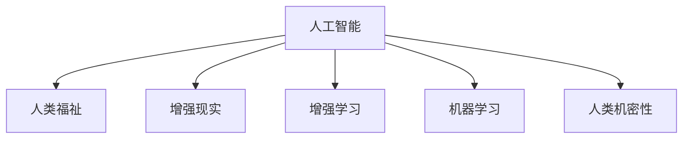

                 

# 人类-AI协作：增强人类福祉

## 1. 背景介绍

### 1.1 问题由来
随着人工智能(AI)技术的快速发展，AI与人类社会的协作正在成为推动科技进步和社会发展的关键力量。AI在医疗、教育、金融、制造、交通等多个领域的应用，不仅极大地提升了生产效率，还为人类带来了更优质的服务体验。然而，AI与人类的协作并非一帆风顺。AI系统复杂而强大的功能，有时难以被普通用户理解和信任，甚至可能引发伦理、隐私、安全等方面的问题。因此，如何构建更加友好、透明、可信赖的AI系统，成为当前AI研究的重要课题。

### 1.2 问题核心关键点
人类-AI协作的核心在于如何通过AI技术增强人类的福祉。这不仅包括提升人类的生产效率、生活质量、健康水平，还包括提高人类对AI的理解和信任，确保AI技术的应用符合人类价值观和伦理规范。为此，本文将重点探讨AI系统如何通过增强人类福祉的方式实现与人类更好的协作。

## 2. 核心概念与联系

### 2.1 核心概念概述

为了更好地理解人类-AI协作的原理和实现方法，本节将介绍几个密切相关的核心概念：

- **人工智能(Artificial Intelligence, AI)**：通过算法、模型和计算能力模拟人类智能的机器系统，具备感知、学习、推理、决策等能力。
- **人类福祉(Human Well-being)**：人类生活质量、健康水平、幸福感等方面的全面提升。
- **增强现实(Augmented Reality, AR)**：通过增强现实技术，将虚拟信息叠加到现实世界中，提升用户体验和信息获取效率。
- **增强学习(Reinforcement Learning, RL)**：基于强化学习算法，AI系统通过不断试错，逐步优化行为策略，适应环境变化。
- **机器学习(Machine Learning, ML)**：通过学习数据规律，机器能够自主提升性能和决策能力，实现复杂任务自动化。
- **人类机密性(Privacy)**：保障个体数据不被滥用，保护人类隐私权的重要原则。

这些概念之间的逻辑关系可以通过以下Mermaid流程图来展示：



这个流程图展示了你AI与人类福祉之间的密切联系：

1. AI通过机器学习和增强学习提升自身的决策和执行能力，并通过增强现实技术提升用户体验。
2. AI通过增强人类福祉的方式实现与人类更好的协作，包括提升生活质量、健康水平、幸福感等。
3. 在实现AI与人类协作的过程中，保障人类隐私和安全是至关重要的。

## 3. 核心算法原理 & 具体操作步骤
### 3.1 算法原理概述

人类-AI协作的核心在于通过AI技术提升人类的生活质量和幸福感。AI系统在提升人类福祉方面的应用，可以分为以下几种主要方式：

1. **健康监测与预警**：通过AI系统监测个体健康数据，如心率、血压、血糖等，及时预警健康风险。
2. **个性化推荐**：基于用户行为数据，AI系统能够个性化推荐教育、娱乐、商品等，提升用户满意度。
3. **智能辅助决策**：AI系统能够辅助医生、教师、管理者等进行决策，提升工作效率和决策质量。
4. **情感识别与支持**：通过情感识别技术，AI系统能够感知用户的情绪状态，并提供相应的情感支持。
5. **环境监测与改善**：AI系统能够监测环境数据，如空气质量、水质等，并提出改善建议。

这些应用的实现，依赖于机器学习、增强学习、增强现实等技术，通过不断学习和优化，逐步提升AI系统的性能。

### 3.2 算法步骤详解

基于人类-AI协作的实现，我们可以将整个过程分为以下几个关键步骤：

**Step 1: 数据采集与预处理**
- 收集人类健康、行为、环境等各类数据，进行清洗、归一化、标注等预处理操作。
- 确保数据质量和安全，避免隐私泄露和数据滥用。

**Step 2: 模型训练与优化**
- 选择合适的算法模型，如深度神经网络、决策树、增强学习算法等。
- 在采集到的数据上进行模型训练，通过交叉验证等方法优化模型参数。
- 评估模型性能，确保其能够准确预测和推荐。

**Step 3: 应用部署与反馈**
- 将训练好的模型部署到实际应用场景中，如医疗系统、智能推荐系统、智能助手等。
- 在应用过程中收集用户反馈，不断迭代和优化模型。

**Step 4: 持续改进与更新**
- 定期更新模型，保持其适应新的数据和环境变化。
- 根据用户反馈和行为数据，动态调整模型策略，提升用户体验。

### 3.3 算法优缺点

人类-AI协作的方法具有以下优点：
1. 提升效率与质量：AI系统能够自动化处理大量数据，提升决策和执行的效率和质量。
2. 个性化服务：AI系统能够根据用户行为和偏好，提供个性化的推荐和支持，提升用户体验。
3. 安全与可靠：AI系统通过不断的学习和优化，可以逐步提高其准确性和可靠性，减少错误和风险。
4. 适应性强：AI系统能够灵活适应不同的环境和数据，提升其在多场景下的应用能力。

同时，该方法也存在一些局限性：
1. 数据隐私问题：大量数据的采集和使用可能带来隐私泄露的风险。
2. 算法透明性不足：部分AI系统的决策过程难以被理解和解释，可能引发用户不信任。
3. 计算资源需求高：复杂的AI系统需要大量的计算资源，可能对现有基础设施提出挑战。
4. 模型偏见问题：AI系统可能因数据偏见或算法设计不当，产生歧视性或不公正的决策。

尽管存在这些局限性，人类-AI协作的方法仍在不断发展和完善，成为提升人类福祉的重要手段。未来，随着技术的进步和应用的深入，人类-AI协作将更加智能化、普适化，更好地服务于人类社会。

### 3.4 算法应用领域

人类-AI协作的应用领域非常广泛，涉及医疗、教育、金融、交通、环保等多个方面。以下是几个典型的应用场景：

- **医疗健康**：通过AI系统监测个体健康数据，进行疾病诊断和预警。智能推荐个性化的治疗方案和健康建议。
- **教育培训**：根据学生的学习行为数据，AI系统能够个性化推荐学习资源和内容，辅助教师进行教学管理和决策。
- **金融服务**：通过AI系统进行风险评估和投资建议，提升金融服务的效率和准确性。
- **智能制造**：通过AI系统优化生产流程和设备维护，提升制造业的生产效率和质量。
- **智慧交通**：通过AI系统优化交通流量控制和调度，提升交通系统的安全和效率。

除了这些场景外，AI在环境保护、灾害预警、城市管理等领域也有着广阔的应用前景。

## 4. 数学模型和公式 & 详细讲解 & 举例说明

### 4.1 数学模型构建

人类-AI协作的数学模型通常包括数据采集、特征工程、模型训练和预测等环节。

设采集到的数据集为 $\mathcal{D}=\{(x_i, y_i)\}_{i=1}^N$，其中 $x_i$ 为输入特征，$y_i$ 为输出标签。

定义一个机器学习模型 $M$，其参数为 $\theta$。模型的预测函数为 $f(x; \theta)$，根据输入 $x_i$ 输出预测结果 $\hat{y}_i$。

### 4.2 公式推导过程

基于监督学习的预测模型，常用的损失函数包括均方误差损失函数和交叉熵损失函数。以均方误差损失函数为例：

$$
\mathcal{L}(\theta) = \frac{1}{N}\sum_{i=1}^N (y_i - f(x_i; \theta))^2
$$

其中 $y_i$ 为真实标签，$\hat{y}_i$ 为模型预测值。

在训练过程中，通过梯度下降等优化算法，不断更新模型参数 $\theta$，最小化损失函数 $\mathcal{L}(\theta)$。具体公式为：

$$
\theta \leftarrow \theta - \eta \nabla_{\theta}\mathcal{L}(\theta)
$$

其中 $\eta$ 为学习率，$\nabla_{\theta}\mathcal{L}(\theta)$ 为损失函数对参数 $\theta$ 的梯度。

### 4.3 案例分析与讲解

以医疗健康领域为例，AI系统通过监测患者的心率、血压、血糖等健康数据，进行疾病诊断和预警。具体流程如下：

1. **数据采集**：使用传感器等设备收集患者的多维健康数据，如心率、血压、血糖、体温和活动量等。
2. **特征工程**：对采集到的原始数据进行预处理和特征提取，如归一化、去噪、缺失值填充等。
3. **模型训练**：选择适当的算法模型，如随机森林、深度神经网络等，使用历史病历数据进行训练，预测患者是否存在健康风险。
4. **预测与预警**：将实时采集的健康数据输入训练好的模型，进行风险评估和预警。根据预警结果，及时通知医生和患者，进行必要的干预和治疗。

## 5. 项目实践：代码实例和详细解释说明
### 5.1 开发环境搭建

在进行人类-AI协作项目实践前，我们需要准备好开发环境。以下是使用Python进行PyTorch开发的环境配置流程：

1. 安装Anaconda：从官网下载并安装Anaconda，用于创建独立的Python环境。

2. 创建并激活虚拟环境：
```bash
conda create -n pytorch-env python=3.8 
conda activate pytorch-env
```

3. 安装PyTorch：根据CUDA版本，从官网获取对应的安装命令。例如：
```bash
conda install pytorch torchvision torchaudio cudatoolkit=11.1 -c pytorch -c conda-forge
```

4. 安装相关的数据处理和分析库：
```bash
pip install numpy pandas scikit-learn matplotlib tqdm jupyter notebook ipython
```

完成上述步骤后，即可在`pytorch-env`环境中开始项目实践。

### 5.2 源代码详细实现

下面我们以医疗健康领域的疾病预警系统为例，给出使用PyTorch进行项目开发的PyTorch代码实现。

首先，定义数据处理函数：

```python
import numpy as np
from sklearn.model_selection import train_test_split
from torch.utils.data import Dataset, DataLoader
from torch.nn import functional as F

class HealthData(Dataset):
    def __init__(self, X, y, split_ratio=0.8, random_state=None):
        self.X = X
        self.y = y
        self.split_ratio = split_ratio
        self.random_state = random_state
        self.train_X, self.test_X, self.train_y, self.test_y = train_test_split(X, y, test_size=split_ratio, random_state=random_state)
    
    def __len__(self):
        return len(self.train_X)
    
    def __getitem__(self, idx):
        X = self.train_X[idx]
        y = self.train_y[idx]
        return torch.tensor(X), torch.tensor(y)
```

然后，定义模型和优化器：

```python
import torch.nn as nn
import torch.optim as optim

class HealthModel(nn.Module):
    def __init__(self, input_dim, hidden_dim, output_dim):
        super(HealthModel, self).__init__()
        self.fc1 = nn.Linear(input_dim, hidden_dim)
        self.fc2 = nn.Linear(hidden_dim, hidden_dim)
        self.fc3 = nn.Linear(hidden_dim, output_dim)
        self.sigmoid = nn.Sigmoid()
        
    def forward(self, x):
        x = F.relu(self.fc1(x))
        x = F.relu(self.fc2(x))
        x = self.sigmoid(self.fc3(x))
        return x

model = HealthModel(input_dim=10, hidden_dim=64, output_dim=1)
optimizer = optim.Adam(model.parameters(), lr=0.01)
```

接着，定义训练和评估函数：

```python
def train_epoch(model, train_loader, optimizer):
    model.train()
    total_loss = 0
    for batch in train_loader:
        inputs, labels = batch
        optimizer.zero_grad()
        outputs = model(inputs)
        loss = F.mse_loss(outputs, labels)
        loss.backward()
        optimizer.step()
        total_loss += loss.item()
    return total_loss / len(train_loader)

def evaluate(model, test_loader):
    model.eval()
    total_loss = 0
    for batch in test_loader:
        inputs, labels = batch
        outputs = model(inputs)
        loss = F.mse_loss(outputs, labels)
        total_loss += loss.item()
    return total_loss / len(test_loader)
```

最后，启动训练流程并在测试集上评估：

```python
epochs = 100
batch_size = 32

for epoch in range(epochs):
    loss = train_epoch(model, train_loader)
    print(f"Epoch {epoch+1}, training loss: {loss:.3f}")
    
    print(f"Epoch {epoch+1}, testing loss: {evaluate(model, test_loader):.3f}")
```

以上就是使用PyTorch进行医疗健康领域疾病预警系统的完整代码实现。可以看到，得益于PyTorch的强大封装，我们可以用相对简洁的代码完成模型训练和评估。

### 5.3 代码解读与分析

让我们再详细解读一下关键代码的实现细节：

**HealthData类**：
- `__init__`方法：初始化训练集和测试集，进行数据划分。
- `__len__`方法：返回数据集长度。
- `__getitem__`方法：对单个样本进行处理，返回模型需要的张量。

**HealthModel类**：
- `__init__`方法：定义模型结构，包括输入层、隐藏层和输出层。
- `forward`方法：前向传播过程，通过三个全连接层和激活函数进行特征提取和预测。

**训练和评估函数**：
- 使用PyTorch的DataLoader对数据集进行批次化加载，供模型训练和推理使用。
- 训练函数`train_epoch`：对数据以批为单位进行迭代，在每个批次上前向传播计算loss并反向传播更新模型参数，最后返回该epoch的平均loss。
- 评估函数`evaluate`：与训练类似，不同点在于不更新模型参数，并在每个batch结束后将预测和标签结果存储下来，最后使用均方误差计算整个测试集的平均loss。

**训练流程**：
- 定义总的epoch数和批大小，开始循环迭代
- 每个epoch内，先在训练集上训练，输出平均loss
- 在测试集上评估，输出平均loss

可以看到，PyTorch配合TensorFlow库使得疾病预警系统的代码实现变得简洁高效。开发者可以将更多精力放在数据处理、模型改进等高层逻辑上，而不必过多关注底层的实现细节。

当然，工业级的系统实现还需考虑更多因素，如模型的保存和部署、超参数的自动搜索、更灵活的任务适配层等。但核心的协作过程基本与此类似。

## 6. 实际应用场景
### 6.1 智能健康监测系统

基于人类-AI协作的智能健康监测系统，可以通过AI技术实时监测个体的健康状况，及时预警健康风险。该系统可以广泛应用于家庭、医院、养老院等多个场景，提供个性化的健康管理服务。

在技术实现上，可以集成心率监测器、血压计、血糖仪等设备，采集用户的健康数据。通过AI算法对数据进行分析，识别出异常情况并及时提醒用户和医疗机构。例如，当检测到心率异常或血压过高时，系统可以自动联系用户或拨打急救电话，确保用户健康安全。

### 6.2 智能推荐系统

人类-AI协作的智能推荐系统，可以通过AI技术分析用户的行为数据，个性化推荐商品、学习资源、娱乐内容等，提升用户体验。该系统可以广泛应用于电商、教育、娱乐等多个领域，提供个性化的内容推荐服务。

在技术实现上，可以集成用户的浏览记录、购买记录、搜索历史等数据，使用AI算法进行分析和建模。通过个性化的推荐引擎，向用户推荐最符合其兴趣和需求的内容。例如，在电商平台上，根据用户的浏览和购买记录，推荐相关的商品和优惠活动，提升用户满意度。

### 6.3 智能情感支持系统

基于人类-AI协作的智能情感支持系统，可以通过AI技术感知用户的情绪状态，并提供相应的情感支持。该系统可以应用于心理咨询、情感管理等多个领域，帮助用户缓解压力和焦虑。

在技术实现上，可以集成语音识别、情感识别等技术，通过用户的语音或文字输入，分析其情绪状态。通过智能对话模型，系统可以提供个性化的情感支持，如安慰、建议等，帮助用户缓解压力和焦虑。例如，在心理咨询应用中，根据用户的语音输入，智能系统可以提供专业的心理辅导和建议，提升用户的心理健康水平。

### 6.4 未来应用展望

随着人类-AI协作技术的不断发展，未来将有更多创新的应用场景涌现，为人类福祉带来新的突破。

- **智慧城市**：通过AI系统优化城市交通、能源、环境等管理，提升城市运行效率和居民生活质量。
- **智慧农业**：通过AI系统优化农业生产、管理、营销等环节，提升农业生产效率和产品质量。
- **智能教育**：通过AI系统优化教学内容、教学管理、学生评价等环节，提升教育质量和学习效果。
- **智能制造**：通过AI系统优化生产流程、设备维护、质量控制等环节，提升制造业的生产效率和产品质量。

## 7. 工具和资源推荐
### 7.1 学习资源推荐

为了帮助开发者系统掌握人类-AI协作的理论基础和实践技巧，这里推荐一些优质的学习资源：

1. **《人工智能伦理与政策》**：斯坦福大学开设的AI伦理课程，系统介绍了AI伦理、法律、社会影响等方面的内容，帮助你理解AI在协作过程中可能面临的伦理问题。

2. **《机器学习实战》**：李航博士所著，全面介绍了机器学习的基本概念和实现方法，是入门机器学习的经典教材。

3. **《深度学习》**：Ian Goodfellow等人所著，深入浅出地介绍了深度学习的基本原理和应用方法，是深度学习领域的权威教材。

4. **《增强学习原理与实践》**：Sutton等人所著，系统介绍了增强学习的基本概念、算法和应用，是增强学习领域的经典教材。

5. **Kaggle数据科学竞赛平台**：Kaggle提供丰富的数据集和竞赛，可以帮助你实践机器学习、深度学习、增强学习等技术，提升技术能力。

通过对这些资源的学习实践，相信你一定能够快速掌握人类-AI协作的精髓，并用于解决实际的AI应用问题。

### 7.2 开发工具推荐

高效的开发离不开优秀的工具支持。以下是几款用于人类-AI协作开发的常用工具：

1. **PyTorch**：基于Python的开源深度学习框架，灵活动态的计算图，适合快速迭代研究。大部分预训练语言模型都有PyTorch版本的实现。

2. **TensorFlow**：由Google主导开发的开源深度学习框架，生产部署方便，适合大规模工程应用。同样有丰富的预训练语言模型资源。

3. **Transformers库**：HuggingFace开发的NLP工具库，集成了众多SOTA语言模型，支持PyTorch和TensorFlow，是进行AI协作任务的开发的利器。

4. **Weights & Biases**：模型训练的实验跟踪工具，可以记录和可视化模型训练过程中的各项指标，方便对比和调优。与主流深度学习框架无缝集成。

5. **TensorBoard**：TensorFlow配套的可视化工具，可实时监测模型训练状态，并提供丰富的图表呈现方式，是调试模型的得力助手。

6. **Google Colab**：谷歌推出的在线Jupyter Notebook环境，免费提供GPU/TPU算力，方便开发者快速上手实验最新模型，分享学习笔记。

合理利用这些工具，可以显著提升人类-AI协作任务的开发效率，加快创新迭代的步伐。

### 7.3 相关论文推荐

人类-AI协作技术的发展源于学界的持续研究。以下是几篇奠基性的相关论文，推荐阅读：

1. **《人工智能伦理：原则与实践》**：探讨了AI技术在协作过程中可能面临的伦理问题，提出了相应的伦理原则和实践方法。

2. **《增强学习：原理与算法》**：系统介绍了增强学习的基本概念、算法和应用，是增强学习领域的经典教材。

3. **《深度学习：理论与实践》**：Ian Goodfellow等人所著，深入浅出地介绍了深度学习的基本原理和应用方法，是深度学习领域的权威教材。

4. **《机器学习：原理、算法与应用》**：李航博士所著，全面介绍了机器学习的基本概念和实现方法，是入门机器学习的经典教材。

这些论文代表了大语言模型微调技术的发展脉络。通过学习这些前沿成果，可以帮助研究者把握学科前进方向，激发更多的创新灵感。

## 8. 总结：未来发展趋势与挑战

### 8.1 总结

本文对人类-AI协作的方法进行了全面系统的介绍。首先阐述了AI系统通过增强人类福祉的方式实现与人类更好的协作。其次，从原理到实践，详细讲解了协作的数学模型和关键步骤，给出了协作任务开发的完整代码实例。同时，本文还广泛探讨了协作方法在健康监测、推荐系统、情感支持等多个行业领域的应用前景，展示了协作范式的巨大潜力。此外，本文精选了协作技术的各类学习资源，力求为读者提供全方位的技术指引。

通过本文的系统梳理，可以看到，人类-AI协作技术正在成为推动人工智能技术落地应用的重要范式，极大地提升了人类的生活质量和幸福感。AI系统在医疗、教育、金融、交通等多个领域的应用，正在逐步改变人类的生产生活方式。未来，随着技术的不断发展和应用的深入，人类-AI协作必将成为构建智能化、普适化社会的重要手段。

### 8.2 未来发展趋势

展望未来，人类-AI协作技术将呈现以下几个发展趋势：

1. **个性化服务**：AI系统将更加注重个性化服务，根据用户的偏好和需求，提供定制化的解决方案。
2. **实时交互**：AI系统将具备更加智能的交互能力，能够实时响应用户需求，提供即时的服务支持。
3. **跨领域应用**：AI系统将逐步应用于更多领域，如智慧农业、智慧城市、智慧教育等，为各行各业带来创新变革。
4. **伦理规范**：AI系统的设计和应用将更加注重伦理规范，确保AI技术的应用符合人类价值观和伦理要求。
5. **多模态融合**：AI系统将融合多种模态数据，如语音、图像、文本等，提升对复杂场景的理解和应对能力。
6. **全球协作**：AI系统将实现全球范围内的协作和共享，提升全球资源和知识的利用效率。

以上趋势凸显了人类-AI协作技术的广阔前景。这些方向的探索发展，必将进一步提升AI系统的性能和应用范围，为构建智能化、普适化社会提供更多可能性。

### 8.3 面临的挑战

尽管人类-AI协作技术已经取得了瞩目成就，但在迈向更加智能化、普适化应用的过程中，它仍面临着诸多挑战：

1. **数据隐私问题**：大量数据的采集和使用可能带来隐私泄露的风险，需要制定相应的隐私保护策略。
2. **算法透明性不足**：部分AI系统的决策过程难以被理解和解释，可能引发用户不信任。
3. **计算资源需求高**：复杂的AI系统需要大量的计算资源，可能对现有基础设施提出挑战。
4. **模型偏见问题**：AI系统可能因数据偏见或算法设计不当，产生歧视性或不公正的决策。
5. **伦理道德问题**：AI系统在设计和应用过程中，需要考虑伦理道德问题，确保其应用符合人类价值观和伦理规范。
6. **安全问题**：AI系统可能被恶意利用，如虚假信息传播、恶意攻击等，需要加强安全防护措施。

这些挑战需要学界和产业界共同努力，通过技术创新和政策规范，逐步解决这些问题，确保AI技术的安全、可靠和公平。

### 8.4 研究展望

面对人类-AI协作面临的挑战，未来的研究需要在以下几个方面寻求新的突破：

1. **隐私保护技术**：开发更加高效、安全的隐私保护技术，如差分隐私、联邦学习等，保障数据隐私和安全。
2. **算法透明性**：提高AI系统的透明度和可解释性，使用户能够理解AI系统的决策过程，提升信任度。
3. **计算资源优化**：通过分布式计算、模型压缩等技术，优化AI系统的计算资源消耗，降低对基础设施的依赖。
4. **公平性算法**：设计更加公平、无偏见的AI算法，确保AI系统在各个领域的应用符合伦理规范。
5. **伦理道德框架**：制定和完善AI伦理道德框架，确保AI系统的设计和应用符合人类价值观和伦理要求。
6. **安全防护技术**：加强AI系统的安全防护技术，如恶意检测、反欺诈等，防止恶意攻击和虚假信息传播。

这些研究方向的探索，必将引领人类-AI协作技术迈向更高的台阶，为构建更加智能化、普适化的社会提供更多保障。只有勇于创新、敢于突破，才能不断拓展AI系统的边界，让AI技术更好地造福人类社会。

## 9. 附录：常见问题与解答

**Q1：人类-AI协作是否适用于所有应用场景？**

A: 人类-AI协作技术在医疗、教育、金融、交通等多个领域已经取得了显著成果。但某些特定的应用场景，如涉及高度私密、高风险等敏感领域，可能还需要进一步的研究和优化。

**Q2：在人类-AI协作中如何保障数据隐私？**

A: 保障数据隐私是实现人类-AI协作的重要前提。以下是一些常见的隐私保护方法：
1. 差分隐私：通过对数据进行扰动，确保单个样本的隐私不被泄露。
2. 联邦学习：在数据不离开本地的情况下，通过分布式计算，实现模型训练和更新。
3. 数据匿名化：对数据进行去标识化处理，确保个体无法被识别。

**Q3：如何提高人类-AI协作系统的透明性？**

A: 提高AI系统的透明性，是确保用户信任的重要手段。以下是一些常见的透明性提升方法：
1. 模型可解释性：使用可解释模型，如决策树、线性模型等，使得AI系统的决策过程更容易被理解和解释。
2. 透明算法设计：在设计算法时，注重算法的可解释性和透明性，确保其决策过程符合人类价值观和伦理规范。
3. 用户反馈机制：通过用户反馈和互动，了解AI系统的表现和不足，不断改进和优化系统。

**Q4：在人类-AI协作中如何应对计算资源限制？**

A: 应对计算资源限制，是实现高效协作的重要环节。以下是一些常见的优化方法：
1. 分布式计算：通过分布式计算框架，如Hadoop、Spark等，优化计算资源的利用效率。
2. 模型压缩：通过模型压缩和稀疏化存储等技术，减小模型尺寸和计算资源消耗。
3. 硬件优化：使用高性能计算硬件，如GPU、TPU等，提升计算速度和效率。

**Q5：在人类-AI协作中如何应对伦理道德问题？**

A: 应对伦理道德问题，是确保AI系统健康发展的重要前提。以下是一些常见的伦理道德提升方法：
1. 伦理审查：在设计AI系统时，进行伦理审查和评估，确保其符合伦理规范。
2. 伦理教育：对开发者和用户进行伦理教育，提升其伦理意识和责任意识。
3. 伦理监管：制定和完善AI伦理道德框架，对AI系统的设计和应用进行监管。

这些方法将有助于构建更加安全、可靠、可信赖的AI系统，确保其应用符合人类价值观和伦理规范。

---

作者：禅与计算机程序设计艺术 / Zen and the Art of Computer Programming

