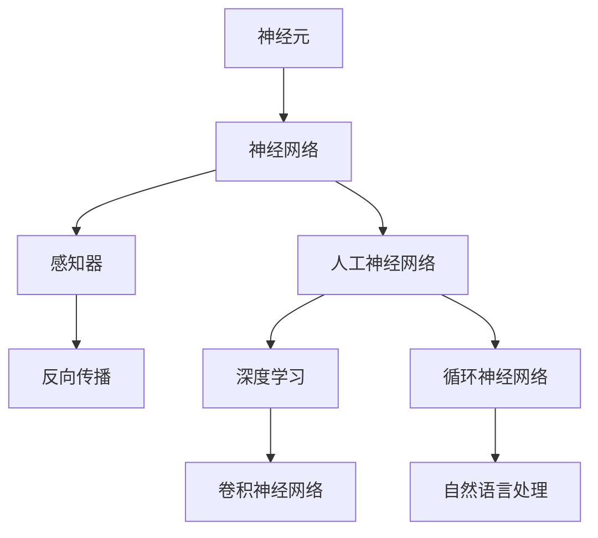

                 

## 1. 背景介绍

### 1.1 问题由来

理解人类大脑的运作机制是现代科学中最令人着迷的课题之一。自19世纪末以来，科学家们一直在努力探索人类大脑的奥秘，并试图用科学的方法解释我们的思维过程、感知和行为。这一领域的重大突破往往能够引领科技的进步，尤其是在人工智能领域。

### 1.2 问题核心关键点

人类大脑的奥秘包括神经元的运作机制、信息的编码和解码、学习与记忆的形成、感知与决策的实现等多个方面。现代神经科学研究主要关注以下几个核心点：

1. **神经元网络结构**：了解神经元如何形成复杂的网络，如何实现信息的传递与加工。
2. **信息编码与解码**：研究大脑如何编码和解码信息，从而形成记忆和感知。
3. **学习和记忆机制**：探索学习和记忆的具体过程，以及如何应用这些机制来开发智能系统。
4. **感知与决策**：研究感知过程和决策制定机制，如何将这些机制应用到机器学习模型中。

### 1.3 问题研究意义

研究人类大脑的运作机制，对于揭示智能和意识的本质具有重要意义。此外，理解这些机制可以帮助开发更加高效、智能的AI系统，解决现实生活中的诸多难题。

1. **提升人工智能系统**：基于人类大脑的运作机制，可以设计出更加高效、智能的AI算法，提升AI系统在各个领域的应用效果。
2. **促进医疗技术发展**：对于神经疾病和脑损伤的研究，可以帮助开发出更好的治疗方法和康复技术。
3. **推动心理学研究**：人类大脑的研究可以深入了解心理过程和行为模式，从而提升对心理疾病的诊断和治疗能力。
4. **增强人类认知**：通过对人类大脑机制的深入研究，可以提升人类自身的认知能力，改善生活质量。

## 2. 核心概念与联系

### 2.1 核心概念概述

为了更好地理解人类大脑的运作机制，本节将介绍几个关键概念：

- **神经元(Neuron)**：构成大脑的基本单位，能够接收、处理和传递信息。
- **神经网络(Neural Network)**：由大量神经元组成的网络，用于处理复杂的输入和输出。
- **感知器(Perceptron)**：最简单的神经网络模型，用于处理二分类任务。
- **反向传播(Backpropagation)**：一种通过误差反向传播更新神经网络权重的方法，用于训练神经网络。
- **人工神经网络(Artificial Neural Network, ANN)**：模仿人类大脑的神经网络结构，用于处理各种复杂任务。
- **深度学习(Deep Learning)**：一种利用多层神经网络处理高维度、大规模数据的技术。
- **卷积神经网络(Convolutional Neural Network, CNN)**：用于图像处理和计算机视觉任务的神经网络。
- **循环神经网络(Recurrent Neural Network, RNN)**：用于处理序列数据的神经网络，如自然语言处理。

这些核心概念之间的逻辑关系可以通过以下Mermaid流程图来展示：



这个流程图展示了人类大脑和AI模型之间核心概念的联系：

1. 神经元是构成神经网络的基本单元，能够传递和处理信息。
2. 感知器和人工神经网络是神经网络的基础模型，用于处理分类和回归任务。
3. 反向传播是一种训练神经网络的方法，使得神经网络能够根据误差进行权重调整。
4. 深度学习和CNN用于处理高维度数据，提升模型的表达能力。
5. RNN和NLP模型用于处理序列数据，如自然语言处理。

这些概念共同构成了现代神经网络的理论基础，为人类大脑和AI模型的研究提供了重要的工具和方法。

## 3. 核心算法原理 & 具体操作步骤

### 3.1 算法原理概述

理解人类大脑的运作机制，主要依赖于神经网络模型和深度学习算法。这些算法通过模拟神经元之间的连接和信息传递，来解释人类大脑如何处理和存储信息。

1. **前向传播**：输入数据通过神经网络逐层传递，每层神经元对输入数据进行处理，最终输出结果。
2. **损失函数**：用于衡量模型预测结果与真实结果之间的差异。
3. **反向传播**：通过误差反向传播更新模型权重，使得模型能够更好地拟合训练数据。
4. **优化算法**：如梯度下降、Adam等，用于调整模型参数，最小化损失函数。

### 3.2 算法步骤详解

基于神经网络的人类大脑运作机制，可以通过以下几个步骤进行详细的阐述：

**Step 1: 数据准备**
- 收集大量的训练数据，包括输入和输出。
- 将输入数据标准化，使其适合神经网络的输入。
- 将输出数据进行标签化，用于监督学习。

**Step 2: 模型选择**
- 选择合适的神经网络模型，如全连接神经网络、卷积神经网络、循环神经网络等。
- 根据任务需求，设置模型的层数和节点数。

**Step 3: 模型训练**
- 使用反向传播算法更新模型权重。
- 设置合适的学习率和优化算法。
- 进行多轮训练，直到损失函数收敛。

**Step 4: 模型评估**
- 使用测试数据集评估模型性能。
- 计算模型的准确率、召回率、F1值等指标。
- 进行交叉验证，确保模型泛化能力。

**Step 5: 模型应用**
- 将训练好的模型应用到实际问题中。
- 进行前向传播，输出预测结果。
- 根据输出结果进行后续处理，如分类、回归、生成等。

### 3.3 算法优缺点

基于神经网络的人类大脑运作机制，有以下优缺点：

**优点：**
1. **高效处理复杂数据**：神经网络可以处理高维度、大规模的数据集，具有强大的表达能力。
2. **自适应能力强**：通过反向传播算法，神经网络可以自适应地调整参数，提升模型性能。
3. **可解释性强**：通过可视化技术，可以直观地理解神经网络的处理过程和决策机制。
4. **可扩展性好**：神经网络可以通过增加层数和节点数，扩展模型的表达能力。

**缺点：**
1. **计算资源消耗大**：神经网络需要大量的计算资源进行训练和推理。
2. **过拟合风险高**：训练过程中容易出现过拟合，需要额外的正则化和优化方法。
3. **模型可解释性不足**：神经网络的结构复杂，难以理解其内部的决策过程。
4. **参数调优困难**：神经网络参数众多，调优复杂。

### 3.4 算法应用领域

基于神经网络的人类大脑运作机制，已经被广泛应用于以下几个领域：

- **计算机视觉**：图像分类、目标检测、图像生成等任务。
- **自然语言处理**：语言模型、机器翻译、文本生成等任务。
- **语音识别**：语音转文本、语音合成等任务。
- **推荐系统**：个性化推荐、用户行为分析等任务。
- **游戏AI**：智能游戏、机器人控制等任务。

这些领域的应用展示了神经网络在处理复杂任务中的强大能力，为人工智能技术的发展提供了重要的技术支持。

## 4. 数学模型和公式 & 详细讲解 & 举例说明

### 4.1 数学模型构建

为了更好地理解人类大脑的运作机制，我们需要构建一个数学模型来描述神经网络的结构和计算过程。

记神经网络模型为 $M=\{w_i, b_i, \sigma_i\}_{i=1}^n$，其中 $w_i$ 为神经元权重矩阵，$b_i$ 为偏置向量，$\sigma_i$ 为激活函数。输入数据 $x$ 通过神经元处理后，得到输出结果 $y$。

$$
y_i = \sigma_i(w_ix + b_i)
$$

### 4.2 公式推导过程

以简单的感知器模型为例，推导其处理二分类任务的过程。

设输入向量 $x \in \mathbb{R}^n$，输出为 $y \in \{0,1\}$，使用sigmoid函数作为激活函数。

感知器的输出可以表示为：

$$
y = \sigma(w^T x + b)
$$

其中 $w$ 为权重向量，$b$ 为偏置。

对于二分类任务，可以使用逻辑回归函数来定义输出：

$$
y = \frac{1}{1+\exp(-z)}
$$

其中 $z = w^T x + b$。

### 4.3 案例分析与讲解

以图像分类为例，分析卷积神经网络如何处理高维度数据。

设输入数据为一张图像 $x$，使用卷积层进行特征提取。卷积层使用卷积核 $k$ 对输入数据进行卷积操作，得到卷积特征图 $F$。

$$
F = k * x
$$

通过多层的卷积层和池化层，提取图像的高层次特征。最后，使用全连接层对特征进行分类，得到输出结果 $y$。

$$
y = M(x)
$$

其中 $M$ 为卷积神经网络模型。

## 5. 项目实践：代码实例和详细解释说明

### 5.1 开发环境搭建

在进行神经网络模型的实践时，我们需要准备好开发环境。以下是使用Python进行TensorFlow开发的配置流程：

1. 安装Anaconda：从官网下载并安装Anaconda，用于创建独立的Python环境。

2. 创建并激活虚拟环境：
```bash
conda create -n tf-env python=3.8 
conda activate tf-env
```

3. 安装TensorFlow：
```bash
pip install tensorflow
```

4. 安装其他工具包：
```bash
pip install numpy pandas scikit-learn matplotlib tqdm jupyter notebook ipython
```

完成上述步骤后，即可在`tf-env`环境中开始神经网络模型的开发。

### 5.2 源代码详细实现

以下是使用TensorFlow实现卷积神经网络进行图像分类的代码实现。

```python
import tensorflow as tf
from tensorflow.keras import layers

# 定义卷积神经网络模型
model = tf.keras.Sequential()
model.add(layers.Conv2D(32, (3, 3), activation='relu', input_shape=(28, 28, 1)))
model.add(layers.MaxPooling2D((2, 2)))
model.add(layers.Conv2D(64, (3, 3), activation='relu'))
model.add(layers.MaxPooling2D((2, 2)))
model.add(layers.Flatten())
model.add(layers.Dense(64, activation='relu'))
model.add(layers.Dense(10))

# 编译模型
model.compile(optimizer='adam',
              loss=tf.keras.losses.SparseCategoricalCrossentropy(from_logits=True),
              metrics=['accuracy'])

# 加载数据集
mnist = tf.keras.datasets.mnist
(x_train, y_train), (x_test, y_test) = mnist.load_data()
x_train = x_train.reshape(-1, 28, 28, 1).astype('float32') / 255.0
x_test = x_test.reshape(-1, 28, 28, 1).astype('float32') / 255.0

# 训练模型
model.fit(x_train, y_train, epochs=5, validation_data=(x_test, y_test))
```

以上是使用TensorFlow对卷积神经网络进行图像分类的完整代码实现。可以看到，TensorFlow提供了方便的API，可以轻松构建和训练卷积神经网络模型。

### 5.3 代码解读与分析

让我们再详细解读一下关键代码的实现细节：

**Sequential模型**：
- `Sequential`模型是TensorFlow中的一种线性堆叠方式，用于构建多层的神经网络。
- 定义了多个卷积层和池化层，用于提取图像的特征。
- 使用`Flatten`层将卷积层输出的高维度特征展平，准备输入全连接层。
- 最后使用`Dense`层进行分类输出。

**模型编译**：
- `compile`方法用于编译模型，设置优化器、损失函数和评估指标。
- 使用`adam`优化器，并设置交叉熵损失函数和准确率评估指标。

**数据加载**：
- `mnist`数据集包含手写数字图片，包含训练集和测试集。
- 将数据集转换为TensorFlow可用的格式，并进行标准化处理。

**模型训练**：
- `fit`方法用于训练模型，指定训练数据和测试数据。
- 设置训练轮数为5，并在验证集上评估模型性能。

可以看到，使用TensorFlow进行神经网络模型的开发相对简洁高效。开发者可以将更多精力放在模型设计、数据预处理等高层逻辑上，而不必过多关注底层的实现细节。

当然，工业级的系统实现还需考虑更多因素，如模型的保存和部署、超参数的自动搜索、更灵活的任务适配层等。但核心的神经网络建模基本与此类似。

## 6. 实际应用场景

### 6.1 医疗影像诊断

基于神经网络的医疗影像诊断技术，已经成为医学影像领域的重要工具。传统的影像诊断需要医生通过大量经验进行判断，耗时耗力且容易出错。使用神经网络进行影像诊断，可以提高诊断的准确性和效率。

在实践中，可以收集大量已标注的影像数据，对神经网络进行训练。训练好的模型能够自动分析影像特征，识别病变区域，辅助医生进行诊断。此外，神经网络还可以通过迁移学习，将医学影像中的通用特征提取出来，用于多种疾病的诊断。

### 6.2 自然语言处理

自然语言处理(NLP)是神经网络的重要应用领域之一。传统的NLP技术基于规则和特征工程，需要大量人工工作。使用神经网络进行NLP任务，可以显著提升处理速度和精度。

在实践中，可以收集大量的文本数据，对神经网络进行训练。训练好的模型能够自动分析文本的语义信息，进行文本分类、情感分析、机器翻译等任务。此外，神经网络还可以通过迁移学习，将通用语言知识应用于特定领域，如医疗、金融、法律等。

### 6.3 智能推荐系统

基于神经网络的推荐系统，可以提升用户的个性化体验。传统的推荐系统基于用户历史行为进行推荐，无法理解用户的多样化需求。使用神经网络进行推荐，可以更好地理解用户的兴趣偏好，提升推荐效果。

在实践中，可以收集大量的用户行为数据，对神经网络进行训练。训练好的模型能够自动分析用户的兴趣特征，进行个性化推荐。此外，神经网络还可以通过迁移学习，将用户的多样化需求提取出来，用于多种类型的推荐任务。

### 6.4 未来应用展望

随着神经网络技术的发展，未来其在各个领域的应用将更加广泛。以下是几个未来可能的发展方向：

1. **生物识别**：神经网络可以用于人脸识别、指纹识别等生物识别技术，提升安全性和便捷性。
2. **自动驾驶**：神经网络可以用于自动驾驶系统的感知和决策，提升驾驶安全性和效率。
3. **智能制造**：神经网络可以用于工业机器人的控制和故障诊断，提升生产效率和质量。
4. **智能家居**：神经网络可以用于智能家电的控制和语音识别，提升生活质量和便利性。
5. **智慧城市**：神经网络可以用于城市交通、环境监测等智能系统的建设，提升城市管理水平。

这些应用展示了神经网络在各个领域中的强大潜力，未来将为人类生活带来更多的便利和创新。

## 7. 工具和资源推荐

### 7.1 学习资源推荐

为了帮助开发者系统掌握神经网络的理论基础和实践技巧，这里推荐一些优质的学习资源：

1. 《深度学习》系列书籍：由多位深度学习专家共同编写，深入浅出地介绍了深度学习的基本原理和应用场景。
2. 《Python深度学习》书籍：由Francois Chollet著，详细介绍了使用TensorFlow和Keras进行深度学习开发的方法。
3. 《神经网络与深度学习》课程：由Michael Nielsen教授授课，涵盖神经网络的基本原理和应用。
4. Coursera深度学习课程：由多位顶尖大学的教授授课，涵盖深度学习的各个方面，包括卷积神经网络、循环神经网络等。
5. 深度学习竞赛平台：如Kaggle，提供大量实际问题，通过竞赛形式提升深度学习技能。

通过对这些资源的学习实践，相信你一定能够快速掌握神经网络的理论基础和实践技能，并用于解决实际的NLP问题。

### 7.2 开发工具推荐

高效的开发离不开优秀的工具支持。以下是几款用于神经网络模型开发的常用工具：

1. TensorFlow：由Google主导开发的深度学习框架，生产部署方便，适合大规模工程应用。
2. PyTorch：基于Python的开源深度学习框架，灵活动态的计算图，适合快速迭代研究。
3. Keras：高层次的深度学习框架，易于使用，适合初学者快速上手。
4. JAX：基于XLA的高性能深度学习库，支持自动微分和分布式计算。
5. NVIDIA DeepLearning SDK：支持GPU加速的深度学习开发环境，适合高性能计算。

合理利用这些工具，可以显著提升神经网络模型的开发效率，加快创新迭代的步伐。

### 7.3 相关论文推荐

神经网络技术的发展源于学界的持续研究。以下是几篇奠基性的相关论文，推荐阅读：

1. "The Learning Automaton"：由Hubel和Wiesel于1959年发表，是神经科学和神经网络研究的奠基之作。
2. "Perceptron: A Probabilistic Model for Information Storage and Organization in the Brain"：由Rosenblatt于1958年发表，提出感知器模型。
3. "A Neural Network Model of Recognition Memory"：由Marr和Hintsont于1980年发表，提出多层神经网络模型。
4. "Backpropagation: Applying the Backward Pass Algorithm for Supervised Neural Net Training and Performance Research"：由Rumelhart等人在1986年发表，提出反向传播算法。
5. "Deep Learning"：由Ian Goodfellow等人在2016年发表，系统介绍了深度学习的基本原理和应用。

这些论文代表了大规模神经网络的发展脉络，通过学习这些前沿成果，可以帮助研究者把握学科前进方向，激发更多的创新灵感。

## 8. 总结：未来发展趋势与挑战

### 8.1 总结

本文对基于神经网络的人类大脑运作机制进行了全面系统的介绍。首先阐述了神经网络模型的基本原理和应用，明确了神经网络在各个领域中的强大潜力。其次，从原理到实践，详细讲解了神经网络模型的数学模型和算法步骤，给出了神经网络模型开发的完整代码实例。同时，本文还广泛探讨了神经网络模型在医疗、NLP、推荐系统等多个领域的应用前景，展示了神经网络模型的广阔应用场景。最后，本文精选了神经网络模型的各类学习资源，力求为读者提供全方位的技术指引。

通过本文的系统梳理，可以看到，基于神经网络的人类大脑运作机制已经成为现代人工智能的核心技术之一，具有广泛的应用前景和深远的学术价值。未来，伴随神经网络技术的不断发展，其在各个领域的应用将更加广泛，为人类社会的进步和创新提供强大的动力。

### 8.2 未来发展趋势

展望未来，神经网络技术将呈现以下几个发展趋势：

1. **模型规模持续增大**：随着计算能力的提升，神经网络模型的规模将不断增大，提升模型的表达能力和性能。
2. **计算效率不断提升**：使用更高效的计算方法和硬件设备，提升神经网络的训练和推理速度。
3. **模型泛化能力增强**：通过更先进的学习方法和正则化技术，提高神经网络的泛化能力和鲁棒性。
4. **多模态融合**：将视觉、听觉、语言等多模态信息融合到神经网络中，提升模型的感知和理解能力。
5. **迁移学习能力提升**：通过迁移学习和元学习，使神经网络能够快速适应新任务和环境变化。
6. **联邦学习应用广泛**：通过联邦学习技术，在分布式环境中训练神经网络，保护数据隐私和提升模型性能。

这些趋势展示了神经网络技术的未来发展方向，为人工智能技术的进一步发展提供了重要的技术支持。

### 8.3 面临的挑战

尽管神经网络技术已经取得了显著成就，但在迈向更加智能化、普适化应用的过程中，仍面临着诸多挑战：

1. **计算资源消耗大**：神经网络模型需要大量的计算资源进行训练和推理，如何在资源受限的环境中进行高效训练和推理，是一个重要的研究方向。
2. **模型可解释性不足**：神经网络模型结构复杂，难以理解其内部的决策过程，如何提高模型的可解释性，是未来的一个重要课题。
3. **过拟合风险高**：神经网络模型容易发生过拟合现象，需要更先进的学习方法和正则化技术进行改进。
4. **数据隐私问题**：神经网络模型通常需要大量的标注数据进行训练，如何保护数据隐私和安全性，是一个重要的研究方向。
5. **模型泛化能力有限**：神经网络模型在处理新任务和复杂数据时，泛化能力有限，需要进一步提升模型的泛化能力。
6. **资源优化困难**：神经网络模型参数众多，如何在资源有限的情况下进行高效训练和推理，是一个重要的研究方向。

这些挑战展示了神经网络技术未来的发展方向，需要在各个方面进行深入研究，才能更好地应对未来的应用需求。

### 8.4 研究展望

面对神经网络技术所面临的挑战，未来的研究需要在以下几个方面寻求新的突破：

1. **模型压缩和优化**：开发更加高效的模型压缩和优化方法，提升神经网络的训练和推理速度。
2. **知识蒸馏和迁移学习**：通过知识蒸馏和迁移学习，提升神经网络的泛化能力和可解释性。
3. **联邦学习和分布式训练**：在分布式环境中训练神经网络，保护数据隐私和提升模型性能。
4. **元学习和自适应学习**：开发更加先进的元学习和自适应学习算法，提升神经网络的适应能力和学习速度。
5. **多模态融合和跨模态学习**：将视觉、听觉、语言等多模态信息融合到神经网络中，提升模型的感知和理解能力。
6. **可解释性和可解释性技术**：开发更强的可解释性和可解释性技术，提升神经网络的可解释性和可信度。

这些研究方向展示了神经网络技术的未来发展方向，为人工智能技术的进一步发展提供了重要的技术支持。相信随着学界和产业界的共同努力，这些挑战终将一一被克服，神经网络技术必将在构建人机协同的智能时代中扮演越来越重要的角色。

## 9. 附录：常见问题与解答

**Q1：神经网络模型为什么需要进行反向传播？**

A: 反向传播是一种通过误差反向传播更新模型权重的方法，使得模型能够根据预测误差进行参数调整，提升模型的拟合能力。在神经网络中，前向传播用于计算模型输出，反向传播用于计算模型误差，两者结合形成完整的训练过程。

**Q2：神经网络模型如何进行正则化？**

A: 正则化是一种防止模型过拟合的方法，通过在损失函数中加入正则项，限制模型参数的大小和数量。常见的正则化方法包括L1正则、L2正则、Dropout等。

**Q3：神经网络模型如何进行迁移学习？**

A: 迁移学习是一种将一个领域学习到的知识，迁移应用到另一个不同但相关的领域的学习范式。通过在预训练模型上微调新任务的数据集，可以加速新任务的训练和提升模型的泛化能力。

**Q4：神经网络模型如何进行优化？**

A: 神经网络模型的优化通常使用梯度下降等优化算法，通过最小化损失函数，更新模型参数。常见的优化算法包括SGD、Adam、Adagrad等。

**Q5：神经网络模型如何进行数据增强？**

A: 数据增强是一种通过扩充训练数据集，提升模型泛化能力的方法。常见的数据增强技术包括图像旋转、平移、缩放、噪声注入等。

这些问题的解答展示了神经网络模型的基本原理和实践方法，为研究者和开发者提供了重要的参考。相信通过对这些问题的深入理解，能够更好地掌握神经网络技术，推动人工智能技术的发展。

---

作者：禅与计算机程序设计艺术 / Zen and the Art of Computer Programming

