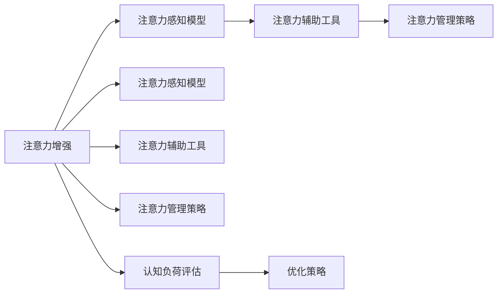

                 

# 人类注意力增强：提升专注力和注意力在医疗中的应用场景

## 1. 背景介绍

### 1.1 问题由来
在当今高速发展的信息时代，人类面临着一个共同的挑战：注意力资源的不足。无论是工作、学习还是日常生活，都要求我们维持高水平注意力以完成任务。尤其是在医疗领域，由于工作的复杂性和风险性，医护人员需要高度的专注力和集中注意力，以确保患者得到高质量的医疗服务。

注意力作为一种有限的心理资源，极易受到干扰和损耗。长期以来，人们尝试通过各种方法来提升注意力水平，例如冥想、休息、药物干预等。然而，这些方法在提升长期注意力能力方面效果有限。近年来，随着人工智能技术的发展，借助技术手段辅助提升注意力水平，成为一种新兴的研究方向。本文将探讨人工智能在提升医疗领域注意力中的应用，及其潜在的未来发展趋势。

### 1.2 问题核心关键点
本节将从以下几个核心关键点深入分析注意力增强在医疗领域的应用：

- **注意力增强机制**：如何通过人工智能技术辅助提升医护人员在医疗工作中的专注力。
- **注意力感知模型**：如何构建模型感知和度量医护人员在医疗工作中的注意力状态。
- **注意力辅助工具**：如何开发可辅助医护人员集中注意力、减少认知负荷的工具。
- **注意力管理策略**：如何结合AI工具与医护人员自身策略，实现更高效的注意力管理。

## 2. 核心概念与联系

### 2.1 核心概念概述

在探讨注意力增强在医疗领域的应用前，我们需要了解以下几个核心概念：

- **注意力**：指个体在特定任务上的专注程度。在医疗领域，这通常体现在医护人员对患者的注意力和对其工作内容的专注力。
- **注意力增强**：通过各种手段提升个体在特定任务上的注意力水平。这些手段包括但不限于技术工具、认知训练、环境优化等。
- **人工智能**：利用算法和数据处理技术，模拟人类智能行为的技术体系。
- **医疗领域**：一个对注意力需求极高且对注意力干扰众多的环境。
- **认知负荷**：个体在完成任务时所承担的心理负担。高认知负荷会严重影响工作效率和注意力水平。

### 2.2 核心概念原理和架构的 Mermaid 流程图



此图展示了注意力增强的总体架构，其中包含以下几个关键环节：

1. **注意力感知模型**：感知并度量医护人员的注意力状态。
2. **注意力辅助工具**：根据注意力状态提供辅助，帮助医护人员集中注意力。
3. **注意力管理策略**：结合AI工具与医护人员自身策略，实现更高效的注意力管理。
4. **认知负荷评估**：评估医护人员在执行任务时的认知负荷。
5. **优化策略**：根据认知负荷评估结果，调整注意力增强策略。

## 3. 核心算法原理 & 具体操作步骤

### 3.1 算法原理概述

注意力增强的核心原理在于通过人工智能技术，辅助医护人员提升在特定任务上的注意力水平。其算法原理主要包括以下几个方面：

1. **注意力感知模型**：使用机器学习算法，如深度学习、强化学习等，构建模型感知并度量医护人员的注意力状态。
2. **注意力辅助工具**：根据注意力感知模型的输出，设计合适的辅助工具，如提醒系统、聚焦环境、任务切换策略等，帮助医护人员集中注意力。
3. **注意力管理策略**：结合AI工具与医护人员自身策略，制定科学的注意力管理方案，优化医护人员的工作流程和任务分配。

### 3.2 算法步骤详解

#### 3.2.1 注意力感知模型构建

注意力感知模型的构建步骤如下：

1. **数据收集**：收集医护人员在执行医疗任务时的生理数据和行为数据。生理数据包括心率、皮肤电、脑电等；行为数据包括按键操作、语音输入、屏幕聚焦位置等。
2. **数据预处理**：对收集到的数据进行清洗、归一化处理，去除噪声和异常值。
3. **特征提取**：选择对注意力状态有影响的关键特征，如心率和聚焦位置。
4. **模型训练**：使用深度学习模型（如卷积神经网络CNN、循环神经网络RNN、Transformer等）对数据进行训练，构建注意力感知模型。
5. **模型评估**：使用独立测试数据集评估模型的性能，调整模型参数以提高准确度。

#### 3.2.2 注意力辅助工具设计

设计注意力辅助工具的步骤如下：

1. **用户需求分析**：了解医护人员在使用注意力辅助工具时的需求和痛点。
2. **工具功能设计**：根据需求分析结果，设计工具的核心功能，如提醒系统、聚焦环境等。
3. **工具实现**：开发工具的实现代码，确保工具的稳定性和易用性。
4. **用户测试**：邀请医护人员对工具进行试用，收集反馈，调整工具设计。
5. **工具部署**：将工具部署到实际医疗环境中，监测其效果。

#### 3.2.3 注意力管理策略制定

注意力管理策略的制定步骤如下：

1. **任务分析**：对医疗任务进行详细分析，确定不同任务对注意力的需求和干扰因素。
2. **策略设计**：根据任务分析结果，设计相应的注意力管理策略，如任务优先级、时间分配、休息间隔等。
3. **策略执行**：将策略嵌入到医院的日常管理系统中，对医护人员的工作流程进行优化。
4. **效果评估**：定期评估策略的效果，根据反馈进行调整。

### 3.3 算法优缺点

#### 3.3.1 优点

- **高效性**：AI工具能够在短时间内处理大量数据，提供实时反馈，帮助医护人员及时调整注意力状态。
- **可扩展性**：AI工具可以根据不同场景和需求进行灵活调整，适应多种医疗工作环境。
- **个性化**：AI工具能够根据个体差异，提供个性化的注意力辅助策略，提高医护人员的工作满意度。

#### 3.3.2 缺点

- **依赖数据质量**：注意力感知模型的效果依赖于数据的质量和数量，低质量的数据可能导致模型性能不佳。
- **技术复杂性**：构建和部署AI工具需要一定的技术背景，对医护人员的培训和操作要求较高。
- **隐私问题**：收集和使用生理数据和行为数据可能涉及隐私问题，需要严格的数据保护措施。

### 3.4 算法应用领域

注意力增强在医疗领域的应用范围广泛，包括但不限于以下几个方面：

- **手术室环境**：设计聚焦环境，通过声光和振动反馈，帮助手术团队集中注意力，减少手术失误。
- **急诊室**：使用提醒系统，根据患者情况和当前任务优先级，提示医护人员优先处理紧急情况，提高抢救效率。
- **门诊和住院病房**：设计任务切换策略，根据医护人员的工作状态，动态调整任务优先级，减少认知负荷。
- **远程医疗**：结合AI工具和家庭环境，提供实时注意力监测和提醒，辅助患者进行自我管理。

## 4. 数学模型和公式 & 详细讲解 & 举例说明

### 4.1 数学模型构建

本节将使用数学语言对注意力增强的模型构建进行更加严格的刻画。

设医护人员在任务 $i$ 上的注意力状态为 $A_i$，使用一个时间序列 $A=\{A_1, A_2, ..., A_N\}$ 来表示。假设使用一个基于深度学习的注意力感知模型 $M$ 对医护人员的注意力状态进行度量，得到注意力得分 $S=\{S_1, S_2, ..., S_N\}$，其中 $S_i$ 表示任务 $i$ 的注意力得分。注意力得分越高，表示医护人员在该任务上的注意力越集中。

### 4.2 公式推导过程

设注意力感知模型的输入为 $X=\{x_1, x_2, ..., x_N\}$，输出为 $Y=\{y_1, y_2, ..., y_N\}$，其中 $y_i$ 为任务 $i$ 的注意力得分。假设使用一个多层感知器 (MLP) 作为模型 $M$，其结构如下：

$$
y_i = M(x_i; \theta) = \sigma(W_L \sigma(W_{L-1} \sigma(... \sigma(W_1 x_i + b_1) + b_{L-1}) + b_L)
$$

其中 $\sigma$ 为激活函数，$W_1, W_2, ..., W_L$ 为权重矩阵，$b_1, b_2, ..., b_L$ 为偏置项，$\theta$ 为模型参数。

对于注意力辅助工具，假设设计了一个提醒系统，根据注意力得分 $S_i$ 判断是否需要提醒，阈值为 $T$，如果 $S_i > T$，则触发提醒。

### 4.3 案例分析与讲解

以急诊室为例，分析如何应用注意力增强技术提升医护人员的工作效率：

- **数据收集**：使用传感器收集医护人员在急诊室执行任务时的心率、皮肤电、聚焦位置等数据。
- **数据预处理**：清洗数据，去除噪声和异常值，归一化处理。
- **特征提取**：选择对急诊任务有影响的关键特征，如心率变化和聚焦位置。
- **模型训练**：使用深度学习模型（如RNN）对数据进行训练，构建注意力感知模型 $M$。
- **模型评估**：使用独立测试数据集评估模型的性能，调整模型参数以提高准确度。
- **提醒系统设计**：根据注意力得分 $S_i$，设计一个提醒系统，当 $S_i > T$ 时，系统自动提醒医护人员当前任务紧急程度高，需优先处理。
- **效果评估**：定期监测提醒系统的应用效果，根据医护人员的反馈调整提醒策略。

## 5. 项目实践：代码实例和详细解释说明

### 5.1 开发环境搭建

在进行注意力增强项目的开发前，我们需要准备好开发环境。以下是使用Python进行PyTorch开发的环境配置流程：

1. 安装Anaconda：从官网下载并安装Anaconda，用于创建独立的Python环境。

2. 创建并激活虚拟环境：
```bash
conda create -n attention-env python=3.8 
conda activate attention-env
```

3. 安装PyTorch：根据CUDA版本，从官网获取对应的安装命令。例如：
```bash
conda install pytorch torchvision torchaudio cudatoolkit=11.1 -c pytorch -c conda-forge
```

4. 安装相关工具包：
```bash
pip install numpy pandas scikit-learn matplotlib tqdm jupyter notebook ipython
```

完成上述步骤后，即可在`attention-env`环境中开始项目实践。

### 5.2 源代码详细实现

这里以一个简单的提醒系统为例，使用PyTorch实现注意力感知模型的构建和注意力辅助工具的设计。

首先，定义注意力感知模型：

```python
import torch
import torch.nn as nn
import torch.optim as optim

class AttentionModel(nn.Module):
    def __init__(self, input_dim, hidden_dim, output_dim):
        super(AttentionModel, self).__init__()
        self.hidden = nn.Linear(input_dim, hidden_dim)
        self.attention = nn.Linear(hidden_dim, output_dim)
    
    def forward(self, x):
        hidden = self.hidden(x)
        attention = self.attention(hidden)
        return attention
```

然后，构建注意力感知模型，使用PyTorch的训练框架：

```python
# 定义数据集
class AttentionDataset(torch.utils.data.Dataset):
    def __init__(self, x, y):
        self.x = x
        self.y = y
    
    def __len__(self):
        return len(self.x)
    
    def __getitem__(self, idx):
        return self.x[idx], self.y[idx]
    
# 加载数据集
dataset = AttentionDataset(x_data, y_data)

# 定义模型和优化器
model = AttentionModel(input_dim, hidden_dim, output_dim)
optimizer = optim.Adam(model.parameters(), lr=learning_rate)

# 训练模型
for epoch in range(num_epochs):
    for i, (inputs, labels) in enumerate(dataset):
        optimizer.zero_grad()
        outputs = model(inputs)
        loss = nn.BCEWithLogitsLoss()(outputs, labels)
        loss.backward()
        optimizer.step()
```

最后，设计注意力辅助工具，如提醒系统：

```python
def attention_reminder(attention_score, threshold):
    if attention_score > threshold:
        print("High attention score detected! Alert!")
    else:
        print("Low attention score. No alert.")
```

### 5.3 代码解读与分析

让我们再详细解读一下关键代码的实现细节：

**AttentionModel类**：
- `__init__`方法：初始化模型参数，包括线性层和激活函数。
- `forward`方法：前向传播，计算输出。

**AttentionDataset类**：
- `__init__`方法：初始化数据集。
- `__len__`方法：返回数据集长度。
- `__getitem__`方法：返回单个样本。

**注意力感知模型训练**：
- 使用PyTorch的DataLoader加载数据集，进行批量训练。
- 定义优化器，使用Adam优化器进行模型参数的更新。
- 定义损失函数，使用二元交叉熵损失函数。

**注意力辅助工具设计**：
- `attention_reminder`函数：根据注意力得分和阈值，输出提醒信息。

## 6. 实际应用场景

### 6.1 手术室环境

手术室是一个对注意力要求极高的环境，医生需要在高强度工作下保持高度专注。通过应用注意力增强技术，手术室可以设计聚焦环境，通过声光和振动反馈，帮助手术团队集中注意力，减少手术失误。

具体实现可以包括以下几个步骤：

1. **数据收集**：使用传感器收集医生在手术过程中的生理数据和行为数据。
2. **数据预处理**：清洗数据，去除噪声和异常值，归一化处理。
3. **特征提取**：选择对手术任务有影响的关键特征，如心率和聚焦位置。
4. **模型训练**：使用深度学习模型（如CNN）对数据进行训练，构建注意力感知模型 $M$。
5. **模型评估**：使用独立测试数据集评估模型的性能，调整模型参数以提高准确度。
6. **聚焦环境设计**：根据注意力得分 $S_i$，设计聚焦环境，当 $S_i > T$ 时，环境自动提醒医生集中注意力。

### 6.2 急诊室

急诊室是一个高风险、高压力的环境，医护人员需要在短时间内处理多项紧急任务。通过应用注意力增强技术，急诊室可以设计提醒系统，根据患者情况和当前任务优先级，提示医护人员优先处理紧急情况，提高抢救效率。

具体实现可以包括以下几个步骤：

1. **数据收集**：使用传感器收集医护人员在急诊室执行任务时的生理数据和行为数据。
2. **数据预处理**：清洗数据，去除噪声和异常值，归一化处理。
3. **特征提取**：选择对急诊任务有影响的关键特征，如心率变化和聚焦位置。
4. **模型训练**：使用深度学习模型（如RNN）对数据进行训练，构建注意力感知模型 $M$。
5. **模型评估**：使用独立测试数据集评估模型的性能，调整模型参数以提高准确度。
6. **提醒系统设计**：根据注意力得分 $S_i$，设计一个提醒系统，当 $S_i > T$ 时，系统自动提醒医护人员当前任务紧急程度高，需优先处理。

### 6.3 门诊和住院病房

门诊和住院病房是医护人员日常工作的主要场所，通过应用注意力增强技术，可以设计任务切换策略，根据医护人员的工作状态，动态调整任务优先级，减少认知负荷。

具体实现可以包括以下几个步骤：

1. **数据收集**：使用传感器收集医护人员在门诊和病房执行任务时的生理数据和行为数据。
2. **数据预处理**：清洗数据，去除噪声和异常值，归一化处理。
3. **特征提取**：选择对门诊任务有影响的关键特征，如心率和聚焦位置。
4. **模型训练**：使用深度学习模型（如Transformer）对数据进行训练，构建注意力感知模型 $M$。
5. **模型评估**：使用独立测试数据集评估模型的性能，调整模型参数以提高准确度。
6. **任务切换策略设计**：根据注意力得分 $S_i$，设计任务切换策略，动态调整任务优先级，减少医护人员的认知负荷。

### 6.4 未来应用展望

随着人工智能技术的发展，注意力增强在医疗领域的应用前景广阔，未来可能涉及以下几个方面：

1. **个性化注意力管理**：结合AI工具和医护人员自身策略，制定科学的注意力管理方案，优化医护人员的工作流程和任务分配。
2. **远程医疗辅助**：结合AI工具和家庭环境，提供实时注意力监测和提醒，辅助患者进行自我管理。
3. **心理压力监测**：应用注意力增强技术，监测医护人员的心理压力和情绪状态，及时提供心理支持和干预。

## 7. 工具和资源推荐

### 7.1 学习资源推荐

为了帮助开发者系统掌握注意力增强的理论基础和实践技巧，这里推荐一些优质的学习资源：

1. 《深度学习》课程（Stanford大学）：斯坦福大学开设的深度学习经典课程，讲解深度学习的基本概念和前沿技术。
2. 《人工智能与医疗》课程（Coursera）：介绍人工智能在医疗领域的应用，涵盖医疗图像、医疗文本等多个方面。
3. 《人工智能技术在医疗中的应用》书籍：详细讲解人工智能技术在医疗领域的各个应用场景，包括注意力增强。
4. PyTorch官方文档：PyTorch的官方文档，提供丰富的API和实例代码，适合快速上手实践。
5. HuggingFace官方文档：HuggingFace提供的自然语言处理工具库，包含多种预训练语言模型，适合进行注意力感知模型的开发。

通过对这些资源的学习实践，相信你一定能够快速掌握注意力增强的精髓，并用于解决实际的医疗问题。

### 7.2 开发工具推荐

高效的开发离不开优秀的工具支持。以下是几款用于注意力增强开发的常用工具：

1. PyTorch：基于Python的开源深度学习框架，灵活动态的计算图，适合快速迭代研究。
2. TensorFlow：由Google主导开发的开源深度学习框架，生产部署方便，适合大规模工程应用。
3. Weights & Biases：模型训练的实验跟踪工具，可以记录和可视化模型训练过程中的各项指标，方便对比和调优。
4. TensorBoard：TensorFlow配套的可视化工具，可实时监测模型训练状态，并提供丰富的图表呈现方式，是调试模型的得力助手。
5. Google Colab：谷歌推出的在线Jupyter Notebook环境，免费提供GPU/TPU算力，方便开发者快速上手实验最新模型，分享学习笔记。

合理利用这些工具，可以显著提升注意力增强任务的开发效率，加快创新迭代的步伐。

### 7.3 相关论文推荐

注意力增强技术的发展源于学界的持续研究。以下是几篇奠基性的相关论文，推荐阅读：

1. Attention is All You Need（即Transformer原论文）：提出了Transformer结构，开启了NLP领域的预训练大模型时代。
2. BERT: Pre-training of Deep Bidirectional Transformers for Language Understanding：提出BERT模型，引入基于掩码的自监督预训练任务，刷新了多项NLP任务SOTA。
3. Deep Residual Learning for Image Recognition（ResNet论文）：提出残差网络结构，解决深度神经网络训练中的梯度消失问题。
4. Adaptive Low-Rank Adaptation for Parameter-Efficient Fine-Tuning（AdaLoRA论文）：使用自适应低秩适应的微调方法，在参数效率和精度之间取得了新的平衡。
5. Revisiting Attention Model for Attention Transfer Learning（Attention Transfer论文）：引入注意力转移学习的思想，提升多任务学习的效果。

这些论文代表了大模型微调技术的发展脉络。通过学习这些前沿成果，可以帮助研究者把握学科前进方向，激发更多的创新灵感。

## 8. 总结：未来发展趋势与挑战

### 8.1 总结

本文对注意力增强在医疗领域的应用进行了全面系统的介绍。首先阐述了注意力增强的重要性，明确了其在提升医护人员专注力、减少认知负荷方面的独特价值。其次，从原理到实践，详细讲解了注意力感知模型的构建和注意力辅助工具的设计，给出了注意力增强任务开发的完整代码实例。同时，本文还广泛探讨了注意力增强在手术室、急诊室、门诊等多个医疗场景中的应用前景，展示了注意力增强技术的巨大潜力。

通过本文的系统梳理，可以看到，注意力增强技术在医疗领域的应用前景广阔，其通过结合人工智能技术和医疗实践，可以显著提升医护人员的工作效率和医疗服务质量。未来，伴随技术的不断演进，注意力增强技术必将为医疗领域带来更多的创新应用，推动医疗服务的智能化和高效化。

### 8.2 未来发展趋势

展望未来，注意力增强技术在医疗领域的应用将呈现以下几个发展趋势：

1. **技术融合**：结合虚拟现实（VR）、增强现实（AR）等新兴技术，提供更沉浸式的工作环境，增强医护人员的注意力。
2. **个性化策略**：根据医护人员的个体差异，制定个性化的注意力管理方案，提升工作满意度。
3. **跨学科应用**：将注意力增强技术应用于不同医疗领域，如手术、急诊、门诊等，提高各场景的专注度和效率。
4. **智能诊断辅助**：结合注意力增强技术和智能诊断系统，帮助医护人员进行快速准确的诊断。

### 8.3 面临的挑战

尽管注意力增强技术在医疗领域的应用已经取得了一定进展，但在迈向更加智能化、普适化应用的过程中，它仍面临着诸多挑战：

1. **数据隐私问题**：注意力感知模型的应用需要收集大量生理和行为数据，涉及隐私问题，需严格保护。
2. **技术复杂性**：注意力增强技术的开发和应用需要较高的技术门槛，需进行系统的培训和支持。
3. **模型可解释性**：注意力感知模型的决策过程缺乏可解释性，难以对其推理逻辑进行分析和调试。
4. **实际效果**：注意力增强技术的效果依赖于数据的准确性和模型的性能，需在实际应用中不断优化。

### 8.4 研究展望

面对注意力增强技术面临的这些挑战，未来的研究需要在以下几个方面寻求新的突破：

1. **数据隐私保护**：开发隐私保护技术，确保数据的安全性和匿名性。
2. **模型可解释性**：增强注意力感知模型的可解释性，提供透明的决策过程。
3. **多模态融合**：结合多种传感器数据，构建多模态注意力感知模型，提高感知精度。
4. **跨学科应用**：将注意力增强技术应用于更多医疗领域，提升各场景的工作效率。

这些研究方向的探索，必将引领注意力增强技术迈向更高的台阶，为医疗领域带来更多的创新应用，推动医疗服务的智能化和高效化。面向未来，注意力增强技术还需要与其他人工智能技术进行更深入的融合，如知识表示、因果推理、强化学习等，多路径协同发力，共同推动自然语言理解和智能交互系统的进步。只有勇于创新、敢于突破，才能不断拓展注意力增强的边界，让智能技术更好地造福人类社会。

## 9. 附录：常见问题与解答

**Q1：注意力增强是否适用于所有医疗场景？**

A: 注意力增强在大多数医疗场景上都能取得不错的效果，但对于一些特定场景，如紧急救治、复杂手术等，需要综合考虑多种因素，如环境干扰、患者情况等，才能确定注意力增强的效果。

**Q2：注意力感知模型如何处理复杂任务？**

A: 对于复杂任务，需要构建更复杂的注意力感知模型，如多任务学习、对抗性训练等，提升模型的泛化能力和鲁棒性。

**Q3：注意力辅助工具如何设计？**

A: 设计注意力辅助工具时，需考虑医护人员的需求和反馈，结合任务特性，设计合适的提醒、聚焦环境等辅助手段。

**Q4：注意力增强如何应对数据多样性？**

A: 对于数据多样性较大的场景，需构建多模态注意力感知模型，结合多种传感器数据，提高模型的感知精度。

**Q5：注意力增强如何结合医疗设备？**

A: 结合医疗设备，如电子病历系统、手术机器人等，可以提供更精准的注意力监测和提醒，提升医护人员的工作效率。

总之，注意力增强技术在医疗领域的应用前景广阔，但需要在数据隐私、技术复杂性、模型可解释性等方面进行全面优化，才能真正实现其潜力。通过不断的技术创新和实践探索，相信注意力增强技术必将为医疗领域带来更多的创新应用，推动医疗服务的智能化和高效化。

