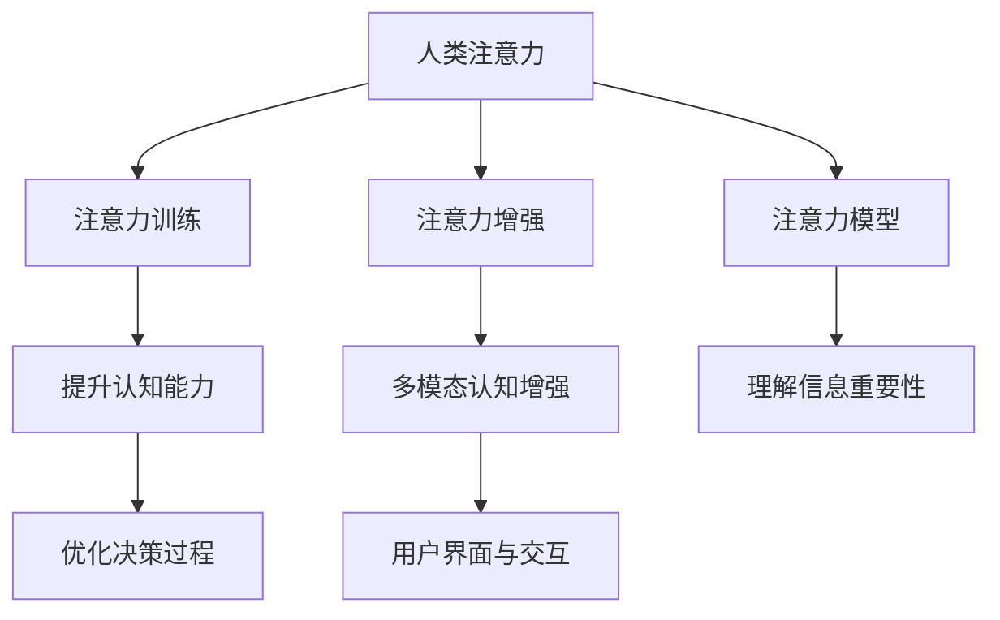

                 

# 人类注意力增强：提升专注力和注意力在商业中的未来发展机遇分析机遇趋势预测

> 关键词：人类注意力增强, 提升专注力, 商业应用, 未来趋势, 机遇与挑战

## 1. 背景介绍

在快速发展的数字时代，注意力作为一种重要的认知资源，正变得越来越稀缺。面对海量信息和高强度的工作压力，如何提升人类的注意力水平，成为商业和社会亟待解决的问题。基于对人类认知科学的深入研究和前沿技术的突破，人类注意力增强技术应运而生，其在商业领域的应用前景广阔，为提升个人和组织的专注力、生产力以及竞争力提供了新的思路。

### 1.1 问题由来

注意力，作为人类认知的核心要素之一，直接影响着学习、记忆、决策等高级认知过程的效率。在信息爆炸的时代，如何从海量的信息流中高效提取重要信息，集中注意力在关键任务上，已成为现代社会亟待解决的问题。尤其是对于商业领域，在面对激烈竞争、市场变化以及技术迭代时，提升员工和管理者的注意力水平，直接关系到企业的创新能力、决策效率和整体竞争力。

然而，传统的注意力提升方法如注意力训练、冥想等，由于时间和效果的双重限制，难以应对现代高强度、高压力的工作环境。因此，借助科技手段提升注意力水平，成为当前研究的热点之一。其中，人工智能和大数据技术在注意力增强领域的引入，带来了显著的突破。

### 1.2 问题核心关键点

人类注意力增强的核心问题是如何利用人工智能技术，模拟和提升人类的注意力机制，进而实现高效的工作和学习。关键点包括：

- **注意力模型**：建立基于神经网络的注意力模型，模拟人类认知过程，理解信息重要性。
- **数据驱动优化**：利用大数据和机器学习技术，从海量数据中提取注意力提升的方法和策略。
- **用户适应性**：设计个性化的注意力增强方案，满足不同用户群体的需求。
- **多模态融合**：将注意力增强方法与其他认知增强技术（如情绪识别、情感调节等）结合，实现综合提升。
- **伦理和隐私**：在提升注意力的同时，保障用户隐私和数据安全。

这些问题点直接关系到人类注意力增强技术的实际应用效果和市场前景，是未来研究和技术开发的关键方向。

## 2. 核心概念与联系

### 2.1 核心概念概述

为更好地理解人类注意力增强技术的原理和应用，本节将介绍几个关键概念及其相互关系：

- **人类注意力**：人类注意力是指个体在处理信息时，能够选择和集中于重要信息，忽略无关信息的能力。
- **注意力模型**：模拟人类注意力的数学和计算模型，通常基于神经网络设计，用于理解和预测注意力行为。
- **注意力训练**：通过训练提升个人或团队的注意力水平，增强认知能力。
- **注意力增强**：利用人工智能和大数据技术，提升注意力水平，应用于工作、学习等场景。
- **多模态认知增强**：结合注意力增强技术与情绪识别、情感调节等，实现全面的认知提升。
- **用户界面与交互**：设计友好、高效的用户界面和交互方式，提升注意力增强技术的易用性和接受度。

这些概念之间的逻辑关系可以通过以下Mermaid流程图来展示：



这个流程图展示了人类注意力增强技术的主要组成部分及其相互关系：

1. 人类注意力作为起点，通过注意力模型进行理解和模拟。
2. 注意力训练和增强技术，用于提升注意力的水平。
3. 多模态认知增强，结合情绪识别、情感调节等技术，实现更全面的认知提升。
4. 用户界面与交互，提升注意力的增强效果和用户体验。

这些概念共同构成了人类注意力增强技术的研究框架，为其实现和应用提供了理论基础。

## 3. 核心算法原理 & 具体操作步骤

### 3.1 算法原理概述

人类注意力增强技术主要基于以下算法原理：

1. **注意力机制**：模仿人类认知过程，通过神经网络模拟注意力的分配和聚焦。
2. **数据驱动优化**：利用大数据和机器学习技术，从用户行为数据中提取注意力提升的方法。
3. **个性化定制**：根据用户的认知特点和行为数据，设计个性化的注意力提升方案。
4. **多模态融合**：结合情绪识别、情感调节等技术，实现全面的认知提升。

这些原理和技术，使得人类注意力增强技术能够在大规模、复杂和多变的环境中，高效提升人类的注意力水平。

### 3.2 算法步骤详解

人类注意力增强技术的应用主要包括以下几个步骤：

**Step 1: 数据收集与处理**
- 收集用户的注意力相关数据，如工作日志、学习记录、注意力分布等。
- 清洗和预处理数据，提取有用的特征和信息。

**Step 2: 模型训练与优化**
- 构建基于神经网络的注意力模型，训练模型参数，优化模型性能。
- 使用数据驱动的优化方法，从用户数据中学习注意力提升策略。

**Step 3: 个性化定制与适应**
- 根据用户的行为数据和认知特点，设计个性化的注意力提升方案。
- 实时监测用户的行为，动态调整注意力增强策略。

**Step 4: 多模态融合与综合应用**
- 结合情绪识别、情感调节等技术，实现更全面的认知提升。
- 设计用户友好的界面和交互方式，提升注意力增强技术的使用效果。

**Step 5: 持续学习与反馈优化**
- 根据用户的反馈和新的数据，持续改进注意力增强技术。
- 利用持续学习机制，保持技术的前沿性和实用性。

### 3.3 算法优缺点

人类注意力增强技术在提升注意力的同时，也存在一定的局限性和挑战：

**优点：**
1. **数据驱动**：基于大数据和机器学习，可以从用户行为数据中提取有效策略。
2. **个性化定制**：能够根据用户的认知特点进行个性化优化。
3. **多模态融合**：结合情绪识别、情感调节等技术，实现全面的认知提升。

**缺点：**
1. **隐私和安全**：在收集和处理用户数据时，需注意隐私保护和数据安全。
2. **模型复杂度**：注意力模型可能较为复杂，训练和优化需要大量计算资源。
3. **用户适应性**：注意力增强技术的效果可能因用户不同而异，需进一步优化。

尽管存在这些挑战，但总体而言，人类注意力增强技术在提升注意力的同时，具有广阔的应用前景。

### 3.4 算法应用领域

人类注意力增强技术已经在多个领域得到了广泛应用，以下是几个主要应用场景：

1. **商业管理与决策**：提升企业高管和中层管理者的注意力水平，优化决策过程，提升公司整体效率和竞争力。
2. **教育培训**：帮助学生集中注意力，提升学习效率和成绩。
3. **人力资源**：优化招聘流程，提高招聘质量，提升员工满意度和留存率。
4. **医疗健康**：帮助医生和护理人员集中注意力，提高诊疗效率和质量。
5. **智能家居**：通过智能设备和环境调整，提升居住环境中的注意力水平。
6. **娱乐与媒体**：通过智能推荐和内容定制，提升用户的娱乐体验。

## 4. 数学模型和公式 & 详细讲解 & 举例说明

### 4.1 数学模型构建

人类注意力增强技术主要通过注意力模型来理解和提升人类的注意力水平。以下是一个简单的注意力模型框架：

$$
\text{Attention}(Q, K, V) = \text{Softmax}(\frac{QK^T}{\sqrt{d_k}})V
$$

其中，$Q, K, V$ 分别表示查询、键和值，$\text{Softmax}$ 函数用于计算注意力权重，$\sqrt{d_k}$ 是缩放因子，用于加速计算。

### 4.2 公式推导过程

在注意力模型的基础上，可以进一步扩展和优化。例如，引入注意力机制的变体，如多头注意力、自注意力等，可以更好地模拟人类认知过程。

### 4.3 案例分析与讲解

以一个基于注意力增强的商业决策支持系统为例，分析其工作原理和效果。

**案例分析**：
- 系统通过收集高管的工作日志、会议记录等数据，构建注意力模型。
- 分析高管在不同情境下的注意力分配情况，识别出注意力分散的环节。
- 结合多模态数据（如情绪识别、情感调节等），设计个性化的注意力提升策略。
- 实时监测高管的工作状态，动态调整注意力策略，优化决策过程。
- 通过用户反馈和数据更新，持续改进注意力增强技术。

## 5. 项目实践：代码实例和详细解释说明

### 5.1 开发环境搭建

在进行人类注意力增强项目实践前，我们需要准备好开发环境。以下是使用Python进行TensorFlow开发的环境配置流程：

1. 安装Anaconda：从官网下载并安装Anaconda，用于创建独立的Python环境。

2. 创建并激活虚拟环境：
```bash
conda create -n tf-env python=3.8 
conda activate tf-env
```

3. 安装TensorFlow：根据CUDA版本，从官网获取对应的安装命令。例如：
```bash
conda install tensorflow -c conda-forge
```

4. 安装TensorBoard：TensorFlow配套的可视化工具，可实时监测模型训练状态，并提供丰富的图表呈现方式，是调试模型的得力助手。
```bash
pip install tensorboard
```

完成上述步骤后，即可在`tf-env`环境中开始项目实践。

### 5.2 源代码详细实现

以下是一个简单的基于注意力增强的商业决策支持系统的代码实现：

```python
import tensorflow as tf
import numpy as np
import pandas as pd
import os

# 数据收集与预处理
def load_data(file_path):
    df = pd.read_csv(file_path)
    # 提取注意力相关数据
    attention_data = df['attention_log'].apply(lambda x: x.split(','))
    attention_data = np.array(attention_data)
    return attention_data

# 模型训练与优化
def train_attention_model(data, num_epochs=10, batch_size=32):
    model = tf.keras.Sequential([
        tf.keras.layers.Dense(64, activation='relu', input_shape=(None,)),
        tf.keras.layers.Dense(64, activation='relu'),
        tf.keras.layers.Dense(1, activation='sigmoid')
    ])
    model.compile(optimizer='adam', loss='binary_crossentropy', metrics=['accuracy'])
    model.fit(data, epochs=num_epochs, batch_size=batch_size)

# 个性化定制与适应
def customize_attention_strategy(user_data, model):
    # 根据用户行为数据，调整注意力策略
    strategy = np.array(model.predict(user_data))
    if strategy > 0.5:
        print("用户注意力较高，建议调整工作计划")
    else:
        print("用户注意力较低，建议休息或调整任务")

# 多模态融合与综合应用
def fuse_mood_and_emotion(data):
    # 结合情绪识别和情感调节等技术，进行综合优化
    mood_data = load_data('mood_log.csv')
    emotion_data = load_data('emotion_log.csv')
    # 计算情绪和注意力的综合指标
    mood_score = np.mean(mood_data)
    emotion_score = np.mean(emotion_data)
    attention_score = 1
    if mood_score > 0.5 and emotion_score > 0.5:
        attention_score = 1
    else:
        attention_score = 0.5
    return attention_score

# 持续学习与反馈优化
def update_attention_model(user_data, strategy, model):
    # 根据用户反馈和新的数据，持续改进模型
    new_data = load_data('new_data.csv')
    new_strategy = np.array(model.predict(new_data))
    if strategy == new_strategy:
        model.fit(user_data, epochs=1, batch_size=32)
    else:
        print("模型需要进行更新")

# 主函数
def main():
    user_data = load_data('user_data.csv')
    model = train_attention_model(user_data)
    customize_attention_strategy(user_data, model)
    attention_score = fuse_mood_and_emotion(user_data)
    update_attention_model(user_data, attention_score, model)

if __name__ == '__main__':
    main()
```

以上是使用TensorFlow进行人类注意力增强的商业决策支持系统的完整代码实现。可以看到，TensorFlow提供了强大的模型构建和训练功能，使得注意力增强模型的开发和优化变得更加简单。

### 5.3 代码解读与分析

让我们再详细解读一下关键代码的实现细节：

**load_data函数**：
- 从CSV文件中读取注意力相关数据，并进行清洗和预处理。
- 提取注意力数据，并转换为NumPy数组，便于模型处理。

**train_attention_model函数**：
- 构建一个简单的神经网络模型，使用Adam优化器进行训练。
- 在数据集上进行多轮训练，优化模型性能。

**customize_attention_strategy函数**：
- 根据用户的行为数据，调整注意力策略。
- 使用模型预测用户的注意力水平，根据预测结果给出建议。

**fuse_mood_and_emotion函数**：
- 结合情绪识别和情感调节等技术，进行综合优化。
- 计算情绪和注意力的综合指标，指导注意力策略的调整。

**update_attention_model函数**：
- 根据用户反馈和新的数据，持续改进模型。
- 使用新的数据对模型进行微调，保持模型的前沿性和实用性。

这些函数共同构建了人类注意力增强技术的核心逻辑，展示了如何通过深度学习技术提升人类的注意力水平。

## 6. 实际应用场景

### 6.1 商业管理与决策

人类注意力增强技术在商业管理与决策中的应用，主要体现在以下几个方面：

1. **高管决策支持**：通过监测高管的工作日志和会议记录，识别出注意力分散的环节，提供个性化的注意力提升策略，优化决策过程。
2. **中层管理优化**：帮助中层管理者集中注意力，提升任务执行效率和质量，优化工作流程。
3. **员工培训与激励**：通过分析员工的工作记录和注意力数据，设计个性化的培训和激励方案，提升员工满意度和工作效率。

### 6.2 教育培训

在教育培训领域，人类注意力增强技术可以帮助学生集中注意力，提升学习效率和成绩。主要应用场景包括：

1. **课堂注意力监测**：通过分析学生的学习记录和注意力数据，监测课堂上的注意力分布，及时调整教学策略。
2. **个性化学习路径设计**：根据学生的认知特点和注意力水平，设计个性化的学习路径和资源，提升学习效果。
3. **学习效果评估**：通过分析学习过程中的注意力数据，评估学习效果，及时调整教学方法。

### 6.3 人力资源

在人力资源管理中，人类注意力增强技术可以帮助优化招聘流程，提升员工满意度和留存率。主要应用场景包括：

1. **招聘质量优化**：通过分析应聘者的注意力数据，筛选出注意力集中、工作能力强的候选人，提升招聘质量。
2. **员工绩效评估**：结合注意力数据和绩效数据，综合评估员工的工作表现，提供个性化的绩效提升方案。
3. **员工满意度提升**：通过分析员工的注意力和情绪数据，优化工作环境和激励机制，提升员工满意度。

### 6.4 医疗健康

在医疗健康领域，人类注意力增强技术可以帮助提升医生的注意力水平，提高诊疗效率和质量。主要应用场景包括：

1. **手术过程中注意力监测**：通过分析医生的注意力数据，监测手术过程中的注意力分配情况，及时调整操作策略。
2. **诊断和治疗优化**：结合注意力数据和医疗知识库，优化诊断和治疗方案，提升诊疗效果。
3. **病人情绪管理**：通过分析病人的注意力和情绪数据，提供个性化的情绪管理方案，提升治疗体验。

### 6.5 智能家居

在智能家居领域，人类注意力增强技术可以通过智能设备和环境调整，提升居住环境中的注意力水平。主要应用场景包括：

1. **环境优化**：根据用户的注意力数据，调整家居环境（如光线、温度、噪音等），提升注意力水平。
2. **智能推荐**：通过分析用户的注意力数据和兴趣偏好，推荐个性化的内容和活动，提升居住体验。
3. **健康监测**：结合注意力数据和健康数据，监测用户的注意力水平和健康状态，提供个性化的健康管理方案。

## 7. 工具和资源推荐

### 7.1 学习资源推荐

为了帮助开发者系统掌握人类注意力增强技术的理论基础和实践技巧，这里推荐一些优质的学习资源：

1. 《深度学习理论与实践》：全面介绍了深度学习的基本理论和应用方法，适合初学者入门。
2. 《人工智能伦理与社会责任》：探讨人工智能技术在社会中的伦理问题，帮助开发者理解技术应用的社会影响。
3. 《TensorFlow实战》：提供了TensorFlow的详细使用指南和实践案例，适合TensorFlow开发者参考。
4. Coursera《深度学习专项课程》：由斯坦福大学和DeepLearning.AI等机构开设，涵盖了深度学习的各个方面，适合进阶学习。
5. 《认知心理学与人工智能》：结合认知心理学和人工智能技术，探讨人类注意力机制和模型设计，适合研究人员参考。

通过对这些资源的学习实践，相信你一定能够快速掌握人类注意力增强技术的精髓，并用于解决实际的注意力提升问题。

### 7.2 开发工具推荐

高效的开发离不开优秀的工具支持。以下是几款用于人类注意力增强开发的常用工具：

1. TensorFlow：基于Python的开源深度学习框架，灵活的计算图，适合快速迭代研究。
2. PyTorch：基于Python的开源深度学习框架，动态计算图，适合科研和生产环境。
3. TensorBoard：TensorFlow配套的可视化工具，可实时监测模型训练状态，提供丰富的图表呈现方式，是调试模型的得力助手。
4. Jupyter Notebook：交互式的编程环境，支持代码、数据和结果的一体化展示，方便团队协作。
5. GitHub：代码版本控制和协作平台，支持代码托管、版本管理和团队协作，是版本控制的首选工具。

合理利用这些工具，可以显著提升人类注意力增强技术的开发效率，加快创新迭代的步伐。

### 7.3 相关论文推荐

人类注意力增强技术的研究源于学界的持续探索。以下是几篇奠基性的相关论文，推荐阅读：

1. 《基于注意力机制的深度学习模型》：提出了注意力机制的原理和实现方法，为深度学习中的注意力模型奠定了基础。
2. 《数据驱动的注意力增强技术》：利用大数据和机器学习技术，从用户行为数据中提取注意力提升策略，展示了数据驱动优化的潜力。
3. 《个性化注意力增强模型》：设计了基于神经网络的个性化注意力增强模型，展示了个性化的注意力提升效果。
4. 《多模态认知增强技术》：结合情绪识别、情感调节等技术，实现了全面的认知提升，展示了多模态融合的潜力。
5. 《人类注意力增强技术的应用研究》：介绍了人类注意力增强技术在商业、教育、医疗等多个领域的应用案例，展示了技术在实际场景中的效果和挑战。

这些论文代表了大规模注意力增强技术的发展脉络，通过学习这些前沿成果，可以帮助研究者把握学科前进方向，激发更多的创新灵感。

## 8. 总结：未来发展趋势与挑战

### 8.1 总结

本文对人类注意力增强技术进行了全面系统的介绍。首先阐述了人类注意力增强技术的研究背景和意义，明确了其在大规模、复杂和多变的环境中，提升注意力水平的潜力。其次，从原理到实践，详细讲解了人类注意力增强技术的数学模型、算法步骤、优缺点和应用领域，给出了具体的代码实例和详细解释。

通过本文的系统梳理，可以看到，人类注意力增强技术在提升注意力的同时，具有广阔的应用前景。从商业管理与决策、教育培训到医疗健康、智能家居等领域，人类注意力增强技术已经展现出显著的效果。未来，伴随技术的进一步发展和应用的深入，人类注意力增强技术必将带来更加深远的影响。

### 8.2 未来发展趋势

展望未来，人类注意力增强技术将呈现以下几个发展趋势：

1. **数据驱动优化**：基于大数据和机器学习技术，从用户行为数据中提取更多的注意力提升策略，提升模型的泛化能力和适应性。
2. **多模态融合**：结合情绪识别、情感调节等技术，实现全面的认知提升，满足不同用户的个性化需求。
3. **个性化定制**：通过深度学习技术，实现对用户认知特点和行为数据的精细化分析，设计更加个性化的注意力提升方案。
4. **实时监测与动态调整**：利用实时数据监测用户的注意力状态，动态调整注意力增强策略，提升用户体验。
5. **伦理与隐私保护**：在提升注意力的同时，保障用户的隐私和数据安全，建立信任机制。

这些趋势凸显了人类注意力增强技术的广阔前景，将进一步提升人类的注意力水平，带来更高的生产力和生活质量。

### 8.3 面临的挑战

尽管人类注意力增强技术在提升注意力的同时，也存在一些挑战：

1. **隐私和安全**：在收集和处理用户数据时，需注意隐私保护和数据安全。
2. **模型复杂度**：注意力模型可能较为复杂，训练和优化需要大量计算资源。
3. **用户适应性**：注意力增强技术的效果可能因用户不同而异，需进一步优化。
4. **伦理和道德**：在提升注意力的同时，需考虑技术应用的社会影响和伦理问题。

尽管存在这些挑战，但总体而言，人类注意力增强技术在提升注意力的同时，具有广阔的应用前景。通过多方面的努力，这些挑战终将得到解决，技术将得到更广泛的应用。

### 8.4 研究展望

面向未来，人类注意力增强技术需要在以下几个方向进行突破：

1. **数据驱动优化**：利用大数据和机器学习技术，从用户行为数据中提取更多的注意力提升策略，提升模型的泛化能力和适应性。
2. **多模态融合**：结合情绪识别、情感调节等技术，实现全面的认知提升，满足不同用户的个性化需求。
3. **个性化定制**：通过深度学习技术，实现对用户认知特点和行为数据的精细化分析，设计更加个性化的注意力提升方案。
4. **实时监测与动态调整**：利用实时数据监测用户的注意力状态，动态调整注意力增强策略，提升用户体验。
5. **伦理与隐私保护**：在提升注意力的同时，保障用户的隐私和数据安全，建立信任机制。

这些研究方向将进一步推动人类注意力增强技术的发展，为提升人类的注意力水平和认知能力带来新的突破。

## 9. 附录：常见问题与解答

**Q1：人类注意力增强技术是否适用于所有用户？**

A: 人类注意力增强技术的设计初衷是为了提升普遍用户的注意力水平，但其实际效果可能因用户不同而异。特别是对于注意力障碍用户（如ADHD、注意力缺陷等），注意力增强技术需要进一步优化和调整，以适应其特定的认知特点。

**Q2：如何平衡注意力增强和日常生活的其他需求？**

A: 人类注意力增强技术的核心目标是提升注意力水平，而并非完全取代其他认知功能。因此，在应用注意力增强技术时，需要根据具体任务和场景，平衡注意力提升与其他认知需求的优先级。例如，在长时间的工作和学习中，可以交替使用注意力增强技术和休息时间，避免过度疲劳。

**Q3：人类注意力增强技术是否会带来副作用？**

A: 人类注意力增强技术的副作用主要体现在长期使用和过度依赖上。过度依赖注意力增强技术，可能削弱自身的注意力调节能力，导致注意力水平进一步下降。因此，在应用注意力增强技术时，需要适度使用，避免长期依赖，保持自身的注意力调节能力。

**Q4：人类注意力增强技术如何与其他认知增强技术结合？**

A: 人类注意力增强技术可以与其他认知增强技术（如情绪识别、情感调节等）结合，实现更全面的认知提升。例如，结合情绪识别技术，可以实时监测用户的情绪状态，结合注意力数据，提供个性化的情绪调节和注意力提升方案。

这些问题的解答，展示了人类注意力增强技术在实际应用中的潜力和挑战，为技术的发展和应用提供了宝贵的参考。

