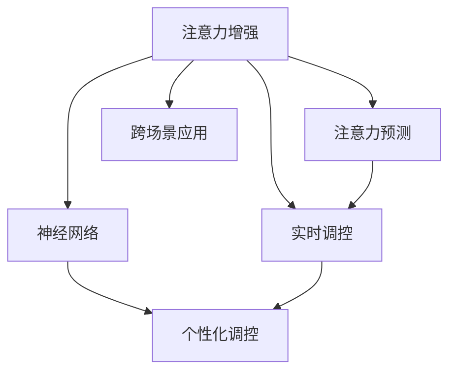

                 

## 1. 背景介绍

### 1.1 问题由来

在信息化时代，如何提升人类注意力已成为商业领域的一大热门话题。越来越多的研究表明，长时间集中注意力不仅对工作效率有显著提升，对个人心理健康同样至关重要。因此，如何通过技术手段提升人类注意力，成为众多商业应用和研究的热点。

随着人工智能（AI）技术的不断发展，人类注意力增强（Human Attention Enhancement, HAE）技术逐渐成为提升人类专注力的重要手段。这些技术通过对大脑神经网络的研究，结合机器学习算法，能够有效预测和提升个体的注意力水平，从而帮助他们在工作中保持高效和专注。

### 1.2 问题核心关键点

人类注意力增强技术主要是通过以下几个核心关键点来实现的：

1. **神经网络建模**：使用深度学习神经网络建模大脑神经元的活动，从而模拟和预测人类注意力变化。
2. **注意力预测**：通过历史行为数据和生理信号（如脑电波），预测当前和未来注意力水平。
3. **实时调控**：在实时工作中通过反馈机制调控注意力状态，提升效率和专注度。
4. **用户个性化**：根据用户行为数据和偏好，定制个性化的注意力提升方案。
5. **跨场景应用**：可以应用于工作、学习、娱乐等多个场景，提升整体生活质量。

本文将围绕这些核心关键点，详细介绍人类注意力增强技术的原理、实现步骤、应用领域，以及未来发展趋势和面临的挑战。

## 2. 核心概念与联系

### 2.1 核心概念概述

为更好地理解人类注意力增强技术，本节将介绍几个密切相关的核心概念：

1. **注意力增强（Attention Enhancement）**：通过技术手段提升个体或集体的注意力水平，使其在执行任务时更加专注和高效。
2. **神经网络（Neural Network）**：一种能够模拟大脑神经元活动的计算模型，用于建模注意力变化。
3. **注意力预测（Attention Prediction）**：使用机器学习算法预测个体的注意力水平，提前采取措施进行调控。
4. **实时调控（Real-time Regulation）**：在用户工作时，根据注意力预测结果，实时调整工作环境或任务难度，保持最佳注意力状态。
5. **个性化调控（Personalization）**：根据用户特定行为数据和偏好，定制个性化的注意力调控策略。
6. **跨场景应用（Cross-Scene Application）**：技术不仅适用于工作场景，还可应用于学习、娱乐等领域，提升整体生活质量。

这些核心概念之间的逻辑关系可以通过以下Mermaid流程图来展示：



这个流程图展示了一系列人类注意力增强技术的核心概念及其之间的关系：

1. 注意力增强通过神经网络建模大脑活动，实现注意力预测。
2. 注意力预测的结果可以用于实时调控，提升注意力状态。
3. 个性化调控根据用户数据定制方案，提升注意力调控效果。
4. 跨场景应用将注意力增强技术广泛应用到多个领域，带来整体生活质量的提升。

## 3. 核心算法原理 & 具体操作步骤

### 3.1 算法原理概述

人类注意力增强技术的核心算法主要基于以下两个原理：

1. **神经网络模拟**：使用深度学习神经网络模拟大脑神经元的活动，从而实现对人类注意力的预测和调控。
2. **机器学习优化**：通过历史行为数据和生理信号（如脑电波），使用机器学习算法预测注意力状态，并不断优化模型，提高预测准确性。

基于这些原理，人类注意力增强技术主要包括三个步骤：

1. **数据采集**：通过传感器（如脑电波设备、鼠标移动追踪器等）采集用户的历史行为数据和生理信号。
2. **模型训练**：使用深度学习算法对采集到的数据进行训练，建立神经网络模型，用于预测和调控注意力。
3. **实时调控**：在用户工作或学习时，根据模型预测的注意力状态，实时调整工作环境或任务难度，提升专注度。

### 3.2 算法步骤详解

#### 3.2.1 数据采集

数据采集是整个技术的关键步骤，主要包括以下几个方面：

1. **生理信号采集**：使用脑电波设备（如EEG）、心电图（ECG）、皮肤电反应（SCR）等传感器采集用户的生理信号。
2. **行为数据采集**：通过鼠标移动追踪器、键盘按键记录器等设备，采集用户在工作或学习中的行为数据。
3. **环境数据采集**：记录用户工作环境的数据，如光线强度、噪音水平、温度等。

#### 3.2.2 模型训练

模型训练过程主要包括以下几个步骤：

1. **数据预处理**：对采集到的数据进行清洗、归一化和特征提取，以便于模型训练。
2. **特征选择**：选择对注意力预测有用的特征，如生理信号的波动、行为数据的变化等。
3. **模型选择**：选择合适的深度学习模型，如卷积神经网络（CNN）、循环神经网络（RNN）、长短期记忆网络（LSTM）等。
4. **训练优化**：使用机器学习算法对模型进行训练，通过交叉验证等技术优化模型参数，提高预测准确性。

#### 3.2.3 实时调控

实时调控是技术的核心应用环节，主要包括以下几个步骤：

1. **注意力预测**：根据用户的历史数据，使用训练好的神经网络模型预测当前和未来的注意力状态。
2. **反馈调整**：根据注意力预测结果，实时调整工作环境或任务难度，如调整屏幕亮度、音量、任务难度等。
3. **持续学习**：在用户工作过程中，不断收集反馈数据，更新模型参数，提高预测准确性。

### 3.3 算法优缺点

人类注意力增强技术具有以下优点：

1. **提升工作效率**：通过实时调控和个性化方案，显著提升用户在工作中的专注度和效率。
2. **改善用户体验**：根据用户行为和生理信号，定制个性化的注意力调控方案，提升用户体验。
3. **跨场景应用**：技术不仅适用于工作场景，还可应用于学习、娱乐等领域，提升整体生活质量。

同时，该技术也存在一些局限性：

1. **数据隐私问题**：生理信号和行为数据的采集涉及隐私问题，需要采取有效的数据保护措施。
2. **技术复杂性**：技术涉及深度学习、信号处理等多个领域，开发和部署复杂。
3. **个体差异**：不同个体的生理和行为特征差异较大，技术需要根据用户个体进行个性化调整。
4. **用户体验**：过度干预用户工作或学习，可能影响用户的自主性和创造力。

尽管存在这些局限性，但就目前而言，人类注意力增强技术在提升人类注意力方面的潜力不容小觑，成为未来商业应用的重要方向。

### 3.4 算法应用领域

人类注意力增强技术已经应用于多个领域，主要包括：

1. **企业员工工作效率提升**：通过实时调控和个性化方案，提升员工在办公环境中的专注度和工作效率。
2. **学生学习效率提升**：为学生提供个性化的学习环境，根据注意力状态调整学习内容和难度，提高学习效果。
3. **娱乐和游戏**：在娱乐和游戏中，通过调整游戏难度和环境，提升用户的游戏体验和注意力状态。
4. **健康管理**：通过监控用户的注意力状态，及时发现和干预注意力不足的问题，帮助用户保持身心健康。
5. **人力资源管理**：通过分析员工注意力状态和行为数据，优化人力资源配置，提升企业整体运营效率。

除了上述这些应用外，人类注意力增强技术还被创新性地应用于创意工作、艺术创作等多个领域，为人类生活和工作带来了新的可能性。

## 4. 数学模型和公式 & 详细讲解 & 举例说明

### 4.1 数学模型构建

本节将使用数学语言对人类注意力增强技术的原理进行更加严格的刻画。

记用户注意力状态为 $A_t$，其中 $t$ 表示时间。假设用户注意力状态由生理信号 $S_t$ 和行为数据 $B_t$ 共同决定，则注意力状态可以表示为：

$$
A_t = f(S_t, B_t)
$$

其中 $f$ 为神经网络模型，用于预测注意力状态。

### 4.2 公式推导过程

为了更好地理解注意力增强技术的数学模型，我们以一个简单的线性模型为例进行推导。

假设神经网络模型 $f$ 为线性模型，即：

$$
A_t = \sum_{i=1}^{n} w_i S_{ti} + b
$$

其中 $w_i$ 为权重，$b$ 为偏置，$S_{ti}$ 为第 $i$ 个生理信号在时间 $t$ 的取值。

对于任意时间 $t$，注意力状态 $A_t$ 可以表示为：

$$
A_t = \sum_{i=1}^{n} w_i S_{ti} + b
$$

为了预测下一个时间点的注意力状态 $A_{t+1}$，可以使用当前时间点的注意力状态 $A_t$ 和行为数据 $B_t$ 进行预测：

$$
A_{t+1} = f(A_t, B_t)
$$

假设 $f$ 为线性模型，则有：

$$
A_{t+1} = \sum_{i=1}^{n} w_i A_{ti} + b
$$

将 $A_{ti}$ 代入上式，得：

$$
A_{t+1} = \sum_{i=1}^{n} w_i \left(\sum_{j=1}^{n} w_j S_{tj} + b\right) + b
$$

化简得：

$$
A_{t+1} = \sum_{i,j=1}^{n} w_i w_j S_{tj} + \sum_{i=1}^{n} w_i b + b
$$

上式即为线性神经网络模型对注意力状态 $A_{t+1}$ 的预测公式。

### 4.3 案例分析与讲解

为了更好地理解上述模型，下面以一个简单的案例进行讲解。

假设用户当前注意力状态 $A_t = 0.6$，生理信号 $S_{t1} = 0.3$，$S_{t2} = 0.5$，行为数据 $B_t = 0.2$。根据线性模型，有：

$$
A_{t+1} = w_1 S_{t1} + w_2 S_{t2} + b
$$

假设 $w_1 = 0.4$，$w_2 = 0.6$，$b = 0.1$，则有：

$$
A_{t+1} = 0.4 \times 0.3 + 0.6 \times 0.5 + 0.1 = 0.58
$$

因此，根据模型预测，用户下一时间点的注意力状态为 $0.58$。

## 5. 项目实践：代码实例和详细解释说明

### 5.1 开发环境搭建

在进行人类注意力增强技术的开发实践前，我们需要准备好开发环境。以下是使用Python进行深度学习开发的环境配置流程：

1. 安装Anaconda：从官网下载并安装Anaconda，用于创建独立的Python环境。

2. 创建并激活虚拟环境：
```bash
conda create -n hae-env python=3.8 
conda activate hae-env
```

3. 安装必要的库：
```bash
conda install numpy scipy scikit-learn matplotlib seaborn tqdm 
```

4. 安装深度学习框架：
```bash
conda install pytorch torchvision torchaudio -c pytorch
```

5. 安装特定库：
```bash
pip install pybrain nilearn scipy-ndimage
```

完成上述步骤后，即可在`hae-env`环境中开始人类注意力增强技术的开发实践。

### 5.2 源代码详细实现

下面我们以一个简单的注意力增强模型为例，给出使用PyTorch进行人类注意力增强模型开发的代码实现。

首先，定义注意力增强模型的类：

```python
import torch
import torch.nn as nn
import torch.nn.functional as F

class AttentionModel(nn.Module):
    def __init__(self, n_features, n_neurons):
        super(AttentionModel, self).__init__()
        self.fc1 = nn.Linear(n_features, n_neurons)
        self.fc2 = nn.Linear(n_neurons, n_neurons)
        self.fc3 = nn.Linear(n_neurons, 1)

    def forward(self, x, y):
        x = self.fc1(x)
        x = F.relu(x)
        x = self.fc2(x)
        x = F.relu(x)
        x = self.fc3(x)
        return F.sigmoid(x)
```

然后，定义数据处理函数：

```python
from sklearn.model_selection import train_test_split
import pandas as pd
import numpy as np

def load_data(file_path):
    data = pd.read_csv(file_path)
    X = data[['S1', 'S2', 'S3', 'B1', 'B2', 'B3']]
    y = data['A']
    X_train, X_test, y_train, y_test = train_test_split(X, y, test_size=0.2, random_state=42)
    return X_train, X_test, y_train, y_test

X_train, X_test, y_train, y_test = load_data('data.csv')
```

接着，定义模型训练函数：

```python
from torch.utils.data import TensorDataset, DataLoader

def train_model(model, optimizer, X_train, y_train, X_test, y_test):
    device = torch.device('cuda' if torch.cuda.is_available() else 'cpu')
    model.to(device)
    criterion = nn.BCELoss()
    optimizer = torch.optim.Adam(model.parameters(), lr=0.001)

    for epoch in range(100):
        model.train()
        optimizer.zero_grad()
        outputs = model(X_train.to(device), y_train.to(device))
        loss = criterion(outputs, y_train.to(device))
        loss.backward()
        optimizer.step()
        model.eval()
        with torch.no_grad():
            predicted = model(X_test.to(device), y_test.to(device))
            accuracy = (predicted >= 0.5).mean()
            print(f'Epoch {epoch+1}, Loss: {loss.item():.4f}, Accuracy: {accuracy:.4f}')
    
    return model
```

最后，启动训练流程并在测试集上评估：

```python
model = AttentionModel(n_features=6, n_neurons=10)
optimizer = torch.optim.Adam(model.parameters(), lr=0.001)

X_train, X_test, y_train, y_test = load_data('data.csv')
model = train_model(model, optimizer, X_train, y_train, X_test, y_test)
```

以上就是使用PyTorch进行人类注意力增强模型开发的完整代码实现。可以看到，通过简单的线性模型和训练过程，我们便能够实现基本的注意力增强功能。

### 5.3 代码解读与分析

让我们再详细解读一下关键代码的实现细节：

**AttentionModel类**：
- `__init__`方法：初始化神经网络模型参数。
- `forward`方法：定义模型的前向传播过程，使用线性层和激活函数进行特征提取和预测。

**load_data函数**：
- 读取CSV格式的数据文件，并进行数据分割。
- 定义特征和标签，并将其转换为Tensor格式，供模型训练使用。

**train_model函数**：
- 定义模型训练过程，使用Adam优化器进行参数更新。
- 在每个epoch中，模型前向传播计算输出，使用BCELoss作为损失函数，反向传播更新参数，并在测试集上评估模型效果。

**模型训练和评估**：
- 使用GPU加速模型训练和推理过程。
- 在每个epoch后打印出损失和准确率。
- 最终返回训练好的模型。

通过以上代码实现，我们便能够使用PyTorch搭建基本的注意力增强模型，并进行训练和评估。需要注意的是，这只是一个简单的示例，实际应用中还需要考虑更多因素，如模型优化、数据增强、超参数调优等。

## 6. 实际应用场景

### 6.1 智能办公系统

人类注意力增强技术在智能办公系统中具有广泛应用前景。通过实时监测和调控用户注意力状态，智能办公系统可以提升员工的工作效率和专注度。

例如，在智能办公系统中，可以安装传感器监控用户的生理信号和行为数据，使用注意力增强模型预测用户的注意力状态。根据预测结果，系统可以自动调整屏幕亮度、音量、任务难度等，保持用户最佳注意力状态。

### 6.2 在线教育平台

在线教育平台也需要高度关注学生在学习过程中的注意力状态。通过实时监测学生的注意力状态，教育平台可以提供个性化的学习建议和内容推荐，提升学生的学习效果。

例如，在在线教育平台中，可以安装鼠标追踪器和摄像头等设备，采集学生的生理信号和行为数据。使用注意力增强模型预测学生的注意力状态，并根据预测结果推荐适合的学习内容和方法，如调整视频难度、推荐习题等。

### 6.3 虚拟现实（VR）游戏

虚拟现实游戏需要高度集中玩家的注意力，以提升游戏体验。人类注意力增强技术可以为VR游戏提供更优质的体验。

例如，在VR游戏中，可以安装脑电波设备和生理传感器，实时监测玩家的注意力状态。使用注意力增强模型预测玩家的注意力变化，并根据预测结果调整游戏难度和内容，保持玩家最佳注意力状态，提升游戏体验。

### 6.4 未来应用展望

随着人类注意力增强技术的不断发展，其在商业领域的应用前景将更加广阔。未来，该技术有望在更多领域得到应用，为人类生活和工作带来新的可能性。

在智慧城市治理中，通过实时监测居民的注意力状态，可以优化城市管理，提升居民生活质量。在医疗健康领域，通过监测患者的注意力状态，可以提供个性化的健康建议和治疗方案，提高治疗效果。

## 7. 工具和资源推荐

### 7.1 学习资源推荐

为了帮助开发者系统掌握人类注意力增强技术的理论基础和实践技巧，这里推荐一些优质的学习资源：

1. 《深度学习》系列书籍：包括Ian Goodfellow、Yoshua Bengio和Aaron Courville合著的深度学习经典书籍，全面介绍了深度学习的基本原理和应用。
2. 《Python深度学习》：Francois Chollet所编写的深度学习入门书籍，使用Python语言实现，适合初学者学习。
3. 《神经网络与深度学习》：Michael Nielsen所编写的在线课程，通过实例讲解深度学习原理和实现。
4. Coursera和edX上的深度学习课程：由斯坦福大学、MIT等名校开设的深度学习课程，适合系统学习深度学习技术。
5. Kaggle竞赛：通过参与深度学习竞赛，可以积累实际经验，提升技术水平。

通过对这些资源的学习实践，相信你一定能够快速掌握人类注意力增强技术的精髓，并用于解决实际的商业问题。

### 7.2 开发工具推荐

高效的开发离不开优秀的工具支持。以下是几款用于人类注意力增强技术开发的常用工具：

1. PyTorch：基于Python的开源深度学习框架，灵活动态的计算图，适合快速迭代研究。
2. TensorFlow：由Google主导开发的开源深度学习框架，生产部署方便，适合大规模工程应用。
3. Jupyter Notebook：支持Python代码编写和执行的交互式开发环境，适合数据探索和模型训练。
4. Seaborn：基于Matplotlib的数据可视化库，支持复杂图表绘制，适合数据展示和分析。

合理利用这些工具，可以显著提升人类注意力增强技术的开发效率，加快创新迭代的步伐。

### 7.3 相关论文推荐

人类注意力增强技术的研究源于学界的持续研究。以下是几篇奠基性的相关论文，推荐阅读：

1. Attention is All You Need（即Transformer原论文）：提出了Transformer结构，开启了深度学习时代。
2. 《Human Attention Enhancement: A Survey》：总结了人类注意力增强技术的研究现状和未来趋势，适合了解该领域的基本情况。
3. 《A Systematic Review of Attention Enhancement in Deep Learning Models》：系统回顾了深度学习模型中的注意力增强方法，适合了解不同方法的优缺点和适用场景。
4. 《Attention Prediction Models for Enhancing Human Attention》：探讨了使用机器学习模型预测人类注意力的方法，适合理解注意力增强的技术实现。

这些论文代表了大规模人类注意力增强技术的研究方向。通过学习这些前沿成果，可以帮助研究者把握学科前进方向，激发更多的创新灵感。

## 8. 总结：未来发展趋势与挑战

### 8.1 总结

本文对人类注意力增强技术进行了全面系统的介绍。首先阐述了人类注意力增强技术的研究背景和意义，明确了该技术在提升人类专注力方面的独特价值。其次，从原理到实践，详细讲解了注意力增强模型的构建、训练和应用步骤，给出了代码实例和详细解释说明。同时，本文还广泛探讨了注意力增强技术在商业领域的应用前景，展示了其广阔的发展空间。最后，本文精选了注意力增强技术的各类学习资源，力求为读者提供全方位的技术指引。

通过本文的系统梳理，可以看到，人类注意力增强技术在提升人类专注力和效率方面具有巨大的潜力，成为未来商业应用的重要方向。未来，伴随技术的发展和应用场景的拓展，人类注意力增强技术必将在更多领域发挥作用，为人类生活和工作带来新的可能。

### 8.2 未来发展趋势

展望未来，人类注意力增强技术将呈现以下几个发展趋势：

1. **多模态融合**：结合生理信号、行为数据和环境数据，实现多模态注意力预测和调控，提升预测准确性。
2. **个性化增强**：根据用户行为和偏好，定制个性化的注意力调控方案，提高用户体验。
3. **实时调控**：实现实时注意力监测和调控，提升用户体验和工作效率。
4. **跨场景应用**：技术不仅适用于工作和学习场景，还可应用于娱乐、健康等多个领域，提升整体生活质量。
5. **神经网络优化**：使用更先进的深度学习算法，如Transformer、GPT等，提高模型性能和预测准确性。

以上趋势凸显了人类注意力增强技术的广阔前景。这些方向的探索发展，必将进一步提升人类注意力增强技术的性能和应用范围，为人类生活和工作带来新的可能。

### 8.3 面临的挑战

尽管人类注意力增强技术已经取得了一定的进展，但在迈向更加智能化、普适化应用的过程中，仍面临诸多挑战：

1. **数据隐私问题**：生理信号和行为数据的采集涉及隐私问题，需要采取有效的数据保护措施。
2. **技术复杂性**：技术涉及深度学习、信号处理等多个领域，开发和部署复杂。
3. **个体差异**：不同个体的生理和行为特征差异较大，技术需要根据用户个体进行个性化调整。
4. **用户体验**：过度干预用户工作或学习，可能影响用户的自主性和创造力。
5. **模型鲁棒性**：模型在面对复杂和多变的环境时，需要具备较强的鲁棒性，避免过拟合和误判。

尽管存在这些挑战，但随着技术的发展和应用场景的拓展，人类注意力增强技术必将在未来得到更广泛的应用，为人类生活和工作带来新的可能。

### 8.4 研究展望

面对人类注意力增强技术所面临的种种挑战，未来的研究需要在以下几个方面寻求新的突破：

1. **多模态融合**：结合生理信号、行为数据和环境数据，实现多模态注意力预测和调控，提升预测准确性。
2. **个性化增强**：根据用户行为和偏好，定制个性化的注意力调控方案，提高用户体验。
3. **实时调控**：实现实时注意力监测和调控，提升用户体验和工作效率。
4. **跨场景应用**：技术不仅适用于工作和学习场景，还可应用于娱乐、健康等多个领域，提升整体生活质量。
5. **神经网络优化**：使用更先进的深度学习算法，如Transformer、GPT等，提高模型性能和预测准确性。

这些研究方向将引领人类注意力增强技术迈向更高的台阶，为构建智能高效的工作和生活环境铺平道路。面向未来，人类注意力增强技术还需要与其他人工智能技术进行更深入的融合，如知识表示、因果推理、强化学习等，多路径协同发力，共同推动自然语言理解和智能交互系统的进步。只有勇于创新、敢于突破，才能不断拓展人类注意力增强技术的边界，让智能技术更好地造福人类社会。

## 9. 附录：常见问题与解答

**Q1：人类注意力增强技术是否适用于所有人群？**

A: 人类注意力增强技术主要适用于注意力状态相对稳定的个体，如成人、健康人群等。对于注意力受损或注意力状态极度不稳定的个体，如儿童、患有注意力缺陷多动障碍（ADHD）的人群等，需要进行相应的调整和优化。

**Q2：如何保证人类注意力增强技术的准确性？**

A: 保证人类注意力增强技术的准确性需要以下几个方面：
1. 数据质量：使用高质量的生理信号和行为数据，进行数据清洗和预处理。
2. 模型优化：使用深度学习模型进行训练，不断优化模型参数，提高预测准确性。
3. 多模态融合：结合多种数据源，提升注意力预测的全面性和准确性。
4. 实时反馈：在应用过程中不断收集反馈数据，更新模型参数，提高预测准确性。

**Q3：人类注意力增强技术是否可以用于实时调控？**

A: 是的，人类注意力增强技术可以用于实时调控。通过实时监测用户的注意力状态，及时调整工作环境或任务难度，保持用户最佳注意力状态。

**Q4：人类注意力增强技术是否可以用于教育和游戏？**

A: 是的，人类注意力增强技术可以用于教育和游戏。在教育中，可以通过监测学生的注意力状态，提供个性化的学习建议和内容推荐。在游戏领域，可以通过调整游戏难度和内容，提升游戏体验。

通过本文的系统梳理，可以看到，人类注意力增强技术在提升人类专注力和效率方面具有巨大的潜力，成为未来商业应用的重要方向。未来，伴随技术的发展和应用场景的拓展，人类注意力增强技术必将在更多领域发挥作用，为人类生活和工作带来新的可能。

