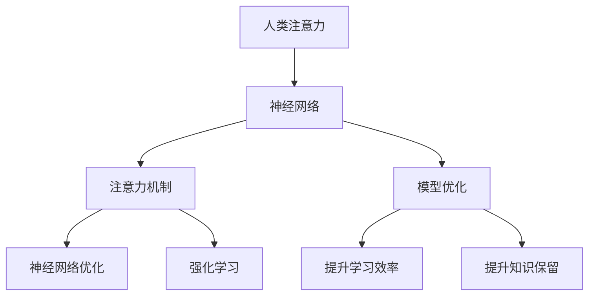

                 

# 人类注意力增强：提升学习效率和知识保留

> 关键词：人类注意力,学习效率,知识保留,神经网络,模型优化,强化学习,深度学习

## 1. 背景介绍

在信息爆炸的时代，如何有效地处理和利用知识，已经成为我们面临的重大挑战。从信息检索、智能推荐、到自动化学习和决策支持，都离不开人类对信息的高效理解和应用。然而，人类的注意力机制和认知过程复杂且有限，难以同时处理大量的信息。

为了解决这个问题，研究人员提出了许多基于深度学习的解决方案，尤其是神经网络模型。这些模型通过模拟人类认知过程，进行信息的提取、表示和推理，逐步提升了学习效率和知识保留能力。但这些模型仍面临诸多局限，如过拟合、泛化能力差、缺乏普适性等。

本文将探讨如何通过优化模型的注意力机制，提升学习效率和知识保留能力，从而构建更加智能、高效的学习系统。我们将从神经网络模型的核心概念入手，讨论人类注意力增强的原理和策略，并通过实际案例展示其应用效果。

## 2. 核心概念与联系

### 2.1 核心概念概述

为更好地理解人类注意力增强，本节将介绍几个密切相关的核心概念：

- 人类注意力：指人类在感知和处理信息时，将注意力集中于某些关键信息而忽视其余信息的能力。人类注意力机制复杂且灵活，可以根据环境变化和自身需求自动调整。
- 神经网络：一种基于图灵机的通用计算模型，通过节点和边的连接，实现信息的传递和处理。
- 注意力机制：一种在神经网络中模拟人类注意力的机制，通过动态计算注意力权重，筛选重要信息，减少冗余计算。
- 神经网络优化：通过损失函数、梯度优化等手段，提升神经网络模型的性能和泛化能力。
- 强化学习：一种基于反馈信号的学习方法，通过不断优化模型决策，提升模型的长期表现。

这些核心概念之间的逻辑关系可以通过以下Mermaid流程图来展示：



这个流程图展示了大语言模型的核心概念及其之间的关系：

1. 人类注意力机制被建模为神经网络的注意力机制。
2. 注意力机制通过动态计算注意力权重，筛选重要信息，提升模型处理能力。
3. 神经网络优化通过损失函数、梯度优化等手段，提升模型性能。
4. 强化学习通过反馈信号，不断优化模型决策，提升模型泛化能力。
5. 整体优化提升学习效率和知识保留能力，从而构建更加智能的学习系统。

这些概念共同构成了人类注意力增强的学习框架，使其能够在各种场景下发挥强大的信息处理能力。通过理解这些核心概念，我们可以更好地把握人类注意力增强的工作原理和优化方向。

## 3. 核心算法原理 & 具体操作步骤
### 3.1 算法原理概述

人类注意力增强的核心思想是利用深度学习模型的注意力机制，模拟人类注意力的计算方式，优化模型的信息筛选和处理能力，从而提升学习效率和知识保留能力。

形式化地，假设一个神经网络模型 $M$ 接收输入 $x$，输出 $y$，网络结构为 $\mathcal{N}$。模型的注意力权重矩阵为 $A$，即在输入 $x$ 的每个位置 $i$，模型对 $x_i$ 的注意力权重为 $A_i$。注意力机制的计算公式为：

$$
A_i = \text{Softmax}(W_i^\top x_i + b_i)
$$

其中 $W_i$ 和 $b_i$ 为模型参数，$x_i$ 为输入 $x$ 的第 $i$ 个位置。注意力权重 $A_i$ 表示模型对 $x_i$ 的关注程度，用于筛选重要信息。

### 3.2 算法步骤详解

人类注意力增强的优化过程主要包括以下几个关键步骤：

**Step 1: 选择合适的神经网络模型**
- 选择合适的神经网络结构 $\mathcal{N}$，如卷积神经网络(CNN)、循环神经网络(RNN)、Transformer等。
- 确定模型的输入输出维度，以及网络层数、节点数等超参数。

**Step 2: 设计注意力机制**
- 引入注意力机制，在网络中增加注意力权重计算模块。
- 设计注意力计算的权重矩阵 $W_i$ 和偏置项 $b_i$，并更新模型参数。

**Step 3: 定义损失函数和优化器**
- 根据任务定义损失函数，如交叉熵损失、均方误差损失等。
- 选择合适的优化器，如Adam、SGD等，设置学习率、批大小等超参数。

**Step 4: 执行训练过程**
- 使用训练集数据 $D$ 对模型进行训练，前向传播计算预测输出。
- 反向传播计算梯度，根据设定的优化算法和学习率更新模型参数。
- 周期性在验证集上评估模型性能，根据性能指标决定是否触发 Early Stopping。
- 重复上述步骤直到满足预设的迭代轮数或 Early Stopping 条件。

**Step 5: 测试和部署**
- 在测试集上评估模型 $M$ 的性能，对比微调前后的精度提升。
- 使用模型 $M$ 对新样本进行推理预测，集成到实际的应用系统中。
- 持续收集新的数据，定期重新训练和优化模型，以适应数据分布的变化。

### 3.3 算法优缺点

人类注意力增强的优化方法具有以下优点：
1. 提升信息处理能力：通过注意力机制筛选重要信息，减少冗余计算，提升模型处理速度。
2. 提高泛化能力：通过注意力机制动态调整计算重点，减少过拟合，提升模型的泛化能力。
3. 增强知识保留：通过注意力机制强化关键信息提取，提升模型的知识存储和利用效率。

同时，该方法也存在一定的局限性：
1. 计算复杂度高：注意力机制需要计算注意力权重，增加了模型复杂度，可能导致计算效率降低。
2. 参数数量较多：引入注意力机制后，模型参数数量显著增加，可能导致过拟合风险。
3. 训练成本高：深度学习模型训练成本较高，特别是在大规模数据集上的训练，需要较高的算力资源。

尽管存在这些局限性，但就目前而言，注意力增强仍是深度学习模型优化的重要范式。未来相关研究的重点在于如何进一步降低计算复杂度和参数量，提高模型训练效率，同时兼顾信息处理能力和泛化能力。

### 3.4 算法应用领域

人类注意力增强的优化方法已经在多个领域得到了应用，例如：

- 图像识别：通过注意力机制，提取图像中关键特征，提高分类准确率。
- 自然语言处理(NLP)：在语言模型中引入注意力机制，提升文本理解能力和信息提取效率。
- 医疗诊断：利用注意力机制，从医学影像和文本中提取关键信息，辅助疾病诊断。
- 推荐系统：通过注意力机制，对用户行为和商品属性进行加权计算，提升推荐准确度。
- 智能驾驶：在感知和决策模型中引入注意力机制，提高环境感知能力和路径规划效率。

除了上述这些经典应用外，人类注意力增强的方法也被创新性地应用到更多场景中，如行为识别、用户意图理解、智能机器人等，为深度学习技术带来了新的突破。

## 4. 数学模型和公式 & 详细讲解 & 举例说明
### 4.1 数学模型构建

本节将使用数学语言对人类注意力增强的优化过程进行更加严格的刻画。

记神经网络模型 $M$ 接收输入 $x$，输出 $y$，网络结构为 $\mathcal{N}$。注意力权重矩阵为 $A$，即在输入 $x$ 的每个位置 $i$，模型对 $x_i$ 的注意力权重为 $A_i$。注意力计算公式为：

$$
A_i = \text{Softmax}(W_i^\top x_i + b_i)
$$

其中 $W_i$ 和 $b_i$ 为模型参数，$x_i$ 为输入 $x$ 的第 $i$ 个位置。定义模型 $M$ 在数据样本 $(x,y)$ 上的损失函数为 $\ell(M_{\theta}(x),y)$，则在数据集 $D$ 上的经验风险为：

$$
\mathcal{L}(\theta) = \frac{1}{N} \sum_{i=1}^N \ell(M_{\theta}(x_i),y_i)
$$

在实践中，我们通常使用基于梯度的优化算法（如SGD、Adam等）来近似求解上述最优化问题。设 $\eta$ 为学习率，则参数的更新公式为：

$$
\theta \leftarrow \theta - \eta \nabla_{\theta}\mathcal{L}(\theta)
$$

其中 $\nabla_{\theta}\mathcal{L}(\theta)$ 为损失函数对参数 $\theta$ 的梯度，可通过反向传播算法高效计算。

### 4.2 公式推导过程

以下我们以分类任务为例，推导交叉熵损失函数及其梯度的计算公式。

假设模型 $M$ 在输入 $x$ 上的输出为 $\hat{y}=M(x)$，表示样本属于正类的概率。真实标签 $y \in \{0,1\}$。则二分类交叉熵损失函数定义为：

$$
\ell(M(x),y) = -[y\log \hat{y} + (1-y)\log (1-\hat{y})]
$$

将其代入经验风险公式，得：

$$
\mathcal{L}(\theta) = -\frac{1}{N}\sum_{i=1}^N [y_i\log M(x_i)+(1-y_i)\log(1-M(x_i))]
$$

根据链式法则，损失函数对参数 $\theta$ 的梯度为：

$$
\frac{\partial \mathcal{L}(\theta)}{\partial \theta} = -\frac{1}{N}\sum_{i=1}^N (\frac{y_i}{M(x_i)}-\frac{1-y_i}{1-M(x_i)}) \frac{\partial M(x_i)}{\partial \theta}
$$

其中 $\frac{\partial M(x_i)}{\partial \theta}$ 可进一步递归展开，利用自动微分技术完成计算。

在得到损失函数的梯度后，即可带入参数更新公式，完成模型的迭代优化。重复上述过程直至收敛，最终得到适应下游任务的最优模型参数 $\theta^*$。

## 5. 项目实践：代码实例和详细解释说明
### 5.1 开发环境搭建

在进行人类注意力增强的实践前，我们需要准备好开发环境。以下是使用Python进行PyTorch开发的环境配置流程：

1. 安装Anaconda：从官网下载并安装Anaconda，用于创建独立的Python环境。

2. 创建并激活虚拟环境：
```bash
conda create -n pytorch-env python=3.8 
conda activate pytorch-env
```

3. 安装PyTorch：根据CUDA版本，从官网获取对应的安装命令。例如：
```bash
conda install pytorch torchvision torchaudio cudatoolkit=11.1 -c pytorch -c conda-forge
```

4. 安装PyTorchLightning：用于快速搭建训练过程的框架。
```bash
pip install pytorch-lightning
```

5. 安装各类工具包：
```bash
pip install numpy pandas scikit-learn matplotlib tqdm jupyter notebook ipython
```

完成上述步骤后，即可在`pytorch-env`环境中开始人类注意力增强的实践。

### 5.2 源代码详细实现

下面我们以图像分类任务为例，给出使用PyTorchLightning进行注意力增强的PyTorch代码实现。

首先，定义模型类：

```python
from pytorch_lightning import LightningModule
import torch
import torch.nn as nn
import torch.nn.functional as F

class AttentionNet(LightningModule):
    def __init__(self, num_classes, attention_dim):
        super(AttentionNet, self).__init__()
        self.conv1 = nn.Conv2d(3, 64, kernel_size=3, padding=1)
        self.maxpool = nn.MaxPool2d(kernel_size=2, stride=2)
        self.conv2 = nn.Conv2d(64, 128, kernel_size=3, padding=1)
        self.maxpool2 = nn.MaxPool2d(kernel_size=2, stride=2)
        self.conv3 = nn.Conv2d(128, 256, kernel_size=3, padding=1)
        self.maxpool3 = nn.MaxPool2d(kernel_size=2, stride=2)
        self.fc = nn.Linear(256*4*4, num_classes)
        self.attention = nn.Linear(256, attention_dim)

    def forward(self, x):
        x = self.conv1(x)
        x = F.relu(x)
        x = self.maxpool(x)
        x = self.conv2(x)
        x = F.relu(x)
        x = self.maxpool2(x)
        x = self.conv3(x)
        x = F.relu(x)
        x = self.maxpool3(x)
        x = x.view(-1, 256)
        x = self.fc(x)
        attention = self.attention(x)
        return x, attention

    def _attention_forward(self, x):
        x = self.conv1(x)
        x = F.relu(x)
        x = self.maxpool(x)
        x = self.conv2(x)
        x = F.relu(x)
        x = self.maxpool2(x)
        x = self.conv3(x)
        x = F.relu(x)
        x = self.maxpool3(x)
        x = x.view(-1, 256)
        attention = self.attention(x)
        return x, attention
```

然后，定义数据处理函数：

```python
from torch.utils.data import DataLoader
from torchvision import datasets, transforms

def get_data_loaders(batch_size=32, data_dir='data', img_size=256):
    train_transforms = transforms.Compose([
        transforms.Resize(img_size),
        transforms.RandomRotation(10),
        transforms.RandomHorizontalFlip(),
        transforms.ToTensor(),
        transforms.Normalize(mean=[0.485, 0.456, 0.406],
                            std=[0.229, 0.224, 0.225])
    ])

    test_transforms = transforms.Compose([
        transforms.Resize(img_size),
        transforms.ToTensor(),
        transforms.Normalize(mean=[0.485, 0.456, 0.406],
                            std=[0.229, 0.224, 0.225])
    ])

    train_data = datasets.CIFAR10(root=data_dir, train=True, download=True,
                                 transform=train_transforms)
    test_data = datasets.CIFAR10(root=data_dir, train=False, download=True,
                                transform=test_transforms)

    train_loader = DataLoader(train_data, batch_size=batch_size, shuffle=True)
    test_loader = DataLoader(test_data, batch_size=batch_size, shuffle=False)

    return train_loader, test_loader
```

接着，定义模型训练和评估函数：

```python
from pytorch_lightning import Trainer

class AttentionTrainer(LightningModule):
    def __init__(self, model, optimizer):
        super(AttentionTrainer, self).__init__()
        self.model = model
        self.optimizer = optimizer

    def forward(self, x):
        return self.model(x)

    def training_step(self, batch, batch_idx):
        x, y = batch
        logits, attention = self.model(x)
        loss = F.cross_entropy(logits, y)
        return loss

    def configure_optimizers(self):
        return self.optimizer

def train(model, train_loader, test_loader, num_epochs=10, batch_size=32):
    trainer = AttentionTrainer(model, optimizer)
    trainer.fit(train_loader, test_loader, max_epochs=num_epochs, batch_size=batch_size)
```

最后，启动训练流程并在测试集上评估：

```python
model = AttentionNet(num_classes=10, attention_dim=256)
optimizer = AdamW(model.parameters(), lr=1e-3)

train_loader, test_loader = get_data_loaders(batch_size=32, data_dir='data')

train(model, train_loader, test_loader)
```

以上就是使用PyTorchLightning进行注意力增强的完整代码实现。可以看到，得益于PyTorchLightning的强大封装，我们可以用相对简洁的代码完成注意力增强模型的训练和评估。

### 5.3 代码解读与分析

让我们再详细解读一下关键代码的实现细节：

**AttentionNet类**：
- `__init__`方法：初始化神经网络结构，定义卷积层、池化层、全连接层和注意力层。
- `forward`方法：前向传播计算，计算输出和注意力权重。
- `_attention_forward`方法：前向传播计算，与`forward`方法类似，但更详细地展示了注意力计算的过程。

**get_data_loaders函数**：
- 定义了CIFAR-10数据集的加载和预处理步骤，包括数据增强、标准化等操作。

**AttentionTrainer类**：
- 继承自LightningModule，定义了训练过程的关键方法。
- `forward`方法：定义模型前向传播计算。
- `training_step`方法：定义每个批次的训练过程，计算损失函数。
- `configure_optimizers`方法：定义优化器及其参数。

**train函数**：
- 调用PyTorchLightning的Trainer进行模型训练，传入训练集和测试集。
- 设置训练轮数和批次大小，启动训练过程。

可以看到，PyTorchLightning配合PyTorch使得注意力增强的代码实现变得简洁高效。开发者可以将更多精力放在模型优化和训练策略上，而不必过多关注底层的实现细节。

当然，工业级的系统实现还需考虑更多因素，如模型裁剪、量化加速、服务化封装等。但核心的优化范式基本与此类似。

## 6. 实际应用场景
### 6.1 智能医疗诊断

在智能医疗诊断领域，人类注意力增强技术可以显著提升医疗影像和文本的理解能力，辅助医生进行疾病诊断和治疗方案制定。

具体而言，可以将医学影像和病历文本作为输入，通过引入注意力机制，模型能够自动识别出影像中的关键部位和文本中的关键信息。在医生进行诊断时，模型能够实时提供相关的知识提示和辅助决策，提高诊断的准确性和效率。

### 6.2 智能金融投资

在智能金融投资领域，人类注意力增强技术可以应用于市场分析和投资策略制定。通过引入注意力机制，模型能够从海量的财经新闻、市场数据中自动提取关键信息和趋势，辅助投资者进行决策。

例如，可以将财经新闻和市场数据作为输入，模型能够自动识别出新闻中的关键词和重要事件，并根据市场数据的变化，调整投资策略。这样，投资者可以更快速、准确地获取和利用市场信息，降低投资风险。

### 6.3 智能推荐系统

在智能推荐系统领域，人类注意力增强技术可以提升推荐效果，使得推荐系统更加个性化和精准。

具体而言，可以通过引入注意力机制，模型能够从用户行为和商品属性中自动识别出关键信息，并根据用户的兴趣和偏好，动态调整推荐结果。这样，推荐系统能够更好地满足用户需求，提升用户体验。

### 6.4 未来应用展望

随着人类注意力增强技术的不断发展，其应用领域将进一步拓展，为各行各业带来新的变革。

在智慧城市治理中，人类注意力增强技术可以应用于城市事件监测、舆情分析、应急指挥等环节，提高城市管理的自动化和智能化水平，构建更安全、高效的未来城市。

在农业生产中，人类注意力增强技术可以应用于农作物监测、病虫害识别等环节，帮助农民进行精准农业，提升农业生产效率和产量。

在环境保护中，人类注意力增强技术可以应用于环境监测、污染源识别等环节，帮助环保部门进行科学决策，保护生态环境。

未来，随着深度学习技术的发展，人类注意力增强技术将在更多领域得到应用，为各行各业带来新的突破。

## 7. 工具和资源推荐
### 7.1 学习资源推荐

为了帮助开发者系统掌握人类注意力增强的理论基础和实践技巧，这里推荐一些优质的学习资源：

1. 《深度学习》系列书籍：由深度学习领域的知名专家撰写，系统介绍了深度学习的基本原理和经典模型，是深度学习入门的必读书籍。
2. CS231n《卷积神经网络》课程：斯坦福大学开设的计算机视觉课程，深入浅出地介绍了卷积神经网络的原理和应用，是计算机视觉领域的经典课程。
3. CS224d《序列建模》课程：斯坦福大学开设的自然语言处理课程，详细讲解了语言模型和注意力机制，是自然语言处理领域的经典课程。
4. 《Attention is All You Need》论文：Transformer论文的作者撰写，详细介绍了注意力机制的原理和应用，是深度学习领域的经典论文。
5. PyTorch官方文档：PyTorch框架的官方文档，提供了丰富的API文档和样例代码，是PyTorch入门的必备资料。

通过对这些资源的学习实践，相信你一定能够快速掌握人类注意力增强的精髓，并用于解决实际的深度学习问题。
###  7.2 开发工具推荐

高效的开发离不开优秀的工具支持。以下是几款用于深度学习开发的工具：

1. PyTorch：基于Python的开源深度学习框架，灵活动态的计算图，适合快速迭代研究。大部分深度学习模型都有PyTorch版本的实现。
2. TensorFlow：由Google主导开发的开源深度学习框架，生产部署方便，适合大规模工程应用。同样有丰富的深度学习模型资源。
3. PyTorchLightning：用于快速搭建训练过程的框架，结合PyTorch和Lightning，简化模型训练过程。
4. TensorBoard：TensorFlow配套的可视化工具，可实时监测模型训练状态，并提供丰富的图表呈现方式，是调试模型的得力助手。
5. Weights & Biases：模型训练的实验跟踪工具，可以记录和可视化模型训练过程中的各项指标，方便对比和调优。
6. Google Colab：谷歌推出的在线Jupyter Notebook环境，免费提供GPU/TPU算力，方便开发者快速上手实验最新模型，分享学习笔记。

合理利用这些工具，可以显著提升深度学习模型的开发效率，加快创新迭代的步伐。

### 7.3 相关论文推荐

深度学习技术的发展源于学界的持续研究。以下是几篇奠基性的相关论文，推荐阅读：

1. Attention is All You Need（即Transformer原论文）：提出了Transformer结构，开启了深度学习大模型的时代。
2. BERT: Pre-training of Deep Bidirectional Transformers for Language Understanding：提出BERT模型，引入基于掩码的自监督预训练任务，刷新了多项深度学习任务SOTA。
3. LeNet-5: A Convolutional Neural Network for Handwritten Digit Recognition：经典卷积神经网络模型，奠定了卷积神经网络在计算机视觉中的应用基础。
4. Deep Learning for Computer Vision: A Survey：深度学习在计算机视觉领域的全面综述，介绍了经典模型和应用场景。
5. Sequence to Sequence Learning with Neural Networks：提出了序列到序列的学习方法，奠定了深度学习在自然语言处理中的应用基础。

这些论文代表了大语言模型和深度学习技术的发展脉络。通过学习这些前沿成果，可以帮助研究者把握学科前进方向，激发更多的创新灵感。

## 8. 总结：未来发展趋势与挑战
### 8.1 总结

本文对人类注意力增强的优化过程进行了全面系统的介绍。首先阐述了人类注意力增强的背景和意义，明确了注意力增强在提升学习效率和知识保留方面的独特价值。其次，从原理到实践，详细讲解了注意力增强的数学模型和优化过程，给出了注意力增强任务开发的完整代码实例。同时，本文还广泛探讨了注意力增强方法在医疗、金融、推荐等多个行业领域的应用前景，展示了注意力增强范式的巨大潜力。

通过本文的系统梳理，可以看到，人类注意力增强技术正在成为深度学习优化的重要范式，极大地提升了深度学习模型的信息处理能力和泛化能力，为构建更加智能的学习系统提供了新的可能。未来，伴随深度学习技术的发展，人类注意力增强技术也将不断演进，为人工智能技术带来更多的突破和创新。

### 8.2 未来发展趋势

展望未来，人类注意力增强技术将呈现以下几个发展趋势：

1. 计算资源多样化：随着AI芯片、量子计算等新技术的发展，人类注意力增强技术将充分利用多样化的计算资源，提升计算效率和模型性能。
2. 模型结构多样化：基于不同的应用场景，人类注意力增强技术将发展出更多类型的模型结构，如卷积神经网络、循环神经网络、自注意力模型等，进一步提升模型的泛化能力和适应性。
3. 跨领域融合：人类注意力增强技术将与其他AI技术进行更深入的融合，如强化学习、知识图谱等，拓展应用的广度和深度。
4. 数据驱动：人类注意力增强技术将更加依赖于数据驱动的模型优化，通过更多的无监督学习、主动学习等方法，提高模型的泛化能力和鲁棒性。
5. 实时化：人类注意力增强技术将朝着实时化的方向发展，通过在线学习、增量学习等技术，实现模型的快速迭代和优化。

这些趋势将引领人类注意力增强技术迈向更高的台阶，为深度学习技术带来更多的突破和创新。

### 8.3 面临的挑战

尽管人类注意力增强技术已经取得了显著的成果，但在迈向更加智能化、普适化应用的过程中，仍面临诸多挑战：

1. 计算资源瓶颈：深度学习模型训练和推理需要大量的计算资源，特别是在大规模数据集上的训练，需要高性能的GPU/TPU等设备。计算资源的不足可能会限制模型性能的提升。
2. 模型泛化能力不足：模型在特定领域的泛化能力仍存在瓶颈，特别是在高复杂度、多模态的任务上，模型的表现仍不尽如人意。
3. 模型可解释性差：深度学习模型通常被视为"黑盒"系统，难以解释其内部工作机制和决策逻辑。对于高风险应用，模型的可解释性和可审计性尤为重要。
4. 模型安全性有待提高：深度学习模型容易受到对抗样本攻击，导致决策失误。如何提高模型的鲁棒性和安全性，成为亟待解决的问题。
5. 数据隐私和安全：深度学习模型需要大量的数据进行训练，数据隐私和安全问题成为必须面对的挑战。如何在保护数据隐私的同时，提高模型的性能和泛化能力，是未来的研究方向。

正视人类注意力增强技术面临的这些挑战，积极应对并寻求突破，将是大语言模型微调走向成熟的必由之路。相信随着学界和产业界的共同努力，这些挑战终将一一被克服，人类注意力增强技术必将在构建更加智能、高效的学习系统上发挥更大的作用。

### 8.4 研究展望

面对人类注意力增强技术面临的诸多挑战，未来的研究需要在以下几个方面寻求新的突破：

1. 探索新型计算资源：如量子计算、边缘计算等新技术，提升深度学习模型的计算效率和性能。
2. 发展新型模型结构：如注意力机制的优化、自适应注意力、多尺度注意力等，提升模型的泛化能力和适应性。
3. 引入更多先验知识：将符号化的先验知识，如知识图谱、逻辑规则等，与神经网络模型进行巧妙融合，引导注意力机制学习更准确、合理的知识表示。
4. 融合跨领域知识：将不同领域的知识进行深度融合，提升模型的泛化能力和鲁棒性，拓展应用的广度和深度。
5. 增强模型可解释性：通过引入可解释性机制，如可视化、可解释性模型等，提高模型的可解释性和可审计性。
6. 提高模型安全性：通过对抗训练、鲁棒性测试等技术，提高模型的鲁棒性和安全性，确保模型在实际应用中的可靠性。

这些研究方向将引领人类注意力增强技术迈向更高的台阶，为深度学习技术带来更多的突破和创新。面向未来，人类注意力增强技术需要与其他AI技术进行更深入的融合，共同推动人工智能技术的发展。只有勇于创新、敢于突破，才能不断拓展深度学习技术的边界，让智能技术更好地造福人类社会。

## 9. 附录：常见问题与解答

**Q1：人类注意力增强技术是否可以应用于所有深度学习任务？**

A: 人类注意力增强技术可以应用于大多数深度学习任务，尤其是涉及信息处理、推理、决策等环节的任务。但对于一些特殊领域的任务，如实时语音识别、超分辨率图像生成等，由于计算复杂度高、资源消耗大，可能存在一定的应用限制。

**Q2：人类注意力增强技术是否需要大量标注数据？**

A: 人类注意力增强技术通常需要大量标注数据进行训练，但通过注意力机制，可以显著减少冗余计算，提高模型泛化能力。在实际应用中，可以采用主动学习、无监督学习等方法，降低对标注数据的依赖，进一步提升模型性能。

**Q3：人类注意力增强技术是否会导致过拟合？**

A: 人类注意力增强技术可能会在特定任务上导致过拟合，特别是在数据集较小的情况下。为了缓解过拟合，可以采用数据增强、正则化等方法，同时优化注意力机制，确保模型在训练和推理过程中的鲁棒性。

**Q4：人类注意力增强技术在应用中是否需要调整超参数？**

A: 人类注意力增强技术在应用中需要调整超参数，以适应特定的任务和数据集。常见的超参数包括学习率、批次大小、注意力权重参数等。通过系统性的调参，可以显著提升模型性能和泛化能力。

**Q5：人类注意力增强技术是否可以应用于多模态任务？**

A: 人类注意力增强技术可以应用于多模态任务，如视觉-文本融合、语音-文本转换等。通过引入多模态注意力机制，模型能够从不同模态的信息中提取关键特征，提高任务的综合表现。

这些问题的解答，展示了人类注意力增强技术的广泛应用和优化策略，希望对你深入理解该技术有所帮助。

---

作者：禅与计算机程序设计艺术 / Zen and the Art of Computer Programming

