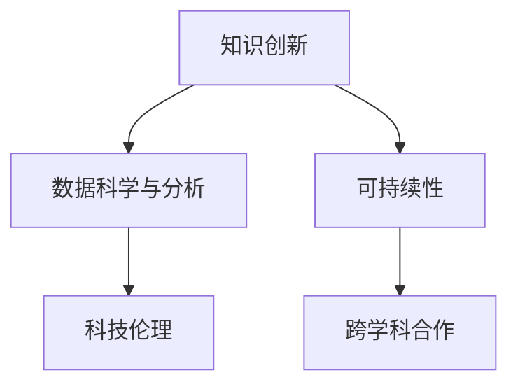

                 

# 人类的知识与可持续发展：为未来负责

## 1. 背景介绍

### 1.1 问题由来

在当今世界，人类正面临前所未有的挑战，包括气候变化、资源枯竭、生态失衡等环境问题，以及人口膨胀、经济不平等、社会动荡等社会问题。这些问题不仅影响着当前的全球环境和社会，更对未来人类文明的可持续发展构成了严重威胁。在这样的背景下，如何利用科技手段，推动知识创新，实现可持续发展，成为全人类共同关注的话题。

### 1.2 问题核心关键点

1. **知识创新与可持续发展**：知识是人类文明进步的基石，科技的进步和创新是解决环境和社会问题的重要手段。
2. **数据驱动的决策**：在复杂多变的社会环境中，决策者需要借助数据和算法进行科学决策，以实现更高效的资源配置和问题解决。
3. **科技伦理与治理**：科技进步带来了新的伦理挑战，如何构建公正、透明的科技治理体系，确保科技进步服务于人类福祉，是一个亟待解决的问题。
4. **跨学科合作**：可持续发展涉及多学科知识，需要环境科学、社会科学、工程技术等多个领域的协同合作。

## 2. 核心概念与联系

### 2.1 核心概念概述

为了更好地理解人类知识与可持续发展的关系，本节将介绍几个核心概念：

- **知识创新**：通过科学研究和技术创新，推动新知识的产生，解决实际问题。
- **数据科学与分析**：利用大数据、人工智能等技术手段，对海量数据进行收集、处理和分析，以支持科学决策和创新。
- **可持续性**：在满足当代需求的同时，不损害后代满足需求的能力，实现经济、社会、环境协调发展。
- **科技伦理**：涉及科技在道德、法律、文化等多方面的考量，确保科技发展符合社会价值观和伦理规范。
- **跨学科合作**：不同学科之间进行知识共享和技术协作，以解决复杂问题。

这些核心概念之间的逻辑关系可以通过以下Mermaid流程图来展示：



这个流程图展示了几大核心概念之间的相互关系：

1. 知识创新驱动数据科学与分析，数据科学与分析支撑科学决策和创新。
2. 知识创新和数据科学与分析共同支持可持续性，推动环境和社会问题的解决。
3. 可持续性需要科技伦理的保障，确保科技进步的正向价值。
4. 跨学科合作是实现可持续性的重要途径，不同学科的知识和技术可以互补。

## 3. 核心算法原理 & 具体操作步骤

### 3.1 算法原理概述

在推进知识创新和可持续发展的过程中，算法和数据科学扮演了至关重要的角色。基于数据的算法可以辅助决策者分析问题、识别模式、预测趋势，从而提供科学依据，支持创新实践。

假设我们有一个关于可持续发展的数据集 $D = \{(x_i, y_i)\}_{i=1}^N$，其中 $x_i$ 为特征向量，表示某个区域的环境、社会、经济等指标，$y_i$ 为标签，表示该区域是否实现了可持续发展目标。目标是找到一个函数 $f(x)$，使得对于任意新的特征向量 $x'$，$f(x')$ 的值能够反映其是否具备可持续性。

形式化地，我们的优化目标为：

$$
\min_{f} \frac{1}{N} \sum_{i=1}^N (y_i - f(x_i))^2
$$

其中 $y_i - f(x_i)$ 为模型的预测误差。

### 3.2 算法步骤详解

基于上述优化目标，我们可以采用以下步骤进行算法设计：

1. **数据收集与预处理**：收集与可持续发展相关的数据，包括环境指标、社会指标、经济指标等。对数据进行清洗、归一化、特征工程等预处理，确保数据的质量和可用性。

2. **模型选择与训练**：选择合适的机器学习算法，如决策树、随机森林、神经网络等，使用预处理后的数据对模型进行训练，寻找最优的模型参数。

3. **模型评估与验证**：使用交叉验证等方法对模型进行评估，确保模型在不同数据集上的泛化能力。

4. **模型部署与应用**：将训练好的模型部署到实际应用场景中，进行实时预测和分析。

### 3.3 算法优缺点

数据驱动的算法在推动可持续发展方面具有以下优点：

- **准确性**：通过科学计算和数据驱动，能够提供高精度的预测和分析。
- **可解释性**：数据驱动的模型可以量化决策过程，提供透明的决策依据。
- **高效性**：算法可以自动化处理大量数据，提高决策效率。

同时，数据驱动的算法也存在一些局限性：

- **数据依赖**：算法的有效性依赖于高质量、全面的数据，数据的不足或不准确可能导致错误决策。
- **复杂性**：某些复杂问题需要高维特征空间和高阶模型，模型的解释和维护难度增加。
- **伦理风险**：算法可能反映数据中的偏见，导致不公正的决策。

### 3.4 算法应用领域

数据驱动的算法在可持续发展领域有着广泛的应用，主要体现在以下几个方面：

- **环境监测与治理**：利用传感器数据、遥感图像等进行环境污染、生态变化监测，辅助政府进行环境保护和治理。
- **资源管理**：通过对能源、水资源等进行实时监测和预测，优化资源配置和利用效率。
- **社会福利与政策评估**：通过社会调查数据、公共服务数据等，评估社会政策效果，优化公共资源分配。
- **企业可持续发展**：利用生产数据、供应链数据等，进行企业风险管理、可持续发展评估。

## 4. 数学模型和公式 & 详细讲解 & 举例说明

### 4.1 数学模型构建

在可持续发展领域，常见的数学模型包括线性回归、逻辑回归、决策树、随机森林等。以线性回归为例，其数学模型为：

$$
y = \theta_0 + \theta_1 x_1 + \theta_2 x_2 + \cdots + \theta_n x_n
$$

其中，$y$ 为预测值，$\theta_0$ 为截距，$\theta_1, \theta_2, \cdots, \theta_n$ 为模型系数，$x_1, x_2, \cdots, x_n$ 为特征向量。

### 4.2 公式推导过程

以线性回归为例，其最小二乘法的优化目标为：

$$
\min_{\theta} \sum_{i=1}^N (y_i - \theta_0 - \sum_{j=1}^n \theta_j x_{ij})^2
$$

通过对上述公式进行求解，可以得出最小二乘法下的模型参数估计值为：

$$
\theta = (X^TX)^{-1}X^Ty
$$

其中，$X$ 为特征矩阵，$y$ 为标签向量。

### 4.3 案例分析与讲解

以全球气候变化预测为例，我们可以收集历史气温、CO2排放、森林覆盖率等数据，构建线性回归模型，预测未来的气候变化趋势。通过调整模型的参数，可以对不同碳排放策略下的气候影响进行量化分析，为政府和企业的气候政策制定提供科学依据。

## 5. 项目实践：代码实例和详细解释说明

### 5.1 开发环境搭建

在进行项目实践前，我们需要准备好开发环境。以下是使用Python进行Scikit-Learn开发的Python环境配置流程：

1. 安装Anaconda：从官网下载并安装Anaconda，用于创建独立的Python环境。

2. 创建并激活虚拟环境：
```bash
conda create -n sklearn-env python=3.8 
conda activate sklearn-env
```

3. 安装Scikit-Learn：
```bash
pip install scikit-learn
```

4. 安装各类工具包：
```bash
pip install numpy pandas scikit-learn matplotlib tqdm jupyter notebook ipython
```

完成上述步骤后，即可在`sklearn-env`环境中开始项目实践。

### 5.2 源代码详细实现

下面我们以全球气候变化预测为例，给出使用Scikit-Learn进行线性回归的Python代码实现。

```python
from sklearn.linear_model import LinearRegression
from sklearn.model_selection import train_test_split
from sklearn.metrics import mean_squared_error
import pandas as pd

# 读取数据
data = pd.read_csv('climate_data.csv')

# 数据预处理
X = data[['temps', 'co2_emission', 'forest_coverage']]
y = data['climate_change']

# 划分训练集和测试集
X_train, X_test, y_train, y_test = train_test_split(X, y, test_size=0.2, random_state=42)

# 训练模型
model = LinearRegression()
model.fit(X_train, y_train)

# 预测与评估
y_pred = model.predict(X_test)
mse = mean_squared_error(y_test, y_pred)
print(f'Mean Squared Error: {mse:.2f}')
```

以上就是使用Scikit-Learn进行线性回归的完整代码实现。可以看到，Scikit-Learn封装了常用的机器学习算法，提供了简单易用的API接口，大大降低了算法实现的复杂度。

### 5.3 代码解读与分析

让我们再详细解读一下关键代码的实现细节：

**数据预处理**：
- `pd.read_csv('climate_data.csv')`：使用Pandas库读取数据集，存储在DataFrame对象中。
- `X = data[['temps', 'co2_emission', 'forest_coverage']]`：提取数据集中的特征列，存储在X中。
- `y = data['climate_change']`：提取数据集中的标签列，存储在y中。

**模型训练**：
- `LinearRegression()`：实例化线性回归模型。
- `model.fit(X_train, y_train)`：使用训练集对模型进行拟合。

**模型评估**：
- `y_pred = model.predict(X_test)`：使用测试集对模型进行预测。
- `mean_squared_error(y_test, y_pred)`：计算预测值与真实值之间的均方误差。

通过以上代码，我们完成了全球气候变化预测的模型训练和评估，验证了线性回归在实际问题中的应用效果。

## 6. 实际应用场景

### 6.1 智能城市管理

智能城市管理是数据驱动算法在可持续发展领域的重要应用之一。通过物联网传感器、城市监控视频等数据，可以对城市交通、环境、公共安全等进行实时监测和分析，优化城市资源配置和公共服务。

以智能交通为例，可以采集交通流量、车辆速度、道路拥堵情况等数据，利用算法进行预测和优化，实现交通信号灯的智能调控、道路施工管理等，提升交通效率和安全性。

### 6.2 精准农业

精准农业通过数据驱动的算法，优化农业生产管理，实现资源的高效利用和农产品的优质产出。利用土壤、气象、作物生长等数据，预测作物生长趋势，指导灌溉、施肥、病虫害防治等农业操作。

通过分析历史数据和实时数据，可以优化农机作业路径、调整播种密度、制定精准施肥方案等，提高农业生产效率和资源利用率。

### 6.3 可再生能源管理

可再生能源管理是数据驱动算法在可持续发展领域的重要应用方向之一。通过数据驱动的算法，可以实现可再生能源的预测、调度和优化管理，提升能源利用效率和系统稳定性。

以太阳能发电为例，可以采集历史天气数据、光照强度、电池板温度等数据，利用算法进行预测和优化，实现太阳能发电的实时调度和管理。

## 7. 工具和资源推荐

### 7.1 学习资源推荐

为了帮助开发者系统掌握数据驱动算法的理论基础和实践技巧，这里推荐一些优质的学习资源：

1. 《机器学习实战》书籍：系统介绍了机器学习的基本概念、算法和应用案例，适合初学者入门。
2. Coursera《机器学习》课程：由斯坦福大学Andrew Ng教授主讲，涵盖机器学习的基本概念和算法，提供了丰富的案例和实践。
3. Kaggle竞赛平台：提供大量真实世界的数据集和竞赛任务，通过实战练习，提升数据处理和算法应用能力。
4. Scikit-Learn官方文档：详细介绍了Scikit-Learn库的使用方法和API接口，是Python开发者的必备参考资料。
5. TensorFlow官方文档：介绍了TensorFlow库的使用方法和API接口，适合大规模深度学习应用开发。

通过对这些资源的学习实践，相信你一定能够快速掌握数据驱动算法的精髓，并用于解决实际的可持续发展问题。

### 7.2 开发工具推荐

高效的开发离不开优秀的工具支持。以下是几款用于数据驱动算法开发和应用的工具：

1. Scikit-Learn：基于Python的机器学习库，提供了丰富的算法和工具，适合快速原型开发和应用实践。
2. TensorFlow：由Google开发的深度学习框架，适合大规模深度学习应用开发。
3. PyTorch：基于Python的深度学习框架，提供了灵活的动态计算图，适合快速原型开发和研究实验。
4. Jupyter Notebook：支持Python、R等语言的交互式编程环境，适合快速数据处理和算法实验。
5. Google Colab：谷歌提供的在线Jupyter Notebook环境，免费提供GPU/TPU算力，适合快速实验和开发。

合理利用这些工具，可以显著提升数据驱动算法在可持续发展领域的开发效率，加快创新迭代的步伐。

### 7.3 相关论文推荐

数据驱动的算法在可持续发展领域的发展源于学界的持续研究。以下是几篇奠基性的相关论文，推荐阅读：

1. "Machine Learning Yearning" 书籍：Andrew Ng的机器学习实践指南，涵盖机器学习的基本概念和算法优化。
2. "Deep Learning" 书籍：Ian Goodfellow等编写的深度学习教材，详细介绍了深度学习的基本概念和算法。
3. "The Elements of Statistical Learning" 书籍：Tibshirani等编写的统计学习教材，系统介绍了统计学习的理论和算法。
4. "Big Data: Principles and Best Practices of Scalable Realtime Data Systems" 书籍：Jay Kidd等编写的数据系统教材，介绍大数据系统的设计和实现。
5. "Reinforcement Learning: An Introduction" 书籍：Sutton和Barto编写的强化学习教材，介绍强化学习的基本概念和算法。

这些论文代表了大数据算法的发展脉络。通过学习这些前沿成果，可以帮助研究者把握学科前进方向，激发更多的创新灵感。

## 8. 总结：未来发展趋势与挑战

### 8.1 总结

本文对数据驱动算法在可持续发展中的应用进行了全面系统的介绍。首先阐述了数据驱动算法在推动知识创新和可持续发展的背景和意义，明确了算法在解决复杂社会问题中的独特价值。其次，从原理到实践，详细讲解了数据驱动算法的数学模型和具体操作步骤，给出了实际应用中的代码实现。同时，本文还广泛探讨了算法在智能城市管理、精准农业、可再生能源管理等多个领域的应用前景，展示了数据驱动算法在可持续发展领域的巨大潜力。最后，本文精选了算法开发所需的学习资源、工具和论文，力求为读者提供全方位的技术指引。

通过本文的系统梳理，可以看到，数据驱动算法在推动可持续发展方面具有广阔的应用前景，尤其是在大数据、深度学习等技术的支持下，能够实现更高效、更科学的社会治理。未来，伴随技术的不断发展，数据驱动算法必将在更广阔的应用领域大放异彩，为人类社会的可持续发展贡献更多智慧和力量。

### 8.2 未来发展趋势

展望未来，数据驱动算法在可持续发展领域将呈现以下几个发展趋势：

1. **算法多样化**：除了传统的统计学习算法，未来还将涌现更多深度学习、强化学习等算法，应对更加复杂和多变的问题。
2. **模型可解释性**：如何使数据驱动模型更透明、更可解释，成为未来算法研究的重要方向。可解释性模型有助于提高决策的公正性和可信度。
3. **数据自动化采集**：未来将出现更多自动化数据采集和处理技术，如物联网传感器、无人机等，实时监测和分析环境和社会变化，提供更及时的数据支持。
4. **跨学科融合**：数据驱动算法将与更多学科知识进行融合，如地理信息系统、心理学等，实现更全面、更精准的决策支持。
5. **伦理和隐私保护**：在数据驱动算法中，数据隐私和伦理问题将更加突出。如何在保证数据安全的同时，实现数据驱动的可持续决策，是未来研究的重要课题。

以上趋势凸显了数据驱动算法在可持续发展领域的广阔前景。这些方向的探索发展，必将进一步提升数据驱动算法在实际应用中的性能和效果，为实现可持续发展目标提供更可靠的技术保障。

### 8.3 面临的挑战

尽管数据驱动算法在可持续发展领域已经取得了瞩目成就，但在迈向更加智能化、普适化应用的过程中，它仍面临着诸多挑战：

1. **数据质量与隐私保护**：高质量、全面、隐私保护的数据是算法有效性的基础。如何在保护隐私的前提下获取高质量数据，是未来需要解决的重要问题。
2. **模型复杂性与可解释性**：复杂的模型往往难以解释其决策过程，导致可解释性问题。如何在复杂模型中寻找关键特征和决策依据，是未来研究的重要方向。
3. **技术普及与普及教育**：数据驱动算法需要高技术门槛和专业知识，如何普及技术，提高社会整体数据素养，是一个需要长期解决的问题。
4. **资源消耗与成本**：数据驱动算法往往需要大量的计算资源和存储空间，如何降低成本、提高效率，是未来算法优化的重要课题。
5. **伦理与公平性**：数据驱动算法可能反映数据中的偏见，导致不公正的决策。如何在算法设计和应用中确保公平性和公正性，是未来研究的重要方向。

### 8.4 研究展望

面对数据驱动算法在可持续发展领域面临的挑战，未来的研究需要在以下几个方面寻求新的突破：

1. **数据驱动与规则驱动结合**：结合数据驱动和规则驱动的决策方式，实现更加全面、精准的决策支持。
2. **模型自动化调优**：开发自动化的模型调优工具，根据数据特征和应用需求，自动选择和优化模型参数。
3. **跨学科融合与协同创新**：推动不同学科之间的知识共享和技术协作，实现跨学科的协同创新。
4. **数据隐私与安全保护**：开发数据隐私和安全保护技术，确保数据在采集、存储和传输过程中的安全。
5. **伦理与公平性研究**：研究数据驱动算法在伦理和公平性方面的表现，提出相应的改进措施和规范。

这些研究方向的探索，必将引领数据驱动算法在可持续发展领域迈向更高的台阶，为实现人类社会的可持续发展提供更可靠的技术保障。总之，数据驱动算法需要在数据获取、模型优化、伦理治理等方面持续创新，才能更好地服务于可持续发展目标。

## 9. 附录：常见问题与解答

**Q1：数据驱动算法在可持续发展领域的应用有哪些？**

A: 数据驱动算法在可持续发展领域的应用非常广泛，主要包括以下几个方面：

1. **环境监测与治理**：利用传感器数据、遥感图像等进行环境污染、生态变化监测，辅助政府进行环境保护和治理。
2. **资源管理**：通过对能源、水资源等进行实时监测和预测，优化资源配置和利用效率。
3. **社会福利与政策评估**：通过社会调查数据、公共服务数据等，评估社会政策效果，优化公共资源分配。
4. **企业可持续发展**：利用生产数据、供应链数据等，进行企业风险管理、可持续发展评估。

**Q2：数据驱动算法在实际应用中需要注意哪些问题？**

A: 数据驱动算法在实际应用中需要注意以下几个问题：

1. **数据质量**：高质量、全面、隐私保护的数据是算法有效性的基础，需要注意数据的准确性、完整性和隐私保护。
2. **模型复杂性**：复杂的模型往往难以解释其决策过程，需要注意模型的可解释性和公平性。
3. **技术普及**：数据驱动算法需要高技术门槛和专业知识，需要注意技术的普及和应用教育。
4. **资源消耗**：数据驱动算法往往需要大量的计算资源和存储空间，需要注意算法的效率和资源消耗。
5. **伦理与公平性**：数据驱动算法可能反映数据中的偏见，需要注意算法的伦理和公平性。

**Q3：数据驱动算法如何实现跨学科融合？**

A: 数据驱动算法实现跨学科融合的主要途径包括：

1. **数据共享**：不同学科的数据共享，促进跨学科的知识整合和协同创新。
2. **算法优化**：根据不同学科的特点和需求，优化算法模型，提升算法的适应性和准确性。
3. **理论与实践结合**：将不同学科的理论和方法与数据驱动算法结合，形成更加全面、精准的决策支持。

**Q4：如何提高数据驱动算法的可解释性？**

A: 提高数据驱动算法的可解释性，可以从以下几个方面入手：

1. **模型简化**：通过简化模型结构和参数，降低模型的复杂度，提高算法的可解释性。
2. **特征选择**：通过特征选择和降维技术，提取关键特征，简化模型的输入。
3. **可视化分析**：利用可视化工具，展示模型决策过程和特征重要性，增强算法的可解释性。

通过以上方法，可以有效提升数据驱动算法的可解释性和公平性，增强算法的透明度和可信度。

**Q5：如何在保护隐私的前提下获取高质量数据？**

A: 在保护隐私的前提下获取高质量数据，可以从以下几个方面入手：

1. **数据匿名化**：对数据进行匿名化处理，确保数据无法追踪到个人身份。
2. **差分隐私**：在数据收集和处理过程中，采用差分隐私技术，确保数据集中的个体隐私不被泄露。
3. **数据共享协议**：制定严格的数据共享协议，确保数据在使用过程中的安全性和合法性。

通过以上措施，可以在保护隐私的前提下获取高质量的数据，为数据驱动算法提供可靠的数据支持。

---

作者：禅与计算机程序设计艺术 / Zen and the Art of Computer Programming

