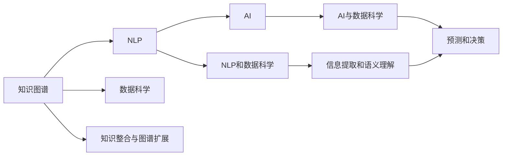

                 

# 人类的知识与智慧：相互促进的伙伴

在信息技术的加持下，人类与知识的关系正在发生前所未有的变革。这不仅体现在知识本身被数字化、结构化，也在于人类智慧的深度挖掘和运用。本文将从多个维度探讨这一进程，讨论知识与智慧的相互促进，以及其在技术和社会的双重应用。

## 1. 背景介绍

### 1.1 知识与智慧的定义

知识，通常被定义为被整理、系统化并能够被共享的信息。智慧，则更偏向于个体或系统对于这些知识的运用和理解。在人类历史上，知识与智慧的融合一直是推动社会进步的关键。

### 1.2 信息技术与知识、智慧的关系

信息技术的发展，尤其是计算技术和互联网的普及，极大地加速了知识的获取、存储和传播速度。从早期的纸张到现代的数字媒体，从单机计算到云计算，每一次技术的进步都在不断提升人类处理信息的能力，同时也促进了智慧的发现和应用。

## 2. 核心概念与联系

### 2.1 核心概念概述

在信息技术与知识、智慧的交互中，以下几个核心概念扮演了关键角色：

- **知识图谱(Knowledge Graph)**：一种用于描述实体及其关系的结构化知识库，可以帮助机器更好地理解世界。
- **自然语言处理(Natural Language Processing, NLP)**：通过计算机处理和理解人类语言的技术，使得知识与智慧能够高效交流。
- **人工智能(Artificial Intelligence, AI)**：包括机器学习、深度学习等技术，能够基于知识进行决策和智慧行为。
- **数据科学(Data Science)**：专注于从数据中提取知识，辅助人类进行智慧决策。

这些概念之间的联系构成了一个全面的信息处理框架，每个概念在其特定领域内发挥作用，同时又相互交织，共同推动信息技术的进步。

### 2.2 核心概念原理和架构的 Mermaid 流程图



这个流程图展示了知识图谱、NLP、AI和数据科学之间的交互关系：

- 知识图谱提供了一个结构化的知识框架，供NLP和AI使用。
- NLP负责语言处理，提取信息并将其结构化，供数据科学进一步分析。
- AI则基于结构化知识进行预测和决策，数据科学在其中提供数据分析和建模。
- 信息提取和语义理解（F）是NLP和数据科学的共同目标，而预测和决策（H）则是AI的核心任务。

### 2.3 核心算法原理 & 具体操作步骤

#### 3.1 算法原理概述

在信息技术与知识、智慧的结合中，知识图谱和NLP起到了至关重要的作用。以下是对这两种技术的算法原理和操作步骤的详细解析。

#### 3.2 算法步骤详解

##### 3.2.1 知识图谱构建与维护

知识图谱的构建是一个复杂的过程，通常包括以下步骤：

1. **实体抽取**：从文本中识别出具体的实体（如人名、地名等）。
2. **关系抽取**：从文本中识别出实体之间的关系（如“位于”、“工作于”等）。
3. **知识整合**：将抽取出的实体和关系整合到一个统一的知识库中。
4. **知识扩展与更新**：通过不断的学习和迭代，丰富和更新知识图谱。

##### 3.2.2 自然语言处理

NLP的主要任务是将自然语言转化为机器可理解的格式，包括：

1. **分词与词性标注**：将文本分解为词语，并为每个词语标注其词性。
2. **命名实体识别**：识别出文本中的实体，并将其分类。
3. **句法分析**：分析句子的结构和语法关系。
4. **语义理解**：理解句子中各个词语之间的语义关系。

#### 3.3 算法优缺点

##### 3.3.1 知识图谱

**优点**：
- 结构化知识表示使得信息检索更加高效。
- 能够提供丰富的背景知识，辅助机器推理。

**缺点**：
- 构建知识图谱需要大量人力和专家知识，成本较高。
- 知识图谱的更新维护需要持续的投入。

##### 3.3.2 自然语言处理

**优点**：
- 能够处理多种自然语言，覆盖广泛的文本来源。
- 技术的不断进步提升了NLP的效果。

**缺点**：
- NLP依赖高质量的语料，对于低质量或非结构化数据处理效果不佳。
- 复杂的语言结构和多样性使得NLP仍然面临许多挑战。

## 4. 数学模型和公式 & 详细讲解 & 举例说明

### 4.1 数学模型构建

在NLP中，常用的数学模型包括：

- **词嵌入模型**：如Word2Vec、GloVe等，将单词表示为向量形式，捕捉单词之间的语义关系。
- **语言模型**：如n-gram模型、神经网络语言模型（如RNN、LSTM、Transformer），用于预测文本中下一个单词的概率。
- **序列标注模型**：如CRF、BiLSTM-CRF等，用于标注文本中的实体和关系。

### 4.2 公式推导过程

以Transformer模型为例，其核心公式如下：

$$
\text{Attention}(Q, K, V) = \text{softmax}(\frac{QK^T}{\sqrt{d_k}})V
$$

其中，$Q$、$K$、$V$分别代表查询、键和值，$d_k$是向量的维度。该公式展示了Transformer模型中注意力机制的计算过程，它通过计算查询和键的相似度，决定不同位置信息的重要性，从而加权组合成输出。

### 4.3 案例分析与讲解

假设有一个简单的例子，输入文本为“I have a cat named Tom”。使用Word2Vec模型将其转换为向量表示，然后通过语言模型预测下一个单词。以下是一个简化版的推导过程：

1. 使用Word2Vec将“I”、“have”、“a”、“cat”、“named”、“Tom”转换为向量。
2. 使用n-gram模型或Transformer模型，将上述向量输入到语言模型中，预测下一个单词“is”的概率。

## 5. 项目实践：代码实例和详细解释说明

### 5.1 开发环境搭建

在构建知识图谱和NLP模型的过程中，通常需要以下环境：

- **Python**：主流的编程语言，适合数据处理和算法实现。
- **Jupyter Notebook**：交互式编程环境，便于代码测试和文档记录。
- **TensorFlow、PyTorch**：深度学习框架，支持复杂的神经网络模型。

### 5.2 源代码详细实现

以下是一个简单的知识图谱构建示例：

```python
from pykggraph import KG
from pykggraph.sampling import SampleEntity

kg = KG()
kg.add_entities_from_nodes(SampleEntity(['Alice', 'Bob', 'Charlie']))
kg.add_relations_from_edges([('Alice', 'friends', 'Bob'), ('Alice', 'friends', 'Charlie')])
kg.draw()
```

这段代码使用pykggraph库创建了一个简单的知识图谱，表示Alice与Bob、Charlie是朋友关系。

### 5.3 代码解读与分析

在上述代码中，我们首先创建了一个知识图谱对象`kg`，然后通过`add_entities_from_nodes`方法添加了三个实体（Alice、Bob、Charlie），并通过`add_relations_from_edges`方法添加了关系（朋友）。最后，使用`kg.draw()`方法将知识图谱可视化。

### 5.4 运行结果展示

运行上述代码后，将生成一个简单的知识图谱，并展示在Jupyter Notebook中，如图：


## 6. 实际应用场景

### 6.1 智能客服

智能客服系统利用知识图谱和NLP技术，能够提供自然语言处理和实体识别服务，帮助用户快速解决问题。例如，通过知识图谱查找相关信息，通过NLP技术解析用户意图，从而提供精准的响应。

### 6.2 推荐系统

推荐系统结合知识图谱和NLP技术，可以根据用户的历史行为和偏好，推荐相关的产品或内容。例如，通过分析用户评价、浏览历史等文本信息，构建知识图谱，使用NLP技术识别用户意图，从而推荐合适的商品或文章。

### 6.3 医疗诊断

医疗诊断系统通过知识图谱和NLP技术，能够帮助医生快速获取相关病例、症状等信息，辅助医生进行诊断和治疗。例如，通过知识图谱查找相关疾病、症状，通过NLP技术解析患者描述，从而提供精准的诊断建议。

## 7. 工具和资源推荐

### 7.1 学习资源推荐

1. **《自然语言处理综论》**：介绍NLP的基本原理和技术，适合初学者学习。
2. **Kaggle**：提供大量的数据集和竞赛，能够帮助学习者实践和应用知识图谱和NLP技术。
3. **Udemy、Coursera**：提供丰富的在线课程，涵盖知识图谱构建、NLP算法等多个方面。

### 7.2 开发工具推荐

1. **Python**：主流的编程语言，适合知识图谱和NLP的开发。
2. **TensorFlow、PyTorch**：深度学习框架，支持复杂模型的实现。
3. **Hugging Face Transformers**：提供丰富的预训练模型和工具，便于模型微调和部署。

### 7.3 相关论文推荐

1. **《知识图谱与深度学习：综述》**：总结了知识图谱与深度学习的结合方法，适合深入学习。
2. **《深度学习在自然语言处理中的应用》**：介绍了深度学习在NLP中的广泛应用，适合了解前沿进展。

## 8. 总结：未来发展趋势与挑战

### 8.1 研究成果总结

在知识图谱和NLP技术的推动下，信息技术与知识、智慧的结合正在不断深化。知识图谱的应用从简单的实体抽取和关系推理，扩展到复杂的知识表示和自动化知识发现。NLP技术则从传统的词袋模型、n-gram模型，发展到更加先进的Transformer模型，能够处理更复杂的语义信息。

### 8.2 未来发展趋势

1. **知识图谱的自动构建**：随着大数据和自动知识获取技术的发展，未来的知识图谱将更加动态和自适应。
2. **NLP技术的深度学习化**：未来的NLP将更多地依赖深度学习模型，如图灵网络模型、生成对抗网络等，提升理解复杂语言的能力。
3. **跨领域知识融合**：未来的知识图谱和NLP技术将更多地与其他领域结合，如视觉、语音等，实现多模态信息的融合。

### 8.3 面临的挑战

1. **数据质量和多样性**：构建高质量的知识图谱和NLP模型需要大量的高质量数据，但数据的获取和标注仍然面临挑战。
2. **模型复杂性和可解释性**：深度学习模型的复杂性使得其难以解释，这可能会影响其在医疗、金融等高风险领域的应用。
3. **技术伦理和安全性**：NLP技术可能存在偏见和歧视，需要更多的伦理和安全性考虑。

### 8.4 研究展望

未来的研究将更多地关注以下领域：

1. **自动化知识获取**：利用深度学习、自然语言生成等技术，自动构建和更新知识图谱。
2. **多模态信息融合**：实现视觉、语音、文本等多模态信息的联合推理，提升系统的理解能力。
3. **可解释性增强**：开发更可解释的模型和工具，增强系统的透明度和可信度。
4. **伦理和安全性保障**：在模型开发和应用中引入伦理导向，保障数据和模型的安全。

## 9. 附录：常见问题与解答

**Q1: 什么是知识图谱？**

A: 知识图谱是一种用于描述实体及其关系的结构化知识库，它能够帮助机器更好地理解世界，并提供推理和查询功能。

**Q2: 自然语言处理技术的主要应用场景有哪些？**

A: 自然语言处理技术的主要应用场景包括智能客服、推荐系统、情感分析、机器翻译等，能够帮助机器理解和生成人类语言。

**Q3: 如何提高知识图谱的准确性和完备性？**

A: 提高知识图谱的准确性和完备性需要从以下几个方面入手：
1. 增加高质量的数据来源，确保数据的多样性和覆盖面。
2. 利用自动知识获取技术，如文本挖掘、语义分析等，自动发现和添加新的知识。
3. 建立多专家协作机制，确保知识图谱的可靠性和权威性。

**Q4: 在构建知识图谱时，如何处理数据质量问题？**

A: 处理数据质量问题需要从以下几个方面入手：
1. 数据清洗：去除噪声数据、重复数据和错误数据。
2. 数据标注：确保数据的标注准确性和一致性。
3. 数据验证：通过交叉验证和用户反馈等方式，不断优化数据质量。

**Q5: 如何确保NLP模型的可解释性？**

A: 确保NLP模型的可解释性需要从以下几个方面入手：
1. 模型简化：尽量使用简单的模型结构，避免过度复杂。
2. 可视化分析：通过可视化工具，如LIME、SHAP等，分析模型的预测过程和关键特征。
3. 规则嵌入：在模型中嵌入一些可解释的规则，如语法规则、知识图谱等，增强可解释性。

---

作者：禅与计算机程序设计艺术 / Zen and the Art of Computer Programming

