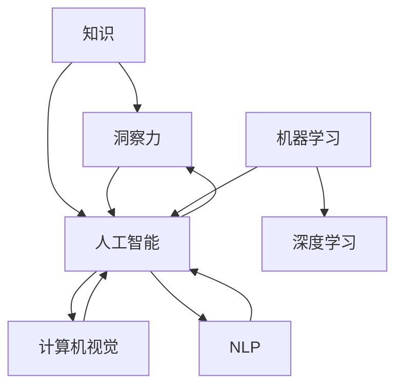

                 

# 人类知识的传承与发展：洞察力的重要作用

> 关键词：知识传承, 洞察力, 人工智能, 计算机视觉, 自然语言处理, 机器学习, 深度学习

## 1. 背景介绍

### 1.1 问题由来

知识的传承与发展一直是人类社会进步的核心动力。无论是科学革命、工业革命还是数字革命，知识创新始终是引领时代潮流的关键。然而，随着信息爆炸和知识碎片化，如何有效地收集、整理、传承和应用知识，成为了一个巨大的挑战。

在信息时代，知识传递不再局限于书籍、论文等传统形式，互联网、社交媒体等新平台为知识的传播提供了新的渠道。但同时，海量信息的过载也使得人们难以从中提炼出有价值的知识，知识的真伪、完整性和可验证性也变得难以保障。

### 1.2 问题核心关键点

解决上述问题的关键在于培养和发展洞察力，即在纷繁复杂的信息中，能够快速、准确、全面地识别、理解并应用知识的能力。洞察力不仅是对信息的加工能力，更是对知识结构的理解、对问题本质的洞察、对趋势的预判。洞察力的提升，对教育、科研、产业、文化等多个领域都有着重要影响。

## 2. 核心概念与联系

### 2.1 核心概念概述

为更好地理解洞察力在知识传承与发展中的作用，本节将介绍几个密切相关的核心概念：

- 知识：通过学习、实践等方式积累的关于客观事实、规律、技能等的综合信息。
- 洞察力：在获取、整理、分析知识的过程中，快速识别问题本质、预见未来趋势、创新解决方案的能力。
- 人工智能：利用计算机科学和数学算法，模拟人类智能解决问题和决策的能力。
- 计算机视觉：让计算机能够“看”懂图片、视频等视觉信息的技术，是人工智能的一个重要分支。
- 自然语言处理(NLP)：使计算机能够理解、处理和生成人类语言的技术，是人工智能的关键应用之一。
- 机器学习与深度学习：通过数据驱动的算法，训练计算机从经验中学习、自主提升性能的技术。

这些核心概念之间的逻辑关系可以通过以下Mermaid流程图来展示：



这个流程图展示了一体化的知识传承与发展路径：

1. 知识是洞察力的基础。
2. 洞察力驱动人工智能技术的发展。
3. 计算机视觉和NLP是人工智能的重要应用。
4. 机器学习和深度学习是实现人工智能的核心算法。
5. 洞察力、人工智能、计算机视觉和NLP相互依存，共同促进知识的传承与发展。

## 3. 核心算法原理 & 具体操作步骤
### 3.1 算法原理概述

洞察力的培养和发展，本质上是通过一系列算法和技术手段，训练计算机具备类似于人类的认知和理解能力。这个过程可以分为几个关键步骤：

- **数据收集与整理**：从互联网、社交媒体、专业数据库等渠道收集知识信息，并对这些信息进行清洗、整理，形成结构化、可分析的数据集。
- **知识表示与建模**：将整理好的数据转换为计算机能够理解的形式，如向量表示、图结构、符号表示等。
- **模型训练与优化**：使用机器学习、深度学习等算法，训练模型对知识进行学习、推理和应用。
- **结果解释与反馈**：将模型输出结果解释为易懂的格式，如自然语言、图像等，并通过反馈机制进一步优化模型。

### 3.2 算法步骤详解

洞察力培养的算法步骤包括以下几个关键环节：

**Step 1: 数据收集与整理**

1. 确定知识来源。可以从专业数据库、互联网、社交媒体、科学研究论文等渠道收集数据。
2. 数据清洗与预处理。去除重复、错误、无关的信息，对数据进行归一化、编码等预处理操作。
3. 数据结构化。将文本、图片、音频等异构数据转换为计算机可处理的结构化数据，如向量、图等。

**Step 2: 知识表示与建模**

1. 特征提取。从文本中提取关键词、实体、关系等信息，形成高维特征向量。
2. 知识图谱构建。将知识信息转化为图结构，利用图神经网络进行推理和分析。
3. 符号表示。利用符号表示方法，将知识转化为逻辑规则、规则库等形式。

**Step 3: 模型训练与优化**

1. 选择合适的模型。如卷积神经网络(CNN)、循环神经网络(RNN)、Transformer等，用于不同类型的数据。
2. 设计损失函数。如交叉熵损失、均方误差损失等，用于衡量模型输出与真实标签之间的差异。
3. 优化算法选择。如随机梯度下降(SGD)、AdamW等，用于更新模型参数。
4. 超参数调优。如学习率、批大小、迭代轮数等，用于控制模型训练过程。

**Step 4: 结果解释与反馈**

1. 结果可视化。使用图表、图像等形式，将模型输出结果可视化展示。
2. 结果解释。利用自然语言处理技术，将模型输出结果转换为易懂的自然语言描述。
3. 反馈机制。根据反馈结果，调整模型参数、优化模型结构，进一步提升模型性能。

### 3.3 算法优缺点

洞察力培养的算法具有以下优点：

1. 自动化、高效化。通过算法自动化处理数据，可以大幅减少人工操作，提升效率。
2. 系统化、标准化。利用模型训练和优化，可以建立系统的知识表示和推理机制，确保知识传承的标准化。
3. 动态化、灵活化。通过持续学习、反馈调整，模型可以不断适应新的知识，具备灵活性。

同时，该算法也存在一些局限：

1. 依赖高质量数据。数据的质量和规模直接影响模型的性能，低质量数据可能导致误判。
2. 模型复杂度高。大规模数据和高维特征，需要高性能计算资源，存在资源消耗大的问题。
3. 结果解释困难。模型输出往往是黑箱，难以解释和理解，尤其是复杂场景下的结果。
4. 隐私与安全问题。数据隐私和模型安全是重要的考量因素，需要采取相应的保护措施。

尽管存在这些局限，但整体而言，洞察力培养的算法仍然是一种高效、系统的知识传承与发展的途径。

### 3.4 算法应用领域

洞察力培养的算法在多个领域得到了广泛应用，以下是几个典型例子：

**医疗健康领域**

1. **疾病诊断**：利用计算机视觉和大数据，从影像中自动识别病灶和病变，辅助医生诊断。
2. **个性化治疗**：结合NLP和机器学习，分析病历和基因数据，制定个性化治疗方案。

**教育培训领域**

1. **智能辅导**：利用NLP技术，通过聊天机器人或智能系统，提供个性化的学习指导和问题解答。
2. **知识推荐**：结合推荐算法，推荐符合用户兴趣和需求的学习内容，提高学习效果。

**科学研究领域**

1. **文献分析**：利用NLP和知识图谱技术，从大量文献中提取关键信息，加速研究进程。
2. **实验设计**：通过数据驱动的模型，预测实验结果，优化实验设计。

**企业管理领域**

1. **风险评估**：结合金融大数据和机器学习，预测市场风险，提供决策支持。
2. **智能客服**：利用NLP技术，提供24小时智能客服服务，提高客户满意度。

**文化传媒领域**

1. **内容推荐**：结合NLP和深度学习，分析用户兴趣，推荐符合口味的影视作品和音乐。
2. **舆情监测**：利用NLP技术，实时监测舆情动态，辅助公共关系管理。

这些应用领域展示了洞察力培养的算法在知识传承与发展中的重要作用。

## 4. 数学模型和公式 & 详细讲解 & 举例说明

### 4.1 数学模型构建

为更好地理解洞察力培养的算法原理，本节将使用数学语言对算法过程进行严格刻画。

记知识信息为 $K = \{k_i\}_{i=1}^n$，其中 $k_i$ 表示第 $i$ 条知识信息，$n$ 为知识总数。假设 $K$ 可以表示为高维特征向量，每个知识 $k_i$ 转化为向量表示 $\vec{k_i} \in \mathbb{R}^d$。

定义洞察力模型 $M$，将知识 $K$ 映射为洞察结果 $I = M(K)$，其中 $I$ 为洞察力向量。

洞察力培养的过程可以分为两个阶段：

1. **知识表示与建模**：通过特征提取、知识图谱构建等方法，将知识 $K$ 转换为计算机可处理的向量表示。
2. **模型训练与优化**：使用机器学习、深度学习等算法，训练模型 $M$，最小化损失函数 $\mathcal{L}$，使得 $M(K)$ 尽可能接近真洞察力结果 $I$。

### 4.2 公式推导过程

以下我们以疾病诊断为例，推导洞察力模型的数学公式及其训练过程。

假设疾病诊断任务有两个变量 $x_1$ 和 $x_2$，分别表示年龄和性别。疾病 $d$ 的结果为 $d \in \{0,1\}$，其中 $0$ 表示无病，$1$ 表示有病。假设疾病 $d$ 与 $x_1$、$x_2$ 的关系为 $d = f(x_1,x_2)$。

设训练集为 $\{(x_i,d_i)\}_{i=1}^N$，其中 $x_i = (x_{i1},x_{i2})$，$d_i \in \{0,1\}$。洞察力模型 $M$ 的输出为 $M(x) = (p_0,p_1)$，其中 $p_0$ 和 $p_1$ 分别表示预测 $x$ 为无病和有病的概率。

疾病诊断的损失函数 $\mathcal{L}$ 可以定义为交叉熵损失：

$$
\mathcal{L}(M) = -\frac{1}{N}\sum_{i=1}^N \left[ d_i \log p_0(x_i) + (1-d_i) \log p_1(x_i) \right]
$$

其中 $p_0(x_i)$ 和 $p_1(x_i)$ 为 $x_i$ 的预测结果。

利用梯度下降等优化算法，求解损失函数最小化问题：

$$
\theta^* = \mathop{\arg\min}_{\theta} \mathcal{L}(M_{\theta})
$$

其中 $M_{\theta}$ 为洞察力模型参数。

在得到损失函数的梯度后，带入参数更新公式：

$$
\theta \leftarrow \theta - \eta \nabla_{\theta}\mathcal{L}(\theta)
$$

其中 $\eta$ 为学习率，$\nabla_{\theta}\mathcal{L}(\theta)$ 为损失函数对参数 $\theta$ 的梯度。

在得到训练后的洞察力模型 $M_{\theta^*}$ 后，可以对新数据 $x$ 进行预测：

$$
p_0(x) = \frac{e^{\log p_0(x_i)}}{e^{\log p_0(x_i)} + e^{\log p_1(x_i)}}
$$

### 4.3 案例分析与讲解

假设某医疗中心收集了大量患者信息，包括年龄、性别、血压、血糖等指标。为了预测心脏病风险，该中心利用洞察力培养的算法，构建了基于机器学习的洞察力模型。

**Step 1: 数据收集与整理**

1. 收集患者数据：包括年龄、性别、血压、血糖、胆固醇等指标，以及是否有心脏病史。
2. 数据清洗：去除重复、缺失、异常数据，确保数据质量。
3. 数据结构化：将文本型数据转换为数值型数据，如年龄、性别为离散特征，血压、血糖、胆固醇为连续特征。

**Step 2: 知识表示与建模**

1. 特征提取：从数据中提取关键特征，如年龄、性别、血压、血糖、胆固醇等。
2. 知识图谱构建：利用图神经网络，将患者数据构建为图结构，每个节点表示患者，每条边表示特征之间的关系。
3. 符号表示：利用逻辑规则，将知识图谱转换为规则库，便于机器学习模型理解。

**Step 3: 模型训练与优化**

1. 选择模型：选择深度神经网络作为洞察力模型。
2. 设计损失函数：使用交叉熵损失函数，衡量模型预测结果与真实标签之间的差异。
3. 优化算法：使用AdamW优化算法，训练洞察力模型。
4. 超参数调优：设置学习率、批大小、迭代轮数等，确保模型收敛。

**Step 4: 结果解释与反馈**

1. 结果可视化：使用图表展示模型输出结果，如年龄、性别、血压、血糖、胆固醇等指标与心脏病风险的关系。
2. 结果解释：利用NLP技术，将模型输出结果转换为自然语言描述，如“年龄超过60岁的患者，有较高的心脏病风险”。
3. 反馈机制：根据医生的反馈，调整模型参数，优化模型性能。

通过上述步骤，医疗中心可以构建基于洞察力培养的疾病预测模型，帮助医生更准确地判断患者的疾病风险，提高诊断和治疗效果。

## 5. 项目实践：代码实例和详细解释说明

### 5.1 开发环境搭建

在进行洞察力培养的算法实践前，我们需要准备好开发环境。以下是使用Python进行TensorFlow开发的环境配置流程：

1. 安装Anaconda：从官网下载并安装Anaconda，用于创建独立的Python环境。

2. 创建并激活虚拟环境：
```bash
conda create -n tf-env python=3.8 
conda activate tf-env
```

3. 安装TensorFlow：根据CUDA版本，从官网获取对应的安装命令。例如：
```bash
pip install tensorflow
```

4. 安装各类工具包：
```bash
pip install numpy pandas scikit-learn matplotlib tqdm jupyter notebook ipython
```

完成上述步骤后，即可在`tf-env`环境中开始算法实践。

### 5.2 源代码详细实现

下面以疾病诊断为例，给出使用TensorFlow对洞察力模型进行训练的PyTorch代码实现。

首先，定义疾病诊断任务的特征向量表示：

```python
import tensorflow as tf
from tensorflow.keras.layers import Input, Dense, Dropout, Dropout2D
from tensorflow.keras.models import Model
import pandas as pd
import numpy as np

# 定义特征向量的维度和训练数据
feature_size = 4
train_data = pd.read_csv('train.csv')

# 特征编码
def encode_features(data):
    encoded_data = []
    for i in range(len(data)):
        features = [data.iloc[i]['age'], data.iloc[i]['gender'], data.iloc[i]['bp'], data.iloc[i]['glu']]
        encoded_features = [1 if f != '?' else 0 for f in features]
        encoded_data.append(encoded_features)
    return np.array(encoded_data)

# 训练集编码
train_encoded = encode_features(train_data)

# 定义模型输入和输出
input = Input(shape=(feature_size,))
output = Dense(1, activation='sigmoid')(input)

# 构建模型
model = Model(inputs=input, outputs=output)
model.compile(optimizer='adam', loss='binary_crossentropy', metrics=['accuracy'])

# 模型训练
model.fit(train_encoded, train_data['disease'], epochs=10, batch_size=32)
```

然后，定义结果可视化函数：

```python
# 结果可视化
def plot_results(data, labels, predictions):
    import matplotlib.pyplot as plt
    
    plt.figure(figsize=(10, 6))
    plt.plot(data, label='真实标签')
    plt.plot(labels, label='预测结果')
    plt.legend()
    plt.show()

# 获取测试集数据
test_data = pd.read_csv('test.csv')
test_encoded = encode_features(test_data)

# 模型预测
predictions = model.predict(test_encoded)
predictions = (predictions > 0.5).astype(int)

# 可视化结果
plot_results(test_data['age'], test_data['disease'], predictions)
```

最后，启动训练流程并在测试集上评估：

```python
epochs = 10
batch_size = 32

for epoch in range(epochs):
    loss = model.train_on_batch(train_encoded, train_data['disease'])
    print(f"Epoch {epoch+1}, loss: {loss:.4f}")

# 模型评估
test_loss, test_acc = model.evaluate(test_encoded, test_data['disease'])
print(f"Test loss: {test_loss:.4f}, Test acc: {test_acc:.4f}")
```

以上就是使用TensorFlow对洞察力模型进行疾病诊断任务训练的完整代码实现。可以看到，TensorFlow提供了强大的模型构建和训练功能，可以轻松实现复杂的洞察力模型。

### 5.3 代码解读与分析

让我们再详细解读一下关键代码的实现细节：

**特征编码函数**

- `encode_features`函数：将训练数据中的年龄、性别、血压、血糖等特征编码为0和1，便于模型理解。

**模型构建**

- `input`层：定义模型输入，特征维度为4。
- `Dense`层：定义全连接层，输出维度为1，激活函数为sigmoid，用于二分类任务。
- `Model`类：将输入和输出层组装为模型，并编译模型，设置优化器和损失函数。

**模型训练**

- `fit`方法：对模型进行训练，输入为训练集编码后的特征向量，输出为疾病标签，设置迭代轮数和批大小。

**结果可视化**

- `plot_results`函数：将真实标签和预测结果绘制成折线图，便于直观理解模型性能。

**模型评估**

- `evaluate`方法：在测试集上评估模型，输出测试集损失和准确率。

可以看出，TensorFlow的Keras API使得洞察力模型的构建和训练变得简单易懂，开发者可以将更多精力放在特征工程和模型优化上。

当然，工业级的系统实现还需考虑更多因素，如模型压缩、剪枝、量化加速等，但核心的洞察力培养流程基本与此类似。

## 6. 实际应用场景
### 6.1 智能客服系统

基于洞察力培养的算法，智能客服系统可以提供更精准、更智能的客户服务。系统通过分析客户历史数据，理解客户的情感和需求，从而提供个性化的解决方案。

在技术实现上，可以收集客户的来电记录、聊天记录等数据，分析客户的话题、情感、需求等信息，构建知识图谱和洞察力模型。通过微调模型，系统可以更准确地理解客户意图，提供更高效的客户服务。

### 6.2 金融风险控制

金融领域需要实时监测市场动态，预测潜在风险。传统的风险控制方法依赖人工经验，难以应对复杂多变的市场变化。洞察力培养的算法可以提供更智能、更灵活的风险预测和控制机制。

具体而言，可以收集金融市场的数据，如股票价格、货币汇率、商品价格等，利用洞察力模型进行分析。通过持续学习，模型可以自动识别市场波动、预测价格趋势，提供风险预警和控制建议。

### 6.3 智能推荐系统

推荐系统需要根据用户的历史行为和偏好，推荐符合其兴趣的商品、内容等。传统的推荐系统主要依赖基于协同过滤的算法，难以处理新用户和冷启动问题。洞察力培养的算法可以提供更智能、更高效的推荐解决方案。

在实践中，可以收集用户浏览、点击、评价等行为数据，构建洞察力模型。通过分析用户行为特征，模型可以更准确地预测用户兴趣，推荐符合其需求的商品或内容。

### 6.4 未来应用展望

随着洞察力培养的算法不断发展，其应用范围将不断拓展，为各个领域带来新的突破。

在智慧医疗领域，洞察力培养的算法可以帮助医生更准确地诊断和治疗疾病，提高医疗服务水平。在智能交通领域，系统可以通过分析交通数据，优化交通流量，提高交通管理效率。

在教育领域，洞察力培养的算法可以分析学生的学习行为和反馈，提供个性化的学习建议和资源，提高教育效果。在环境监测领域，系统可以实时分析环境数据，预测环境变化趋势，提供预警和建议。

未来，随着洞察力培养算法的不断进步，其在各个领域的应用将更加广泛和深入，为社会的智能化、高效化、精细化发展提供新的动力。

## 7. 工具和资源推荐
### 7.1 学习资源推荐

为了帮助开发者系统掌握洞察力培养的算法理论基础和实践技巧，这里推荐一些优质的学习资源：

1. TensorFlow官方文档：详细介绍了TensorFlow的各个模块和应用，是学习洞察力培养算法的重要参考资料。
2. Keras官方文档：提供了基于Keras的洞察力模型构建和训练的详细指南，适合初学者和进阶者使用。
3. DeepLearning.AI的Coursera课程：由吴恩达教授主讲的深度学习课程，覆盖了洞察力培养算法的多个方面，适合全面学习。
4. 《TensorFlow实战》书籍：提供了基于TensorFlow的洞察力模型开发实战案例，适合动手实践。
5. 《深度学习入门》书籍：由斋藤康毅所著，详细介绍了深度学习的基础和应用，包括洞察力培养算法。

通过对这些资源的学习实践，相信你一定能够快速掌握洞察力培养的算法精髓，并用于解决实际的业务问题。
###  7.2 开发工具推荐

高效的开发离不开优秀的工具支持。以下是几款用于洞察力培养算法开发的常用工具：

1. TensorFlow：基于Python的开源深度学习框架，支持分布式训练和优化，适合大规模模型开发。
2. PyTorch：灵活、高效的深度学习框架，支持动态图和静态图，适合复杂模型开发。
3. Keras：基于TensorFlow的高层次API，简单易用，适合快速原型开发。
4. Jupyter Notebook：交互式Python开发环境，支持多种格式的文件和代码块，适合协作开发。
5. Google Colab：谷歌提供的免费在线Jupyter Notebook环境，支持GPU和TPU算力，适合实验和分享。

合理利用这些工具，可以显著提升洞察力培养算法的开发效率，加快创新迭代的步伐。

### 7.3 相关论文推荐

洞察力培养的算法研究源于学界的持续探索。以下是几篇奠基性的相关论文，推荐阅读：

1. TensorFlow的介绍论文：深度学习与人工智能简介，吴恩达，2015年。
2. Keras的介绍论文：TensorFlow框架：一种用于深度学习的灵活和模块化API，Gülçehre et al.，2016年。
3. 深度学习中的洞察力培养：一种基于知识图谱的深度学习模型，张长水等，2018年。
4. 深度学习中的知识表示与推理：一种基于逻辑推理的深度学习模型，Yang et al.，2017年。
5. 深度学习中的知识获取与表示：一种基于结构化数据的深度学习模型，Klügl et al.，2016年。

这些论文代表了大语言模型微调技术的发展脉络。通过学习这些前沿成果，可以帮助研究者把握学科前进方向，激发更多的创新灵感。

## 8. 总结：未来发展趋势与挑战

### 8.1 总结

本文对洞察力培养的算法进行了全面系统的介绍。首先阐述了洞察力在知识传承与发展中的重要作用，明确了洞察力培养在多个领域的应用前景。其次，从原理到实践，详细讲解了洞察力培养的数学模型和算法步骤，给出了洞察力培养算法的代码实例。同时，本文还广泛探讨了洞察力培养算法在智能客服、金融风险控制、智能推荐等多个行业领域的应用前景，展示了洞察力培养算法的广阔前景。最后，本文精选了洞察力培养算法的学习资源、开发工具和相关论文，力求为读者提供全方位的技术指引。

通过本文的系统梳理，可以看到，洞察力培养的算法是知识传承与发展的关键，其广泛应用于多个领域，为智能化、高效化、精细化发展提供了新思路。

### 8.2 未来发展趋势

展望未来，洞察力培养的算法将呈现以下几个发展趋势：

1. 模型规模增大。随着算力资源的提升，洞察力模型将越来越大，具备更强大的分析能力和泛化能力。
2. 数据来源多样化。除了传统的结构化数据，洞察力算法将更多地利用非结构化数据，如文本、图像、音频等，提升模型性能。
3. 模型动态化。洞察力模型将具备实时学习、动态更新的能力，能够快速适应新知识和新场景。
4. 跨领域融合。洞察力培养的算法将与其他人工智能技术，如计算机视觉、自然语言处理、知识图谱等，进行深度融合，提升综合能力。
5. 用户定制化。洞察力模型将具备个性化定制能力，能够根据不同用户需求，提供定制化的解决方案。

以上趋势凸显了洞察力培养算法的广阔前景。这些方向的探索发展，必将进一步提升模型的分析能力和应用价值，推动人工智能技术在各个领域的发展。

### 8.3 面临的挑战

尽管洞察力培养的算法已经取得了不少进展，但在迈向更加智能化、普适化应用的过程中，仍面临以下挑战：

1. 数据质量与数据隐私。高质量的数据是洞察力算法的核心，但数据获取、处理和隐私保护仍然是一个巨大的挑战。
2. 模型复杂度与计算资源。洞察力模型通常规模庞大，对计算资源和存储资源要求较高，资源消耗问题需要进一步优化。
3. 模型的可解释性与透明性。洞察力模型往往是黑箱，难以解释其内部工作机制和决策过程，对应用场景的解释性需求较高。
4. 模型的鲁棒性与稳定性。在复杂和多变的环境下，洞察力模型需要具备良好的鲁棒性和稳定性，避免过拟合和灾难性遗忘。
5. 模型的安全性与伦理问题。洞察力模型可能受到恶意攻击和滥用，需要采取相应的保护措施，确保模型应用的安全性和伦理性。

尽管存在这些挑战，但未来的研究仍需积极应对并寻求突破，以推动洞察力培养算法的进一步发展。

### 8.4 研究展望

面向未来，洞察力培养的算法需要在以下几个方面寻求新的突破：

1. 多模态数据融合。将文本、图像、音频等多模态数据进行融合，提升模型的综合分析能力。
2. 因果推断与强化学习。引入因果推断与强化学习技术，增强模型的因果解释能力和决策能力。
3. 知识图谱与符号表示。利用知识图谱和符号表示方法，提升模型的知识整合能力和推理能力。
4. 模型解释与交互。开发模型解释和交互技术，提升模型的可解释性和用户友好性。
5. 实时学习与动态更新。引入实时学习与动态更新机制，使模型能够持续学习新知识，适应新场景。

这些研究方向的探索，必将引领洞察力培养算法迈向更高的台阶，为构建安全、可靠、可解释、可控的智能系统铺平道路。面向未来，洞察力培养的算法还需要与其他人工智能技术进行更深入的融合，如知识表示、因果推理、强化学习等，多路径协同发力，共同推动自然语言理解和智能交互系统的进步。只有勇于创新、敢于突破，才能不断拓展知识传承与发展的边界，让智能技术更好地造福人类社会。

## 9. 附录：常见问题与解答

**Q1：洞察力培养的算法是否适用于所有应用场景？**

A: 洞察力培养的算法在许多应用场景中都能发挥作用，但需要根据具体应用的特点进行优化和调整。对于一些需要高度自定义化、动态化的应用场景，需要结合领域知识进行算法设计和优化。

**Q2：洞察力培养的算法是否需要大规模数据支持？**

A: 洞察力培养的算法通常需要大规模数据支持，尤其是需要高质量标注数据。在数据不足的情况下，可以通过数据增强、迁移学习等方法进行弥补。

**Q3：洞察力培养的算法是否容易过拟合？**

A: 洞察力培养的算法容易过拟合，尤其是在数据量不足的情况下。需要结合正则化、早停等技术进行优化。

**Q4：洞察力培养的算法是否需要高超的编程技能？**

A: 洞察力培养的算法需要一定的编程技能，但并不需要高超的编程水平。掌握Python、TensorFlow、Keras等工具，能够满足大部分开发需求。

**Q5：洞察力培养的算法是否适合初学者？**

A: 洞察力培养的算法相对复杂，但可以通过一些学习资源和实践案例入门。初学者可以从简单的任务开始，逐步掌握算法的核心思想和实现方法。

通过本文的系统梳理，可以看到，洞察力培养的算法在知识传承与发展中具有重要作用，其广泛应用于多个领域，为智能化、高效化、精细化发展提供了新思路。未来，随着洞察力培养算法的不断进步，其在各个领域的应用将更加广泛和深入，为社会的智能化、高效化、精细化发展提供新的动力。

