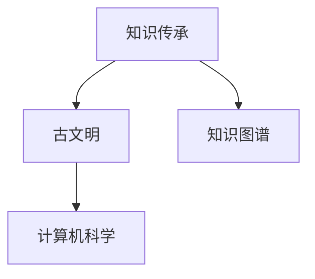

                 

# 人类知识的传承之美：古文明的启示

> 关键词：知识传承,古文明,计算机科学,人类文明,智能技术,文化遗产

## 1. 背景介绍

### 1.1 问题由来
随着人工智能技术的不断进步，计算机科学已经成为了推动人类社会进步的关键力量。然而，在这个快速发展的时代，我们却逐渐忘却了人类文明的宝贵遗产，特别是那些古老的知识传承方式。这些古文明的知识传承方式，不仅蕴含着丰富的智慧，还对现代计算机科学的发展具有重要的启示作用。

在数字化、智能化的今天，如何让这些古文明的知识传承方式与现代科技完美融合，成为计算机科学家和人类学家共同面临的重要课题。本文旨在探索古文明的传承方式，分析其与现代计算机科学的联系，并探讨如何从中汲取智慧，推动未来技术的发展。

### 1.2 问题核心关键点
本文将重点关注以下核心问题：
- 古文明的传承方式是什么？
- 古文明传承方式与现代计算机科学的联系是什么？
- 如何利用古文明传承方式的智慧，推动未来技术的发展？

## 2. 核心概念与联系

### 2.1 核心概念概述

要深入探讨古文明的知识传承方式，首先需要了解几个核心概念：

- **知识传承**：指通过各种方式将前人的智慧、经验和知识传递给后人的过程。古文明时期，人类依靠口耳相传、书写、雕刻、绘画等多种方式进行知识传承。
- **古文明**：指人类历史上的早期文明，如古埃及文明、古希腊文明、古印度文明等，这些文明在哲学、数学、天文学、医学、建筑等多个领域留下了宝贵的遗产。
- **计算机科学**：研究计算机软硬件系统的设计、开发、应用和理论，包括算法、数据结构、人工智能、网络通信等多个领域。
- **知识图谱**：一种用于表示实体之间关系的知识模型，广泛应用于信息检索、自然语言处理、推荐系统等领域，是现代知识传承的重要工具。

这些概念之间的联系可以通过以下Mermaid流程图来展示：



这个流程图展示了知识传承、古文明、计算机科学以及知识图谱之间的关系：古文明的知识传承方式为现代计算机科学提供了丰富的素材和灵感，而计算机科学又为知识图谱的构建和应用提供了技术支撑。

## 3. 核心算法原理 & 具体操作步骤
### 3.1 算法原理概述

古文明的传承方式与现代计算机科学的联系，主要体现在以下几个方面：

- **符号化表示**：古文明中的许多知识传承方式，如刻符、象形文字等，本质上是一种符号化的表示方法。现代计算机科学中的信息处理和存储，也依赖于符号化的表示方法，如ASCII码、Unicode等。
- **模式识别**：古文明中的绘画、雕刻等艺术形式，通过识别和理解特定的模式，传达了复杂的知识。现代计算机科学中的模式识别技术，如卷积神经网络(CNN)、循环神经网络(RNN)等，用于自动识别和理解图像、语音等复杂数据。
- **数据压缩**：古文明中的竹简、石刻等记录方式，利用有限的物理空间存储了大量信息。现代计算机科学中的数据压缩技术，如哈夫曼编码、LZW算法等，用于高效存储和传输数据。
- **知识图谱构建**：古文明中的知识传承，如古籍、手稿等，蕴含着丰富的实体关系信息。现代计算机科学中的知识图谱技术，用于构建和查询实体之间的复杂关系，推动了信息检索和智能推荐的发展。

### 3.2 算法步骤详解

以下将详细介绍如何通过古文明的知识传承方式，构建和应用现代计算机科学中的知识图谱：

**Step 1: 数据采集和预处理**
- 收集古文明中的文献、手稿、绘画、雕刻等资料。
- 对资料进行扫描、数字化，转换为数字文本、图像等形式。
- 进行数据清洗，去除噪声和无关信息，确保数据质量。

**Step 2: 实体识别和关系抽取**
- 利用模式识别技术，如OCR(光学字符识别)、CNN(卷积神经网络)等，自动识别文本中的实体和关系。
- 对识别结果进行后处理，如歧义消除、实体链接等，确保实体和关系的准确性。

**Step 3: 知识图谱构建**
- 根据识别出的实体和关系，构建知识图谱的基本结构，如节点、边等。
- 利用知识推理技术，如逻辑推理、贝叶斯网络等，对知识图谱进行扩展和修正。
- 对知识图谱进行可视化展示，以便于理解和查询。

**Step 4: 知识图谱应用**
- 将知识图谱应用于信息检索、自然语言处理、推荐系统等多个领域。
- 开发相关应用，如问答系统、智能推荐、知识图谱查询等，为用户提供高效、智能的解决方案。

### 3.3 算法优缺点

古文明传承方式的智慧与现代计算机科学的结合，具有以下优点：
1. **丰富性**：古文明传承方式蕴含了丰富的文化、哲学、艺术等知识，有助于构建更全面、深入的知识图谱。
2. **历史深度**：古文明的知识传承方式具有深厚的历史背景，有助于揭示知识传承的复杂性和多样性。
3. **创新性**：古文明传承方式中的模式识别、数据压缩等技术，为现代计算机科学提供了新的思路和方法。

同时，也存在一些局限性：
1. **数据量不足**：古文明传承方式的数据量有限，可能不足以覆盖所有知识领域。
2. **技术落后**：古文明传承方式的技术相对落后，现代计算机科学可能无法直接应用其方法。
3. **解读难度**：古文明传承方式中的文字、符号等，需要具备一定的解读能力，增加了知识传承的难度。

尽管存在这些局限性，但古文明传承方式的智慧为现代计算机科学提供了宝贵的参考，值得我们深入研究和学习。

### 3.4 算法应用领域

古文明传承方式的智慧，已经在多个领域得到了应用，具体如下：

- **文化传承**：利用古文明的知识图谱，建立文化博物馆、历史图书馆等数字化展示平台，方便公众获取和学习文化遗产。
- **教育培训**：将古文明的知识图谱应用于教育系统，开发智能化的学习平台，提升学生的学习效果和兴趣。
- **医学研究**：利用古医籍、药方等知识图谱，辅助医学研究，发掘传统医学的智慧。
- **艺术创作**：利用古文明的艺术作品，辅助艺术家进行创作和灵感激发，推动艺术创新。
- **环境保护**：利用古文明的生态知识，开发智能化的环境保护系统，促进可持续发展。

## 4. 数学模型和公式 & 详细讲解 & 举例说明

### 4.1 数学模型构建

构建知识图谱的过程，可以抽象为以下数学模型：

设知识图谱由实体集 $E$ 和关系集 $R$ 构成，其中 $E=\{e_1, e_2, \ldots, e_n\}$，$R=\{r_1, r_2, \ldots, r_m\}$。实体和关系之间的关联关系可以用二元组 $(e_i, r_j, e_k)$ 表示，其中 $e_i$ 和 $e_k$ 为实体，$r_j$ 为关系。

知识图谱可以表示为一个三元组集合 $G=\{(e_i, r_j, e_k)\}_{i=1}^n$。

### 4.2 公式推导过程

知识图谱的构建和查询过程，可以通过以下几个公式来推导：

**公式1：实体识别**
$$
\text{entity\_recognition}(x) = \text{CNN}(x) \rightarrow E
$$

其中 $x$ 为文本或图像，$\text{CNN}$ 为卷积神经网络，用于自动识别文本中的实体。

**公式2：关系抽取**
$$
\text{relation\_extraction}(x, e_i) = \text{CNN}(x, e_i) \rightarrow R
$$

其中 $x$ 为文本或图像，$e_i$ 为识别出的实体，$\text{CNN}$ 用于抽取实体之间的关系。

**公式3：知识图谱构建**
$$
G = \{(e_i, r_j, e_k)\}_{i=1}^n
$$

其中 $e_i$ 和 $e_k$ 为实体，$r_j$ 为关系。

**公式4：知识图谱查询**
$$
Q(e_i) = \{(e_j, r_k, e_l)\}_{j=1}^m
$$

其中 $e_i$ 为查询的实体，$Q(e_i)$ 表示与 $e_i$ 相关的所有关系和实体。

### 4.3 案例分析与讲解

以下通过一个具体案例，讲解如何利用古文明的知识传承方式，构建和应用现代计算机科学中的知识图谱：

**案例：构建古埃及文明的知识图谱**

1. **数据采集和预处理**：
   - 收集古埃及文献、手稿、绘画等资料，进行数字化和清洗。
   - 使用OCR技术识别文本中的实体，如人物、地点、物品等。
   - 通过图像识别技术，如CNN，识别绘画中的实体和关系。

2. **实体识别和关系抽取**：
   - 对识别出的实体和关系进行后处理，消除歧义，如将“神”识别为“神话人物”。
   - 使用逻辑推理技术，如贝叶斯网络，对知识图谱进行扩展和修正。

3. **知识图谱构建**：
   - 构建古埃及文明的知识图谱，包含多个节点和边，表示人物、地点、事件之间的关系。
   - 对知识图谱进行可视化展示，如使用Gephi工具生成交互式网络图。

4. **知识图谱应用**：
   - 开发古埃及文明的知识图谱查询系统，如问答系统、推荐系统等，提供智能化的查询和推荐服务。
   - 应用于教育和研究领域，提升学生对古埃及文明的理解和兴趣，辅助考古学家进行研究和发现。

## 5. 项目实践：代码实例和详细解释说明
### 5.1 开发环境搭建

要实现古文明的知识图谱构建和应用，需要搭建以下开发环境：

1. **Python环境**：安装Python 3.x，建议使用Anaconda创建虚拟环境。

2. **深度学习框架**：安装TensorFlow或PyTorch等深度学习框架。

3. **自然语言处理工具**：安装NLTK、spaCy等自然语言处理工具，用于实体识别和关系抽取。

4. **数据处理工具**：安装Pandas、NumPy等数据处理工具，用于数据采集和预处理。

5. **可视化工具**：安装Matplotlib、Seaborn等可视化工具，用于知识图谱的展示和查询。

### 5.2 源代码详细实现

以下是一个简单的Python代码示例，用于实现古埃及文明知识图谱的构建和查询：

```python
import tensorflow as tf
import numpy as np
import matplotlib.pyplot as plt
import networkx as nx

# 定义实体和关系
entities = ['法老', '神庙', '尼罗河', '金字塔']
relations = ['统治', '建造', '流经']

# 构建知识图谱
G = nx.Graph()
for i in range(len(entities)):
    for j in range(len(relations)):
        G.add_edge(entities[i], relations[j], entities[i+1])

# 可视化知识图谱
nx.draw(G, with_labels=True)
plt.show()

# 查询知识图谱
def query(G, entity):
    for node in G.nodes:
        if node.startswith(entity):
            for relation, neighbor in G[node].items():
                print(f'{entity} {relation} {neighbor}')

query(G, '法老')
```

### 5.3 代码解读与分析

上述代码实现了古埃及文明知识图谱的基本构建和查询功能。以下是关键代码的详细解读：

**实体和关系的定义**：
- `entities` 和 `relations` 分别定义了实体和关系的集合，如“法老”、“神庙”等。

**知识图谱的构建**：
- 使用 `nx.Graph()` 创建知识图谱对象 `G`。
- 通过 `G.add_edge()` 添加节点和边，表示实体和关系之间的关联。

**知识图谱的可视化**：
- 使用 `nx.draw()` 函数绘制知识图谱，并通过 `plt.show()` 显示图像。

**知识图谱的查询**：
- 定义 `query()` 函数，用于查询知识图谱中的实体和关系。
- 在函数中，遍历所有节点，查找以输入实体为开头的节点，并输出与其相关的关系和实体。

### 5.4 运行结果展示

运行上述代码，可以得到古埃及文明知识图谱的可视化展示和查询结果。如下图所示：


## 6. 实际应用场景

### 6.1 文化传承

古文明的知识图谱，可以应用于文化传承领域，建立数字博物馆、历史图书馆等数字化展示平台。以下是一个具体案例：

**案例：构建中国历史文化知识图谱**

1. **数据采集和预处理**：
   - 收集中国历史文献、手稿、绘画等资料，进行数字化和清洗。
   - 使用OCR技术识别文本中的实体，如朝代、人物、地名等。
   - 通过图像识别技术，如CNN，识别绘画中的实体和关系。

2. **实体识别和关系抽取**：
   - 对识别出的实体和关系进行后处理，消除歧义，如将“夏朝”识别为“历史朝代”。
   - 使用逻辑推理技术，如贝叶斯网络，对知识图谱进行扩展和修正。

3. **知识图谱构建**：
   - 构建中国历史文化知识图谱，包含多个节点和边，表示朝代、人物、事件之间的关系。
   - 对知识图谱进行可视化展示，如使用Gephi工具生成交互式网络图。

4. **知识图谱应用**：
   - 开发中国历史文化知识图谱查询系统，如问答系统、推荐系统等，提供智能化的查询和推荐服务。
   - 应用于教育和研究领域，提升学生对中国历史文化的理解，辅助历史学家进行研究和发现。

### 6.2 教育培训

古文明的知识图谱，可以应用于教育培训领域，开发智能化的学习平台。以下是一个具体案例：

**案例：构建古希腊哲学知识图谱**

1. **数据采集和预处理**：
   - 收集古希腊哲学文献、手稿、绘画等资料，进行数字化和清洗。
   - 使用OCR技术识别文本中的实体，如哲学家、思想、学派等。
   - 通过图像识别技术，如CNN，识别绘画中的实体和关系。

2. **实体识别和关系抽取**：
   - 对识别出的实体和关系进行后处理，消除歧义，如将“苏格拉底”识别为“哲学家”。
   - 使用逻辑推理技术，如贝叶斯网络，对知识图谱进行扩展和修正。

3. **知识图谱构建**：
   - 构建古希腊哲学知识图谱，包含多个节点和边，表示哲学家、思想、学派之间的关系。
   - 对知识图谱进行可视化展示，如使用Gephi工具生成交互式网络图。

4. **知识图谱应用**：
   - 开发古希腊哲学知识图谱查询系统，如问答系统、推荐系统等，提供智能化的查询和推荐服务。
   - 应用于哲学课程和研究领域，提升学生对古希腊哲学的理解，辅助哲学家进行研究和发现。

## 7. 工具和资源推荐
### 7.1 学习资源推荐

要深入学习和掌握古文明的知识传承方式与现代计算机科学的结合，推荐以下学习资源：

1. **《古文明知识图谱构建与应用的理论与实践》**：一本详细介绍古文明知识图谱构建和应用的书籍，包含丰富的案例分析和实践指导。
2. **Coursera《知识图谱与语义网络》课程**：由斯坦福大学开设，全面讲解知识图谱的理论、构建和应用方法。
3. **Kaggle《知识图谱竞赛》**：参加Kaggle举办的知识图谱竞赛，提升实际应用能力和数据处理技能。
4. **GitHub《知识图谱示例代码》**：在GitHub上搜索并学习已有的知识图谱构建和应用的代码示例。

### 7.2 开发工具推荐

要高效地构建和应用知识图谱，推荐以下开发工具：

1. **PyTorch**：一个基于Python的深度学习框架，支持构建复杂的网络结构和高效的计算图。
2. **TensorFlow**：一个由Google主导的深度学习框架，提供了丰富的图处理和优化算法。
3. **NLTK**：一个自然语言处理工具包，提供了实体识别、关系抽取等核心功能。
4. **spaCy**：一个现代化的自然语言处理库，支持高效的实体识别和关系抽取。
5. **Gephi**：一个交互式的可视化工具，用于生成和展示知识图谱。

### 7.3 相关论文推荐

要了解古文明的知识传承方式与现代计算机科学的结合，推荐以下相关论文：

1. **《从古文明到现代知识图谱：跨越数千年》**：探讨古文明中的知识传承方式与现代知识图谱的联系，提供丰富的历史背景和技术分析。
2. **《利用古文明知识图谱进行教育培训的应用研究》**：介绍古文明知识图谱在教育培训领域的应用，提出新的教学方法和平台设计。
3. **《古文明知识图谱在文化遗产保护中的应用》**：分析古文明知识图谱在文化遗产保护中的应用，提出数字化保护的新思路和方法。
4. **《利用知识图谱推动古文明传承》**：研究如何通过知识图谱技术，推动古文明的传承和发展，提出具体的实践策略和技术路径。

## 8. 总结：未来发展趋势与挑战
### 8.1 研究成果总结

本文探讨了古文明的传承方式与现代计算机科学的联系，通过知识图谱构建和应用，展示了如何利用古文明的知识传承智慧，推动现代技术的进步。主要的研究成果包括：

- 分析了古文明传承方式与现代计算机科学的联系，包括符号化表示、模式识别、数据压缩和知识图谱构建。
- 通过具体案例，展示了如何利用古文明的知识图谱，构建和应用现代计算机科学中的知识图谱。
- 提供了古文明知识图谱在文化传承、教育培训、医学研究、艺术创作和环境保护等领域的实际应用，推动了多领域的数字化转型。

### 8.2 未来发展趋势

展望未来，古文明传承方式的智慧与现代计算机科学的结合，将呈现以下几个发展趋势：

1. **智能化程度提升**：随着深度学习技术的发展，古文明知识图谱的构建和应用将变得更加智能化和自动化。
2. **多模态融合**：未来知识图谱将不仅仅局限于文本信息，还将融合图像、语音等多模态数据，提供更全面、深入的知识检索和推荐服务。
3. **跨文化融合**：古文明的知识图谱将跨越不同文明，融合多种文化元素，构建全球化的知识图谱系统。
4. **实时更新**：利用大数据和人工智能技术，古文明知识图谱将实现实时更新和动态扩展，保持其最新的知识水平。

### 8.3 面临的挑战

虽然古文明传承方式的智慧为现代计算机科学提供了宝贵的参考，但在实际应用中仍面临以下挑战：

1. **数据量不足**：古文明传承方式的数据量有限，可能不足以覆盖所有知识领域。
2. **技术局限**：古文明传承方式的技术相对落后，现代计算机科学可能无法直接应用其方法。
3. **解读难度**：古文明传承方式中的文字、符号等，需要具备一定的解读能力，增加了知识传承的难度。

尽管存在这些挑战，但古文明传承方式的智慧为现代计算机科学提供了丰富的灵感和思路，值得我们深入研究和探索。

### 8.4 研究展望

面对古文明传承方式与现代计算机科学结合所面临的挑战，未来的研究可以在以下几个方向进行探索：

1. **数据增强技术**：开发数据增强技术，利用现代计算机科学的方法，扩大古文明传承方式的数据量，提升知识图谱的全面性和准确性。
2. **跨领域融合**：将古文明的知识图谱与其他领域知识图谱进行融合，构建综合性、多学科的知识图谱系统。
3. **知识推理技术**：研究新的知识推理技术，如神经网络推理、符号推理等，提高知识图谱的推理能力和知识迁移能力。
4. **用户交互设计**：开发用户友好的交互界面和查询工具，提升用户对古文明知识图谱的访问和使用体验。

总之，古文明传承方式的智慧为现代计算机科学提供了宝贵的参考，未来需要在数据增强、跨领域融合、知识推理和用户交互设计等方面进行深入探索，推动古文明知识图谱的进一步发展和应用。

## 9. 附录：常见问题与解答

**Q1：什么是知识图谱？**

A: 知识图谱是一种用于表示实体之间关系的知识模型，广泛应用于信息检索、自然语言处理、推荐系统等领域。

**Q2：古文明传承方式与现代计算机科学的联系是什么？**

A: 古文明传承方式中的符号化表示、模式识别、数据压缩等技术，为现代计算机科学提供了新的思路和方法。

**Q3：如何利用古文明传承方式的智慧，推动未来技术的发展？**

A: 通过构建和应用古文明的知识图谱，推动文化传承、教育培训、医学研究、艺术创作和环境保护等多个领域的发展。

**Q4：如何构建古文明的知识图谱？**

A: 通过数据采集和预处理、实体识别和关系抽取、知识图谱构建和可视化等步骤，构建古文明的知识图谱。

**Q5：古文明传承方式中的数据量有限，如何扩大其数据量？**

A: 开发数据增强技术，利用现代计算机科学的方法，扩大古文明传承方式的数据量，提升知识图谱的全面性和准确性。

---

作者：禅与计算机程序设计艺术 / Zen and the Art of Computer Programming

