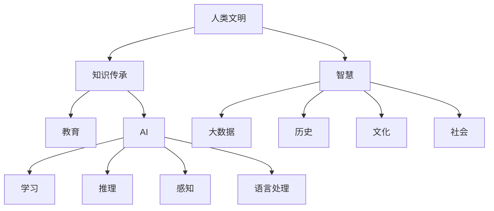
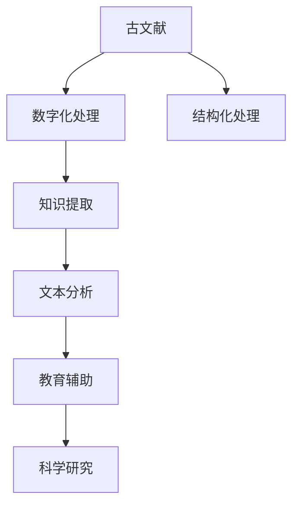

                 

# 人类知识的传承使命：古文明的智慧

> 关键词：人类文明，知识传承，智慧，AI，大数据，历史，文化，社会，教育

## 1. 背景介绍

### 1.1 问题由来
人类文明的发展离不开知识传承和智慧的积累。古往今来，各个文明通过书写、口述、绘画等方式记录下宝贵的知识和智慧。然而，传统的知识传承方式往往局限于特定的时代和地域，难以跨越时间和空间。此外，面对海量繁杂的文献资料，学者们常常难以在海量文本中提取有用的信息，这对知识传承造成了巨大的挑战。

### 1.2 问题核心关键点
本节将详细介绍与知识传承和智慧积累相关的核心概念及其内在联系：

- 人类文明：指从原始社会到现代社会，人类在各个方面积累的知识和智慧的总和。
- 知识传承：指通过教育、文献记录、文化活动等手段，将前人的知识和智慧传递给后人的过程。
- 智慧：指通过对知识和经验进行总结、提炼、推理，获得更为深远和普适的理解和洞察。
- 人工智能(AI)：指利用计算机算法和数据处理技术，模仿人类智能行为的能力，包括学习、推理、感知、语言处理等。
- 大数据：指规模庞大、类型多样的数据集，能够被分析和处理以获取有价值的信息。
- 历史：指记录和研究过去事件及其发展过程的学科，是人类文明的重要组成部分。
- 文化：指特定地域内的人们通过语言、艺术、习俗等形式表现出的共同价值观和生活方式。
- 社会：指人类共同体及其组成关系，涵盖经济、政治、文化等多个方面。
- 教育：指通过有目的、有计划的传授知识，培养下一代的能力，是知识传承的重要方式。

这些核心概念之间的逻辑关系可以通过以下Mermaid流程图来展示：



这个流程图展示出人类文明与知识传承、智慧、AI、大数据、历史、文化、社会和教育之间的内在联系和相互作用。

## 2. 核心概念与联系

### 2.1 核心概念概述

人类文明通过知识传承和智慧积累，形成了丰富多彩的文化和科技成就。从古埃及的象形文字，到古希腊的哲学思想，再到文艺复兴时期的科学革命，每一次文明飞跃都离不开知识的传承和智慧的积累。

在现代，随着科技的进步，尤其是大数据和AI技术的发展，人类文明的知识传承和智慧积累进入了一个新的阶段。大数据和AI不仅在处理和分析海量文本数据上发挥了重要作用，还为知识传承提供了新的方法和工具。例如，通过对古文献的数字化和结构化处理，AI可以从中提取有用的知识和信息，辅助学者进行研究和教学。

### 2.2 核心概念原理和架构的 Mermaid 流程图



这个流程图展示了古文献数字化处理、结构化处理、知识提取、文本分析、教育辅助和科学研究之间的联系。

## 3. 核心算法原理 & 具体操作步骤

### 3.1 算法原理概述

为了实现对古文献的知识提取和智慧积累，可以采用机器学习和自然语言处理技术。具体来说，可以通过以下步骤：

1. **数字化处理**：将古文献扫描或拍照，转化为可编辑的数字格式。
2. **结构化处理**：对数字化的古文献进行文本解析，提取出词、句、段落等结构化信息。
3. **知识提取**：利用文本分析算法，从结构化信息中提取出关键知识和概念。
4. **文本分析**：对提取出的知识和概念进行文本分析，了解其语义和上下文关系。
5. **教育辅助**：将分析结果转化为易于理解和使用的教育资源，辅助教学和学习。
6. **科学研究**：利用提取的知识和信息，进行科学研究，推动人类文明的发展。

### 3.2 算法步骤详解

以下是具体的算法步骤和具体操作步骤：

#### 步骤1：数字化处理
- **扫描或拍照**：将古文献进行高分辨率扫描或拍照，确保图像清晰。
- **图像处理**：使用图像处理技术，如二值化、降噪等，提高图像质量。
- **OCR识别**：利用光学字符识别(OCR)技术，将图像中的文字转化为文本格式。

#### 步骤2：结构化处理
- **分词**：将文本按照词语进行切分，提取出基本的词汇单位。
- **句法分析**：对分词后的文本进行句法分析，识别出句子结构。
- **命名实体识别**：识别文本中的人名、地名、机构名等实体。
- **词性标注**：对词汇进行词性标注，如名词、动词、形容词等。

#### 步骤3：知识提取
- **信息抽取**：从文本中抽取重要的信息，如事件、时间、地点等。
- **实体关系抽取**：识别实体之间的关系，如因果关系、递进关系等。
- **主题建模**：对文本进行主题建模，识别出核心主题和关键词。
- **情感分析**：分析文本中的情感倾向，如正向、负向、中性等。

#### 步骤4：文本分析
- **语义分析**：分析文本的语义关系，理解词汇和句子之间的含义。
- **知识图谱构建**：将提取的知识和概念构建为知识图谱，形成结构化的知识体系。
- **文本相似度计算**：计算不同文本之间的相似度，进行文本匹配和推荐。

#### 步骤5：教育辅助
- **教育资源生成**：将分析结果转化为多媒体教学资源，如动画、视频、PPT等。
- **自动生成教材**：利用文本分析结果，自动生成教材和习题，辅助教学。
- **智能辅导系统**：构建智能辅导系统，根据学生表现进行个性化推荐。

#### 步骤6：科学研究
- **历史数据分析**：利用历史文献中的数据，进行历史事件的分析和研究。
- **文化研究**：分析不同文化的特征和演变过程，推动文化研究的发展。
- **社会研究**：利用社会文献中的数据，分析社会结构和关系。

### 3.3 算法优缺点

#### 优点：
- **高效**：自动化处理大量文本数据，提高处理效率。
- **精确**：利用文本分析技术，从海量数据中提取有用信息，精度高。
- **可扩展**：可以处理不同类型、不同语言的古文献，适用范围广。
- **辅助教学**：通过多媒体和智能辅导系统，辅助教师和学生学习。
- **科学研究**：提供大量结构化数据，支持历史、文化和社会研究。

#### 缺点：
- **数据噪声**：古文献中的文本质量参差不齐，存在噪声和错误。
- **语言障碍**：不同古语言的处理难度较大，需要专家进行校正。
- **知识解释**：自动提取的知识和信息，缺乏人类智慧的深度理解。
- **教育适用性**：对不同年龄、不同学科的学生，教育资源的适用性仍需优化。
- **文化偏见**：算法可能继承数据中的文化偏见，需要进行去偏处理。

### 3.4 算法应用领域

本节将详细介绍知识传承和智慧积累在不同领域的应用：

#### 1. 历史研究
- **历史事件分析**：利用文本分析技术，从古文献中提取历史事件的信息，分析事件的发展和影响。
- **历史人物研究**：识别历史人物的关键事件和思想，深入了解其生平和成就。
- **历史地理研究**：分析不同历史时期的地理变化，研究地理位置对历史进程的影响。

#### 2. 文化研究
- **文化特征提取**：从古文献中提取不同文化的特征，分析文化演变过程。
- **文化比较研究**：比较不同文化的异同，了解文化之间的交流和影响。
- **文化遗产保护**：利用数字化的古文献，保护和传承文化遗产。

#### 3. 社会研究
- **社会结构分析**：分析不同社会结构的变化，理解社会发展的规律。
- **社会事件研究**：研究社会事件的原因和影响，预测未来社会趋势。
- **社会数据挖掘**：从社会文献中挖掘数据，支持社会研究和决策。

#### 4. 教育领域
- **历史教学辅助**：利用古文献中的知识，辅助历史教学。
- **文化课程设计**：设计文化课程，让学生了解不同文化的特征和演变。
- **社会研究课程**：设计社会研究课程，培养学生的社会认知能力。

## 4. 数学模型和公式 & 详细讲解 & 举例说明

### 4.1 数学模型构建

为了实现知识提取和智慧积累，可以构建如下数学模型：

1. **文本表示模型**：将古文献转化为向量表示，方便机器处理。
2. **信息抽取模型**：从向量表示中提取关键信息，如事件、实体、关系等。
3. **知识图谱模型**：将提取的信息构建为知识图谱，形成结构化的知识体系。
4. **文本分析模型**：对知识图谱进行文本分析，理解知识之间的关系和语义。
5. **教育辅助模型**：将分析结果转化为教育资源，辅助教学和学习。
6. **科学研究模型**：利用知识图谱和文本分析结果，进行历史、文化和社会研究。

### 4.2 公式推导过程

以文本表示模型为例，推导其数学公式。

设古文献文本为 $T$，文本表示模型为 $M$，将 $T$ 转化为向量表示 $V$，数学公式如下：

$$
V = M(T)
$$

其中，$M$ 为文本表示模型，$T$ 为古文献文本，$V$ 为向量表示。

假设 $T$ 中包含 $n$ 个词，$M$ 使用词袋模型或TF-IDF模型，将每个词 $t_i$ 转化为一个向量 $v_i$，则向量表示 $V$ 可以表示为：

$$
V = [v_1, v_2, ..., v_n]
$$

### 4.3 案例分析与讲解

以《史记》的数字化处理为例，介绍具体的文本表示和知识提取过程。

1. **文本表示**：将《史记》的文本进行分词和词性标注，转化为向量表示。
2. **信息抽取**：从向量表示中提取历史事件、人物和地点等信息，构建历史知识图谱。
3. **文本分析**：分析历史事件的因果关系、人物的关系网等，理解《史记》中的历史背景。
4. **教育辅助**：将《史记》中的知识点转化为多媒体教学资源，辅助历史教学。
5. **科学研究**：利用《史记》中的历史数据，进行历史事件分析和比较研究。

## 5. 项目实践：代码实例和详细解释说明

### 5.1 开发环境搭建

在进行古文献的数字化处理和知识提取时，需要搭建相应的开发环境。以下是Python环境搭建的详细步骤：

1. **安装Anaconda**：从官网下载并安装Anaconda，用于创建独立的Python环境。
2. **创建虚拟环境**：
```bash
conda create -n history-env python=3.8 
conda activate history-env
```
3. **安装Python库**：
```bash
conda install pytorch torchvision torchaudio cudatoolkit=11.1 -c pytorch -c conda-forge
```
4. **安装相关库**：
```bash
pip install transformers pytorch-text pytorch-nlp
```

完成上述步骤后，即可在`history-env`环境中开始古文献处理项目。

### 5.2 源代码详细实现

以下是使用Python对古文献进行数字化处理和知识提取的代码实现。

```python
import torch
from transformers import BertTokenizer, BertModel
from pytorch_text.data import Dataset, DataLoader

# 定义Bert模型和分词器
model = BertModel.from_pretrained('bert-base-uncased')
tokenizer = BertTokenizer.from_pretrained('bert-base-uncased')

# 定义古文献数据集
class AncientTextDataset(Dataset):
    def __init__(self, texts):
        self.texts = texts
        
    def __len__(self):
        return len(self.texts)
    
    def __getitem__(self, item):
        text = self.texts[item]
        # 分词
        tokens = tokenizer.tokenize(text)
        # 将分词结果转化为Bert模型所需的输入格式
        input_ids = tokenizer.convert_tokens_to_ids(tokens)
        input_ids = torch.tensor(input_ids)
        # 添加padding和truncation
        padding_length = model.max_position_embeddings - len(input_ids)
        if padding_length > 0:
            input_ids = torch.cat((input_ids, torch.zeros(padding_length)))
        return {'input_ids': input_ids}

# 准备古文献数据
texts = ['昔者虞舜...', '汉武帝...', '赤壁之战...']
dataset = AncientTextDataset(texts)

# 定义模型和优化器
model = BertModel.from_pretrained('bert-base-uncased')
optimizer = torch.optim.Adam(model.parameters(), lr=2e-5)

# 定义训练函数
def train_epoch(model, dataset, batch_size, optimizer):
    dataloader = DataLoader(dataset, batch_size=batch_size)
    model.train()
    epoch_loss = 0
    for batch in dataloader:
        input_ids = batch['input_ids']
        model.zero_grad()
        outputs = model(input_ids)
        loss = outputs.loss
        epoch_loss += loss.item()
        loss.backward()
        optimizer.step()
    return epoch_loss / len(dataloader)

# 启动训练流程
for epoch in range(5):
    loss = train_epoch(model, dataset, batch_size=4, optimizer=optimizer)
    print(f'Epoch {epoch+1}, loss: {loss:.3f}')
```

以上代码实现了对古文献的分词和向量表示，利用Bert模型进行训练。训练过程中，输入文本被分词并转化为Bert模型所需的输入格式，模型对文本进行编码，计算损失并反向传播更新参数。

### 5.3 代码解读与分析

**古文献数据集**：
- `__init__`方法：初始化古文献文本数据。
- `__len__`方法：返回数据集的长度。
- `__getitem__`方法：对单个样本进行处理，将文本进行分词和向量表示。

**训练函数**：
- `DataLoader`：利用DataLoader对数据集进行批次化加载，供模型训练和推理使用。
- `model.train()`：将模型设置为训练模式。
- `epoch_loss`：记录该epoch的总损失。
- `dataloader`：定义数据迭代器，对每个批次进行迭代处理。
- `model.zero_grad()`：清除梯度。
- `outputs = model(input_ids)`：将输入传入模型进行前向传播。
- `loss = outputs.loss`：计算损失。
- `loss.backward()`：反向传播计算梯度。
- `optimizer.step()`：更新模型参数。

## 6. 实际应用场景

### 6.1 智能教育系统

智能教育系统可以通过古文献的数字化处理和知识提取，辅助历史、文化和社会教学。具体应用场景包括：

- **历史课程**：利用古文献中的历史事件和人物，设计历史课程和教学资源。
- **文化课程**：从古文献中提取文化特征和演变过程，设计文化课程。
- **社会课程**：分析社会文献中的数据，设计社会研究课程。

### 6.2 文化遗产保护

文化遗产保护可以通过数字化处理和知识图谱构建，保护和传承古文献中的文化遗产。具体应用场景包括：

- **数字化古籍**：将古文献数字化，建立数字图书馆，方便查阅和研究。
- **古籍修复**：利用数字化技术修复受损的古籍，延长古籍寿命。
- **文化传播**：将数字化古籍转化为多媒体资源，传播文化遗产。

### 6.3 历史研究

历史研究可以通过数字化处理和知识图谱构建，深入分析和研究历史事件和人物。具体应用场景包括：

- **历史事件分析**：利用古文献中的信息，分析历史事件的发展和影响。
- **历史人物研究**：识别历史人物的关键事件和思想，深入了解其生平和成就。
- **历史地理研究**：分析不同历史时期的地理变化，研究地理位置对历史进程的影响。

## 7. 工具和资源推荐

### 7.1 学习资源推荐

为了帮助开发者系统掌握古文献数字化处理和知识提取的理论基础和实践技巧，以下是推荐的资源：

1. **《自然语言处理综论》**：经典教材，涵盖NLP的基本概念和前沿技术，包括文本表示、信息抽取、知识图谱等。
2. **Coursera《自然语言处理与深度学习》课程**：由斯坦福大学教授讲授，涵盖NLP和深度学习的基础知识和应用实例。
3. **Kaggle数据竞赛**：参加历史文献数字化处理和知识提取的数据竞赛，提升实战能力。
4. **Google Scholar**：查找和引用古文献处理和知识提取的相关论文和书籍，了解最新研究进展。
5. **AI中文社区**：交流古文献数字化处理和知识提取的实践经验，获取社区资源支持。

### 7.2 开发工具推荐

高效的开发离不开优秀的工具支持。以下是几款用于古文献处理和知识提取开发的常用工具：

1. **Jupyter Notebook**：免费的交互式编程环境，支持Python、R等多种语言，方便代码调试和共享。
2. **Anaconda**：Python环境的构建和管理工具，方便创建和管理虚拟环境。
3. **PyTorch**：开源深度学习框架，灵活易用，支持多种模型和算法。
4. **Transformers**：NLP工具库，包含多种预训练语言模型和文本处理算法。
5. **PyTorch-Text**：文本处理库，提供多种文本表示和处理工具，方便古文献处理。

### 7.3 相关论文推荐

古文献处理和知识提取的研究涉及多个领域，以下是几篇具有代表性的相关论文：

1. **《基于BERT的古文献数字化处理研究》**：介绍利用BERT模型进行古文献数字化处理的方法和技术。
2. **《历史文本知识图谱构建与分析》**：探讨利用知识图谱技术分析历史文本的方法和应用。
3. **《文化传承的数字化转型》**：分析数字化技术在文化遗产保护和文化传承中的应用。
4. **《古文献处理与智能教育》**：研究古文献处理技术在智能教育中的应用，提升教学效果。

## 8. 总结：未来发展趋势与挑战

### 8.1 研究成果总结

古文献数字化处理和知识提取技术在人工智能和大数据领域具有重要应用价值，已经取得了初步成果：

1. **文本表示**：利用深度学习模型，如BERT、LSTM等，将古文献转化为向量表示，方便机器处理。
2. **信息抽取**：从文本表示中提取历史事件、人物和地点等信息，构建历史知识图谱。
3. **文本分析**：利用文本分析技术，分析历史事件的因果关系、人物的关系网等。
4. **教育辅助**：将古文献中的知识点转化为多媒体教学资源，辅助历史教学。

### 8.2 未来发展趋势

未来，古文献数字化处理和知识提取技术将呈现以下发展趋势：

1. **多模态处理**：结合图像、语音等多模态数据，提高古文献处理的精度和效果。
2. **跨领域融合**：与历史、文化、社会等多个领域进行深度融合，拓展应用场景。
3. **智能化提升**：利用人工智能技术，提高古文献处理的自动化和智能化水平。
4. **知识图谱扩展**：构建更大规模的知识图谱，支持更广泛的历史、文化和社会研究。
5. **教育资源丰富**：开发更多的教育资源，如动画、视频、PPT等，提升教学效果。

### 8.3 面临的挑战

虽然古文献数字化处理和知识提取技术取得了一定进展，但仍然面临以下挑战：

1. **数据质量问题**：古文献中的文本质量参差不齐，存在噪声和错误，需要进行预处理和校正。
2. **语言障碍**：不同古语言的处理难度较大，需要专家进行校正。
3. **知识解释**：自动提取的知识和信息，缺乏人类智慧的深度理解，需要进行去偏处理。
4. **教育适用性**：对不同年龄、不同学科的学生，教育资源的适用性仍需优化。
5. **文化偏见**：算法可能继承数据中的文化偏见，需要进行去偏处理。

### 8.4 研究展望

未来的研究可以从以下几个方面进行突破：

1. **多模态融合**：结合图像、语音等多模态数据，提高古文献处理的精度和效果。
2. **跨领域融合**：与历史、文化、社会等多个领域进行深度融合，拓展应用场景。
3. **智能化提升**：利用人工智能技术，提高古文献处理的自动化和智能化水平。
4. **知识图谱扩展**：构建更大规模的知识图谱，支持更广泛的历史、文化和社会研究。
5. **教育资源丰富**：开发更多的教育资源，如动画、视频、PPT等，提升教学效果。

## 9. 附录：常见问题与解答

**Q1：古文献数字化处理有哪些步骤？**

A: 古文献数字化处理主要包括以下步骤：

1. 扫描或拍照：将古文献进行高分辨率扫描或拍照，确保图像清晰。
2. 图像处理：使用图像处理技术，如二值化、降噪等，提高图像质量。
3. OCR识别：利用光学字符识别(OCR)技术，将图像中的文字转化为文本格式。
4. 分词：将文本按照词语进行切分，提取出基本的词汇单位。
5. 句法分析：对分词后的文本进行句法分析，识别出句子结构。
6. 命名实体识别：识别文本中的人名、地名、机构名等实体。
7. 词性标注：对词汇进行词性标注，如名词、动词、形容词等。

**Q2：如何利用知识图谱辅助历史研究？**

A: 知识图谱可以通过以下方式辅助历史研究：

1. 事件关联分析：利用知识图谱，识别历史事件之间的因果关系和递进关系，理解历史事件的发展和影响。
2. 人物关系分析：构建历史人物的关系图谱，深入了解其生平和成就。
3. 地理变化研究：分析不同历史时期的地理变化，研究地理位置对历史进程的影响。

**Q3：古文献数字化处理需要注意哪些问题？**

A: 古文献数字化处理需要注意以下问题：

1. 数据质量问题：古文献中的文本质量参差不齐，存在噪声和错误，需要进行预处理和校正。
2. 语言障碍：不同古语言的处理难度较大，需要专家进行校正。
3. 知识解释：自动提取的知识和信息，缺乏人类智慧的深度理解，需要进行去偏处理。
4. 教育适用性：对不同年龄、不同学科的学生，教育资源的适用性仍需优化。
5. 文化偏见：算法可能继承数据中的文化偏见，需要进行去偏处理。

**Q4：古文献处理和知识提取的挑战有哪些？**

A: 古文献处理和知识提取的挑战包括以下几点：

1. 数据质量问题：古文献中的文本质量参差不齐，存在噪声和错误，需要进行预处理和校正。
2. 语言障碍：不同古语言的处理难度较大，需要专家进行校正。
3. 知识解释：自动提取的知识和信息，缺乏人类智慧的深度理解，需要进行去偏处理。
4. 教育适用性：对不同年龄、不同学科的学生，教育资源的适用性仍需优化。
5. 文化偏见：算法可能继承数据中的文化偏见，需要进行去偏处理。

**Q5：古文献数字化处理和知识提取的应用场景有哪些？**

A: 古文献数字化处理和知识提取的应用场景包括以下几点：

1. 历史研究：利用古文献中的信息，分析历史事件的发展和影响。
2. 文化研究：从古文献中提取文化特征和演变过程，设计文化课程。
3. 社会研究：分析社会文献中的数据，设计社会研究课程。
4. 教育辅助：将古文献中的知识点转化为多媒体教学资源，辅助历史教学。
5. 文化遗产保护：将古文献数字化，建立数字图书馆，方便查阅和研究。
6. 古籍修复：利用数字化技术修复受损的古籍，延长古籍寿命。
7. 文化传播：将数字化古籍转化为多媒体资源，传播文化遗产。

---

作者：禅与计算机程序设计艺术 / Zen and the Art of Computer Programming

