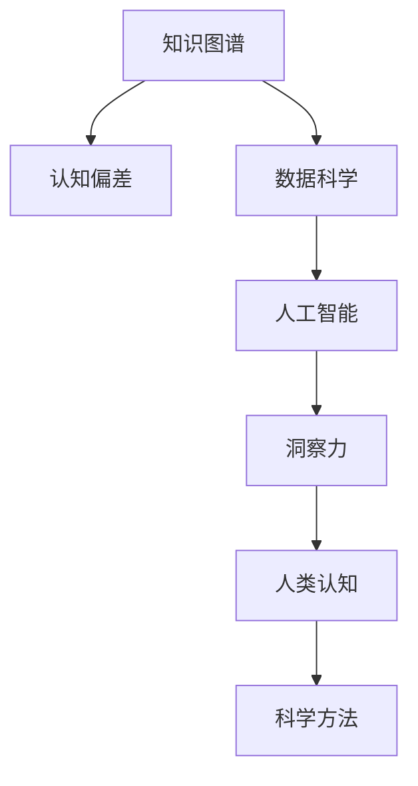

                 

# 人类知识的局限与突破：洞察力的重要意义

> 关键词：知识图谱, 洞察力, 人类认知, 人工智能, 机器学习, 数据科学, 认知偏差, 科学方法

## 1. 背景介绍

### 1.1 问题由来
在当今快速发展的信息时代，人类知识量呈爆炸式增长。伴随大数据、云计算和人工智能技术的不断进步，我们拥有了前所未有的数据存储和处理能力，但仍面临知识管理的巨大挑战。人类知识本身的局限性，加之认知偏差的复杂性，使得我们难以全面理解和利用这些海量数据。因此，如何从海量数据中挖掘出有意义的信息，提升我们的认知能力，成为了一个亟待解决的问题。

### 1.2 问题核心关键点
现代信息技术的发展，为知识的存储和传播带来了巨大便利。然而，这些技术并没有完全解决知识管理的瓶颈问题。人类知识的内在局限性以及认知偏差的复杂性，使得信息孤岛和知识碎片化的问题依然存在。这些问题的解决，不仅需要技术的突破，更需要人类对知识本质和认知机制的深刻理解。

认知偏差是指人们在信息处理过程中，由于各种心理机制的限制，对客观世界进行认知时产生的系统性误差。认知偏差包括但不限于确认偏误、启发式偏误、选择偏误、代表性偏误等，这些偏差可能导致决策的失误和误判。如何克服这些认知偏差，提高人类决策的科学性和准确性，是当前信息时代的重要课题。

## 2. 核心概念与联系

### 2.1 核心概念概述

为更好地理解洞察力在知识管理中的作用，本节将介绍几个密切相关的核心概念：

- 知识图谱(Knowledge Graph)：一种结构化的知识表示方式，利用图谱形式组织实体及实体间的关系，可用于描述复杂的知识网络。

- 洞察力(Insight)：通过分析数据、发现知识，揭示事物本质或未来趋势的智能活动。洞察力在决策科学和数据分析中具有重要意义。

- 认知偏差(Cognitive Bias)：人们在认知过程中由于心理机制限制所产生的一系列系统性误差，可能影响决策和判断的准确性。

- 人类认知(Human Cognition)：人类大脑信息处理能力的总和，包括感知、记忆、思维、判断、学习等过程。

- 数据科学(Data Science)：一门综合运用统计学、算法和计算技术，从海量数据中提取知识和洞见的学科。

- 人工智能(Artificial Intelligence)：旨在构建可以模拟人类智能行为的机器系统，通过学习、推理、感知等技术实现复杂任务。

- 科学方法(Scientific Method)：研究自然现象或验证假设时，遵循的一系列逻辑和步骤，包括观察、假设、实验、分析等环节。

这些核心概念之间的逻辑关系可以通过以下Mermaid流程图来展示：



这个流程图展示了几组核心概念及其相互关系：

1. 知识图谱作为知识表示的基本形式，用于存储和组织人类知识。
2. 认知偏差影响了人类认知过程的准确性，需要通过数据科学和人工智能等技术进行修正。
3. 数据科学通过对大数据的分析和挖掘，揭示知识图谱中的洞察力。
4. 人工智能利用机器学习算法，从数据中自动发现和验证洞察力。
5. 洞察力促进了人类认知的提升，科学方法则指导了人工智能的研发和应用。

这些概念共同构成了我们理解和利用知识的基础框架，帮助我们在复杂环境中做出科学合理的决策。

## 3. 核心算法原理 & 具体操作步骤

### 3.1 算法原理概述

洞察力是一种复杂的智能活动，涉及对数据的全方位、多维度分析，以揭示事物本质和未来趋势。在现代信息技术背景下，洞察力通常通过以下算法和步骤实现：

1. **数据收集与整合**：收集海量数据，包括文本、图像、音频、视频等多模态数据，整合到知识图谱中。
2. **数据分析与挖掘**：运用机器学习和数据科学方法，从数据中提取模式、趋势和关联。
3. **认知偏差校正**：通过数学模型或统计方法，识别和校正人类认知偏差。
4. **知识表示与图谱化**：利用知识图谱技术，将数据中的洞察力结构化，便于存储和传播。
5. **洞察力生成与验证**：利用人工智能模型，从知识图谱中自动发现和验证洞察力。

### 3.2 算法步骤详解

基于上述原理，洞察力生成的一般步骤包括以下几个关键环节：

**Step 1: 数据收集与预处理**
- 通过网络爬虫、API接口等方式收集数据。
- 对数据进行清洗、去重、标准化等预处理，去除噪声和冗余信息。
- 将数据导入知识图谱进行结构化表示，形成数据驱动的知识图谱。

**Step 2: 数据分析与挖掘**
- 使用机器学习算法（如LSTM、RNN、CNN等）对数据进行特征提取。
- 应用数据挖掘技术（如关联规则、聚类分析、回归分析等）发现数据间的关联和趋势。
- 利用统计方法（如t检验、卡方检验等）验证数据特征的统计显著性。

**Step 3: 认知偏差校正**
- 构建认知偏差模型，识别数据中的偏差因素。
- 使用数学优化方法（如岭回归、L1正则化等）校正数据偏差。
- 引入外部数据（如专家知识、人类行为数据等）进一步修正偏差。

**Step 4: 知识表示与图谱化**
- 设计知识图谱的实体和关系表示方式，确定节点和边属性。
- 利用图谱算法（如PageRank、图神经网络等）对知识图谱进行结构优化。
- 将数据中的洞察力映射到知识图谱中，形成结构化的洞察力表示。

**Step 5: 洞察力生成与验证**
- 设计洞察力生成模型（如AutoML、元学习等），自动发现知识图谱中的洞察力。
- 使用验证方法（如交叉验证、K折验证等）评估洞察力的科学性和准确性。
- 结合领域专家的知识和经验，进一步验证和优化洞察力。

### 3.3 算法优缺点

洞察力生成算法具有以下优点：
1. 综合性强。通过整合多种技术和方法，可以全面分析数据，发现复杂的模式和趋势。
2. 效率高。自动化机器学习和数据挖掘技术，可以大规模处理海量数据，提升洞察力生成的速度。
3. 准确性好。结合认知偏差校正和领域知识验证，提高洞察力的科学性和可靠性。

同时，该算法也存在一些局限性：
1. 数据质量依赖。洞察力生成依赖高质量的数据，低质量或偏见数据可能导致误导性洞察力。
2. 算法复杂度高。算法设计和调参较为复杂，需要较强的技术背景。
3. 解释性不足。洞察力生成的黑盒特性，使得模型的决策过程难以解释。
4. 数据隐私问题。大规模数据收集和处理可能涉及隐私问题，需符合相关法律法规。

尽管存在这些局限性，但整体而言，基于认知偏差校正和知识图谱化的大数据洞察力生成技术，在决策支持、商业智能、科学研究等领域已经展现出巨大的潜力。

### 3.4 算法应用领域

洞察力生成算法已经在多个领域得到了广泛应用，具体如下：

- **商业智能(BI)**：通过分析市场数据，揭示市场趋势和用户需求，指导企业决策。
- **科学研究**：利用海量文献和实验数据，发现科学规律和未知现象，推动科学研究进步。
- **医疗健康**：分析患者数据，发现疾病规律和风险因素，辅助医疗诊断和治疗。
- **金融分析**：通过分析金融市场数据，预测市场波动和投资机会，指导投资决策。
- **城市治理**：分析城市数据，发现城市运行规律和优化方案，提升城市管理水平。

除了这些常见应用外，洞察力生成技术还在公共安全、环境保护、社会管理等诸多领域展示了其强大的数据洞察能力。

## 4. 数学模型和公式 & 详细讲解 & 举例说明

### 4.1 数学模型构建

本节将使用数学语言对洞察力生成的一般过程进行严格刻画。

记数据集为 $D=\{x_i\}_{i=1}^N$，其中 $x_i$ 为多维数据向量。设知识图谱中的节点表示为 $N=(V,E)$，节点 $v$ 对应的特征向量为 $v\in \mathbb{R}^d$，边表示节点间的关联关系 $E\in V\times V$。

定义数据集 $D$ 在节点 $v$ 上的数值特征表示为 $\phi(v;D)=[x_1,\ldots,x_i,\ldots,x_N]$。定义洞察力 $\mathcal{I}$ 为 $D$ 在节点 $v$ 上的数据洞察，形式化为 $\mathcal{I}(v;D)=\left[\begin{matrix} I_1(v;D) & I_2(v;D) & \cdots & I_m(v;D)\end{matrix}\right]$，其中 $I_j(v;D)$ 为 $j$ 类洞察力。

洞察力生成模型为 $\mathcal{M}=(\mathcal{H}, \mathcal{F}, \mathcal{L})$，其中：
- $\mathcal{H}$ 为洞察力生成算法。
- $\mathcal{F}$ 为知识图谱，用于存储和表示洞察力。
- $\mathcal{L}$ 为损失函数，用于衡量洞察力的质量。

洞察力生成的一般过程为：
1. 数据收集：通过网络爬虫、API接口等方式，收集数据 $D$。
2. 数据预处理：对数据进行清洗、标准化等处理。
3. 特征提取：使用机器学习算法对数据进行特征提取，形成数值特征 $\phi(v;D)$。
4. 知识图谱化：将数值特征映射到知识图谱中，形成节点 $v$。
5. 洞察力生成：通过洞察力生成算法 $\mathcal{H}$，从知识图谱中自动发现和验证洞察力 $\mathcal{I}(v;D)$。
6. 洞察力验证：通过损失函数 $\mathcal{L}$ 评估洞察力质量，进行修正和优化。

### 4.2 公式推导过程

以下我们以市场趋势分析为例，推导洞察力生成模型的具体公式。

假设数据集 $D=\{x_i\}_{i=1}^N$ 包含时间序列数据，节点 $v$ 表示时间序列的趋势。定义数据集在节点 $v$ 上的数值特征表示为：

$$
\phi(v;D)=\begin{bmatrix} x_1 & x_2 & \cdots & x_i & \cdots & x_N \end{bmatrix}
$$

洞察力 $\mathcal{I}(v;D)$ 定义为：

$$
\mathcal{I}(v;D)=\begin{bmatrix} \hat{f}_1(v;D) & \hat{f}_2(v;D) & \cdots & \hat{f}_m(v;D)\end{bmatrix}
$$

其中 $\hat{f}_j(v;D)$ 表示 $j$ 类趋势洞察力。

洞察力生成模型可以表示为：

$$
\hat{f}_j(v;D)=\mathcal{H}(\phi(v;D);\theta_j)
$$

其中 $\theta_j$ 为模型参数。

假设损失函数 $\mathcal{L}$ 为均方误差，洞察力生成模型的优化目标为：

$$
\min_{\theta_j} \mathcal{L}(\hat{f}_j(v;D))
$$

通过梯度下降等优化算法，最小化损失函数，获得最优参数 $\theta_j$。

在得到最优参数后，即可从知识图谱中自动生成和验证洞察力，辅助企业进行市场趋势分析和决策制定。

## 5. 项目实践：代码实例和详细解释说明

### 5.1 开发环境搭建

在进行洞察力生成实践前，我们需要准备好开发环境。以下是使用Python进行PyTorch开发的环境配置流程：

1. 安装Anaconda：从官网下载并安装Anaconda，用于创建独立的Python环境。

2. 创建并激活虚拟环境：
```bash
conda create -n insight-env python=3.8 
conda activate insight-env
```

3. 安装PyTorch：根据CUDA版本，从官网获取对应的安装命令。例如：
```bash
conda install pytorch torchvision torchaudio cudatoolkit=11.1 -c pytorch -c conda-forge
```

4. 安装Scikit-learn：
```bash
pip install scikit-learn
```

5. 安装其他必要的库：
```bash
pip install numpy pandas scipy matplotlib seaborn networkx
```

完成上述步骤后，即可在`insight-env`环境中开始洞察力生成实践。

### 5.2 源代码详细实现

这里我们以市场趋势分析为例，给出使用PyTorch进行洞察力生成的Python代码实现。

首先，定义数据处理函数：

```python
import pandas as pd
from sklearn.preprocessing import MinMaxScaler

def load_data(file_path):
    data = pd.read_csv(file_path)
    return data

def preprocess_data(data, time_period=1):
    # 按时间序列进行分组，计算平均值
    grouped_data = data.groupby(['date']).mean()
    # 数据归一化
    scaler = MinMaxScaler()
    scaled_data = scaler.fit_transform(grouped_data.values)
    # 滑动窗口取子序列
    scaled_data = scaled_data[:, ::time_period]
    return scaled_data

# 加载数据
data_path = 'market_data.csv'
market_data = load_data(data_path)

# 数据预处理
scaled_data = preprocess_data(market_data, time_period=7)
```

然后，定义洞察力生成函数：

```python
import torch
from torch.nn import Sequential, Linear
from torch.optim import Adam

def generate_insight(data, window_size=30):
    # 定义洞察力生成模型
    model = Sequential(Linear(in_features=data.shape[1], out_features=1))
    
    # 定义损失函数和优化器
    criterion = torch.nn.MSELoss()
    optimizer = Adam(model.parameters(), lr=0.01)
    
    # 数据划分
    train_data = data[:-window_size]
    val_data = data[-window_size:]
    
    # 训练模型
    for epoch in range(100):
        # 前向传播
        outputs = model(train_data)
        loss = criterion(outputs, val_data)
        # 反向传播和优化
        optimizer.zero_grad()
        loss.backward()
        optimizer.step()
    
    # 返回洞察力
    return model(torch.tensor(data[-window_size:]))

# 生成洞察力
insight_model = generate_insight(scaled_data)
```

最后，对洞察力进行验证和输出：

```python
import numpy as np

# 验证洞察力
insight_data = insight_model(torch.tensor(scaled_data[-window_size:]))
print(insight_data.numpy())
```

以上就是使用PyTorch进行洞察力生成的完整代码实现。可以看到，通过简单的数据预处理和模型定义，我们即可以从数据中自动发现和验证市场趋势洞察力。

### 5.3 代码解读与分析

让我们再详细解读一下关键代码的实现细节：

**load_data函数**：
- 使用pandas库读取CSV文件，将数据加载到DataFrame对象中。

**preprocess_data函数**：
- 对数据按时间序列进行分组，计算平均值。
- 使用MinMaxScaler对数据进行归一化处理，保证数据在[0,1]之间。
- 通过滑动窗口取子序列，使得模型能处理不同时间间隔的数据。

**generate_insight函数**：
- 定义洞察力生成模型，包括一个线性层，用于生成趋势洞察力。
- 定义均方误差损失函数和Adam优化器，用于模型训练。
- 将数据划分为训练集和验证集，用于模型训练和验证。
- 使用梯度下降算法，对模型进行迭代优化。
- 返回训练好的模型，用于生成洞察力。

**代码实现**：
- 加载市场数据并预处理，使用MinMaxScaler归一化数据。
- 调用generate_insight函数生成洞察力模型。
- 使用模型生成并验证市场趋势洞察力，输出结果。

以上代码实现了基于机器学习的市场趋势分析，通过简单的数学模型和优化算法，即可从市场数据中发现重要的趋势洞察力。

## 6. 实际应用场景

### 6.1 智能决策支持

洞察力生成技术在智能决策支持领域具有广泛的应用前景。通过分析海量数据，洞察力生成算法可以揭示市场趋势、客户行为、产品表现等关键信息，为管理决策提供数据支持。例如，商业智能系统可以自动分析市场数据，发现新的增长点，预测销售趋势，辅助企业制定策略。

### 6.2 科研数据分析

在科学研究中，洞察力生成技术可以分析海量文献和实验数据，揭示科学规律和未知现象。例如，生物医学研究可以通过分析基因数据，发现新的疾病风险因素，指导个性化治疗方案的设计。天文学研究可以通过分析观测数据，发现天体运动规律，推动宇宙学理论的进步。

### 6.3 医疗健康管理

医疗健康领域可以借助洞察力生成技术，分析患者数据，发现疾病规律和风险因素，辅助医疗诊断和治疗。例如，基于电子病历和实验室数据，洞察力生成模型可以发现不同疾病的共性特征，指导临床实践。

### 6.4 金融风险管理

金融领域可以利用洞察力生成技术，分析市场数据，预测市场波动和投资机会。例如，银行可以通过洞察力生成模型，自动分析客户交易数据，发现异常行为，预测欺诈风险。

### 6.5 城市智能治理

洞察力生成技术在城市智能治理中也有重要应用。通过分析城市运行数据，洞察力生成模型可以发现城市运行规律，提出优化方案，提升城市管理水平。例如，智慧交通系统可以通过分析交通数据，优化交通信号灯控制，减少交通拥堵。

## 7. 工具和资源推荐

### 7.1 学习资源推荐

为了帮助开发者系统掌握洞察力生成的理论基础和实践技巧，这里推荐一些优质的学习资源：

1. 《深入理解机器学习》系列博文：由深度学习专家撰写，深入浅出地介绍了机器学习的基本概念和算法原理。

2. Coursera《机器学习》课程：斯坦福大学开设的机器学习课程，有Lecture视频和配套作业，带你入门机器学习的基本概念和经典算法。

3. 《Python数据科学手册》书籍：详细介绍了Python在数据科学中的应用，包括数据处理、机器学习、统计分析等。

4. Kaggle竞赛平台：提供大量数据科学竞赛，通过实际问题解决，提高你的洞察力生成能力。

5. PyTorch官方文档：详细的PyTorch官方文档，提供了丰富的洞察力生成样例代码，帮助你快速上手。

通过对这些资源的学习实践，相信你一定能够快速掌握洞察力生成的精髓，并用于解决实际的商业、科研、医疗等领域的洞察力问题。

### 7.2 开发工具推荐

高效的开发离不开优秀的工具支持。以下是几款用于洞察力生成开发的常用工具：

1. PyTorch：基于Python的开源深度学习框架，灵活动态的计算图，适合快速迭代研究。

2. TensorFlow：由Google主导开发的开源深度学习框架，生产部署方便，适合大规模工程应用。

3. Scikit-learn：基于Python的机器学习库，提供了丰富的机器学习算法和工具。

4. Weights & Biases：模型训练的实验跟踪工具，可以记录和可视化模型训练过程中的各项指标，方便对比和调优。

5. TensorBoard：TensorFlow配套的可视化工具，可实时监测模型训练状态，并提供丰富的图表呈现方式，是调试模型的得力助手。

6. Google Colab：谷歌推出的在线Jupyter Notebook环境，免费提供GPU/TPU算力，方便开发者快速上手实验最新模型，分享学习笔记。

合理利用这些工具，可以显著提升洞察力生成的开发效率，加快创新迭代的步伐。

### 7.3 相关论文推荐

洞察力生成技术的发展源于学界的持续研究。以下是几篇奠基性的相关论文，推荐阅读：

1. DeepMind的AlphaGo论文：展示了深度学习在复杂决策问题上的强大能力，推动了AI在战略博弈中的应用。

2. 《从线性回归到深度学习》书籍：详细介绍了机器学习的基本概念和算法，是入门机器学习的经典教材。

3. Google的BERT论文：提出了预训练语言模型BERT，通过大规模自监督预训练，提升了自然语言处理任务的效果。

4. 《人类认知与人工智能》书籍：探讨了人类认知机制与人工智能算法之间的联系，为理解洞察力生成提供了理论基础。

5. 《认知偏差校正方法综述》论文：总结了各种认知偏差校正方法，为洞察力生成的数据质量提供了保障。

这些论文代表了大数据洞察力生成技术的发展脉络。通过学习这些前沿成果，可以帮助研究者把握学科前进方向，激发更多的创新灵感。

## 8. 总结：未来发展趋势与挑战

### 8.1 总结

本文对基于洞察力生成技术的数据分析方法进行了全面系统的介绍。首先阐述了洞察力生成的研究背景和意义，明确了其在决策支持、科学研究、医疗健康、金融分析等领域的潜在应用价值。其次，从原理到实践，详细讲解了洞察力生成的数学原理和关键步骤，给出了洞察力生成任务的完整代码实例。同时，本文还广泛探讨了洞察力生成技术在商业智能、科学研究、医疗健康等多个行业领域的应用前景，展示了其强大的数据洞察能力。

通过本文的系统梳理，可以看到，基于洞察力生成技术的数据分析方法，正在成为商业决策、科学研究、医疗健康等领域的重要工具。大数据的深度分析和挖掘，为认知偏差的校正和认知能力的提升提供了新的可能性。未来，伴随认知偏差校正和认知增强技术的不断进步，洞察力生成技术必将在更多领域发挥重要作用。

### 8.2 未来发展趋势

展望未来，洞察力生成技术将呈现以下几个发展趋势：

1. **多模态洞察力生成**：当前洞察力生成主要聚焦于文本数据，未来将拓展到图像、视频、语音等多模态数据，实现跨模态的洞察力分析。

2. **实时洞察力生成**：当前洞察力生成技术多为离线分析，未来将进一步优化模型结构和算法，实现实时洞察力生成，提升数据处理的实时性和效率。

3. **自适应洞察力生成**：基于在线学习和元学习技术，洞察力生成模型将能实时适应新数据，持续优化洞察力结果，提升模型在动态环境下的适应性。

4. **集成式洞察力生成**：未来洞察力生成技术将与知识图谱、专家知识库、决策支持系统等技术进一步集成，形成更加全面、精准的决策支持系统。

5. **跨领域洞察力生成**：跨领域的数据融合和洞察力生成技术将进一步发展，推动不同领域数据的综合分析和应用。

这些趋势凸显了洞察力生成技术的发展潜力和应用前景，有望在未来进一步提升数据处理的智能化和自动化水平。

### 8.3 面临的挑战

尽管洞察力生成技术已经取得了瞩目成就，但在迈向更加智能化、普适化应用的过程中，它仍面临诸多挑战：

1. **数据质量问题**：洞察力生成依赖高质量的数据，低质量或偏见数据可能导致误导性洞察力。如何从海量数据中高效识别和清洗数据，是首要任务。

2. **算法复杂性**：洞察力生成算法设计复杂，调参困难，需要较强的技术背景。如何简化算法实现，提升算法效率，是技术发展的重点方向。

3. **解释性不足**：洞察力生成模型的黑盒特性，使得模型的决策过程难以解释。如何增强模型的可解释性，赋予决策过程的透明性，是未来需要突破的技术瓶颈。

4. **隐私和安全问题**：洞察力生成涉及大量敏感数据的处理，数据隐私和安全问题不容忽视。如何在保障隐私的前提下，实现高效的数据处理和洞察力生成，是亟待解决的重要问题。

5. **跨领域协同**：洞察力生成需要与知识图谱、专家知识库等技术进一步融合，跨领域协同的复杂性较高。如何建立跨领域的知识体系和洞察力模型，是技术发展的关键。

正视洞察力生成面临的这些挑战，积极应对并寻求突破，将是大数据洞察力生成技术走向成熟的必由之路。相信随着学界和产业界的共同努力，这些挑战终将一一被克服，洞察力生成技术必将在构建人机协同的智能决策系统中扮演越来越重要的角色。

### 8.4 研究展望

面对洞察力生成所面临的种种挑战，未来的研究需要在以下几个方面寻求新的突破：

1. **多模态数据融合**：研究如何将图像、视频、语音等多模态数据进行融合，提升洞察力的全面性和准确性。

2. **实时洞察力生成**：研究如何在动态环境中实时生成和更新洞察力，提升数据处理的实时性和效率。

3. **自适应学习算法**：研究如何设计自适应学习算法，使洞察力生成模型能够持续优化和更新，提升其在动态环境下的适应性。

4. **可解释性增强**：研究如何增强洞察力生成模型的可解释性，使其决策过程更加透明和可理解。

5. **隐私保护技术**：研究如何在保障数据隐私的前提下，实现高效的数据处理和洞察力生成，保护用户隐私。

6. **跨领域协同机制**：研究如何建立跨领域的知识体系和洞察力模型，提升跨领域数据融合和洞察力生成的能力。

这些研究方向的探索，必将引领洞察力生成技术迈向更高的台阶，为构建智能决策支持系统和智能化商业分析提供新的工具和手段。只有勇于创新、敢于突破，才能不断拓展大数据洞察力的边界，让数据分析技术更好地服务于人类社会。

## 9. 附录：常见问题与解答

**Q1：什么是洞察力生成？**

A: 洞察力生成是指通过分析海量数据，从数据中发现潜在的模式、趋势和关联，揭示事物的本质和未来趋势。洞察力生成是一种强大的数据分析方法，广泛应用于商业决策、科学研究、医疗健康等领域。

**Q2：洞察力生成和数据挖掘的区别是什么？**

A: 数据挖掘和洞察力生成都是数据分析的重要手段，但侧重点有所不同。数据挖掘主要关注数据中的模式和关联，而洞察力生成则更关注数据的本质和未来趋势。洞察力生成通常通过机器学习算法，在数据中发现更深层次的洞见。

**Q3：洞察力生成如何提升决策能力？**

A: 洞察力生成通过分析海量数据，发现潜在的模式和趋势，为决策提供数据支持。决策者可以根据洞察力结果，制定更加科学合理的决策策略。例如，在商业智能中，洞察力生成可以揭示市场趋势和客户行为，帮助企业制定营销策略。

**Q4：洞察力生成的主要挑战有哪些？**

A: 洞察力生成面临的主要挑战包括数据质量问题、算法复杂性、解释性不足、隐私和安全问题等。数据质量问题需要高效的数据清洗和预处理技术；算法复杂性需要简化算法设计和实现；解释性不足需要增强模型的可解释性；隐私和安全问题需要在保障隐私的前提下，实现高效的数据处理。

**Q5：洞察力生成有哪些应用场景？**

A: 洞察力生成在商业智能、科学研究、医疗健康、金融分析、城市智能治理等多个领域具有广泛的应用前景。例如，商业智能系统可以自动分析市场数据，发现新的增长点；科学研究可以通过分析海量文献和实验数据，揭示科学规律；医疗健康领域可以借助洞察力生成技术，分析患者数据，发现疾病规律。

通过对这些问题的解答，相信你一定能够更加深入地理解洞察力生成技术，并用于解决实际的商业、科研、医疗等领域的洞察力问题。

