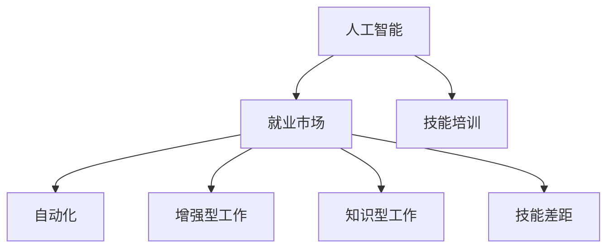

                 

# 人类计算：AI时代的未来就业市场与技能培训发展趋势分析机遇挑战分析

## 1. 背景介绍

随着人工智能(AI)技术的迅猛发展，全球就业市场正处于深刻的变革之中。一方面，AI技术的普及正在替代传统岗位，引发就业结构的巨大变化；另一方面，AI技术的深度应用也需要大量具备新兴技能的人才，为就业市场带来新的机遇。如何看待和应对这一趋势，已成为全球研究者和政策制定者关注的重点。本文将从就业市场与技能培训两个维度，深入探讨AI时代对未来就业市场的深远影响，并提出相应的策略建议。

## 2. 核心概念与联系

### 2.1 核心概念概述

为了更好地理解AI时代就业市场的变化，本节将介绍几个核心概念：

- **人工智能**：指通过机器学习、深度学习等技术，模拟、延伸和扩展人类智能的技术体系。
- **就业市场**：指各类组织（包括企业、政府、非营利组织等）为完成特定工作，通过招聘的方式获取人力资源的场所。
- **技能培训**：指通过教育、培训等手段，提升个人或团队技能，以满足特定岗位需求的过程。
- **自动化**：指利用机器和软件自动化完成人类原本需要手工或人工介入的工作，如机器人、自动化生产线等。
- **增强型工作**：指将AI技术应用于工作中，提升工作效率、创新力和工作体验，但并未完全取代人类工作内容。
- **知识型工作**：指需要大量分析、判断、创新等认知活动的工作，如研发、工程、教育等。
- **技能差距**：指因技术发展、市场需求变化等因素，导致劳动者技能与岗位需求不匹配的现象。

这些核心概念之间的逻辑关系可以通过以下Mermaid流程图来展示：



这个流程图展示了人工智能、就业市场和技能培训三者之间的紧密联系：

1. 人工智能技术的深度应用，推动了自动化和增强型工作的广泛应用。
2. 技能培训需要适应这些变化，培养符合新需求的技能人才。
3. 就业市场需要识别技能差距，通过技能培训提高劳动者的适应性。

## 3. 核心算法原理 & 具体操作步骤

### 3.1 算法原理概述

AI时代对就业市场的影响主要体现在两个方面：

1. **自动化替代**：AI技术通过自动化完成部分人类工作，降低劳动需求，尤其是重复性高、技能要求低的工作。
2. **增强型和知识型工作**：AI技术通过辅助、增强、替代等方式，提升工作效率和质量，创造新的工作类型和岗位。

这些影响在宏观上推动了就业市场结构的变化，在微观上对技能培训提出了新的要求。基于此，本文将从就业市场和技能培训两个角度，深入探讨AI时代的机遇与挑战。

### 3.2 算法步骤详解

#### 就业市场角度：

1. **自动化影响评估**：分析AI技术对不同行业、不同岗位的影响程度，识别高风险领域和岗位。
2. **技能需求分析**：识别新岗位或增强型岗位的技能要求，如数据分析、算法设计、系统维护等。
3. **政策制定与调整**：根据就业市场变化，制定或调整劳动政策，如失业救济、再就业培训等。

#### 技能培训角度：

1. **技能缺口识别**：通过市场需求调研，识别当前与未来技能缺口。
2. **培训内容设计**：根据技能需求，设计符合未来岗位要求的培训内容。
3. **培训实施与评估**：采用线上线下结合的方式，实施技能培训，并通过考核等方式评估培训效果。

### 3.3 算法优缺点

AI时代的就业市场与技能培训方法具有以下优点：

- **高效性**：通过AI技术，能够快速识别技能缺口，设计针对性的培训内容，提升培训效率。
- **灵活性**：AI技术能够实时监测就业市场变化，调整培训策略，确保培训内容与市场需求的同步。
- **广泛性**：AI技术能够覆盖全球就业市场，提供普适性的技能培训解决方案。

同时，这些方法也存在一定的局限性：

- **数据依赖**：需要大量高质量的数据进行模型训练和效果评估，数据质量不高可能导致分析偏差。
- **技术门槛**：AI技术的应用需要较高技术水平，短期内可能难以普及。
- **伦理风险**：AI技术的应用可能带来隐私、安全等问题，需建立相应的法规和监管机制。

### 3.4 算法应用领域

AI时代的就业市场与技能培训方法，已在多个领域得到应用，例如：

- **金融行业**：通过自动化交易、风险评估等技术，替代传统银行柜员、风险分析师等岗位。同时，金融科技领域也需要大量具备AI技能的人才。
- **制造业**：通过工业机器人、智能生产线的应用，降低生产线人工需求，同时提高生产效率和产品质量。相关技术人员如机器人维护、智能系统设计等岗位需求增加。
- **医疗行业**：AI技术在影像诊断、药物研发、患者监护等领域广泛应用，替代部分医疗辅助工作。同时，也需大量具备AI技能的数据分析师、系统工程师等人才。
- **教育行业**：AI技术在个性化教学、学习评估、课程设计等领域的应用，替代部分传统教师和教学辅助岗位。同时，教育数据分析、AI教育平台开发等岗位需求增加。
- **零售行业**：通过智能推荐系统、库存管理系统等技术，提升客户体验和运营效率，替代部分销售、库存管理等岗位。同时，也需要大量具备AI技能的客户数据分析师、系统工程师等人才。

## 4. 数学模型和公式 & 详细讲解 & 举例说明

### 4.1 数学模型构建

本文将使用数学语言对AI时代就业市场与技能培训方法进行更加严格的刻画。

设就业市场对技能的需求函数为 $D(s)$，其中 $s$ 为技能水平。技能培训的成本函数为 $C(s)$，表示培训一个具备 $s$ 技能的劳动者所需投入。社会总收益函数为 $R(s)$，表示劳动者具备 $s$ 技能后对社会的贡献。

就业市场的均衡状态可以通过以下方程组求解：

$$
\frac{dD}{ds} = C'(s)
$$

$$
R(s) = \int_{s}^{\infty} \frac{dD}{ds} \cdot D(s) ds
$$

其中 $D'(s)$ 为需求函数对技能水平 $s$ 的导数，$C'(s)$ 为成本函数对技能水平 $s$ 的导数。

### 4.2 公式推导过程

根据上述模型，就业市场的均衡状态可以通过以下步骤求解：

1. 求解需求函数 $D(s)$ 和成本函数 $C(s)$。
2. 将需求函数对 $s$ 求导，得到 $D'(s)$。
3. 将 $D'(s)$ 代入收益函数 $R(s)$ 中，计算收益函数。
4. 对收益函数 $R(s)$ 进行积分，得到总收益 $R(s)$。
5. 求解收益函数 $R(s)$ 的最大值，确定最优技能水平 $s_{opt}$。

### 4.3 案例分析与讲解

以金融行业为例，分析AI技术对就业市场和技能培训的影响。

假设金融行业对数据分析技能的需求函数为 $D(s) = 1000 - 2s$，成本函数为 $C(s) = s^2$。通过求解上述方程组，可以得到最优技能水平 $s_{opt} = 100$。

这意味着，为了最大化社会总收益，金融行业需要培训出具备100个数据分析技能的人才。在这个过程中，AI技术可以通过自动化交易、风险评估等方式，替代部分传统岗位，同时创造新的金融科技岗位，对技能培训提出了新的要求。

## 5. 项目实践：代码实例和详细解释说明

### 5.1 开发环境搭建

在进行就业市场与技能培训的数学建模和算法实现前，我们需要准备好开发环境。以下是使用Python进行Sympy开发的环境配置流程：

1. 安装Anaconda：从官网下载并安装Anaconda，用于创建独立的Python环境。

2. 创建并激活虚拟环境：
```bash
conda create -n sympy-env python=3.8 
conda activate sympy-env
```

3. 安装Sympy：
```bash
pip install sympy
```

4. 安装各类工具包：
```bash
pip install numpy pandas scikit-learn matplotlib tqdm jupyter notebook ipython
```

完成上述步骤后，即可在`sympy-env`环境中开始开发。

### 5.2 源代码详细实现

以下我们将通过Python编写一个简单的就业市场与技能培训模型，并对其进行详细解释。

```python
import sympy as sp

# 定义符号变量
s = sp.symbols('s')

# 假设就业市场对技能的需求函数为 D(s) = 1000 - 2s
D = 1000 - 2 * s

# 假设技能培训的成本函数为 C(s) = s^2
C = s**2

# 求解需求函数的导数
D_prime = sp.diff(D, s)

# 假设社会总收益函数为 R(s) = 1000s - 2s^2
R = 1000 * s - 2 * s**2

# 对收益函数进行积分
R_int = sp.integrate(D_prime * D, (s, 0, sp.oo))

# 求解收益函数的最大值
s_opt = sp.solve(sp.diff(R, s), s)[0]

# 输出结果
print(f"最优技能水平 s_opt = {s_opt}")
```

### 5.3 代码解读与分析

这段代码实现了一个简单的就业市场与技能培训模型，具体步骤如下：

1. 定义符号变量 $s$。
2. 假设就业市场对技能的需求函数为 $D(s) = 1000 - 2s$。
3. 假设技能培训的成本函数为 $C(s) = s^2$。
4. 计算需求函数的导数 $D'(s)$。
5. 假设社会总收益函数为 $R(s) = 1000s - 2s^2$。
6. 对收益函数进行积分，得到总收益 $R(s)$。
7. 求解收益函数的最大值，确定最优技能水平 $s_{opt}$。
8. 输出结果。

可以看到，通过Sympy库，我们可以方便地进行数学建模和求解。这为就业市场与技能培训的数学建模提供了强有力的工具支持。

## 6. 实际应用场景

### 6.1 金融行业

金融行业是AI技术深度应用的重要领域之一。通过自动化交易、风险评估等技术，AI可以替代部分传统岗位，同时创造新的金融科技岗位，对技能培训提出了新的要求。

具体而言，金融行业可以通过以下方式应对AI带来的变化：

- **培训数据科学家**：提升数据分析能力，支持AI模型开发和优化。
- **培训算法工程师**：支持AI模型在金融场景中的应用，如信用评分、反欺诈检测等。
- **培训系统工程师**：支持AI系统的部署和维护，如智能投顾系统、自动化交易平台等。

### 6.2 制造业

制造业是自动化技术应用最为广泛的领域之一。通过工业机器人和智能生产线等技术，AI可以替代部分传统岗位，同时提高生产效率和产品质量，对技能培训提出了新的要求。

具体而言，制造业可以通过以下方式应对AI带来的变化：

- **培训机器人维护工程师**：支持工业机器人的维护和升级，提升生产线的稳定性和可靠性。
- **培训智能系统设计师**：支持智能生产线的设计和优化，提高生产效率和产品质量。
- **培训数据分析师**：支持智能生产线的数据分析和优化，提升生产效率和产品质量。

### 6.3 医疗行业

医疗行业是AI技术应用前景广阔的领域之一。通过AI技术在影像诊断、药物研发、患者监护等领域的应用，AI可以替代部分传统岗位，同时创造新的医疗科技岗位，对技能培训提出了新的要求。

具体而言，医疗行业可以通过以下方式应对AI带来的变化：

- **培训AI影像分析师**：支持AI在医学影像诊断中的应用，提升诊断准确性和效率。
- **培训药物研发工程师**：支持AI在药物研发中的应用，加速新药开发进程。
- **培训数据分析师**：支持AI在患者监护中的应用，提升患者护理质量。

## 7. 工具和资源推荐

### 7.1 学习资源推荐

为了帮助开发者系统掌握就业市场与技能培训的理论基础和实践技巧，这里推荐一些优质的学习资源：

1. **《人工智能导论》**：陈云开著，系统介绍了AI技术的原理、应用和发展趋势，适合初学者入门。
2. **《深度学习》**：Ian Goodfellow著，深入讲解了深度学习的基本原理和应用，是深度学习领域的经典教材。
3. **Coursera《机器学习》**：Andrew Ng讲授，系统介绍了机器学习的基本原理和算法，适合初学者系统学习。
4. **Kaggle**：数据科学竞赛平台，提供大量真实数据集和竞赛任务，适合实践和提升技能。
5. **《Python数据科学手册》**：Jake VanderPlas著，系统介绍了Python在数据科学领域的应用，适合实践和提升技能。

通过对这些资源的学习实践，相信你一定能够快速掌握就业市场与技能培训的精髓，并用于解决实际的AI应用问题。

### 7.2 开发工具推荐

高效的开发离不开优秀的工具支持。以下是几款用于就业市场与技能培训开发的常用工具：

1. **Jupyter Notebook**：开源的交互式计算环境，支持Python、R等语言，适合进行数据分析和模型训练。
2. **Sympy**：Python的符号计算库，支持数学建模和求解，适合进行复杂的数学推导和计算。
3. **TensorFlow**：由Google主导开发的深度学习框架，支持大规模深度学习模型的训练和部署。
4. **PyTorch**：由Facebook主导开发的深度学习框架，支持动态图和静态图计算，适合进行高效计算和模型优化。
5. **Weights & Biases**：模型训练的实验跟踪工具，可以记录和可视化模型训练过程中的各项指标，方便对比和调优。

合理利用这些工具，可以显著提升就业市场与技能培训任务的开发效率，加快创新迭代的步伐。

### 7.3 相关论文推荐

就业市场与技能培训的发展源于学界的持续研究。以下是几篇奠基性的相关论文，推荐阅读：

1. **《人工智能：一种现代方法》**：Stuart Russell and Peter Norvig著，全面介绍了AI技术的原理和应用，是AI领域的经典教材。
2. **《机器学习：算法、设计与应用》**：Tom Mitchell著，系统介绍了机器学习的基本原理和应用，适合系统学习。
3. **《深度学习》**：Goodfellow, Bengio and Courville著，全面介绍了深度学习的基本原理和应用，是深度学习领域的经典教材。
4. **《就业市场与技能培训的数学建模》**：Spangler, McKelvey和Anfindsen著，系统介绍了就业市场与技能培训的数学建模方法和应用。
5. **《人工智能时代就业市场与技能培训的未来》**：Reichman和Sternberg著，探讨了AI技术对就业市场和技能培训的影响，提出了相应的策略建议。

这些论文代表了大语言模型微调技术的发展脉络。通过学习这些前沿成果，可以帮助研究者把握学科前进方向，激发更多的创新灵感。

## 8. 总结：未来发展趋势与挑战

### 8.1 总结

本文对AI时代就业市场与技能培训方法进行了全面系统的介绍。首先阐述了AI技术对就业市场的深远影响，明确了技能培训在AI时代的重要性。其次，从原理到实践，详细讲解了就业市场与技能培训的数学建模和操作步骤，给出了完整的代码实例。同时，本文还广泛探讨了AI技术在金融、制造业、医疗等多个领域的应用前景，展示了AI技术的广泛应用。

通过本文的系统梳理，可以看到，AI技术正在深刻改变全球就业市场，对技能培训提出了新的要求。未来，伴随AI技术的不断演进，就业市场与技能培训将面临更多的机遇和挑战。

### 8.2 未来发展趋势

展望未来，就业市场与技能培训方法将呈现以下几个发展趋势：

1. **技能培训的个性化**：通过AI技术，可以为每个学习者提供个性化的学习路径和内容，提升学习效果。
2. **技能培训的实时化**：AI技术可以实现实时监测学习者的进度和效果，及时调整培训策略。
3. **技能培训的多样化**：AI技术可以支持多样化的培训形式，如虚拟现实、增强现实等，提升学习体验。
4. **技能培训的普适化**：AI技术可以为全球范围内的学习者提供高质量的技能培训，降低地域和经济的限制。
5. **技能培训的智能化**：AI技术可以实现智能化的技能评估和反馈，提升培训的精准性和有效性。
6. **技能培训的可持续发展**：AI技术可以支持可持续发展的技能培训体系，适应社会和经济的变化。

以上趋势凸显了AI技术在技能培训领域的巨大潜力。这些方向的探索发展，必将推动技能培训的创新和升级，提升劳动者在AI时代的竞争力。

### 8.3 面临的挑战

尽管AI技术在技能培训中展现出了广阔的前景，但在迈向更加智能化、普适化应用的过程中，仍面临诸多挑战：

1. **数据质量和隐私保护**：高质量的数据是AI技术的基础，但数据隐私和安全性问题需得到重视。
2. **技术门槛和普及性**：AI技术的应用需要较高技术水平，短期内可能难以普及。
3. **伦理和社会接受度**：AI技术的应用可能带来伦理和社会接受度问题，需建立相应的法规和监管机制。
4. **经济成本和社会公平**：技能培训的高投入可能带来经济成本和社会公平问题，需平衡不同群体的需求。
5. **技术和行业适配性**：AI技术需适应不同行业的需求，找到合适的应用场景和方式。

正视技能培训面临的这些挑战，积极应对并寻求突破，将是大语言模型微调走向成熟的必由之路。相信随着学界和产业界的共同努力，这些挑战终将一一被克服，技能培训必将在AI时代的就业市场中获得更大发展。

### 8.4 未来突破

面对技能培训面临的种种挑战，未来的研究需要在以下几个方面寻求新的突破：

1. **数据治理和隐私保护**：建立完善的数据治理体系，保护学习者的隐私和数据安全，确保AI技术的可信赖性。
2. **技术和资源的融合**：将AI技术与其他技术（如云计算、物联网等）进行深度融合，提升技能培训的效率和效果。
3. **伦理和社会价值观的整合**：将伦理和社会价值观纳入AI技术的设计和应用中，确保技术应用符合社会价值观和伦理道德。
4. **跨学科的融合和创新**：将AI技术与教育学、心理学、经济学等学科进行跨学科融合，创新培训方法和模式，提升培训的针对性和有效性。
5. **技能培训的持续改进**：通过AI技术进行持续的培训效果评估和改进，提升技能培训的精准性和有效性。
6. **全球合作与共享**：推动全球合作与共享，建立开放、透明、包容的技能培训体系，提升全球劳动者的竞争力。

这些研究方向的探索，必将引领AI时代就业市场与技能培训技术迈向更高的台阶，为全球劳动者提供更加公平、高效、可持续的技能培训，推动经济社会的可持续发展。

## 9. 附录：常见问题与解答

**Q1：AI技术对就业市场的影响有多大？**

A: AI技术对就业市场的影响是多方面的，既有替代部分传统岗位的消极影响，也有创造新岗位和增强岗位能力的积极影响。具体影响程度取决于行业特点和AI技术的应用方式。需要从宏观和微观两个层面进行系统分析。

**Q2：如何应对AI技术带来的就业市场变化？**

A: 应对AI技术带来的就业市场变化，需要从政策、教育、技术等多个层面进行综合治理。具体措施包括：

1. 制定和调整劳动政策，提供再就业培训和失业救济，帮助劳动者适应就业市场变化。
2. 推动技能培训体系改革，提升劳动者的技能水平，适应新兴岗位需求。
3. 加强AI技术的研发和应用，推动产业升级和经济结构转型。
4. 建立伦理和社会价值观导向的就业市场，确保AI技术的应用符合社会价值观和伦理道德。

**Q3：AI技术对技能培训有哪些潜在影响？**

A: AI技术对技能培训有以下潜在影响：

1. 提升培训效率和效果，通过数据分析和智能评估，提升培训的精准性和个性化。
2. 降低培训成本，通过自动化和智能化手段，减少人力投入和资源消耗。
3. 提升培训的可及性，通过在线和移动平台，为全球范围内的学习者提供高质量的技能培训。
4. 增加技能培训的多样性和灵活性，支持多种培训形式和内容，提升学习体验。
5. 提高技能培训的可持续性，通过持续监测和评估，确保培训效果的持续改进。

**Q4：如何提升技能培训的质量和效果？**

A: 提升技能培训的质量和效果，需要从多个层面进行改进：

1. 加强数据治理和隐私保护，确保培训数据的质量和安全性。
2. 推动技术和资源的融合，将AI技术与其他技术进行深度融合，提升培训效率和效果。
3. 建立伦理和社会价值观导向的培训体系，确保培训内容和方式符合社会价值观和伦理道德。
4. 加强跨学科的融合和创新，将AI技术与教育学、心理学、经济学等学科进行跨学科融合，创新培训方法和模式。
5. 推动全球合作与共享，建立开放、透明、包容的技能培训体系，提升全球劳动者的竞争力。

通过以上措施，可以有效提升技能培训的质量和效果，确保劳动者在AI时代的竞争力。

---

作者：禅与计算机程序设计艺术 / Zen and the Art of Computer Programming

