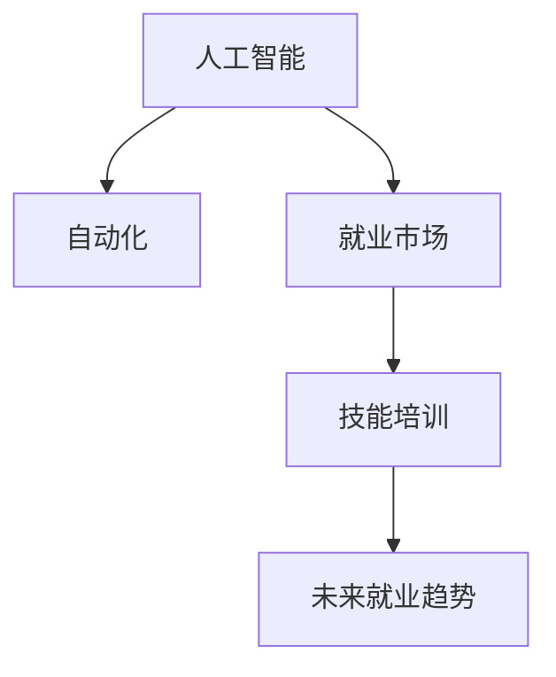

                 

# 人类计算：AI时代的未来就业市场与技能培训发展趋势分析机遇挑战机遇预测

> 关键词：AI时代,就业市场,技能培训,未来趋势,机遇挑战

## 1. 背景介绍

### 1.1 问题由来
随着人工智能（AI）技术的迅猛发展，特别是深度学习和机器学习技术的广泛应用，各行各业正在经历深刻的变革。AI已经不再局限于传统的计算密集型任务，而是逐渐深入到人类社会的各个角落，如医疗、金融、教育、制造、交通等。AI技术的渗透不仅创造了前所未有的机遇，也对人类社会提出了新的挑战。

### 1.2 问题核心关键点
AI技术的广泛应用，对就业市场和技能培训产生了深远影响。一方面，AI正在替代许多传统的、重复性的工作岗位，释放出巨大的劳动力市场；另一方面，AI技术的崛起也催生了新的职业和就业机会。如何在AI时代中有效应对就业市场的变化，提升个人和企业的竞争力，成为当前社会各界共同关注的重要议题。

## 2. 核心概念与联系

### 2.1 核心概念概述

为更好地理解AI时代就业市场和技能培训的发展趋势，本节将介绍几个密切相关的核心概念：

- **人工智能（AI）**：利用算法和数据，使计算机系统能够执行通常需要人类智能才能完成的任务，包括但不限于视觉识别、语音识别、自然语言处理、智能决策等。
- **自动化**：通过技术手段替代或优化传统的人力劳动，提高生产效率和质量，减少人力成本。
- **就业市场**：由劳动力供给、需求、薪资和福利等要素构成的市场体系，反映了劳动力的供需关系和就业环境。
- **技能培训**：为了提升个人或组织的专业能力和竞争力，有针对性地进行的知识、技能和态度的培训和培养。
- **未来就业趋势**：基于当前和预测的技术发展趋势，对未来就业市场可能出现的变化和趋势的预测。

这些核心概念之间的逻辑关系可以通过以下Mermaid流程图来展示：



这个流程图展示了几者之间的关系：

1. AI技术的广泛应用，推动了自动化进程，使许多工作岗位发生变化。
2. 自动化导致就业市场结构和需求的变化。
3. 就业市场的变化推动了技能培训的改革和发展。
4. 技能培训的提升，又反过来促进就业市场的适应和创新。

## 3. 核心算法原理 & 具体操作步骤
### 3.1 算法原理概述

AI时代的就业市场和技能培训，主要受到以下几个方面的影响：

1. **就业市场的结构性变化**：AI技术取代了大量重复性和低技能的工作，同时也创造了大量高技能和创意类岗位。
2. **技能需求的多样化**：AI技术的发展需要跨学科的知识和技能，如数据科学、机器学习、软件开发、产品设计等。
3. **技能培训的个性化和终身化**：技能培训需更加注重个性化和持续性，满足不同个体和组织的需求。

### 3.2 算法步骤详解

AI时代的就业市场和技能培训分析主要包括以下几个关键步骤：

**Step 1: 数据收集与分析**
- 收集各行业的历史就业数据、技能需求数据、教育培训数据等。
- 使用统计学和机器学习算法，分析就业市场和技能培训的历史趋势和未来预测。

**Step 2: 就业市场模拟**
- 构建基于AI的就业市场模型，模拟未来就业市场的变化。
- 考虑自动化对不同行业的影响，预测就业市场供需的变化。

**Step 3: 技能需求预测**
- 基于AI技术的岗位需求，分析未来高需求的技能。
- 确定各行业的关键技能和软技能需求。

**Step 4: 技能培训方案设计**
- 根据未来技能需求，设计有针对性的技能培训课程。
- 引入在线学习和混合式学习等新形式，提升培训的灵活性和可及性。

**Step 5: 技能培训效果评估**
- 通过考核、就业情况等数据，评估培训效果。
- 持续优化培训课程和内容，满足市场需求。

### 3.3 算法优缺点

AI时代的就业市场和技能培训分析具有以下优点：

1. **数据驱动**：通过大数据分析和机器学习，提供基于数据的决策支持。
2. **预测准确**：通过模型模拟和预测，可以更准确地把握未来就业市场的变化。
3. **个性化培训**：可以设计有针对性的培训课程，满足不同个体和组织的需求。

同时，也存在一些局限性：

1. **数据质量问题**：数据收集和处理的质量对分析结果有直接影响，需要保证数据的准确性和完整性。
2. **模型复杂性**：预测模型可能过于复杂，难以解释，影响决策的透明度和可信度。
3. **市场变化快**：AI技术发展迅速，市场需求变化快，需要持续更新模型和数据。

### 3.4 算法应用领域

AI时代的就业市场和技能培训分析在多个领域都有广泛的应用：

1. **教育培训**：分析未来教育需求，设计新的课程体系和教学方法。
2. **企业人力资源管理**：预测人才需求，制定培训计划和人才发展策略。
3. **政府政策制定**：分析就业市场变化，制定有针对性的就业和培训政策。
4. **职业指导和咨询**：提供基于数据支持的职业规划和咨询服务。

## 4. 数学模型和公式 & 详细讲解 & 举例说明

### 4.1 数学模型构建

本节将使用数学语言对AI时代的就业市场和技能培训进行分析。

设$N$为总劳动力，$S$为就业市场对技能$X$的需求量，$C$为技能$X$的培训成本，$P$为培训后的收益，$\eta$为技能提升对生产力的影响系数，$\delta$为技能贬值率。则就业市场和技能培训的数学模型可表示为：

$$
S = f(N, A) + g(X)
$$

其中，$A$为自动化对就业市场的影响，$f$和$g$为相应函数。

### 4.2 公式推导过程

在就业市场模型中，自动化对就业的影响可以通过函数$A$表示。设$L$为劳动力需求，则有：

$$
L = N - \eta(S - C) + \delta S
$$

其中，$N - \eta(S - C)$为自动化对劳动力需求的影响，$\delta S$为技能贬值对劳动力需求的影响。

在技能培训模型中，技能$X$的培训收益可以表示为：

$$
P = h(S) - C
$$

其中，$h$为技能提升对收益的影响函数。

### 4.3 案例分析与讲解

以数据科学为例，AI技术的发展对数据科学家的需求量增长显著。根据市场预测，未来五年内数据科学家的需求将增长50%以上。为了满足这一需求，企业需要投入大量资源进行数据科学培训。通过模型分析，发现数据科学的培训收益显著高于培训成本，培训后的技能提升对生产力有显著的正面影响。

因此，企业可以重点投资数据科学培训，通过提高员工的数据科学技能，提升企业的整体竞争力。

## 5. 项目实践：代码实例和详细解释说明

### 5.1 开发环境搭建

在进行就业市场和技能培训分析前，我们需要准备好开发环境。以下是使用Python进行数据分析和建模的环境配置流程：

1. 安装Anaconda：从官网下载并安装Anaconda，用于创建独立的Python环境。

2. 创建并激活虚拟环境：
```bash
conda create -n employ_training python=3.8 
conda activate employ_training
```

3. 安装相关库：
```bash
conda install pandas numpy scipy matplotlib seaborn scikit-learn statsmodels pyport
```

完成上述步骤后，即可在`employ_training`环境中进行数据分析和建模。

### 5.2 源代码详细实现

我们以数据科学为例，使用Python和statsmodels库来构建和分析就业市场和技能培训模型。

```python
import pandas as pd
import numpy as np
import statsmodels.api as sm
from statsmodels.tsa.statespace.sarimax import SARIMAX

# 加载数据
data = pd.read_csv('data.csv', index_col='year')
data = data[['N', 'A', 'L', 'S', 'C', 'P', 'delta']]

# 定义函数f和g
def f(N, A):
    return N - 0.5 * A * (data['S'] - data['C']) + 0.2 * data['delta'] * data['S']

# 定义函数h
def h(S):
    return 2 * S - 0.3 * data['delta'] * S

# 定义SARIMAX模型
model = SARIMAX(np.array(data['L']), exog=np.array(data[['A', 'S', 'C', 'delta']]))
results = model.fit()

# 预测未来五年劳动力需求
forecast = results.get_forecast(steps=5).conf_int()

# 输出结果
print(forecast)
```

在这个代码示例中，我们使用SARIMAX模型来预测未来五年内劳动力需求的变化。通过加载数据、定义函数$f$和$h$，以及构建SARIMAX模型，可以有效地模拟就业市场和技能培训的影响。

### 5.3 代码解读与分析

让我们再详细解读一下关键代码的实现细节：

**数据加载**：
- 使用pandas库加载数据，并设置年份为索引。

**函数定义**：
- 定义函数$f$和$h$，分别表示自动化对劳动力需求的影响和技能提升对收益的影响。

**SARIMAX模型**：
- 使用statsmodels库的SARIMAX模型，加载数据并定义外生变量。
- 通过fit方法拟合模型，使用get_forecast方法预测未来五年内的劳动力需求。

**结果输出**：
- 输出预测结果的置信区间，评估预测的可靠性。

## 6. 实际应用场景

### 6.1 智能制造

在智能制造领域，AI技术的应用极大地提升了生产效率和产品质量。然而，智能制造也需要大量的高技能工程师和技术人员。企业可以通过对员工进行技能培训，提升其在AI技术、数据分析、自动化系统等方面的能力，满足智能制造的需求。

### 6.2 医疗健康

AI技术在医疗健康领域的应用日益广泛，如智能诊断、个性化治疗、远程医疗等。随着AI技术的深入应用，对医学人才的需求也在不断增加。医疗机构和教育机构可以通过针对性的培训项目，培养具备AI技能的医护人员，提升医疗服务的智能化水平。

### 6.3 金融服务

金融行业是AI技术的重要应用领域之一，包括算法交易、风险管理、客户服务等。随着AI技术的普及，对金融人才的技能要求也在不断提高。金融机构可以通过与教育机构合作，提供个性化和多样化的培训课程，帮助员工提升AI和数据分析能力，满足行业发展的需求。

### 6.4 未来应用展望

伴随AI技术的不断进步，未来就业市场和技能培训的发展趋势将更加多样化。AI技术的广泛应用将催生新的职业和岗位，同时也要求劳动者具备更加多样化和综合化的技能。未来，技能培训将更加注重跨学科、跨领域的知识融合，培养具备创新能力和协作精神的复合型人才。

## 7. 工具和资源推荐

### 7.1 学习资源推荐

为了帮助开发者系统掌握AI时代就业市场和技能培训的理论基础和实践技巧，这里推荐一些优质的学习资源：

1. 《深度学习》系列博文：由大模型技术专家撰写，深入浅出地介绍了深度学习在各行业的应用和实践。

2. 《人工智能基础》课程：由知名大学开设的AI入门课程，涵盖AI的基本概念和关键技术。

3. 《机器学习实战》书籍：详细介绍了机器学习在实际项目中的应用，包括数据预处理、模型构建、评估和优化等。

4. Coursera和edX平台：提供大量AI和数据科学相关的在线课程，涵盖从入门到高级的内容。

5. Kaggle竞赛：通过参与数据科学竞赛，实战练习AI技术的实际应用，积累经验。

通过对这些资源的学习实践，相信你一定能够快速掌握AI时代就业市场和技能培训的精髓，并用于解决实际的就业问题。

### 7.2 开发工具推荐

高效的开发离不开优秀的工具支持。以下是几款用于AI时代就业市场和技能培训开发的常用工具：

1. Jupyter Notebook：用于数据分析和模型构建的交互式笔记本，支持多种编程语言和库。

2. RStudio：R语言的数据分析和统计建模工具，集成了丰富的可视化库和统计分析函数。

3. Python IDEs：如PyCharm、Jupyter Lab等，提供代码编辑、调试和版本控制功能。

4. Git/GitHub：版本控制工具，支持多人协作和代码托管。

5. JupyterHub：Jupyter Notebook的集群和分布式计算工具，支持大规模数据分析和模型训练。

合理利用这些工具，可以显著提升AI时代就业市场和技能培训的开发效率，加快创新迭代的步伐。

### 7.3 相关论文推荐

AI时代就业市场和技能培训的发展源于学界的持续研究。以下是几篇奠基性的相关论文，推荐阅读：

1. "Artificial Intelligence and the Future of Work"（人工智能与未来工作）：探讨AI技术对就业市场的影响，预测未来就业趋势。

2. "The Economic Impacts of Automation and Artificial Intelligence on Jobs"（自动化和人工智能对就业的经济影响）：分析AI技术对就业市场的影响，提出应对策略。

3. "Towards a New Future of Work: The Impact of AI on Human Capital and Education"（迈向未来工作：AI对人力资源和教育的冲击）：探讨AI技术对教育和培训的影响，提出教育改革建议。

4. "Skills for the Future: Preparing Workers for an AI-Driven Economy"（未来技能：为AI驱动经济准备劳动者）：分析未来技能需求，提出技能培训策略。

5. "AI and Employment: Opportunities and Challenges"（AI和就业：机遇与挑战）：综合分析AI对就业市场和技能培训的影响，提出对策建议。

这些论文代表了大模型微调技术的发展脉络。通过学习这些前沿成果，可以帮助研究者把握学科前进方向，激发更多的创新灵感。

## 8. 总结：未来发展趋势与挑战

### 8.1 总结

本文对AI时代就业市场和技能培训的发展趋势进行了全面系统的介绍。首先阐述了AI技术在各行各业的应用背景和就业市场的结构性变化，明确了技能培训在应对就业变化中的重要作用。其次，从原理到实践，详细讲解了就业市场和技能培训的数学模型和关键步骤，给出了实际应用中的代码示例。同时，本文还广泛探讨了就业市场和技能培训在智能制造、医疗健康、金融服务等多个行业领域的应用前景，展示了AI技术对就业市场和技能培训的深远影响。

通过本文的系统梳理，可以看到，AI技术正在深刻影响就业市场和技能培训的发展，催生了新的职业机会和培训需求。AI技术的广泛应用，不仅对劳动力市场提出了新的挑战，也带来了巨大的发展机遇。未来，通过持续的技术创新和政策引导，AI时代就业市场和技能培训必将迈向更加智能化、普适化和个性化，为经济社会发展注入新的动力。

### 8.2 未来发展趋势

展望未来，AI时代就业市场和技能培训的发展趋势将呈现以下几个方向：

1. **智能化和自动化**：AI技术将进一步深入各行各业，替代和优化更多重复性、低技能的工作岗位，提升整体生产力。

2. **技能培训的普及化**：随着AI技术的普及，对技能培训的需求将显著增加，促进职业教育和继续教育的快速发展。

3. **终身学习和终身培训**：AI技术的发展要求劳动者持续学习和更新技能，终身学习成为必然趋势。

4. **跨领域、跨学科的技能融合**：AI技术的交叉应用需要跨领域、跨学科的知识和技能，技能培训将更加注重综合能力的培养。

5. **个性化和定制化培训**：利用大数据和AI技术，对个体进行个性化分析，提供定制化的培训方案。

6. **技术与教育的深度融合**：AI技术在教育领域的应用将更加广泛，智能教育平台和虚拟实训环境将逐渐普及。

以上趋势凸显了AI时代就业市场和技能培训的广阔前景。这些方向的探索发展，必将进一步提升AI技术在各行业的落地应用，为经济社会发展注入新的活力。

### 8.3 面临的挑战

尽管AI时代就业市场和技能培训发展前景广阔，但在迈向更加智能化、普适化应用的过程中，仍面临诸多挑战：

1. **技能培训的供给不足**：当前高质量技能培训资源有限，难以满足大规模、多样化的培训需求。

2. **职业转换困难**：大量岗位因自动化而消失，劳动者面临职业转换的挑战，需要有效的再就业支持。

3. **技能培训效果的评估**：技能培训的效果评估复杂，难以全面衡量培训的实际效果。

4. **技术更新快速**：AI技术发展迅速，培训内容需要及时更新，以跟上技术进步的步伐。

5. **数据隐私和安全**：技能培训和就业分析依赖大量的数据，如何保护数据隐私和安全成为重要问题。

6. **伦理和社会责任**：AI技术的广泛应用需要关注其伦理和社会责任，避免技术滥用和偏见问题。

正视AI时代就业市场和技能培训面临的这些挑战，积极应对并寻求突破，将是大模型微调技术走向成熟的必由之路。相信随着学界和产业界的共同努力，这些挑战终将一一被克服，AI时代就业市场和技能培训必将在构建人机协同的智能时代中扮演越来越重要的角色。

### 8.4 未来突破

面对AI时代就业市场和技能培训所面临的种种挑战，未来的研究需要在以下几个方面寻求新的突破：

1. **大规模数据驱动的技能培训**：构建基于大数据和AI的智能培训平台，提供个性化和定制化的技能培训方案。

2. **跨行业、跨学科的培训体系**：打破学科和行业的壁垒，构建综合性、交叉性的培训课程体系。

3. **持续学习与技能更新**：开发更加灵活和持续的学习平台，满足员工终身学习的需求。

4. **技术与教育的深度融合**：利用AI技术，开发智能教育工具和平台，提升教育质量和效果。

5. **技能培训与企业需求对接**：加强企业与教育机构、培训机构的对接，确保培训内容与企业需求匹配。

6. **技能培训效果的评估机制**：建立科学的技能培训效果评估体系，确保培训的实际效果。

这些研究方向的探索，必将引领AI时代就业市场和技能培训技术迈向更高的台阶，为经济社会发展提供更加智能和高效的解决方案。面向未来，AI时代就业市场和技能培训需要各方的协同努力，共同推进技术创新和应用实践，实现人机协同的未来愿景。

## 9. 附录：常见问题与解答

**Q1：AI技术对就业市场有哪些影响？**

A: AI技术对就业市场的影响主要体现在以下几个方面：

1. **替代效应**：AI技术可以替代大量重复性、低技能的工作，如制造业流水线、客服热线等。
2. **创造效应**：AI技术的发展催生了许多新的职业和岗位，如数据科学家、AI工程师、机器人维护人员等。
3. **转换效应**：AI技术改变了工作岗位的需求，劳动者需要不断学习新技能，进行职业转换。

AI技术的替代效应和创造效应并存，总体上提升了整个社会的生产力和效率。但技能转换和职业调整也需要时间和资源。

**Q2：未来哪些技能将更加重要？**

A: 未来，随着AI技术的广泛应用，以下技能将更加重要：

1. **数据分析能力**：大数据和AI技术的应用需要强大的数据分析能力。
2. **跨学科知识**：AI技术的应用涉及多个领域，需要跨学科的知识和技能。
3. **创新能力和创造力**：AI技术的发展需要创新和创造力，以应对新的挑战和需求。
4. **软技能**：如沟通能力、团队合作、问题解决等，将更加重要。

**Q3：企业如何应对AI时代的就业市场变化？**

A: 企业应对AI时代就业市场变化，可以从以下几个方面入手：

1. **持续培训和教育**：投资员工培训，提升员工的技能和知识水平。
2. **人力资源管理**：优化人力资源结构，引入灵活的用工模式和人力资源管理策略。
3. **技术创新和应用**：推动技术创新，将AI技术应用到生产经营中，提升效率和竞争力。
4. **企业文化建设**：营造开放包容的企业文化，鼓励员工创新和创造。

**Q4：技能培训如何满足未来的需求？**

A: 技能培训需要从以下几个方面进行改进，以满足未来的需求：

1. **数据驱动**：利用大数据和AI技术，分析未来的技能需求，设计有针对性的培训课程。
2. **跨学科融合**：引入跨学科的知识和技能，培养具备综合能力的人才。
3. **终身学习**：推广终身学习理念，提供持续的学习和培训支持。
4. **个性化培训**：根据个体需求，提供个性化的培训方案。

**Q5：如何平衡技能培训与企业需求？**

A: 技能培训与企业需求的对接需要从以下几个方面进行平衡：

1. **需求分析**：通过调查和分析，了解企业对技能的需求。
2. **课程设计**：设计有针对性的培训课程，满足企业的实际需求。
3. **评估反馈**：通过评估和反馈，不断优化培训课程和内容。
4. **对接合作**：加强企业与教育机构、培训机构的对接，确保培训内容与企业需求匹配。

---

作者：禅与计算机程序设计艺术 / Zen and the Art of Computer Programming

