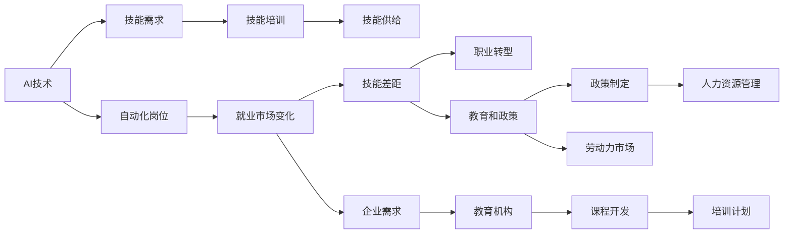

                 

# 人类计算：AI时代的未来就业市场与技能培训发展趋势预测分析机遇

## 1. 背景介绍

### 1.1 问题由来

随着人工智能(AI)技术的快速发展，机器自动化正在改变各个行业的运作方式。从制造业的自动化生产线，到金融业的智能投顾，再到零售业的智能推荐系统，AI正以不可阻挡之势渗透进各个行业。根据多项研究，未来十年内，AI技术将取代数以百万计的岗位。而另一方面，AI的崛起也将创造新的就业机会，带来巨大的技能需求，从而推动劳动力市场的重塑。

### 1.2 问题核心关键点

AI技术的广泛应用不仅会取代某些岗位，也将带来对新技能的需求。因此，理解AI时代就业市场的变化，预测技能培训的发展趋势，对于劳动力市场的平稳过渡至关重要。本文章将聚焦于AI时代的就业市场变化，探讨技能培训的发展趋势，并为从业者、教育工作者和政策制定者提供有益的见解和建议。

### 1.3 问题研究意义

了解AI时代就业市场与技能培训的发展趋势，对于以下几方面的研究和实践具有重要意义：

1. **就业市场适应**：帮助政策制定者设计有效的政策，促进劳动力市场的平稳过渡。
2. **教育培训创新**：指导教育机构开发和调整课程，培养AI时代所需的技能。
3. **企业人力资源管理**：协助企业进行人才储备和职业发展规划，应对AI变革。
4. **个人职业发展**：帮助从业者掌握未来市场需求，进行职业规划和技能提升。

本文将详细分析AI时代的就业市场变化，预测技能培训的发展趋势，并探讨AI与人类计算的结合点，以及未来的发展机遇。

## 2. 核心概念与联系

### 2.1 核心概念概述

1. **人工智能(AI)**：涵盖机器学习、深度学习、自然语言处理等技术的总称，旨在模拟人类智能。
2. **人类计算(Human Computation)**：利用人类智能解决问题，尤其是在大数据和复杂决策领域。
3. **就业市场**：指劳动力的供给与需求之间的动态关系，受技术进步、经济环境、政策等因素的影响。
4. **技能培训**：通过教育和训练，使劳动者掌握特定技能，适应劳动力市场的变化。
5. **未来就业**：指在技术、经济和社会变化的驱动下，劳动力市场将如何演变，哪些技能将会被需求。

这些核心概念之间存在紧密的联系，AI的兴起对就业市场带来深远影响，而技能培训则是应对这些变化的重要手段。

### 2.2 核心概念原理和架构的 Mermaid 流程图(Mermaid 流程节点中不要有括号、逗号等特殊字符)



## 3. 核心算法原理 & 具体操作步骤

### 3.1 算法原理概述

AI时代就业市场的预测，基于对当前就业市场数据、技术发展趋势、以及相关政策环境的分析。通过对这些因素的综合考量，预测未来就业市场的变化，并进一步指导技能培训的发展。

### 3.2 算法步骤详解

1. **数据收集**：收集各行业就业数据、技术发展报告、政策文件等。
2. **模型构建**：建立就业市场预测模型，通常采用时间序列分析、回归模型等。
3. **趋势分析**：通过模型预测就业市场的变化趋势，分析岗位的增减变化。
4. **技能映射**：将预测的就业市场变化与现有技能需求进行映射，识别关键技能。
5. **技能培训计划**：根据关键技能的预测需求，设计相应的培训计划，调整教育体系。

### 3.3 算法优缺点

**优点**：
- **预测准确性**：通过综合数据和模型，提高就业市场预测的准确性。
- **导向性明确**：为政策制定和教育培训提供明确的指导。
- **灵活性**：能够根据技术变化和市场需求进行调整。

**缺点**：
- **数据偏差**：数据收集和处理过程中可能存在偏差，影响预测结果。
- **模型复杂性**：复杂的预测模型可能需要较高的计算资源。
- **不可预测性**：AI和新技术的发展难以完全预测。

### 3.4 算法应用领域

AI时代的就业市场预测与技能培训规划，覆盖了以下几个主要领域：

1. **制造业**：自动化和机器人技术将取代部分岗位，同时创造新的维护、编程、系统集成等岗位。
2. **金融业**：智能投顾和算法交易将取代部分分析、交易岗位，同时增加数据分析、模型优化等新需求。
3. **零售业**：智能推荐系统和客户关系管理将取代部分客服、库存管理岗位，同时增加数据分析、系统集成等新需求。
4. **医疗业**：AI辅助诊断和医疗数据分析将取代部分医生、数据分析岗位，同时增加模型开发、数据清洗等新需求。
5. **教育业**：教育技术的发展将改变教学模式，增加AI教学、数据分析等新需求。

## 4. 数学模型和公式 & 详细讲解 & 举例说明

### 4.1 数学模型构建

本节将介绍一个简单的线性回归模型，用于预测就业市场的变化。

设 $Y_t$ 为第 $t$ 年的就业量，$X_t$ 为影响就业量的因素，包括技术进步、政策变化、经济增长等。假设它们之间存在线性关系，即：

$$ Y_t = \beta_0 + \beta_1 X_{t1} + \beta_2 X_{t2} + ... + \beta_k X_{tk} + \epsilon_t $$

其中，$\beta_0$ 为截距，$\beta_i$ 为系数，$X_{ti}$ 为第 $i$ 个影响因素，$\epsilon_t$ 为误差项。

### 4.2 公式推导过程

给定历史数据 $(Y_{t-1}, X_{t-1}), (Y_{t}, X_{t}), ..., (Y_{t+1}, X_{t+1})$，通过最小二乘法求解 $\beta_i$：

$$ \hat{\beta}_i = \frac{X_{ti} Y_t - \sum_{t=1}^{N} X_{ti} Y_t}{X_{ti}^2 - \sum_{t=1}^{N} X_{ti}^2} $$

### 4.3 案例分析与讲解

以制造业为例，我们可以收集过去十年的就业数据和相关影响因素数据，使用上述模型进行预测。例如，假设某制造行业的就业量 $Y_t$ 受到技术进步 $X_{t1}$、经济增长 $X_{t2}$、政策支持 $X_{t3}$ 的影响，通过模型预测，得到未来五年内的就业变化趋势。

## 5. 项目实践：代码实例和详细解释说明

### 5.1 开发环境搭建

要进行就业市场预测和技能培训规划的实践，需要先搭建开发环境。以下是基于Python和Pandas的搭建流程：

1. 安装Anaconda：
```bash
conda install anaconda
```

2. 创建虚拟环境：
```bash
conda create --name job_market python=3.8
conda activate job_market
```

3. 安装依赖包：
```bash
conda install pandas numpy statsmodels matplotlib seaborn
```

4. 导入数据集：
```python
import pandas as pd
data = pd.read_csv('job_market.csv')
```

### 5.2 源代码详细实现

下面是一个简单的Python代码实现，用于进行线性回归模型的构建和就业市场预测。

```python
import pandas as pd
from statsmodels.regression.linear_model import OLS
from statsmodels.tools.eval_measures import rmse

# 导入数据集
data = pd.read_csv('job_market.csv')

# 选择影响因素和就业量
X = data[['技术进步', '经济增长', '政策支持']]
Y = data['就业量']

# 建立线性回归模型
model = OLS(Y, X).fit()

# 预测未来五年内的就业量
forecast = model.forecast(horisons=5)

# 输出预测结果
print(forecast)
```

### 5.3 代码解读与分析

**数据处理**：使用Pandas加载数据集，选择相关的影响因素和就业量。

**模型构建**：使用statsmodels库中的OLS函数，建立线性回归模型。

**预测输出**：使用模型的forecast方法，预测未来五年内的就业量，并输出预测结果。

## 6. 实际应用场景

### 6.1 智能制造

AI技术在制造业中的应用，将导致部分岗位的消失，如生产线上的重复性工作，但同时也会创造新的岗位，如机器人维护、自动化系统集成等。因此，技能培训应重点关注机器人技术、自动化编程、数据分析等新兴技能。

### 6.2 智能金融

金融业的自动化和智能化，将导致部分分析、交易岗位的减少，但同时增加对数据分析、算法优化、风险管理等新技能的需求。因此，技能培训应重点关注数据科学、机器学习、金融工程等。

### 6.3 智能零售

零售业的智能化将改变传统的销售模式，增加对数据分析、客户关系管理、智能推荐等新技能的需求。因此，技能培训应重点关注数据科学、AI算法、用户体验设计等。

### 6.4 智能医疗

AI在医疗领域的运用，将改变医生的工作方式，增加对数据分析、模型开发、医疗影像分析等新技能的需求。因此，技能培训应重点关注医疗数据处理、AI医疗应用、医学统计等。

### 6.5 未来应用展望

未来，AI技术将进一步渗透进更多领域，带来更广泛的就业市场变化和技能需求。AI与人类计算的结合，将创造更多创新的应用场景，如智能城市管理、智能交通、智能教育等。

## 7. 工具和资源推荐

### 7.1 学习资源推荐

1. **机器学习在线课程**：如Coursera的《机器学习》课程，深入讲解机器学习算法和实践。
2. **数据科学书籍**：如《数据科学导论》，系统介绍数据科学基础知识和技能。
3. **技能培训平台**：如Coursera、edX等，提供丰富的在线课程和认证项目。
4. **行业报告**：如Gartner的《技术趋势报告》，提供行业最新的技术趋势和技能需求。

### 7.2 开发工具推荐

1. **Python开发环境**：如Jupyter Notebook，方便数据处理和模型开发。
2. **数据可视化工具**：如Matplotlib、Seaborn，可视化数据和预测结果。
3. **统计分析工具**：如R语言，提供强大的统计分析和数据可视化功能。
4. **机器学习库**：如Scikit-Learn，提供丰富的机器学习算法和工具。

### 7.3 相关论文推荐

1. **《未来就业市场：AI与人类工作的转变》**：探讨AI技术对就业市场的影响和未来趋势。
2. **《技能培训：适应AI时代的变革》**：分析技能培训的发展方向和具体措施。
3. **《人类计算与AI的协同作用》**：讨论AI与人类计算的结合点及其应用前景。

## 8. 总结：未来发展趋势与挑战

### 8.1 研究成果总结

AI时代的就业市场和技能培训，面临巨大的变革和挑战。预测未来趋势，需要综合考虑技术发展、经济环境、政策变化等因素。AI技术的应用将改变现有的就业结构，同时创造新的就业机会，并对劳动力市场产生深远影响。

### 8.2 未来发展趋势

1. **技术不断进步**：AI技术将继续快速迭代，带来更多的应用场景和技能需求。
2. **技能培训重要性增加**：随着技能需求的不断变化，技能培训将变得愈加重要。
3. **跨领域技能需求上升**：未来技能培训将更加注重跨领域的融合和应用。
4. **终身学习成为常态**：AI技术的发展将推动终身学习的普及。

### 8.3 面临的挑战

1. **数据质量问题**：数据偏差和噪声会影响模型预测的准确性。
2. **技术更新速度快**：AI技术的快速变化要求技能培训及时更新。
3. **资源限制**：教育资源的不均衡可能限制技能培训的普及。
4. **伦理和安全问题**：AI技术的伦理和安全问题也需要被关注。

### 8.4 研究展望

1. **大数据分析**：利用大数据分析技术，提高就业市场预测的准确性。
2. **个性化培训**：根据个人技能水平和学习需求，提供个性化的技能培训方案。
3. **跨学科合作**：加强AI与人类计算的跨学科合作，推动技术创新。
4. **政策支持**：制定有效的政策，支持技能培训和劳动力市场的平稳过渡。

## 9. 附录：常见问题与解答

**Q1: 什么是人类计算?**

A: 人类计算指的是利用人类智能解决复杂问题，尤其是在数据量大、决策复杂的情况下。在AI时代，人类计算成为机器智能的有力补充，帮助解决机器难以处理的复杂任务。

**Q2: AI技术如何影响就业市场?**

A: AI技术的应用将导致部分岗位的消失，但同时创造新的岗位。AI技术主要影响那些重复性高、自动化程度高的岗位，如生产线上的重复性工作，但也会增加对数据分析、系统集成、AI算法开发等新技能的需求。

**Q3: 技能培训的未来趋势是什么?**

A: 未来技能培训将更加注重跨领域的融合、终身学习、个性化培训和政策支持。技能培训需要适应技术的变化，提供及时更新的课程内容，满足不同个体的学习需求。

**Q4: 如何应对AI技术带来的就业挑战?**

A: 应对AI技术带来的就业挑战，需要政府、企业和教育机构的共同努力。政府应制定有效的政策，促进劳动力市场的平稳过渡；企业应加强人力资源管理，进行人才储备和职业发展规划；教育机构应调整课程，培养AI时代所需的技能。

**Q5: AI与人类计算的结合点有哪些?**

A: AI与人类计算的结合点主要集中在数据分析、复杂决策、创新应用等领域。AI擅长处理大规模数据和复杂任务，而人类计算擅长解决需要人类智慧的问题。两者结合，可以充分发挥各自的优势，提升整体的解决问题的能力。

