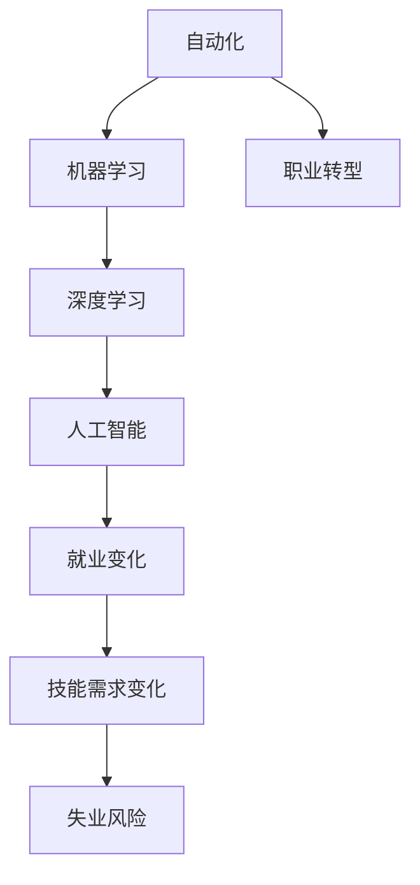

                 

# 人类计算：AI时代的未来就业趋势与技能发展

在AI迅猛发展的当下，我们正步入一个前所未有的技术变革时代。尽管AI技术在许多领域展现出强大的潜力和应用前景，但同时也引发了人们对于未来就业市场、技能发展方向及个人职业发展的深刻思考。本文旨在深入探讨AI时代对就业的影响、就业趋势、所需技能，以及如何有效应对这些变化，为未来的职业发展提供方向和建议。

## 1. 背景介绍

### 1.1 问题由来

随着人工智能(AI)技术的飞速发展，自动化、智能化水平显著提升。AI在诸如医疗诊断、金融分析、智能制造等领域的应用，已经展现出超越人类极限的能力。然而，在享受技术带来的便利的同时，我们也不得不面对一个严峻的现实：许多传统工作正在被AI所取代。自动化、机器学习、深度学习等技术的应用，已经开始对某些行业造成冲击，影响了数以百万计的工作岗位。

### 1.2 问题核心关键点

AI时代下的就业变化主要集中在以下几个方面：
1. **自动化与失业风险**：自动化技术导致某些传统岗位被取代，尤其是重复性、可编程性强的工作。
2. **技能需求变化**：AI技术的发展使得对数据分析、机器学习、编程等高技能需求增加，对基础岗位需求减少。
3. **职业转型**：许多传统职业需转型以适应新技术，需不断学习新技能以保持竞争力。

## 2. 核心概念与联系

### 2.1 核心概念概述

要全面理解AI时代的就业趋势，需要了解以下核心概念：

- **人工智能(AI)**：一种模拟人类智能行为的计算机科学分支，涵盖机器学习、深度学习、自然语言处理等技术。
- **自动化**：通过计算机程序自动执行重复性、规则化任务，提高工作效率。
- **机器学习(ML)**：一种基于数据的算法，使计算机具备自主学习、预测和决策能力。
- **深度学习(DL)**：一种特殊类型的机器学习，通过多层次神经网络进行模式识别和数据处理。
- **职业转型**：随着技术的发展，许多传统职业需转型升级，掌握新技能以适应市场需求。

这些概念之间存在着密切联系，共同构成了AI时代就业变化的基础。自动化与机器学习提升了效率，深度学习提供了智能化解决方案，而职业转型则是适应这些技术变革的必然趋势。

### 2.2 核心概念原理和架构的 Mermaid 流程图



此图展示了自动化、机器学习、深度学习、职业转型和就业变化之间的逻辑关系。自动化和机器学习是提高工作效率的基础，深度学习则进一步提升了智能化水平。职业转型是应对技术变革的必要措施，而就业变化则是这些技术变革带来的直接结果，包括技能需求的变化和失业风险的增加。

## 3. 核心算法原理 & 具体操作步骤

### 3.1 算法原理概述

AI时代的就业变化，主要源于自动化和机器学习技术的广泛应用。机器学习通过算法训练数据，使计算机具备自主学习、预测和决策能力。这些算法包括但不限于回归分析、决策树、神经网络等。

### 3.2 算法步骤详解

机器学习的一般步骤包括：
1. **数据准备**：收集、整理、清洗数据，准备模型训练。
2. **模型选择**：选择适当的机器学习算法，如回归、分类、聚类等。
3. **模型训练**：使用历史数据对模型进行训练，调整算法参数，使模型能够泛化新数据。
4. **模型评估**：通过测试集评估模型性能，确保模型在实际应用中表现稳定。
5. **模型部署**：将训练好的模型应用到实际生产环境中，进行实时预测和决策。

### 3.3 算法优缺点

**优点**：
- 自动化程度高，提高工作效率。
- 可处理大规模数据，提供准确预测和决策。
- 能够持续学习，提升模型性能。

**缺点**：
- 需要高质量数据，数据收集和清洗难度大。
- 算法复杂，需要专业知识和技能。
- 模型依赖于数据质量，错误数据可能导致错误决策。

### 3.4 算法应用领域

机器学习广泛应用于金融、医疗、制造、零售、物流等多个领域，例如：

- **金融领域**：信用评分、欺诈检测、投资组合优化等。
- **医疗领域**：疾病诊断、治疗方案推荐、基因分析等。
- **制造领域**：预测设备故障、质量控制、生产调度优化等。
- **零售领域**：需求预测、库存管理、推荐系统等。
- **物流领域**：路径规划、配送调度、异常检测等。

## 4. 数学模型和公式 & 详细讲解 & 举例说明

### 4.1 数学模型构建

以回归模型为例，其数学模型为：

$$
y = \theta_0 + \sum_{i=1}^n \theta_i x_i + \epsilon
$$

其中 $y$ 为输出变量，$\theta_0$ 为截距项，$\theta_i$ 为第 $i$ 个特征的系数，$x_i$ 为第 $i$ 个特征，$\epsilon$ 为误差项。

### 4.2 公式推导过程

回归模型的最小二乘法求解过程如下：

1. 最小化误差平方和 $SSE = \sum_{i=1}^N (y_i - \hat{y}_i)^2$，其中 $\hat{y}_i = \theta_0 + \sum_{j=1}^n \theta_j x_{ij}$。
2. 求偏导数，得到 $\frac{\partial SSE}{\partial \theta_j} = -2\sum_{i=1}^N (y_i - \hat{y}_i)x_{ij}$。
3. 解方程组 $\frac{\partial SSE}{\partial \theta_j} = 0$，求得 $\theta_j = \frac{\sum_{i=1}^N x_{ij}(y_i - \bar{y})}{\sum_{i=1}^N x_{ij}^2 - \sum_{i=1}^N x_{ij}^2}$。
4. 求解截距项 $\theta_0 = \bar{y} - \sum_{j=1}^n \theta_j \bar{x}_j$。

其中 $\bar{y} = \frac{1}{N}\sum_{i=1}^N y_i$，$\bar{x}_j = \frac{1}{N}\sum_{i=1}^N x_{ij}$。

### 4.3 案例分析与讲解

以金融领域为例，信用评分模型可以基于历史贷款数据训练，预测新客户的信用风险。模型通过学习历史数据中的特征与信用风险之间的关系，对新客户进行风险评估。

## 5. 项目实践：代码实例和详细解释说明

### 5.1 开发环境搭建

**环境配置**：

1. **安装Python**：从官网下载并安装Python 3.x版本。
2. **安装Pandas**：用于数据处理，安装命令为 `pip install pandas`。
3. **安装NumPy**：用于数值计算，安装命令为 `pip install numpy`。
4. **安装Scikit-learn**：用于机器学习，安装命令为 `pip install scikit-learn`。
5. **安装Matplotlib**：用于数据可视化，安装命令为 `pip install matplotlib`。

### 5.2 源代码详细实现

**代码实现**：

```python
import pandas as pd
import numpy as np
from sklearn.linear_model import LinearRegression
import matplotlib.pyplot as plt

# 加载数据
data = pd.read_csv('credit_data.csv')

# 数据预处理
X = data.drop('credit', axis=1)
y = data['credit']

# 标准化数据
from sklearn.preprocessing import StandardScaler
scaler = StandardScaler()
X = scaler.fit_transform(X)

# 训练模型
model = LinearRegression()
model.fit(X, y)

# 预测新数据
new_data = pd.read_csv('new_credit_data.csv')
new_X = scaler.transform(new_data.drop('credit', axis=1))
predictions = model.predict(new_X)

# 可视化结果
plt.scatter(new_data['income'], predictions)
plt.xlabel('Income')
plt.ylabel('Credit Score')
plt.show()
```

**代码解读**：

- **数据加载**：使用Pandas加载信用数据集。
- **数据预处理**：将特征数据和目标变量分开，并使用标准化方法对数据进行归一化处理。
- **模型训练**：使用线性回归模型对数据进行训练。
- **预测新数据**：对新数据进行标准化处理，并使用训练好的模型进行预测。
- **可视化结果**：将预测结果绘制成散点图，展示模型的预测效果。

### 5.3 代码解读与分析

**代码分析**：

- **数据加载和预处理**：数据集的处理是机器学习模型的第一步，包括数据清洗、特征选择、数据归一化等步骤。
- **模型训练**：模型训练过程包括模型选择、数据划分、模型拟合等步骤。
- **预测新数据**：模型训练完成后，使用模型对新数据进行预测。
- **结果可视化**：通过可视化工具展示模型预测结果，便于理解模型的性能。

## 6. 实际应用场景

### 6.1 智能制造

AI技术在智能制造中的应用，包括预测设备故障、优化生产调度等。通过机器学习模型分析设备运行数据，可以预测设备故障，提前进行维护，减少停机时间。此外，AI还可以优化生产调度，提高生产效率，降低生产成本。

### 6.2 智能交通

在智能交通领域，AI技术可以用于交通流量预测、路径规划、交通信号优化等。通过分析历史交通数据，AI可以预测未来交通流量，优化交通信号，提升交通系统的整体效率。

### 6.3 智能医疗

AI在医疗领域的应用包括疾病诊断、治疗方案推荐等。机器学习模型可以根据患者的历史病历和检测结果，提供疾病诊断和治疗方案推荐，提高诊疗准确性，缩短诊疗时间。

### 6.4 未来应用展望

未来，AI技术将继续深入各个领域，带来更多创新应用。例如：

- **自动驾驶**：AI技术可以用于自动驾驶汽车，提升行驶安全性和效率。
- **个性化推荐系统**：AI可以用于电商、媒体等领域，提供个性化推荐服务，提升用户体验。
- **智能家居**：AI可以用于智能家居系统，提供更智能、便捷的家居服务。
- **智慧城市**：AI可以用于城市管理、公共安全等领域，提升城市治理能力。

## 7. 工具和资源推荐

### 7.1 学习资源推荐

1. **Coursera**：提供大量人工智能相关的课程，涵盖机器学习、深度学习、自然语言处理等方向。
2. **Udacity**：提供基于项目的学习方式，深入理解AI技术的实际应用。
3. **Kaggle**：提供数据科学竞赛平台，通过实际竞赛提升技能。
4. **GitHub**：开源代码仓库，查阅和分享AI项目，了解最新技术动态。

### 7.2 开发工具推荐

1. **Jupyter Notebook**：基于浏览器的编程环境，适合进行数据探索和模型训练。
2. **TensorFlow**：开源深度学习框架，支持分布式计算和模型部署。
3. **PyTorch**：开源深度学习框架，提供灵活的动态计算图，易于使用和调试。
4. **Keras**：高层次深度学习API，提供简洁的API接口，适合快速原型开发。
5. **Scikit-learn**：开源机器学习库，提供各种机器学习算法和工具。

### 7.3 相关论文推荐

1. **《机器学习：原理、算法与应用》**：周志华著，系统介绍了机器学习的基本原理和算法。
2. **《深度学习》**：Ian Goodfellow等著，深入讲解深度学习的理论基础和实际应用。
3. **《人工智能：一种现代的方法》**：Stuart Russell等著，涵盖AI的各个分支和应用。
4. **《动手学深度学习》**：李沐等著，提供丰富的深度学习代码和实例。
5. **《Python机器学习》**：Sebastian Raschka著，详细介绍了机器学习在Python中的应用。

## 8. 总结：未来发展趋势与挑战

### 8.1 研究成果总结

本文对AI时代下的就业趋势进行了深入分析，探讨了自动化、机器学习、深度学习对就业市场的影响。AI技术的发展正在改变传统工作岗位，但也带来了新的就业机会，如数据科学家、机器学习工程师等。

### 8.2 未来发展趋势

未来AI技术的发展趋势包括：
- **自动化水平提高**：自动化技术将进一步取代重复性、低技能工作。
- **机器学习普及**：机器学习将广泛应用于更多领域，提升工作效率。
- **深度学习进步**：深度学习模型将更加智能化，提供更准确的预测和决策。
- **跨领域应用扩展**：AI技术将跨领域应用，带来更多创新和应用场景。

### 8.3 面临的挑战

AI时代下就业面临的挑战包括：
- **技能更新速度加快**：AI技术不断演进，需要不断学习新技能以保持竞争力。
- **技能要求提升**：AI技术的发展对数据处理、算法设计等高技能需求增加。
- **就业岗位变动**：自动化和机器学习取代传统岗位，需要职业转型。

### 8.4 研究展望

未来需要在以下几个方面加强研究：
- **终身学习**：构建终身学习体系，提升技能更新速度。
- **跨领域应用**：推动AI技术在更多领域的应用，提升生产力。
- **伦理与法律**：研究AI技术对社会伦理和法律的影响，确保技术健康发展。
- **公平性**：确保AI技术应用的公平性，避免算法偏见和歧视。

## 9. 附录：常见问题与解答

**Q1: 机器学习与深度学习有什么区别？**

A: 机器学习是利用数据训练模型进行预测和决策的算法，包括回归、分类、聚类等方法。深度学习是机器学习的一种特殊形式，通过多层神经网络进行特征提取和模式识别，广泛应用于图像识别、语音识别、自然语言处理等领域。

**Q2: AI技术将如何影响就业市场？**

A: AI技术将导致某些传统岗位被取代，但也会创造新的就业机会，如数据科学家、机器学习工程师等。AI技术的发展需要大量高技能人才，对人才需求增加。

**Q3: 如何应对AI时代的技术挑战？**

A: 需要不断学习新技能，掌握AI技术的应用。同时，要注重跨领域知识的学习，提升综合素质。

**Q4: AI技术在哪些领域有广泛应用？**

A: AI技术在金融、医疗、制造、交通、智能家居等领域有广泛应用，提升效率和智能化水平。

---

作者：禅与计算机程序设计艺术 / Zen and the Art of Computer Programming

