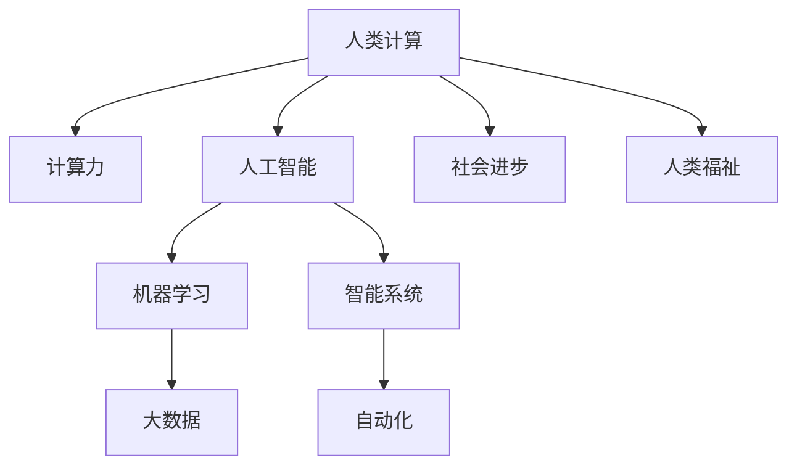

                 

# 人类计算：创造一个更加美好的世界

> 关键词：人类计算, 计算力, 人工智能, 机器学习, 智能系统, 未来世界, 社会进步

## 1. 背景介绍

### 1.1 问题由来

随着科技的飞速发展，人类社会的各个领域正经历着前所未有的变革。从工业到医疗，从教育到交通，从金融到艺术，计算技术无处不在。尤其是在信息技术领域，计算力已成为推动人类进步的核心动力。

计算技术的进步，不仅改变了我们的工作和生活方式，也重塑了人类对世界的认知。人类计算，即通过计算技术实现对自然和社会规律的更深入理解，是推动社会进步和人类福祉的重要途径。然而，当前计算技术的普及和应用，依然面临着诸多挑战。

### 1.2 问题核心关键点

计算技术的进步，尤其是在人工智能和机器学习领域，为人类计算提供了新的机遇。但同时，计算技术的普及应用也带来了新的问题，如数据隐私、伦理道德、社会公平等。

1. **计算力普及与数据隐私**：计算技术的普及应用，使得大规模数据收集和分析成为可能，但也带来了数据隐私和安全问题。如何在保护用户隐私的同时，实现数据的有效利用，成为计算技术应用的重要挑战。

2. **人工智能的伦理道德**：人工智能系统在决策和推荐过程中可能带有偏见和歧视，如何确保AI系统的公正性和透明性，是当前计算技术应用的重要课题。

3. **计算技术的社会公平性**：计算技术的不平衡发展，可能加剧社会不公。如何确保计算技术普惠于全体社会成员，实现技术进步带来的社会公平，是计算技术应用的重要方向。

4. **计算与人类协作的未来**：随着计算技术的进步，人类在计算中的角色将发生怎样的变化？如何构建计算技术与人类协作的新型关系，创造一个更加美好的未来世界，是计算技术应用的重要目标。

## 2. 核心概念与联系

### 2.1 核心概念概述

为更好地理解人类计算的应用和意义，本节将介绍几个密切相关的核心概念：

- **人类计算**：通过计算技术实现对自然和社会规律的更深入理解，推动社会进步和人类福祉的计算方式。
- **计算力**：指计算机系统处理、存储和传输数据的能力。计算力的提升，使得计算技术能够处理更复杂的问题，实现更高的社会价值。
- **人工智能**：一种通过计算技术实现的智能系统，能够执行复杂的决策、推理和生成任务。
- **机器学习**：一种利用数据训练模型，实现自动化学习和推理的技术，广泛应用于各种计算任务。
- **智能系统**：一种能够自主学习、推理和适应的计算系统，能够处理复杂的数据和任务。

这些概念之间的逻辑关系可以通过以下Mermaid流程图来展示：



这个流程图展示了你人类计算的核心概念及其之间的关系：

1. 人类计算通过计算力实现，涉及人工智能和机器学习等技术。
2. 计算力的提升，使得人工智能和机器学习技术能够处理更复杂的问题，实现社会进步和人类福祉。
3. 智能系统作为计算技术的高级形态，能够实现自动化和自主学习。
4. 大数据是计算力的重要支撑，为人工智能和机器学习提供了数据基础。

这些概念共同构成了计算技术的应用框架，使得计算技术能够广泛应用于各个领域，推动社会的进步和发展。

## 3. 核心算法原理 & 具体操作步骤

### 3.1 算法原理概述

人类计算的核心在于通过计算技术实现对自然和社会规律的更深入理解。其核心算法原理主要包括以下几个方面：

1. **数据收集与处理**：人类计算首先依赖于大规模数据的收集和处理，通过机器学习等技术对数据进行分析，提取有用的信息。

2. **模型训练与优化**：通过数据训练机器学习模型，优化模型的参数和结构，使其能够更准确地预测和推理。

3. **智能决策与推荐**：利用训练好的模型进行智能决策和推荐，帮助人类更好地理解和应用数据。

4. **计算与人类协作**：在计算过程中，需要充分考虑人类的智能和经验，将计算结果转化为对人类有用的信息和决策。

### 3.2 算法步骤详解

人类计算的应用过程通常包括以下几个关键步骤：

**Step 1: 数据收集与预处理**
- 收集相关领域的数据，包括文本、图像、音频、视频等。
- 对数据进行清洗、标注和归一化处理，确保数据质量和一致性。

**Step 2: 模型设计与训练**
- 选择合适的机器学习模型，如深度神经网络、支持向量机、决策树等。
- 设计合适的训练目标和损失函数，如交叉熵损失、均方误差等。
- 使用大规模数据集进行模型训练，优化模型的参数和结构。

**Step 3: 模型评估与优化**
- 使用测试集对训练好的模型进行评估，计算模型的精度、召回率、F1分数等指标。
- 根据评估结果，对模型进行优化调整，如增加正则化、调整超参数等。

**Step 4: 应用与部署**
- 将训练好的模型应用到实际问题中，进行智能决策和推荐。
- 将模型部署到实际应用场景中，确保系统的稳定性和可靠性。

**Step 5: 持续学习与改进**
- 根据新的数据和需求，持续更新和改进模型，保持其性能和效果。
- 结合人类的智能和经验，不断优化计算模型，实现更高效的计算。

### 3.3 算法优缺点

人类计算作为一种计算技术的应用范式，具有以下优点：

1. **高效性**：通过大规模数据的收集和分析，可以高效地解决复杂问题，提升决策和推荐的准确性。

2. **普适性**：能够应用于各个领域，从金融、医疗到教育、交通，广泛推动社会进步和人类福祉。

3. **可解释性**：相较于黑盒模型，计算模型通常具有较高的可解释性，便于人类理解和应用。

4. **创新性**：通过计算技术，能够发现新的规律和模式，推动科学和技术的前沿发展。

但同时，人类计算也存在一些局限性：

1. **数据依赖**：计算模型的性能很大程度上依赖于数据的丰富性和质量，缺乏高质量数据难以取得理想效果。

2. **复杂性**：计算模型通常较为复杂，需要大量计算资源和时间进行训练和优化，难以快速部署应用。

3. **可解释性不足**：一些复杂的计算模型（如深度学习）难以解释其内部决策机制，可能导致模型决策的不可信性。

4. **伦理道德问题**：计算模型在决策和推荐过程中可能带有偏见和歧视，引发伦理道德问题。

### 3.4 算法应用领域

人类计算在各个领域都有广泛的应用，具体如下：

- **金融科技**：通过计算模型对金融市场进行预测和分析，实现智能投顾、风险控制等功能。
- **医疗健康**：利用计算模型进行疾病诊断、治疗方案推荐、患者管理等，提升医疗服务质量。
- **教育科技**：通过计算模型进行个性化教育、学习效果评估、智能推荐等，推动教育公平。
- **交通管理**：利用计算模型进行交通流量预测、交通信号优化、事故预测等，提升交通效率。
- **环境保护**：利用计算模型进行环境监测、气候预测、资源管理等，保护生态环境。

## 4. 数学模型和公式 & 详细讲解 & 举例说明

### 4.1 数学模型构建

在人类计算的实际应用中，通常需要构建复杂的数学模型。这里以金融风险预测为例，说明人类计算模型的构建过程。

设有一个金融市场的风险预测模型 $M(x)$，其中 $x$ 为输入变量，如市场指数、经济指标等。假设 $y$ 为输出变量，表示市场风险等级，如低、中、高。则模型的目标是最小化预测误差，即最小化损失函数 $\mathcal{L}(M(x),y)$。常用的损失函数包括均方误差损失、交叉熵损失等。

### 4.2 公式推导过程

以均方误差损失为例，其公式为：

$$
\mathcal{L}(M(x),y) = \frac{1}{N}\sum_{i=1}^N (M(x_i) - y_i)^2
$$

其中 $N$ 为样本数量，$x_i$ 和 $y_i$ 分别为第 $i$ 个样本的输入和输出。

通过梯度下降等优化算法，模型 $M(x)$ 的参数 $\theta$ 更新公式为：

$$
\theta \leftarrow \theta - \eta \nabla_{\theta}\mathcal{L}(M(x),y)
$$

其中 $\eta$ 为学习率，$\nabla_{\theta}\mathcal{L}(M(x),y)$ 为损失函数对模型参数的梯度。

### 4.3 案例分析与讲解

以一个简单的线性回归模型为例，说明人类计算模型的构建和优化过程。

设有一个线性回归模型 $M(x) = \theta_0 + \theta_1x_1 + \theta_2x_2 + \cdots + \theta_nx_n$，其中 $x_i = (x_{i1}, x_{i2}, \cdots, x_{in})$ 为输入变量，$y_i$ 为输出变量。则均方误差损失函数为：

$$
\mathcal{L}(M(x),y) = \frac{1}{N}\sum_{i=1}^N (\theta_0 + \theta_1x_{i1} + \theta_2x_{i2} + \cdots + \theta_nx_{in} - y_i)^2
$$

通过求解损失函数的最小值，可以得到模型的参数：

$$
\hat{\theta} = (\mathbf{X}^T\mathbf{X})^{-1}\mathbf{X}^T\mathbf{y}
$$

其中 $\mathbf{X}$ 为输入变量的矩阵，$\mathbf{y}$ 为输出变量的向量。

## 5. 项目实践：代码实例和详细解释说明

### 5.1 开发环境搭建

在进行人类计算的实践前，我们需要准备好开发环境。以下是使用Python进行Scikit-Learn开发的环境配置流程：

1. 安装Anaconda：从官网下载并安装Anaconda，用于创建独立的Python环境。

2. 创建并激活虚拟环境：
```bash
conda create -n sklearn-env python=3.8 
conda activate sklearn-env
```

3. 安装Scikit-Learn：
```bash
pip install scikit-learn
```

4. 安装各类工具包：
```bash
pip install numpy pandas scikit-learn matplotlib tqdm jupyter notebook ipython
```

完成上述步骤后，即可在`sklearn-env`环境中开始人类计算的实践。

### 5.2 源代码详细实现

这里以一个简单的线性回归模型为例，展示人类计算模型的实现过程。

```python
from sklearn.linear_model import LinearRegression
from sklearn.metrics import mean_squared_error

# 准备数据
X = [[1, 2], [3, 4], [5, 6], [7, 8], [9, 10]]
y = [3, 4, 5, 6, 7]

# 构建模型
model = LinearRegression()
model.fit(X, y)

# 预测并评估
y_pred = model.predict([[11, 12], [13, 14]])
mse = mean_squared_error(y, y_pred)
print(f"Mean Squared Error: {mse:.3f}")
```

在代码中，首先准备了一个简单的线性回归数据集，然后使用Scikit-Learn库中的LinearRegression模型进行训练。最后，使用均方误差损失函数对模型进行评估，并输出预测结果。

### 5.3 代码解读与分析

让我们再详细解读一下关键代码的实现细节：

**数据准备**：
- 使用NumPy库定义输入变量 $X$ 和输出变量 $y$。

**模型训练**：
- 使用Scikit-Learn库中的LinearRegression模型进行训练，调用 `fit` 方法进行参数优化。

**模型预测与评估**：
- 使用 `predict` 方法对新的输入进行预测，并使用均方误差损失函数计算预测误差。

**输出结果**：
- 输出预测误差，显示模型的性能。

可以看到，Scikit-Learn库的线性回归模型实现非常简洁高效，适合用于快速原型开发和实验验证。

## 6. 实际应用场景

### 6.1 金融风险管理

在金融领域，风险预测和管理是一个重要任务。通过计算模型，可以实时监测市场波动，预测未来风险，帮助金融机构进行风险控制和决策。

例如，可以利用历史交易数据和市场指标，构建计算模型对股票市场进行风险预测。通过持续更新模型参数，可以及时捕捉市场变化，提升风险控制的准确性。

### 6.2 医疗健康诊断

在医疗领域，计算模型可以辅助医生进行疾病诊断和健康管理。通过大量医疗数据和临床试验，训练计算模型，可以实现早期疾病预测和个性化治疗方案推荐。

例如，利用患者的病历数据和基因信息，构建计算模型进行疾病预测和诊断。通过持续更新模型参数，可以实时更新诊断结果，提升医疗服务质量。

### 6.3 智能交通管理

在交通领域，计算模型可以优化交通流量、预测交通事件，提升城市交通效率。通过实时收集交通数据和天气信息，构建计算模型进行交通流量预测和信号优化。

例如，利用城市交通监控数据和气象信息，构建计算模型进行交通流量预测和信号优化。通过持续更新模型参数，可以及时应对交通拥堵和突发事件，提升交通管理效率。

### 6.4 未来应用展望

随着计算技术的不断进步，人类计算的应用将更加广泛和深入。未来，人类计算将在以下几个方面取得新的突破：

1. **多模态计算**：计算模型将融合视觉、听觉、触觉等多模态信息，实现更加全面和深入的人类计算。

2. **自适应计算**：计算模型将具备自适应学习能力，能够根据环境和任务变化，动态调整计算策略和模型参数。

3. **智能协同计算**：计算模型将实现人机协同，通过计算技术辅助人类决策和推理，提升计算效果和智能水平。

4. **伦理道德计算**：计算模型将具备伦理道德意识，确保计算过程的公正性和透明性，避免偏见和歧视。

5. **普惠计算**：计算模型将普及到各个领域和地区，推动技术进步和社会公平，提升人类福祉。

## 7. 工具和资源推荐

### 7.1 学习资源推荐

为了帮助开发者系统掌握人类计算的理论基础和实践技巧，这里推荐一些优质的学习资源：

1. 《深度学习入门》系列书籍：详细介绍了深度学习和机器学习的基本概念和算法。

2. 《Python数据科学手册》：介绍了Python在数据科学和机器学习中的应用，适合初学者和中级开发者。

3. Coursera的《机器学习》课程：斯坦福大学开设的机器学习课程，内容全面，涵盖了机器学习的基本概念和算法。

4. Kaggle竞赛平台：提供大量数据集和竞赛任务，适合实践机器学习和计算模型。

5. TensorFlow官方文档：介绍了TensorFlow库的详细使用方法和应用场景。

通过对这些资源的学习实践，相信你一定能够快速掌握人类计算的精髓，并用于解决实际的计算问题。

### 7.2 开发工具推荐

高效的开发离不开优秀的工具支持。以下是几款用于人类计算开发的常用工具：

1. Scikit-Learn：Python的机器学习库，提供多种机器学习算法和工具。

2. TensorFlow：由Google主导开发的深度学习框架，适合大规模深度学习模型的开发。

3. PyTorch：由Facebook开发的深度学习框架，适合快速原型开发和实验验证。

4. Weights & Biases：模型训练的实验跟踪工具，可以记录和可视化模型训练过程中的各项指标，方便对比和调优。

5. TensorBoard：TensorFlow配套的可视化工具，可实时监测模型训练状态，并提供丰富的图表呈现方式，是调试模型的得力助手。

6. Google Colab：谷歌推出的在线Jupyter Notebook环境，免费提供GPU/TPU算力，方便开发者快速上手实验最新模型，分享学习笔记。

合理利用这些工具，可以显著提升人类计算的开发效率，加快创新迭代的步伐。

### 7.3 相关论文推荐

人类计算技术的发展源于学界的持续研究。以下是几篇奠基性的相关论文，推荐阅读：

1. 《神经网络与深度学习》书籍：Ian Goodfellow等著，详细介绍了深度学习的基本概念和算法。

2. 《机器学习：理论与算法》书籍：Tom Mitchell著，介绍了机器学习的基本概念和算法。

3. 《深度学习：理论与实践》书籍：Ian Goodfellow等著，介绍了深度学习的基本概念和实践。

4. 《人类计算与智能系统》期刊：涵盖了人类计算和智能系统的前沿研究和技术进展。

这些论文代表了大计算技术的发展脉络。通过学习这些前沿成果，可以帮助研究者把握学科前进方向，激发更多的创新灵感。

## 8. 总结：未来发展趋势与挑战

### 8.1 总结

本文对人类计算的概念和应用进行了全面系统的介绍。首先阐述了人类计算的研究背景和意义，明确了计算技术在推动社会进步和人类福祉方面的重要价值。其次，从原理到实践，详细讲解了人类计算的数学原理和关键步骤，给出了计算模型开发的完整代码实例。同时，本文还广泛探讨了人类计算在金融、医疗、交通等多个领域的应用前景，展示了计算技术的巨大潜力。

通过本文的系统梳理，可以看到，人类计算作为一种计算技术的应用范式，正成为推动社会进步和人类福祉的重要手段。计算技术的普及应用，使得人类能够更好地理解和应用自然规律，推动科学和技术的发展。未来，伴随计算技术的不断进步，人类计算将为构建更加美好的世界做出更大贡献。

### 8.2 未来发展趋势

展望未来，人类计算技术将呈现以下几个发展趋势：

1. **计算力持续提升**：随着算力成本的下降和计算技术的进步，计算力将不断提升，使得人类计算能够处理更复杂的问题。

2. **模型多样化**：人类计算模型将更加多样化，融合深度学习、强化学习、符号计算等多种技术，提升计算效果和智能水平。

3. **多模态融合**：人类计算将融合视觉、听觉、触觉等多模态信息，实现更加全面和深入的计算。

4. **人机协同**：人类计算将实现人机协同，通过计算技术辅助人类决策和推理，提升计算效果和智能水平。

5. **伦理道德**：人类计算将具备伦理道德意识，确保计算过程的公正性和透明性，避免偏见和歧视。

6. **普惠计算**：人类计算将普及到各个领域和地区，推动技术进步和社会公平，提升人类福祉。

以上趋势凸显了人类计算技术的广阔前景。这些方向的探索发展，必将进一步提升计算技术的性能和应用范围，为构建更加美好的世界提供新的动力。

### 8.3 面临的挑战

尽管人类计算技术已经取得了瞩目成就，但在迈向更加智能化、普适化应用的过程中，它仍面临着诸多挑战：

1. **数据依赖**：计算模型的性能很大程度上依赖于数据的丰富性和质量，缺乏高质量数据难以取得理想效果。如何获取高质量数据，减少数据依赖，是一个重要的研究方向。

2. **计算复杂性**：计算模型通常较为复杂，需要大量计算资源和时间进行训练和优化，难以快速部署应用。如何优化计算模型，降低计算复杂性，是计算技术应用的重要方向。

3. **伦理道德问题**：计算模型在决策和推荐过程中可能带有偏见和歧视，引发伦理道德问题。如何确保计算过程的公正性和透明性，避免偏见和歧视，是计算技术应用的重要课题。

4. **技术普及性**：计算技术的普及和应用，依赖于技术推广和教育普及。如何普及计算技术，提升公众的技术素养，是计算技术应用的重要方向。

5. **社会公平性**：计算技术的普及应用，可能加剧社会不公。如何确保计算技术普惠于全体社会成员，实现技术进步带来的社会公平，是计算技术应用的重要目标。

6. **计算与人类协作**：计算技术在提升计算效果的同时，如何实现与人类协作，提升人类的决策和推理能力，是一个重要的研究方向。

这些挑战凸显了人类计算技术的应用复杂性，需要学界和产业界共同努力，才能实现计算技术的广泛应用和深入发展。

### 8.4 研究展望

面对人类计算技术所面临的诸多挑战，未来的研究需要在以下几个方面寻求新的突破：

1. **多模态计算**：融合视觉、听觉、触觉等多模态信息，实现更加全面和深入的计算。

2. **自适应计算**：计算模型具备自适应学习能力，能够根据环境和任务变化，动态调整计算策略和模型参数。

3. **智能协同计算**：通过计算技术辅助人类决策和推理，提升计算效果和智能水平。

4. **伦理道德计算**：计算模型具备伦理道德意识，确保计算过程的公正性和透明性，避免偏见和歧视。

5. **普惠计算**：普及计算技术，提升公众的技术素养，实现技术进步带来的社会公平。

这些研究方向的探索，必将引领人类计算技术迈向更高的台阶，为构建更加美好的世界提供新的动力。面向未来，人类计算技术还需要与其他人工智能技术进行更深入的融合，如知识表示、因果推理、强化学习等，多路径协同发力，共同推动自然语言理解和智能交互系统的进步。只有勇于创新、敢于突破，才能不断拓展计算技术的边界，让智能技术更好地造福人类社会。

## 9. 附录：常见问题与解答

**Q1：人类计算与传统计算的区别是什么？**

A: 人类计算与传统计算的最大区别在于其计算目标和应用场景。传统计算主要关注计算速度和效率，追求高效的数据处理和算法优化。而人类计算则更加注重计算的智能性和适应性，通过计算技术实现对自然和社会规律的更深入理解，推动社会进步和人类福祉。

**Q2：人类计算的应用前景有哪些？**

A: 人类计算的应用前景非常广泛，涵盖金融、医疗、教育、交通等多个领域。通过计算技术，可以实现风险预测、疾病诊断、个性化推荐、交通优化等功能，提升各个领域的服务质量和效率。

**Q3：如何提升人类计算的效率和性能？**

A: 提升人类计算的效率和性能，可以从以下几个方面入手：

1. 选择合适的计算模型和算法，如深度学习、强化学习等，提升计算效果。
2. 优化计算模型的参数和结构，如引入正则化、调整超参数等，提高计算效率。
3. 采用分布式计算和并行计算技术，提升计算速度。
4. 引入先验知识和规则，增强计算模型的适应性和鲁棒性。

**Q4：人类计算在数据依赖方面面临哪些挑战？**

A: 人类计算在数据依赖方面面临的主要挑战包括：

1. 数据质量问题：数据质量低，噪音和异常值较多，可能影响计算模型的性能。
2. 数据隐私问题：数据隐私保护是一个重要问题，如何在保护隐私的前提下，实现数据的有效利用，是一个重要研究方向。
3. 数据获取难度：获取高质量的数据，尤其是特定领域的数据，可能存在难度。

这些挑战需要学界和产业界共同努力，通过技术创新和政策制定，实现数据的有效管理和应用。

**Q5：如何确保计算过程的公正性和透明性？**

A: 确保计算过程的公正性和透明性，可以从以下几个方面入手：

1. 引入伦理道德约束，确保计算模型不带有偏见和歧视。
2. 使用可解释的计算模型，便于人类理解和监督。
3. 引入多方参与的机制，通过多方验证和监督，确保计算过程的公正性。

这些措施有助于提升计算过程的透明度和可信度，确保计算技术的公平应用。

---

作者：禅与计算机程序设计艺术 / Zen and the Art of Computer Programming

