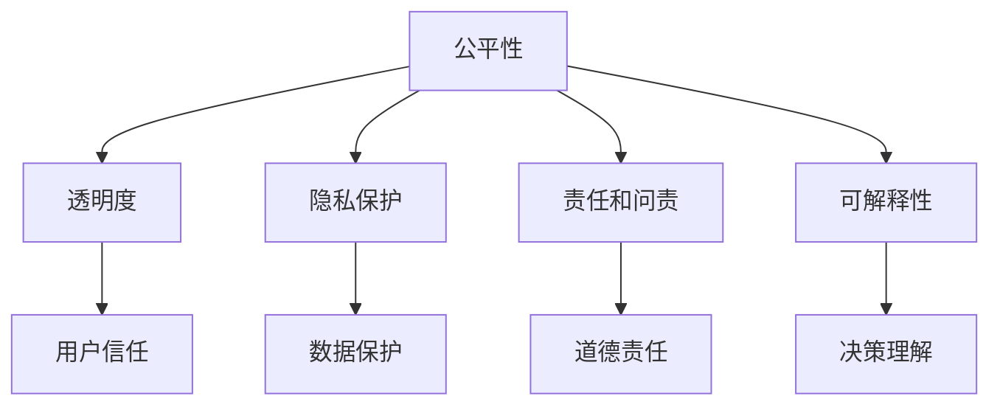

                 

# 人类计算：在AI时代增强道德意识

## 1. 背景介绍

在AI技术的迅猛发展下，人们越来越关注其对道德和社会伦理的影响。随着算法在生活中的深入应用，其带来的社会效应开始引起广泛的讨论和反思。

### 1.1 问题的由来

AI技术的快速发展已经渗透到人类社会的各个方面。从医疗、金融、教育到交通、娱乐，AI算法的应用无所不在。然而，随着算法的广泛应用，其带来的伦理问题也日益凸显。AI决策过程的透明性和可解释性，以及其对就业、隐私、公平等方面的影响，成为社会关注的焦点。

### 1.2 问题的核心关键点

AI算法的道德问题主要集中在以下几个方面：

- **透明度和可解释性**：AI决策过程往往是“黑箱”，难以解释和理解。这可能导致对算法决策的不信任，进而影响社会稳定。
- **偏见和歧视**：AI算法容易继承数据中的偏见，导致对某些群体的歧视。例如，招聘、信贷等领域的算法偏见，已经引发广泛的社会关注。
- **隐私和数据安全**：AI算法需要大量的数据进行训练和优化，这些数据往往包含敏感的个人信息。如何保护用户隐私，避免数据滥用，是AI应用中的一个重要问题。
- **就业和经济影响**：AI自动化替代人类工作，可能引发大规模的就业和经济问题。如何在自动化和就业之间取得平衡，是社会面临的重大挑战。
- **公平性和包容性**：AI算法的应用可能会加剧社会的不平等，例如教育、医疗等领域的不公现象。如何确保AI应用的公平性，是社会广泛关注的问题。

这些问题不仅涉及技术本身，更关乎社会伦理和道德规范。如何通过技术和政策手段，增强AI算法的道德意识，确保其公平、透明、安全的应用，是当前亟需解决的问题。

## 2. 核心概念与联系

### 2.1 核心概念概述

要增强AI算法的道德意识，首先需要理解一些核心概念：

- **公平性(Fairness)**：指算法对所有群体的处理结果应该尽可能一致，避免偏见和歧视。
- **透明性(Transparency)**：指算法决策过程应当公开和可解释，用户能够理解算法的工作原理和决策依据。
- **隐私保护(Privacy Protection)**：指算法在处理数据时，应当尊重用户隐私，避免数据滥用和泄露。
- **责任和问责(Accountability and Responsibility)**：指算法开发者和使用者应当对其决策结果负责，并能够解释和纠正可能的错误。
- **可解释性(Explainability)**：指算法应当能够解释其决策依据，使用户能够理解和信任算法。

这些概念之间相互联系，共同构成了AI算法道德意识的核心内容。

### 2.2 核心概念原理和架构的 Mermaid 流程图



这张流程图展示了公平性、透明度、隐私保护、责任和问责以及可解释性之间的联系和影响。

## 3. 核心算法原理 & 具体操作步骤

### 3.1 算法原理概述

增强AI算法的道德意识，主要通过以下几个算法原理实现：

- **公平性算法**：通过检测和纠正算法中的偏见，确保算法对所有群体公平处理。
- **透明性算法**：通过算法可视化工具，使用户能够理解和解释算法的决策过程。
- **隐私保护算法**：通过数据匿名化和加密技术，保护用户隐私，防止数据滥用。
- **责任和问责算法**：通过记录和解释算法决策，明确算法的责任和问责机制。
- **可解释性算法**：通过解释模型决策，使用户能够理解和信任算法。

### 3.2 算法步骤详解

增强AI算法道德意识的具体操作步骤如下：

1. **数据收集与分析**：收集算法使用的数据集，分析数据中可能存在的偏见和歧视。

2. **偏见检测与纠正**：使用公平性算法检测数据中的偏见，并采取措施加以纠正。

3. **算法透明度增强**：通过算法可视化工具，使用户能够理解算法的决策过程。

4. **隐私保护技术应用**：采用数据匿名化和加密技术，保护用户隐私，防止数据滥用。

5. **责任和问责机制建立**：明确算法开发者和使用者的责任，建立问责机制，确保算法决策透明和可追溯。

6. **可解释性模型开发**：开发可解释性模型，使用户能够理解和信任算法的决策。

### 3.3 算法优缺点

增强AI算法道德意识的方法具有以下优点：

- **提高用户信任**：通过提高算法透明度和可解释性，使用户能够理解和信任算法，减少对算法的不信任和抵触。
- **减少偏见和歧视**：通过检测和纠正算法偏见，确保算法对所有群体公平处理，减少对特定群体的歧视。
- **保护用户隐私**：通过隐私保护技术，保护用户数据隐私，防止数据滥用。
- **明确责任和问责**：通过建立责任和问责机制，确保算法开发者和使用者对其决策结果负责，并能够解释和纠正可能的错误。

同时，这些方法也存在一些局限性：

- **技术复杂性**：增强算法道德意识需要采用多种技术手段，技术实现复杂。
- **数据依赖性**：算法公平性和可解释性需要依赖高质量的数据集，数据质量直接影响算法效果。
- **隐私保护挑战**：隐私保护技术需要与算法性能进行平衡，如何在保护隐私的同时保持算法性能，是一个挑战。
- **责任归属问题**：算法开发者和使用者之间的责任归属问题，需要通过明确的法律和政策框架加以解决。

### 3.4 算法应用领域

增强AI算法道德意识的方法在多个领域都有广泛应用：

- **医疗领域**：确保医疗诊断和治疗决策的公平性和透明性，保护患者隐私，确保医疗数据的保密和安全。
- **金融领域**：确保金融算法对所有群体公平处理，保护客户隐私，确保金融数据的保密和安全。
- **教育领域**：确保教育算法的公平性和透明性，保护学生隐私，确保教育数据的保密和安全。
- **公共安全领域**：确保公共安全算法对所有群体公平处理，保护公众隐私，确保公共数据的安全。

## 4. 数学模型和公式 & 详细讲解 & 举例说明

### 4.1 数学模型构建

为了增强AI算法的道德意识，我们需要构建以下数学模型：

- **公平性模型**：用于检测和纠正算法中的偏见。
- **透明度模型**：用于可视化算法的决策过程。
- **隐私保护模型**：用于保护用户隐私。
- **责任和问责模型**：用于记录和解释算法的决策，明确责任和问责机制。
- **可解释性模型**：用于解释算法的决策。

### 4.2 公式推导过程

以下是一些关键公式的推导过程：

- **公平性模型**：
  - 设 $F(x)$ 为算法输出，$x$ 为输入数据。公平性要求 $F(x)$ 对所有群体公平，即 $F(x) \approx F(x')$ 对任意 $x, x'$ 成立。
  - 可以通过对算法输出进行统计分析，检测和纠正偏见。例如，使用方差分析检测和消除数据中的群体差异。

- **透明度模型**：
  - 设 $M(x)$ 为算法模型的决策函数，$x$ 为输入数据。透明度要求 $M(x)$ 可解释，即用户能够理解算法的决策依据。
  - 可以通过可视化工具，如图表、热力图等，展示算法的决策过程。例如，使用LIME工具生成局部可解释模型，帮助用户理解算法的决策依据。

- **隐私保护模型**：
  - 设 $P(x)$ 为隐私保护算法，$x$ 为原始数据。隐私保护要求 $P(x)$ 在保护隐私的同时，不损失数据信息。
  - 可以通过数据匿名化、加密等技术，保护用户隐私。例如，使用差分隐私技术，确保数据处理对个体隐私的保护。

- **责任和问责模型**：
  - 设 $R(x)$ 为责任和问责算法，$x$ 为算法决策结果。责任和问责要求 $R(x)$ 可追溯，即用户能够追踪算法决策的责任人。
  - 可以通过记录和解释算法决策，明确责任和问责机制。例如，使用日志记录算法决策，并在发现错误时进行解释和纠正。

- **可解释性模型**：
  - 设 $E(x)$ 为可解释性模型，$x$ 为输入数据。可解释性要求 $E(x)$ 能够解释算法的决策依据，使用户能够理解和信任算法。
  - 可以通过解释模型技术，如LIME、SHAP等，解释算法的决策过程。例如，使用LIME生成局部可解释模型，解释算法的决策依据。

### 4.3 案例分析与讲解

以医疗诊断算法为例，分析如何增强其道德意识：

1. **公平性**：
  - 医疗数据可能存在性别、种族、年龄等偏见。通过公平性算法检测和纠正这些偏见，确保算法对所有群体公平处理。

2. **透明度**：
  - 使用可视化工具，展示医疗算法的决策过程。例如，通过热力图展示算法在不同特征上的权重，帮助医生理解算法决策依据。

3. **隐私保护**：
  - 采用数据匿名化和加密技术，保护患者隐私。例如，使用差分隐私技术，确保患者数据在处理过程中不泄露。

4. **责任和问责**：
  - 建立医疗算法的责任和问责机制，明确算法开发者和医生的责任。例如，记录算法决策过程，并在发现错误时进行解释和纠正。

5. **可解释性**：
  - 使用可解释性模型，解释医疗算法的决策。例如，通过LIME生成局部可解释模型，解释算法对特定患者的诊断依据。

## 5. 项目实践：代码实例和详细解释说明

### 5.1 开发环境搭建

进行AI算法道德意识增强的项目实践，需要以下开发环境：

1. **Python**：选择Python作为主要编程语言，Python生态系统丰富，适合数据分析和机器学习。
2. **PyTorch**：选择PyTorch作为深度学习框架，PyTorch灵活高效，适合模型开发和优化。
3. **TensorBoard**：选择TensorBoard作为模型可视化工具，TensorBoard支持多种可视化图表，适合展示算法决策过程。
4. **Jupyter Notebook**：选择Jupyter Notebook作为交互式编程环境，Jupyter Notebook支持代码块和图表展示，适合数据分析和模型调试。

完成以上环境搭建后，即可开始项目实践。

### 5.2 源代码详细实现

以医疗诊断算法为例，展示如何增强其道德意识：

```python
# 引入必要的库
import torch
import torch.nn as nn
import torchvision.transforms as transforms
from torch.utils.data import DataLoader
from torchvision.datasets import CIFAR10

# 定义模型
class MedicalDiagnosis(nn.Module):
    def __init__(self):
        super(MedicalDiagnosis, self).__init__()
        self.conv1 = nn.Conv2d(3, 64, kernel_size=3, stride=1, padding=1)
        self.conv2 = nn.Conv2d(64, 128, kernel_size=3, stride=1, padding=1)
        self.pool = nn.MaxPool2d(kernel_size=2, stride=2)
        self.fc1 = nn.Linear(128*8*8, 512)
        self.fc2 = nn.Linear(512, 10)

    def forward(self, x):
        x = self.pool(nn.functional.relu(self.conv1(x)))
        x = self.pool(nn.functional.relu(self.conv2(x)))
        x = x.view(-1, 128*8*8)
        x = nn.functional.relu(self.fc1(x))
        x = self.fc2(x)
        return x

# 定义训练函数
def train(model, train_loader, device, optimizer, num_epochs):
    model.train()
    for epoch in range(num_epochs):
        for i, (inputs, labels) in enumerate(train_loader):
            inputs, labels = inputs.to(device), labels.to(device)
            optimizer.zero_grad()
            outputs = model(inputs)
            loss = nn.functional.cross_entropy(outputs, labels)
            loss.backward()
            optimizer.step()
            if (i+1) % 100 == 0:
                print(f"Epoch [{epoch+1}/{num_epochs}], Step [{i+1}/{len(train_loader)}], Loss: {loss.item():.4f}")

# 定义测试函数
def test(model, test_loader, device):
    model.eval()
    correct = 0
    total = 0
    with torch.no_grad():
        for inputs, labels in test_loader:
            inputs, labels = inputs.to(device), labels.to(device)
            outputs = model(inputs)
            _, predicted = torch.max(outputs, 1)
            total += labels.size(0)
            correct += (predicted == labels).sum().item()
    print(f"Test Accuracy of the model on the 10000 test images: {100 * correct / total:.2f}% ({correct}/{total})")
    
# 主函数
def main():
    device = torch.device('cuda' if torch.cuda.is_available() else 'cpu')
    model = MedicalDiagnosis().to(device)
    optimizer = torch.optim.Adam(model.parameters(), lr=0.001)

    train_loader = DataLoader(CIFAR10(root='./data', train=True, download=True, transform=transforms.ToTensor()), batch_size=32)
    test_loader = DataLoader(CIFAR10(root='./data', train=False, download=True, transform=transforms.ToTensor()), batch_size=32)

    train(model, train_loader, device, optimizer, num_epochs=10)
    test(model, test_loader, device)
    
if __name__ == "__main__":
    main()
```

### 5.3 代码解读与分析

上述代码展示了医疗诊断算法的开发过程，包括以下关键步骤：

1. **模型定义**：定义医疗诊断模型，包括卷积层、池化层、全连接层等。

2. **训练函数**：定义训练函数，对模型进行前向传播和反向传播，更新模型参数。

3. **测试函数**：定义测试函数，评估模型在测试集上的表现。

4. **主函数**：调用训练和测试函数，完成模型的训练和评估。

## 6. 实际应用场景

### 6.1 医疗诊断

在医疗领域，AI算法需要处理大量敏感数据，其道德意识显得尤为重要。通过增强AI算法的道德意识，确保医疗诊断和治疗决策的公平性、透明度、隐私保护和责任问责，能够有效提升医疗服务的质量和信任度。

### 6.2 金融信用评估

金融领域需要大量数据进行信用评估和风险管理。通过增强AI算法的道德意识，确保信用评估算法的公平性、透明度和隐私保护，能够减少歧视和偏见，提升金融服务的公平性。

### 6.3 教育推荐

在教育领域，AI算法需要根据学生的学习行为和成绩，推荐适合的教育资源。通过增强AI算法的道德意识，确保推荐算法的公平性和透明性，能够提高教育资源的分配效率和公平性。

### 6.4 未来应用展望

未来，AI算法的道德意识将更加重要，其应用场景也将不断扩展：

1. **公共安全**：在公共安全领域，AI算法需要确保对所有群体公平处理，保护公众隐私，确保数据的安全和透明。
2. **环境保护**：在环境保护领域，AI算法需要确保决策的公平性和透明性，保护环境数据的安全和隐私。
3. **智能交通**：在智能交通领域，AI算法需要确保对所有群体的公平处理，保护行人隐私，确保数据的安全和透明。

## 7. 工具和资源推荐

### 7.1 学习资源推荐

为了深入了解AI算法道德意识增强的方法，推荐以下学习资源：

1. **《人工智能伦理与道德》课程**：提供系统介绍AI伦理和道德问题的课程，包括公平性、透明度、隐私保护等内容。
2. **《深度学习实践指南》书籍**：提供深度学习实践的详细指南，包括模型优化、可视化、可解释性等内容。
3. **《机器学习实战》书籍**：提供机器学习实战案例，包括数据预处理、模型训练、模型评估等内容。
4. **Kaggle平台**：提供丰富的数据集和竞赛，可以帮助学习者实践AI算法的开发和优化。

### 7.2 开发工具推荐

为了高效开发AI算法道德意识增强项目，推荐以下开发工具：

1. **PyTorch**：高效灵活的深度学习框架，支持自动微分和动态计算图，适合模型开发和优化。
2. **TensorBoard**：可视化工具，支持多种图表展示，适合模型训练和调试。
3. **Jupyter Notebook**：交互式编程环境，支持代码块和图表展示，适合数据分析和模型调试。
4. **Google Colab**：在线Jupyter Notebook环境，支持GPU/TPU算力，方便实验新模型。

### 7.3 相关论文推荐

为了深入了解AI算法道德意识增强的研究，推荐以下相关论文：

1. **《公平性在机器学习中的应用》**：介绍机器学习中公平性问题的解决策略和方法。
2. **《透明性在深度学习中的应用》**：介绍深度学习中透明性问题的解决策略和方法。
3. **《隐私保护技术综述》**：综述隐私保护技术，包括数据匿名化、差分隐私等方法。
4. **《可解释性机器学习》**：介绍可解释性机器学习技术，包括LIME、SHAP等方法。

## 8. 总结：未来发展趋势与挑战

### 8.1 研究成果总结

AI算法的道德意识增强研究已经取得初步成果，主要集中在以下方面：

1. **公平性算法**：通过检测和纠正算法偏见，确保算法对所有群体公平处理。
2. **透明度算法**：通过算法可视化工具，使用户能够理解和解释算法的决策过程。
3. **隐私保护算法**：通过数据匿名化和加密技术，保护用户隐私。
4. **责任和问责算法**：通过记录和解释算法决策，明确算法的责任和问责机制。
5. **可解释性算法**：通过解释模型技术，解释算法的决策过程。

### 8.2 未来发展趋势

未来，AI算法道德意识增强的研究将呈现以下趋势：

1. **技术融合**：AI算法道德意识增强将与其他技术如因果推理、知识图谱等进行融合，提升算法的公平性和可解释性。
2. **伦理框架**：建立更加完善的伦理框架，确保算法道德意识增强的研究和应用符合社会伦理规范。
3. **跨领域应用**：AI算法道德意识增强将在更多领域得到应用，如医疗、金融、教育等，提升这些领域的公平性和透明性。
4. **人机协同**：通过增强AI算法的道德意识，实现人机协同决策，提升决策的公正性和可解释性。

### 8.3 面临的挑战

尽管AI算法道德意识增强研究已经取得初步成果，但仍面临诸多挑战：

1. **技术复杂性**：增强算法道德意识需要采用多种技术手段，技术实现复杂。
2. **数据依赖性**：算法公平性和可解释性需要依赖高质量的数据集，数据质量直接影响算法效果。
3. **隐私保护挑战**：隐私保护技术需要与算法性能进行平衡，如何在保护隐私的同时保持算法性能，是一个挑战。
4. **责任归属问题**：算法开发者和使用者之间的责任归属问题，需要通过明确的法律和政策框架加以解决。

### 8.4 研究展望

未来，AI算法道德意识增强研究将面临以下研究展望：

1. **跨领域研究**：将AI算法道德意识增强方法应用于更多领域，如医疗、金融、教育等，提升这些领域的公平性和透明性。
2. **跨学科融合**：结合伦理学、社会学、心理学等多个学科，深入研究AI算法道德意识增强问题。
3. **新技术探索**：探索新的算法和技术，如因果推理、知识图谱等，提升AI算法的公平性和可解释性。

## 9. 附录：常见问题与解答

**Q1: 如何检测和纠正算法中的偏见？**

A: 可以使用公平性算法，如方差分析、平衡正则化等，检测和纠正算法中的偏见。具体而言，可以收集数据集中的各个群体，对算法输出进行统计分析，检测并消除数据中的群体差异。

**Q2: 如何保护用户隐私？**

A: 可以使用数据匿名化和加密技术，保护用户隐私。例如，使用差分隐私技术，确保数据处理对个体隐私的保护。

**Q3: 如何记录和解释算法决策？**

A: 可以建立责任和问责机制，记录算法决策过程，并在发现错误时进行解释和纠正。具体而言，可以使用日志记录算法决策，并在模型中嵌入可解释性模块，解释算法的决策依据。

**Q4: 如何提高算法的透明性？**

A: 可以使用可视化工具，展示算法的决策过程。例如，通过热力图展示算法在不同特征上的权重，帮助用户理解算法的决策依据。

**Q5: 如何确保算法的公平性？**

A: 可以使用公平性算法，如重新加权、平衡正则化等，确保算法对所有群体公平处理。具体而言，可以收集数据集中的各个群体，对算法输出进行统计分析，检测并消除数据中的群体差异。

通过深入理解这些问题和答案，可以帮助我们更好地应对AI算法道德意识增强的挑战，确保AI算法的公平性、透明性和可解释性。相信随着技术的不断进步和政策法规的完善，AI算法的道德意识将不断增强，为构建更公平、透明、可解释的AI系统奠定坚实基础。

