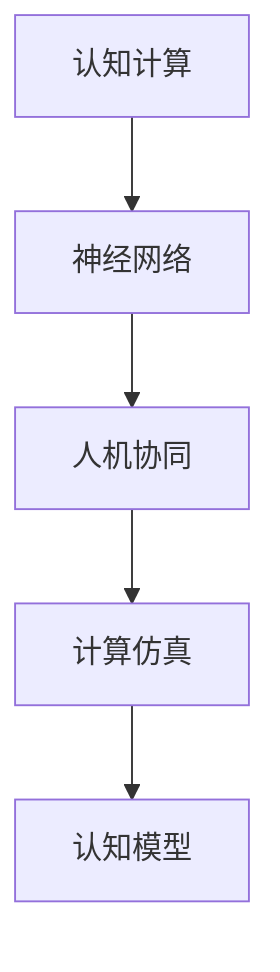
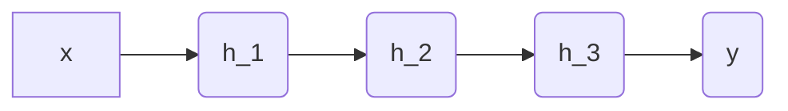

                 

# 人类计算：探索人类认知的边界

> 关键词：认知计算,神经网络,人机协同,计算仿真,认知模型

## 1. 背景介绍

### 1.1 问题由来
在人工智能快速发展的今天，人类计算作为其重要分支，逐渐成为探索人类认知边界的关键手段。认知计算旨在模拟人类大脑的认知过程，通过算法和模型解析、理解、生成和创新知识，实现人机协同。在这一过程中，神经网络作为核心工具，以其强大的并行计算能力和复杂的数学模型，为人类计算提供了强有力的技术支撑。

### 1.2 问题核心关键点
神经网络是现代认知计算的核心，它通过模仿人脑神经元的连接方式，构建了一种能够自适应、自学习和自优化的计算结构。在人类计算的探索过程中，神经网络不仅帮助我们更好地理解人类大脑的认知机制，还在实际应用中实现了众多创新和突破。

当前，神经网络技术在多个领域如自然语言处理、计算机视觉、语音识别等取得了显著成效，展现了其强大的跨学科适用性。然而，尽管其取得了巨大的成功，但仍存在诸多挑战，如复杂度与可解释性之间的矛盾、模型训练与数据量之间的关联、参数更新与网络结构的优化等。

### 1.3 问题研究意义
探讨人类计算的边界，不仅有助于更深入地理解人类大脑的认知机制，还将推动人工智能与人类智能的深度融合，加速认知科学的进展。通过神经网络模型的研究与应用，我们可以揭示人类认知的深层规律，从而更好地设计符合人类认知规律的技术体系。

同时，在医疗、教育、交通等实际应用中，通过人机协同的认知计算，可以大幅提升系统决策的智能化水平，为人类的生产和生活带来革命性的变化。

## 2. 核心概念与联系

### 2.1 核心概念概述

为更好地理解人类计算的边界，本节将介绍几个关键的概念：

- 认知计算(Cognitive Computing)：模拟人类大脑认知过程的计算技术，旨在解析、理解和生成人类知识，实现人机协同。
- 神经网络(Neural Network)：由大量神经元（节点）和连接（边）组成的计算结构，能够自适应、自学习和自优化。
- 人机协同(Human-Machine Collaboration)：利用人工智能技术辅助人类进行计算和决策，形成更加高效、智能的协同系统。
- 计算仿真(Computational Simulation)：使用计算机模型模拟人类或生物系统，以理解其行为和机制。
- 认知模型(Cognitive Model)：基于神经网络模型的认知计算框架，用于解析人类认知的深层机制。

这些概念之间的逻辑关系可以通过以下Mermaid流程图来展示：



这个流程图展示了一系列核心概念及其之间的联系：

1. 认知计算通过神经网络模型进行认知解析。
2. 神经网络模型实现人机协同计算。
3. 计算仿真和认知模型共同构成神经网络模型。

## 3. 核心算法原理 & 具体操作步骤
### 3.1 算法原理概述

认知计算的核心算法原理主要是神经网络模型，其关键在于通过学习大量数据，模拟人类大脑的认知过程，从而实现高效的计算和决策。

神经网络模型由输入层、隐藏层和输出层组成。输入层接收原始数据，隐藏层通过复杂的非线性变换进行特征提取和编码，输出层生成最终结果。每个神经元之间通过连接权重进行信息传递，权重通过反向传播算法不断更新，从而优化整个模型的性能。

### 3.2 算法步骤详解

神经网络模型的训练通常包括以下几个步骤：

**Step 1: 数据准备与预处理**
- 收集大量相关数据集，并进行数据清洗、归一化等预处理操作，以便神经网络能够高效处理。

**Step 2: 模型搭建**
- 选择合适的神经网络结构，如卷积神经网络(CNN)、循环神经网络(RNN)、长短时记忆网络(LSTM)等，以及相应的激活函数和优化器。

**Step 3: 模型训练**
- 使用反向传播算法，通过梯度下降优化目标函数，不断调整网络参数。
- 定期在验证集上评估模型性能，避免过拟合。
- 持续训练，直至模型达到预设的性能指标。

**Step 4: 模型评估与调优**
- 在测试集上评估模型性能，计算准确率、召回率、F1分数等指标。
- 根据评估结果，调整模型超参数，如学习率、批大小、隐藏层节点数等。

### 3.3 算法优缺点

神经网络模型在认知计算中具有以下优点：
1. 强大的表达能力：通过多层非线性变换，神经网络能够处理高维、复杂的输入数据。
2. 高度的自适应性：在大量数据下，神经网络能够自适应地学习复杂的特征关系。
3. 高效的计算能力：并行计算的特性使得神经网络能够快速处理大量数据。
4. 良好的泛化能力：在适当的数据量下，神经网络能够在未见过的数据上表现良好。

同时，神经网络模型也存在以下局限性：
1. 高复杂度：神经网络模型往往参数繁多，难以解释和优化。
2. 过拟合风险：在数据量不足时，神经网络容易出现过拟合现象。
3. 计算资源需求大：训练和推理需要大量的计算资源，如GPU/TPU等高性能设备。
4. 训练时间长：神经网络模型训练过程复杂，可能需要较长的训练时间。
5. 需要大量标注数据：神经网络模型的训练往往依赖大量的标注数据，数据标注成本高。

尽管存在这些局限性，但神经网络仍是当前最先进的认知计算工具，能够在认知分析、智能决策等领域发挥巨大作用。

### 3.4 算法应用领域

神经网络模型在众多领域展示了其强大的计算能力，具体应用包括：

- 自然语言处理(NLP)：用于语言理解、翻译、文本生成等任务，如BERT、GPT-3等模型。
- 计算机视觉(CV)：用于图像识别、目标检测、图像生成等任务，如ResNet、CNN等模型。
- 语音识别(SR)：用于语音识别、语音合成、语音情感分析等任务，如WaveNet、Tacotron等模型。
- 机器人学(Robotics)：用于机器人路径规划、动作识别、行为决策等任务，如神经控制机器人、动作识别网络等。
- 健康医疗(Medical)：用于疾病诊断、医学影像分析、个性化医疗等任务，如放射学诊断、遗传疾病预测等。
- 金融风险评估：用于信用评分、风险管理、市场预测等任务，如神经网络金融模型、风险预测模型等。

## 4. 数学模型和公式 & 详细讲解 & 举例说明

### 4.1 数学模型构建

神经网络模型可以通过以下几个基本要素来定义：

- **输入层**：$x \in \mathbb{R}^m$，输入特征向量。
- **隐藏层**：$h_1, h_2, ..., h_n \in \mathbb{R}^h$，由非线性激活函数$f$构成。
- **输出层**：$y \in \mathbb{R}^k$，输出结果向量。

神经网络的目标是最大化输出$y$与真实标签$y^*$的相似度。常用的损失函数包括均方误差、交叉熵、对数损失等。

### 4.2 公式推导过程

以交叉熵损失函数为例，推导过程如下：

设神经网络模型输出$y = M(x)$，真实标签为$y^*$，则交叉熵损失函数为：

$$
\mathcal{L} = -\frac{1}{N} \sum_{i=1}^N \sum_{j=1}^K y_{ij}^* \log M_{ij}
$$

其中$N$为样本数，$K$为输出维度。

通过链式法则，对模型参数$\theta$求导，得：

$$
\frac{\partial \mathcal{L}}{\partial \theta} = -\frac{1}{N} \sum_{i=1}^N \sum_{j=1}^K y_{ij}^* \frac{\partial M_{ij}}{\partial \theta} \frac{1}{M_{ij}}
$$

反向传播算法根据上述梯度公式，更新模型参数，优化模型性能。

### 4.3 案例分析与讲解

以图像识别任务为例，分析神经网络模型的工作原理。

假设输入为28x28的灰度图像$x$，输出为10个类别的概率分布$y$。模型结构如下：

- 输入层：$x \in [0, 1]^{28\times 28}$
- 隐藏层：$h_1, h_2, ..., h_n \in \mathbb{R}^h$
- 输出层：$y \in \mathbb{R}^{10}$

设激活函数为ReLU，隐藏层数为3，隐藏节点数为500。则模型结构示意图如下：



假设使用交叉熵损失函数进行训练，对于每个训练样本$(x_i, y_i^*)$，其损失函数为：

$$
\mathcal{L} = -\frac{1}{10} \sum_{j=1}^{10} y_{i,j}^* \log \hat{y}_{i,j}
$$

其中$\hat{y}_{i,j} = \sigma(\sum_{k=1}^{500} w_{i,j,k}h_k + b_{i,j})$，$w_{i,j,k}$为权重，$b_{i,j}$为偏置，$\sigma$为ReLU激活函数。

通过反向传播算法，更新权重和偏置，使得模型在测试集上达到最优性能。

## 5. 项目实践：代码实例和详细解释说明
### 5.1 开发环境搭建

在进行神经网络模型开发前，我们需要准备好开发环境。以下是使用Python进行PyTorch开发的环境配置流程：

1. 安装Anaconda：从官网下载并安装Anaconda，用于创建独立的Python环境。

2. 创建并激活虚拟环境：
```bash
conda create -n pytorch-env python=3.8 
conda activate pytorch-env
```

3. 安装PyTorch：根据CUDA版本，从官网获取对应的安装命令。例如：
```bash
conda install pytorch torchvision torchaudio cudatoolkit=11.1 -c pytorch -c conda-forge
```

4. 安装各类工具包：
```bash
pip install numpy pandas scikit-learn matplotlib tqdm jupyter notebook ipython
```

完成上述步骤后，即可在`pytorch-env`环境中开始神经网络模型的开发。

### 5.2 源代码详细实现

下面我们以手写数字识别任务为例，给出使用PyTorch进行神经网络模型开发的完整代码实现。

首先，定义手写数字识别任务的神经网络模型：

```python
import torch
import torch.nn as nn
import torch.optim as optim

# 定义模型结构
class Net(nn.Module):
    def __init__(self):
        super(Net, self).__init__()
        self.fc1 = nn.Linear(784, 500)
        self.fc2 = nn.Linear(500, 500)
        self.fc3 = nn.Linear(500, 10)
        self.relu = nn.ReLU()
        self.dropout = nn.Dropout(p=0.2)

    def forward(self, x):
        x = self.relu(self.fc1(x.view(-1, 784)))
        x = self.dropout(x)
        x = self.relu(self.fc2(x))
        x = self.dropout(x)
        x = self.fc3(x)
        return x

# 初始化模型
model = Net()

# 定义损失函数和优化器
criterion = nn.CrossEntropyLoss()
optimizer = optim.Adam(model.parameters(), lr=0.001)
```

然后，定义数据集和训练流程：

```python
from torch.utils.data import DataLoader
from torchvision import datasets, transforms

# 定义数据预处理
transform = transforms.Compose([
    transforms.ToTensor(),
    transforms.Normalize((0.1307,), (0.3081,))
])

# 加载数据集
train_dataset = datasets.MNIST(root='./data', train=True, download=True, transform=transform)
test_dataset = datasets.MNIST(root='./data', train=False, transform=transform)
train_loader = DataLoader(train_dataset, batch_size=64, shuffle=True)
test_loader = DataLoader(test_dataset, batch_size=64, shuffle=False)

# 定义训练过程
def train_epoch(model, train_loader, optimizer, criterion):
    model.train()
    loss = 0
    for batch_idx, (data, target) in enumerate(train_loader):
        optimizer.zero_grad()
        output = model(data.view(-1, 784))
        loss += criterion(output, target).item()
        loss.backward()
        optimizer.step()
    return loss / len(train_loader)

# 定义评估过程
def evaluate(model, test_loader, criterion):
    model.eval()
    correct = 0
    with torch.no_grad():
        for data, target in test_loader:
            output = model(data.view(-1, 784))
            _, predicted = torch.max(output.data, 1)
            correct += (predicted == target).sum().item()
    print('Test Accuracy of the model on the 10000 test images: {} %'.format(100 * correct / len(test_loader.dataset)))
```

最后，启动训练流程并在测试集上评估：

```python
epochs = 10

for epoch in range(epochs):
    loss = train_epoch(model, train_loader, optimizer, criterion)
    print('Train Epoch: {} - Loss: {:.6f}'.format(epoch + 1, loss))
    
    evaluate(model, test_loader, criterion)
```

以上就是使用PyTorch进行手写数字识别任务神经网络模型开发的完整代码实现。可以看到，借助PyTorch，神经网络模型的开发变得简洁高效。

### 5.3 代码解读与分析

让我们再详细解读一下关键代码的实现细节：

**Net类**：
- `__init__`方法：初始化模型各层，定义线性层、ReLU激活函数和Dropout等组件。
- `forward`方法：定义前向传播过程，从输入到输出的计算流程。

**模型初始化**：
- 通过继承`nn.Module`，定义神经网络模型结构，包括线性层和激活函数。
- 使用`nn.Linear`定义全连接层，使用`nn.ReLU`定义ReLU激活函数，使用`nn.Dropout`定义Dropout正则化。

**损失函数和优化器**：
- 使用`nn.CrossEntropyLoss`作为损失函数，计算模型的预测输出与真实标签的交叉熵损失。
- 使用`optim.Adam`作为优化器，定义学习率等超参数。

**数据集和训练流程**：
- 使用`torchvision.datasets.MNIST`加载MNIST数据集，并进行归一化等预处理操作。
- 使用`torch.utils.data.DataLoader`定义训练数据集和测试数据集，控制批大小和随机顺序。
- 定义训练和评估函数，计算损失函数和准确率。

**训练过程**：
- 在每个epoch内，循环迭代训练数据集，计算损失函数并更新模型参数。
- 在每个epoch结束后，评估模型在测试集上的性能。

可以看到，PyTorch提供了强大的框架和工具，极大地简化了神经网络模型的开发过程，使得开发者能够更专注于算法和模型的设计。

## 6. 实际应用场景
### 6.1 智能医疗

在智能医疗领域，神经网络模型可以应用于疾病诊断、医学影像分析、个性化医疗等多个方向。例如，通过卷积神经网络(CNN)对医学影像进行分析，可以自动识别出病变区域，辅助医生进行诊断。

在具体实现中，可以收集大量的医学影像数据，标注出疾病类型和病变位置，训练神经网络模型。微调后的模型能够在新的医学影像上快速识别出异常区域，提供初步诊断建议。同时，结合医疗知识图谱等外部知识，可以进一步优化模型的诊断精度和解释能力。

### 6.2 自动驾驶

自动驾驶系统中的环境感知和路径规划任务，往往需要处理大量的复杂数据，包括摄像头图像、雷达数据、激光雷达数据等。通过使用深度神经网络模型，如卷积神经网络(CNN)和循环神经网络(RNN)，可以实现对多模态数据的联合分析，提高系统的决策能力。

例如，在摄像头图像上训练神经网络模型，可以实时识别出道路上的车辆、行人、交通信号等关键元素，并通过RNN模型分析这些元素的动态变化，优化路径规划决策。

### 6.3 金融风险评估

金融领域的数据量大、复杂度高，传统的统计分析方法难以满足实时决策的需求。通过神经网络模型，可以对大量历史数据进行分析，发现其中的规律和趋势，构建风险预测模型。

在具体实现中，可以收集历史交易数据、市场行情、宏观经济数据等，训练神经网络模型。微调后的模型能够实时分析当前的市场数据，预测市场趋势，提供风险评估建议。同时，结合金融知识图谱等外部知识，可以进一步提高模型的预测精度和解释能力。

### 6.4 未来应用展望

未来，神经网络模型在人类计算领域的应用将更加广泛，具体展望如下：

- **人机协同增强**：结合人类专家的知识和经验，增强神经网络模型的决策能力，提升系统的智能化水平。
- **多模态数据融合**：通过融合视觉、听觉、触觉等多模态数据，构建更加全面、精确的认知模型。
- **计算仿真优化**：利用神经网络模型优化计算仿真过程，提高仿真的精确度和效率。
- **认知模型提升**：构建更加复杂、深入的认知模型，解析人类认知的深层规律。
- **跨学科应用拓展**：拓展神经网络模型的应用范围，覆盖更多领域，如教育、交通、农业等。

## 7. 工具和资源推荐
### 7.1 学习资源推荐

为了帮助开发者系统掌握神经网络模型的理论基础和实践技巧，这里推荐一些优质的学习资源：

1. 《深度学习》（Ian Goodfellow等著）：全面介绍了深度学习的理论和实践，涵盖神经网络、卷积神经网络、循环神经网络等多个主题。

2. CS231n《卷积神经网络》课程：斯坦福大学开设的计算机视觉课程，有Lecture视频和配套作业，详细讲解卷积神经网络的基本原理和实现方法。

3. CS224d《自然语言处理与深度学习》课程：斯坦福大学开设的NLP课程，讲解深度学习在NLP中的应用，包括文本分类、序列建模、机器翻译等任务。

4. DeepLearning.ai的深度学习专项课程：由Andrew Ng教授主讲的深度学习课程，从基础到高级，覆盖了神经网络、卷积神经网络、循环神经网络等多个主题。

5. HuggingFace官方文档：Transformer库的官方文档，提供了海量预训练模型和完整的微调样例代码，是学习深度学习的必备资料。

通过学习这些资源，相信你一定能够快速掌握神经网络模型的精髓，并用于解决实际的认知计算问题。

### 7.2 开发工具推荐

高效的开发离不开优秀的工具支持。以下是几款用于神经网络模型开发的常用工具：

1. PyTorch：基于Python的开源深度学习框架，灵活动态的计算图，适合快速迭代研究。大多数神经网络模型都有PyTorch版本的实现。

2. TensorFlow：由Google主导开发的开源深度学习框架，生产部署方便，适合大规模工程应用。同时有丰富的预训练神经网络模型资源。

3. TensorFlow Hub：Google开发的开源深度学习库，提供了丰富的预训练模型和组件，方便开发者快速构建复杂模型。

4. JAX：由Google开发的开源深度学习框架，支持高性能计算和自动微分，适用于大规模神经网络模型的训练和推理。

5. Keras：基于TensorFlow和Theano的高级深度学习库，简单易用，适合初学者和快速原型开发。

合理利用这些工具，可以显著提升神经网络模型的开发效率，加快创新迭代的步伐。

### 7.3 相关论文推荐

神经网络模型的发展源于学界的持续研究。以下是几篇奠基性的相关论文，推荐阅读：

1. Deep Blue：IBM开发的国际象棋程序，标志着神经网络在复杂决策问题上的应用。

2. AlphaGo：DeepMind开发的围棋程序，展示了神经网络在策略博弈中的强大能力。

3. AlexNet：NIPS 2012年论文，引入了卷积神经网络，推动了计算机视觉领域的发展。

4. ResNet：CVPR 2015年论文，提出了残差连接，大幅提升了深度神经网络的训练效果。

5. GPT-3：OpenAI开发的语言模型，展示了神经网络在自然语言处理中的巨大潜力。

这些论文代表了大神经网络模型的发展脉络。通过学习这些前沿成果，可以帮助研究者把握学科前进方向，激发更多的创新灵感。

## 8. 总结：未来发展趋势与挑战

### 8.1 总结

本文对神经网络模型在认知计算中的应用进行了全面系统的介绍。首先阐述了神经网络模型的基本原理和主要应用，明确了其在认知计算中的独特价值。其次，从理论到实践，详细讲解了神经网络模型的训练过程，给出了神经网络模型开发的完整代码实例。同时，本文还广泛探讨了神经网络模型在医疗、自动驾驶、金融等多个行业领域的应用前景，展示了其强大的计算能力。

通过本文的系统梳理，可以看到，神经网络模型作为认知计算的核心工具，正逐渐成为探索人类认知边界的重要手段。得益于深度学习的不断发展，神经网络模型在多个领域展示出强大的应用潜力，为人类的生产和生活带来革命性的变化。未来，伴随神经网络模型的不断演进，其在认知计算领域的应用将更加广泛，为人类认知智能的进化带来深远影响。

### 8.2 未来发展趋势

展望未来，神经网络模型在认知计算领域将呈现以下几个发展趋势：

1. 模型规模持续增大。随着算力成本的下降和数据规模的扩张，神经网络模型的参数量还将持续增长。超大规模神经网络模型蕴含的丰富计算能力，将推动认知计算应用的边界不断拓展。

2. 计算仿真和认知模型融合。计算仿真与神经网络模型的深度融合，将大大提升系统的计算效率和精度。

3. 多模态数据的融合应用。未来的认知计算将融合视觉、听觉、触觉等多模态数据，构建更加全面、精确的认知模型。

4. 知识驱动的神经网络模型。结合符号化的先验知识，构建更加智能化的神经网络模型，实现知识与计算的协同进化。

5. 人机协同能力的提升。通过人机协同的认知计算，进一步提升神经网络模型的决策能力和智能化水平。

6. 跨学科应用拓展。神经网络模型将在更多领域展示其应用潜力，如教育、交通、农业等，构建更加智能化的社会系统。

以上趋势凸显了神经网络模型在认知计算领域的广阔前景。这些方向的探索发展，将进一步提升神经网络模型的计算能力和应用范围，为认知科学的进展和智能系统的构建注入新的动力。

### 8.3 面临的挑战

尽管神经网络模型在认知计算中取得了显著成效，但在迈向更加智能化、普适化应用的过程中，仍面临诸多挑战：

1. 高复杂度与可解释性之间的矛盾。神经网络模型通常参数繁多，难以解释和优化。如何构建可解释性强的神经网络模型，增强系统透明度，将是未来的重要研究课题。

2. 计算资源的需求。训练和推理神经网络模型需要大量的计算资源，如何高效利用资源，降低计算成本，是未来的一个重要研究方向。

3. 数据的获取与标注。神经网络模型的训练依赖大量的标注数据，如何高效获取和标注数据，将是未来的一个重要挑战。

4. 模型的泛化能力。神经网络模型在特定领域可能出现过拟合现象，如何提高模型的泛化能力，增强系统的稳定性和可靠性，将是未来的一个重要研究方向。

5. 计算仿真模型的精度与效率。如何提高计算仿真模型的精度和效率，将是未来的一个重要研究方向。

6. 知识图谱与神经网络模型的结合。如何结合知识图谱与神经网络模型，构建更加智能化的认知系统，将是未来的一个重要研究方向。

面对这些挑战，未来的研究需要在以下几个方面寻求新的突破：

1. 构建可解释性强的神经网络模型。通过引入符号化的先验知识，增强神经网络模型的可解释性，提升系统透明度。

2. 高效利用计算资源。通过分布式计算、异构计算等技术，高效利用计算资源，降低计算成本。

3. 高效获取和标注数据。通过主动学习、迁移学习等技术，高效获取和标注数据，提高神经网络模型的训练效率和精度。

4. 提高模型的泛化能力。通过正则化技术、对抗训练等方法，提高神经网络模型的泛化能力，增强系统的稳定性和可靠性。

5. 提高计算仿真模型的精度与效率。通过引入深度学习技术，提高计算仿真模型的精度和效率。

6. 结合知识图谱与神经网络模型。结合知识图谱与神经网络模型，构建更加智能化的认知系统，实现知识与计算的协同进化。

## 9. 附录：常见问题与解答

**Q1：如何优化神经网络模型的泛化能力？**

A: 优化神经网络模型的泛化能力，需要从以下几个方面入手：

1. 数据增强：通过数据增强技术，扩充训练数据集，提高模型的泛化能力。

2. 正则化：使用L2正则、Dropout等方法，减少过拟合现象，提高模型的泛化能力。

3. 对抗训练：引入对抗样本，提高模型的鲁棒性，增强泛化能力。

4. 迁移学习：利用已有模型的知识，减少新任务的训练成本，提高模型的泛化能力。

5. 多模型集成：通过集成多个模型的输出，提高模型的泛化能力。

通过以上方法，可以显著提高神经网络模型的泛化能力，增强系统的稳定性和可靠性。

**Q2：如何提高神经网络模型的训练效率？**

A: 提高神经网络模型的训练效率，需要从以下几个方面入手：

1. 模型裁剪：去除不必要的层和参数，减小模型尺寸，提高训练速度。

2. 量化加速：将浮点模型转为定点模型，压缩存储空间，提高计算效率。

3. 模型并行：通过分布式计算和异构计算，提高模型的训练效率。

4. 批量归一化：使用批量归一化技术，提高模型的收敛速度和泛化能力。

5. 混合精度训练：使用混合精度训练技术，提高计算效率和训练速度。

通过以上方法，可以显著提高神经网络模型的训练效率，缩短训练时间，降低计算成本。

**Q3：如何构建可解释性强的神经网络模型？**

A: 构建可解释性强的神经网络模型，需要从以下几个方面入手：

1. 引入符号化的先验知识。结合符号化的先验知识，增强神经网络模型的可解释性，提升系统透明度。

2. 引入可解释性强的组件。在神经网络模型中加入可解释性强的组件，如注意力机制、可视化技术等。

3. 使用可解释性强的模型架构。使用可解释性强的模型架构，如决策树、线性回归等。

4. 可视化训练过程。使用可视化技术，实时监控训练过程，分析模型的决策逻辑和特征提取能力。

5. 增加模型复杂度。通过增加模型的复杂度，提高模型的泛化能力和可解释性。

通过以上方法，可以构建可解释性强的神经网络模型，增强系统的透明度和可靠性。

**Q4：什么是计算仿真？**

A: 计算仿真是指使用计算机模型模拟人类或生物系统，以理解其行为和机制的技术。计算仿真在认知计算中具有重要意义，能够帮助我们解析和理解人类认知的深层机制。

计算仿真的核心在于构建一个能够精确描述目标系统的数学模型，通过模拟和预测系统的行为，帮助我们更好地理解系统的运行规律和特性。

在认知计算中，计算仿真可以应用于神经网络模型的训练和优化，帮助我们选择和调整模型参数，提升系统的性能和效果。

**Q5：什么是认知模型？**

A: 认知模型是指基于神经网络模型的认知计算框架，用于解析人类认知的深层机制。认知模型的核心在于通过神经网络模型模拟人类认知的过程，解析和理解人类认知的深层规律。

认知模型在认知计算中具有重要意义，能够帮助我们解析和理解人类认知的深层机制，为构建智能化的认知系统提供理论基础和实践方法。

在认知模型中，神经网络模型被视为一个计算单元，通过对神经网络模型进行训练和优化，可以解析和理解人类认知的深层规律，为构建智能化的认知系统提供理论基础和实践方法。

---

作者：禅与计算机程序设计艺术 / Zen and the Art of Computer Programming

