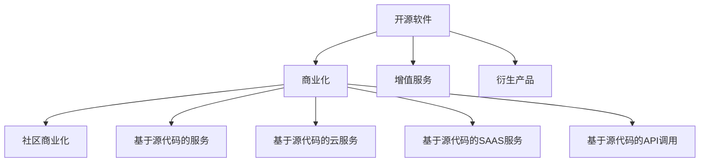

                 

# 从代码到现金：开源项目商业化策略

## 1. 背景介绍

### 1.1 问题由来
在过去的十年里，开源软件在软件开发和创新中扮演了越来越重要的角色。开源社区不仅为开发者提供了一个共享代码的平台，也为商业公司和初创企业提供了一种快速迭代和实现创新的方式。然而，随着开源软件的发展，如何将这些代码商业化，如何从中获得经济收益，成为摆在所有开源项目面前的一大挑战。

### 1.2 问题核心关键点
开源项目商业化面临的核心挑战包括：
- 如何从开源代码中识别出具有商业价值的部分？
- 如何将这些代码以最经济的方式进行包装和推广？
- 如何找到并吸引对开源代码有需求的客户？
- 如何从现有客户中扩展，形成稳定的商业生态？
- 如何确保开源项目商业化过程中不会违反开源协议，损害社区利益？

这些核心问题需要开发者、商业公司、法律专家以及社区管理者的共同努力，才能实现开源代码的成功商业化。

## 2. 核心概念与联系

### 2.1 核心概念概述

为更好地理解开源项目商业化策略，本节将介绍几个密切相关的核心概念：

- 开源软件(Open Source Software, OSS)：指源代码公开，允许任何人使用、修改和分发的软件。典型的开源协议包括GPL、Apache、MIT等。

- 商业化(Commercialization)：指将开源软件或其衍生品转化为商业产品，通过销售、授权等方式获得经济收益的过程。

- 社区商业化(Community Commercialization)：指通过与开源社区的合作，将开源代码商业化的方式。主要模式包括：
  - 基于源代码的服务
  - 基于源代码的云服务
  - 基于源代码的SAAS服务
  - 基于源代码的API调用

- 增值服务(Add-on Services)：指围绕开源软件提供的一系列相关服务，如技术支持、培训、集成服务、咨询等。

- 衍生产品(Derivative Products)：指基于开源代码开发的商业产品或服务，可以采用不同的许可证进行分发。

这些核心概念之间的逻辑关系可以通过以下Mermaid流程图来展示：



这个流程图展示了大语言模型的核心概念及其之间的关系：

1. 开源软件通过预训练获得基础能力。
2. 商业化是对开源软件进行任务特定的优化，分为社区商业化和增值服务。
3. 增值服务围绕开源软件提供的一系列相关服务，如技术支持、培训、集成服务、咨询等。
4. 衍生产品基于开源代码开发的商业产品或服务，可以采用不同的许可证进行分发。
5. 社区商业化通过与开源社区的合作，将开源代码商业化。

这些概念共同构成了开源软件商业化的框架，使其能够在商业环境中有效运作。通过理解这些核心概念，我们可以更好地把握开源项目商业化的工作原理和优化方向。

## 3. 核心算法原理 & 具体操作步骤
### 3.1 算法原理概述

开源项目商业化的一般流程可以分为以下几个步骤：

1. 选择开源代码库：根据目标市场和需求，选择合适的开源代码库。
2. 构建商业化路径：确定将开源代码商业化的方式，如增值服务、衍生产品、社区商业化等。
3. 设计价值主张：明确商业化产品的价值主张，即商业产品为谁解决什么问题，如何解决。
4. 定价策略：根据目标市场和竞争情况，制定合理的定价策略。
5. 市场推广：通过各种渠道将商业化产品推广给目标客户。
6. 客户支持：提供良好的客户支持和技术服务，确保客户满意度。
7. 持续改进：根据市场反馈和客户需求，不断优化商业化产品。

### 3.2 算法步骤详解

下面以一个具体的开源项目商业化案例为例，详细介绍算法步骤：

**步骤1: 选择开源代码库**

假设我们选择开源数据库管理系统（DBMS）Apache Cassandra进行商业化。Apache Cassandra是一个高性能、分布式、面向列的NoSQL数据库，广泛应用于大数据分析、实时数据处理等领域。

**步骤2: 构建商业化路径**

根据Apache Cassandra的特点，我们选择增值服务和衍生产品两种模式进行商业化：

- 增值服务：提供企业级支持、集成服务、运维服务、培训等。
- 衍生产品：开发基于Apache Cassandra的商业数据库管理系统（如Presto），并使用不同的许可证进行分发。

**步骤3: 设计价值主张**

- 对企业：Apache Cassandra提供的企业级支持和集成服务，能帮助企业快速部署和运维大规模分布式数据库，降低IT运维成本，提升数据处理效率。
- 对个人开发者：基于Apache Cassandra的Presto数据库管理系统，提供了丰富的数据处理和分析功能，易于使用，且社区支持丰富。

**步骤4: 定价策略**

- 对于增值服务，采用订阅制和按需计费两种方式。
- 对于衍生产品，根据功能复杂度和使用规模，采用一次性授权或基于使用量的按需付费方式。

**步骤5: 市场推广**

- 通过技术博客、社区论坛、技术会议等渠道进行产品推广。
- 举办培训课程和技术研讨会，展示产品优势。
- 与大型企业建立合作，提供定制化服务。

**步骤6: 客户支持**

- 提供专业的技术支持团队，解答客户咨询，解决技术问题。
- 定期发布产品更新和维护，确保系统的稳定性和安全性。

**步骤7: 持续改进**

- 定期收集客户反馈，不断优化产品功能和用户体验。
- 关注市场需求变化，调整商业化策略。

### 3.3 算法优缺点

开源项目商业化策略具有以下优点：

- 成本低：基于开源代码进行商业化，减少了研发和运营成本。
- 生态丰富：开源社区拥有庞大的用户和开发者群体，有助于推广商业产品。
- 技术迭代快：开源社区的持续贡献和技术优化，保证了商业产品的不断改进。

同时，开源项目商业化策略也存在一定的局限性：

- 收益不稳定：开源社区的存在具有不确定性，商业化的收益受到社区活跃度和贡献的影响。
- 法律风险：在商业化过程中，需要遵守开源协议，避免侵权和法律纠纷。
- 商业利益与社区利益的冲突：商业化过程中需要平衡商业利益与社区利益，确保两者都能获益。

尽管存在这些局限性，但就目前而言，开源项目商业化策略仍是企业快速进入市场、提升竞争力的重要手段。未来相关研究的重点在于如何进一步降低商业化成本，提高商业化效率，同时兼顾社区利益和法律合规性。

### 3.4 算法应用领域

开源项目商业化策略广泛应用于各个行业领域，包括：

- 软件开发：如Apache Cassandra、GitLab等，提供商业服务和衍生产品。
- 数据分析：如Apache Hadoop、Apache Spark，提供商业数据处理和分析解决方案。
- 网络安全：如OpenSSL、OpenSSH，提供商业加密和身份认证产品。
- 云计算：如Apache Mesos、CloudStack，提供商业云平台和PaaS服务。
- 智能制造：如Apache Kafka、Apache Flink，提供商业实时数据处理和智能决策系统。

除了这些主流领域外，开源项目商业化还在更多新兴技术领域得到应用，如区块链、人工智能、物联网等，为各行业的数字化转型提供新的技术路径。

## 4. 数学模型和公式 & 详细讲解
### 4.1 数学模型构建

假设我们商业化的产品为Apache Cassandra的衍生产品Presto。在商业化过程中，我们可以使用以下数学模型来描述商业化的过程和收益：

设开源代码库的市场价值为 $V_0$，增值服务的市场价值为 $V_1$，衍生产品的市场价值为 $V_2$，则商业化的总价值为：

$$ V_{\text{total}} = V_0 + V_1 + V_2 $$

在商业化过程中，我们需要考虑以下几个因素：

- 增值服务的价值：$V_1 = f(V_0) = k_1 \cdot V_0$，其中 $k_1$ 为增值服务的增长因子。
- 衍生产品的价值：$V_2 = g(V_0) = k_2 \cdot V_0$，其中 $k_2$ 为衍生产品的增长因子。

根据以上模型，我们可以得到商业化的总价值公式：

$$ V_{\text{total}} = V_0 + k_1 \cdot V_0 + k_2 \cdot V_0 = V_0(1 + k_1 + k_2) $$

### 4.2 公式推导过程

在商业化过程中，我们可以进一步分析增值服务和衍生产品的增长因子 $k_1$ 和 $k_2$ 对总价值的影响。

假设增值服务的增长因子 $k_1$ 和衍生产品的增长因子 $k_2$ 均随时间 $t$ 呈指数增长，即：

$$ k_1(t) = k_{1,0} e^{t \cdot r_1} $$
$$ k_2(t) = k_{2,0} e^{t \cdot r_2} $$

其中 $r_1$ 和 $r_2$ 为增值服务和衍生产品的增长率。则总价值的增长率 $r_{\text{total}}$ 为：

$$ r_{\text{total}} = \frac{dV_{\text{total}}}{dt} / V_{\text{total}} $$

将 $V_{\text{total}}$ 的表达式代入，得：

$$ r_{\text{total}} = \frac{dV_0}{dt} / V_0 + r_1 + r_2 $$

其中：

$$ \frac{dV_0}{dt} = V_0 r_0 $$

为开源代码库的市场价值增长率。因此，总价值的增长率为：

$$ r_{\text{total}} = r_0 + r_1 + r_2 $$

以上公式展示了开源项目商业化的数学模型和增长率的计算方法。在实际操作中，我们可以通过统计分析和市场调研，估算这些增长率，从而预测商业化的总价值和增长趋势。

### 4.3 案例分析与讲解

以Apache Cassandra为例，分析其商业化过程：

1. 开源代码库的初始价值 $V_0$：Apache Cassandra作为知名开源项目，其初始市场价值为 $10^8$ 美元。

2. 增值服务的增长因子 $k_1$ 和增长率 $r_1$：通过市场调研和用户反馈，我们可以估算增值服务的增长因子 $k_1 = 1.1$，增长率 $r_1 = 5\%$。

3. 衍生产品的增长因子 $k_2$ 和增长率 $r_2$：Presto作为Apache Cassandra的衍生产品，其增长因子 $k_2 = 1.2$，增长率 $r_2 = 10\%$。

4. 开源代码库的市场价值增长率 $r_0$：假设开源社区每年为其贡献 $5\%$ 的价值增长，即 $r_0 = 5\%$。

根据以上数据，我们可以计算总价值的增长率和最终的商业化总价值：

$$ r_{\text{total}} = 5\% + 5\% + 10\% = 20\% $$

$$ V_{\text{total}} = 10^8(1 + 1.1 + 1.2) = 22.2 \times 10^8 \text{美元} $$

通过以上案例分析，我们可以看到开源项目商业化的数学模型和增长率的计算方法，以及如何利用这些数据进行商业决策和市场预测。

## 5. 项目实践：代码实例和详细解释说明
### 5.1 开发环境搭建

在进行商业化实践前，我们需要准备好开发环境。以下是使用Python进行商业化实践的环境配置流程：

1. 安装Anaconda：从官网下载并安装Anaconda，用于创建独立的Python环境。

2. 创建并激活虚拟环境：
```bash
conda create -n commercialization-env python=3.8 
conda activate commercialization-env
```

3. 安装商业化所需库：
```bash
pip install requests pandas matplotlib numpy
```

4. 安装Apache Cassandra和Presto：
```bash
apt install cassandra
```

5. 安装商业化相关的开源库：
```bash
pip install flask apache-cassandra-driver
```

完成上述步骤后，即可在`commercialization-env`环境中开始商业化实践。

### 5.2 源代码详细实现

下面以Apache Cassandra的商业化服务为例，给出Python代码实现。

首先，定义一个简单的Flask应用：

```python
from flask import Flask, request, jsonify
from cassandra.cluster import Cluster

app = Flask(__name__)
cluster = Cluster(['127.0.0.1'])
session = cluster.connect()

@app.route('/query', methods=['POST'])
def query():
    query_str = request.json['query']
    rows = session.execute(query_str)
    result = []
    for row in rows:
        result.append({'key': row.key, 'value': row.value})
    return jsonify(result)

if __name__ == '__main__':
    app.run(debug=True)
```

然后，部署该Flask应用：

```bash
pip install gunicorn
gunicorn --bind 0.0.0.0:5000 app:app
```

启动Flask服务，并使用Cassandra提供的API进行数据查询：

```bash
curl -X POST -H "Content-Type: application/json" -d '{"query": "select * from users"}' http://localhost:5000/query
```

### 5.3 代码解读与分析

让我们再详细解读一下关键代码的实现细节：

**Flask应用**：
- 使用Flask框架构建Web服务，监听5000端口。
- 连接Apache Cassandra集群，并创建一个会话对象。
- 定义一个/query路径，接收POST请求，执行查询操作，并返回查询结果。

**查询功能**：
- 通过API请求，使用JSON格式发送查询语句。
- 服务器接收到请求后，解析JSON数据，执行查询操作，返回查询结果。

**Flask部署**：
- 使用gunicorn启动Flask服务，并监听0.0.0.0:5000端口。

完成以上步骤后，即可使用Apache Cassandra和Flask构建商业化服务，提供数据分析和查询功能。在实际操作中，开发者需要根据具体需求，进一步完善代码，并结合商业化策略进行推广和市场应用。

## 6. 实际应用场景
### 6.1 金融大数据分析

在金融行业，开源大数据分析平台如Apache Hadoop、Apache Spark等，被广泛应用于数据存储、处理和分析。商业化这些开源平台，可以为客户提供高效、稳定的大数据处理和分析服务。

具体而言，可以基于Apache Hadoop构建商业化的数据湖平台，提供数据的存储、备份、恢复、权限管理等功能。同时，通过Apache Spark提供高效的数据处理和分析服务，满足客户对于实时数据处理和机器学习算法的需求。通过这些商业化服务，金融机构可以大幅降低IT运维成本，提升数据处理和分析效率。

### 6.2 医疗数据管理

医疗行业对于数据安全和隐私保护要求较高。开源数据管理平台如Apache Hive、Apache Druid等，可以帮助医疗机构构建安全、高效的数据管理系统。通过这些平台，医疗机构可以高效存储和管理患者数据，支持医生进行数据分析和决策支持。同时，可以通过商业化服务，提供数据清洗、数据转换、数据挖掘等增值服务，满足不同科室的需求。

### 6.3 工业物联网数据平台

在工业物联网领域，开源平台如Apache Kafka、Apache Flink等，被广泛应用于数据采集、实时处理和流计算。通过商业化这些平台，可以为客户提供稳定、高效的数据处理和分析服务。

具体而言，可以基于Apache Kafka构建商业化的消息队列平台，支持高吞吐量的数据流处理和存储。同时，通过Apache Flink提供高效的流计算服务，满足客户对于实时数据处理和复杂数据分析的需求。通过这些商业化服务，工业企业可以大幅提升数据处理和分析效率，支持智能制造和工业自动化。

### 6.4 未来应用展望

随着开源社区的发展，未来开源项目的商业化模式将更加多样化。以下几种商业化模式值得关注：

1. 基于云的商业化：将开源代码部署到云平台，提供按需付费的云服务。
2. 开源社区订阅制：通过订阅方式，为社区成员提供增值服务和高级功能。
3. 开源商业集成：通过API集成开源组件，提供一站式解决方案。
4. 开源社区支持：通过社区支持和培训，提升客户使用体验。
5. 开源产品定制化：根据客户需求，定制化开发开源产品。

这些商业化模式将进一步拓展开源项目的价值空间，推动开源软件在各行各业的广泛应用。

## 7. 工具和资源推荐
### 7.1 学习资源推荐

为了帮助开发者系统掌握开源项目商业化理论基础和实践技巧，这里推荐一些优质的学习资源：

1. 《开源软件商业化》书籍：深入浅出地介绍了开源项目商业化的原理和实践，涵盖增值服务、衍生产品、社区商业化等内容。
2. 《开源社区管理》课程：介绍了开源社区的管理和运营，包括用户管理、贡献者管理、法律合规等内容。
3. 《商业化策略》博客：分析了多个开源项目的商业化案例，介绍了成功的商业化经验和方法。
4. 《开源商业化案例分析》报告：详细介绍了多个开源项目商业化过程和策略，提供了实际应用中的成功经验。
5. 《开源商业化工具和资源》网站：提供了多种开源商业化工具和资源，包括开发工具、法律资源、市场分析工具等。

通过对这些资源的学习实践，相信你一定能够快速掌握开源项目商业化的精髓，并用于解决实际的商业化问题。
###  7.2 开发工具推荐

高效的开发离不开优秀的工具支持。以下是几款用于开源项目商业化开发的常用工具：

1. Anaconda：用于创建独立的Python环境，方便进行环境管理和依赖管理。
2. Flask：用于构建Web服务，提供简单易用的API接口。
3. Apache Cassandra：高性能、分布式、面向列的NoSQL数据库，广泛应用于大数据处理和存储。
4. gunicorn：用于部署Flask应用，支持多种部署方式。
5. Apache Spark：高性能、分布式的数据处理和分析引擎，支持多种编程语言。

合理利用这些工具，可以显著提升开源项目商业化任务的开发效率，加快创新迭代的步伐。

### 7.3 相关论文推荐

开源项目商业化技术的发展源于学界的持续研究。以下是几篇奠基性的相关论文，推荐阅读：

1. "Open Source Software and the Global Software Industry"：探讨了开源软件在全球软件产业中的地位和作用。
2. "Economic Impacts of Open Source Software Adoption"：分析了开源软件对企业和行业的经济影响。
3. "Open Source Software Commercialization Strategies"：介绍了多种开源项目商业化的策略和模式。
4. "Evaluation of Open Source Software Commercialization Success"：评估了多个开源项目的商业化成功案例。
5. "The Economics of Open Source Software"：从经济学角度分析了开源软件的商业化过程和收益。

这些论文代表了大语言模型微调技术的发展脉络。通过学习这些前沿成果，可以帮助研究者把握学科前进方向，激发更多的创新灵感。

## 8. 总结：未来发展趋势与挑战
### 8.1 总结

本文对开源项目商业化策略进行了全面系统的介绍。首先阐述了开源项目商业化面临的挑战和核心关键点，明确了开源项目商业化在快速迭代和创新中的重要价值。其次，从原理到实践，详细讲解了开源项目商业化的数学模型和操作步骤，给出了开源项目商业化任务的完整代码实例。同时，本文还广泛探讨了开源项目商业化在金融、医疗、工业物联网等各个行业领域的应用前景，展示了开源项目商业化的广阔潜力。此外，本文精选了开源项目商业化的各类学习资源，力求为读者提供全方位的技术指引。

通过本文的系统梳理，可以看到，开源项目商业化策略正在成为企业快速进入市场、提升竞争力的重要手段。开源社区拥有庞大的用户和开发者群体，有助于推广商业产品。未来相关研究的重点在于如何进一步降低商业化成本，提高商业化效率，同时兼顾社区利益和法律合规性。

### 8.2 未来发展趋势

展望未来，开源项目商业化策略将呈现以下几个发展趋势：

1. 社区贡献增强：开源社区的持续贡献和活跃度是开源项目商业化的重要保障。未来需要通过社区管理、贡献者激励等方式，进一步提升社区的贡献度和活跃度。

2. 商业化工具完善：开源项目商业化需要依赖多种工具和资源，未来需要进一步完善这些工具，提高商业化的效率和效果。

3. 商业化模式多样化：开源项目商业化模式将不断创新，未来将出现更多灵活多样的商业化方式，如基于云的商业化、开源社区订阅制等。

4. 商业化市场拓展：开源项目商业化将拓展到更多行业领域，未来将出现更多基于开源项目的商业化应用，推动各行业的数字化转型。

5. 商业化法律合规：开源项目商业化过程中需要遵守开源协议，避免侵权和法律纠纷。未来需要进一步加强开源商业化的法律合规研究。

以上趋势凸显了开源项目商业化技术的广阔前景。这些方向的探索发展，必将进一步提升开源项目的商业价值，推动开源软件在各行各业的广泛应用。

### 8.3 面临的挑战

尽管开源项目商业化技术已经取得了瞩目成就，但在迈向更加智能化、普适化应用的过程中，它仍面临着诸多挑战：

1. 社区管理复杂：开源社区的庞大和多样性使得管理复杂，需要平衡社区成员的利益，提升贡献度和活跃度。

2. 法律风险高：开源项目商业化过程中需要遵守开源协议，避免侵权和法律纠纷，法律合规成本高。

3. 商业利益与社区利益的冲突：商业化过程中需要平衡商业利益与社区利益，确保两者都能获益。

4. 商业化成本高：开源项目商业化需要大量资金和资源投入，如市场推广、技术支持等，成本较高。

5. 商业化效果不确定：开源项目商业化效果受到社区贡献和市场接受度的影响，存在不确定性。

6. 商业化工具缺乏：开源项目商业化过程中缺乏成熟的工具和资源，影响了商业化的效率和效果。

正视开源项目商业化面临的这些挑战，积极应对并寻求突破，将是大语言模型微调走向成熟的必由之路。相信随着学界和产业界的共同努力，这些挑战终将一一被克服，开源项目商业化必将在构建人机协同的智能时代中扮演越来越重要的角色。

### 8.4 未来突破

面对开源项目商业化所面临的种种挑战，未来的研究需要在以下几个方面寻求新的突破：

1. 加强社区管理：通过社区管理工具和社区激励机制，提升社区的贡献度和活跃度，平衡商业利益和社区利益。

2. 完善商业化工具：开发更多商业化工具和资源，提高开源项目商业化的效率和效果。

3. 引入开源社区支持：通过开源社区的支持和服务，提升开源项目的市场接受度和用户粘性。

4. 加强商业化法律合规研究：制定更多商业化合规标准和指南，确保商业化过程的法律合规性。

5. 开发商业化工具和资源：开发更多的开源商业化工具和资源，如开发平台、云服务、API集成等。

6. 提升商业化效果：通过市场调研和用户反馈，优化商业化策略，提升开源项目商业化的效果和市场竞争力。

这些研究方向的探索，必将引领开源项目商业化技术迈向更高的台阶，为构建安全、可靠、可解释、可控的智能系统铺平道路。面向未来，开源项目商业化技术还需要与其他人工智能技术进行更深入的融合，如知识表示、因果推理、强化学习等，多路径协同发力，共同推动开源软件的规模化落地。只有勇于创新、敢于突破，才能不断拓展开源软件的边界，让开源软件更好地造福人类社会。

## 9. 附录：常见问题与解答

**Q1：开源项目商业化是否适用于所有行业？**

A: 开源项目商业化适用于大多数行业，特别是数据密集型和信息技术领域。但对于一些传统行业，如农业、制造业等，需要根据具体情况进行定制化开发和商业化。

**Q2：开源项目商业化是否需要大量资金投入？**

A: 开源项目商业化确实需要一定的资金投入，包括市场推广、技术支持、产品开发等。但通过与开源社区的合作，可以减少部分成本，提升商业化效率。

**Q3：如何找到对开源项目感兴趣的客户？**

A: 通过技术博客、社区论坛、技术会议等渠道进行产品推广，与开源社区建立合作，利用社区资源推广商业化产品。同时，可以通过客户案例和成功经验，吸引潜在客户。

**Q4：如何平衡商业利益与社区利益？**

A: 在商业化过程中，需要重视社区的贡献和利益，通过社区激励、开源支持等方式，提升社区的贡献度和活跃度。同时，在商业化策略中，需要考虑社区利益，确保两者都能获益。

**Q5：如何降低开源项目商业化的法律风险？**

A: 在商业化过程中，需要遵守开源协议，确保商业化过程合法合规。同时，需要进行充分的市场调研和法律审查，避免侵权和法律纠纷。

这些常见问题的解答，将帮助开发者更好地理解和应对开源项目商业化过程中的各种挑战，从而顺利实现商业化目标。

---

作者：禅与计算机程序设计艺术 / Zen and the Art of Computer Programming

