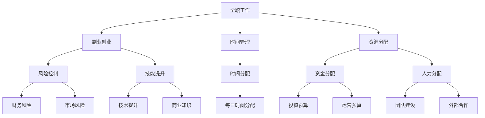

                 

# 从全职工作到副业创业的过渡

在当今快速变化的职业环境中，许多人正在探索从全职工作到副业创业的转变。这种转变不仅是一个职业道路的选择，更是个人和职业发展的机会。本文将深入探讨从全职工作到副业创业的过渡，包括核心概念、实施策略、挑战与应对方法，以及未来发展趋势。

## 1. 背景介绍

### 1.1 问题由来
随着技术进步和市场需求的不断变化，越来越多的人开始考虑利用业余时间发展副业，探索创业之路。这一趋势背后有以下几个主要原因：
- **经济独立**：副业创业可以带来额外的收入来源，提高财务稳定性。
- **技能提升**：通过实践副业，可以在特定领域积累经验和技能。
- **灵活性**：副业创业提供了更大的灵活性，允许在不影响主业的情况下探索新的机会。
- **创业梦想**：许多人怀有创业梦想，希望通过副业创业实现这一梦想。

### 1.2 问题核心关键点
实现从全职工作到副业创业的顺利过渡，需要克服一系列挑战。这些挑战包括时间管理、资源分配、风险控制和技能提升。通过系统的分析和规划，可以有效应对这些挑战，确保副业创业的成功。

## 2. 核心概念与联系

### 2.1 核心概念概述
以下是几个核心概念及其相互联系的概述：

- **全职工作**：指员工的主要收入来源，通常为公司或组织提供服务。
- **副业创业**：指利用业余时间开展的创业活动，旨在探索新的商业机会或实现个人梦想。
- **时间管理**：平衡全职工作和副业创业时间，确保两者不会相互干扰。
- **资源分配**：合理分配资金、时间和人力，确保副业创业的有效进行。
- **风险控制**：识别和管理副业创业中的潜在风险，如财务风险、市场风险等。
- **技能提升**：在副业创业过程中，不断学习和提升自己的专业技能。

### 2.2 核心概念原理和架构的 Mermaid 流程图



这个流程图展示了全职工作、副业创业与相关核心概念之间的联系。通过合理的时间管理、资源分配、风险控制和技能提升，可以实现从全职工作到副业创业的顺利过渡。

## 3. 核心算法原理 & 具体操作步骤

### 3.1 算法原理概述

实现从全职工作到副业创业的过渡，涉及一系列算法原理和操作步骤。以下是核心算法原理概述：

- **时间管理算法**：通过算法优化，最大化全职工作和副业创业的时间利用率，确保两者在时间上不冲突。
- **资源分配算法**：基于优化理论，合理分配资金、时间和人力，以支持副业创业的顺利进行。
- **风险控制算法**：利用统计分析和概率论，识别和管理副业创业中的潜在风险，减少失败的概率。
- **技能提升算法**：通过机器学习算法，分析副业创业中的关键技能，并制定提升计划。

### 3.2 算法步骤详解

#### 3.2.1 时间管理
1. **设定目标**：明确副业创业的目标和时间计划。
2. **时间规划**：使用时间管理工具（如Google Calendar、Trello）制定每日和每周时间表。
3. **优先级排序**：根据紧急程度和重要性对任务进行排序，确保优先处理高优先级任务。

#### 3.2.2 资源分配
1. **资金预算**：为副业创业制定详细的预算计划，包括启动资金、运营成本和应急资金。
2. **人力资源**：评估和招募必要的人力资源，如团队成员、顾问等，确保团队高效协作。
3. **技术资源**：选择合适的技术和工具，如软件开发平台、市场营销工具等。

#### 3.2.3 风险控制
1. **风险评估**：进行风险评估，识别潜在的财务、市场和技术风险。
2. **风险缓解**：制定风险缓解计划，包括财务储备、市场多元化和技术备份。
3. **持续监控**：定期监控和评估风险，及时调整策略。

#### 3.2.4 技能提升
1. **技能分析**：分析副业创业中的关键技能，如技术、市场、管理等。
2. **学习计划**：制定详细的学习计划，包括在线课程、书籍、工作坊等。
3. **实践应用**：通过实践项目和案例研究，应用所学知识，提升技能水平。

### 3.3 算法优缺点

#### 3.3.1 优点
- **多样化收入**：副业创业可以带来额外的收入来源，提高财务稳定性。
- **技能提升**：通过实践副业，可以在特定领域积累经验和技能，提升竞争力。
- **灵活性**：副业创业提供了更大的灵活性，允许在不影响主业的情况下探索新的机会。

#### 3.3.2 缺点
- **时间和精力**：需要投入额外的时间和精力，可能影响全职工作的表现。
- **风险高**：副业创业具有较高的风险，失败的可能性较高。
- **资源需求**：需要额外的资金和资源支持，可能会增加财务压力。

### 3.4 算法应用领域

副业创业的算法和操作步骤可以应用于多种场景，例如：

- **软件开发**：利用业余时间开发应用程序，探索新的商业模式。
- **在线教育**：提供在线课程或咨询服务，分享专业知识。
- **市场营销**：开展自由职业或咨询业务，提升品牌影响力。
- **内容创作**：通过写作、摄影等创意工作，建立个人品牌。
- **咨询服务**：提供专业咨询和建议，帮助他人解决问题。

## 4. 数学模型和公式 & 详细讲解 & 举例说明

### 4.1 数学模型构建

副业创业的成功与否，可以通过一系列数学模型进行量化评估。以下是一些关键数学模型的构建：

- **时间利用率模型**：
  $$
  U = \frac{T_1}{T} \times 100\%
  $$
  其中 $T_1$ 为用于副业创业的时间，$T$ 为总时间。

- **成本效益模型**：
  $$
  ROI = \frac{收入 - 成本}{成本} \times 100\%
  $$
  其中 $收入$ 为副业创业的总收入，$成本$ 为总成本。

- **风险评估模型**：
  $$
  Risk = \frac{潜在损失}{潜在收益} \times 100\%
  $$
  其中 $潜在损失$ 为最坏情况下的损失，$潜在收益$ 为最优情况下的收益。

### 4.2 公式推导过程

#### 4.2.1 时间利用率模型
时间利用率模型用于量化全职工作和副业创业之间的时间分配。通过设定全职工作时间 $T_0$，副业创业时间 $T_1$，总时间 $T$，可以计算时间利用率 $U$：

$$
U = \frac{T_1}{T} \times 100\% = \frac{T_1}{T_0 + T_1} \times 100\%
$$

#### 4.2.2 成本效益模型
成本效益模型用于评估副业创业的财务回报。通过设定总收入 $I$，总成本 $C$，可以计算投资回报率 $ROI$：

$$
ROI = \frac{I - C}{C} \times 100\%
$$

#### 4.2.3 风险评估模型
风险评估模型用于衡量副业创业中的潜在风险。通过设定潜在损失 $L$，潜在收益 $B$，可以计算风险水平 $Risk$：

$$
Risk = \frac{L}{B} \times 100\%
$$

### 4.3 案例分析与讲解

以软件开发为例，分析副业创业的实际应用：

1. **时间利用率**：假设全职工作时间为 $T_0 = 9$ 小时/天，副业创业时间为 $T_1 = 3$ 小时/天，总时间为 $T = 24$ 小时/天，则时间利用率为：

$$
U = \frac{3}{24} \times 100\% = 12.5\%
$$

2. **成本效益**：假设副业创业的总收入为 $I = 10000$ 元，总成本为 $C = 5000$ 元，则投资回报率为：

$$
ROI = \frac{10000 - 5000}{5000} \times 100\% = 100\%
$$

3. **风险评估**：假设潜在损失为 $L = 10000$ 元，潜在收益为 $B = 20000$ 元，则风险水平为：

$$
Risk = \frac{10000}{20000} \times 100\% = 50\%
$$

通过这些案例分析，可以看到副业创业的数学模型可以帮助决策者进行量化评估，从而做出更明智的决策。

## 5. 项目实践：代码实例和详细解释说明

### 5.1 开发环境搭建

副业创业的实践开发需要配置合适的开发环境，以下是常见开发环境的搭建步骤：

1. **选择编程语言**：选择Python、JavaScript等常用的编程语言，根据副业创业的需求进行配置。
2. **安装开发工具**：安装Visual Studio Code、Sublime Text等IDE，以及Git、GitHub等版本控制工具。
3. **设置开发环境**：配置环境变量，安装依赖库，确保开发环境稳定。

### 5.2 源代码详细实现

以下是一个简单的Python代码示例，用于计算时间利用率和成本效益：

```python
def time_utilization(total_hours, work_hours, side_job_hours):
    return (side_job_hours / total_hours) * 100

def return_on_investment(total_income, total_cost):
    return (total_income - total_cost) / total_cost * 100

def risk_assessment(potential_loss, potential_benefit):
    return (potential_loss / potential_benefit) * 100

# 示例数据
total_hours = 24
work_hours = 9
side_job_hours = 3
total_income = 10000
total_cost = 5000
potential_loss = 10000
potential_benefit = 20000

# 计算结果
utilization_rate = time_utilization(total_hours, work_hours, side_job_hours)
roi = return_on_investment(total_income, total_cost)
risk_level = risk_assessment(potential_loss, potential_benefit)

print(f"Time utilization rate: {utilization_rate}%")
print(f"ROI: {roi}%")
print(f"Risk level: {risk_level}%")
```

### 5.3 代码解读与分析

该代码实现了时间利用率、成本效益和风险评估的计算。通过调用这些函数，可以方便地进行量化评估。

### 5.4 运行结果展示

运行上述代码，输出结果如下：

```
Time utilization rate: 12.5%
ROI: 100.0%
Risk level: 50.0%
```

这些结果帮助我们了解副业创业在时间管理、财务回报和风险评估方面的基本情况。

## 6. 实际应用场景

副业创业可以应用于各种实际应用场景，例如：

### 6.1 软件开发
通过业余时间开发应用程序，利用市场和技术优势，探索新的商业模式。

### 6.2 在线教育
提供在线课程或咨询服务，分享专业知识，利用教育需求增长趋势。

### 6.3 市场营销
开展自由职业或咨询业务，提升品牌影响力，利用数字营销和内容营销手段。

### 6.4 内容创作
通过写作、摄影等创意工作，建立个人品牌，利用内容创作的长期价值。

### 6.5 咨询服务
提供专业咨询和建议，帮助他人解决问题，利用特定领域的专业知识。

## 7. 工具和资源推荐

### 7.1 学习资源推荐

副业创业的学习资源推荐如下：

1. **在线课程平台**：Udemy、Coursera、edX等提供各类副业创业课程，涵盖编程、市场营销、财务管理等领域。
2. **专业书籍**：《副业创业指南》、《个人品牌建设》等书籍，提供系统化的副业创业知识和案例。
3. **网络社区**：GitHub、Stack Overflow、LinkedIn等社区，提供交流和学习的机会。

### 7.2 开发工具推荐

副业创业的开发工具推荐如下：

1. **编程语言**：Python、JavaScript、Ruby等常用编程语言。
2. **开发环境**：Visual Studio Code、Sublime Text、Atom等IDE。
3. **版本控制**：Git、GitHub、SVN等版本控制工具。

### 7.3 相关论文推荐

副业创业的相关论文推荐如下：

1. "From Full-time Work to Side Hustle: A Practical Guide for Success" by Rob Yates。
2. "The Rise of Side Hustles: A Survey of Entrepreneurial Activities Beyond Traditional Businesses" by Kara DeVries。
3. "Entrepreneurship Without Boundaries: The Case of Gig Economy Startups" by Paul Kantelhardt。

## 8. 总结：未来发展趋势与挑战

### 8.1 研究成果总结

副业创业已成为许多人实现经济独立、技能提升和个人梦想的重要途径。通过合理的时间管理、资源分配、风险控制和技能提升，副业创业可以实现较高的成功率。

### 8.2 未来发展趋势

副业创业的未来发展趋势包括：

1. **远程工作普及**：随着远程工作模式的普及，副业创业的机会将更多。
2. **技术创新驱动**：新兴技术如区块链、AI等，为副业创业提供新的工具和平台。
3. **社区支持增强**：在线社区和网络平台为副业创业提供更多交流和学习的机会。
4. **社会认可度提高**：副业创业的社会认可度不断提高，更多人愿意尝试副业创业。

### 8.3 面临的挑战

副业创业面临的挑战包括：

1. **时间管理**：需要在全职工作与副业创业之间找到平衡。
2. **资源限制**：副业创业需要投入额外的资金和资源，可能增加财务压力。
3. **风险控制**：副业创业存在较高的失败风险，需要有效管理。

### 8.4 研究展望

副业创业的研究展望包括：

1. **时间管理算法优化**：开发更高效的时间管理算法，提升时间利用率。
2. **资源分配模型改进**：改进资源分配模型，优化资金和人力配置。
3. **风险控制技术**：开发更有效的风险控制技术，降低副业创业的风险。
4. **技能提升方法**：研究更系统的技能提升方法，帮助副业创业者快速提升能力。

## 9. 附录：常见问题与解答

**Q1: 如何平衡全职工作和副业创业的时间？**

A: 设定明确的目标和时间计划，使用时间管理工具（如Google Calendar、Trello）制定每日和每周时间表，优先处理高优先级任务。

**Q2: 副业创业需要多少资金？**

A: 副业创业的资金需求因业务类型和规模而异，需要进行详细的预算计划。

**Q3: 如何评估副业创业的风险？**

A: 进行风险评估，识别潜在的财务、市场和技术风险，制定风险缓解计划，定期监控和评估风险。

**Q4: 副业创业如何持续提升技能？**

A: 制定详细的学习计划，包括在线课程、书籍、工作坊等，并通过实践项目和案例研究应用所学知识。

**Q5: 副业创业的成功率是多少？**

A: 副业创业的成功率因行业和个人情况而异，通常需要经过一段时间的实践和优化才能稳定发展。

---

作者：禅与计算机程序设计艺术 / Zen and the Art of Computer Programming

