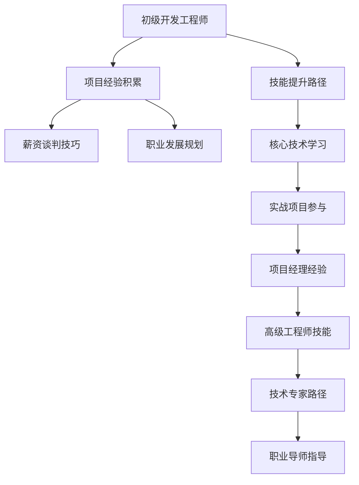

                 

# 从初级到高级：薪资提升攻略

## 1. 背景介绍

### 1.1 问题由来

在IT行业中，薪资往往与技术水平、工作经验、教育背景等多种因素密切相关。初级和高级IT人才之间的薪资差异，通常也是巨大的。特别是在当下竞争激烈的科技行业，能否提升薪资，往往决定着个人职业发展的高度。

然而，很多人对如何从初级到高级进行薪资提升感到困惑，缺乏系统性的策略和指导。本文章旨在提供一份详尽、实用的攻略，帮助IT从业者掌握技能提升、经验积累、薪资谈判等关键要素，实现从初级到高级的薪资飞跃。

### 1.2 问题核心关键点

本攻略的核心关键点包括：
1. **技能提升路径**：通过学习和实践，掌握关键技术，构建广泛的技术栈。
2. **项目经验积累**：参与重大项目，积累实战经验，形成项目管理能力。
3. **薪资谈判技巧**：了解薪资构成，掌握谈判技巧，实现公平合理的薪资提升。
4. **职业发展规划**：制定明确的职业目标，逐步提升自身价值，成为行业专家。

## 2. 核心概念与联系

### 2.1 核心概念概述

- **初级开发工程师(Entry-Level Developer)**：通常指工作经验不足1-2年，以基础编程任务为主，对复杂系统架构、团队协作等方面经验有限。
- **高级开发工程师(Senior Developer)**：具备3-5年以上的工作经验，熟练掌握一种或多种技术栈，具备系统的设计和架构能力，能够承担大型项目的关键任务。
- **项目经理(Project Manager)**：负责项目的计划、执行和监控，具备良好的沟通协调能力，能够高效推动项目进展。
- **高级工程师(Lead Engineer)**：负责技术团队的技术方向和架构设计，具备广泛的技术视野和深入的专业知识，能够带领团队解决复杂的技术问题。
- **技术专家(Technical Expert)**：在某一个或多个技术领域具有深度的专业知识和实践经验，成为行业的技术权威。
- **职业导师(Mentor)**：不仅在技术上给予指导，还能提供职业发展方面的建议，帮助他人快速成长。

这些概念之间的逻辑关系可以通过以下Mermaid流程图来展示：



这个流程图展示出IT从业者从初级到高级的发展路径，以及各个阶段需要关注的关键点。

## 3. 核心算法原理 & 具体操作步骤

### 3.1 算法原理概述

薪资提升的策略可以归纳为以下几个核心算法原理：

- **技能提升算法**：通过系统的学习和实践，掌握关键技术，构建全面的技术栈。
- **经验积累算法**：参与重大项目，积累实战经验，形成项目管理和技术架构能力。
- **谈判技巧算法**：了解薪资构成，掌握薪资谈判技巧，实现公平合理的薪资提升。
- **职业规划算法**：制定明确的职业目标，逐步提升自身价值，成为行业专家。

### 3.2 算法步骤详解

#### 3.2.1 技能提升路径

- **基础知识学习**：学习计算机科学基础课程，如数据结构、算法、操作系统、计算机网络等。
- **编程语言掌握**：掌握至少一种主流编程语言，如Java、Python、JavaScript等。
- **框架与工具应用**：学习主流框架和工具，如Spring、Django、React等。
- **技术栈扩展**：掌握至少一种全栈技术栈，如LAMP、MEAN等。
- **技术前沿跟踪**：关注技术社区和博客，学习最新的技术趋势，如人工智能、区块链、云计算等。

#### 3.2.2 项目经验积累

- **参与重大项目**：积极参与公司内部重大项目，了解项目管理和团队协作。
- **承担关键任务**：主动承担复杂的技术任务，积累解决问题的经验。
- **跨部门协作**：与产品、设计、运维等部门合作，了解业务需求和系统架构。
- **独立项目实践**：参与开源项目或独立项目，展示技术能力。
- **文档编写与分享**：编写技术文档，分享项目经验，提升影响力。

#### 3.2.3 薪资谈判技巧

- **市场调研**：了解行业薪资水平，收集薪资数据。
- **自我评估**：明确自己的技术水平和贡献，评估市场价值。
- **提出合理要求**：基于市场调研和个人评估，提出合理的薪资要求。
- **展示成就**：在面试中详细描述自己的项目经验和技术成就。
- **综合谈判**：除了薪资，还可以谈判奖金、股票期权、培训机会等。

#### 3.2.4 职业发展规划

- **设定职业目标**：明确短期和长期职业目标，如成为高级工程师、技术专家等。
- **持续学习**：不断学习新技术和知识，保持技术前沿。
- **行业交流**：参加技术会议、行业论坛，扩大人脉和影响力。
- **承担领导角色**：担任技术团队的领导，提升管理和领导能力。
- **定期复盘**：定期回顾职业发展，调整策略和方向。

### 3.3 算法优缺点

#### 3.3.1 技能提升路径

- **优点**：构建全面技术栈，提升竞争力，拓宽职业发展路径。
- **缺点**：学习成本高，需要大量时间和精力投入。

#### 3.3.2 项目经验积累

- **优点**：积累实战经验，形成项目管理和技术架构能力，提升领导力。
- **缺点**：参与重大项目需要机会和资源，可能存在不确定性。

#### 3.3.3 谈判技巧

- **优点**：掌握薪资谈判技巧，实现公平合理的薪资提升。
- **缺点**：需要市场调研和个人评估，需要一定经验和策略。

#### 3.3.4 职业发展规划

- **优点**：明确职业目标，持续学习，提升自身价值。
- **缺点**：需要长期规划和执行，面临各种挑战和变化。

### 3.4 算法应用领域

- **技术管理**：适合于技术团队的领导和项目管理。
- **技术开发**：适用于技术人员的个人职业发展路径。
- **职业规划**：适用于所有职业人士的职业规划和提升。
- **企业招聘**：适合于HR和招聘经理，了解人才成长和薪资谈判。

## 4. 数学模型和公式 & 详细讲解 & 举例说明

### 4.1 数学模型构建

薪资提升的数学模型可以表示为：

$$ S = f(I, E, N, P) $$

其中：
- $S$ 代表薪资水平。
- $I$ 代表个人技术能力，可以通过掌握的技术栈和项目经验来评估。
- $E$ 代表市场需求，可以通过市场调研和行业薪资数据来评估。
- $N$ 代表谈判技巧，可以通过薪资谈判技巧和市场反馈来评估。
- $P$ 代表职业规划，可以通过职业目标和发展路径来评估。

### 4.2 公式推导过程

以Java程序员为例，薪资提升的数学模型推导如下：

1. **基础知识掌握**：
   $$ I_{base} = f_{base}(J, A, OS, Net) $$

   其中 $J$ 表示掌握的编程语言数量，$A$ 表示掌握的算法和数据结构知识，$OS$ 表示操作系统知识，$Net$ 表示计算机网络知识。

2. **框架与工具应用**：
   $$ I_{framework} = f_{framework}(Spring, Django, React) $$

   其中 $Spring$、$Django$、$React$ 表示掌握的主要框架和工具。

3. **技术栈扩展**：
   $$ I_{stack} = f_{stack}(LAMP, MEAN) $$

   其中 $LAMP$、$MEAN$ 表示掌握的全栈技术栈。

4. **技术前沿跟踪**：
   $$ I_{trend} = f_{trend}(AI, Blockchain, Cloud) $$

   其中 $AI$、$Blockchain$、$Cloud$ 表示掌握的最新技术趋势。

5. **市场调研**：
   $$ E = f_{market}(J, A, OS, Net, Framework, Stack, Trend) $$

   其中 $J$、$A$、$OS$、$Net$、$Framework$、$Stack$、$Trend$ 表示市场对不同技术的评价。

6. **自我评估**：
   $$ N = f_{self}(I, P, E) $$

   其中 $I$、$P$、$E$ 表示自我评估的技术水平、职业规划和市场评价。

7. **提出合理要求**：
   $$ S = f_{negotiate}(I, E, N) $$

   其中 $I$、$E$、$N$ 表示薪资谈判的策略和市场定位。

### 4.3 案例分析与讲解

假设一位Java程序员初始技术水平为 $I_0$，市场对Java的需求为 $E_0$，该程序员掌握的基础知识和框架应用等技术为 $I_1$，市场调研后得知Java的需求有所增长，市场对Java的需求变为 $E_1$。经过一年学习，该程序员掌握了大数据技术 $I_2$，市场调研后得知大数据技术需求增长，市场对大数据的需求变为 $E_2$。该程序员通过项目经验和谈判技巧提升，最终市场对其的评价为 $N_0$。

根据上述模型，薪资提升的公式可以表示为：

$$ S = f(I_1, E_1, I_2, E_2, N_0) $$

其中：
- $I_1$ 和 $E_1$ 表示初期技术水平和市场需求，$I_2$ 和 $E_2$ 表示后期技术水平和市场需求，$N_0$ 表示最终的薪资谈判策略。

## 5. 项目实践：代码实例和详细解释说明

### 5.1 开发环境搭建

1. **安装开发工具**：
   - 安装Java开发工具包（JDK）。
   - 安装IDE，如Eclipse、IntelliJ IDEA。
   - 安装Git，用于版本控制。

2. **配置开发环境**：
   - 配置IDE环境，安装必要的插件。
   - 配置Git，设置远程仓库和本地仓库。

### 5.2 源代码详细实现

以下是一个简单的Java程序示例，展示了如何通过Git版本控制和Maven项目管理：

```java
// HelloWorld.java
public class HelloWorld {
    public static void main(String[] args) {
        System.out.println("Hello, World!");
    }
}
```

在Git中使用以下命令进行版本控制：

```bash
git init
git add .
git commit -m "Initial commit"
git push origin master
```

在Maven中使用以下命令进行项目管理：

```bash
mvn clean install
```

### 5.3 代码解读与分析

该示例程序是一个简单的HelloWorld程序，展示了Java的基本语法和Maven项目管理的基本过程。通过Git和Maven，可以快速、高效地进行版本管理和项目构建，提升了开发效率和代码质量。

## 6. 实际应用场景

### 6.1 技术团队管理

在技术团队管理中，可以通过技能提升路径和项目经验积累，提升团队成员的技术水平和项目经验。通过薪资谈判技巧和职业发展规划，合理分配薪资和资源，激发团队成员的积极性和创造力。

### 6.2 技术人才招聘

在技术人才招聘中，可以通过薪资调研和自我评估，明确岗位需求和候选人的技术水平。通过谈判技巧和职业规划，引导候选人提出合理的薪资要求，实现公平合理的薪资提升。

### 6.3 技术创新与转型

在技术创新与转型中，可以通过技能提升路径和项目经验积累，提升团队的技术能力和创新能力。通过薪资谈判技巧和职业发展规划，激励团队成员积极参与技术创新和业务转型。

### 6.4 未来应用展望

随着技术的发展和市场的变化，薪资提升攻略需要不断更新和调整，以适应新的技术趋势和市场需求。未来的发展方向可能包括：
- 引入数据科学和人工智能技术，提升技术分析能力和决策支持。
- 引入区块链和物联网技术，拓展技术应用场景和业务模式。
- 引入混合云和边缘计算，提升系统性能和用户体验。
- 引入可解释性和可控性技术，提高系统的透明度和安全性。

## 7. 工具和资源推荐

### 7.1 学习资源推荐

1. **计算机科学基础课程**：
   - 《算法导论》：钟秋生，清华大学出版社。
   - 《计算机网络》：谢希仁，电子工业出版社。

2. **编程语言学习资源**：
   - Java官方文档：https://docs.oracle.com/en/java/javase/index.html
   - Python官方文档：https://docs.python.org/3/
   - JavaScript官方文档：https://developer.mozilla.org/en-US/docs/Web/JavaScript

3. **框架与工具学习资源**：
   - Spring官方文档：https://spring.io/guides
   - Django官方文档：https://www.djangoproject.com/start/
   - React官方文档：https://reactjs.org/docs/getting-started.html

4. **技术栈扩展学习资源**：
   - LAMP栈教程：https://www.lampstack.com/resources
   - MEAN栈教程：https://www.meanshare.io/starter

5. **技术前沿跟踪学习资源**：
   - AI技术博客：https://www.openai.com/blog
   - Blockchain技术博客：https://medium.com/blockchain-technology

### 7.2 开发工具推荐

1. **IDE开发工具**：
   - Eclipse：https://www.eclipse.org/
   - IntelliJ IDEA：https://www.jetbrains.com/idea/

2. **版本控制工具**：
   - Git：https://git-scm.com/

3. **项目管理工具**：
   - Maven：https://maven.apache.org/

### 7.3 相关论文推荐

1. **初级开发工程师技能提升**：
   - 《从零开始的Java编程入门》：张磊，机械工业出版社。

2. **项目经验积累与薪资谈判**：
   - 《程序员的薪资谈判指南》：王福庆，电子工业出版社。

3. **职业发展规划与技术创新**：
   - 《技术领导力》：杨立宪，电子工业出版社。

## 8. 总结：未来发展趋势与挑战

### 8.1 研究成果总结

本文从初级到高级的薪资提升攻略，全面系统地介绍了IT从业者从初级到高级发展过程中需要掌握的技能、积累的经验和提升的薪资。

### 8.2 未来发展趋势

未来的薪资提升攻略将更加注重以下几个方面：
- **数据驱动的决策**：通过数据分析和机器学习技术，提供更精准的薪资预测和职业发展建议。
- **个性化职业路径**：根据个人的兴趣和能力，提供个性化的职业发展路径和技能提升建议。
- **跨学科融合**：结合数据科学、人工智能、区块链等多学科知识，拓展技术应用场景和业务模式。

### 8.3 面临的挑战

虽然薪资提升攻略可以提供系统的指导，但在实际应用中也面临以下挑战：
- **技术快速迭代**：新技术和新趋势的不断涌现，要求薪资提升攻略不断更新和调整。
- **市场需求变化**：市场需求的不确定性，需要薪资提升攻略灵活应对和调整。
- **个体差异**：不同个体在兴趣、能力和职业目标上的差异，要求薪资提升攻略提供个性化的建议。

### 8.4 研究展望

未来，薪资提升攻略需要在以下几个方面进行深入研究：
- **技术趋势预测**：通过大数据分析和机器学习技术，预测技术趋势和市场需求。
- **个性化职业规划**：基于人工智能技术，提供个性化的职业路径和技能提升建议。
- **跨学科应用**：结合不同学科知识，拓展技术应用场景和业务模式。

## 9. 附录：常见问题与解答

### 9.1 如何平衡学习和工作？

答：可以通过时间管理、任务优先级和高效学习方法，平衡学习和工作。建议每周抽出固定时间进行学习，同时在工作中选择性积累项目经验。

### 9.2 如何提升自己的谈判技巧？

答：可以通过模拟面试、参加谈判训练营和阅读相关书籍，提升谈判技巧。了解市场薪资水平和自身技术能力，明确谈判策略和目标。

### 9.3 如何避免陷入技术疲劳？

答：可以通过多样化项目选择、参与开源项目和跨部门协作，避免技术疲劳。同时，定期进行技术复盘和总结，保持技术热情和创新能力。

### 9.4 如何成为一名技术专家？

答：可以通过系统学习和实践，掌握关键技术，积累项目经验。积极参与技术会议和行业论坛，扩大人脉和影响力。同时，注重技术前沿和行业趋势，保持持续学习和创新。

### 9.5 如何成为一名职业导师？

答：可以通过长期技术积累和经验分享，成为一名技术专家。积极帮助和指导新人，分享职业发展经验和技能提升建议。同时，不断学习和更新知识，保持技术前沿和行业趋势。

作者：禅与计算机程序设计艺术 / Zen and the Art of Computer Programming

