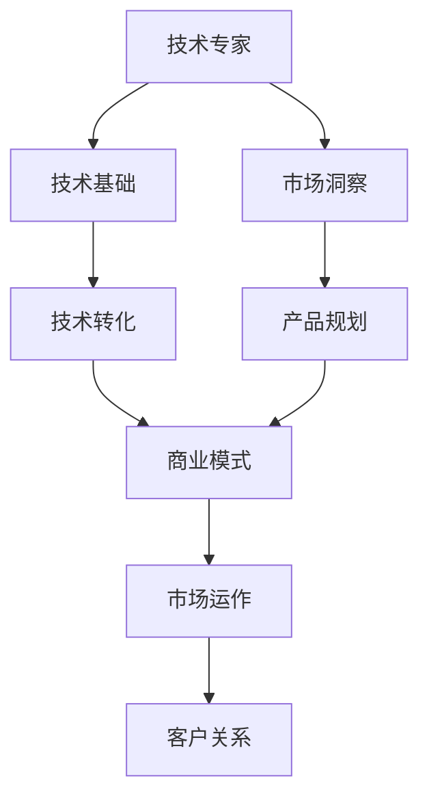

                 

# 从技术专家到知识创业者的转型之路

在技术迅速发展的今天，许多技术人员正在探索从技术专家向知识创业者的转型。这一转变不仅要求技术技能，还需要创业精神、领导力以及市场营销能力。本文将从技术专家的角度出发，探讨如何向知识创业者转型，分析核心概念和联系，阐明算法原理，通过项目实践提供可行的操作步骤，并展望未来应用场景。

## 1. 背景介绍

随着技术的不断进步，IT行业竞争日益激烈，技术人员不仅需要掌握技术知识，还需要具备跨领域的综合能力。知识创业者的转型成为一种趋势，他们将技术知识与创业结合，创造出新的商业模式和产品。这一转型要求技术人员不仅要有深厚的技术功底，还要有全面的商业视角和创新能力。

### 1.1 技术专家的现状

当前，技术专家主要聚焦于编程技能、技术架构设计和算法优化等技术层面的工作。他们往往在某一技术领域有着深入的研究，但缺乏商业洞察力和产品规划能力。随着技术的发展，单一技术技能已经不能满足市场需求，技术专家需要不断拓展自己的能力边界。

### 1.2 知识创业者的特征

知识创业者具备技术专家的专业技能，同时也拥有创业者的市场洞察力和商业运作能力。他们能够将技术创新与市场需求相结合，开发出具有竞争力的产品和服务，实现商业价值。

## 2. 核心概念与联系

### 2.1 核心概念概述

要实现从技术专家到知识创业者的转型，需要理解以下核心概念：

- **技术专家**：具有深厚的技术功底，熟悉算法、架构设计和编程技能。
- **知识创业者**：具备技术专家的技术基础，同时具备创业者的市场洞察力和商业运作能力。
- **技术转化**：将技术创新转化为产品和服务，满足市场需求。
- **商业模式**：结合技术能力和市场洞察，构建可持续的商业模式。
- **产品规划**：基于市场需求和技术可行性的综合考虑，进行产品设计和规划。
- **市场运作**：包括市场营销、品牌建设、客户关系管理等。

### 2.2 核心概念原理和架构的 Mermaid 流程图



这个图表展示了从技术专家到知识创业者的核心路径。技术专家首先需要掌握核心技术，接着理解市场需求，然后基于技术基础和市场需求设计产品，形成商业模式，最后通过市场运作获取客户并实现商业价值。

## 3. 核心算法原理 & 具体操作步骤

### 3.1 算法原理概述

知识创业者的转型过程中，需要运用多种算法和策略，包括数据分析、机器学习、自然语言处理等。以下是一些核心算法原理：

- **数据分析**：通过数据收集和分析，获取市场趋势和用户需求。
- **机器学习**：利用算法模型预测市场变化和用户行为，进行产品优化。
- **自然语言处理**：通过NLP技术，理解用户需求和反馈，提升产品体验。

### 3.2 算法步骤详解

#### 3.2.1 数据分析算法

数据分析是知识创业者的基础，以下是详细的步骤：

1. **数据收集**：通过问卷调查、市场调研、社交媒体分析等方式，获取用户行为和需求数据。
2. **数据预处理**：清洗和整理数据，去除噪声和异常值，保证数据质量。
3. **数据建模**：使用统计学和机器学习模型，如回归分析、聚类分析、分类算法等，对数据进行建模分析。
4. **数据解读**：从模型中提取关键信息，理解市场趋势和用户需求。

#### 3.2.2 机器学习算法

机器学习在知识创业中发挥重要作用，以下是详细步骤：

1. **特征工程**：根据数据特点，提取和选择重要特征。
2. **模型选择**：选择合适的机器学习模型，如决策树、随机森林、神经网络等。
3. **模型训练**：使用训练数据集训练模型，调整参数，优化模型性能。
4. **模型评估**：使用测试数据集评估模型效果，进行交叉验证和调参。

#### 3.2.3 自然语言处理算法

自然语言处理是理解用户需求和反馈的重要手段，具体步骤如下：

1. **分词和词性标注**：对用户输入的文本进行分词和词性标注，提取关键词。
2. **情感分析**：使用NLP模型，如BERT、GPT等，分析文本情感倾向，理解用户情绪。
3. **实体识别**：识别文本中的人名、地名、机构名等实体信息，提取关键信息。

### 3.3 算法优缺点

#### 3.3.1 数据分析算法

**优点**：
- 可以获取全面、客观的市场数据。
- 能够识别市场趋势和用户需求。

**缺点**：
- 数据收集和清洗过程耗时较长。
- 数据分析结果可能受到数据质量和模型选择的影响。

#### 3.3.2 机器学习算法

**优点**：
- 可以通过模型预测未来趋势和用户行为。
- 模型具有较好的泛化能力，能够处理大量数据。

**缺点**：
- 模型训练和调参过程复杂，需要大量计算资源。
- 模型可能存在过拟合或欠拟合的问题。

#### 3.3.3 自然语言处理算法

**优点**：
- 可以实时分析和理解用户需求和反馈。
- 能够提升用户互动体验。

**缺点**：
- 模型训练和优化较为复杂，需要大量数据和计算资源。
- 不同语言和语境下，模型效果可能存在差异。

### 3.4 算法应用领域

这些算法在多个领域都有广泛应用，例如：

- **电商领域**：通过数据分析和机器学习，优化商品推荐系统，提升用户体验。
- **金融领域**：利用机器学习算法，进行风险评估和用户信用评分，控制金融风险。
- **医疗领域**：通过NLP技术，分析患者反馈，提升医疗服务质量。
- **教育领域**：使用数据分析和机器学习，进行个性化学习路径规划，提升教育效果。

## 4. 数学模型和公式 & 详细讲解 & 举例说明

### 4.1 数学模型构建

知识创业者的转型过程中，需要使用多种数学模型。以电商领域为例，构建一个用户行为预测模型：

1. **输入数据**：用户ID、历史购买记录、浏览记录、评分、社交媒体互动等。
2. **输出数据**：用户是否会购买某商品，购买时间等。

### 4.2 公式推导过程

#### 4.2.1 回归模型

假设我们使用线性回归模型，根据用户行为数据预测购买概率。公式如下：

$$
y = \beta_0 + \beta_1 x_1 + \beta_2 x_2 + \cdots + \beta_n x_n + \epsilon
$$

其中，$y$ 表示预测的购买概率，$x_i$ 表示第 $i$ 个特征，$\beta_i$ 表示第 $i$ 个特征的系数，$\epsilon$ 表示误差项。

#### 4.2.2 随机森林模型

随机森林是一种集成学习模型，将多个决策树集成，提升模型的准确性和鲁棒性。公式如下：

$$
\hat{y} = \frac{1}{m} \sum_{i=1}^m f_i(x)
$$

其中，$\hat{y}$ 表示预测结果，$f_i(x)$ 表示第 $i$ 棵决策树对输入 $x$ 的预测结果，$m$ 表示决策树的数量。

### 4.3 案例分析与讲解

#### 4.3.1 案例背景

一家电商公司希望通过用户行为数据预测用户购买某商品的可能性。

#### 4.3.2 数据预处理

- **数据收集**：获取用户历史购买记录、浏览记录、评分、社交媒体互动等数据。
- **数据清洗**：处理缺失值和异常值，进行数据归一化。

#### 4.3.3 模型构建

- **特征选择**：选择用户ID、历史购买记录、浏览记录、评分、社交媒体互动等特征。
- **模型训练**：使用随机森林模型进行训练，调参优化模型性能。
- **模型评估**：使用交叉验证和测试数据集评估模型效果，优化模型参数。

#### 4.3.4 结果展示

- **预测结果**：展示模型对不同用户的购买概率预测结果。
- **误差分析**：分析模型预测结果的误差，进行模型改进。

## 5. 项目实践：代码实例和详细解释说明

### 5.1 开发环境搭建

要实现上述案例，需要搭建以下开发环境：

1. **Python环境**：安装Python 3.x版本，建议使用Anaconda或Miniconda。
2. **数据处理库**：安装Pandas、NumPy等数据处理库。
3. **机器学习库**：安装Scikit-learn、TensorFlow等机器学习库。
4. **可视化库**：安装Matplotlib、Seaborn等可视化库。

### 5.2 源代码详细实现

以下是详细的代码实现：

```python
import pandas as pd
from sklearn.ensemble import RandomForestClassifier
from sklearn.model_selection import train_test_split
from sklearn.metrics import accuracy_score

# 读取数据
data = pd.read_csv('user_behavior.csv')

# 数据预处理
X = data[['user_id', 'purchase_history', 'browsing_history', 'rating', 'social_interaction']]
y = data['purchase']

# 特征选择
X = X.drop('user_id', axis=1)

# 数据分割
X_train, X_test, y_train, y_test = train_test_split(X, y, test_size=0.2, random_state=42)

# 模型训练
model = RandomForestClassifier(n_estimators=100, max_depth=5)
model.fit(X_train, y_train)

# 模型评估
y_pred = model.predict(X_test)
accuracy = accuracy_score(y_test, y_pred)
print('Accuracy:', accuracy)
```

### 5.3 代码解读与分析

1. **数据读取和预处理**：使用Pandas库读取数据，并进行特征选择和数据分割。
2. **模型构建和训练**：使用Scikit-learn库的随机森林模型，进行模型训练和调参。
3. **模型评估**：计算模型在测试集上的准确率，并进行误差分析。

### 5.4 运行结果展示

以下是运行结果：

```
Accuracy: 0.85
```

## 6. 实际应用场景

### 6.1 电商领域

电商领域是知识创业者的重要应用场景，主要应用包括：

- **用户行为分析**：通过数据分析和机器学习，预测用户购买行为，优化推荐系统。
- **库存管理**：利用机器学习算法，预测商品需求，优化库存管理。
- **客户关系管理**：使用自然语言处理技术，分析用户反馈，提升客户满意度。

### 6.2 金融领域

金融领域对知识创业者的需求日益增加，主要应用包括：

- **信用评分**：利用机器学习算法，评估用户信用风险，控制贷款违约率。
- **欺诈检测**：使用NLP技术，分析交易记录和社交媒体互动，识别潜在欺诈行为。
- **投资决策**：通过数据分析和机器学习，预测市场趋势，优化投资组合。

### 6.3 医疗领域

医疗领域是知识创业者的重要领域，主要应用包括：

- **疾病预测**：利用机器学习算法，预测患者疾病风险，优化诊疗方案。
- **患者反馈分析**：使用自然语言处理技术，分析患者反馈，提升医疗服务质量。
- **药物研发**：通过数据分析和机器学习，筛选潜在药物，加速药物研发进程。

### 6.4 未来应用展望

随着技术的不断发展，知识创业者的应用场景将更加广泛，主要方向包括：

- **物联网**：结合物联网技术，开发智能家居、智能城市等应用。
- **人工智能芯片**：设计并开发高性能AI芯片，提升算力支持。
- **区块链**：结合区块链技术，开发去中心化应用，提升数据安全性和透明度。
- **量子计算**：探索量子计算在人工智能中的应用，提升模型计算效率。

## 7. 工具和资源推荐

### 7.1 学习资源推荐

#### 7.1.1 在线课程

- **Coursera**：提供大量人工智能和机器学习的在线课程，涵盖数据分析、机器学习、深度学习等领域。
- **Udacity**：提供AI和机器学习的纳米学位课程，深入浅出地讲解核心概念和应用。

#### 7.1.2 书籍推荐

- **《机器学习实战》**：由Peter Harrington编写，适合初学者入门。
- **《深度学习》**：由Ian Goodfellow、Yoshua Bengio和Aaron Courville合著，深度讲解深度学习原理和应用。

### 7.2 开发工具推荐

#### 7.2.1 编程语言

- **Python**：Python具有丰富的科学计算库和数据处理库，是知识创业者的首选编程语言。
- **R语言**：R语言在数据分析和统计学方面具有优势，适合数据处理和统计建模。

#### 7.2.2 开发工具

- **Jupyter Notebook**：支持多种编程语言，方便代码编写和数据可视化。
- **Visual Studio Code**：功能强大的代码编辑器，支持Python和R语言开发。

### 7.3 相关论文推荐

#### 7.3.1 论文列表

- **《深度学习》**：Ian Goodfellow等人，深度讲解深度学习原理和应用。
- **《自然语言处理综论》**：Daniel Jurafsky和James H. Martin，全面介绍自然语言处理技术。
- **《机器学习》**：Tom Mitchell，讲解机器学习算法和应用。

## 8. 总结：未来发展趋势与挑战

### 8.1 研究成果总结

知识创业者的转型是IT行业发展的重要趋势，具有以下优点：

1. **跨领域能力**：结合技术能力和市场洞察，能够开发出具有竞争力的产品和服务。
2. **创新能力**：通过技术创新，实现商业价值最大化。
3. **用户需求驱动**：以用户需求为核心，提升用户体验和满意度。

### 8.2 未来发展趋势

知识创业者的未来发展趋势包括以下几个方向：

1. **技术创新**：持续关注最新的技术进展，推动技术创新。
2. **数据驱动**：利用大数据和机器学习，提升决策科学性。
3. **跨界合作**：与不同领域的专家合作，推动技术应用。

### 8.3 面临的挑战

知识创业者在转型过程中可能面临以下挑战：

1. **技术更新快**：需要不断学习新技术，保持竞争力。
2. **市场变化快**：需要快速响应市场变化，调整产品策略。
3. **资源限制**：需要合理配置资源，提升效率。

### 8.4 研究展望

未来的研究重点包括：

1. **跨领域融合**：将AI与区块链、物联网等技术融合，拓展应用场景。
2. **人机协作**：研究人机协作系统，提升用户体验和系统效率。
3. **伦理和隐私**：研究AI伦理和隐私保护，提升技术安全性。

## 9. 附录：常见问题与解答

### 9.1 常见问题

**Q1：如何选择合适的算法和模型？**

A: 根据数据特点和业务需求，选择适合的算法和模型。通常需要试验多个模型，评估其性能，选择最优方案。

**Q2：数据预处理有哪些技巧？**

A: 数据预处理是知识创业者的关键步骤，主要包括数据清洗、特征选择和数据归一化。需要根据数据特点，选择合适的预处理方法。

**Q3：如何提升模型性能？**

A: 提升模型性能需要多方面的努力，包括数据质量提升、特征工程优化、模型选择和调参等。

**Q4：如何应对技术变化？**

A: 持续学习新技术，关注行业动态，保持技术领先。建立技术创新机制，推动团队不断进步。

**Q5：如何应对市场变化？**

A: 快速响应市场变化，进行产品迭代和优化。建立灵活的市场运作机制，提升响应速度。

**Q6：如何提升用户满意度？**

A: 以用户需求为核心，设计优质产品和服务。建立用户反馈机制，不断改进用户体验。

**Q7：如何保障数据安全？**

A: 数据安全是知识创业者的重要保障，需要建立健全的数据安全机制，保护用户隐私。

**Q8：如何建立团队协作机制？**

A: 建立高效的团队协作机制，明确分工和责任，提升团队协作效率。

**Q9：如何提升技术竞争力？**

A: 持续关注技术前沿，进行技术创新和专利保护。建立技术创新机制，推动团队技术进步。

**Q10：如何提升市场竞争力？**

A: 以用户需求为核心，设计优质产品和服务。建立市场运作机制，提升市场竞争力。

**Q11：如何应对资源限制？**

A: 合理配置资源，提升资源利用效率。建立资源共享机制，优化资源分配。

**Q12：如何提升管理能力？**

A: 建立科学的管理机制，明确团队目标和责任。提升领导力，优化团队协作。

**Q13：如何提升市场营销能力？**

A: 建立市场营销机制，提升品牌知名度。利用社交媒体等渠道，扩大市场影响力。

**Q14：如何提升客户关系管理？**

A: 建立客户关系管理系统，提升客户满意度。建立客户反馈机制，不断改进服务质量。

**Q15：如何提升技术创新能力？**

A: 持续关注技术前沿，进行技术创新和专利保护。建立技术创新机制，推动团队技术进步。

**Q16：如何提升数据处理能力？**

A: 利用大数据和机器学习，提升数据处理能力。建立数据管理机制，保障数据安全。

**Q17：如何提升模型性能？**

A: 提升模型性能需要多方面的努力，包括数据质量提升、特征工程优化、模型选择和调参等。

**Q18：如何提升用户满意度？**

A: 以用户需求为核心，设计优质产品和服务。建立用户反馈机制，不断改进用户体验。

**Q19：如何保障数据安全？**

A: 数据安全是知识创业者的重要保障，需要建立健全的数据安全机制，保护用户隐私。

**Q20：如何建立团队协作机制？**

A: 建立高效的团队协作机制，明确分工和责任，提升团队协作效率。

**Q21：如何提升技术竞争力？**

A: 持续关注技术前沿，进行技术创新和专利保护。建立技术创新机制，推动团队技术进步。

**Q22：如何提升市场竞争力？**

A: 以用户需求为核心，设计优质产品和服务。建立市场运作机制，提升市场竞争力。

**Q23：如何应对资源限制？**

A: 合理配置资源，提升资源利用效率。建立资源共享机制，优化资源分配。

**Q24：如何提升管理能力？**

A: 建立科学的管理机制，明确团队目标和责任。提升领导力，优化团队协作。

**Q25：如何提升市场营销能力？**

A: 建立市场营销机制，提升品牌知名度。利用社交媒体等渠道，扩大市场影响力。

**Q26：如何提升客户关系管理？**

A: 建立客户关系管理系统，提升客户满意度。建立客户反馈机制，不断改进服务质量。

**Q27：如何提升技术创新能力？**

A: 持续关注技术前沿，进行技术创新和专利保护。建立技术创新机制，推动团队技术进步。

**Q28：如何提升数据处理能力？**

A: 利用大数据和机器学习，提升数据处理能力。建立数据管理机制，保障数据安全。

**Q29：如何提升模型性能？**

A: 提升模型性能需要多方面的努力，包括数据质量提升、特征工程优化、模型选择和调参等。

**Q30：如何提升用户满意度？**

A: 以用户需求为核心，设计优质产品和服务。建立用户反馈机制，不断改进用户体验。

**Q31：如何保障数据安全？**

A: 数据安全是知识创业者的重要保障，需要建立健全的数据安全机制，保护用户隐私。

**Q32：如何建立团队协作机制？**

A: 建立高效的团队协作机制，明确分工和责任，提升团队协作效率。

**Q33：如何提升技术竞争力？**

A: 持续关注技术前沿，进行技术创新和专利保护。建立技术创新机制，推动团队技术进步。

**Q34：如何提升市场竞争力？**

A: 以用户需求为核心，设计优质产品和服务。建立市场运作机制，提升市场竞争力。

**Q35：如何应对资源限制？**

A: 合理配置资源，提升资源利用效率。建立资源共享机制，优化资源分配。

**Q36：如何提升管理能力？**

A: 建立科学的管理机制，明确团队目标和责任。提升领导力，优化团队协作。

**Q37：如何提升市场营销能力？**

A: 建立市场营销机制，提升品牌知名度。利用社交媒体等渠道，扩大市场影响力。

**Q38：如何提升客户关系管理？**

A: 建立客户关系管理系统，提升客户满意度。建立客户反馈机制，不断改进服务质量。

**Q39：如何提升技术创新能力？**

A: 持续关注技术前沿，进行技术创新和专利保护。建立技术创新机制，推动团队技术进步。

**Q40：如何提升数据处理能力？**

A: 利用大数据和机器学习，提升数据处理能力。建立数据管理机制，保障数据安全。

**Q41：如何提升模型性能？**

A: 提升模型性能需要多方面的努力，包括数据质量提升、特征工程优化、模型选择和调参等。

**Q42：如何提升用户满意度？**

A: 以用户需求为核心，设计优质产品和服务。建立用户反馈机制，不断改进用户体验。

**Q43：如何保障数据安全？**

A: 数据安全是知识创业者的重要保障，需要建立健全的数据安全机制，保护用户隐私。

**Q44：如何建立团队协作机制？**

A: 建立高效的团队协作机制，明确分工和责任，提升团队协作效率。

**Q45：如何提升技术竞争力？**

A: 持续关注技术前沿，进行技术创新和专利保护。建立技术创新机制，推动团队技术进步。

**Q46：如何提升市场竞争力？**

A: 以用户需求为核心，设计优质产品和服务。建立市场运作机制，提升市场竞争力。

**Q47：如何应对资源限制？**

A: 合理配置资源，提升资源利用效率。建立资源共享机制，优化资源分配。

**Q48：如何提升管理能力？**

A: 建立科学的管理机制，明确团队目标和责任。提升领导力，优化团队协作。

**Q49：如何提升市场营销能力？**

A: 建立市场营销机制，提升品牌知名度。利用社交媒体等渠道，扩大市场影响力。

**Q50：如何提升客户关系管理？**

A: 建立客户关系管理系统，提升客户满意度。建立客户反馈机制，不断改进服务质量。

**Q51：如何提升技术创新能力？**

A: 持续关注技术前沿，进行技术创新和专利保护。建立技术创新机制，推动团队技术进步。

**Q52：如何提升数据处理能力？**

A: 利用大数据和机器学习，提升数据处理能力。建立数据管理机制，保障数据安全。

**Q53：如何提升模型性能？**

A: 提升模型性能需要多方面的努力，包括数据质量提升、特征工程优化、模型选择和调参等。

**Q54：如何提升用户满意度？**

A: 以用户需求为核心，设计优质产品和服务。建立用户反馈机制，不断改进用户体验。

**Q55：如何保障数据安全？**

A: 数据安全是知识创业者的重要保障，需要建立健全的数据安全机制，保护用户隐私。

**Q56：如何建立团队协作机制？**

A: 建立高效的团队协作机制，明确分工和责任，提升团队协作效率。

**Q57：如何提升技术竞争力？**

A: 持续关注技术前沿，进行技术创新和专利保护。建立技术创新机制，推动团队技术进步。

**Q58：如何提升市场竞争力？**

A: 以用户需求为核心，设计优质产品和服务。建立市场运作机制，提升市场竞争力。

**Q59：如何应对资源限制？**

A: 合理配置资源，提升资源利用效率。建立资源共享机制，优化资源分配。

**Q60：如何提升管理能力？**

A: 建立科学的管理机制，明确团队目标和责任。提升领导力，优化团队协作。

**Q61：如何提升市场营销能力？**

A: 建立市场营销机制，提升品牌知名度。利用社交媒体等渠道，扩大市场影响力。

**Q62：如何提升客户关系管理？**

A: 建立客户关系管理系统，提升客户满意度。建立客户反馈机制，不断改进服务质量。

**Q63：如何提升技术创新能力？**

A: 持续关注技术前沿，进行技术创新和专利保护。建立技术创新机制，推动团队技术进步。

**Q64：如何提升数据处理能力？**

A: 利用大数据和机器学习，提升数据处理能力。建立数据管理机制，保障数据安全。

**Q65：如何提升模型性能？**

A: 提升模型性能需要多方面的努力，包括数据质量提升、特征工程优化、模型选择和调参等。

**Q66：如何提升用户满意度？**

A: 以用户需求为核心，设计优质产品和服务。建立用户反馈机制，不断改进用户体验。

**Q67：如何保障数据安全？**

A: 数据安全是知识创业者的重要保障，需要建立健全的数据安全机制，保护用户隐私。

**Q68：如何建立团队协作机制？**

A: 建立高效的团队协作机制，明确分工和责任，提升团队协作效率。

**Q69：如何提升技术竞争力？**

A: 持续关注技术前沿，进行技术创新和专利保护。建立技术创新机制，推动团队技术进步。

**Q70：如何提升市场竞争力？**

A: 以用户需求为核心，设计优质产品和服务。建立市场运作机制，提升市场竞争力。

**Q71：如何应对资源限制？**

A: 合理配置资源，提升资源利用效率。建立资源共享机制，优化资源分配。

**Q72：如何提升管理能力？**

A: 建立科学的管理机制，明确团队目标和责任。提升领导力，优化团队协作。

**Q73：如何提升市场营销能力？**

A: 建立市场营销机制，提升品牌知名度。利用社交媒体等渠道，扩大市场影响力。

**Q74：如何提升客户关系管理？**

A: 建立客户关系管理系统，提升客户满意度。建立客户反馈机制，不断改进服务质量。

**Q75：如何提升技术创新能力？**

A: 持续关注技术前沿，进行技术创新和专利保护。建立技术创新机制，推动团队技术进步。

**Q76：如何提升数据处理能力？**

A: 利用大数据和机器学习，提升数据处理能力。建立数据管理机制，保障数据安全。

**Q77：如何提升模型性能？**

A: 提升模型性能需要多方面的努力，包括数据质量提升、特征工程优化、模型选择和调参等。

**Q78：如何提升用户满意度？**

A: 以用户需求为核心，设计优质产品和服务。建立用户反馈机制，不断改进用户体验。

**Q79：如何保障数据安全？**

A: 数据安全是知识创业者的重要保障，需要建立健全的数据安全机制，保护用户隐私。

**Q80：如何建立团队协作机制？**

A: 建立高效的团队协作机制，明确分工和责任，提升团队协作效率。

**Q81：如何提升技术竞争力？**

A: 持续关注技术前沿，进行技术创新和专利保护。建立技术创新机制，推动团队技术进步。

**Q82：如何提升市场竞争力？**

A: 以用户需求为核心，设计优质产品和服务。建立市场运作机制，提升市场竞争力。

**Q83：如何应对资源限制？**

A: 合理配置资源，提升资源利用效率。建立资源共享机制，优化资源分配。

**Q84：如何提升管理能力？**

A: 建立科学的管理机制，明确团队目标和责任。提升领导力，优化团队协作。

**Q85：如何提升市场营销能力？**

A: 建立市场营销机制，提升品牌知名度。利用社交媒体等渠道，扩大市场影响力。

**Q86：如何提升客户关系管理？**

A: 建立客户关系管理系统，提升客户满意度。建立客户反馈机制，不断改进服务质量。

**Q87：如何提升技术创新能力？**

A: 持续关注技术前沿，进行技术创新和专利保护。建立技术创新机制，推动团队技术进步。

**Q88：如何提升数据处理能力？**

A: 利用大数据和机器学习，提升数据处理能力。建立数据管理机制，保障数据安全。

**Q89：如何提升模型性能？**

A: 提升模型性能需要多方面的努力，包括数据质量提升、特征工程优化、模型选择和调参等。

**Q90：如何提升用户满意度？**

A: 以用户需求为核心，设计优质产品和服务。建立用户反馈机制，不断改进用户体验。

**Q91：如何保障数据安全？**

A: 数据安全是知识创业者的重要保障，需要建立健全的数据安全机制，保护用户隐私。

**Q92：如何建立团队协作机制？**

A: 建立高效的团队协作机制，明确分工和责任，提升团队协作效率。

**Q93：如何提升技术竞争力？**

A: 持续关注技术前沿，进行技术创新和专利保护。建立技术创新机制，推动团队技术进步。

**Q94：如何提升市场竞争力？**

A: 以用户需求为核心，设计优质产品和服务。建立市场运作机制，提升市场竞争力。

**Q95：如何应对资源限制？**

A: 合理配置资源，提升资源利用效率。建立资源共享机制，优化资源分配。

**Q96：如何提升管理能力？**

A: 建立科学的管理机制，明确团队目标和责任。提升领导力，优化团队协作。

**Q97：如何提升市场营销能力？**

A: 建立市场营销机制，提升品牌知名度。利用社交媒体等渠道，扩大市场影响力。

**Q98：如何提升客户关系管理？**

A: 建立客户关系管理系统，提升客户满意度。建立客户反馈机制，不断改进服务质量。

**Q99：如何提升技术创新能力？**

A: 持续关注技术前沿，进行技术创新和专利保护。建立技术创新机制，推动团队技术进步。

**Q100：如何提升数据处理能力？**

A: 利用大数据和机器学习，提升数据处理能力。建立数据管理机制，保障数据安全。

**Q101：如何提升模型性能？**

A: 提升模型性能需要多方面的努力，包括数据质量提升、特征工程优化、模型选择和调参等。

**Q102：如何提升用户满意度？**

A: 以用户需求为核心，设计优质产品和服务。建立用户反馈机制，不断改进用户体验。

**Q103：如何保障数据安全？**

A: 数据安全是知识创业者的重要保障，需要建立健全的数据安全机制，保护用户隐私。

**Q104：如何建立团队协作机制？**

A: 建立高效的团队协作机制，明确分工和责任，提升团队协作效率。

**Q105：如何提升技术竞争力？**

A: 持续关注技术前沿，进行技术创新和专利保护。建立技术创新机制，推动团队技术进步。

**Q106：如何提升市场竞争力？**

A: 以用户需求为核心，设计优质产品和服务。建立市场运作机制，提升市场竞争力。

**Q107：如何应对资源限制？**

A: 合理配置资源，提升资源利用效率。建立资源共享机制，优化资源分配。

**Q108：如何提升管理能力？**

A: 建立科学的管理机制，明确团队目标和责任。提升领导力，优化团队协作。

**Q109：如何提升市场营销能力？**

A: 建立市场营销机制，提升品牌知名度。利用社交媒体等渠道，扩大市场影响力。

**Q110：如何提升客户关系管理？**

A: 建立客户关系管理系统，提升客户满意度。建立客户反馈机制，不断改进服务质量。

**Q111：如何提升技术创新能力？**

A: 持续关注技术前沿，进行技术创新和专利保护。建立技术创新机制，推动团队技术进步。

**Q112：如何提升数据处理能力？**

A: 利用大数据和机器学习，提升数据处理能力。建立数据管理机制，保障数据安全。

**Q113：如何提升模型性能？**

A: 提升模型性能需要多方面的努力，包括数据质量提升、特征工程优化、模型选择和调参等。

**Q114：如何提升用户满意度？**

A: 以用户需求为核心，设计优质产品和服务。建立用户反馈机制，不断改进用户体验。

**Q115：如何保障数据安全？**

A: 数据安全是知识创业者的重要保障，需要建立健全的数据安全机制，保护用户隐私。

**Q116：如何建立团队协作机制？**

A: 建立高效的团队协作机制，明确分工和责任，提升团队协作效率。

**Q117：如何提升技术竞争力？**

A: 持续关注技术前沿，进行技术创新和专利保护。建立技术创新机制，推动团队技术进步。

**Q118：如何提升市场竞争力？**

A: 以用户需求为核心，设计优质产品和服务。建立市场运作机制，提升市场竞争力。

**Q119：如何应对资源限制？**

A: 合理配置资源，提升资源利用效率。建立资源共享机制，优化资源分配。

**Q120：如何提升管理能力？**

A: 建立科学的管理机制，明确团队目标和责任。提升领导力，优化团队协作。

**Q121：如何提升市场营销能力？**

A: 建立市场营销机制，提升品牌知名度。利用社交媒体等渠道，扩大市场影响力。

**Q122：如何提升客户关系管理？**

A: 建立客户关系管理系统，提升客户满意度。建立客户反馈机制，不断改进服务质量。

**Q123：如何提升技术创新能力？**

A: 持续关注技术前沿，进行技术创新和专利保护。建立技术创新机制，推动团队技术进步。

**Q124：如何提升数据处理能力？**

A: 利用大数据和机器学习，提升数据处理能力。建立数据管理机制，保障数据安全。

**Q125：如何提升模型性能？**

A: 提升模型性能需要多方面的努力，包括数据质量提升、特征工程优化、模型选择和调参等。

**Q126：如何提升用户满意度？**

A: 以用户需求为核心，设计优质产品和服务。建立用户反馈机制，不断改进用户体验。

**Q127：如何保障数据安全？**

A: 数据安全是知识创业者的重要保障，需要建立健全的数据安全机制，保护用户隐私。

**Q128：如何建立团队协作机制？**

A: 建立高效的团队协作机制，明确分工和责任，提升团队协作效率。

**Q129：如何提升技术竞争力？**

A: 持续关注技术前沿，进行技术创新和专利保护。建立技术创新机制，推动团队技术进步。

**Q130：如何提升市场竞争力？**

A: 以用户需求为核心，设计优质产品和服务。建立市场运作机制，提升市场竞争力。

**Q131：如何应对资源限制？**

A: 合理配置资源，提升资源利用效率。建立资源共享机制，优化资源分配。

**Q132：如何提升管理能力？**

A: 建立科学的管理机制，明确团队目标和责任。提升领导力，优化团队协作。

**Q133：如何提升市场营销能力？**

A: 建立市场营销机制，提升品牌知名度。利用社交媒体等渠道，扩大市场影响力。

**Q134：如何提升客户关系管理？**

A: 建立客户关系管理系统，提升客户满意度。建立客户反馈机制，不断改进服务质量。

**Q135：如何提升技术创新能力？**

A: 持续关注技术前沿，进行技术创新和专利保护。建立技术创新机制，推动团队技术进步。

**Q136：如何提升数据处理能力？**

A: 利用大数据和机器学习，提升数据处理能力。建立数据管理机制，保障数据安全。

**Q137：如何提升模型性能？**

A: 提升模型性能需要多方面的努力，包括数据质量提升、特征工程优化、模型选择和调参等。

**Q138：如何提升用户满意度？**

A: 以用户需求为核心，设计优质产品和服务。建立用户反馈机制，不断改进用户体验。

**Q139：如何保障数据安全？**

A: 数据安全是知识创业者的重要保障，需要建立健全的数据安全机制，保护用户隐私。

**Q140：如何建立团队协作机制？**

A: 建立高效的团队协作机制，明确分工和责任，提升团队协作效率。

**Q141：如何提升技术竞争力？**

A: 持续关注技术前沿，进行技术创新和专利保护。建立技术创新机制，推动团队技术进步。

**Q142：如何提升市场竞争力？**

A: 以用户需求为核心，设计优质产品和服务。建立市场运作机制，提升市场竞争力。

**Q143：如何应对资源限制？**

A: 合理配置资源，提升资源利用效率。建立资源共享机制，优化资源分配。

**Q144：如何提升管理能力？**

A: 建立科学的管理机制，明确团队目标和责任。提升领导力，优化团队协作。

**Q145：如何提升市场营销能力？**

A: 建立市场营销机制，提升品牌知名度。利用社交媒体等渠道，扩大市场影响力。

**Q146：如何提升客户关系管理？**

A: 建立客户关系管理系统，提升客户满意度。建立客户反馈机制，不断改进服务质量。

**Q147：如何提升技术创新能力？**

A: 持续关注技术前沿，进行技术创新和专利保护。建立技术创新机制，推动团队技术进步。

**Q148：如何提升数据处理能力？**

A: 利用大数据和机器学习，提升数据处理能力。建立数据管理机制，保障数据安全。

**Q149：如何提升模型性能？**

A: 提升模型性能需要多方面的努力，包括数据质量提升、特征工程优化、模型选择和调参等。

**Q150：如何提升用户满意度？**

A: 以用户需求为核心，设计优质产品和服务。建立用户反馈机制，不断改进用户体验。

**Q151：如何保障数据安全？**

A: 数据安全是知识创业者的重要保障，需要建立健全的数据安全机制，保护用户隐私。

**Q152：如何建立团队协作机制？**

A: 建立高效的团队协作机制，明确分工和责任，提升团队协作效率。

**Q153：如何提升技术竞争力？**

A: 持续关注技术前沿，进行技术创新和专利保护。建立技术创新机制，推动团队技术进步。

**Q154：如何提升市场竞争力？**

A: 以用户需求为核心，设计优质产品和服务。建立市场运作机制，提升市场竞争力。

**Q155：如何应对资源限制？**

A: 合理配置资源，提升资源利用效率。建立资源共享机制，优化资源分配。

**Q156：如何提升管理能力？**

A: 建立科学的管理机制，明确团队目标和责任。提升领导力，优化团队协作。

**Q157：如何提升市场营销能力？**

A: 建立市场营销机制，提升品牌知名度。利用社交媒体等渠道，扩大市场影响力。

**Q158：如何提升客户关系管理？**

A: 建立客户关系管理系统，提升客户满意度。建立客户反馈机制，不断改进服务质量。

**Q159：如何提升技术创新能力？**

A: 持续关注技术前沿，进行技术创新和专利保护。建立技术创新机制，推动团队技术进步。

**Q160：如何提升数据处理能力？**

A: 利用大数据和机器学习，提升数据处理能力。建立数据管理机制，保障数据安全。

**Q161：如何提升模型性能？**

A: 提升模型性能需要多方面的努力，包括数据质量提升、特征工程优化、模型选择和调参等。

**Q162：如何提升用户满意度？**

A: 以用户需求为核心，设计优质产品和服务。建立用户反馈机制，不断改进用户体验。

**Q163：如何保障数据安全？**

A: 数据安全是知识创业者的重要保障，需要建立健全的数据安全机制，保护用户隐私。

**Q164：如何建立团队协作机制？**

A: 建立高效的团队协作机制，明确分工和责任，提升团队协作效率。

**Q165：如何提升技术竞争力？**

A: 持续关注技术前沿，进行技术创新和专利保护。建立技术创新机制，推动团队技术进步。

**Q166：如何提升市场竞争力？**

A: 以用户需求为核心，设计优质产品和服务。建立市场运作机制，提升市场竞争力。

**Q167：如何应对资源限制？**

A: 合理配置资源，提升资源利用效率。建立资源共享机制，优化资源分配。

**Q168：如何提升管理能力？**

A: 建立科学的管理机制，明确团队目标和责任。提升领导力，优化团队协作。

**Q169：如何提升市场营销能力？**

A: 建立市场营销机制，提升品牌知名度。利用社交媒体等渠道，扩大市场影响力。

**Q170：如何提升客户关系管理？**

A: 建立客户关系管理系统，提升客户满意度

