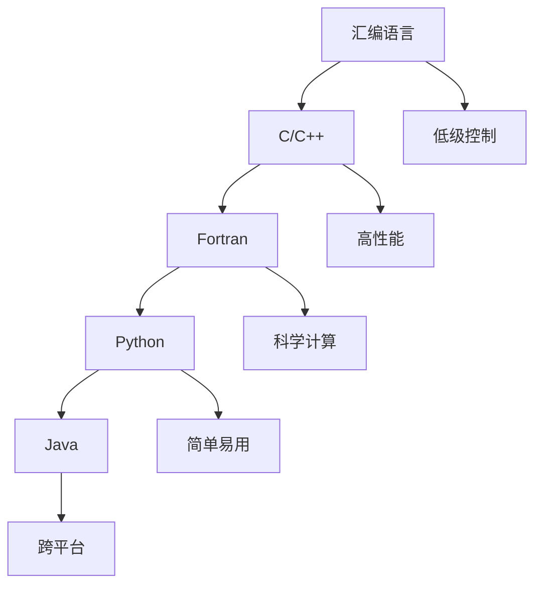

                 

## 1. 背景介绍

编程语言是AI开发中不可或缺的工具。选择正确的编程语言不仅能够提高开发效率，还能确保算法的可维护性和可扩展性。在AI领域，从早期的汇编语言到现代的Python，编程语言的演变历程反映了技术发展和社会需求的变化。本文将探讨AI开发中常用的编程语言，分析它们的优势和适用场景，帮助开发者选择最适合自己的语言。

## 2. 核心概念与联系

### 2.1 核心概念概述

- **汇编语言(Assembly Language)**：与机器语言紧密相关，能够直接控制计算机硬件资源。早期的AI研究者使用汇编语言进行底层优化，但开发效率低下，难度较高。
- **C/C++**：作为高性能语言，C/C++广泛用于系统软件、硬件驱动和性能要求较高的应用。由于其低级特性，AI开发者也常用于构建高性能计算和算法实现。
- **Fortran**：主要用于科学计算，支持大规模矩阵和向量运算，常用于数值模拟和信号处理等领域。
- **Python**：作为一种高级动态语言，Python具有简单、易读、易用等特点，在科学计算、机器学习和数据科学等领域广泛应用。
- **Java**：具有跨平台性和丰富的类库，适用于大型企业和系统级别的AI应用。

### 2.2 核心概念原理和架构的 Mermaid 流程图



这个流程图展示了从汇编语言到Python的演变路径，并说明了每一种语言的特性。

## 3. 核心算法原理 & 具体操作步骤

### 3.1 算法原理概述

AI开发中，编程语言的选择往往取决于算法实现的复杂度、数据处理的需求和系统的部署环境。以下是对常用编程语言的算法原理概述：

- **汇编语言**：低级编程，直接控制CPU寄存器、内存操作和硬件中断，适用于底层优化和高性能计算。
- **C/C++**：支持指针、动态内存分配和复杂数据结构，广泛应用于高性能算法和系统级软件的开发。
- **Fortran**：基于数组运算，适合数值计算和科学工程应用，支持并行和分布式计算。
- **Python**：高层次语言，支持动态类型和垃圾回收，适合快速原型开发和数据科学任务。
- **Java**：面向对象语言，具有自动内存管理和跨平台特性，适用于大型企业和分布式系统。

### 3.2 算法步骤详解

以Python为例，简述AI开发中常见的算法步骤：

1. **数据预处理**：使用NumPy库进行数据加载、清洗和预处理，如归一化、特征提取和分词等。
2. **模型构建**：利用TensorFlow或PyTorch框架搭建神经网络或机器学习模型，定义损失函数和优化器。
3. **训练和评估**：在GPU或TPU上训练模型，使用验证集评估模型性能，并进行超参数调优。
4. **部署和测试**：将训练好的模型部署到生产环境中，使用测试集评估模型表现，并进行微调。

### 3.3 算法优缺点

- **汇编语言**：
  - 优点：接近硬件，高效性高，适合底层优化。
  - 缺点：编程难度大，开发周期长，可读性差。

- **C/C++**：
  - 优点：性能优越，系统控制能力强，库丰富。
  - 缺点：语法复杂，易出错，开发效率低。

- **Fortran**：
  - 优点：科学计算能力强，编译速度快，支持并行。
  - 缺点：应用范围窄，学习曲线陡峭。

- **Python**：
  - 优点：简单易学，开发效率高，库生态丰富。
  - 缺点：执行速度慢，不适合高计算要求。

- **Java**：
  - 优点：跨平台性好，开发规范，企业级支持。
  - 缺点：性能略逊于C/C++，开发复杂。

### 3.4 算法应用领域

- **汇编语言**：主要应用于系统优化、嵌入式设备开发和底层算法实现。
- **C/C++**：广泛用于高性能计算、网络协议栈、游戏开发和图形处理。
- **Fortran**：常用于气象模拟、物理模拟和科学计算。
- **Python**：适用于数据科学、机器学习、自然语言处理和Web开发。
- **Java**：适用于大型企业系统、云计算和分布式应用。

## 4. 数学模型和公式 & 详细讲解 & 举例说明

### 4.1 数学模型构建

在AI开发中，数学模型是核心。以下是一个典型的神经网络模型构建过程：

1. **输入层**：定义输入数据的维度和类型，如MxN的二维数组。
2. **隐藏层**：定义神经元的数量和激活函数，如ReLU、Sigmoid等。
3. **输出层**：定义输出数据的类型，如分类任务使用softmax函数。
4. **损失函数**：定义模型预测和真实标签之间的差异，如交叉熵损失。
5. **优化器**：定义模型参数更新的规则，如梯度下降、Adam等。

### 4.2 公式推导过程

以简单的线性回归模型为例，推导损失函数和梯度公式：

假设输入数据为 $x$，输出为 $y$，模型参数为 $\theta$，则线性回归模型的预测值为 $y=\theta x$。

- **损失函数**：均方误差损失，公式为 $L(y,\hat{y})=\frac{1}{2N}\sum_{i=1}^N(y_i-\hat{y}_i)^2$。
- **梯度公式**：使用反向传播求导，得到 $\frac{\partial L}{\partial \theta}=\frac{1}{N}\sum_{i=1}^N(x_i-\bar{x})(y_i-\hat{y}_i)$，其中 $\bar{x}=\frac{1}{N}\sum_{i=1}^N x_i$。

### 4.3 案例分析与讲解

以TensorFlow框架为例，说明如何使用Python实现线性回归模型：

```python
import tensorflow as tf

# 定义输入和输出
x = tf.placeholder(tf.float32, shape=[None, 1])
y = tf.placeholder(tf.float32, shape=[None, 1])

# 定义模型参数
theta = tf.Variable(tf.zeros([1, 1]))

# 定义模型输出
y_hat = tf.matmul(x, theta)

# 定义损失函数
loss = tf.reduce_mean(tf.square(y - y_hat))

# 定义优化器
optimizer = tf.train.GradientDescentOptimizer(0.01).minimize(loss)

# 训练模型
with tf.Session() as sess:
    sess.run(tf.global_variables_initializer())
    for i in range(1000):
        sess.run(optimizer, feed_dict={x: X, y: y})

# 评估模型
X = [[1], [2], [3]]
y_true = [[1], [2], [3]]
y_pred = sess.run(y_hat, feed_dict={x: X})
print("预测值：", y_pred)
```

通过以上代码，可以看出Python在AI开发中的简洁性和易用性。

## 5. 项目实践：代码实例和详细解释说明

### 5.1 开发环境搭建

以下是Python开发环境的基本搭建步骤：

1. 安装Anaconda：从官网下载并安装Anaconda，创建虚拟环境。
2. 激活虚拟环境：
```bash
source activate py38
```

3. 安装Python库：
```bash
conda install numpy scipy matplotlib scikit-learn tensorflow pytorch jupyter
```

4. 测试安装：
```python
import numpy as np
import tensorflow as tf
```

### 5.2 源代码详细实现

以MNIST手写数字识别为例，使用Python和TensorFlow实现：

```python
import tensorflow as tf

# 加载MNIST数据集
mnist = tf.keras.datasets.mnist
(x_train, y_train), (x_test, y_test) = mnist.load_data()

# 数据预处理
x_train = x_train / 255.0
x_test = x_test / 255.0

# 定义模型
model = tf.keras.Sequential([
    tf.keras.layers.Flatten(input_shape=(28, 28)),
    tf.keras.layers.Dense(128, activation='relu'),
    tf.keras.layers.Dense(10)
])

# 编译模型
model.compile(optimizer='adam',
              loss=tf.keras.losses.SparseCategoricalCrossentropy(from_logits=True),
              metrics=['accuracy'])

# 训练模型
model.fit(x_train, y_train, epochs=10, validation_data=(x_test, y_test))

# 评估模型
test_loss, test_acc = model.evaluate(x_test,  y_test, verbose=2)
print('测试集损失：', test_loss)
print('测试集准确率：', test_acc)
```

### 5.3 代码解读与分析

1. **数据预处理**：使用`tf.keras.datasets.mnist.load_data()`加载MNIST数据集，并对其进行归一化处理。
2. **模型定义**：使用`tf.keras.Sequential`定义一个简单的全连接神经网络，包括一个输入层、一个隐藏层和一个输出层。
3. **模型编译**：使用`model.compile()`编译模型，指定优化器、损失函数和评价指标。
4. **模型训练**：使用`model.fit()`训练模型，传入训练集和验证集数据。
5. **模型评估**：使用`model.evaluate()`评估模型性能，输出测试集损失和准确率。

## 6. 实际应用场景

### 6.1 智能推荐系统

智能推荐系统广泛用于电商、社交媒体和视频网站，通过预测用户兴趣推荐商品、内容和视频。使用Python和TensorFlow可以实现高效的推荐算法，如协同过滤、矩阵分解和深度学习等。

### 6.2 自然语言处理

自然语言处理(NLP)包括文本分类、情感分析、机器翻译和聊天机器人等任务。Python拥有丰富的NLP库，如NLTK、SpaCy和Gensim等，可以方便地实现各种NLP任务。

### 6.3 计算机视觉

计算机视觉包括图像识别、目标检测和视频分析等任务。使用Python和OpenCV可以实现高效的图像处理和分析，如边缘检测、特征提取和目标识别等。

### 6.4 未来应用展望

未来AI开发中将涌现更多高性能计算框架和语言，如JAX、PyTorch Lightning、Chainer等。这些框架提供了更高效的数学库和分布式计算能力，助力AI开发者快速构建高性能模型。

## 7. 工具和资源推荐

### 7.1 学习资源推荐

- **Python官方文档**：详细的Python语言和标准库文档。
- **TensorFlow官方文档**：TensorFlow框架的详细文档和示例代码。
- **PyTorch官方文档**：PyTorch框架的详细文档和教程。
- **Kaggle**：机器学习竞赛平台，提供大量开源数据集和算法实现。
- **Coursera**：在线教育平台，提供AI和机器学习课程。

### 7.2 开发工具推荐

- **Anaconda**：Python和科学计算环境的搭建工具。
- **Jupyter Notebook**：交互式编程和数据科学工具，支持Python、R和MATLAB等。
- **PyCharm**：Python开发工具，提供代码补全、调试和测试功能。
- **Visual Studio Code**：轻量级代码编辑器，支持Python和多种扩展。

### 7.3 相关论文推荐

- **Deep Learning with Python**：Ian Goodfellow等著，全面介绍了深度学习和Python编程技巧。
- **Hands-On Machine Learning with Scikit-Learn, Keras, and TensorFlow**：Aurélien Géron著，介绍了Scikit-Learn和TensorFlow在实际应用中的使用。
- **Python Machine Learning**：Sebastian Raschka著，介绍了Python在机器学习中的应用。

## 8. 总结：未来发展趋势与挑战

### 8.1 研究成果总结

编程语言的选择是AI开发中的重要决策。选择正确的编程语言能够提高开发效率和算法性能。本文介绍了常见编程语言的特性和适用场景，通过具体案例分析了AI开发中的数学模型构建和算法步骤。

### 8.2 未来发展趋势

- **动态语言**：动态语言如Python和JavaScript将逐步取代静态语言，成为AI开发的主流。
- **高性能计算框架**：如JAX、PyTorch Lightning等，将提供更高效的数学库和分布式计算能力，助力AI开发者构建高性能模型。
- **AI专用编程语言**：未来可能会出现更多AI专用编程语言，如MAGMA和XLA，加速AI算法开发。

### 8.3 面临的挑战

- **编程语言的多样性**：开发者需要掌握多种编程语言和工具，增加了学习成本。
- **编程语言的性能**：低级语言如汇编和C++在高性能计算中仍占有一席之地。
- **编程语言的生态系统**：缺乏统一的生态系统，导致开发者在不同工具间切换成本高。

### 8.4 研究展望

未来AI开发需要更多跨学科的合作，推动编程语言和工具的标准化。同时，研究更多高性能计算方法和工具，提升AI算法的执行效率。

## 9. 附录：常见问题与解答

**Q1: 汇编语言在AI开发中还有用吗？**

A: 汇编语言在AI开发中主要应用于底层优化和高性能计算，如GPU和硬件加速器的驱动开发。但对于一般的应用开发，汇编语言的难度较大，不推荐使用。

**Q2: 为什么Python在AI开发中如此流行？**

A: Python具有简单、易读、易用的特点，拥有丰富的科学计算和机器学习库，如NumPy、SciPy和TensorFlow等，大大简化了AI开发过程。

**Q3: C/C++在AI开发中还有用吗？**

A: C/C++在AI开发中主要用于系统软件和底层算法的实现，其高性能和系统控制能力使其在特定场景下仍然有其独特的优势。

**Q4: Fortran在AI开发中还有用吗？**

A: Fortran在科学计算和数值模拟中仍然有其重要地位，但其应用范围相对较窄，逐渐被Python等高级语言取代。

**Q5: Java在AI开发中还有用吗？**

A: Java具有跨平台性和丰富的类库，适用于大型企业和分布式系统的开发。但由于其性能略逊于C/C++，主要用于后台服务和企业级应用。

作者：禅与计算机程序设计艺术 / Zen and the Art of Computer Programming

