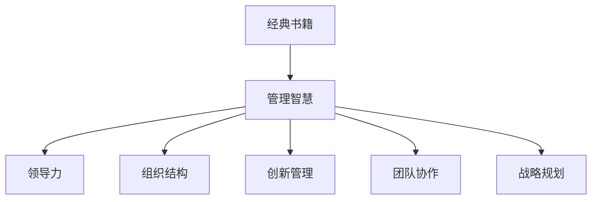

                 

# 从经典书籍中汲取管理智慧

> 关键词：经典书籍, 管理智慧, 领导力, 创新思维, 组织结构, 人力资源, 战略规划

## 1. 背景介绍

### 1.1 问题由来
在当今信息爆炸的时代，管理知识和智慧的获取不再局限于传统的教科书和学术论文，经典书籍成为了更多管理者和领导者获取洞见的宝贵资源。然而，如何从这些经典的书籍中有效提取和应用管理智慧，真正转化为提升组织绩效的行动方案，成为了现代管理者面临的重要挑战。

### 1.2 问题核心关键点
经典书籍中所蕴含的管理智慧，通常涉及组织行为、领导风格、决策制定、创新管理、团队协作等多个方面。这些知识不仅能提升个体的管理能力，还能帮助企业构建更加稳健、高效的组织体系。因此，如何在繁忙的工作之余，高效阅读和应用经典书籍，成为提高管理水平的关键。

### 1.3 问题研究意义
研究如何从经典书籍中汲取管理智慧，对提升管理者的领导力和组织绩效，推动企业可持续发展具有重要意义：

1. **提升领导力**：经典书籍中的领导力模型和案例分析，能帮助管理者学习如何激发团队潜能，引领组织向前发展。
2. **优化组织结构**：经典管理理论中关于组织设计的讨论，能为管理者提供结构优化和流程改进的思路。
3. **增强创新能力**：经典书籍中关于创新思维的探讨，能够启发管理者如何在激烈竞争的市场中不断创新。
4. **强化团队协作**：经典书籍中关于团队合作的理论，能够帮助管理者构建更加高效和谐的团队。
5. **制定战略规划**：经典书籍中的战略管理理论，能为企业制定中长期发展战略提供有力支持。

本文旨在系统介绍如何从经典书籍中汲取管理智慧，结合现代管理实践，提供实际可行的操作路径。

## 2. 核心概念与联系

### 2.1 核心概念概述

为更好地理解如何从经典书籍中获取管理智慧，本节将介绍几个关键的管理概念：

- **经典书籍**：指那些在管理领域经过时间检验，具有深远影响的著作。如彼得·德鲁克的《卓有成效的管理者》、迈克尔·波特的《竞争战略》等。
- **管理智慧**：指从经典书籍中提取的管理理论、实践经验、思想观念等，能够指导现代管理实践的洞见和知识。
- **领导力**：管理者通过个人品质、知识技能和行为对下属施加影响的能力。
- **组织结构**：组织内部的部门划分、层级设置、权力分配等要素构成的系统。
- **创新管理**：通过创造性思维、鼓励试错和跨学科合作等手段，推动企业不断创新。
- **团队协作**：多个个体为了共同目标而协同工作的过程。
- **战略规划**：企业在长期发展过程中制定目标和策略的思考和行动过程。

这些核心概念之间的逻辑关系可以通过以下Mermaid流程图来展示：



这个流程图展示了几大核心概念之间的关系：

1. 经典书籍是管理智慧的源泉。
2. 管理智慧涵盖领导力、组织结构、创新管理等多个维度。
3. 管理智慧通过实践落地，转化为领导者的行为和决策。
4. 管理智慧在组织结构设计、团队协作、战略规划等方面得到应用。

## 3. 核心算法原理 & 具体操作步骤
### 3.1 算法原理概述

从经典书籍中汲取管理智慧的过程，本质上是一个系统化的知识应用和实践迭代过程。其核心思想是：将经典书籍中的管理理论、案例分析和成功经验，通过思考、学习和实践，转化为提升管理绩效的具体行动方案。

形式化地，假设有一本经典管理书籍 $B$，包含若干个章节 $C_i$，每个章节包含若干个知识点 $K_j$。读者 $R$ 通过阅读和思考，将这些知识点应用到实际管理实践中，即：

$$
\text{Action} = \text{Apply}(B.C_i.K_j, \text{Context})
$$

其中 $\text{Context}$ 表示读者所在组织的实际情况和需求。通过反复实践和迭代，读者 $R$ 逐步提升管理能力，优化管理实践。

### 3.2 算法步骤详解

基于上述原理，从经典书籍中汲取管理智慧一般包括以下几个关键步骤：

**Step 1: 选择经典书籍和章节**
- 根据组织发展的需要，选择一本或多本经典管理书籍作为阅读对象。
- 根据当前管理实践的具体问题，选择需要深入阅读的章节。

**Step 2: 阅读和笔记**
- 仔细阅读选定的章节，标注关键观点和理论。
- 记录读后感，思考如何将这些知识应用到实际工作中。

**Step 3: 分析和实践**
- 结合自身工作经验和组织实际情况，分析经典书籍中的理论和方法。
- 设计具体的实践方案，如领导力培训、流程优化、团队建设等。
- 制定实施计划，逐步执行。

**Step 4: 反思和改进**
- 定期回顾实践效果，评估管理效果提升情况。
- 总结成功经验和教训，持续改进。

**Step 5: 分享和传播**
- 与团队分享学习心得和实践经验。
- 通过内部培训、讲座等方式传播管理智慧。

以上是汲取管理智慧的一般流程。在实际应用中，还需要根据具体问题和情境，灵活调整步骤和实施策略。

### 3.3 算法优缺点

从经典书籍中汲取管理智慧的方法，具有以下优点：

1. **系统性**：经典书籍中的管理理论具有系统性，能够帮助管理者构建全面的管理框架。
2. **深入性**：经典书籍往往通过深入分析和具体案例，揭示了管理实践的深层规律。
3. **可操作性**：通过实际案例和成功经验，经典书籍提供了具体的操作方法，易于执行。
4. **启发灵感**：经典书籍中的思维方式和创新方法，能激发管理者的创造力，推动管理创新。

同时，该方法也存在一定的局限性：

1. **时效性不足**：经典书籍往往无法涵盖最新的管理实践和趋势。
2. **个性化要求高**：不同组织有不同的需求和特点，经典书籍中的方法不一定完全适用。
3. **实践难度高**：应用经典书籍中的理论需要高水平的管理技能和经验。
4. **可能出现误用**：对经典理论的误解或滥用，可能导致实践效果不佳。

尽管存在这些局限性，但经典书籍中的管理智慧仍然是提升管理水平的重要资源。通过合理运用，可以帮助管理者在复杂多变的环境中，找到行之有效的管理策略和方法。

### 3.4 算法应用领域

从经典书籍中汲取管理智慧的方法，适用于各个层级的管理者和各类组织，包括：

- **高层管理者**：通过学习经典书籍中的战略规划和领导力理论，提升决策水平和团队管理能力。
- **中层管理者**：通过优化组织结构和团队协作方法，提升运营效率和团队士气。
- **基层管理者**：通过具体的操作方法和案例分析，提升日常工作中的管理技巧和问题解决能力。

此外，经典书籍中的管理智慧也在非营利组织、政府部门、教育机构等各类组织中得到广泛应用。

## 4. 数学模型和公式 & 详细讲解 & 举例说明
### 4.1 数学模型构建

本节将使用数学语言对从经典书籍中汲取管理智慧的过程进行更加严格的刻画。

假设读者 $R$ 从经典书籍 $B$ 中选择一个章节 $C_i$，其中包含 $K_j$ 个知识点。读者通过阅读和思考，将这些知识点 $K_j$ 应用到实际管理实践 $\text{Context}$ 中，即：

$$
\text{Action} = \text{Apply}(B.C_i.K_j, \text{Context})
$$

其中 $\text{Context}$ 表示读者所在组织的实际情况和需求。

### 4.2 公式推导过程

以迈克尔·波特的《竞争战略》为例，推导从书中汲取管理智慧的数学模型。

波特提出了“五力模型”，用于分析行业竞争结构和企业的竞争优势。读者可以将其应用到自身的管理实践中，通过以下公式推导：

$$
P = F_1 + F_2 + F_3 + F_4 + F_5
$$

其中 $P$ 为企业的市场份额，$F_i$ 分别为供应商议价能力、买家议价能力、替代品威胁、新进入者威胁和现有竞争者的竞争程度。

通过以上公式，读者可以识别出组织所处的竞争环境，评估外部环境对企业的影响，进而制定相应的战略和应对措施。

### 4.3 案例分析与讲解

假设某企业希望通过应用波特的五力模型，评估其在新市场中的竞争地位。企业通过以下步骤进行：

1. **收集数据**：收集供应商、买家、替代品、新进入者和现有竞争者的相关信息。
2. **计算各力度的权重**：根据行业特点和组织实际情况，对各力量进行权重分配。
3. **评估影响程度**：对每个力度的影响程度进行评估，包括威胁程度和优势程度。
4. **综合分析**：将各力度的权重与影响程度相乘，加总得到市场份额 $P$。
5. **制定策略**：根据计算出的市场份额 $P$，制定相应的市场进入策略或产品优化策略。

通过这样的分析过程，企业能够更加系统地理解和应对市场竞争环境，从而提升其竞争力和市场地位。

## 5. 项目实践：代码实例和详细解释说明
### 5.1 开发环境搭建

在进行管理智慧汲取实践前，我们需要准备好开发环境。以下是使用Python进行数据分析和管理实践的环境配置流程：

1. 安装Anaconda：从官网下载并安装Anaconda，用于创建独立的Python环境。

2. 创建并激活虚拟环境：
```bash
conda create -n pymanagement python=3.8 
conda activate pymanagement
```

3. 安装必要的工具包：
```bash
conda install pandas numpy matplotlib jupyter notebook
```

4. 安装相关管理软件和平台（如HR系统、CRM系统等）：
```bash
conda install --channel conda-forge openpyxl h2py
```

完成上述步骤后，即可在`pymanagement`环境中开始管理实践的开发和应用。

### 5.2 源代码详细实现

下面我们以绩效管理系统的开发为例，给出使用Python进行数据分析和管理实践的代码实现。

首先，定义绩效管理系统的数据处理函数：

```python
import pandas as pd
import numpy as np

def load_data(file_path):
    return pd.read_csv(file_path)

def preprocess_data(data):
    # 数据清洗，处理缺失值、异常值等
    data.fillna(method='ffill', inplace=True)
    data = data.dropna()
    return data

def analyze_performance(data):
    # 分析绩效数据，计算平均值、标准差等
    avg_performance = data['performance'].mean()
    std_performance = data['performance'].std()
    return avg_performance, std_performance

# 示例数据
data = load_data('performance_data.csv')
data = preprocess_data(data)

avg_performance, std_performance = analyze_performance(data)
print(f"平均绩效: {avg_performance:.2f}, 标准差: {std_performance:.2f}")
```

然后，定义绩效管理系统的主要模块：

```python
class PerformanceManagementSystem:
    def __init__(self, data):
        self.data = data
        
    def calculate_performance(self, salary, bonus, overtime):
        # 计算绩效
        performance = salary + bonus + overtime * 1.5
        return performance
        
    def analyze(self, salary, bonus, overtime):
        # 分析绩效
        performance = self.calculate_performance(salary, bonus, overtime)
        return performance

    def update_performance(self, salary, bonus, overtime, performance):
        # 更新绩效数据
        self.data['performance'] = performance
        self.data.to_csv('updated_performance_data.csv', index=False)

# 示例代码
pm = PerformanceManagementSystem(data)
performance = pm.calculate_performance(10000, 2000, 10)
pm.update_performance(10000, 2000, 10, performance)
```

最后，实现一个简单的Web界面，用于输入和展示绩效数据：

```python
from flask import Flask, request, render_template

app = Flask(__name__)

@app.route('/', methods=['GET', 'POST'])
def index():
    if request.method == 'POST':
        salary = float(request.form['salary'])
        bonus = float(request.form['bonus'])
        overtime = float(request.form['overtime'])
        performance = calculate_performance(salary, bonus, overtime)
        return render_template('index.html', performance=performance)
    else:
        return render_template('index.html')

if __name__ == '__main__':
    app.run(debug=True)
```

### 5.3 代码解读与分析

让我们再详细解读一下关键代码的实现细节：

**load_data和preprocess_data函数**：
- `load_data`函数：从指定路径读取CSV文件，返回Pandas DataFrame格式的数据。
- `preprocess_data`函数：对数据进行清洗，包括处理缺失值和异常值，保证数据的质量和一致性。

**analyze_performance函数**：
- 计算绩效数据的平均值和标准差，提供绩效的基本统计分析。

**PerformanceManagementSystem类**：
- `__init__`方法：初始化系统，接收数据集作为参数。
- `calculate_performance`方法：根据输入的薪资、奖金和加班工资计算绩效。
- `analyze`方法：对绩效进行分析和展示。
- `update_performance`方法：更新绩效数据，并保存到CSV文件中。

**Web界面示例代码**：
- 使用Flask框架搭建Web应用，实现对绩效数据的计算和展示。
- 当用户提交表单时，调用`calculate_performance`函数计算绩效，并通过`render_template`函数展示结果。

可以看到，通过结合数据分析和Web开发，管理者可以直观地展示和操作绩效数据，提升管理效率和透明度。

## 6. 实际应用场景
### 6.1 人力资源管理

人力资源管理是组织管理中不可或缺的部分。通过从经典书籍中汲取管理智慧，管理者可以更加系统地进行人力资源规划、招聘、培训和绩效管理。

在人力资源管理中，波特的“五力模型”可以用于分析行业竞争力和企业的市场定位，从而制定更科学的人才引进和培养策略。经典书籍中的领导力理论，如约翰·马克斯威尔的《领导力21法则》，也能帮助管理者提升领导力和团队士气。

### 6.2 项目管理

项目管理是确保项目按时、按质、按预算完成的重要管理活动。通过学习经典项目管理书籍，管理者可以更好地掌握项目计划、进度控制、资源分配等关键环节。

例如，通过阅读《项目管理的五大过程》等书籍，管理者可以系统了解项目管理的五大过程（启动、计划、执行、监控、收尾），提升项目管理的系统性和规范性。

### 6.3 企业文化建设

企业文化是组织的核心竞争力之一。通过从经典书籍中汲取管理智慧，管理者可以更加有效地塑造和推广企业文化。

经典书籍中的组织行为理论，如埃德加·沙因的《组织文化与领导力》，能够帮助管理者构建富有凝聚力的企业文化。同时，通过学习经典领导力书籍，管理者可以提升自身的领导力和文化影响力。

### 6.4 未来应用展望

随着管理实践的不断演进，经典书籍中的管理智慧也将不断得到验证和应用。未来，基于经典书籍的管理智慧将与现代管理技术深度融合，提升管理实践的科学性和实效性。

在智能管理领域，通过数据驱动的管理分析和决策支持系统，将经典管理理论应用到实际问题中，能大幅提升管理决策的精确性和时效性。在数字化转型的背景下，经典管理智慧与大数据、人工智能等前沿技术结合，将开启全新的管理模式。

## 7. 工具和资源推荐
### 7.1 学习资源推荐

为了帮助管理者系统掌握管理智慧，这里推荐一些优质的学习资源：

1. 《管理学》系列课程：哈佛商学院的管理学课程，涵盖了经典管理理论的核心理念和方法。
2. 《组织行为学》《领导力》等经典教材：系统介绍了组织行为和领导力的基本理论和方法。
3. 《创新者的窘境》《颠覆性技术创新》等书籍：揭示了创新管理的底层逻辑和实践策略。
4. 《团队合作的五大障碍》《赢》等书籍：提供了团队协作和冲突解决的实用方法。
5. 《波特竞争战略》《德鲁克卓有成效的管理者》等书籍：系统介绍了经典管理理论和案例分析。
6. Coursera、edX等在线教育平台的管理学课程：通过系统化的在线学习，提升管理者的综合素质。

通过对这些资源的学习实践，相信管理者能够更好地掌握经典书籍中的管理智慧，并在实际工作中应用自如。

### 7.2 开发工具推荐

高效的开发离不开优秀的工具支持。以下是几款用于管理实践开发的常用工具：

1. Python：强大的数据分析和科学计算语言，适合管理数据分析和模型建立。
2. Excel：常用的数据分析和报表工具，适合初步的数据处理和分析。
3. Power BI：微软的商业智能工具，支持复杂的数据分析和可视化。
4. Tableau：流行的数据可视化工具，帮助管理者直观展示和分析数据。
5. JIRA：项目管理工具，支持敏捷开发和项目管理流程优化。
6. Microsoft Teams：协作平台，支持团队沟通和文件共享。

合理利用这些工具，可以显著提升管理实践的效率和效果。

### 7.3 相关论文推荐

经典书籍中的管理智慧，经受住了时间的考验，仍然具有强大的生命力。以下是几篇奠基性的相关论文，推荐阅读：

1. "Management" by Henry Mintzberg：经典管理学教材，系统介绍了管理的基本理论和实践方法。
2. "The Five Competitive Forces that Shape Strategy" by Michael Porter：揭示了行业竞争力的五大因素，帮助管理者制定竞争策略。
3. "Leadership and Organizational Management" by Henri Fayol：经典组织管理理论，提出了管理者应具备的基本素质和行为规范。
4. "A Framework for Business Strategy" by Harry G. Marris：提出了战略规划的全面框架，帮助企业制定中长期发展战略。
5. "The Leadership Challenge" by James Kouzes and Barry Posner：经典领导力理论，揭示了有效领导的五个关键行为。
6. "The Ultimate Responsibility" by John Maxwell：经典领导力书籍，提供了一套系统的领导力实践方法。

这些论文代表了大管理领域的研究进展，通过学习这些前沿成果，可以帮助管理者掌握最新的管理理论和方法。

## 8. 总结：未来发展趋势与挑战
### 8.1 总结

本文对如何从经典书籍中汲取管理智慧进行了全面系统的介绍。首先阐述了经典书籍在现代管理实践中的重要价值，明确了管理智慧的来源和应用路径。其次，从原理到实践，详细讲解了管理智慧的获取过程，包括阅读、分析、实践和反思等关键步骤。同时，本文还广泛探讨了管理智慧在人力资源、项目管理、企业文化等多个领域的应用前景，展示了管理智慧的广泛影响。

通过本文的系统梳理，可以看到，经典书籍中的管理智慧为现代管理者提供了宝贵的知识和洞见，有助于提升组织的整体管理水平。未来，伴随管理实践的不断演进，经典书籍中的管理智慧将与现代技术深度融合，推动管理智慧向更加智能、科学的方向发展。

### 8.2 未来发展趋势

展望未来，管理智慧的获取和应用将呈现以下几个发展趋势：

1. **智能化管理**：通过大数据、人工智能等技术，实现管理决策的智能化和自动化。经典管理理论将与前沿技术结合，提升管理实践的科学性和实效性。
2. **系统化管理**：经典管理理论将更加系统化，融合更多跨学科的知识和方法，提升管理的综合性和全面性。
3. **全球化管理**：经典管理智慧将更加全球化，能够适应不同文化、不同市场环境的管理需求。
4. **可持续发展管理**：经典管理理论将更加注重环境保护和社会责任，推动可持续发展管理。
5. **动态管理**：经典管理理论将更加注重动态管理，通过灵活调整和优化管理策略，应对复杂多变的外部环境。

以上趋势凸显了管理智慧获取和应用的重要性和发展方向。这些方向的探索发展，必将进一步提升管理实践的水平，推动管理理论与实践的不断进步。

### 8.3 面临的挑战

尽管经典书籍中的管理智慧具有广泛的指导意义，但在应用过程中仍面临诸多挑战：

1. **理论与实践脱节**：经典管理理论有时难以直接应用于现代管理实践，需要结合具体情境进行创新应用。
2. **数据质量问题**：经典管理理论的应用需要高质量的数据支持，数据缺失或不准确会影响管理决策。
3. **管理文化差异**：不同文化背景和管理理念的差异，可能导致经典管理理论的应用效果不佳。
4. **知识更新速度慢**：经典管理理论的更新速度较慢，难以应对快速变化的市场和技术环境。
5. **应用难度高**：经典管理理论的应用需要高水平的管理技能和经验，对管理者的要求较高。

尽管存在这些挑战，但经典书籍中的管理智慧仍然是提升管理水平的重要资源。通过合理运用，管理者可以在复杂多变的环境中，找到行之有效的管理策略和方法。

### 8.4 研究展望

面对管理智慧获取和应用中的挑战，未来的研究需要在以下几个方面寻求新的突破：

1. **理论与实践结合**：将经典管理理论应用到实际管理问题中，实现理论与实践的紧密结合。
2. **数据驱动管理**：通过大数据、人工智能等技术，实现管理决策的智能化和数据驱动化。
3. **跨学科融合**：将管理理论与心理学、经济学、社会学等跨学科知识结合，提升管理理论的全面性和系统性。
4. **全球化管理**：研究如何适应不同文化和市场的管理需求，推动全球化管理的发展。
5. **可持续发展管理**：研究如何在管理实践中融入环保和社会责任，推动可持续发展。

这些研究方向将有助于管理者更好地掌握经典书籍中的管理智慧，提升组织的管理水平和竞争力。只有不断探索和创新，才能将经典管理智慧转化为实际的管理实践，推动组织在激烈的市场竞争中不断前行。

## 9. 附录：常见问题与解答
**Q1: 如何选择适合组织的管理书籍？**

A: 选择适合组织的管理书籍，需要考虑组织的实际情况和需求。可以从以下方面入手：

1. **组织发展阶段**：根据组织处于创业、发展、成熟等不同阶段，选择不同主题的管理书籍。例如，创业阶段可以选择《精益创业》，发展阶段可以选择《从优秀到卓越》等书籍。
2. **管理问题**：根据当前管理实践中的具体问题，选择相关主题的书籍。例如，如果面临人力资源管理问题，可以选择《HR从零到一》等书籍。
3. **管理风格**：根据管理者的管理风格，选择相应的书籍。例如，如果需要提升决策能力，可以选择《决策的艺术》等书籍。

通过综合考虑这些因素，可以选择最适合组织的管理书籍。

**Q2: 经典书籍中的管理智慧如何应用到实际管理实践中？**

A: 将经典书籍中的管理智慧应用到实际管理实践中，需要以下步骤：

1. **阅读和理解**：详细阅读经典书籍，理解其中的管理理念和方法。
2. **分析与反思**：结合自身管理实践，分析经典书籍中的方法是否适用，反思其中的成功经验和教训。
3. **制定行动计划**：根据分析结果，制定具体的管理改进行动计划，并设定明确的实施步骤和时间表。
4. **实施和调整**：在实际管理中逐步实施行动计划，根据实施效果进行调整和优化。
5. **评估和总结**：定期评估管理改进效果，总结成功经验和不足之处，不断优化管理策略。

通过以上步骤，管理者可以将经典书籍中的管理智慧转化为具体的管理行动，提升管理实践的科学性和实效性。

**Q3: 经典书籍中的管理智慧有哪些局限性？**

A: 经典书籍中的管理智慧，虽然具有广泛的应用价值，但也存在一些局限性：

1. **时效性不足**：经典书籍中的管理理论，难以涵盖最新的管理实践和趋势。需要结合当前管理实践进行更新和应用。
2. **个性化要求高**：经典书籍中的管理方法，需要根据具体组织和情境进行调整，不能直接生搬硬套。
3. **应用难度高**：经典书籍中的管理理论，往往需要高水平的管理技能和经验才能应用得当，对管理者的要求较高。
4. **理论与实践脱节**：经典书籍中的管理理论，有时难以直接应用于现代管理实践，需要结合具体情境进行创新应用。
5. **数据质量问题**：经典管理理论的应用需要高质量的数据支持，数据缺失或不准确会影响管理决策。

尽管存在这些局限性，但经典书籍中的管理智慧仍然是提升管理水平的重要资源。通过合理运用，管理者可以在复杂多变的环境中，找到行之有效的管理策略和方法。

**Q4: 如何从经典书籍中快速获取管理智慧？**

A: 从经典书籍中快速获取管理智慧，需要以下方法：

1. **主题阅读**：根据管理实践中的具体问题，选择相关主题的经典书籍进行深入阅读。例如，如果面临人力资源管理问题，可以选择《HR从零到一》等书籍。
2. **案例分析**：分析经典书籍中的成功案例，了解其中的管理策略和方法。
3. **构建知识框架**：构建管理知识的框架体系，系统梳理经典书籍中的管理理论和方法。
4. **应用实例**：结合自身管理实践，找到经典书籍中的方法在实际应用中的具体实例，进行学习和模仿。
5. **学习社群**：加入管理学习社群，与其他管理者交流学习心得，分享管理实践中的经验和教训。

通过以上方法，管理者可以快速获取经典书籍中的管理智慧，并在实际管理中加以应用。

---

作者：禅与计算机程序设计艺术 / Zen and the Art of Computer Programming

