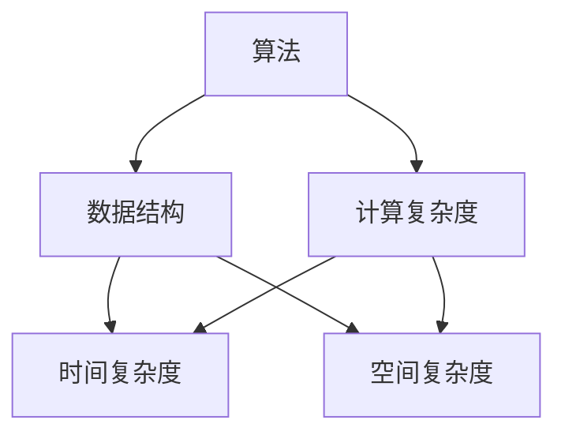
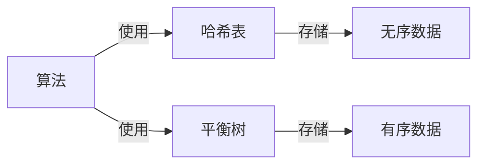

                 

# 从经典开始：奠定基础认知

在计算机科学的广袤领域，经典理论和技术是迈向创新与突破的基石。从图灵机到现代机器学习，每一次技术的飞跃都离不开对经典原理的深刻理解和传承。本文将从经典算法、数据结构、计算复杂度等多个维度出发，系统阐述计算机科学的基础认知，为深入理解人工智能及其前沿技术奠定坚实的基础。

## 1. 背景介绍

### 1.1 问题由来
计算机科学的飞速发展，离不开对经典理论的深入研究。从早期的算法设计与分析，到近年的深度学习与人工智能，经典理论始终贯穿其中。特别是在人工智能领域，经典算法与模型成为了现代技术体系的基础。掌握经典理论，不仅有助于理解现有技术，更是推动未来创新的关键。

### 1.2 问题核心关键点
经典理论涉及算法设计、数据结构、计算复杂度等多个方面。本文将重点探讨以下经典算法与模型：

- 图灵机与递归理论
- 贪心算法与动态规划
- 哈希表与平衡树
- 分治与回溯
- 正则表达式与自动机
- 神经网络与深度学习

这些经典算法与模型构成了现代计算机科学的核心，理解其原理和应用对于从事人工智能及相关信息技术工作具有重要意义。

## 2. 核心概念与联系

### 2.1 核心概念概述
计算机科学的基础概念包括但不限于：

- **算法(Algorithm)**：指解决特定问题的步骤序列，其输入为问题描述，输出为问题解。
- **数据结构(Data Structure)**：用于组织和存储数据的结构，其选择直接影响算法效率。
- **计算复杂度(Computational Complexity)**：衡量算法效率的重要指标，通常分为时间复杂度和空间复杂度。

这些概念相互联系，共同构建了计算机科学的理论基础。下图展示了一部分关键概念间的联系：



### 2.2 核心概念原理和架构的 Mermaid 流程图
以下是一个简单的图表，展示了算法与数据结构的基本联系：



这个图表展示了算法是如何通过数据结构来操作数据的，并且不同类型的算法和数据结构能够支持不同的数据操作。

## 3. 核心算法原理 & 具体操作步骤
### 3.1 算法原理概述

计算机科学中的算法大致分为三类：暴力算法、贪心算法和动态规划。

- **暴力算法(Brute-Force Algorithm)**：直接枚举所有可能的解，时间复杂度通常为指数级。
- **贪心算法(Greedy Algorithm)**：每次选择当前最优解，逐步逼近全局最优解，通常用于求解优化问题。
- **动态规划(Dynamic Programming)**：将问题分解为子问题，存储子问题的解以避免重复计算，适用于求解复杂递归问题。

### 3.2 算法步骤详解

以下以动态规划为例，详细介绍其操作步骤：

1. **定义子问题**：将原问题拆分为更小的子问题。
2. **设定状态**：定义问题解的状态变量。
3. **确定状态转移方程**：根据子问题间的关系，确定状态转移方程。
4. **设定初始条件**：定义问题的基本状态。
5. **计算最终解**：通过递推计算，得到原问题的解。

### 3.3 算法优缺点

动态规划的优点在于能够高效地解决复杂递归问题，且其优化子问题的特性减少了重复计算，提高了效率。缺点是对于状态转移方程的设计要求较高，且在求解大型问题时，空间复杂度可能较高。

### 3.4 算法应用领域

动态规划广泛应用于各种优化问题，例如背包问题、最长公共子序列问题、最短路径问题等。这些问题的共同特点是求解过程中的最优子结构和重叠子问题。

## 4. 数学模型和公式 & 详细讲解 & 举例说明

### 4.1 数学模型构建

在动态规划中，一般构建如下数学模型：

- **状态表示**：用状态集合 $S$ 表示问题解的各个状态。
- **状态转移方程**：定义状态集合 $S$ 到自身的映射 $f$，即 $f: S \rightarrow S$。
- **初始条件**：定义状态集合 $S$ 中的初始状态 $s_0$。

### 4.2 公式推导过程

以最长公共子序列问题为例，推导动态规划的解决方案。设 $S_1$ 和 $S_2$ 分别为两个序列，其长度分别为 $n$ 和 $m$。定义 $L(i,j)$ 为 $S_1[1..i]$ 和 $S_2[1..j]$ 的最长公共子序列长度。则状态转移方程为：

$$
L(i,j) = \begin{cases}
L(i-1,j-1)+1, & \text{if } S_1[i] = S_2[j] \\
\max(L(i-1,j), L(i,j-1)), & \text{otherwise}
\end{cases}
$$

### 4.3 案例分析与讲解

最长公共子序列问题是一个典型的动态规划问题。通过递归分解原问题，逐步求解子问题的最优解，最终得到原问题的最优解。该问题的时间复杂度为 $O(nm)$，空间复杂度为 $O(nm)$。

## 5. 项目实践：代码实例和详细解释说明
### 5.1 开发环境搭建

进行动态规划实践前，需要准备好开发环境。以下是使用Python进行动态规划实验的环境配置流程：

1. 安装Python：从官网下载并安装Python，并配置好环境变量。
2. 安装相关库：
```bash
pip install numpy scipy matplotlib
```

完成上述步骤后，即可在Python环境中进行动态规划实验。

### 5.2 源代码详细实现

以下是一个简单的动态规划代码实现，用于求解最长公共子序列问题：

```python
def lcs(X, Y):
    m, n = len(X), len(Y)
    L = [[0] * (n + 1) for _ in range(m + 1)]
    
    for i in range(1, m + 1):
        for j in range(1, n + 1):
            if X[i-1] == Y[j-1]:
                L[i][j] = L[i-1][j-1] + 1
            else:
                L[i][j] = max(L[i-1][j], L[i][j-1])
    
    return L[m][n]
```

### 5.3 代码解读与分析

**lcs函数**：
- `X` 和 `Y` 分别为两个序列。
- 初始化二维数组 `L`，用于存储子问题的解。
- 通过两重循环遍历 `X` 和 `Y`，计算每个子问题的解，并存储在 `L` 中。
- 返回最后一个子问题的解 `L[m][n]`，即 `X` 和 `Y` 的最长公共子序列长度。

## 6. 实际应用场景

### 6.1 算法优化

算法优化是提高程序性能的重要手段。常用的优化技巧包括：

- **剪枝(Pruning)**：通过约束搜索空间，减少计算量。
- **缓存(Caching)**：使用缓存技术，避免重复计算。
- **并行化(Parallelization)**：利用多核处理器，并行执行计算任务。

这些优化技巧可以显著提升动态规划算法的效率，使其能够处理更大规模的问题。

### 6.2 应用场景

动态规划算法广泛应用于多个领域，例如：

- **计算机视觉**：图像分割、目标识别等。
- **自然语言处理**：文本编辑、机器翻译等。
- **优化问题**：资源分配、路径规划等。

这些场景下的动态规划问题，通常具有重叠子问题和最优子结构的特性，非常适合动态规划求解。

## 7. 工具和资源推荐

### 7.1 学习资源推荐

- **《算法导论》(Introduction to Algorithms)**：Thomas H. Cormen等著，全面介绍了算法设计与分析的基础理论。
- **《数据结构与算法分析》(Data Structures and Algorithm Analysis in C++)**：Mark Allen Weiss著，介绍了数据结构和算法的实际应用。
- **Coursera**：在线学习平台，提供多种算法与数据结构课程，涵盖基础到进阶的内容。

### 7.2 开发工具推荐

- **Python**：简单易学的编程语言，支持动态规划算法的设计和实现。
- **MATLAB**：强大的数值计算工具，适合进行复杂数学模型的求解。
- **C++**：高效的编程语言，适合实现动态规划算法的高效代码。

### 7.3 相关论文推荐

- **Greedy Algorithms: Problems and Techniques**：Ahuja等著，介绍了贪心算法的理论基础与应用。
- **Dynamic Programming**：Granville Waddell著，详细讲解了动态规划算法的原理与应用。
- **The Design of Approximation Algorithms**：David P. Williamson等著，介绍了近似算法的设计方法与优化技术。

## 8. 总结：未来发展趋势与挑战

### 8.1 研究成果总结

动态规划作为经典算法之一，其核心思想在于通过分解问题，优化子问题的求解过程，从而获得全局最优解。其适用范围广，效率高，是求解复杂优化问题的有力工具。

### 8.2 未来发展趋势

未来，动态规划算法将向更高效、更通用的方向发展：

- **高性能计算**：利用分布式计算、GPU加速等技术，提升动态规划算法的计算速度。
- **新算法设计**：结合其他算法（如遗传算法、模拟退火），设计更高效的优化算法。
- **跨领域应用**：将动态规划算法应用到更多领域，如生物信息学、社交网络分析等。

### 8.3 面临的挑战

尽管动态规划算法在实际应用中表现出色，但仍面临诸多挑战：

- **计算资源**：大规模问题的求解，需要大量的计算资源和存储空间。
- **状态转移方程设计**：复杂问题的状态转移方程设计困难，难以自动化求解。
- **算法可扩展性**：动态规划算法的可扩展性较差，难以处理多变量、高维度的问题。

### 8.4 研究展望

未来的研究需要在以下几个方面寻求新的突破：

- **算法优化**：研究新的优化算法，降低计算复杂度，提高求解效率。
- **算法应用**：拓展动态规划算法在更多领域的应用，提升其实用性。
- **算法理论**：研究动态规划算法的理论基础，指导算法设计与优化。

## 9. 附录：常见问题与解答

**Q1：如何理解动态规划算法中的状态转移方程？**

A: 状态转移方程是动态规划算法的核心，描述了子问题之间的关系。理解状态转移方程的关键在于分析原问题，拆分为更小的子问题，并确定这些子问题之间的关系。例如，最长公共子序列问题中，通过比较当前两个字符是否相等，来确定当前子问题的解与前一个子问题的解之间的关系。

**Q2：动态规划算法中的空间复杂度是否可以优化？**

A: 动态规划算法的空间复杂度可以通过滚动数组等技巧进行优化，将其降为 $O(k)$，其中 $k$ 为子问题的规模。例如，对于最长公共子序列问题，可以使用一个一维数组存储子问题的解，从而将空间复杂度降为 $O(n)$，其中 $n$ 为序列的长度。

**Q3：动态规划算法是否可以用于解决最短路径问题？**

A: 是的，Dijkstra算法和Bellman-Ford算法都是动态规划算法的应用实例，用于求解最短路径问题。它们通过记录已求得的最短路径，来逐步逼近全局最短路径。

---

作者：禅与计算机程序设计艺术 / Zen and the Art of Computer Programming

