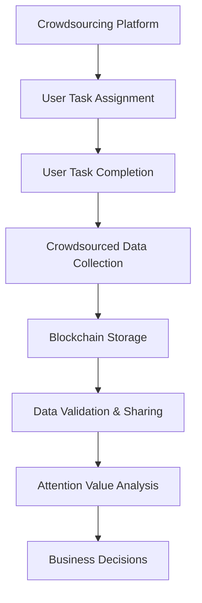

                 

# 众包与区块链在注意力价值评估中的应用

## 1. 背景介绍

在数字化经济时代，注意力作为重要的稀缺资源，成为了各大平台争抢的焦点。通过精准理解和评估用户的注意力分布，企业可以优化产品推荐、广告投放策略，提升用户体验，增加商业收益。然而，传统的注意力评估方法依赖于昂贵的市场调查和复杂的统计分析，成本高、时效性差、结果不够精准。而众包与区块链技术的结合，为注意力价值评估提供了新的解决方案，降低了成本，提高了效率，提升了评估的准确性和公平性。本文将系统探讨众包与区块链技术在注意力价值评估中的应用，希望能为企业决策提供有力的支持。

## 2. 核心概念与联系

### 2.1 核心概念概述

**众包**（Crowdsourcing）是一种通过互联网将任务分配给大量用户完成的工作方式，通常以远程在线形式进行。它能够快速积累大量标注数据，降低人力成本。

**区块链**（Blockchain）是一种分布式账本技术，具有去中心化、不可篡改、公开透明等特性。通过区块链，众包数据可以安全可靠地存储、验证和共享，提高数据可信度和利用率。

**注意力价值评估**（Attention Value Assessment）是指通过量化用户对各类信息内容的关注程度，评估其经济价值。这包括但不限于浏览时长、点击率、购买行为等，是企业决策制定的重要依据。

### 2.2 核心概念原理和架构的 Mermaid 流程图(Mermaid 流程节点中不要有括号、逗号等特殊字符)



该流程图展示了众包与区块链在注意力价值评估中的应用流程：
1. 众包平台将注意力评估任务分发给用户完成。
2. 用户根据任务要求，对信息内容进行标注和评估。
3. 收集到的众包数据存储在区块链上。
4. 通过区块链进行数据验证，确保数据真实可靠。
5. 利用区块链上存储的数据，进行注意力价值分析。
6. 根据分析结果，制定商业决策。

## 3. 核心算法原理 & 具体操作步骤

### 3.1 算法原理概述

注意力价值评估的众包与区块链技术结合，主要基于以下几个核心算法原理：

1. **众包任务设计**：针对特定注意力评估目标，设计合适的众包任务，如用户体验调查、点击率统计、页面停留时间等。

2. **区块链存储**：将用户提交的众包数据存储在区块链上，确保数据的不可篡改和透明性。

3. **数据验证与清洗**：利用区块链的分布式共识机制，对收集到的数据进行去重、纠错和验证，确保数据的准确性和一致性。

4. **注意力价值分析**：通过统计分析、机器学习等方法，对区块链上的众包数据进行整合与分析，量化用户的注意力价值。

5. **决策优化**：将注意力价值评估结果应用到商业决策中，优化产品推荐、广告投放策略，提升用户体验和收益。

### 3.2 算法步骤详解

1. **任务设计**：
   - 确定注意力评估目标，如广告点击率、页面停留时间等。
   - 设计众包任务，明确任务要求和奖励机制。
   - 通过众包平台发布任务，吸引大量用户参与。

2. **数据收集**：
   - 用户根据任务要求，对指定信息内容进行评估和标注。
   - 将用户提交的数据上传至区块链。

3. **数据验证**：
   - 利用区块链的分布式共识机制，对数据进行去重、纠错和验证。
   - 引入节点验证，确保数据的真实性和完整性。

4. **价值分析**：
   - 对区块链上的众包数据进行清洗和预处理。
   - 应用统计分析、机器学习等技术，量化用户的注意力价值。
   - 对不同维度（如时间、地点、用户属性等）的数据进行关联分析，挖掘更深层次的注意力特征。

5. **决策优化**：
   - 将注意力价值分析结果应用到商业决策中，如优化广告投放策略、提升用户体验等。
   - 定期更新模型，保持数据的实时性和准确性。

### 3.3 算法优缺点

**优点**：
1. **成本低、效率高**：利用众包技术快速积累大量标注数据，通过区块链技术保证数据真实可靠，大幅降低传统市场调查和数据统计的成本和复杂度。
2. **数据透明、结果可信**：区块链的不可篡改和公开透明特性，确保了数据的安全和可靠性，提高了注意力价值评估的公平性和可信度。
3. **实时更新、动态优化**：通过区块链存储和分析注意力数据，企业可以实时跟踪用户行为变化，动态调整优化商业决策。

**缺点**：
1. **数据隐私**：用户数据上传区块链，存在隐私泄露的风险，需要采取严格的隐私保护措施。
2. **数据噪声**：众包数据存在一定程度的噪声和不一致性，需要进行数据清洗和预处理。
3. **技术门槛高**：实施该方案需要深厚的区块链和众包技术背景，对企业技术能力要求较高。

### 3.4 算法应用领域

1. **在线广告投放**：评估不同广告内容对用户注意力的吸引程度，优化广告素材和投放策略。
2. **产品推荐系统**：分析用户对各类产品内容的关注度，优化推荐算法，提升用户体验和转化率。
3. **社交媒体分析**：量化用户对不同内容的互动频率和偏好，评估社交媒体营销效果，指导内容创作。
4. **用户行为分析**：通过注意力价值评估，理解用户行为特征和需求变化，优化产品设计和服务流程。
5. **市场趋势预测**：利用注意力数据，预测市场热点和用户趋势，为企业决策提供依据。

## 4. 数学模型和公式 & 详细讲解 & 举例说明

### 4.1 数学模型构建

注意力价值评估的数学模型可以表示为：

$$
\text{Attention Value} = f(\text{Crowdsourced Data}, \text{User Profile}, \text{Context Features})
$$

其中，$f$ 为注意力价值分析函数，$\text{Crowdsourced Data}$ 为众包收集的数据，$\text{User Profile}$ 为用户属性信息，$\text{Context Features}$ 为上下文特征，如时间、地点等。

### 4.2 公式推导过程

1. **众包数据收集**：
   - 对信息内容 $x$ 进行众包评估，得到用户输入的数据 $y$。
   - 设 $x_i$ 为用户提交的 $i$ 次评估结果，$y_i$ 为对应的标注数据。

2. **数据清洗与预处理**：
   - 对众包数据进行去重、纠错、筛选等预处理。
   - 使用统计方法，如均值、方差等，对数据进行标准化处理。

3. **注意力价值分析**：
   - 应用机器学习模型，如回归、分类等，对处理后的数据进行分析。
   - 量化用户对各类信息内容的注意力价值。

4. **结果解释与应用**：
   - 对分析结果进行可视化展示，帮助企业理解注意力分布。
   - 将结果应用到商业决策中，如优化广告投放策略、调整产品推荐算法等。

### 4.3 案例分析与讲解

假设某电商平台希望评估不同广告内容的吸引力，设计了以下众包任务：
- 用户随机点击电商平台的广告，并记录点击次数和停留时间。
- 将用户点击数据上传至区块链，进行去重和验证。
- 利用机器学习模型，对点击次数和停留时间进行分析，量化广告的注意力价值。
- 根据分析结果，优化广告素材和投放策略，提升用户转化率。

## 5. 项目实践：代码实例和详细解释说明

### 5.1 开发环境搭建

1. **众包平台搭建**：
   - 选择合适的众包平台，如Amazon Mechanical Turk、CrowdFlower 等，并注册账户。
   - 设计并发布注意力评估任务，设置任务要求和奖励机制。

2. **区块链环境配置**：
   - 安装区块链平台，如Hyperledger Fabric、Ethereum 等，并进行配置。
   - 创建区块链网络，包括共识节点、智能合约等组件。

3. **数据收集与存储**：
   - 利用众包平台，分发注意力评估任务，并收集用户提交的数据。
   - 将收集到的数据存储在区块链上，确保数据不可篡改和透明性。

### 5.2 源代码详细实现

以下是一个基于 Python 和区块链平台的注意力价值评估代码实现：

```python
from eth import Web3

# 连接 Ethereum 网络
web3 = Web3(Web3.HTTPProvider('http://localhost:8545'))

# 定义智能合约
contract_abi = [
    # 众包任务函数
    {
        "inputs": [
            {"name": "task_id", "type": "string"},
            {"name": "reward", "type": "uint256"}
        ],
        "name": "setTask",
        "outputs": [],
        "stateMutability": "nonWritable",
    },
    # 数据提交函数
    {
        "inputs": [
            {"name": "data", "type": "string"},
            {"name": "user_id", "type": "string"}
        ],
        "name": "submitData",
        "outputs": [],
        "stateMutability": "nonWritable",
    },
    # 数据验证函数
    {
        "inputs": [
            {"name": "data", "type": "string"},
            {"name": "user_id", "type": "string"}
        ],
        "name": "verifyData",
        "outputs": [
            {"name": "verified", "type": "bool"}
        ],
        "stateMutability": "view",
    }
]

# 实例化智能合约
contract = web3.eth.contract(address="0x...", abi=contract_abi)

# 创建众包任务
task_id = contract.functions.setTask("广告点击率评估", 1.0).transact({"from": "user1"})

# 用户提交数据
data = "示例广告点击数据"
user_id = "用户1"
contract.functions.submitData(data, user_id).transact({"from": "user1"})

# 验证数据
verified = contract.functions.verifyData(data, user_id).call()
print(f"验证结果：{verified}")
```

### 5.3 代码解读与分析

上述代码主要包括以下几个部分：

1. **连接 Ethereum 网络**：使用 Web3 库连接本地 Ethereum 节点。

2. **定义智能合约**：定义一个简单的智能合约，包含众包任务设置、数据提交和数据验证等功能。

3. **实例化智能合约**：根据智能合约地址和 ABI，实例化智能合约对象。

4. **创建众包任务**：调用智能合约的 setTask 函数，设置众包任务，包括任务 ID 和奖励。

5. **用户提交数据**：调用智能合约的 submitData 函数，提交用户对广告的点击数据。

6. **数据验证**：调用智能合约的 verifyData 函数，验证用户提交的数据是否合法。

## 6. 实际应用场景

### 6.1 在线广告投放

**应用场景**：电商平台希望优化广告投放策略，提升广告点击率和转化率。

**技术方案**：
- 设计众包任务，评估不同广告内容对用户注意力的吸引程度。
- 将用户提交的数据存储在区块链上，确保数据的真实性和透明性。
- 应用机器学习模型，对广告点击数据进行分析，量化广告的注意力价值。
- 根据分析结果，优化广告素材和投放策略，提升用户转化率。

### 6.2 产品推荐系统

**应用场景**：电商平台希望提高产品推荐准确性和用户体验。

**技术方案**：
- 设计众包任务，评估用户对各类产品内容的关注度。
- 将用户提交的数据存储在区块链上，确保数据的安全和可靠性。
- 应用机器学习模型，对用户点击和停留数据进行分析，量化产品的注意力价值。
- 根据分析结果，优化推荐算法，提升用户体验和转化率。

### 6.3 社交媒体分析

**应用场景**：社交媒体平台希望优化内容创作和用户互动策略。

**技术方案**：
- 设计众包任务，评估用户对不同内容的互动频率和偏好。
- 将用户提交的数据存储在区块链上，确保数据的真实性和透明性。
- 应用机器学习模型，对用户互动数据进行分析，量化内容的注意力价值。
- 根据分析结果，优化内容创作和互动策略，提升用户粘性和平台活跃度。

## 7. 工具和资源推荐

### 7.1 学习资源推荐

1. **《众包：分布式创新》**：
   - 该书详细介绍了众包技术的应用和发展，适合对众包有初步了解的企业管理者阅读。

2. **《区块链：从概念到应用》**：
   - 该书系统讲解了区块链的基本原理和技术应用，适合对区块链有深入兴趣的技术人员阅读。

3. **Coursera《Crowdsourcing》课程**：
   - 由斯坦福大学开设，介绍众包原理、设计和管理众包项目的方法。

4. **Coursera《Blockchain Fundamentals》课程**：
   - 由哥伦比亚大学开设，讲解区块链的基本概念和应用场景。

5. **《区块链技术与金融》一书**：
   - 该书从金融领域切入，讲解区块链技术的应用案例和前沿发展。

### 7.2 开发工具推荐

1. **Amazon Mechanical Turk**：
   - 一个广泛使用的众包平台，提供简单易用的任务发布和数据收集功能。

2. **CrowdFlower**：
   - 一个高效的数据标注平台，支持多种任务类型和数据格式，适合企业快速积累数据。

3. **Hyperledger Fabric**：
   - 一个基于区块链的开源平台，提供智能合约和分布式账本技术支持。

4. **Ethereum**：
   - 一个流行的区块链平台，支持智能合约和去中心化应用开发。

5. **Web3.py**：
   - 一个基于 Python 的 Web3 库，提供连接 Ethereum 网络的 API 支持。

### 7.3 相关论文推荐

1. **《利用区块链技术实现数据透明化》**：
   - 探讨区块链技术在数据透明化中的应用，适合企业决策者阅读。

2. **《众包与区块链在数据治理中的应用》**：
   - 详细分析众包与区块链结合的数据治理方法，适合企业技术经理阅读。

3. **《注意力经济与区块链技术》**：
   - 研究区块链技术在注意力经济中的应用，适合对注意力价值评估有兴趣的研究人员阅读。

## 8. 总结：未来发展趋势与挑战

### 8.1 研究成果总结

本文系统探讨了众包与区块链技术在注意力价值评估中的应用，并给出了详细的项目实践和实际应用场景。研究表明，通过结合众包和区块链技术，可以降低注意力评估的成本和复杂度，提升评估的准确性和公平性，为企业的商业决策提供有力支持。

### 8.2 未来发展趋势

未来，众包与区块链技术在注意力价值评估领域将呈现以下几个发展趋势：

1. **区块链技术普及**：随着区块链技术的成熟和应用普及，众包与区块链结合的数据分析将更加广泛和高效。

2. **智能合约自动化**：利用智能合约自动完成数据收集、验证和分析，提升注意力价值评估的自动化水平。

3. **多源数据融合**：结合其他数据源（如社交媒体、搜索数据等），构建更全面、准确的注意力价值分析模型。

4. **隐私保护技术进步**：利用隐私保护技术，如零知识证明、同态加密等，确保用户数据隐私安全。

5. **跨平台应用扩展**：将注意力价值评估技术应用到更多的平台和领域，如电商、金融、社交媒体等。

### 8.3 面临的挑战

尽管众包与区块链技术在注意力价值评估中具有诸多优势，但仍面临以下挑战：

1. **数据隐私和安全**：用户数据上传区块链，存在隐私泄露和安全风险，需要采取严格的数据保护措施。

2. **数据噪声和清洗**：众包数据存在噪声和不一致性，需要进行严格的预处理和清洗。

3. **技术门槛和成本**：实施该方案需要深厚的技术背景，对企业资源和人力投入要求较高。

4. **算法模型选择**：选择合适的机器学习模型进行注意力价值分析，需要大量的试验和验证。

5. **跨平台兼容性**：不同平台和技术的兼容性问题，需要开发者进行全面的系统设计和测试。

### 8.4 研究展望

未来，围绕众包与区块链在注意力价值评估中的应用，还需进一步研究以下几个方面：

1. **数据隐私保护**：研发更加高效和安全的隐私保护技术，确保用户数据隐私安全。

2. **数据质量提升**：通过数据清洗和增强算法，提升众包数据的准确性和一致性。

3. **智能合约优化**：优化智能合约设计，提高自动化的效率和可扩展性。

4. **跨平台技术融合**：推动跨平台技术融合，构建统一的注意力价值评估平台。

5. **多源数据融合**：结合多种数据源，构建更全面、准确的注意力价值分析模型。

这些研究方向的探索，必将引领众包与区块链在注意力价值评估技术迈向更高的台阶，为企业的商业决策提供更强大的技术支撑。

## 9. 附录：常见问题与解答

**Q1: 众包平台如何保证用户提交的数据真实可靠？**

A: 众包平台通常通过用户身份认证、行为审核、社交网络验证等方式，确保用户提交数据的真实性和可靠性。结合区块链技术，数据的不可篡改特性也能进一步提升数据的可信度。

**Q2: 如何避免众包数据中的噪声和不一致性？**

A: 通过数据清洗、异常值检测、数据标准化等方法，可以有效去除众包数据中的噪声和不一致性。结合机器学习模型进行数据预处理，进一步提高数据质量。

**Q3: 实施众包与区块链结合方案需要哪些技术支持？**

A: 实施该方案需要深厚的区块链和众包技术背景，需要具备智能合约开发、数据处理、隐私保护等相关技术能力。

**Q4: 如何确保用户数据的隐私安全？**

A: 采用隐私保护技术，如零知识证明、同态加密等，确保用户数据在上传和存储过程中的隐私安全。同时，严格控制数据的访问权限，防止数据泄露。

**Q5: 如何选择合适的机器学习模型进行注意力价值分析？**

A: 根据注意力价值评估的任务特点和数据分布，选择合适的机器学习模型。常用的模型包括回归模型、分类模型、时序模型等。通过实验和验证，不断优化模型参数和结构，提高分析准确性。

