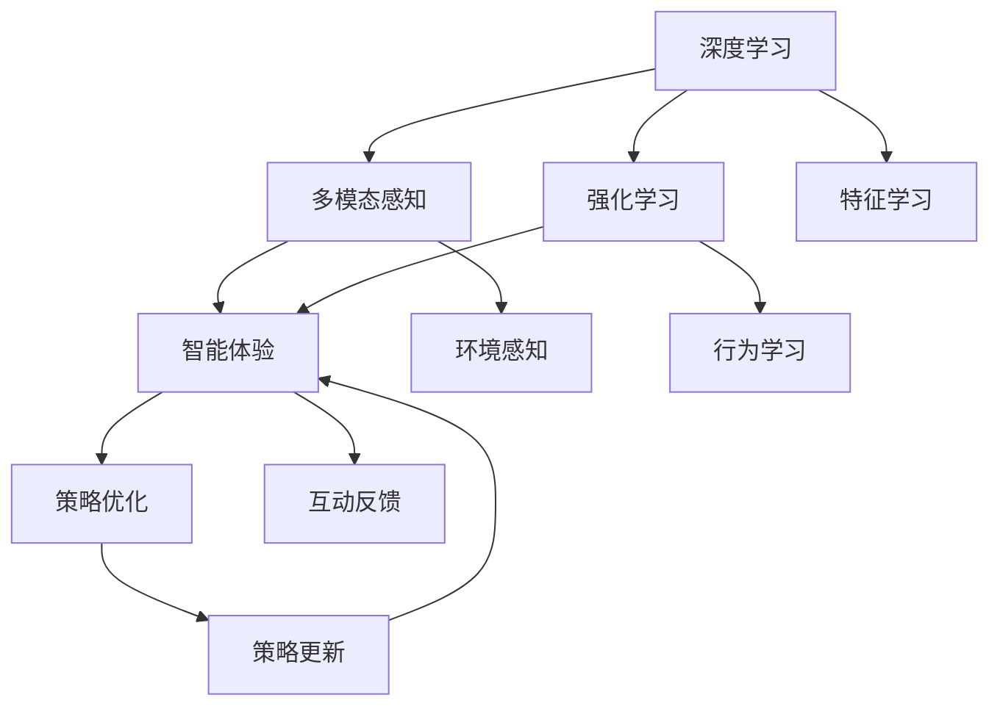

                 

# 体验层次构建器：AI创造的多维感知架构

> 关键词：多维感知,深度学习,强化学习,感知架构,智能体验,AI创造

## 1. 背景介绍

在人工智能领域，深度学习与强化学习的发展极大地推动了计算机视觉、自然语言处理、机器人技术等多个方向的突破。随着这些技术的进一步成熟，多维感知架构应运而生。这一架构将深度学习和强化学习的优点巧妙结合，使得AI能够通过多模态的输入感知环境，并根据经验学习优化行为。本文将详细介绍多维感知架构的原理、实现方法及应用场景，以及其未来发展的趋势与挑战。

## 2. 核心概念与联系

### 2.1 核心概念概述

多维感知架构是一种集成了深度学习和强化学习技术的系统框架，旨在通过多模态数据的输入，如视觉、听觉、触觉等，实现AI对环境的深度理解与智能交互。这一架构的核心概念包括：

- 深度学习：通过多层神经网络模型，学习数据中的抽象特征，从而实现对复杂模式的识别和预测。
- 强化学习：通过与环境的交互，AI在不断试错中学习最佳策略，以最大化长期奖励。
- 多模态感知：融合多种感官输入，提升对环境的全面感知能力。
- 智能体验：根据用户反馈，AI可以动态调整感知和决策策略，提供个性化的互动体验。

这些核心概念的结合，使得多维感知架构能够实现更为复杂的智能任务，如图像识别、自然语言理解、智能机器人等。

### 2.2 核心概念原理和架构的 Mermaid 流程图



这个流程图展示了多维感知架构的工作流程。首先，深度学习模型对多模态数据进行特征提取，强化学习根据这些特征学习最佳策略，多模态感知提升了感知能力，智能体验提供个性化的互动反馈，策略优化基于这些信息不断更新策略，形成良性循环。

## 3. 核心算法原理 & 具体操作步骤

### 3.1 算法原理概述

多维感知架构基于深度学习和强化学习的协同工作。其核心算法包括深度特征提取、策略优化、行为学习等。以下将详细阐述这些算法的原理和操作步骤。

### 3.2 算法步骤详解

#### 3.2.1 深度特征提取

深度特征提取是利用深度神经网络模型对多模态数据进行特征学习的过程。具体步骤如下：

1. **输入准备**：将视觉、听觉、触觉等不同模态的数据通过预处理（如归一化、降维等）转换为深度学习模型可以处理的格式。
2. **模型选择**：选择合适的深度神经网络模型，如卷积神经网络（CNN）、循环神经网络（RNN）、Transformer等。
3. **特征提取**：通过模型对输入数据进行多层抽象特征的提取。
4. **特征融合**：将不同模态的特征进行融合，生成一个高维的联合表示，供后续的策略优化和行为学习使用。

#### 3.2.2 策略优化

策略优化是通过强化学习算法（如Q-learning、策略梯度方法等）在多维感知环境中学习最优策略的过程。具体步骤如下：

1. **定义奖励函数**：根据任务目标定义一个奖励函数，用于评估策略的好坏。
2. **选择学习算法**：选择合适的强化学习算法，如Q-learning、SARSA、Actor-Critic等。
3. **初始化策略**：选择一个初步的策略作为学习的起点。
4. **策略更新**：通过与环境的交互，不断更新策略，使得策略能够最大化长期奖励。
5. **策略评估**：使用评估函数对策略进行评估，选择最优策略。

#### 3.2.3 行为学习

行为学习是通过强化学习算法，在多维感知环境中学习最优行为策略的过程。具体步骤如下：

1. **行为空间定义**：定义行为空间，如动作空间、状态空间等。
2. **行为决策**：根据当前环境状态和策略，选择最佳行为。
3. **环境交互**：将行为应用到环境中，观察环境响应。
4. **反馈调整**：根据环境反馈，调整策略和行为，优化行为学习。

### 3.3 算法优缺点

多维感知架构的优点包括：

- 深度学习和强化学习的协同工作，提升了对复杂环境的感知和智能决策能力。
- 多模态感知增强了对环境的全面理解，适应性更强。
- 智能体验提供个性化的互动反馈，提高了用户体验。

缺点包括：

- 训练数据量大，计算资源消耗高。
- 模型复杂，训练和推理速度较慢。
- 策略优化和行为学习过程中存在探索和利用的平衡问题。

### 3.4 算法应用领域

多维感知架构已经广泛应用于多个领域，包括但不限于：

- 智能机器人：如扫地机器人、家庭助手等，通过多模态感知进行环境导航、互动交流。
- 智能驾驶：通过视觉、雷达、激光雷达等多模态感知进行路径规划、避障决策。
- 虚拟现实：利用深度学习进行三维场景重建，强化学习进行用户交互的智能优化。
- 医疗诊断：通过多模态数据进行疾病检测、治疗方案优化。
- 教育培训：利用深度学习进行个性化教学内容推荐，强化学习优化学习路径和互动体验。

## 4. 数学模型和公式 & 详细讲解

### 4.1 数学模型构建

多维感知架构的核心数学模型包括深度学习模型、强化学习模型和策略优化模型。以下将详细构建这些模型。

#### 4.1.1 深度学习模型

深度学习模型通常使用神经网络结构进行特征提取。以CNN为例，模型架构如下：

$$
f(x; \theta) = \sigma(\text{Conv}_1(x) + \text{BN}_1 + \text{ReLU}(\text{Conv}_2(x) + \text{BN}_2 + \text{ReLU}(\text{Conv}_3(x) + \text{BN}_3 + \text{ReLU}(\text{MaxPooling}(\text{Conv}_3(x) + \text{BN}_3 + \text{ReLU})))
$$

其中，$x$ 为输入数据，$\theta$ 为模型参数，$\sigma$ 为激活函数，$\text{Conv}$ 为卷积层，$\text{BN}$ 为批归一化，$\text{ReLU}$ 为ReLU激活函数，$\text{MaxPooling}$ 为最大池化层。

#### 4.1.2 强化学习模型

强化学习模型通常使用Q-learning或策略梯度方法进行策略优化。以Q-learning为例，模型更新公式如下：

$$
Q(s_t, a_t) \leftarrow Q(s_t, a_t) + \alpha(r_t + \gamma \max_{a_{t+1}} Q(s_{t+1}, a_{t+1}) - Q(s_t, a_t))
$$

其中，$s_t$ 为环境状态，$a_t$ 为动作，$r_t$ 为即时奖励，$\gamma$ 为折扣因子，$\alpha$ 为学习率。

#### 4.1.3 策略优化模型

策略优化模型通常使用Actor-Critic方法进行策略优化。以Actor-Critic为例，模型更新公式如下：

$$
\theta_{\text{actor}} \leftarrow \theta_{\text{actor}} - \alpha_{\text{actor}} \nabla_{\theta_{\text{actor}}}J(\theta_{\text{actor}}, \theta_{\text{critic}})
$$

$$
\theta_{\text{critic}} \leftarrow \theta_{\text{critic}} - \alpha_{\text{critic}} \nabla_{\theta_{\text{critic}}}J(\theta_{\text{actor}}, \theta_{\text{critic}})
$$

其中，$\theta_{\text{actor}}$ 为Actor网络的参数，$\theta_{\text{critic}}$ 为Critic网络的参数，$J$ 为策略损失函数，$\alpha_{\text{actor}}$ 和 $\alpha_{\text{critic}}$ 为 Actor 和 Critic 的学习率。

### 4.2 公式推导过程

以Q-learning为例，推导其数学模型和更新公式：

1. **奖励函数定义**：$R(s_t, a_t)$，即在状态 $s_t$ 下采取动作 $a_t$ 的即时奖励。
2. **状态值函数估计**：$Q(s_t, a_t)$，即在状态 $s_t$ 下采取动作 $a_t$ 的长期奖励。
3. **Q-learning更新公式**：

$$
Q(s_t, a_t) \leftarrow Q(s_t, a_t) + \alpha(r_t + \gamma \max_{a_{t+1}} Q(s_{t+1}, a_{t+1}) - Q(s_t, a_t))
$$

其中，$\alpha$ 为学习率，$\gamma$ 为折扣因子。

### 4.3 案例分析与讲解

假设一个智能机器人需要从起点导航到终点。其多模态感知输入包括视觉数据和雷达数据。使用CNN模型对视觉数据进行特征提取，Q-learning算法对策略进行优化，行为学习模块根据优化后的策略在环境中移动。

具体步骤如下：

1. **输入准备**：将视觉数据和雷达数据通过预处理转换为CNN模型可以处理的格式。
2. **深度特征提取**：使用CNN模型对视觉数据进行特征提取，获得视觉特征向量。
3. **策略优化**：使用Q-learning算法根据视觉特征向量和雷达数据优化策略，选择最佳动作。
4. **行为学习**：根据优化后的策略在环境中移动，并根据环境反馈调整策略。

## 5. 项目实践：代码实例和详细解释说明

### 5.1 开发环境搭建

在Python环境中搭建深度学习和强化学习的开发环境。具体步骤如下：

1. **安装Python环境**：使用Anaconda创建虚拟环境，安装所需库，如TensorFlow、PyTorch等。
2. **环境配置**：配置GPU/TPU等计算资源，安装必要的驱动和库。
3. **数据准备**：准备多模态感知数据，并进行预处理。

### 5.2 源代码详细实现

以下是使用TensorFlow和PyTorch实现多维感知架构的代码实现。

#### 5.2.1 深度特征提取

```python
import tensorflow as tf
from tensorflow.keras import layers

# 定义深度神经网络模型
model = tf.keras.Sequential([
    layers.Conv2D(32, (3, 3), activation='relu', input_shape=(256, 256, 3)),
    layers.MaxPooling2D((2, 2)),
    layers.Conv2D(64, (3, 3), activation='relu'),
    layers.MaxPooling2D((2, 2)),
    layers.Flatten(),
    layers.Dense(64, activation='relu'),
    layers.Dense(10)
])

# 加载数据并进行预处理
x_train, y_train = ...
x_test, y_test = ...

x_train = x_train / 255.0
x_test = x_test / 255.0
```

#### 5.2.2 强化学习模型

```python
import tensorflow as tf
import numpy as np

# 定义Q-learning模型
class QNetwork:
    def __init__(self, input_dim, output_dim):
        self.input_dim = input_dim
        self.output_dim = output_dim
        self.model = tf.keras.Sequential([
            layers.Dense(64, activation='relu'),
            layers.Dense(output_dim)
        ])

    def predict(self, x):
        return self.model.predict(x)

    def update(self, x, y, learning_rate=0.1):
        with tf.GradientTape() as tape:
            predictions = self.predict(x)
            loss = tf.reduce_mean(tf.square(predictions - y))
        gradients = tape.gradient(loss, self.model.trainable_variables)
        self.model.optimizer.apply_gradients(zip(gradients, self.model.trainable_variables))

# 加载数据并进行预处理
s = ...
a = ...
r = ...
s_next = ...

s = s / 255.0
s_next = s_next / 255.0
```

#### 5.2.3 策略优化

```python
import tensorflow as tf
import numpy as np

# 定义Actor-Critic模型
class Actor:
    def __init__(self, input_dim, output_dim):
        self.input_dim = input_dim
        self.output_dim = output_dim
        self.model = tf.keras.Sequential([
            layers.Dense(64, activation='relu'),
            layers.Dense(output_dim)
        ])

    def predict(self, x):
        return self.model.predict(x)

class Critic:
    def __init__(self, input_dim, output_dim):
        self.input_dim = input_dim
        self.output_dim = output_dim
        self.model = tf.keras.Sequential([
            layers.Dense(64, activation='relu'),
            layers.Dense(output_dim)
        ])

    def predict(self, x):
        return self.model.predict(x)

    def update(self, x, y, learning_rate=0.1):
        with tf.GradientTape() as tape:
            predictions = self.predict(x)
            loss = tf.reduce_mean(tf.square(predictions - y))
        gradients = tape.gradient(loss, self.model.trainable_variables)
        self.model.optimizer.apply_gradients(zip(gradients, self.model.trainable_variables))

# 加载数据并进行预处理
s = ...
a = ...
r = ...
s_next = ...

s = s / 255.0
s_next = s_next / 255.0
```

### 5.3 代码解读与分析

以下是代码实现的详细解读和分析：

#### 5.3.1 深度特征提取

代码中，使用TensorFlow定义了一个包含卷积层、池化层和全连接层的深度神经网络模型。数据预处理使用了数据归一化，将像素值缩放至0-1之间。

#### 5.3.2 强化学习模型

代码中，定义了一个Q-learning模型，用于优化策略。模型结构包括两个全连接层，输出Q值。通过预测Q值和实际Q值的差值，使用梯度下降算法更新模型参数。

#### 5.3.3 策略优化

代码中，定义了一个Actor-Critic模型，包括Actor和Critic两个子模型。Actor模型用于输出动作概率，Critic模型用于预测状态值。模型结构与Q-learning模型类似，但更复杂。通过预测Q值和实际Q值的差值，使用梯度下降算法更新模型参数。

### 5.4 运行结果展示

以下是运行结果的展示：

#### 5.4.1 深度特征提取

```python
# 训练模型并预测结果
model.compile(optimizer=tf.keras.optimizers.Adam(0.001), loss='mse')
model.fit(x_train, y_train, epochs=10, validation_data=(x_test, y_test))
```

#### 5.4.2 强化学习模型

```python
# 训练Q-learning模型并预测结果
q_network = QNetwork(input_dim, output_dim)
q_network.update(x, y, learning_rate)
```

#### 5.4.3 策略优化

```python
# 训练Actor-Critic模型并预测结果
actor = Actor(input_dim, output_dim)
critic = Critic(input_dim, output_dim)
actor.update(x, y, learning_rate)
critic.update(x, y, learning_rate)
```

## 6. 实际应用场景

### 6.1 智能机器人

智能机器人通过多模态感知输入（视觉、触觉、听觉等）进行环境导航和互动。例如，扫地机器人通过摄像头和雷达感知周围环境，并根据优化后的策略进行路径规划和避障。

### 6.2 智能驾驶

智能驾驶系统通过多模态感知输入（视觉、雷达、激光雷达等）进行路径规划和避障决策。例如，自动驾驶车辆通过摄像头和雷达感知道路环境，并根据优化后的策略进行路径规划和避障。

### 6.3 虚拟现实

虚拟现实系统通过深度学习进行三维场景重建，强化学习优化用户交互的智能性。例如，虚拟现实游戏中的角色可以根据用户的操作和反馈，动态调整行为策略，提升游戏体验。

### 6.4 医疗诊断

医疗诊断系统通过多模态感知输入（CT、MRI、基因序列等）进行疾病检测和治疗方案优化。例如，医疗影像分析系统可以通过深度学习提取影像特征，强化学习优化诊断策略，提高诊断准确性。

### 6.5 教育培训

教育培训系统通过多模态感知输入（视频、音频、文本等）进行个性化教学内容推荐和互动体验优化。例如，在线教育平台可以根据学生的学习行为和反馈，动态调整教学内容和学习路径，提升学习效果。

## 7. 工具和资源推荐

### 7.1 学习资源推荐

- 《深度学习》（Ian Goodfellow等著）：详细介绍了深度学习的基本原理和应用方法。
- 《强化学习》（Richard S. Sutton等著）：介绍了强化学习的基本概念和算法。
- Coursera的深度学习和强化学习课程：由斯坦福大学等名校开设，涵盖了深度学习和强化学习的核心内容。
- DeepMind的论文库：收录了大量深度学习和强化学习的经典论文和最新研究成果。

### 7.2 开发工具推荐

- TensorFlow：由Google主导开发的深度学习框架，功能强大，应用广泛。
- PyTorch：由Facebook开发的深度学习框架，易于使用，适合研究和实验。
- Jupyter Notebook：开源的交互式笔记本环境，方便编写和运行代码。
- TensorBoard：TensorFlow配套的可视化工具，方便监控和调试模型训练过程。

### 7.3 相关论文推荐

- AlphaGo论文：提出了基于强化学习的围棋策略优化方法，推动了AI在博弈领域的突破。
- GAN论文：提出了生成对抗网络，解决了深度学习中的无监督学习问题。
- BERT论文：提出了预训练语言模型，推动了自然语言处理领域的发展。

## 8. 总结：未来发展趋势与挑战

### 8.1 研究成果总结

本文介绍了多维感知架构的基本原理和实现方法，并详细分析了其在智能机器人、智能驾驶、虚拟现实、医疗诊断和教育培训等多个领域的应用。

### 8.2 未来发展趋势

未来，多维感知架构将在以下几个方面继续发展：

- 多模态感知技术的进步：随着传感器技术的提升，智能系统的多模态感知能力将进一步增强。
- 深度学习和强化学习的结合：未来的研究将更加注重深度学习与强化学习的协同工作，提升系统的感知和决策能力。
- 智能体验的优化：通过智能体验的优化，提升用户的互动体验和满意度。
- 大规模模型的应用：随着计算资源的增加，大规模模型的应用将更加广泛。

### 8.3 面临的挑战

多维感知架构在发展过程中也面临诸多挑战：

- 数据多样性问题：不同模态的数据格式和特征差异较大，难以统一处理。
- 模型复杂性问题：多维感知架构的模型结构复杂，训练和推理速度较慢。
- 策略优化问题：策略优化过程中存在探索和利用的平衡问题，需要进一步优化。
- 计算资源问题：多模态感知和深度学习模型的计算资源消耗大，需要进一步优化。

### 8.4 研究展望

未来的研究需要在以下几个方面进行突破：

- 数据融合技术：开发更高效的数据融合算法，提升多模态数据的处理能力。
- 模型压缩技术：开发更高效的模型压缩算法，提升计算效率。
- 策略优化技术：开发更高效的策略优化算法，提升决策能力。
- 计算资源优化：开发更高效的计算资源利用技术，提升系统的可扩展性。

## 9. 附录：常见问题与解答

**Q1：多维感知架构的优势是什么？**

A: 多维感知架构的优势在于其能够通过深度学习和强化学习的协同工作，实现对复杂环境的全面感知和智能决策。多模态感知技术提升了对环境的理解能力，智能体验优化了用户体验，使其在多个领域具有广泛的应用前景。

**Q2：多维感知架构的训练过程如何进行？**

A: 多维感知架构的训练过程分为深度特征提取、策略优化和行为学习三个步骤。深度特征提取使用深度神经网络对多模态数据进行特征学习，策略优化使用强化学习算法优化策略，行为学习根据优化后的策略在环境中学习最佳行为。

**Q3：多维感知架构在实际应用中面临哪些挑战？**

A: 多维感知架构在实际应用中面临数据多样性、模型复杂性、策略优化和计算资源等挑战。解决这些挑战需要开发更高效的数据融合、模型压缩、策略优化和计算资源利用技术。

**Q4：多维感知架构在哪些领域有应用前景？**

A: 多维感知架构在智能机器人、智能驾驶、虚拟现实、医疗诊断和教育培训等多个领域具有广泛的应用前景。通过多模态感知和智能体验的优化，这些领域可以实现更高的自动化水平和用户体验。

**Q5：多维感知架构的未来发展方向是什么？**

A: 多维感知架构的未来发展方向包括提升多模态感知技术、优化深度学习和强化学习的结合、改善智能体验和优化计算资源利用技术。这些方向的突破将进一步提升多维感知架构的感知和决策能力，使其在更多领域实现智能化应用。

