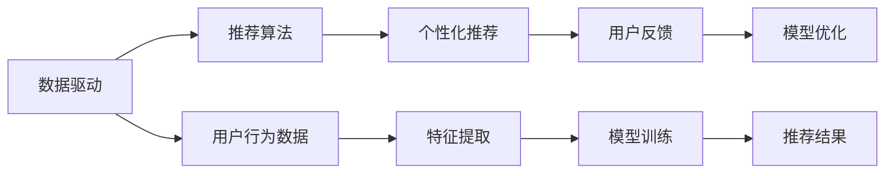

                 

# 体验的个人化叙事：AI驱动的生活故事

## 1. 背景介绍

在数字化时代的浪潮下，人工智能(AI)正逐渐渗透到我们生活的方方面面。从智能音箱到智能家居，从在线教育到个性化推荐，AI技术的进步正在以我们无法想象的方式重塑着人类的生活方式。而在这一切的背后，驱动着AI的并非只是冷冰冰的算法和数据，而是那些温暖而深刻的个人化叙事。

### 1.1 个人化叙事的定义

个人化叙事是指通过个性化的语言、故事和情节，将数据和算法与人类情感和经历相结合，从而更好地满足用户的个性化需求。在AI驱动的生活故事中，个人化叙事不仅仅是一个技术术语，更是连接人类和机器、数据和情感的桥梁。

### 1.2 个人化叙事的重要性

个人化叙事在AI应用中的重要性不言而喻。随着AI技术的不断发展，如何更好地理解人类情感和需求，如何通过智能技术提升用户的个性化体验，成为了AI领域研究的重点。而个人化叙事正是一种解决这些问题的有效方法。它不仅能够使AI系统更贴近人类情感，更能提升用户的参与感和满意度，从而推动AI技术在各个领域的应用。

## 2. 核心概念与联系

### 2.1 核心概念概述

为了更好地理解AI驱动的个人化叙事，我们首先需要梳理一些核心概念及其相互联系：

- **人工智能(AI)**：一种利用计算机技术，通过模拟人类智能行为来处理信息的科学技术。
- **自然语言处理(NLP)**：AI的一个分支，专注于理解和生成人类语言的技术。
- **推荐系统**：通过分析用户行为和偏好，为用户推荐个性化内容的系统。
- **个性化推荐**：基于用户的兴趣和行为，为其推荐特定内容或服务的技术。
- **数据驱动**：利用数据来指导模型训练和优化，使AI系统更具智能和适应性。

这些核心概念构成了AI驱动的个人化叙事的理论基础。通过数据驱动和个性化推荐，AI系统能够更好地理解和满足用户需求，进而实现个人化叙事的创作和应用。

### 2.2 核心概念原理和架构的 Mermaid 流程图

以下是一个简化的Mermaid流程图，展示了数据驱动和个性化推荐系统之间的联系：



这个流程图展示了数据驱动推荐系统的基本架构。首先，从用户行为数据中提取特征，然后进行模型训练，生成推荐结果。同时，通过用户反馈进一步优化模型，实现更准确的个性化推荐。

## 3. 核心算法原理 & 具体操作步骤

### 3.1 算法原理概述

AI驱动的个人化叙事算法主要基于推荐系统，通过分析用户行为和偏好，为用户推荐个性化内容或服务。其核心算法包括协同过滤、内容推荐、深度学习等。

协同过滤是一种基于用户兴趣相似度的推荐算法，通过分析用户行为数据，找出具有相似兴趣的其他用户，从而为其推荐相似物品。而内容推荐则侧重于分析物品本身的属性和特征，为用户推荐与其兴趣匹配的内容。深度学习算法则通过神经网络模型，能够更深入地理解用户行为和偏好，从而生成更为准确的推荐结果。

### 3.2 算法步骤详解

以下是AI驱动的个人化叙事的算法步骤：

**Step 1: 数据收集和预处理**

1. **数据收集**：收集用户的各类行为数据，如浏览记录、购买记录、评分记录等。
2. **数据预处理**：对数据进行清洗、归一化和特征提取，以便于后续的模型训练。

**Step 2: 特征工程**

1. **用户特征**：提取用户的基本属性和行为特征，如年龄、性别、浏览历史等。
2. **物品特征**：提取物品的属性和标签，如物品名称、价格、类别等。

**Step 3: 模型训练**

1. **选择合适的模型**：根据任务特点选择合适的推荐算法，如协同过滤、深度学习等。
2. **训练模型**：使用数据驱动的方法训练模型，如使用交叉熵损失函数优化模型参数。

**Step 4: 个性化推荐**

1. **预测评分**：根据训练好的模型，预测用户对每个物品的评分或概率。
2. **推荐排序**：将预测评分排序，推荐给用户评分最高的物品。

**Step 5: 用户反馈和模型优化**

1. **收集反馈**：收集用户对推荐结果的反馈，如点击、购买、评分等。
2. **模型优化**：根据用户反馈不断优化模型，提高推荐精度和用户满意度。

### 3.3 算法优缺点

AI驱动的个人化叙事的算法具有以下优点：

- **个性化推荐**：能够根据用户的具体需求和兴趣，推荐个性化内容，提升用户体验。
- **数据驱动**：能够通过分析大量数据，发现用户行为和偏好的规律，提高推荐效果。
- **动态调整**：能够根据用户反馈实时调整推荐算法，适应用户需求变化。

同时，该算法也存在以下缺点：

- **隐私问题**：需要收集用户行为数据，可能涉及隐私问题。
- **过拟合风险**：模型可能过拟合用户历史数据，推荐结果不够多样化。
- **计算复杂度高**：对于大规模数据集，模型训练和推理计算复杂度高，需要高性能计算资源。

## 4. 数学模型和公式 & 详细讲解 & 举例说明

### 4.1 数学模型构建

在推荐系统中，常见的数学模型包括协同过滤、矩阵分解和深度学习模型。这里以协同过滤和矩阵分解为例，构建推荐系统。

**协同过滤模型**

协同过滤模型基于用户之间的兴趣相似度，通过找到与目标用户兴趣相似的其他用户，从而推荐其感兴趣的物品。协同过滤模型分为基于用户的协同过滤和基于物品的协同过滤两种。

**矩阵分解模型**

矩阵分解模型通过将用户-物品评分矩阵分解为两个低维矩阵，直接进行预测评分。常见的矩阵分解模型包括奇异值分解(SVD)和交替最小二乘法(ALS)等。

### 4.2 公式推导过程

**协同过滤模型**

- **基于用户的协同过滤**

  $$
  \hat{r}_{ui} = \sum_{v=1}^M \alpha_{uv} \cdot r_{vi}
  $$

  其中，$r_{vi}$ 表示用户 $v$ 对物品 $i$ 的评分，$\alpha_{uv}$ 表示用户 $u$ 和用户 $v$ 之间的相似度权重。

- **基于物品的协同过滤**

  $$
  \hat{r}_{ui} = \sum_{v=1}^N \alpha_{iv} \cdot r_{uv}
  $$

  其中，$\alpha_{iv}$ 表示物品 $i$ 和物品 $v$ 之间的相似度权重。

**矩阵分解模型**

- **奇异值分解(SVD)**

  $$
  A \approx U \cdot \Sigma \cdot V^T
  $$

  其中，$A$ 为用户-物品评分矩阵，$U$ 和 $V$ 分别为用户和物品的低维表示矩阵，$\Sigma$ 为奇异值矩阵。

### 4.3 案例分析与讲解

以电商平台的个性化推荐为例，平台收集用户浏览、购买、评分等行为数据，使用协同过滤和矩阵分解模型进行推荐。具体步骤如下：

1. **数据收集**：收集用户的浏览记录、购买记录和评分记录。
2. **特征提取**：提取用户的基本属性（如年龄、性别）和行为特征（如浏览次数、购买次数），以及物品的属性（如价格、类别）。
3. **模型训练**：使用协同过滤和矩阵分解模型，训练推荐模型。
4. **个性化推荐**：根据训练好的模型，为用户推荐其可能感兴趣的物品。
5. **用户反馈**：收集用户对推荐结果的反馈（如点击、购买、评分）。
6. **模型优化**：根据用户反馈不断优化推荐算法，提高推荐效果。

## 5. 项目实践：代码实例和详细解释说明

### 5.1 开发环境搭建

在进行推荐系统开发前，我们需要准备好开发环境。以下是使用Python进行TensorFlow开发的环境配置流程：

1. **安装Anaconda**：从官网下载并安装Anaconda，用于创建独立的Python环境。

2. **创建并激活虚拟环境**：

  ```bash
  conda create -n tf-env python=3.7 
  conda activate tf-env
  ```

3. **安装TensorFlow**：根据CUDA版本，从官网获取对应的安装命令。例如：

  ```bash
  conda install tensorflow=2.7 
  ```

4. **安装其他工具包**：

  ```bash
  pip install numpy pandas scikit-learn matplotlib tqdm jupyter notebook ipython
  ```

完成上述步骤后，即可在`tf-env`环境中开始推荐系统开发。

### 5.2 源代码详细实现

这里以电商推荐系统为例，给出使用TensorFlow进行个性化推荐开发的PyTorch代码实现。

**推荐系统数据集**

```python
import pandas as pd

# 读取用户-物品评分数据
ratings = pd.read_csv('ratings.csv')
# 读取物品属性数据
items = pd.read_csv('items.csv')
```

**数据预处理**

```python
from tensorflow.keras.preprocessing import sequence

# 将用户ID和物品ID映射为独热编码
user_ids = sequence.categorical_to_binary(ratings['user_id'].astype(str))
item_ids = sequence.categorical_to_binary(ratings['item_id'].astype(str))

# 提取物品属性特征
item_features = items[['price', 'category']].values
```

**模型训练**

```python
from tensorflow.keras.layers import Embedding, Dot, Dense, Input, concatenate
from tensorflow.keras.models import Model

# 定义用户和物品的嵌入层
user_embeddings = Embedding(input_dim=len(user_ids), output_dim=64, input_length=1)
item_embeddings = Embedding(input_dim=len(item_ids), output_dim=64, input_length=1)

# 定义模型
user_input = Input(shape=(1,), name='user_input')
item_input = Input(shape=(1,), name='item_input')

user_embeddings = user_embeddings(user_input)
item_embeddings = item_embeddings(item_input)

dot_product = Dot(axes=(1, 1))([user_embeddings, item_embeddings])

# 将嵌入向量的点积作为输入，进行全连接层和激活函数
dot_product = Dense(1, activation='sigmoid')(dot_product)

# 构建模型
model = Model(inputs=[user_input, item_input], outputs=dot_product)

# 编译模型
model.compile(optimizer='adam', loss='binary_crossentropy', metrics=['accuracy'])
```

**个性化推荐**

```python
from tensorflow.keras.models import load_model
import numpy as np

# 加载训练好的模型
model = load_model('recommendation_model.h5')

# 用户ID和物品ID列表
user_id = np.array([user_ids.encode(['u1', 'u2', 'u3'])], dtype='object')
item_id = np.array([item_ids.encode(['i1', 'i2', 'i3'])], dtype='object')

# 生成推荐结果
recommendations = model.predict([user_id, item_id])
```

### 5.3 代码解读与分析

让我们再详细解读一下关键代码的实现细节：

**推荐系统数据集**

- **数据读取**：使用Pandas库读取用户-物品评分数据和物品属性数据。

**数据预处理**

- **独热编码**：使用Keras中的`categorical_to_binary`函数将用户ID和物品ID转换为独热编码，以便于模型处理。
- **提取属性特征**：提取物品的价格和类别属性，准备用于模型训练。

**模型训练**

- **嵌入层**：使用Embedding层将用户ID和物品ID转换为嵌入向量。
- **点积计算**：使用Dot层计算用户和物品嵌入向量的点积，得到预测评分。
- **全连接层和激活函数**：使用Dense层进行全连接，使用Sigmoid激活函数进行二分类预测。
- **模型构建**：使用Model类构建推荐模型，指定输入和输出。
- **模型编译**：使用Model.compile方法编译模型，指定优化器和损失函数。

**个性化推荐**

- **加载模型**：使用Model.load_model方法加载训练好的推荐模型。
- **生成推荐结果**：将用户ID和物品ID列表输入模型，生成推荐评分。

## 6. 实际应用场景

### 6.1 电商平台个性化推荐

电商平台的个性化推荐系统，通过分析用户浏览、购买、评分等行为数据，为用户推荐其可能感兴趣的商品。这种推荐系统能够显著提升用户体验和购物转化率。

**应用流程**

1. **数据收集**：收集用户的浏览记录、购买记录和评分记录。
2. **特征提取**：提取用户的基本属性（如年龄、性别）和行为特征（如浏览次数、购买次数），以及物品的属性（如价格、类别）。
3. **模型训练**：使用协同过滤和矩阵分解模型，训练推荐模型。
4. **个性化推荐**：根据训练好的模型，为用户推荐其可能感兴趣的物品。
5. **用户反馈**：收集用户对推荐结果的反馈（如点击、购买、评分）。
6. **模型优化**：根据用户反馈不断优化推荐算法，提高推荐效果。

**实际案例**

以亚马逊为例，亚马逊的个性化推荐系统通过分析用户的浏览和购买行为，为用户推荐其可能感兴趣的商品。该系统不仅提升了用户的购物体验，还显著增加了销售额和用户粘性。

### 6.2 视频平台推荐系统

视频平台的推荐系统通过分析用户的观看记录和评分数据，为用户推荐其可能感兴趣的视频内容。这种推荐系统能够帮助用户发现更多优质内容，提高平台的用户留存率。

**应用流程**

1. **数据收集**：收集用户的观看记录和评分记录。
2. **特征提取**：提取用户的基本属性（如年龄、性别）和行为特征（如观看次数、评分数据），以及视频的内容特征（如类型、时长）。
3. **模型训练**：使用协同过滤和矩阵分解模型，训练推荐模型。
4. **个性化推荐**：根据训练好的模型，为用户推荐其可能感兴趣的视频内容。
5. **用户反馈**：收集用户对推荐结果的反馈（如观看次数、评分）。
6. **模型优化**：根据用户反馈不断优化推荐算法，提高推荐效果。

**实际案例**

以Netflix为例，Netflix的个性化推荐系统通过分析用户的观看记录和评分数据，为用户推荐其可能感兴趣的电影和电视剧。该系统帮助Netflix保持了较高的用户留存率和平台收入。

### 6.3 新闻平台个性化推荐

新闻平台的个性化推荐系统通过分析用户的阅读记录和互动数据，为用户推荐其可能感兴趣的新闻内容。这种推荐系统能够帮助用户获取更多有用的信息，提高平台的用户参与度。

**应用流程**

1. **数据收集**：收集用户的阅读记录和互动数据。
2. **特征提取**：提取用户的基本属性（如年龄、兴趣）和行为特征（如阅读次数、互动次数），以及新闻的内容特征（如标题、发布时间）。
3. **模型训练**：使用协同过滤和矩阵分解模型，训练推荐模型。
4. **个性化推荐**：根据训练好的模型，为用户推荐其可能感兴趣的新闻内容。
5. **用户反馈**：收集用户对推荐结果的反馈（如阅读次数、互动次数）。
6. **模型优化**：根据用户反馈不断优化推荐算法，提高推荐效果。

**实际案例**

以今日头条为例，今日头条的个性化推荐系统通过分析用户的阅读记录和互动数据，为用户推荐其可能感兴趣的新闻内容。该系统帮助今日头条保持了较高的用户活跃度和平台收入。

### 6.4 未来应用展望

未来，随着AI技术的不断进步，AI驱动的个人化叙事将会在更多领域得到应用，为人类生活带来更多的便利和创新。

**智慧医疗**

AI驱动的个人化叙事可以应用于智慧医疗领域，通过分析患者的医疗记录和行为数据，为医生提供个性化诊疗建议，提升诊疗效果。

**智能教育**

AI驱动的个人化叙事可以应用于智能教育领域，通过分析学生的学习记录和行为数据，为教师提供个性化教学建议，提升教学效果。

**智能交通**

AI驱动的个人化叙事可以应用于智能交通领域，通过分析司机的驾驶记录和行为数据，为交通管理中心提供个性化交通管理建议，提升交通效率。

**智能家居**

AI驱动的个人化叙事可以应用于智能家居领域，通过分析用户的家居行为和偏好，为用户推荐个性化的家居方案，提升生活质量。

**智慧城市**

AI驱动的个人化叙事可以应用于智慧城市领域，通过分析市民的行为和偏好，为城市管理提供个性化服务建议，提升城市管理水平。

## 7. 工具和资源推荐

### 7.1 学习资源推荐

为了帮助开发者系统掌握AI驱动的个人化叙事技术，这里推荐一些优质的学习资源：

1. **《深度学习》课程**：斯坦福大学开设的深度学习课程，涵盖了深度学习的基本概念和核心算法。
2. **《推荐系统》课程**：哈尔滨工业大学开设的推荐系统课程，详细讲解了协同过滤、矩阵分解等推荐算法。
3. **《自然语言处理》课程**：北京大学开设的自然语言处理课程，涵盖了NLP的基本概念和核心算法。
4. **《个性化推荐系统》书籍**：介绍个性化推荐系统的原理和实现，包括协同过滤、矩阵分解等算法。
5. **《深度学习框架TensorFlow》书籍**：介绍TensorFlow的基本概念和核心算法，包括模型构建、训练和优化等。

通过对这些资源的学习实践，相信你一定能够快速掌握AI驱动的个人化叙事技术，并用于解决实际的NLP问题。

### 7.2 开发工具推荐

高效的开发离不开优秀的工具支持。以下是几款用于AI驱动的个人化叙事开发的常用工具：

1. **PyTorch**：基于Python的开源深度学习框架，灵活动态的计算图，适合快速迭代研究。
2. **TensorFlow**：由Google主导开发的开源深度学习框架，生产部署方便，适合大规模工程应用。
3. **Keras**：基于TensorFlow的高层API，简单易用，适合快速构建推荐系统。
4. **TensorBoard**：TensorFlow配套的可视化工具，可实时监测模型训练状态，并提供丰富的图表呈现方式。
5. **Weights & Biases**：模型训练的实验跟踪工具，可以记录和可视化模型训练过程中的各项指标。

合理利用这些工具，可以显著提升AI驱动的个人化叙事的开发效率，加快创新迭代的步伐。

### 7.3 相关论文推荐

AI驱动的个人化叙事技术的发展源于学界的持续研究。以下是几篇奠基性的相关论文，推荐阅读：

1. **《协同过滤推荐系统》**：介绍了协同过滤算法的原理和应用，包括基于用户的协同过滤和基于物品的协同过滤。
2. **《矩阵分解推荐系统》**：介绍了矩阵分解算法的原理和应用，包括奇异值分解和交替最小二乘法。
3. **《深度学习推荐系统》**：介绍了深度学习算法的原理和应用，包括神经网络推荐系统和端到端推荐系统。
4. **《个性化推荐系统：设计与实现》**：详细介绍个性化推荐系统的设计和实现，包括协同过滤、矩阵分解和深度学习等算法。
5. **《基于深度学习的推荐系统》**：介绍基于深度学习的推荐系统，包括深度神经网络和端到端推荐系统等。

这些论文代表了大语言模型微调技术的发展脉络。通过学习这些前沿成果，可以帮助研究者把握学科前进方向，激发更多的创新灵感。

## 8. 总结：未来发展趋势与挑战

### 8.1 总结

本文对AI驱动的个人化叙事技术进行了全面系统的介绍。首先阐述了个人化叙事在AI应用中的重要性和作用，明确了其在提升用户体验和推动AI技术应用中的关键地位。其次，从原理到实践，详细讲解了协同过滤、矩阵分解等推荐算法的数学模型和实现细节，给出了推荐系统开发的完整代码实例。同时，本文还广泛探讨了AI驱动的个人化叙事技术在电商、视频、新闻等多个领域的应用前景，展示了其在现实世界中的巨大潜力。最后，本文精选了推荐系统开发的学习资源和工具，力求为读者提供全方位的技术指引。

通过本文的系统梳理，可以看到，AI驱动的个人化叙事技术正在成为AI应用的重要范式，极大地提升了用户体验和AI技术的应用范围。未来，伴随推荐算法的不断演进和优化，AI驱动的个人化叙事将会在更多领域得到应用，为人类生活带来更多的便利和创新。

### 8.2 未来发展趋势

展望未来，AI驱动的个人化叙事技术将呈现以下几个发展趋势：

1. **多样化推荐**：推荐系统将更加注重个性化推荐的多样性和丰富性，提升用户满意度和参与度。
2. **实时推荐**：推荐系统将实现实时推荐，能够快速响应用户需求变化，提升用户体验。
3. **跨域推荐**：推荐系统将实现跨域推荐，能够根据用户的不同场景和行为，提供个性化推荐服务。
4. **多模态推荐**：推荐系统将融合多模态数据，结合视觉、听觉等多模态信息，提升推荐效果。
5. **自适应推荐**：推荐系统将实现自适应推荐，能够根据用户的反馈和行为动态调整推荐策略。

以上趋势凸显了AI驱动的个人化叙事技术的广阔前景。这些方向的探索发展，必将进一步提升AI系统在各个领域的应用效果，为人类生活带来更多的便利和创新。

### 8.3 面临的挑战

尽管AI驱动的个人化叙事技术已经取得了显著进展，但在迈向更加智能化、普适化应用的过程中，它仍面临诸多挑战：

1. **数据隐私问题**：需要收集和分析大量用户数据，涉及隐私保护和安全问题。
2. **模型复杂度**：大规模推荐系统需要处理海量数据，模型复杂度较高，计算资源和存储资源消耗较大。
3. **推荐准确性**：推荐系统需要准确理解用户需求和行为，否则推荐效果可能不尽如人意。
4. **用户反馈机制**：需要设计合理的用户反馈机制，根据用户反馈不断优化推荐算法。

这些挑战需要通过技术创新和算法优化来解决，才能推动AI驱动的个人化叙事技术在更多领域得到应用。

### 8.4 研究展望

未来的研究需要在以下几个方面寻求新的突破：

1. **数据隐私保护**：研究如何在保护用户隐私的前提下，实现高效的数据收集和分析。
2. **模型压缩与优化**：研究如何在降低模型复杂度的同时，提高推荐系统的准确性和实时性。
3. **多模态融合**：研究如何融合视觉、听觉等多模态数据，提升推荐系统的效果。
4. **自适应学习**：研究如何实现自适应学习，根据用户反馈动态调整推荐策略。
5. **跨领域推荐**：研究如何实现跨领域推荐，能够根据用户的不同场景和需求，提供个性化推荐服务。

这些研究方向的探索，必将引领AI驱动的个人化叙事技术迈向更高的台阶，为人类生活带来更多的便利和创新。面向未来，AI驱动的个人化叙事技术还需要与其他人工智能技术进行更深入的融合，如知识表示、因果推理、强化学习等，多路径协同发力，共同推动AI技术的发展。

## 9. 附录：常见问题与解答

**Q1：AI驱动的个人化叙事技术是否适用于所有应用场景？**

A: AI驱动的个人化叙事技术在电商、视频、新闻等应用场景中表现优异。然而，对于一些特定场景，如金融、医疗等，需要结合领域知识进行更深入的定制开发。

**Q2：推荐系统如何进行个性化推荐？**

A: 推荐系统通过分析用户的行为数据和物品属性，使用协同过滤、矩阵分解等算法，计算用户对每个物品的评分或概率，根据评分或概率进行推荐排序。

**Q3：如何提升推荐系统的准确性？**

A: 提升推荐系统的准确性需要从多个方面入手，如特征工程、模型优化、用户反馈机制等。同时，需要不断迭代和优化推荐算法，提升推荐效果。

**Q4：推荐系统在实际应用中面临哪些挑战？**

A: 推荐系统在实际应用中面临数据隐私、计算资源消耗、模型复杂度、推荐准确性等挑战。需要结合具体应用场景，不断优化推荐算法和技术方案。

**Q5：未来推荐系统的发展方向是什么？**

A: 未来推荐系统的发展方向包括多样化推荐、实时推荐、跨域推荐、多模态推荐、自适应推荐等。这些方向将进一步提升推荐系统的性能和用户体验。

通过本文的系统梳理，可以看到，AI驱动的个人化叙事技术正在成为AI应用的重要范式，极大地提升了用户体验和AI技术的应用范围。未来，伴随推荐算法的不断演进和优化，AI驱动的个人化叙事将会在更多领域得到应用，为人类生活带来更多的便利和创新。

---

作者：禅与计算机程序设计艺术 / Zen and the Art of Computer Programming

