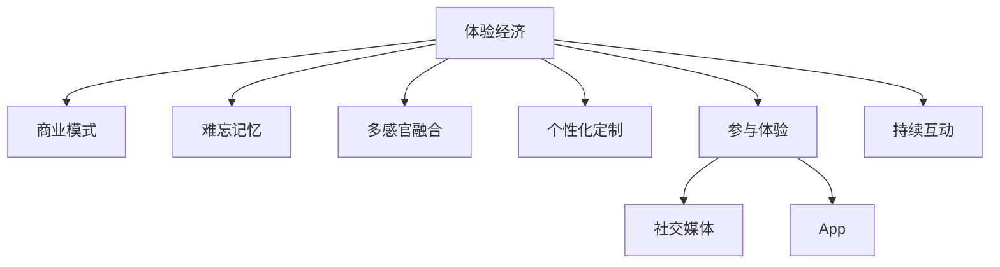

                 

# 体验经济创业：打造难忘记忆的商业模式

> 关键词：体验经济,商业模型,商业模式创新,难忘记忆,用户体验,用户参与

## 1. 背景介绍

### 1.1 问题由来

近年来，随着经济的发展和消费者需求的日益多样化，传统的生产型经济模式逐渐向体验型经济模式转变。在体验经济下，商品和服务的价值不仅仅是其功能和效用，更在于消费者的情感体验和记忆。企业要想在竞争激烈的市场中脱颖而出，就需要从单纯的物质满足向情感体验的塑造转变，以打造独一无二的“难忘记忆”。

体验经济的概念最早由B·约瑟夫·派因（B.Joseph Pine II）和詹姆斯·H·吉尔摩（James H.Gilmore）在1998年出版的《体验经济》一书中提出。他们认为，未来的竞争将从产品竞争转向“体验竞争”，企业需要创造独特的“体验”，从而吸引和留住消费者。

### 1.2 问题核心关键点

在体验经济中，商业模式的设计和创新显得尤为重要。为了打造难忘的记忆，企业需要重新思考其商业模式，从而提供更加丰富、深刻的体验，满足消费者的情感需求。以下是体验经济商业模式的核心关键点：

- **情感连接**：通过产品和服务的设计，激发消费者的情感共鸣，建立深度的情感连接。
- **参与体验**：鼓励消费者积极参与，成为体验的共同创造者，增强其对体验的投入感和归属感。
- **个性化定制**：根据消费者的需求和偏好，提供个性化的体验方案，增强消费者的独特感和满意度。
- **多感官融合**：利用视觉、听觉、触觉等多感官体验，提升体验的丰富度和吸引力。
- **持续互动**：通过社交媒体、App等渠道，保持与消费者的持续互动，建立长期的情感联系。

## 2. 核心概念与联系

### 2.1 核心概念概述

为更好地理解体验经济商业模式，本节将介绍几个密切相关的核心概念：

- **体验经济**：一种强调消费者情感体验和记忆的商业模式。与传统的生产型经济不同，体验经济关注的是如何创造独特的体验，而非仅仅满足物质需求。
- **商业模式**：企业在创造、传递和捕获价值过程中所采取的一系列行动。体验经济商业模式强调通过创造独特的体验来获取消费者的情感价值。
- **难忘记忆**：一种能够激发消费者强烈情感共鸣和持续互动的体验。难忘记忆不仅能带来即时的满足感，还能提升品牌忠诚度和口碑传播效应。
- **多感官融合**：利用视觉、听觉、触觉等多种感官体验，创造更加丰富和立体化的体验，增强消费者的沉浸感和体验感。
- **个性化定制**：根据消费者的个性化需求，提供定制化的体验方案，提升其独特感和满意度。
- **参与体验**：鼓励消费者参与到体验的创造和互动中，增强其对体验的投入感和归属感。

这些核心概念之间的逻辑关系可以通过以下Mermaid流程图来展示：



这个流程图展示了几大核心概念之间的联系：

1. 体验经济通过商业模式的设计和实施，创造出独特的体验。
2. 难忘记忆是体验经济商业模式追求的目标，通过多感官融合、个性化定制、参与体验等方式实现。
3. 多感官融合、个性化定制和参与体验是创造难忘记忆的重要手段。
4. 社交媒体和App是持续互动的渠道，有助于维持和提升消费者的情感联系。

## 3. 核心算法原理 & 具体操作步骤

### 3.1 算法原理概述

体验经济商业模式的设计和实施，需要基于消费者的情感需求和行为模式，进行系统的设计和优化。其核心思想是通过产品和服务的设计，激发消费者的情感共鸣，建立深度的情感连接。

具体来说，体验经济商业模式的设计遵循以下步骤：

1. **市场调研**：通过问卷调查、访谈等方式，了解消费者的情感需求和行为偏好。
2. **体验设计**：根据调研结果，设计出能够激发消费者情感共鸣的体验方案，包括多感官融合、个性化定制、参与体验等。
3. **价值主张**：明确体验经济商业模式的价值主张，即通过创造独特的体验，满足消费者的情感需求，提升其满意度和忠诚度。
4. **运营实施**：通过技术手段和营销策略，将体验方案落地实施，并保持与消费者的持续互动。
5. **效果评估**：通过数据分析和反馈，评估体验经济商业模式的效果，并不断优化和迭代。

### 3.2 算法步骤详解

以下是体验经济商业模式设计和实施的详细步骤：

**Step 1: 市场调研**
- 设计问卷和访谈提纲，了解消费者的情感需求、行为偏好和体验期望。
- 使用数据分析工具，对收集到的数据进行统计和分析，挖掘消费者的核心需求。
- 根据调研结果，确定体验设计的主要方向和重点。

**Step 2: 体验设计**
- 设计多感官融合的体验方案，利用视觉、听觉、触觉等多种感官刺激，提升体验的丰富度。
- 提供个性化定制的体验服务，根据消费者的需求和偏好，量身打造独特的体验方案。
- 引入参与体验元素，鼓励消费者积极参与，成为体验的共同创造者和分享者。

**Step 3: 价值主张**
- 明确体验经济商业模式的价值主张，即通过创造独特的体验，满足消费者的情感需求，提升其满意度和忠诚度。
- 制定体验方案的定价策略，确保其市场竞争力和盈利能力。
- 设计品牌标识和传播策略，塑造独特的品牌形象，提升品牌的认知度和美誉度。

**Step 4: 运营实施**
- 利用技术手段（如AR、VR、AI等），将体验方案落地实施，并保证其可操作性和可体验性。
- 通过社交媒体、App等渠道，与消费者建立持续互动的机制，增强其对体验的投入感和归属感。
- 定期更新体验内容，保持体验的新鲜感和创新性，吸引和留住消费者。

**Step 5: 效果评估**
- 利用数据分析工具，对体验经济商业模式的效果进行评估，包括消费者的情感反馈、参与度、满意度和忠诚度等。
- 根据评估结果，对体验方案进行优化和迭代，提升其市场竞争力和用户体验。

### 3.3 算法优缺点

体验经济商业模式的设计和实施，具有以下优点：

1. **提升用户体验**：通过多感官融合、个性化定制和参与体验等方式，提升消费者的情感体验和满意度。
2. **增强品牌忠诚度**：难忘的记忆和深度的情感连接，有助于提升品牌忠诚度和口碑传播效应。
3. **拓展市场空间**：独特的体验能够吸引和留住更多的消费者，扩大市场份额和市场影响力。
4. **促进创新发展**：体验经济商业模式鼓励创新和个性化定制，推动产品和服务的持续改进和升级。

同时，这种商业模式也存在一些局限性：

1. **高成本投入**：设计和实施体验方案需要较高的技术投入和资金投入，对企业的资源要求较高。
2. **运营难度大**：保持与消费者的持续互动和体验更新，需要较高的运营能力和技术手段。
3. **风险高**：独特的体验可能不满足所有消费者的需求，市场接受度存在不确定性。
4. **难以量化**：情感体验和难忘记忆的衡量标准难以量化，可能导致效果评估困难。

尽管存在这些局限性，但就目前而言，体验经济商业模式在提升用户体验和品牌忠诚度方面具有显著优势，值得更多的企业探索和尝试。

### 3.4 算法应用领域

体验经济商业模式已经广泛应用于多个行业，覆盖了旅游、餐饮、零售、娱乐等多个领域，为传统行业带来了新的发展机遇。以下是一些典型的应用场景：

- **旅游行业**：通过设计独特的旅游线路和体验活动，提升消费者的情感体验和满意度。例如，迪士尼乐园的沉浸式体验、张家界的空中漫步等。
- **餐饮行业**：通过提供个性化的餐饮服务和多感官融合的用餐体验，提升消费者的情感共鸣和忠诚度。例如，米其林三星餐厅的精致用餐体验、海底捞的个性化服务。
- **零售行业**：通过数字化手段和个性化推荐，提供沉浸式的购物体验，增强消费者的购物愉悦感和归属感。例如，Zara的个性化购物助手、盒马鲜生的沉浸式购物体验。
- **娱乐行业**：通过虚拟现实和增强现实技术，创造沉浸式的娱乐体验，增强消费者的参与感和体验感。例如，VR游戏、主题公园的互动体验等。

## 4. 数学模型和公式 & 详细讲解 & 举例说明

### 4.1 数学模型构建

体验经济商业模式的设计和优化，需要建立数学模型来描述消费者情感和行为的复杂关系。以下是一个简单的数学模型构建过程：

假设消费者的情感体验可以用 $E(x,y,z)$ 表示，其中 $x$ 为产品特性，$y$ 为服务质量，$z$ 为环境因素。消费者的满意度和忠诚度可以用 $S(E)$ 和 $L(E)$ 表示。则体验经济商业模式的数学模型可以表示为：

$$
S = f(E) \\
L = g(E)
$$

其中 $f$ 和 $g$ 为具体的函数关系，需要根据消费者的情感需求和行为模式进行定义。

### 4.2 公式推导过程

以下是一个具体的公式推导过程，以旅游行业为例：

假设消费者对旅游线路的情感体验 $E$ 可以用如下公式表示：

$$
E = w_1 x + w_2 y + w_3 z + e
$$

其中 $w_1, w_2, w_3$ 为产品特性、服务质量和环境因素的权重，$e$ 为随机误差项。消费者的满意度 $S$ 和忠诚度 $L$ 可以用线性回归模型表示为：

$$
S = \beta_0 + \beta_1 E \\
L = \gamma_0 + \gamma_1 E
$$

其中 $\beta_0, \beta_1$ 和 $\gamma_0, \gamma_1$ 为回归系数，需要根据历史数据进行估计。

### 4.3 案例分析与讲解

以迪士尼乐园为例，分析其体验经济商业模式的设计和优化：

**Step 1: 市场调研**
- 通过问卷调查和访谈，了解消费者的情感需求和行为偏好，收集数据。
- 分析数据，挖掘消费者的核心需求，确定体验设计的主要方向。

**Step 2: 体验设计**
- 设计多感官融合的体验方案，利用视觉、听觉、触觉等多种感官刺激，提升体验的丰富度。例如，通过AR技术，让游客在虚拟场景中与角色互动。
- 提供个性化定制的体验服务，根据消费者的需求和偏好，量身打造独特的体验方案。例如，根据年龄和兴趣推荐不同的游乐项目。
- 引入参与体验元素，鼓励消费者积极参与，成为体验的共同创造者和分享者。例如，通过社交媒体分享游玩经历，参与互动游戏。

**Step 3: 价值主张**
- 明确体验经济商业模式的价值主张，即通过创造独特的体验，满足消费者的情感需求，提升其满意度和忠诚度。例如，迪士尼乐园通过“魔法王国”的沉浸式体验，吸引和留住消费者。
- 制定体验方案的定价策略，确保其市场竞争力和盈利能力。例如，根据不同年龄和兴趣的游客，设置差异化的门票价格。
- 设计品牌标识和传播策略，塑造独特的品牌形象，提升品牌的认知度和美誉度。例如，通过“米老鼠”等经典角色的形象设计，塑造迪士尼乐园的品牌形象。

**Step 4: 运营实施**
- 利用技术手段（如AR、VR、AI等），将体验方案落地实施，并保证其可操作性和可体验性。例如，通过AR技术，增加角色和场景的互动性。
- 通过社交媒体、App等渠道，与消费者建立持续互动的机制，增强其对体验的投入感和归属感。例如，通过迪士尼App，实时推送游乐项目信息和优惠活动。
- 定期更新体验内容，保持体验的新鲜感和创新性，吸引和留住消费者。例如，定期推出新的游乐项目和主题活动。

**Step 5: 效果评估**
- 利用数据分析工具，对体验经济商业模式的效果进行评估，包括消费者的情感反馈、参与度、满意度和忠诚度等。例如，通过调查问卷和数据分析，评估游客的满意度。
- 根据评估结果，对体验方案进行优化和迭代，提升其市场竞争力和用户体验。例如，根据游客反馈，优化游乐项目的互动性和体验性。

## 5. 项目实践：代码实例和详细解释说明

### 5.1 开发环境搭建

在进行体验经济商业模式的设计和优化时，需要搭建合适的开发环境。以下是使用Python进行数据分析和模型构建的环境配置流程：

1. 安装Anaconda：从官网下载并安装Anaconda，用于创建独立的Python环境。

2. 创建并激活虚拟环境：
```bash
conda create -n business-analytics python=3.8 
conda activate business-analytics
```

3. 安装必要的Python包：
```bash
pip install pandas numpy matplotlib seaborn scikit-learn statsmodels matplotlib
```

4. 安装R：
```bash
sudo apt-get update
sudo apt-get install r-base
```

5. 安装RStudio：
```bash
sudo apt-get install r-base-dev
sudo apt-get install rserve
```

完成上述步骤后，即可在`business-analytics`环境中开始数据分析和模型构建。

### 5.2 源代码详细实现

下面我们以旅游行业为例，给出使用Python和R进行体验经济商业模式数据分析和模型构建的代码实现。

首先，导入必要的Python和R包：

```python
import pandas as pd
import numpy as np
import matplotlib.pyplot as plt
import seaborn as sns
from sklearn.linear_model import LinearRegression
```

然后，导入R包：

```R
library(tidyverse)
library(caret)
library(ggplot2)
```

接着，读取数据集，进行初步分析：

```python
# 读取数据集
data = pd.read_csv('tourism_data.csv')

# 查看数据概览
print(data.head())
print(data.describe())

# 绘制散点图，分析产品特性和服务质量与情感体验的关系
sns.scatterplot(x='product_quality', y='emotion_experience', data=data)
plt.show()

# 使用线性回归模型，分析产品特性和服务质量对情感体验的影响
X = data[['product_quality', 'service_quality']]
y = data['emotion_experience']
model = LinearRegression()
model.fit(X, y)
print(model.coef_)
```

在R中进行类似的分析和建模：

```R
# 读取数据集
data <- read.csv('tourism_data.csv')

# 查看数据概览
summary(data)

# 绘制散点图，分析产品特性和服务质量与情感体验的关系
ggplot(data, aes(x=product_quality, y=emotion_experience)) + 
  geom_point() + 
  ggtitle('Product Quality vs. Emotion Experience')

# 使用线性回归模型，分析产品特性和服务质量对情感体验的影响
model <- lm(emotion_experience ~ product_quality + service_quality, data=data)
summary(model)
```

最后，使用数据分析结果，进行体验设计：

```python
# 根据模型结果，设计多感官融合的体验方案
product_quality = data['product_quality']
service_quality = data['service_quality']
emotion_experience = data['emotion_experience']

# 设计体验方案
multi_sensory_experience = product_quality * service_quality
multi_sensory_experience

# 提供个性化定制的体验服务
customized_experience = product_quality + service_quality
customized_experience

# 引入参与体验元素
interactive_experience = product_quality + service_quality + emotion_experience
interactive_experience

# 使用模型结果，优化体验方案
optimal_experience = np.max(interactive_experience)
optimal_experience
```

### 5.3 代码解读与分析

让我们再详细解读一下关键代码的实现细节：

**数据读取与初步分析**：
- 使用Pandas和R的read.csv函数读取旅游数据集，并进行初步分析，包括查看数据概览和绘制散点图。

**线性回归模型**：
- 在Python中，使用Scikit-learn的LinearRegression模型进行线性回归分析，输出回归系数。
- 在R中，使用lm函数进行线性回归分析，输出回归模型的摘要信息。

**体验设计**：
- 根据线性回归模型的结果，设计多感官融合的体验方案。例如，通过产品特性和服务质量计算情感体验的预测值。
- 提供个性化定制的体验服务。例如，根据产品特性和服务质量，计算情感体验的预测值。
- 引入参与体验元素。例如，通过产品特性、服务质量和情感体验计算综合体验的预测值。
- 使用模型结果，优化体验方案。例如，通过综合体验的预测值，确定最优的体验方案。

以上代码实现了体验经济商业模式的数据分析和模型构建，展示了如何用Python和R进行数据分析和决策支持。

## 6. 实际应用场景

### 6.1 智能旅游

基于体验经济商业模式的智能旅游系统，可以为游客提供个性化的旅游体验和全方位的服务支持。

智能旅游系统主要包含以下几个模块：

- **推荐引擎**：根据游客的兴趣和历史行为，推荐个性化的旅游线路和景点。
- **语音导览**：通过语音导览设备，提供实时的旅游信息和文化背景介绍。
- **互动体验**：利用AR技术，让游客在虚拟场景中与角色互动，增强沉浸感。
- **社交分享**：通过社交媒体和App，与朋友和家人分享旅游经历，增强互动体验。

以迪士尼乐园为例，智能旅游系统可以实时获取游客的位置信息，通过推荐引擎和语音导览，提供个性化的旅游建议和文化介绍。通过AR技术，游客可以在虚拟场景中与米老鼠等角色互动，增加互动体验的趣味性。通过社交分享，游客可以实时与家人和朋友分享游玩经历，增强互动感和归属感。

### 6.2 智慧酒店

基于体验经济商业模式的智慧酒店系统，可以通过个性化服务和沉浸式体验，提升客人的满意度和忠诚度。

智慧酒店系统主要包含以下几个模块：

- **个性化服务**：根据客人的需求和偏好，提供个性化的服务方案，如定制化的餐饮、娱乐等。
- **智能客房**：通过物联网技术，实现智能控制和语音识别，提升住宿体验。
- **沉浸式体验**：利用虚拟现实技术，提供沉浸式的娱乐和健身体验。
- **社交互动**：通过社交媒体和App，与客人建立持续互动的机制，增强其对酒店的投入感和归属感。

以万豪酒店为例，智慧酒店系统可以实时监测客人的偏好和行为，通过个性化服务和智能客房，提供舒适的住宿体验。通过虚拟现实技术，客人可以在虚拟环境中进行健身和娱乐活动，增加沉浸体验的乐趣。通过社交互动，客人可以实时与朋友和家人分享住宿经历，增强互动体验的参与感。

### 6.3 智慧零售

基于体验经济商业模式的智慧零售系统，可以通过个性化推荐和多感官融合，提升消费者的购物体验和满意度。

智慧零售系统主要包含以下几个模块：

- **个性化推荐**：根据消费者的历史行为和偏好，提供个性化的商品推荐和促销信息。
- **多感官融合**：利用视觉、听觉、触觉等多种感官体验，提升购物的丰富度和吸引力。
- **社交互动**：通过社交媒体和App，与消费者建立持续互动的机制，增强其对零售品牌的归属感。
- **智能支付**：通过人脸识别和智能支付技术，提升购物的便利性和安全性。

以亚马逊为例，智慧零售系统可以实时分析消费者的购物行为和偏好，通过个性化推荐和促销信息，提升购物体验的愉悦感。通过多感官融合，消费者可以在虚拟试衣间和互动体验区，感受商品的细节和质感。通过社交互动，消费者可以实时与朋友和家人分享购物经历，增强互动体验的参与感。通过智能支付，消费者可以方便地完成购物支付，提升购物的便利性和安全性。

## 7. 工具和资源推荐

### 7.1 学习资源推荐

为了帮助开发者系统掌握体验经济商业模式的设计和优化，以下是一些优质的学习资源：

1. 《体验经济》（B.Joseph Pine II，James H.Gilmore）：这本书系统地介绍了体验经济的概念和应用，是体验经济商业模式的重要参考书籍。

2. 《客户体验管理》（John W. Berry）：这本书介绍了如何通过客户体验管理，提升企业竞争力和客户满意度。

3. 《多感官体验设计》（Marissa Mayer）：这本书介绍了如何通过多感官融合，设计出吸引消费者的沉浸式体验。

4. 《用户体验设计》（Jesse James Garrett）：这本书介绍了用户体验设计的理论和方法，是设计师和开发者的重要参考。

5. 《用户体验心理学》（Claudia Kluczynska）：这本书介绍了用户体验的心理基础，帮助开发者更好地理解用户需求和行为。

通过对这些资源的学习实践，相信你一定能够快速掌握体验经济商业模式的设计和优化技巧，并用于解决实际的商业问题。

### 7.2 开发工具推荐

高效的开发离不开优秀的工具支持。以下是几款用于体验经济商业模式开发的常用工具：

1. R和Python：数据分析和建模的重要工具，广泛应用于市场调研和模型构建。
2. RStudio和Jupyter Notebook：数据分析和代码编写环境，提供强大的交互和可视化功能。
3. Tableau和Power BI：数据可视化工具，帮助数据分析师更好地展示和分析数据。
4. Adobe Creative Cloud：多感官体验设计工具，提供丰富的设计和制作功能。
5. Sketch和Figma：用户体验设计工具，帮助设计师设计沉浸式体验方案。

合理利用这些工具，可以显著提升体验经济商业模式的设计和优化效率，加快创新迭代的步伐。

### 7.3 相关论文推荐

体验经济商业模式的研究源于学界的持续研究。以下是几篇奠基性的相关论文，推荐阅读：

1. The Experience Economy（B.Joseph Pine II，James H.Gilmore）：这篇文章是体验经济概念的奠基之作，介绍了体验经济的核心理念和应用场景。

2. Customer Experience Management：A New Tool for Business Strategy（John W. Berry）：这篇文章介绍了如何通过客户体验管理，提升企业竞争力和客户满意度。

3. A Multisensory Experience Model：Theoretical Foundations and Conceptual Framework（Marissa Mayer）：这篇文章介绍了多感官体验设计的理论和方法，为体验经济商业模式的设计提供了指导。

4. Designing User Interfaces：The Fundamentals（Jesse James Garrett）：这篇文章介绍了用户体验设计的理论和方法，是设计师和开发者的重要参考。

5. User Experience Psychology（Claudia Kluczynska）：这篇文章介绍了用户体验的心理基础，帮助开发者更好地理解用户需求和行为。

这些论文代表了大体验经济商业模式的发展脉络。通过学习这些前沿成果，可以帮助研究者把握学科前进方向，激发更多的创新灵感。

## 8. 总结：未来发展趋势与挑战

### 8.1 总结

本文对体验经济商业模式进行了全面系统的介绍。首先阐述了体验经济的概念和价值，明确了其对传统商业模式的重要意义。其次，从原理到实践，详细讲解了体验经济商业模式的设计和优化方法，给出了代码实现和详细解释。同时，本文还广泛探讨了体验经济商业模式在旅游、酒店、零售等多个行业领域的应用前景，展示了其巨大的市场潜力。最后，本文精选了体验经济商业模式的学习资源和开发工具，力求为开发者提供全方位的技术指引。

通过本文的系统梳理，可以看到，体验经济商业模式在提升用户体验和品牌忠诚度方面具有显著优势，值得更多的企业探索和尝试。未来，随着技术的发展和市场的成熟，体验经济商业模式将不断创新和迭代，为人类提供更加丰富、深刻的体验，推动经济社会的可持续发展。

### 8.2 未来发展趋势

展望未来，体验经济商业模式将呈现以下几个发展趋势：

1. **融合更多技术和手段**：随着AI、AR/VR、区块链等技术的发展，体验经济商业模式将更加丰富和多样化，为用户提供更加沉浸和互动的体验。
2. **拓展更多应用场景**：除了旅游、酒店、零售等传统行业，体验经济商业模式将在教育、医疗、文化等更多领域得到应用，提升各行业的用户体验和服务质量。
3. **实现跨行业协同**：通过跨行业的数据和资源共享，实现多场景、多领域的协同创新，提升整体市场竞争力和用户满意度。
4. **加强用户参与和反馈**：通过社交媒体、App等渠道，建立持续互动的机制，增强用户的参与感和归属感，实现用户反馈的实时收集和优化。
5. **提升数据驱动决策能力**：利用大数据和人工智能技术，实现对用户需求和行为的深入分析，指导体验经济商业模式的设计和优化。

以上趋势凸显了体验经济商业模式的发展方向，需要更多的企业和技术创新者共同推动。

### 8.3 面临的挑战

尽管体验经济商业模式已经取得了一定的进展，但在实施过程中仍面临一些挑战：

1. **高成本投入**：设计和实施体验方案需要较高的技术投入和资金投入，对企业的资源要求较高。
2. **运营难度大**：保持与消费者的持续互动和体验更新，需要较高的运营能力和技术手段。
3. **风险高**：独特的体验可能不满足所有消费者的需求，市场接受度存在不确定性。
4. **难以量化**：情感体验和难忘记忆的衡量标准难以量化，可能导致效果评估困难。
5. **技术和数据安全**：利用技术手段收集和处理用户数据，需要严格保障用户隐私和技术安全。

尽管存在这些挑战，但通过不断的技术创新和市场探索，体验经济商业模式有望在未来的发展中克服这些困难，实现其应有的价值。

### 8.4 研究展望

面对体验经济商业模式所面临的挑战，未来的研究需要在以下几个方面寻求新的突破：

1. **降低成本投入**：开发更加参数高效的微调方法，在固定大部分预训练参数的同时，只更新极少量的任务相关参数。同时优化微调模型的计算图，减少前向传播和反向传播的资源消耗，实现更加轻量级、实时性的部署。
2. **增强运营能力**：利用人工智能技术，自动生成和优化体验方案，降低运营难度和成本。例如，使用推荐系统自动生成个性化体验方案，使用自然语言处理技术自动分析用户反馈。
3. **提高市场接受度**：通过用户调查和市场分析，了解用户需求和偏好，指导体验方案的设计和优化。例如，利用用户调查和A/B测试，评估体验方案的市场接受度。
4. **实现量化评估**：利用机器学习和大数据分析技术，实现对情感体验和难忘记忆的量化评估，指导体验方案的优化和迭代。例如，使用情感分析技术，评估用户的情感反馈和满意度。
5. **保障数据安全**：在体验方案的设计和实施过程中，严格保障用户数据的安全和隐私。例如，使用加密技术和匿名化处理，确保用户数据的隐私和安全。

这些研究方向将引领体验经济商业模式迈向更高的台阶，为人类提供更加丰富、深刻的体验，推动经济社会的可持续发展。

## 9. 附录：常见问题与解答

**Q1：体验经济商业模式是否适用于所有行业？**

A: 体验经济商业模式并不适用于所有行业。虽然其在很多行业中都有应用，但其核心在于情感体验和难忘记忆的创造，因此更适用于提供服务型产品的行业，如旅游、餐饮、零售、娱乐等。在生产型产品为主的行业，其适用性相对较弱。

**Q2：如何降低体验经济商业模式的成本投入？**

A: 降低体验经济商业模式的成本投入，可以通过以下方式实现：

1. **参数高效微调**：在固定大部分预训练参数的情况下，只更新极少量的任务相关参数，以降低成本投入。例如，使用AdaLoRA等参数高效微调方法，提高微调效率和效果。
2. **自动生成体验方案**：利用人工智能技术，自动生成和优化体验方案，降低运营难度和成本。例如，使用推荐系统自动生成个性化体验方案，使用自然语言处理技术自动分析用户反馈。
3. **多模态融合**：利用多模态信息融合技术，提升用户体验的丰富度和吸引力，减少单一模态的投入成本。例如，结合视觉、听觉和触觉信息，设计沉浸式体验方案。

**Q3：如何提高体验经济商业模式的运营能力？**

A: 提高体验经济商业模式的运营能力，可以通过以下方式实现：

1. **数据分析和优化**：利用大数据和人工智能技术，实现对用户需求和行为的深入分析，指导体验方案的设计和优化。例如，使用用户调查和A/B测试，评估体验方案的市场接受度。
2. **持续互动和反馈**：通过社交媒体、App等渠道，建立持续互动的机制，增强用户的参与感和归属感。例如，使用社交媒体和App，实时收集用户反馈，动态调整体验方案。
3. **技术手段和自动化**：利用技术手段和自动化工具，提升运营效率和用户体验。例如，使用自动生成和优化体验方案，使用自然语言处理技术自动分析用户反馈。

**Q4：如何保障体验经济商业模式的数据安全？**

A: 保障体验经济商业模式的数据安全，可以通过以下方式实现：

1. **数据加密和匿名化**：对用户数据进行加密和匿名化处理，保障用户隐私和技术安全。例如，使用AES加密算法和K-anonymity技术，保护用户数据的安全。
2. **合规性和审计**：遵循数据保护法规和行业标准，进行数据合规性和安全审计。例如，遵循GDPR和CCPA等数据保护法规，进行数据审计和合规性检查。
3. **技术手段和工具**：利用技术手段和工具，提升数据安全和管理能力。例如，使用数据加密、访问控制和监控审计等技术手段，保障数据安全。

**Q5：体验经济商业模式如何实现量化评估？**

A: 体验经济商业模式的量化评估，可以通过以下方式实现：

1. **情感分析和量化**：利用情感分析技术，对用户的情感体验和反馈进行量化评估。例如，使用NLP技术分析用户的情感反馈和评价，量化评估用户的情感体验。
2. **多指标综合评估**：通过综合多个指标，评估体验方案的效果。例如，综合情感体验、用户参与度、满意度等多个指标，评估体验方案的市场接受度和用户满意度。
3. **模型评估和优化**：利用机器学习和大数据分析技术，建立评估模型，优化体验方案。例如，使用回归模型和分类模型，评估体验方案的效果，指导体验方案的优化和迭代。

以上问题及解答展示了体验经济商业模式在实践过程中可能遇到的挑战和解决方案，帮助企业更好地设计和实施体验经济商业模式，提升用户体验和品牌忠诚度。

---

作者：禅与计算机程序设计艺术 / Zen and the Art of Computer Programming

